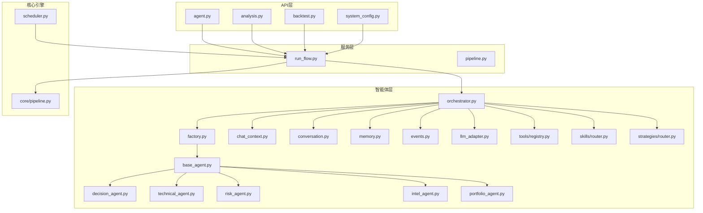
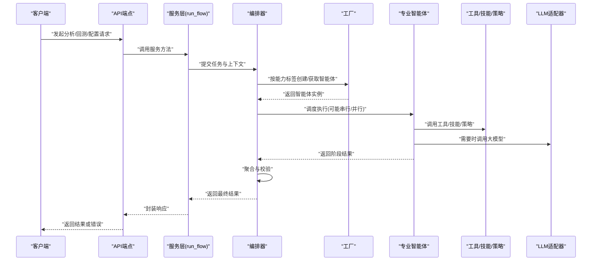
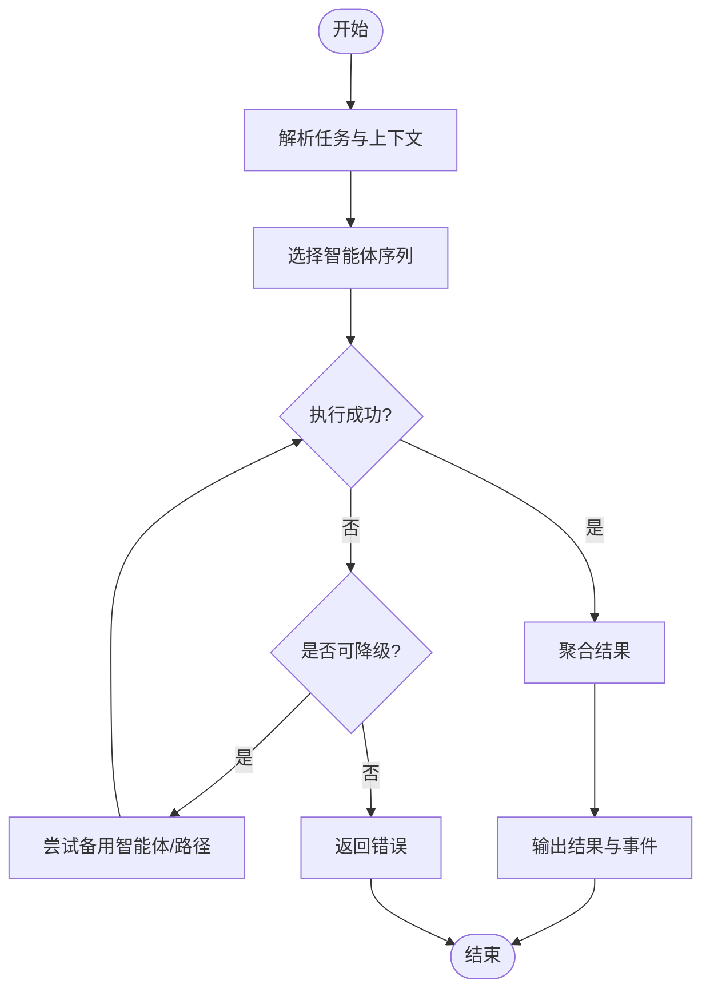
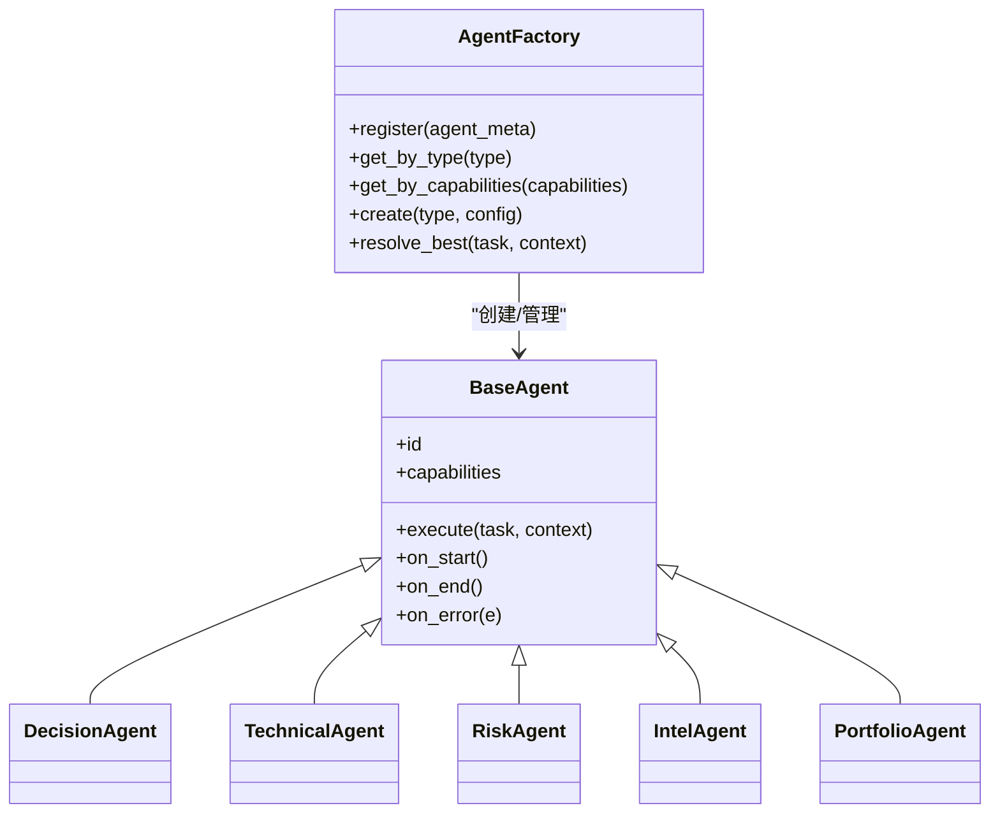
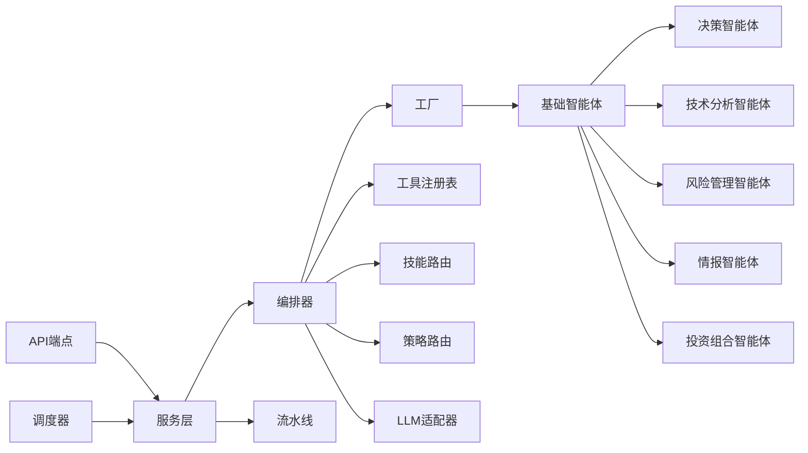

# AI智能体系统

<cite>
**本文档引用的文件**   
- [src/agent/orchestrator.py](file://src/agent/orchestrator.py)
- [src/agent/factory.py](file://src/agent/factory.py)
- [src/agent/base_agent.py](file://src/agent/base_agent.py)
- [src/agent/decision_agent.py](file://src/agent/decision_agent.py)
- [src/agent/technical_agent.py](file://src/agent/technical_agent.py)
- [src/agent/risk_agent.py](file://src/agent/risk_agent.py)
- [src/agent/intel_agent.py](file://src/agent/intel_agent.py)
- [src/agent/portfolio_agent.py](file://src/agent/portfolio_agent.py)
- [src/agent/chat_context.py](file://src/agent/chat_context.py)
- [src/agent/conversation.py](file://src/agent/conversation.py)
- [src/agent/memory.py](file://src/agent/memory.py)
- [src/agent/events.py](file://src/agent/events.py)
- [src/agent/executor.py](file://src/agent/executor.py)
- [src/agent/runner.py](file://src/agent/runner.py)
- [src/agent/llm_adapter.py](file://src/agent/llm_adapter.py)
- [src/agent/tools/registry.py](file://src/agent/tools/registry.py)
- [src/agent/skills/router.py](file://src/agent/skills/router.py)
- [src/agent/strategies/router.py](file://src/agent/strategies/router.py)
- [api/v1/endpoints/agent.py](file://api/v1/endpoints/agent.py)
- [api/v1/endpoints/analysis.py](file://api/v1/endpoints/analysis.py)
- [api/v1/endpoints/backtest.py](file://api/v1/endpoints/backtest.py)
- [api/v1/endpoints/system_config.py](file://api/v1/endpoints/system_config.py)
- [src/services/run_flow.py](file://src/services/run_flow.py)
- [src/core/pipeline.py](file://src/core/pipeline.py)
- [src/scheduler.py](file://src/scheduler.py)
- [tests/test_multi_agent.py](file://tests/test_multi_agent.py)
- [tests/test_agent_orchestrator_sniper_fallback.py](file://tests/test_agent_orchestrator_sniper_fallback.py)
- [tests/test_agent_registry.py](file://tests/test_agent_registry.py)
</cite>

## 目录
1. [简介](#简介)
2. [项目结构](#项目结构)
3. [核心组件](#核心组件)
4. [架构总览](#架构总览)
5. [详细组件分析](#详细组件分析)
6. [依赖关系分析](#依赖关系分析)
7. [性能考量](#性能考量)
8. [故障排查指南](#故障排查指南)
9. [结论](#结论)
10. [附录](#附录)

## 简介
本文件面向AI智能体系统的多智能体协作架构，系统性阐述决策智能体、技术分析智能体、风险管理智能体等专业化智能体的职责与协作机制。文档覆盖智能体的生命周期管理、上下文管理、消息传递机制、注册与发现、调度算法，并提供开发指南、自定义智能体创建与测试方法，以及监控与调试工具使用说明。目标是帮助读者快速理解并高效扩展该智能体系统。

## 项目结构
系统采用分层模块化设计：
- API层：对外暴露REST接口，路由到服务层与智能体编排器。
- 服务层：封装业务逻辑（如运行流、回测、分析）。
- 智能体层：定义基础智能体、专业智能体、技能与策略路由器、工具注册表、事件与内存、LLM适配器等。
- 核心引擎：流水线、定时调度、市场分析与回测引擎。
- 前端应用：Web与桌面端用于交互与可视化。

图表来源
- [api/v1/endpoints/agent.py](file://api/v1/endpoints/agent.py)
- [api/v1/endpoints/analysis.py](file://api/v1/endpoints/analysis.py)
- [api/v1/endpoints/backtest.py](file://api/v1/endpoints/backtest.py)
- [api/v1/endpoints/system_config.py](file://api/v1/endpoints/system_config.py)
- [src/services/run_flow.py](file://src/services/run_flow.py)
- [src/core/pipeline.py](file://src/core/pipeline.py)
- [src/scheduler.py](file://src/scheduler.py)
- [src/agent/orchestrator.py](file://src/agent/orchestrator.py)
- [src/agent/factory.py](file://src/agent/factory.py)
- [src/agent/base_agent.py](file://src/agent/base_agent.py)
- [src/agent/decision_agent.py](file://src/agent/decision_agent.py)
- [src/agent/technical_agent.py](file://src/agent/technical_agent.py)
- [src/agent/risk_agent.py](file://src/agent/risk_agent.py)
- [src/agent/intel_agent.py](file://src/agent/intel_agent.py)
- [src/agent/portfolio_agent.py](file://src/agent/portfolio_agent.py)
- [src/agent/chat_context.py](file://src/agent/chat_context.py)
- [src/agent/conversation.py](file://src/agent/conversation.py)
- [src/agent/memory.py](file://src/agent/memory.py)
- [src/agent/events.py](file://src/agent/events.py)
- [src/agent/llm_adapter.py](file://src/agent/llm_adapter.py)
- [src/agent/tools/registry.py](file://src/agent/tools/registry.py)
- [src/agent/skills/router.py](file://src/agent/skills/router.py)
- [src/agent/strategies/router.py](file://src/agent/strategies/router.py)

章节来源
- [src/agent/orchestrator.py](file://src/agent/orchestrator.py)
- [src/agent/factory.py](file://src/agent/factory.py)
- [src/agent/base_agent.py](file://src/agent/base_agent.py)
- [src/services/run_flow.py](file://src/services/run_flow.py)
- [src/core/pipeline.py](file://src/core/pipeline.py)
- [src/scheduler.py](file://src/scheduler.py)

## 核心组件
- 编排器（Orchestrator）：负责任务解析、智能体选择、执行顺序编排、结果聚合与错误恢复。
- 工厂（Factory）：统一创建与管理智能体实例，支持按类型、能力标签动态装配。
- 基础智能体（BaseAgent）：定义生命周期钩子、上下文访问、消息收发、工具调用、事件发布等通用能力。
- 专业智能体：
  - 决策智能体（DecisionAgent）：综合技术面、基本面、风险信号生成交易决策。
  - 技术分析智能体（TechnicalAgent）：计算技术指标、形态识别、趋势判断。
  - 风险管理智能体（RiskAgent）：评估回撤、波动率、仓位约束、止损止盈建议。
  - 情报智能体（IntelAgent）：新闻、舆情、宏观数据整合与摘要。
  - 投资组合智能体（PortfolioAgent）：组合构建、权重优化、再平衡建议。
- 上下文与对话：聊天上下文、会话历史、记忆存储，确保跨轮次一致性。
- 事件与执行：事件总线、异步执行器、运行器，支撑并发与可观测性。
- LLM适配器：统一大模型调用、参数映射、使用量追踪与降级策略。
- 工具与技能/策略路由：工具注册表、技能路由、策略路由，实现按需调用与扩展。

章节来源
- [src/agent/orchestrator.py](file://src/agent/orchestrator.py)
- [src/agent/factory.py](file://src/agent/factory.py)
- [src/agent/base_agent.py](file://src/agent/base_agent.py)
- [src/agent/decision_agent.py](file://src/agent/decision_agent.py)
- [src/agent/technical_agent.py](file://src/agent/technical_agent.py)
- [src/agent/risk_agent.py](file://src/agent/risk_agent.py)
- [src/agent/intel_agent.py](file://src/agent/intel_agent.py)
- [src/agent/portfolio_agent.py](file://src/agent/portfolio_agent.py)
- [src/agent/chat_context.py](file://src/agent/chat_context.py)
- [src/agent/conversation.py](file://src/agent/conversation.py)
- [src/agent/memory.py](file://src/agent/memory.py)
- [src/agent/events.py](file://src/agent/events.py)
- [src/agent/executor.py](file://src/agent/executor.py)
- [src/agent/runner.py](file://src/agent/runner.py)
- [src/agent/llm_adapter.py](file://src/agent/llm_adapter.py)
- [src/agent/tools/registry.py](file://src/agent/tools/registry.py)
- [src/agent/skills/router.py](file://src/agent/skills/router.py)
- [src/agent/strategies/router.py](file://src/agent/strategies/router.py)

## 架构总览
多智能体协作通过“编排器+工厂+专业智能体”的模式实现。请求进入API后，服务层将任务交给编排器；编排器根据任务类型与上下文选择合适智能体，必要时串联多个智能体形成工作流；各智能体通过事件总线与共享上下文进行通信；最终结果由编排器聚合返回。

图表来源
- [api/v1/endpoints/agent.py](file://api/v1/endpoints/agent.py)
- [api/v1/endpoints/analysis.py](file://api/v1/endpoints/analysis.py)
- [api/v1/endpoints/backtest.py](file://api/v1/endpoints/backtest.py)
- [src/services/run_flow.py](file://src/services/run_flow.py)
- [src/agent/orchestrator.py](file://src/agent/orchestrator.py)
- [src/agent/factory.py](file://src/agent/factory.py)
- [src/agent/llm_adapter.py](file://src/agent/llm_adapter.py)
- [src/agent/tools/registry.py](file://src/agent/tools/registry.py)
- [src/agent/skills/router.py](file://src/agent/skills/router.py)
- [src/agent/strategies/router.py](file://src/agent/strategies/router.py)

## 详细组件分析

### 编排器（Orchestrator）
- 职责：任务解析、智能体选择、执行编排、结果聚合、错误恢复与降级。
- 关键流程：
  - 接收任务与上下文，解析意图与约束。
  - 基于能力标签与优先级选择智能体序列。
  - 控制串行/并行执行，收集中间结果。
  - 失败重试与备用路径（如狙击手降级）。
  - 输出标准化结果与事件日志。

图表来源
- [src/agent/orchestrator.py](file://src/agent/orchestrator.py)
- [tests/test_agent_orchestrator_sniper_fallback.py](file://tests/test_agent_orchestrator_sniper_fallback.py)

章节来源
- [src/agent/orchestrator.py](file://src/agent/orchestrator.py)
- [tests/test_agent_orchestrator_sniper_fallback.py](file://tests/test_agent_orchestrator_sniper_fallback.py)

### 工厂（Factory）
- 职责：智能体注册、发现与实例化；支持按类型、能力标签、版本与配置装配。
- 关键点：
  - 注册表维护智能体元数据（名称、能力、依赖）。
  - 动态加载与缓存实例，避免重复创建开销。
  - 提供查询接口供编排器选择最优智能体。

图表来源
- [src/agent/factory.py](file://src/agent/factory.py)
- [src/agent/base_agent.py](file://src/agent/base_agent.py)
- [src/agent/decision_agent.py](file://src/agent/decision_agent.py)
- [src/agent/technical_agent.py](file://src/agent/technical_agent.py)
- [src/agent/risk_agent.py](file://src/agent/risk_agent.py)
- [src/agent/intel_agent.py](file://src/agent/intel_agent.py)
- [src/agent/portfolio_agent.py](file://src/agent/portfolio_agent.py)

章节来源
- [src/agent/factory.py](file://src/agent/factory.py)
- [src/agent/base_agent.py](file://src/agent/base_agent.py)
- [tests/test_agent_registry.py](file://tests/test_agent_registry.py)

### 基础智能体（BaseAgent）
- 职责：定义智能体通用接口与生命周期钩子，提供上下文访问、工具调用、事件发布、日志记录。
- 关键点：
  - 生命周期：初始化、启动、执行、结束、错误处理。
  - 上下文：读写共享状态，保证线程安全。
  - 工具：通过注册表调用外部能力。
  - 事件：发布/订阅系统级事件，便于监控与调试。

章节来源
- [src/agent/base_agent.py](file://src/agent/base_agent.py)

### 专业智能体
- 决策智能体（DecisionAgent）
  - 职责：融合技术面、风险、组合信息生成交易决策（买入/卖出/持有），输出置信度与理由。
  - 输入：技术分析结果、风险评估、组合快照、市场阶段。
  - 输出：决策动作、阈值、触发条件、风险提示。
- 技术分析智能体（TechnicalAgent）
  - 职责：计算指标（均线、RSI、MACD等）、形态识别、趋势与动量判断。
  - 输入：行情数据、时间窗口、指标参数。
  - 输出：指标值、信号强度、形态描述。
- 风险管理智能体（RiskAgent）
  - 职责：评估波动率、最大回撤、VaR、仓位限制，给出风控建议。
  - 输入：历史收益、组合权重、风险偏好。
  - 输出：风险评分、止损止盈建议、仓位上限。
- 情报智能体（IntelAgent）
  - 职责：抓取与摘要新闻、舆情、宏观数据，提炼影响因子。
  - 输入：关键词、时间范围、数据源配置。
  - 输出：摘要、情绪分数、关键事件列表。
- 投资组合智能体（PortfolioAgent）
  - 职责：组合构建、权重优化、再平衡建议、绩效归因。
  - 输入：资产池、约束条件、目标收益/风险。
  - 输出：权重向量、调仓计划、预期收益与风险。

章节来源
- [src/agent/decision_agent.py](file://src/agent/decision_agent.py)
- [src/agent/technical_agent.py](file://src/agent/technical_agent.py)
- [src/agent/risk_agent.py](file://src/agent/risk_agent.py)
- [src/agent/intel_agent.py](file://src/agent/intel_agent.py)
- [src/agent/portfolio_agent.py](file://src/agent/portfolio_agent.py)

### 上下文与对话（ChatContext & Conversation）
- 聊天上下文：维护当前任务的输入、中间结果、用户偏好、系统配置。
- 对话：管理多轮会话历史、消息排序、上下文裁剪与持久化。
- 记忆：短期/长期记忆存储，支持检索与更新。

章节来源
- [src/agent/chat_context.py](file://src/agent/chat_context.py)
- [src/agent/conversation.py](file://src/agent/conversation.py)
- [src/agent/memory.py](file://src/agent/memory.py)

### 事件与执行（Events & Executor & Runner）
- 事件总线：定义事件类型、发布/订阅接口，支持过滤与路由。
- 执行器：异步任务调度、并发控制、超时与重试。
- 运行器：编排任务执行流程，收集指标与日志。

章节来源
- [src/agent/events.py](file://src/agent/events.py)
- [src/agent/executor.py](file://src/agent/executor.py)
- [src/agent/runner.py](file://src/agent/runner.py)

### LLM适配器（LLM Adapter）
- 职责：统一大模型调用、参数映射、使用量统计、降级与熔断。
- 关键点：
  - 多提供商适配（OpenAI、本地模型等）。
  - 参数模板与动态注入。
  - 用量追踪与配额管理。

章节来源
- [src/agent/llm_adapter.py](file://src/agent/llm_adapter.py)

### 工具与技能/策略路由（Tools & Skills & Strategies Router）
- 工具注册表：集中管理可用工具（数据、搜索、回测等），支持权限与限流。
- 技能路由：根据任务需求选择技能模块（如分析、修复、审查）。
- 策略路由：根据市场阶段与策略库选择执行策略。

章节来源
- [src/agent/tools/registry.py](file://src/agent/tools/registry.py)
- [src/agent/skills/router.py](file://src/agent/skills/router.py)
- [src/agent/strategies/router.py](file://src/agent/strategies/router.py)

## 依赖关系分析
- 低耦合高内聚：各智能体通过基础接口与事件总线解耦，减少直接依赖。
- 编排器为核心枢纽：协调工厂、智能体、工具、LLM适配器。
- 服务层与API层：通过清晰契约（请求/响应）与编排器交互。
- 核心引擎：流水线与调度为智能体提供基础设施。

图表来源
- [api/v1/endpoints/agent.py](file://api/v1/endpoints/agent.py)
- [src/services/run_flow.py](file://src/services/run_flow.py)
- [src/agent/orchestrator.py](file://src/agent/orchestrator.py)
- [src/agent/factory.py](file://src/agent/factory.py)
- [src/agent/base_agent.py](file://src/agent/base_agent.py)
- [src/agent/tools/registry.py](file://src/agent/tools/registry.py)
- [src/agent/skills/router.py](file://src/agent/skills/router.py)
- [src/agent/strategies/router.py](file://src/agent/strategies/router.py)
- [src/agent/llm_adapter.py](file://src/agent/llm_adapter.py)
- [src/core/pipeline.py](file://src/core/pipeline.py)
- [src/scheduler.py](file://src/scheduler.py)

章节来源
- [src/agent/orchestrator.py](file://src/agent/orchestrator.py)
- [src/agent/factory.py](file://src/agent/factory.py)
- [src/services/run_flow.py](file://src/services/run_flow.py)
- [src/core/pipeline.py](file://src/core/pipeline.py)
- [src/scheduler.py](file://src/scheduler.py)

## 性能考量
- 并发与异步：使用执行器与事件总线提升吞吐，合理设置并发度与超时。
- 缓存与复用：工厂缓存智能体实例，减少创建开销；上下文与记忆支持增量更新。
- 降级与熔断：LLM适配器与编排器支持失败回退，保障稳定性。
- 资源隔离：不同智能体任务可独立进程/线程，避免相互干扰。
- 监控与度量：事件与日志采集关键指标（延迟、错误率、资源占用）。

[本节为通用指导，不直接分析具体文件]

## 故障排查指南
- 常见问题定位：
  - 智能体未注册或发现失败：检查工厂注册表与能力标签。
  - 上下文丢失或污染：确认上下文作用域与线程安全。
  - LLM调用失败：查看适配器配置、配额与降级策略。
  - 执行超时或阻塞：调整执行器并发与超时参数。
- 调试工具：
  - 事件日志：订阅系统事件，观察智能体生命周期与消息流转。
  - 运行流快照：在服务层获取执行快照，定位瓶颈。
  - 单元测试：参考测试用例验证智能体行为与边界条件。

章节来源
- [src/agent/events.py](file://src/agent/events.py)
- [src/agent/executor.py](file://src/agent/executor.py)
- [src/agent/llm_adapter.py](file://src/agent/llm_adapter.py)
- [src/services/run_flow.py](file://src/services/run_flow.py)
- [tests/test_multi_agent.py](file://tests/test_multi_agent.py)
- [tests/test_agent_orchestrator_sniper_fallback.py](file://tests/test_agent_orchestrator_sniper_fallback.py)
- [tests/test_agent_registry.py](file://tests/test_agent_registry.py)

## 结论
本系统通过清晰的编排器-工厂-智能体架构，实现了灵活的多智能体协作。专业智能体各司其职，借助上下文、事件与工具生态完成复杂任务。配合完善的生命周期管理、调度与监控机制，系统具备良好的可扩展性与稳定性。开发者可按指南快速扩展新智能体与技能，满足多样化业务需求。

[本节为总结，不直接分析具体文件]

## 附录

### 智能体开发指南
- 步骤概览：
  - 继承基础智能体，实现execute方法与生命周期钩子。
  - 声明能力标签与依赖，向工厂注册。
  - 在技能/策略路由中配置调用规则。
  - 编写单元测试与集成测试，覆盖正常与异常路径。
- 最佳实践：
  - 保持幂等与可重试，避免副作用。
  - 合理使用上下文与记忆，避免状态泄漏。
  - 通过事件上报关键状态，便于监控。

章节来源
- [src/agent/base_agent.py](file://src/agent/base_agent.py)
- [src/agent/factory.py](file://src/agent/factory.py)
- [src/agent/skills/router.py](file://src/agent/skills/router.py)
- [src/agent/strategies/router.py](file://src/agent/strategies/router.py)
- [tests/test_multi_agent.py](file://tests/test_multi_agent.py)

### 自定义智能体创建与测试方法
- 创建：
  - 定义智能体类与能力元数据。
  - 在工厂注册表中登记，指定优先级与依赖。
  - 在编排器中选择策略中配置匹配规则。
- 测试：
  - 单元测试：模拟上下文与工具，断言输出与事件。
  - 集成测试：端到端验证编排流程与降级路径。
  - 性能测试：压测并发与资源占用，优化超时与缓存。

章节来源
- [src/agent/factory.py](file://src/agent/factory.py)
- [src/agent/orchestrator.py](file://src/agent/orchestrator.py)
- [tests/test_agent_registry.py](file://tests/test_agent_registry.py)
- [tests/test_agent_orchestrator_sniper_fallback.py](file://tests/test_agent_orchestrator_sniper_fallback.py)

### 智能体性能监控与调试工具使用说明
- 监控：
  - 事件总线订阅：捕获生命周期与错误事件。
  - 运行流快照：查看节点耗时与状态。
  - 指标采集：延迟、错误率、吞吐量、资源使用。
- 调试：
  - 日志级别调整：细化到智能体与方法级。
  - 上下文导出：序列化上下文与记忆，辅助复现问题。
  - 回放模式：重放历史事件与输入，定位根因。

章节来源
- [src/agent/events.py](file://src/agent/events.py)
- [src/services/run_flow.py](file://src/services/run_flow.py)
- [src/agent/memory.py](file://src/agent/memory.py)
- [src/agent/llm_adapter.py](file://src/agent/llm_adapter.py)