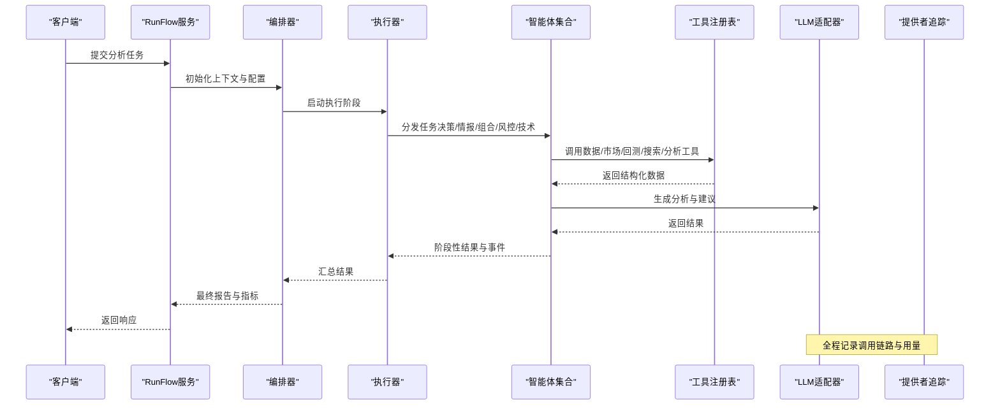
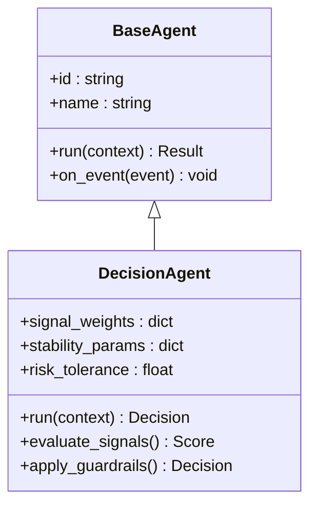
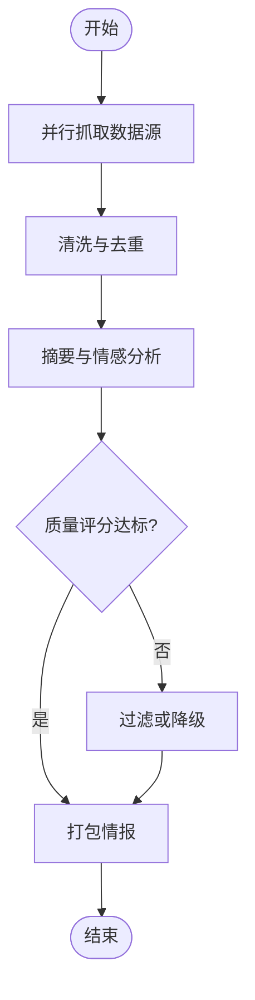
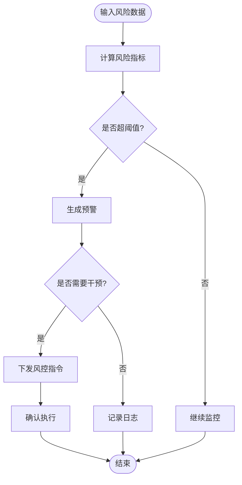
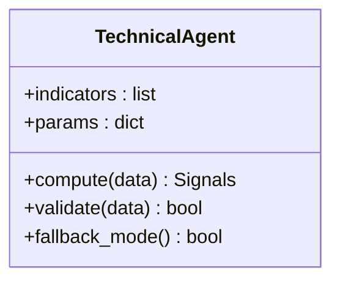
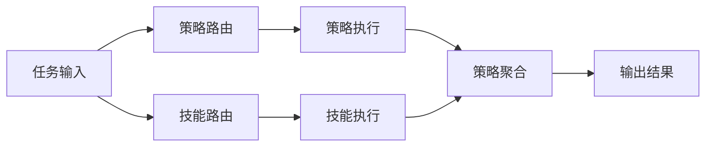
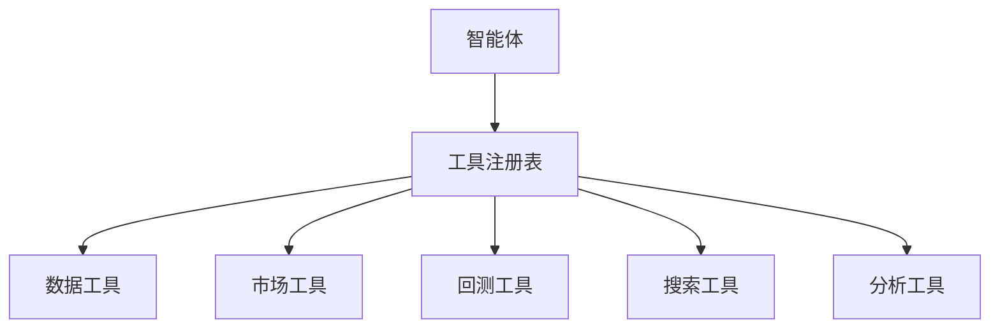
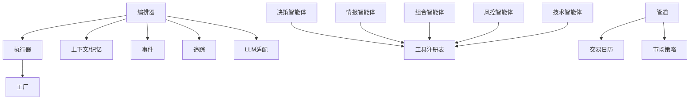

# 专业智能体

<cite>
**本文引用的文件**   
- [src/agent/orchestrator.py](file://src/agent/orchestrator.py)
- [src/agent/executor.py](file://src/agent/executor.py)
- [src/agent/factory.py](file://src/agent/factory.py)
- [src/agent/protocols.py](file://src/agent/protocols.py)
- [src/agent/chat_context.py](file://src/agent/chat_context.py)
- [src/agent/memory.py](file://src/agent/memory.py)
- [src/agent/events.py](file://src/agent/events.py)
- [src/agent/provider_trace.py](file://src/agent/provider_trace.py)
- [src/agent/research.py](file://src/agent/research.py)
- [src/agent/conversation.py](file://src/agent/conversation.py)
- [src/agent/llm_adapter.py](file://src/agent/llm_adapter.py)
- [src/agent/stock_scope.py](file://src/agent/stock_scope.py)
- [src/agent/agents/base_agent.py](file://src/agent/agents/base_agent.py)
- [src/agent/agents/decision_agent.py](file://src/agent/agents/decision_agent.py)
- [src/agent/agents/intel_agent.py](file://src/agent/agents/intel_agent.py)
- [src/agent/agents/portfolio_agent.py](file://src/agent/agents/portfolio_agent.py)
- [src/agent/agents/risk_agent.py](file://src/agent/agents/risk_agent.py)
- [src/agent/agents/technical_agent.py](file://src/agent/agents/technical_agent.py)
- [src/agent/skills/router.py](file://src/agent/skills/router.py)
- [src/agent/skills/aggregator.py](file://src/agent/skills/aggregator.py)
- [src/agent/skills/skill_agent.py](file://src/agent/skills/skill_agent.py)
- [src/agent/strategies/router.py](file://src/agent/strategies/router.py)
- [src/agent/strategies/aggregator.py](file://src/agent/strategies/aggregator.py)
- [src/agent/strategies/strategy_agent.py](file://src/agent/strategies/strategy_agent.py)
- [src/agent/tools/registry.py](file://src/agent/tools/registry.py)
- [src/agent/tools/data_tools.py](file://src/agent/tools/data_tools.py)
- [src/agent/tools/market_tools.py](file://src/agent/tools/market_tools.py)
- [src/agent/tools/backtest_tools.py](file://src/agent/tools/backtest_tools.py)
- [src/agent/tools/search_tools.py](file://src/agent/tools/search_tools.py)
- [src/agent/tools/analysis_tools.py](file://src/agent/tools/analysis_tools.py)
- [src/services/run_flow.py](file://src/services/run_flow.py)
- [src/core/pipeline.py](file://src/core/pipeline.py)
- [src/core/config_manager.py](file://src/core/config_manager.py)
- [src/core/config_registry.py](file://src/core/config_registry.py)
- [src/core/trading_calendar.py](file://src/core/trading_calendar.py)
- [src/core/market_profile.py](file://src/core/market_profile.py)
- [src/core/market_review_runtime.py](file://src/core/market_review_runtime.py)
- [src/core/market_strategy.py](file://src/core/market_strategy.py)
- [src/core/backtest_engine.py](file://src/core/backtest_engine.py)
- [src/crypto_technical.py](file://src/crypto_technical.py)
- [src/enums.py](file://src/enums.py)
</cite>

## 目录
1. [简介](#简介)
2. [项目结构](#项目结构)
3. [核心组件](#核心组件)
4. [架构总览](#架构总览)
5. [详细组件分析](#详细组件分析)
6. [依赖关系分析](#依赖关系分析)
7. [性能考量](#性能考量)
8. [故障处理指南](#故障处理指南)
9. [结论](#结论)
10. [附录](#附录)

## 简介
本文件面向“专业智能体”系统，系统化阐述决策智能体、情报智能体、投资组合智能体、风险管理智能体与技术分析智能体的职责、输入输出接口与协作机制。文档覆盖各智能体的配置参数、关键性能指标与故障处理策略，并说明智能体间的数据共享与协调方式，帮助读者快速理解与落地使用。

## 项目结构
专业智能体位于 src/agent 目录下，围绕“编排器-执行器-工厂-协议-上下文-记忆-事件-追踪-研究-对话-LLM适配-标的范围”等基础设施构建，具体智能体实现于 agents 子模块，技能与策略分别由 skills 与 strategies 子模块提供可插拔能力，工具集 tools 提供数据、市场、回测、搜索与分析等通用能力。服务层 services.run_flow 与 core.pipeline 负责端到端流程编排与运行态管理。

```mermaid
graph TB
subgraph "编排与执行"
ORCH["orchestrator.py"]
EXEC["executor.py"]
FACT["factory.py"]
PIPE["core/pipeline.py"]
RUNFLOW["services/run_flow.py"]
end
subgraph "智能体"
BASE["agents/base_agent.py"]
DEC["agents/decision_agent.py"]
INT["agents/intel_agent.py"]
PORT["agents/portfolio_agent.py"]
RISK["agents/risk_agent.py"]
TECH["agents/technical_agent.py"]
end
subgraph "技能与策略"
SKILL_R["skills/router.py"]
SKILL_A["skills/aggregator.py"]
STRAT_R["strategies/router.py"]
STRAT_A["strategies/aggregator.py"]
end
subgraph "工具集"
REG["tools/registry.py"]
DATA["tools/data_tools.py"]
MKT["tools/market_tools.py"]
BKT["tools/backtest_tools.py"]
SRCH["tools/search_tools.py"]
ANAL["tools/analysis_tools.py"]
end
subgraph "上下文与支撑"
CTX["chat_context.py"]
MEM["memory.py"]
EVT["events.py"]
TRACE["provider_trace.py"]
LLM["llm_adapter.py"]
SCOPE["stock_scope.py"]
CONV["conversation.py"]
RES["research.py"]
end
ORCH --> EXEC
EXEC --> FACT
ORCH --> PIPE
RUNFLOW --> ORCH
DEC --> BASE
INT --> BASE
PORT --> BASE
RISK --> BASE
TECH --> BASE
DEC --> SKILL_R
INT --> SKILL_R
PORT --> STRAT_R
RISK --> STRAT_R
TECH --> SKILL_R
DEC --> REG
INT --> REG
PORT --> REG
RISK --> REG
TECH --> REG
REG --> DATA
REG --> MKT
REG --> BKT
REG --> SRCH
REG --> ANAL
ORCH --> CTX
ORCH --> MEM
ORCH --> EVT
ORCH --> TRACE
ORCH --> LLM
ORCH --> SCOPE
ORCH --> CONV
ORCH --> RES
```



图表来源
- [src/agent/orchestrator.py](file://src/agent/orchestrator.py)
- [src/agent/executor.py](file://src/agent/executor.py)
- [src/agent/factory.py](file://src/agent/factory.py)
- [src/core/pipeline.py](file://src/core/pipeline.py)
- [src/services/run_flow.py](file://src/services/run_flow.py)
- [src/agent/agents/base_agent.py](file://src/agent/agents/base_agent.py)
- [src/agent/agents/decision_agent.py](file://src/agent/agents/decision_agent.py)
- [src/agent/agents/intel_agent.py](file://src/agent/agents/intel_agent.py)
- [src/agent/agents/portfolio_agent.py](file://src/agent/agents/portfolio_agent.py)
- [src/agent/agents/risk_agent.py](file://src/agent/agents/risk_agent.py)
- [src/agent/agents/technical_agent.py](file://src/agent/agents/technical_agent.py)
- [src/agent/skills/router.py](file://src/agent/skills/router.py)
- [src/agent/strategies/router.py](file://src/agent/strategies/router.py)
- [src/agent/tools/registry.py](file://src/agent/tools/registry.py)
- [src/agent/tools/data_tools.py](file://src/agent/tools/data_tools.py)
- [src/agent/tools/market_tools.py](file://src/agent/tools/market_tools.py)
- [src/agent/tools/backtest_tools.py](file://src/agent/tools/backtest_tools.py)
- [src/agent/tools/search_tools.py](file://src/agent/tools/search_tools.py)
- [src/agent/tools/analysis_tools.py](file://src/agent/tools/analysis_tools.py)
- [src/agent/chat_context.py](file://src/agent/chat_context.py)
- [src/agent/memory.py](file://src/agent/memory.py)
- [src/agent/events.py](file://src/agent/events.py)
- [src/agent/provider_trace.py](file://src/agent/provider_trace.py)
- [src/agent/llm_adapter.py](file://src/agent/llm_adapter.py)
- [src/agent/stock_scope.py](file://src/agent/stock_scope.py)
- [src/agent/conversation.py](file://src/agent/conversation.py)
- [src/agent/research.py](file://src/agent/research.py)

章节来源
- [src/agent/orchestrator.py](file://src/agent/orchestrator.py)
- [src/agent/executor.py](file://src/agent/executor.py)
- [src/agent/factory.py](file://src/agent/factory.py)
- [src/core/pipeline.py](file://src/core/pipeline.py)
- [src/services/run_flow.py](file://src/services/run_flow.py)

## 核心组件
- 编排器（Orchestrator）：统一调度多智能体工作流，管理上下文、事件、追踪与资源生命周期。
- 执行器（Executor）：按阶段执行任务，支持并发与重试，聚合结果并上报事件。
- 工厂（Factory）：根据配置动态创建智能体实例，注入工具与技能/策略路由。
- 协议（Protocols）：定义智能体抽象接口，确保输入输出契约一致。
- 上下文（Chat Context/Memory）：维护会话状态、历史消息与持久化记忆。
- 事件（Events）：标准化事件模型，贯穿运行期日志与监控。
- 追踪（Provider Trace）：记录外部调用链路与成本/时延统计。
- 研究（Research）：对外部信息源的检索与摘要能力。
- 对话（Conversation）：多轮对话管理与提示词组装。
- LLM 适配（LLM Adapter）：统一接入不同大模型提供商。
- 标的范围（Stock Scope）：限定分析标的集合与过滤规则。

章节来源
- [src/agent/protocols.py](file://src/agent/protocols.py)
- [src/agent/chat_context.py](file://src/agent/chat_context.py)
- [src/agent/memory.py](file://src/agent/memory.py)
- [src/agent/events.py](file://src/agent/events.py)
- [src/agent/provider_trace.py](file://src/agent/provider_trace.py)
- [src/agent/research.py](file://src/agent/research.py)
- [src/agent/conversation.py](file://src/agent/conversation.py)
- [src/agent/llm_adapter.py](file://src/agent/llm_adapter.py)
- [src/agent/stock_scope.py](file://src/agent/stock_scope.py)

## 架构总览
下图展示从请求进入、编排到多智能体协同、工具调用与结果汇聚的整体流程。



图表来源
- [src/services/run_flow.py](file://src/services/run_flow.py)
- [src/agent/orchestrator.py](file://src/agent/orchestrator.py)
- [src/agent/executor.py](file://src/agent/executor.py)
- [src/agent/tools/registry.py](file://src/agent/tools/registry.py)
- [src/agent/llm_adapter.py](file://src/agent/llm_adapter.py)
- [src/agent/provider_trace.py](file://src/agent/provider_trace.py)

## 详细组件分析

### 决策智能体（Decision Agent）
- 职责：基于情报、技术与风险信号，综合给出交易决策（买入/卖出/持有/观望），并输出理由与置信度。
- 输入：
  - 标的范围与时间窗口
  - 情报摘要（新闻、舆情、基本面）
  - 技术指标与形态信号
  - 风险约束与仓位上限
  - 历史决策与反馈
- 输出：
  - 决策动作与强度
  - 触发条件与失效条件
  - 预期收益区间与止损止盈建议
  - 决策依据摘要与风险提示
- 配置参数（示例类别）：
  - 信号权重与阈值（趋势、动量、波动率、资金面）
  - 决策稳定性（防抖动、冷却时间）
  - 风险偏好与最大回撤容忍
  - 模型选择与温度/Top-P
- 性能指标：
  - 决策延迟（P95/P99）
  - 信号命中率与夏普比率
  - 误报率与漏报率
- 故障处理：
  - 信号缺失降级为保守策略
  - LLM超时重试与备选模型切换
  - 异常熔断与人工复核通道



图表来源
- [src/agent/agents/base_agent.py](file://src/agent/agents/base_agent.py)
- [src/agent/agents/decision_agent.py](file://src/agent/agents/decision_agent.py)

章节来源
- [src/agent/agents/decision_agent.py](file://src/agent/agents/decision_agent.py)
- [src/agent/agents/base_agent.py](file://src/agent/agents/base_agent.py)

### 情报智能体（Intel Agent）
- 职责：采集与整合多源信息（新闻、公告、社交情绪、宏观数据），进行清洗、去重、摘要与情感分析，形成高质量情报包。
- 输入：
  - 标的列表与关键词
  - 时间范围与数据源优先级
  - 语言与地域偏好
- 输出：
  - 结构化情报条目（标题、摘要、来源、时间、情感得分）
  - 主题聚类与热点趋势
  - 可信度评分与时效性标记
- 配置参数（示例类别）：
  - 数据源开关与配额
  - 去重阈值与相似度度量
  - 摘要长度与语言模板
  - 情感模型与阈值
- 性能指标：
  - 数据采集成功率与延迟
  - 摘要质量（可读性/相关性）
  - 情感分类准确率
- 故障处理：
  - 数据源不可用自动切换
  - 网络超时重试与限流
  - 低质内容过滤与告警



图表来源
- [src/agent/agents/intel_agent.py](file://src/agent/agents/intel_agent.py)
- [src/agent/tools/search_tools.py](file://src/agent/tools/search_tools.py)
- [src/agent/tools/data_tools.py](file://src/agent/tools/data_tools.py)

章节来源
- [src/agent/agents/intel_agent.py](file://src/agent/agents/intel_agent.py)
- [src/agent/tools/search_tools.py](file://src/agent/tools/search_tools.py)
- [src/agent/tools/data_tools.py](file://src/agent/tools/data_tools.py)

### 投资组合智能体（Portfolio Agent）
- 职责：在风险约束下优化资产配置，生成目标权重与调仓计划，兼顾收益、流动性与集中度限制。
- 输入：
  - 候选资产池与历史收益/协方差
  - 风险预算与行业/风格暴露限制
  - 交易成本与滑点假设
  - 再平衡频率与最小交易单位
- 输出：
  - 目标权重与偏离度
  - 调仓指令序列（买卖数量与时序）
  - 预期风险收益指标（VaR、CVaR、夏普）
- 配置参数（示例类别）：
  - 优化目标（均值-方差、风险平价、Black-Litterman）
  - 约束边界（单票上限、行业上限、杠杆上限）
  - 成本模型与冲击成本系数
- 性能指标：
  - 组合年化收益与波动率
  - 换手率与交易成本占比
  - 跟踪误差与最大回撤
- 故障处理：
  - 协方差矩阵奇异回退至稳健估计
  - 优化无解时放宽约束或回退基准
  - 极端行情下的流动性保护

```mermaid
sequenceDiagram
participant Port as "投资组合智能体"
participant Opt as "优化引擎"
participant Risk as "风险评估"
participant Exec as "执行器"
Port->>Opt : 输入资产协方差与约束
Opt-->>Port : 目标权重
Port->>Risk : 计算风险指标
Risk-->>Port : 风险报告
Port->>Exec : 生成调仓计划
Exec-->>Port : 执行确认
```

图表来源
- [src/agent/agents/portfolio_agent.py](file://src/agent/agents/portfolio_agent.py)
- [src/core/backtest_engine.py](file://src/core/backtest_engine.py)

章节来源
- [src/agent/agents/portfolio_agent.py](file://src/agent/agents/portfolio_agent.py)
- [src/core/backtest_engine.py](file://src/core/backtest_engine.py)

### 风险管理智能体（Risk Agent）
- 职责：实时监控组合与市场风险，设定预警阈值，触发减仓、对冲或暂停交易等风控动作。
- 输入：
  - 实时价格与波动率
  - 组合持仓与敞口
  - 风险限额与压力测试场景
- 输出：
  - 风险评分与等级
  - 预警事件与处置建议
  - 风控动作指令（减仓/对冲/清仓）
- 配置参数（示例类别）：
  - VaR/CVaR 置信水平与持有期
  - 最大回撤阈值与恢复期
  - 波动率阈值与跳涨检测
- 性能指标：
  - 风险指标计算延迟
  - 预警准确率与误报率
  - 风控动作生效时延
- 故障处理：
  - 数据缺失采用最近值或模型估算
  - 极端行情启用熔断与只读模式
  - 风控逻辑幂等与重复防护



图表来源
- [src/agent/agents/risk_agent.py](file://src/agent/agents/risk_agent.py)
- [src/core/market_profile.py](file://src/core/market_profile.py)

章节来源
- [src/agent/agents/risk_agent.py](file://src/agent/agents/risk_agent.py)
- [src/core/market_profile.py](file://src/core/market_profile.py)

### 技术分析智能体（Technical Agent）
- 职责：计算各类技术指标与形态信号，支持股票与加密货币场景，输出可被决策智能体使用的结构化信号。
- 输入：
  - OHLCV 数据与复权信息
  - 指标参数与周期设置
  - 市场类型（股票/加密）
- 输出：
  - 指标序列（MA、RSI、MACD、布林带等）
  - 形态识别（突破、背离、反转）
  - 信号强度与置信度
- 配置参数（示例类别）：
  - 指标窗口与平滑参数
  - 信号合并与去噪策略
  - 加密特有参数（资金费率、OI）
- 性能指标：
  - 指标计算吞吐与延迟
  - 信号稳定性（减少频繁翻转）
  - 回测胜率与盈亏比
- 故障处理：
  - 数据不足回退短周期或默认参数
  - 异常值检测与插值修复
  - 加密市场特殊处理与容错



图表来源
- [src/agent/agents/technical_agent.py](file://src/agent/agents/technical_agent.py)
- [src/crypto_technical.py](file://src/crypto_technical.py)

章节来源
- [src/agent/agents/technical_agent.py](file://src/agent/agents/technical_agent.py)
- [src/crypto_technical.py](file://src/crypto_technical.py)

### 技能与策略路由
- 技能路由（Skills Router）：将任务分派给合适技能（如数据获取、搜索、分析），支持聚合与缓存。
- 策略路由（Strategies Router）：根据市场环境与标的特征选择策略模板，支持多策略聚合与投票。



图表来源
- [src/agent/skills/router.py](file://src/agent/skills/router.py)
- [src/agent/skills/aggregator.py](file://src/agent/skills/aggregator.py)
- [src/agent/strategies/router.py](file://src/agent/strategies/router.py)
- [src/agent/strategies/aggregator.py](file://src/agent/strategies/aggregator.py)

章节来源
- [src/agent/skills/router.py](file://src/agent/skills/router.py)
- [src/agent/skills/aggregator.py](file://src/agent/skills/aggregator.py)
- [src/agent/strategies/router.py](file://src/agent/strategies/router.py)
- [src/agent/strategies/aggregator.py](file://src/agent/strategies/aggregator.py)

### 工具集与数据共享
- 工具注册表（Registry）：集中管理可用工具，提供统一调用入口与权限控制。
- 数据工具（Data Tools）：历史与实时数据获取、清洗与缓存。
- 市场工具（Market Tools）：指数、板块、资金流向与盘口信息。
- 回测工具（Backtest Tools）：策略回测、绩效评估与报告生成。
- 搜索工具（Search Tools）：新闻、研报、社交媒体与舆情检索。
- 分析工具（Analysis Tools）：统计、因子与自定义分析函数。



图表来源
- [src/agent/tools/registry.py](file://src/agent/tools/registry.py)
- [src/agent/tools/data_tools.py](file://src/agent/tools/data_tools.py)
- [src/agent/tools/market_tools.py](file://src/agent/tools/market_tools.py)
- [src/agent/tools/backtest_tools.py](file://src/agent/tools/backtest_tools.py)
- [src/agent/tools/search_tools.py](file://src/agent/tools/search_tools.py)
- [src/agent/tools/analysis_tools.py](file://src/agent/tools/analysis_tools.py)

章节来源
- [src/agent/tools/registry.py](file://src/agent/tools/registry.py)
- [src/agent/tools/data_tools.py](file://src/agent/tools/data_tools.py)
- [src/agent/tools/market_tools.py](file://src/agent/tools/market_tools.py)
- [src/agent/tools/backtest_tools.py](file://src/agent/tools/backtest_tools.py)
- [src/agent/tools/search_tools.py](file://src/agent/tools/search_tools.py)
- [src/agent/tools/analysis_tools.py](file://src/agent/tools/analysis_tools.py)

## 依赖关系分析
- 耦合与内聚：智能体通过基类与协议保持高内聚；工具与技能/策略路由松耦合，便于替换与扩展。
- 直接依赖：智能体依赖工具注册表与 LLM 适配器；编排器依赖执行器与上下文/记忆/事件。
- 间接依赖：RunFlow 服务依赖编排器与管道；管道依赖交易日历与市场策略。
- 循环依赖：通过分层与接口隔离避免循环引用。



图表来源
- [src/agent/orchestrator.py](file://src/agent/orchestrator.py)
- [src/agent/executor.py](file://src/agent/executor.py)
- [src/agent/factory.py](file://src/agent/factory.py)
- [src/agent/chat_context.py](file://src/agent/chat_context.py)
- [src/agent/memory.py](file://src/agent/memory.py)
- [src/agent/events.py](file://src/agent/events.py)
- [src/agent/provider_trace.py](file://src/agent/provider_trace.py)
- [src/agent/llm_adapter.py](file://src/agent/llm_adapter.py)
- [src/agent/tools/registry.py](file://src/agent/tools/registry.py)
- [src/core/pipeline.py](file://src/core/pipeline.py)
- [src/core/trading_calendar.py](file://src/core/trading_calendar.py)
- [src/core/market_strategy.py](file://src/core/market_strategy.py)

章节来源
- [src/agent/orchestrator.py](file://src/agent/orchestrator.py)
- [src/agent/executor.py](file://src/agent/executor.py)
- [src/agent/factory.py](file://src/agent/factory.py)
- [src/core/pipeline.py](file://src/core/pipeline.py)
- [src/core/trading_calendar.py](file://src/core/trading_calendar.py)
- [src/core/market_strategy.py](file://src/core/market_strategy.py)

## 性能考量
- 并发与批处理：执行器对数据抓取与指标计算采用并发与批处理，降低尾延迟。
- 缓存与复用：工具层对高频数据与中间结果进行缓存，减少重复计算。
- 模型选择与降级：LLM 调用支持多模型与快速失败，必要时回退到轻量模型或规则引擎。
- 内存与序列化：大对象采用流式处理与高效序列化，避免内存峰值。
- 监控与采样：关键路径埋点与采样，保障生产环境可观测性。

[本节为通用指导，不直接分析具体文件]

## 故障处理指南
- 数据源故障：自动切换备用数据源，记录错误并告警，必要时降级为历史快照。
- LLM 调用失败：重试策略（指数退避）、超时控制、备选模型切换与本地缓存结果。
- 指标计算异常：异常值检测、插值修复与默认参数回退，确保信号连续性。
- 风控熔断：当风险指标超限，立即停止新增交易，执行减仓或对冲，通知人工介入。
- 事件与追踪：所有异常均生成标准事件，附带上下文与链路追踪，便于定位与复盘。

章节来源
- [src/agent/events.py](file://src/agent/events.py)
- [src/agent/provider_trace.py](file://src/agent/provider_trace.py)
- [src/agent/llm_adapter.py](file://src/agent/llm_adapter.py)

## 结论
专业智能体体系以编排器为核心，结合执行器、工厂与协议，将决策、情报、组合、风控与技术分析五大智能体有机协同。通过技能与策略路由、工具注册与上下文/记忆/事件/追踪等基础设施，系统在可扩展性、可观测性与鲁棒性方面具备良好基础。建议在生产环境中完善监控告警、参数治理与回滚机制，持续提升稳定性与收益表现。

[本节为总结，不直接分析具体文件]

## 附录
- 配置管理：系统级配置与注册表用于统一管理智能体参数、数据源与模型配置。
- 运行态：RunFlow 服务与管道负责任务生命周期管理、状态同步与结果归档。
- 枚举与常量：enums 定义统一的状态码与枚举值，保证跨模块一致性。

章节来源
- [src/core/config_manager.py](file://src/core/config_manager.py)
- [src/core/config_registry.py](file://src/core/config_registry.py)
- [src/services/run_flow.py](file://src/services/run_flow.py)
- [src/core/pipeline.py](file://src/core/pipeline.py)
- [src/enums.py](file://src/enums.py)