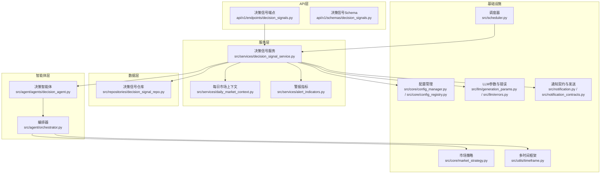
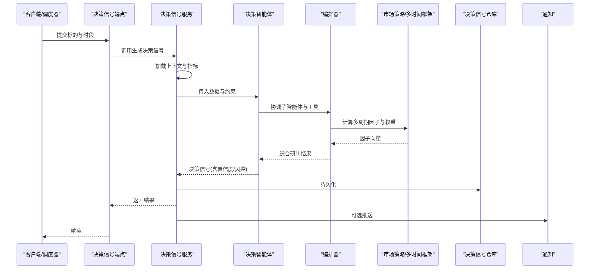
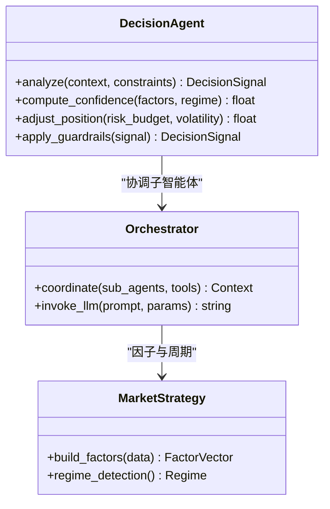
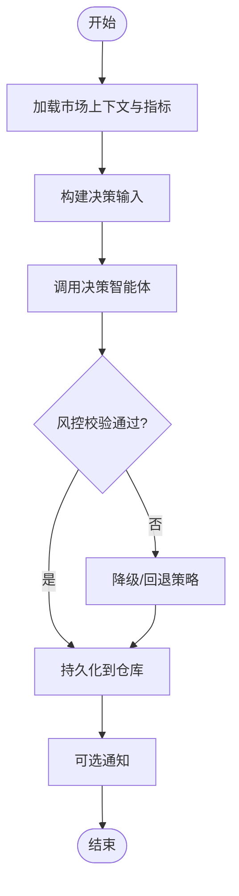
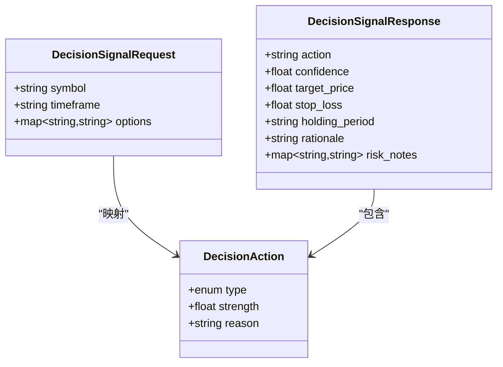
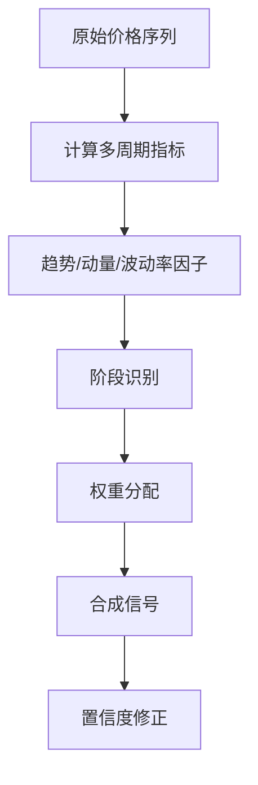
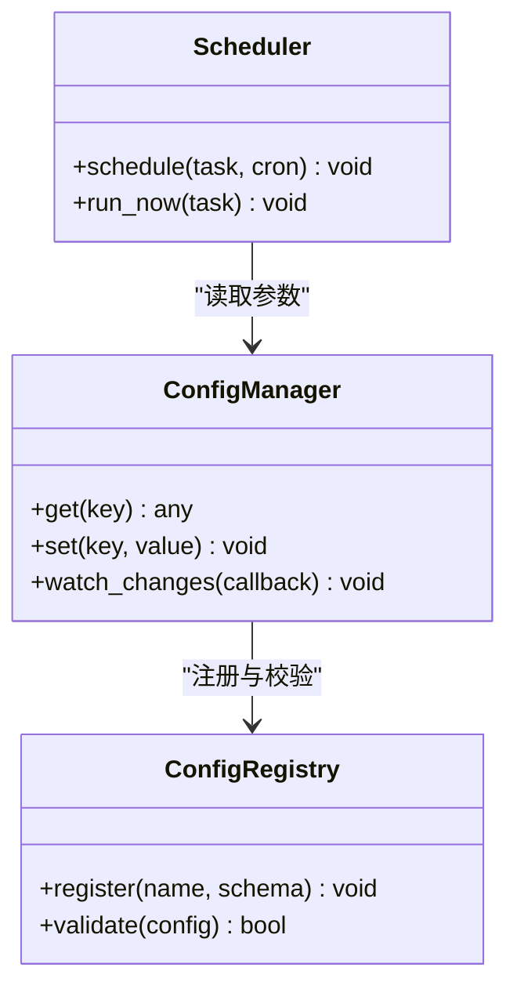
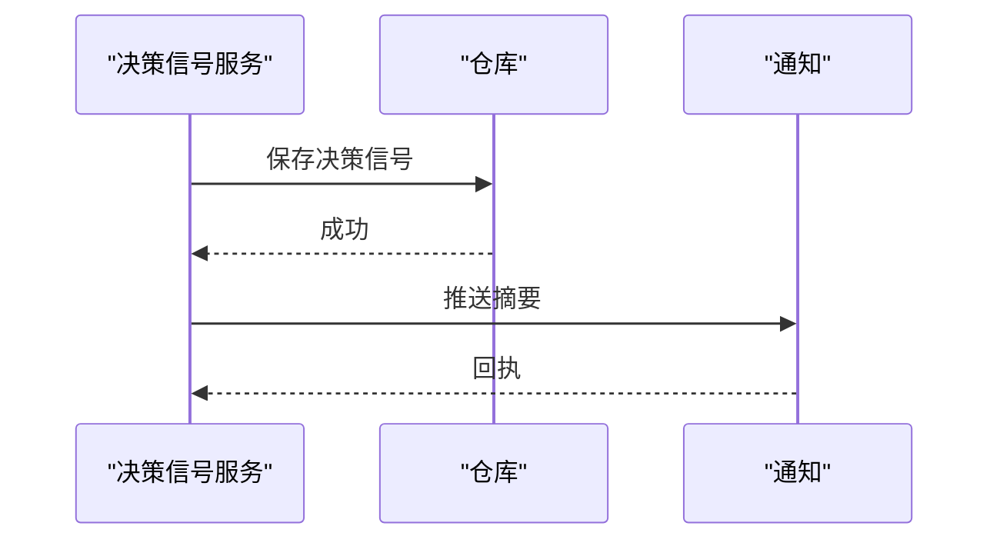
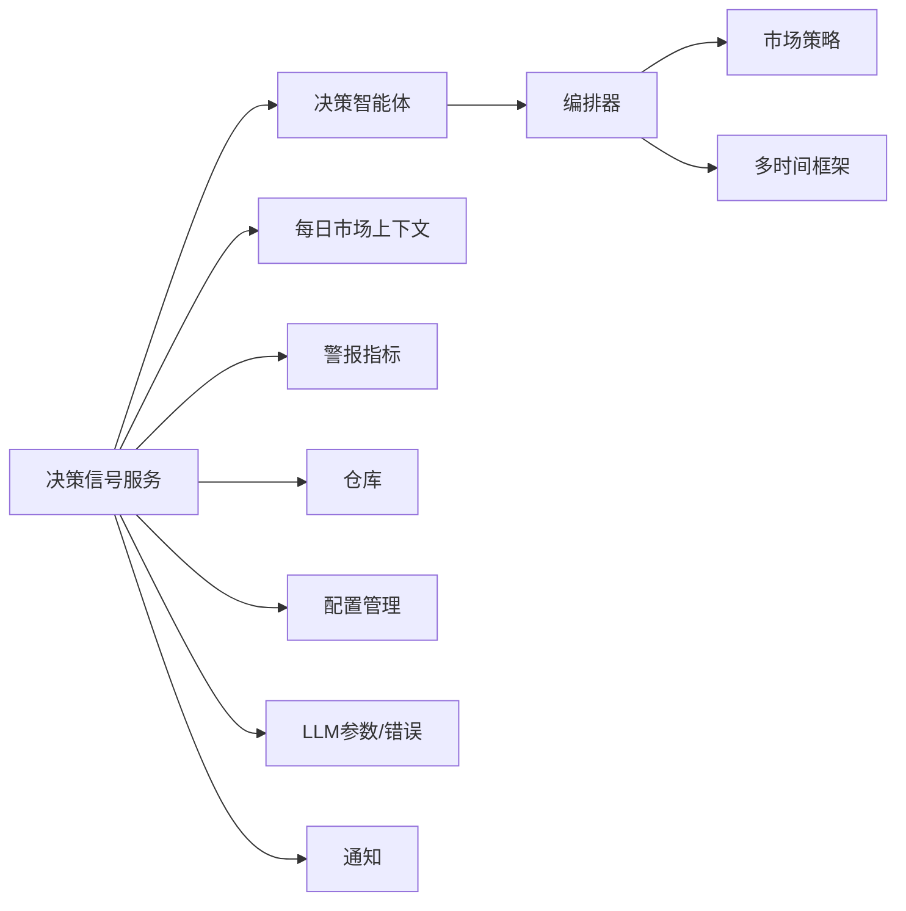

# 决策智能体

<cite>
**本文引用的文件**   
- [src/agent/agents/decision_agent.py](file://src/agent/agents/decision_agent.py)
- [src/agent/orchestrator.py](file://src/agent/orchestrator.py)
- [src/services/decision_signal_service.py](file://src/services/decision_signal_service.py)
- [src/repositories/decision_signal_repo.py](file://src/repositories/decision_signal_repo.py)
- [api/v1/endpoints/decision_signals.py](file://api/v1/endpoints/decision_signals.py)
- [api/v1/schemas/decision_signals.py](file://api/v1/schemas/decision_signals.py)
- [src/schemas/decision_action.py](file://src/schemas/decision_action.py)
- [src/core/market_strategy.py](file://src/core/market_strategy.py)
- [src/services/daily_market_context.py](file://src/services/daily_market_context.py)
- [src/utils/timeframe.py](file://src/utils/timeframe.py)
- [src/services/alert_indicators.py](file://src/services/alert_indicators.py)
- [src/llm/generation_params.py](file://src/llm/generation_params.py)
- [src/llm/errors.py](file://src/llm/errors.py)
- [src/config_manager.py](file://src/core/config_manager.py)
- [src/config_registry.py](file://src/core/config_registry.py)
- [src/scheduler.py](file://src/scheduler.py)
- [src/notification.py](file://src/notification.py)
- [src/notification_contracts.py](file://src/notification_contracts.py)
- [tests/test_decision_signal_extractor.py](file://tests/test_decision_signal_extractor.py)
- [tests/test_decision_signal_api.py](file://tests/test_decision_signal_api.py)
</cite>

## 目录
1. [简介](#简介)
2. [项目结构](#项目结构)
3. [核心组件](#核心组件)
4. [架构总览](#架构总览)
5. [详细组件分析](#详细组件分析)
6. [依赖关系分析](#依赖关系分析)
7. [性能考量](#性能考量)
8. [故障排查指南](#故障排查指南)
9. [结论](#结论)
10. [附录](#附录)

## 简介
本文件面向“决策智能体”的完整技术文档，聚焦其核心职责与交易决策逻辑：市场信号分析、买卖时机判断、仓位管理与风险控制。文档覆盖算法实现细节、输入输出数据格式、置信度计算、多时间框架分析与动态调整策略；同时给出配置参数说明、性能评估指标与故障恢复机制，并阐述与其他智能体的协作模式和数据交换协议。

## 项目结构
围绕决策智能体的关键代码分布在以下模块：
- 智能体层：决策智能体、编排器、工具与技能路由
- 服务层：决策信号服务、每日市场上下文、风控与警报指标
- 数据层：决策信号仓库（持久化）
- API层：决策信号接口与Pydantic模型
- 基础设施：LLM生成参数、错误处理、配置管理、调度与通知

图表来源
- [api/v1/endpoints/decision_signals.py](file://api/v1/endpoints/decision_signals.py)
- [api/v1/schemas/decision_signals.py](file://api/v1/schemas/decision_signals.py)
- [src/services/decision_signal_service.py](file://src/services/decision_signal_service.py)
- [src/agent/agents/decision_agent.py](file://src/agent/agents/decision_agent.py)
- [src/agent/orchestrator.py](file://src/agent/orchestrator.py)
- [src/repositories/decision_signal_repo.py](file://src/repositories/decision_signal_repo.py)
- [src/services/daily_market_context.py](file://src/services/daily_market_context.py)
- [src/services/alert_indicators.py](file://src/services/alert_indicators.py)
- [src/core/market_strategy.py](file://src/core/market_strategy.py)
- [src/utils/timeframe.py](file://src/utils/timeframe.py)
- [src/core/config_manager.py](file://src/core/config_manager.py)
- [src/core/config_registry.py](file://src/core/config_registry.py)
- [src/llm/generation_params.py](file://src/llm/generation_params.py)
- [src/llm/errors.py](file://src/llm/errors.py)
- [src/scheduler.py](file://src/scheduler.py)
- [src/notification.py](file://src/notification.py)
- [src/notification_contracts.py](file://src/notification_contracts.py)

章节来源
- [api/v1/endpoints/decision_signals.py](file://api/v1/endpoints/decision_signals.py)
- [src/services/decision_signal_service.py](file://src/services/decision_signal_service.py)
- [src/agent/agents/decision_agent.py](file://src/agent/agents/decision_agent.py)
- [src/agent/orchestrator.py](file://src/agent/orchestrator.py)
- [src/repositories/decision_signal_repo.py](file://src/repositories/decision_signal_repo.py)

## 核心组件
- 决策智能体：负责将多源信号整合为可执行的交易决策，包含方向、力度、置信度、目标与止损等要素。
- 决策信号服务：串联数据、上下文、策略与LLM，产出标准化决策信号并持久化。
- 编排器：协调各子智能体（技术、基本面、风险、组合）与工具调用，形成端到端流程。
- 市场策略与多时间框架：提供趋势、波动率、量价等因子在不同周期上的加权融合。
- 警报指标与每日市场上下文：提供宏观与微观环境约束，影响仓位与风控阈值。
- 配置与调度：集中管理策略参数、开关与定时触发。
- 通知与持久化：对外暴露API，对内落库与推送。

章节来源
- [src/agent/agents/decision_agent.py](file://src/agent/agents/decision_agent.py)
- [src/services/decision_signal_service.py](file://src/services/decision_signal_service.py)
- [src/agent/orchestrator.py](file://src/agent/orchestrator.py)
- [src/core/market_strategy.py](file://src/core/market_strategy.py)
- [src/utils/timeframe.py](file://src/utils/timeframe.py)
- [src/services/alert_indicators.py](file://src/services/alert_indicators.py)
- [src/services/daily_market_context.py](file://src/services/daily_market_context.py)
- [src/core/config_manager.py](file://src/core/config_manager.py)
- [src/core/config_registry.py](file://src/core/config_registry.py)
- [src/scheduler.py](file://src/scheduler.py)

## 架构总览
决策智能体采用“服务驱动+智能体编排”的分层架构：
- API层接收请求或调度任务，进入决策信号服务。
- 服务层聚合市场上下文、警报指标、历史与实时数据，调用决策智能体。
- 决策智能体通过编排器协同技术、风险、组合等子智能体，结合市场策略与多时间框架因子，输出结构化决策。
- 结果经仓库持久化，并通过通知渠道分发。

图表来源
- [api/v1/endpoints/decision_signals.py](file://api/v1/endpoints/decision_signals.py)
- [src/services/decision_signal_service.py](file://src/services/decision_signal_service.py)
- [src/agent/agents/decision_agent.py](file://src/agent/agents/decision_agent.py)
- [src/agent/orchestrator.py](file://src/agent/orchestrator.py)
- [src/core/market_strategy.py](file://src/core/market_strategy.py)
- [src/utils/timeframe.py](file://src/utils/timeframe.py)
- [src/repositories/decision_signal_repo.py](file://src/repositories/decision_signal_repo.py)
- [src/notification.py](file://src/notification.py)

## 详细组件分析

### 决策智能体（Decision Agent）
- 职责
  - 整合技术面、基本面、风险与组合视角，形成统一的方向性决策。
  - 输出动作类型、建议仓位、入场/出场条件、止损止盈、置信度与理由。
- 输入
  - 标的标识、时间范围、多时间框架数据、技术指标、新闻与情绪、账户与持仓快照。
- 处理逻辑
  - 通过编排器调用工具获取数据与指标，结合市场策略进行因子合成。
  - 使用LLM辅助推理与解释，但受规则与护栏约束，确保一致性。
- 输出
  - 标准化决策动作结构，包含字段：动作、强度、置信度、目标位、止损位、持有期、触发条件、风险提示。
- 置信度计算
  - 基于多因子一致性与波动率调整，考虑样本外稳定性与近期失效惩罚。
- 动态调整
  - 根据市场阶段、波动率与回撤阈值，自动降低仓位或切换观望。

图表来源
- [src/agent/agents/decision_agent.py](file://src/agent/agents/decision_agent.py)
- [src/agent/orchestrator.py](file://src/agent/orchestrator.py)
- [src/core/market_strategy.py](file://src/core/market_strategy.py)

章节来源
- [src/agent/agents/decision_agent.py](file://src/agent/agents/decision_agent.py)
- [src/agent/orchestrator.py](file://src/agent/orchestrator.py)
- [src/core/market_strategy.py](file://src/core/market_strategy.py)

### 决策信号服务（Decision Signal Service）
- 职责
  - 汇聚数据与上下文，驱动决策智能体，校验并持久化结果。
  - 提供API接口与批量处理能力。
- 输入
  - 标的列表、时间窗口、策略开关、风控参数。
- 处理流程
  - 构建每日市场上下文与警报指标，准备输入特征。
  - 调用决策智能体生成信号，执行风控与一致性检查。
  - 写入仓库，触发通知或下游系统。
- 输出
  - 标准化决策信号集合，支持分页与过滤。

图表来源
- [src/services/decision_signal_service.py](file://src/services/decision_signal_service.py)
- [src/services/daily_market_context.py](file://src/services/daily_market_context.py)
- [src/services/alert_indicators.py](file://src/services/alert_indicators.py)
- [src/repositories/decision_signal_repo.py](file://src/repositories/decision_signal_repo.py)

章节来源
- [src/services/decision_signal_service.py](file://src/services/decision_signal_service.py)
- [src/services/daily_market_context.py](file://src/services/daily_market_context.py)
- [src/services/alert_indicators.py](file://src/services/alert_indicators.py)
- [src/repositories/decision_signal_repo.py](file://src/repositories/decision_signal_repo.py)

### API与数据模型（Decision Signals API & Schema）
- 端点
  - 提供创建、查询、更新与删除决策信号的REST接口。
- 模型
  - 定义输入请求与输出响应的严格结构，包括动作、置信度、目标/止损、触发条件等。
- 校验
  - 使用Pydantic进行强类型校验与默认值填充。

图表来源
- [api/v1/endpoints/decision_signals.py](file://api/v1/endpoints/decision_signals.py)
- [api/v1/schemas/decision_signals.py](file://api/v1/schemas/decision_signals.py)
- [src/schemas/decision_action.py](file://src/schemas/decision_action.py)

章节来源
- [api/v1/endpoints/decision_signals.py](file://api/v1/endpoints/decision_signals.py)
- [api/v1/schemas/decision_signals.py](file://api/v1/schemas/decision_signals.py)
- [src/schemas/decision_action.py](file://src/schemas/decision_action.py)

### 多时间框架与策略（Timeframe & Strategy）
- 多时间框架
  - 聚合短、中、长期信号，按波动率与趋势强度自适应权重。
- 策略
  - 趋势跟随、均值回归、突破与量能放大等因子的组合与切换。
- 动态调整
  - 依据市场阶段与波动率区间，调节仓位上限与止损宽度。

图表来源
- [src/utils/timeframe.py](file://src/utils/timeframe.py)
- [src/core/market_strategy.py](file://src/core/market_strategy.py)

章节来源
- [src/utils/timeframe.py](file://src/utils/timeframe.py)
- [src/core/market_strategy.py](file://src/core/market_strategy.py)

### 配置与调度（Config & Scheduler）
- 配置管理
  - 集中存储策略参数、开关、阈值与LLM参数，支持热更新与环境变量覆盖。
- 调度
  - 定时触发决策信号生成，支持批处理与增量更新。

图表来源
- [src/core/config_manager.py](file://src/core/config_manager.py)
- [src/core/config_registry.py](file://src/core/config_registry.py)
- [src/scheduler.py](file://src/scheduler.py)

章节来源
- [src/core/config_manager.py](file://src/core/config_manager.py)
- [src/core/config_registry.py](file://src/core/config_registry.py)
- [src/scheduler.py](file://src/scheduler.py)

### 通知与持久化（Notification & Persistence）
- 通知
  - 通过多种渠道推送决策信号摘要与异常告警。
- 持久化
  - 决策信号入库，支持查询、回溯与审计。

图表来源
- [src/repositories/decision_signal_repo.py](file://src/repositories/decision_signal_repo.py)
- [src/notification.py](file://src/notification.py)
- [src/notification_contracts.py](file://src/notification_contracts.py)

章节来源
- [src/repositories/decision_signal_repo.py](file://src/repositories/decision_signal_repo.py)
- [src/notification.py](file://src/notification.py)
- [src/notification_contracts.py](file://src/notification_contracts.py)

## 依赖关系分析
- 耦合关系
  - 决策信号服务对上下文、指标、仓库与LLM存在直接依赖。
  - 决策智能体依赖编排器与市场策略，间接依赖数据源与工具。
- 外部集成
  - LLM提供商、数据提供者、通知通道与数据库。
- 循环依赖
  - 通过分层与接口隔离避免循环依赖。

图表来源
- [src/services/decision_signal_service.py](file://src/services/decision_signal_service.py)
- [src/agent/agents/decision_agent.py](file://src/agent/agents/decision_agent.py)
- [src/agent/orchestrator.py](file://src/agent/orchestrator.py)
- [src/core/market_strategy.py](file://src/core/market_strategy.py)
- [src/utils/timeframe.py](file://src/utils/timeframe.py)
- [src/core/config_manager.py](file://src/core/config_manager.py)
- [src/llm/generation_params.py](file://src/llm/generation_params.py)
- [src/notification.py](file://src/notification.py)

章节来源
- [src/services/decision_signal_service.py](file://src/services/decision_signal_service.py)
- [src/agent/agents/decision_agent.py](file://src/agent/agents/decision_agent.py)
- [src/agent/orchestrator.py](file://src/agent/orchestrator.py)

## 性能考量
- 并发与缓存
  - 对高频数据与指标计算引入缓存与异步并行，减少重复IO。
- 因子计算优化
  - 向量化计算与增量更新，避免全量重算。
- LLM调用节流
  - 设置超时、重试与降级策略，保障整体时延可控。
- 批处理与流式
  - 支持批量生成与流式返回，提升吞吐与用户体验。

[本节为通用指导，不直接分析具体文件]

## 故障排查指南
- 常见问题
  - LLM调用失败：检查网络、密钥与限流，启用回退模型或离线规则。
  - 数据缺失：确认数据源可用性、时间窗口与权限。
  - 信号不稳定：检查多时间框架权重与波动率阈值，必要时放宽或收紧。
- 诊断步骤
  - 查看日志与追踪信息，定位失败节点。
  - 回放输入上下文与中间特征，验证因子有效性。
  - 对比历史相似场景，评估置信度是否合理。
- 恢复机制
  - 自动重试与降级策略，保证服务可用性与结果一致性。

章节来源
- [src/llm/errors.py](file://src/llm/errors.py)
- [src/llm/generation_params.py](file://src/llm/generation_params.py)
- [tests/test_decision_signal_extractor.py](file://tests/test_decision_signal_extractor.py)
- [tests/test_decision_signal_api.py](file://tests/test_decision_signal_api.py)

## 结论
决策智能体以“数据驱动+智能体编排”为核心，结合多时间框架与市场策略，输出稳健的交易决策。通过严格的输入输出契约、完善的配置与调度、以及健壮的错误恢复机制，系统在复杂市场环境中保持高可用与可解释性。后续可进一步扩展因子库、强化回测与在线学习闭环，提升收益与稳定性。

[本节为总结性内容，不直接分析具体文件]

## 附录
- 输入数据格式
  - 标的标识、时间窗口、多周期OHLCV、技术指标、新闻与情绪、账户与持仓快照、风控参数。
- 输出决策结果结构
  - 动作类型、强度、置信度、目标价、止损价、持有期、触发条件、风险提示与理由。
- 置信度计算方法
  - 多因子一致性评分、波动率调整、样本外稳定性与近期失效惩罚。
- 动态调整策略
  - 依据市场阶段、波动率区间与回撤阈值，动态调整仓位上限与止损宽度。
- 配置参数说明
  - 策略开关、因子权重、风控阈值、LLM参数、调度频率与通知渠道。
- 性能评估指标
  - 胜率、盈亏比、最大回撤、夏普比率、换手率、延迟与吞吐。
- 与其他智能体的协作模式
  - 技术智能体、风险智能体、组合智能体通过编排器协同，共享上下文与信号。
- 数据交换协议
  - REST API与内部消息契约，严格类型校验与版本兼容。

[本节为补充说明，不直接分析具体文件]