# 情报智能体

<cite>
**本文引用的文件**   
- [intel_agent.py](file://src/agent/agents/intel_agent.py)
- [aggregator.py](file://src/agent/skills/aggregator.py)
- [search_tools.py](file://src/agent/tools/search_tools.py)
- [analysis_tools.py](file://src/agent/tools/analysis_tools.py)
- [market_tools.py](file://src/agent/tools/market_tools.py)
- [data_tools.py](file://src/agent/tools/data_tools.py)
- [cryptopanic_news_service.py](file://src/services/cryptopanic_news_service.py)
- [social_sentiment_service.py](file://src/services/social_sentiment_service.py)
- [daily_market_context.py](file://src/services/daily_market_context.py)
- [run_flow.py](file://src/services/run_flow.py)
- [task_queue.py](file://src/services/task_queue.py)
- [pipeline.py](file://src/core/pipeline.py)
- [config_manager.py](file://src/core/config_manager.py)
- [llm_adapter.py](file://src/agent/llm_adapter.py)
- [orchestrator.py](file://src/agent/orchestrator.py)
- [runner.py](file://src/agent/runner.py)
- [executor.py](file://src/agent/executor.py)
- [base_agent.py](file://src/agent/agents/base_agent.py)
- [decision_agent.py](file://src/agent/agents/decision_agent.py)
- [risk_agent.py](file://src/agent/agents/risk_agent.py)
- [technical_agent.py](file://src/agent/agents/technical_agent.py)
- [portfolio_agent.py](file://src/agent/agents/portfolio_agent.py)
- [search_service.py](file://src/search_service.py)
- [stock_index_loader.py](file://src/data/stock_index_loader.py)
- [akshare_fetcher.py](file://data_provider/akshare_fetcher.py)
- [yfinance_fetcher.py](file://data_provider/yfinance_fetcher.py)
- [tushare_fetcher.py](file://data_provider/tushare_fetcher.py)
- [efinance_fetcher.py](file://data_provider/efinance_fetcher.py)
- [finnhub_fetcher.py](file://data_provider/finnhub_fetcher.py)
- [alphavantage_fetcher.py](file://data_provider/alphavantage_fetcher.py)
- [crypto_fetcher.py](file://data_provider/crypto_fetcher.py)
- [crypto_macro_fetcher.py](file://data_provider/crypto_macro_fetcher.py)
- [crypto_derivatives_fetcher.py](file://data_provider/crypto_derivatives_fetcher.py)
</cite>

## 目录
1. [简介](#简介)
2. [项目结构](#项目结构)
3. [核心组件](#核心组件)
4. [架构总览](#架构总览)
5. [详细组件分析](#详细组件分析)
6. [依赖关系分析](#依赖关系分析)
7. [性能考量](#性能考量)
8. [故障排查指南](#故障排查指南)
9. [结论](#结论)
10. [附录](#附录)

## 简介
本文件面向“情报智能体”的完整技术文档，覆盖信息收集与分析能力、数据源集成、过滤与评分、聚合与去重、时效性管理、质量评估、缓存策略、错误处理、搜索工具与服务集成，以及从情报到决策的转化流程。该智能体以多智能体编排为核心，结合新闻抓取、社交媒体监控、市场情绪分析与宏观经济数据采集，形成可配置、可扩展、高可用的情报流水线。

## 项目结构
- 智能体层：位于 src/agent，包含基础智能体、情报智能体、决策智能体、风险智能体、技术面智能体、组合智能体等；技能层提供聚合、路由与默认行为；工具层封装搜索、分析、市场与数据获取能力。
- 服务层：位于 src/services，提供新闻、社交情绪、每日市场上下文、运行流、任务队列等关键服务。
- 核心层：位于 src/core，提供流水线、配置管理等基础设施。
- 数据提供者：位于 data_provider，统一接入 A股、美股、加密货币、宏观与衍生品等多源数据。
- API 层：位于 api/v1，对外暴露分析、历史、系统配置、决策信号等接口。
- 前端与应用：apps 下为 Web 与桌面端，用于交互与可视化。

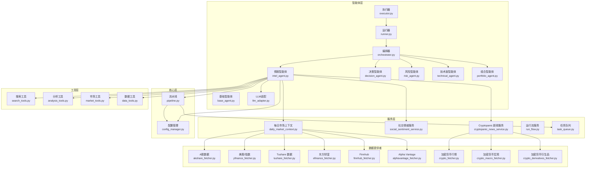

图表来源
- [intel_agent.py:1-200](file://src/agent/agents/intel_agent.py#L1-L200)
- [aggregator.py:1-200](file://src/agent/skills/aggregator.py#L1-L200)
- [search_tools.py:1-200](file://src/agent/tools/search_tools.py#L1-L200)
- [analysis_tools.py:1-200](file://src/agent/tools/analysis_tools.py#L1-L200)
- [market_tools.py:1-200](file://src/agent/tools/market_tools.py#L1-L200)
- [data_tools.py:1-200](file://src/agent/tools/data_tools.py#L1-L200)
- [cryptopanic_news_service.py:1-200](file://src/services/cryptopanic_news_service.py#L1-L200)
- [social_sentiment_service.py:1-200](file://src/services/social_sentiment_service.py#L1-L200)
- [daily_market_context.py:1-200](file://src/services/daily_market_context.py#L1-L200)
- [run_flow.py:1-200](file://src/services/run_flow.py#L1-L200)
- [task_queue.py:1-200](file://src/services/task_queue.py#L1-L200)
- [pipeline.py:1-200](file://src/core/pipeline.py#L1-L200)
- [config_manager.py:1-200](file://src/core/config_manager.py#L1-L200)
- [llm_adapter.py:1-200](file://src/agent/llm_adapter.py#L1-L200)
- [orchestrator.py:1-200](file://src/agent/orchestrator.py#L1-L200)
- [runner.py:1-200](file://src/agent/runner.py#L1-L200)
- [executor.py:1-200](file://src/agent/executor.py#L1-L200)
- [base_agent.py:1-200](file://src/agent/agents/base_agent.py#L1-L200)
- [decision_agent.py:1-200](file://src/agent/agents/decision_agent.py#L1-L200)
- [risk_agent.py:1-200](file://src/agent/agents/risk_agent.py#L1-L200)
- [technical_agent.py:1-200](file://src/agent/agents/technical_agent.py#L1-L200)
- [portfolio_agent.py:1-200](file://src/agent/agents/portfolio_agent.py#L1-L200)
- [search_service.py:1-200](file://src/search_service.py#L1-L200)
- [stock_index_loader.py:1-200](file://src/data/stock_index_loader.py#L1-L200)
- [akshare_fetcher.py:1-200](file://data_provider/akshare_fetcher.py#L1-L200)
- [yfinance_fetcher.py:1-200](file://data_provider/yfinance_fetcher.py#L1-L200)
- [tushare_fetcher.py:1-200](file://data_provider/tushare_fetcher.py#L1-L200)
- [efinance_fetcher.py:1-200](file://data_provider/efinance_fetcher.py#L1-L200)
- [finnhub_fetcher.py:1-200](file://data_provider/finnhub_fetcher.py#L1-L200)
- [alphavantage_fetcher.py:1-200](file://data_provider/alphavantage_fetcher.py#L1-L200)
- [crypto_fetcher.py:1-200](file://data_provider/crypto_fetcher.py#L1-L200)
- [crypto_macro_fetcher.py:1-200](file://data_provider/crypto_macro_fetcher.py#L1-L200)
- [crypto_derivatives_fetcher.py:1-200](file://data_provider/crypto_derivatives_fetcher.py#L1-L200)

章节来源
- [intel_agent.py:1-200](file://src/agent/agents/intel_agent.py#L1-L200)
- [aggregator.py:1-200](file://src/agent/skills/aggregator.py#L1-L200)
- [search_tools.py:1-200](file://src/agent/tools/search_tools.py#L1-L200)
- [analysis_tools.py:1-200](file://src/agent/tools/analysis_tools.py#L1-L200)
- [market_tools.py:1-200](file://src/agent/tools/market_tools.py#L1-L200)
- [data_tools.py:1-200](file://src/agent/tools/data_tools.py#L1-L200)
- [cryptopanic_news_service.py:1-200](file://src/services/cryptopanic_news_service.py#L1-L200)
- [social_sentiment_service.py:1-200](file://src/services/social_sentiment_service.py#L1-L200)
- [daily_market_context.py:1-200](file://src/services/daily_market_context.py#L1-L200)
- [run_flow.py:1-200](file://src/services/run_flow.py#L1-L200)
- [task_queue.py:1-200](file://src/services/task_queue.py#L1-L200)
- [pipeline.py:1-200](file://src/core/pipeline.py#L1-L200)
- [config_manager.py:1-200](file://src/core/config_manager.py#L1-L200)
- [llm_adapter.py:1-200](file://src/agent/llm_adapter.py#L1-L200)
- [orchestrator.py:1-200](file://src/agent/orchestrator.py#L1-L200)
- [runner.py:1-200](file://src/agent/runner.py#L1-L200)
- [executor.py:1-200](file://src/agent/executor.py#L1-L200)
- [base_agent.py:1-200](file://src/agent/agents/base_agent.py#L1-L200)
- [decision_agent.py:1-200](file://src/agent/agents/decision_agent.py#L1-L200)
- [risk_agent.py:1-200](file://src/agent/agents/risk_agent.py#L1-L200)
- [technical_agent.py:1-200](file://src/agent/agents/technical_agent.py#L1-L200)
- [portfolio_agent.py:1-200](file://src/agent/agents/portfolio_agent.py#L1-L200)
- [search_service.py:1-200](file://src/search_service.py#L1-L200)
- [stock_index_loader.py:1-200](file://src/data/stock_index_loader.py#L1-L200)
- [akshare_fetcher.py:1-200](file://data_provider/akshare_fetcher.py#L1-L200)
- [yfinance_fetcher.py:1-200](file://data_provider/yfinance_fetcher.py#L1-L200)
- [tushare_fetcher.py:1-200](file://data_provider/tushare_fetcher.py#L1-L200)
- [efinance_fetcher.py:1-200](file://data_provider/efinance_fetcher.py#L1-L200)
- [finnhub_fetcher.py:1-200](file://data_provider/finnhub_fetcher.py#L1-L200)
- [alphavantage_fetcher.py:1-200](file://data_provider/alphavantage_fetcher.py#L1-L200)
- [crypto_fetcher.py:1-200](file://data_provider/crypto_fetcher.py#L1-L200)
- [crypto_macro_fetcher.py:1-200](file://data_provider/crypto_macro_fetcher.py#L1-L200)
- [crypto_derivatives_fetcher.py:1-200](file://data_provider/crypto_derivatives_fetcher.py#L1-L200)

## 核心组件
- 情报智能体（Intel Agent）：负责跨源信息采集、过滤、评分与聚合，驱动搜索与分析工具，调用新闻与情绪服务，产出结构化情报摘要。
- 聚合技能（Aggregator Skill）：实现多源情报的去重、合并、权重计算与输出格式化。
- 搜索与分析工具：封装搜索引擎、关键词扩展、语义检索、指标计算、事件抽取等能力。
- 市场与数据工具：提供行情、基本面、资金流向、日历与映射等数据访问。
- 新闻与情绪服务：对接 Cryptopanic 新闻聚合与社交平台情绪指标。
- 每日市场上下文：整合宏观、指数、板块与个股背景，支撑情报解读。
- 运行流与任务队列：编排任务生命周期、并发控制与结果持久化。
- 流水线与配置管理：定义阶段式处理流程与全局配置项。
- LLM 适配：统一大模型调用、参数管理与使用统计。
- 多智能体编排：协调情报、决策、风险、技术与组合智能体的协作。

章节来源
- [intel_agent.py:1-200](file://src/agent/agents/intel_agent.py#L1-L200)
- [aggregator.py:1-200](file://src/agent/skills/aggregator.py#L1-L200)
- [search_tools.py:1-200](file://src/agent/tools/search_tools.py#L1-L200)
- [analysis_tools.py:1-200](file://src/agent/tools/analysis_tools.py#L1-L200)
- [market_tools.py:1-200](file://src/agent/tools/market_tools.py#L1-L200)
- [data_tools.py:1-200](file://src/agent/tools/data_tools.py#L1-L200)
- [cryptopanic_news_service.py:1-200](file://src/services/cryptopanic_news_service.py#L1-L200)
- [social_sentiment_service.py:1-200](file://src/services/social_sentiment_service.py#L1-L200)
- [daily_market_context.py:1-200](file://src/services/daily_market_context.py#L1-L200)
- [run_flow.py:1-200](file://src/services/run_flow.py#L1-L200)
- [task_queue.py:1-200](file://src/services/task_queue.py#L1-L200)
- [pipeline.py:1-200](file://src/core/pipeline.py#L1-L200)
- [config_manager.py:1-200](file://src/core/config_manager.py#L1-L200)
- [llm_adapter.py:1-200](file://src/agent/llm_adapter.py#L1-L200)
- [orchestrator.py:1-200](file://src/agent/orchestrator.py#L1-L200)
- [runner.py:1-200](file://src/agent/runner.py#L1-L200)
- [executor.py:1-200](file://src/agent/executor.py#L1-L200)

## 架构总览
情报智能体通过“采集—过滤—评分—聚合—输出”的流水线完成端到端处理。搜索与分析工具作为能力插件被智能体按需调用；新闻与情绪服务提供外部数据；每日市场上下文为情报注入宏观与行业背景；运行流与任务队列保障并发与可靠性；配置管理统一开关与阈值；LLM 适配支持文本生成与摘要。

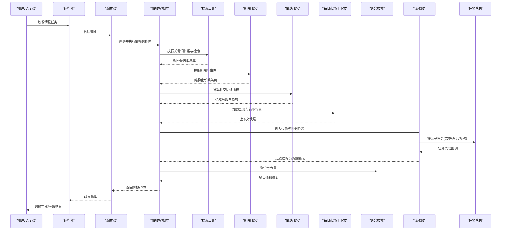

图表来源
- [runner.py:1-200](file://src/agent/runner.py#L1-L200)
- [orchestrator.py:1-200](file://src/agent/orchestrator.py#L1-L200)
- [intel_agent.py:1-200](file://src/agent/agents/intel_agent.py#L1-L200)
- [search_tools.py:1-200](file://src/agent/tools/search_tools.py#L1-L200)
- [cryptopanic_news_service.py:1-200](file://src/services/cryptopanic_news_service.py#L1-L200)
- [social_sentiment_service.py:1-200](file://src/services/social_sentiment_service.py#L1-L200)
- [daily_market_context.py:1-200](file://src/services/daily_market_context.py#L1-L200)
- [aggregator.py:1-200](file://src/agent/skills/aggregator.py#L1-L200)
- [pipeline.py:1-200](file://src/core/pipeline.py#L1-L200)
- [task_queue.py:1-200](file://src/services/task_queue.py#L1-L200)

## 详细组件分析

### 情报智能体（Intel Agent）
- 职责：协调搜索与分析工具，调用新闻与情绪服务，构建每日市场上下文，执行过滤、评分与聚合，输出结构化情报。
- 关键能力：
  - 信息收集：多源搜索、新闻抓取、社交媒体监控、宏观数据采集。
  - 过滤算法：基于规则与语义的双重过滤，剔除噪声与低价值内容。
  - 重要性评分：融合时效性、来源权威度、相关性、情绪强度与影响范围。
  - 聚合策略：去重、合并相似条目、按主题聚类、权重汇总。
  - 时效性管理：时间衰减、窗口裁剪、过期清理。
  - 质量评估：完整性、一致性、可信度、可追溯性。
  - 缓存策略：热点缓存、分层缓存、失效策略。
  - 错误处理：重试、降级、回退、告警。
- 与其他智能体协作：将情报产物输入决策、风险、技术与组合智能体进行下游分析。

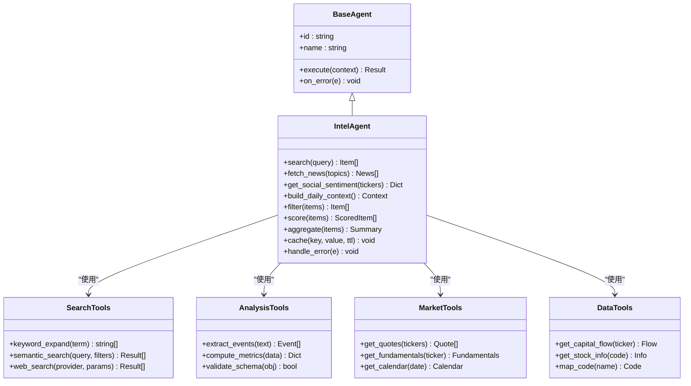

图表来源
- [base_agent.py:1-200](file://src/agent/agents/base_agent.py#L1-L200)
- [intel_agent.py:1-200](file://src/agent/agents/intel_agent.py#L1-L200)
- [search_tools.py:1-200](file://src/agent/tools/search_tools.py#L1-L200)
- [analysis_tools.py:1-200](file://src/agent/tools/analysis_tools.py#L1-L200)
- [market_tools.py:1-200](file://src/agent/tools/market_tools.py#L1-L200)
- [data_tools.py:1-200](file://src/agent/tools/data_tools.py#L1-L200)

章节来源
- [intel_agent.py:1-200](file://src/agent/agents/intel_agent.py#L1-L200)
- [base_agent.py:1-200](file://src/agent/agents/base_agent.py#L1-L200)
- [search_tools.py:1-200](file://src/agent/tools/search_tools.py#L1-L200)
- [analysis_tools.py:1-200](file://src/agent/tools/analysis_tools.py#L1-L200)
- [market_tools.py:1-200](file://src/agent/tools/market_tools.py#L1-L200)
- [data_tools.py:1-200](file://src/agent/tools/data_tools.py#L1-L200)

### 聚合技能（Aggregator Skill）
- 功能：对来自不同来源的情报进行去重、合并、主题聚类与权重计算，输出标准化摘要。
- 关键点：
  - 去重：基于标题相似度、URL 指纹、时间窗口与实体匹配。
  - 合并：同主题条目合并，保留关键事实与引用来源。
  - 权重：按来源权威度、时效性与情绪强度加权。
  - 输出：结构化摘要，便于下游消费。

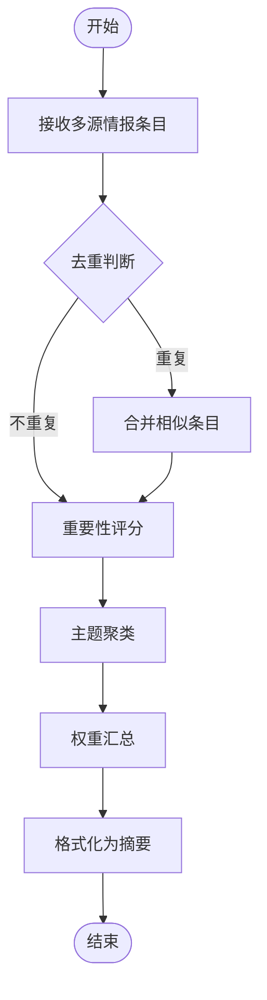

图表来源
- [aggregator.py:1-200](file://src/agent/skills/aggregator.py#L1-L200)

章节来源
- [aggregator.py:1-200](file://src/agent/skills/aggregator.py#L1-L200)

### 搜索与分析工具
- 搜索工具：关键词扩展、语义检索、Web 搜索（多提供商）、过滤与分页。
- 分析工具：事件抽取、指标计算、模式识别、Schema 校验。
- 市场工具：实时报价、基本面数据、交易日历与映射。
- 数据工具：资金流向、股票信息与代码映射。

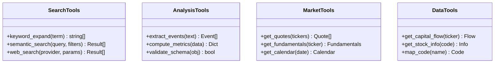

图表来源
- [search_tools.py:1-200](file://src/agent/tools/search_tools.py#L1-L200)
- [analysis_tools.py:1-200](file://src/agent/tools/analysis_tools.py#L1-L200)
- [market_tools.py:1-200](file://src/agent/tools/market_tools.py#L1-L200)
- [data_tools.py:1-200](file://src/agent/tools/data_tools.py#L1-L200)

章节来源
- [search_tools.py:1-200](file://src/agent/tools/search_tools.py#L1-L200)
- [analysis_tools.py:1-200](file://src/agent/tools/analysis_tools.py#L1-L200)
- [market_tools.py:1-200](file://src/agent/tools/market_tools.py#L1-L200)
- [data_tools.py:1-200](file://src/agent/tools/data_tools.py#L1-L200)

### 新闻与情绪服务
- 新闻服务：聚合 Cryptopanic 新闻，支持分类、标签、热度与时间排序。
- 情绪服务：采集社交平台情绪指标，计算正向/负向比例与趋势变化。
- 集成方式：通过 HTTP/WebSocket 或 SDK 接入，失败时降级至缓存或默认值。

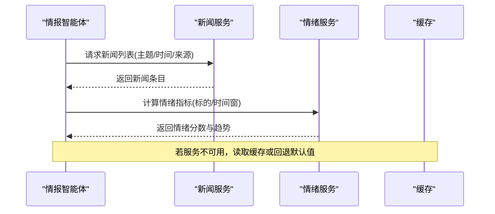

图表来源
- [cryptopanic_news_service.py:1-200](file://src/services/cryptopanic_news_service.py#L1-L200)
- [social_sentiment_service.py:1-200](file://src/services/social_sentiment_service.py#L1-L200)

章节来源
- [cryptopanic_news_service.py:1-200](file://src/services/cryptopanic_news_service.py#L1-L200)
- [social_sentiment_service.py:1-200](file://src/services/social_sentiment_service.py#L1-L200)

### 每日市场上下文
- 作用：为情报提供宏观、指数、板块与个股背景，增强解读准确性。
- 数据来源：A股、美股、加密货币、宏观与衍生品数据提供者。
- 更新策略：定时刷新、增量更新与缓存失效。

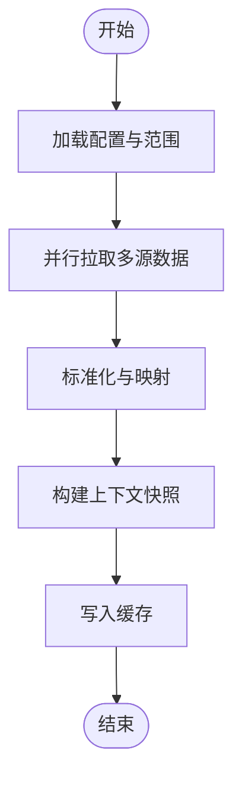

图表来源
- [daily_market_context.py:1-200](file://src/services/daily_market_context.py#L1-L200)
- [stock_index_loader.py:1-200](file://src/data/stock_index_loader.py#L1-L200)
- [akshare_fetcher.py:1-200](file://data_provider/akshare_fetcher.py#L1-L200)
- [yfinance_fetcher.py:1-200](file://data_provider/yfinance_fetcher.py#L1-L200)
- [tushare_fetcher.py:1-200](file://data_provider/tushare_fetcher.py#L1-L200)
- [efinance_fetcher.py:1-200](file://data_provider/efinance_fetcher.py#L1-L200)
- [finnhub_fetcher.py:1-200](file://data_provider/finnhub_fetcher.py#L1-L200)
- [alphavantage_fetcher.py:1-200](file://data_provider/alphavantage_fetcher.py#L1-L200)
- [crypto_fetcher.py:1-200](file://data_provider/crypto_fetcher.py#L1-L200)
- [crypto_macro_fetcher.py:1-200](file://data_provider/crypto_macro_fetcher.py#L1-L200)
- [crypto_derivatives_fetcher.py:1-200](file://data_provider/crypto_derivatives_fetcher.py#L1-L200)

章节来源
- [daily_market_context.py:1-200](file://src/services/daily_market_context.py#L1-L200)
- [stock_index_loader.py:1-200](file://src/data/stock_index_loader.py#L1-L200)
- [akshare_fetcher.py:1-200](file://data_provider/akshare_fetcher.py#L1-L200)
- [yfinance_fetcher.py:1-200](file://data_provider/yfinance_fetcher.py#L1-L200)
- [tushare_fetcher.py:1-200](file://data_provider/tushare_fetcher.py#L1-L200)
- [efinance_fetcher.py:1-200](file://data_provider/efinance_fetcher.py#L1-L200)
- [finnhub_fetcher.py:1-200](file://data_provider/finnhub_fetcher.py#L1-L200)
- [alphavantage_fetcher.py:1-200](file://data_provider/alphavantage_fetcher.py#L1-L200)
- [crypto_fetcher.py:1-200](file://data_provider/crypto_fetcher.py#L1-L200)
- [crypto_macro_fetcher.py:1-200](file://data_provider/crypto_macro_fetcher.py#L1-L200)
- [crypto_derivatives_fetcher.py:1-200](file://data_provider/crypto_derivatives_fetcher.py#L1-L200)

### 运行流与任务队列
- 运行流：定义任务生命周期、状态机、事件回调与结果持久化。
- 任务队列：并发控制、重试机制、优先级与超时管理。
- 与流水线集成：阶段式处理、中间结果缓存与错误恢复。

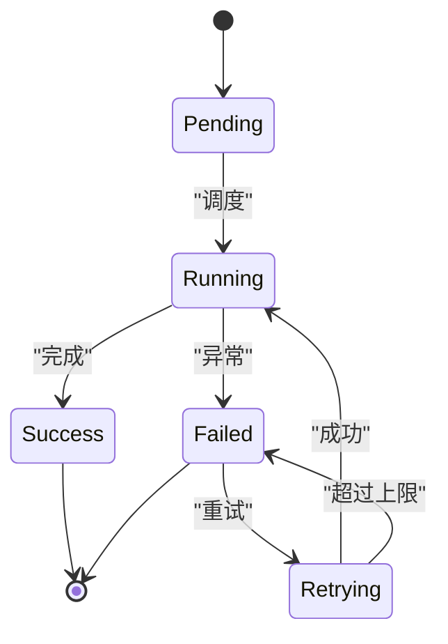

图表来源
- [run_flow.py:1-200](file://src/services/run_flow.py#L1-L200)
- [task_queue.py:1-200](file://src/services/task_queue.py#L1-L200)
- [pipeline.py:1-200](file://src/core/pipeline.py#L1-L200)

章节来源
- [run_flow.py:1-200](file://src/services/run_flow.py#L1-L200)
- [task_queue.py:1-200](file://src/services/task_queue.py#L1-L200)
- [pipeline.py:1-200](file://src/core/pipeline.py#L1-L200)

### 多智能体编排
- 编排器：协调情报、决策、风险、技术与组合智能体的顺序与并行。
- 运行器：启动编排、管理生命周期、处理事件与结果。
- 执行器：具体任务的执行与资源管理。

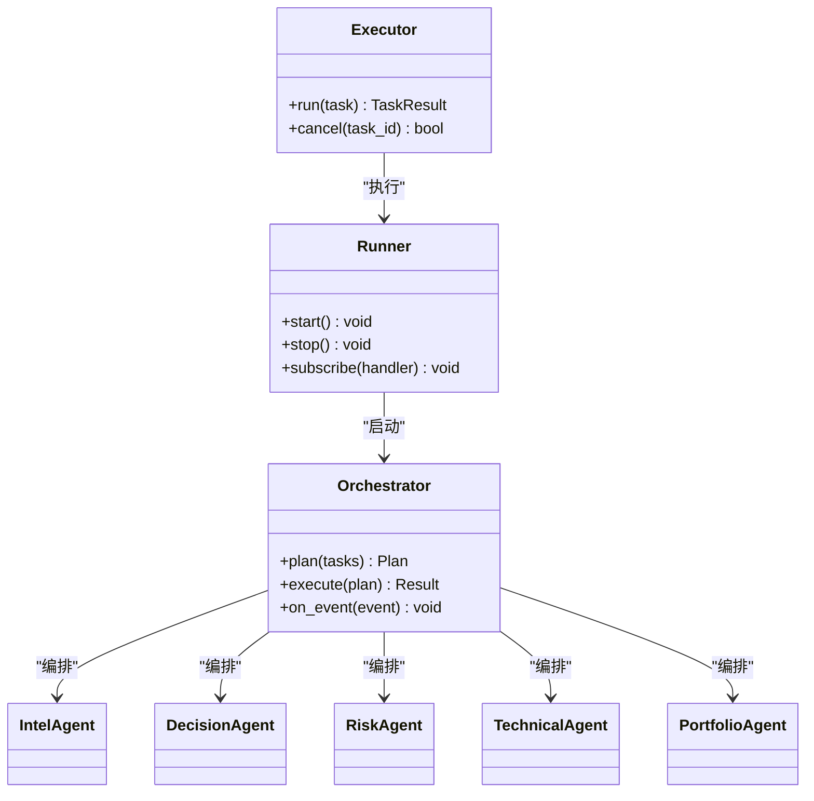

图表来源
- [orchestrator.py:1-200](file://src/agent/orchestrator.py#L1-L200)
- [runner.py:1-200](file://src/agent/runner.py#L1-L200)
- [executor.py:1-200](file://src/agent/executor.py#L1-L200)
- [intel_agent.py:1-200](file://src/agent/agents/intel_agent.py#L1-L200)
- [decision_agent.py:1-200](file://src/agent/agents/decision_agent.py#L1-L200)
- [risk_agent.py:1-200](file://src/agent/agents/risk_agent.py#L1-L200)
- [technical_agent.py:1-200](file://src/agent/agents/technical_agent.py#L1-L200)
- [portfolio_agent.py:1-200](file://src/agent/agents/portfolio_agent.py#L1-L200)

章节来源
- [orchestrator.py:1-200](file://src/agent/orchestrator.py#L1-L200)
- [runner.py:1-200](file://src/agent/runner.py#L1-L200)
- [executor.py:1-200](file://src/agent/executor.py#L1-L200)
- [intel_agent.py:1-200](file://src/agent/agents/intel_agent.py#L1-L200)
- [decision_agent.py:1-200](file://src/agent/agents/decision_agent.py#L1-L200)
- [risk_agent.py:1-200](file://src/agent/agents/risk_agent.py#L1-L200)
- [technical_agent.py:1-200](file://src/agent/agents/technical_agent.py#L1-L200)
- [portfolio_agent.py:1-200](file://src/agent/agents/portfolio_agent.py#L1-L200)

### 情报到决策的转化流程
- 输入：高质量情报摘要、市场上下文、情绪指标。
- 处理：决策智能体结合风险与技术面智能体进行信号提取与验证。
- 输出：决策信号、行动建议与风险提示，供组合智能体优化配置。

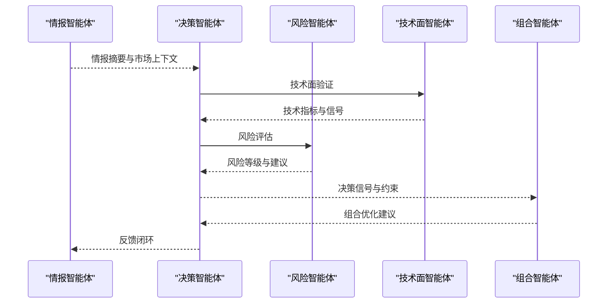

图表来源
- [decision_agent.py:1-200](file://src/agent/agents/decision_agent.py#L1-L200)
- [risk_agent.py:1-200](file://src/agent/agents/risk_agent.py#L1-L200)
- [technical_agent.py:1-200](file://src/agent/agents/technical_agent.py#L1-L200)
- [portfolio_agent.py:1-200](file://src/agent/agents/portfolio_agent.py#L1-L200)
- [intel_agent.py:1-200](file://src/agent/agents/intel_agent.py#L1-L200)

章节来源
- [decision_agent.py:1-200](file://src/agent/agents/decision_agent.py#L1-L200)
- [risk_agent.py:1-200](file://src/agent/agents/risk_agent.py#L1-L200)
- [technical_agent.py:1-200](file://src/agent/agents/technical_agent.py#L1-L200)
- [portfolio_agent.py:1-200](file://src/agent/agents/portfolio_agent.py#L1-L200)
- [intel_agent.py:1-200](file://src/agent/agents/intel_agent.py#L1-L200)

## 依赖关系分析
- 内聚性：各智能体职责清晰，工具与服务解耦，便于独立演进。
- 耦合点：情报智能体依赖搜索、分析、市场与数据工具；新闻与情绪服务为外部依赖；每日市场上下文依赖多数据提供者。
- 循环依赖：通过编排器与运行器避免直接循环，采用事件与回调通信。
- 外部依赖：搜索引擎、新闻聚合、社交平台、行情与宏观数据源。

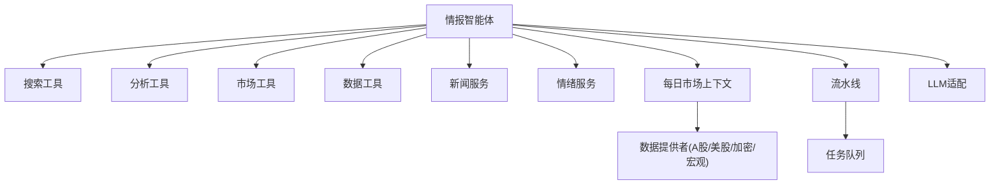

图表来源
- [intel_agent.py:1-200](file://src/agent/agents/intel_agent.py#L1-L200)
- [search_tools.py:1-200](file://src/agent/tools/search_tools.py#L1-L200)
- [analysis_tools.py:1-200](file://src/agent/tools/analysis_tools.py#L1-L200)
- [market_tools.py:1-200](file://src/agent/tools/market_tools.py#L1-L200)
- [data_tools.py:1-200](file://src/agent/tools/data_tools.py#L1-L200)
- [cryptopanic_news_service.py:1-200](file://src/services/cryptopanic_news_service.py#L1-L200)
- [social_sentiment_service.py:1-200](file://src/services/social_sentiment_service.py#L1-L200)
- [daily_market_context.py:1-200](file://src/services/daily_market_context.py#L1-L200)
- [pipeline.py:1-200](file://src/core/pipeline.py#L1-L200)
- [task_queue.py:1-200](file://src/services/task_queue.py#L1-L200)
- [llm_adapter.py:1-200](file://src/agent/llm_adapter.py#L1-L200)
- [akshare_fetcher.py:1-200](file://data_provider/akshare_fetcher.py#L1-L200)
- [yfinance_fetcher.py:1-200](file://data_provider/yfinance_fetcher.py#L1-L200)
- [tushare_fetcher.py:1-200](file://data_provider/tushare_fetcher.py#L1-L200)
- [efinance_fetcher.py:1-200](file://data_provider/efinance_fetcher.py#L1-L200)
- [finnhub_fetcher.py:1-200](file://data_provider/finnhub_fetcher.py#L1-L200)
- [alphavantage_fetcher.py:1-200](file://data_provider/alphavantage_fetcher.py#L1-L200)
- [crypto_fetcher.py:1-200](file://data_provider/crypto_fetcher.py#L1-L200)
- [crypto_macro_fetcher.py:1-200](file://data_provider/crypto_macro_fetcher.py#L1-L200)
- [crypto_derivatives_fetcher.py:1-200](file://data_provider/crypto_derivatives_fetcher.py#L1-L200)

章节来源
- [intel_agent.py:1-200](file://src/agent/agents/intel_agent.py#L1-L200)
- [pipeline.py:1-200](file://src/core/pipeline.py#L1-L200)
- [task_queue.py:1-200](file://src/services/task_queue.py#L1-L200)
- [cryptopanic_news_service.py:1-200](file://src/services/cryptopanic_news_service.py#L1-L200)
- [social_sentiment_service.py:1-200](file://src/services/social_sentiment_service.py#L1-L200)
- [daily_market_context.py:1-200](file://src/services/daily_market_context.py#L1-L200)
- [search_tools.py:1-200](file://src/agent/tools/search_tools.py#L1-L200)
- [analysis_tools.py:1-200](file://src/agent/tools/analysis_tools.py#L1-L200)
- [market_tools.py:1-200](file://src/agent/tools/market_tools.py#L1-L200)
- [data_tools.py:1-200](file://src/agent/tools/data_tools.py#L1-L200)
- [llm_adapter.py:1-200](file://src/agent/llm_adapter.py#L1-L200)
- [akshare_fetcher.py:1-200](file://data_provider/akshare_fetcher.py#L1-L200)
- [yfinance_fetcher.py:1-200](file://data_provider/yfinance_fetcher.py#L1-L200)
- [tushare_fetcher.py:1-200](file://data_provider/tushare_fetcher.py#L1-L200)
- [efinance_fetcher.py:1-200](file://data_provider/efinance_fetcher.py#L1-L200)
- [finnhub_fetcher.py:1-200](file://data_provider/finnhub_fetcher.py#L1-L200)
- [alphavantage_fetcher.py:1-200](file://data_provider/alphavantage_fetcher.py#L1-L200)
- [crypto_fetcher.py:1-200](file://data_provider/crypto_fetcher.py#L1-L200)
- [crypto_macro_fetcher.py:1-200](file://data_provider/crypto_macro_fetcher.py#L1-L200)
- [crypto_derivatives_fetcher.py:1-200](file://data_provider/crypto_derivatives_fetcher.py#L1-L200)

## 性能考量
- 并发与批处理：并行拉取多源数据，批量处理与聚合减少锁竞争。
- 缓存策略：热点数据短期缓存，长尾数据长期存储，设置合理 TTL 与失效策略。
- 降级与回退：外部服务不可用时使用缓存或默认值，保证可用性。
- 资源限制：限流、超时与重试上限，防止雪崩。
- 内存与序列化：对象复用、流式处理与高效序列化。

[本节为通用指导，无需特定文件来源]

## 故障排查指南
- 常见问题：
  - 数据源超时或限流：检查网络、密钥与配额，启用重试与降级。
  - 搜索结果为空：调整关键词与过滤器，增加语义检索与同义词扩展。
  - 情绪指标缺失：切换平台或降低时间粒度，使用历史均值填充。
  - 聚合去重误判：放宽相似度阈值，引入更多实体匹配。
  - 任务队列堆积：扩容消费者、提升优先级与超时策略。
- 诊断要点：
  - 查看运行流状态与事件日志。
  - 检查任务队列积压与重试次数。
  - 验证配置项与阈值是否合理。
  - 确认外部服务健康状态与响应时间。

章节来源
- [run_flow.py:1-200](file://src/services/run_flow.py#L1-L200)
- [task_queue.py:1-200](file://src/services/task_queue.py#L1-L200)
- [pipeline.py:1-200](file://src/core/pipeline.py#L1-L200)
- [config_manager.py:1-200](file://src/core/config_manager.py#L1-L200)

## 结论
情报智能体通过多源采集、智能过滤与评分、聚合与去重、上下文注入与多智能体协作，构建了从信息到决策的完整链路。其模块化设计、弹性降级与并发控制保障了高可用与可扩展性。建议持续优化关键词与语义检索、完善情绪指标与宏观数据、强化缓存与错误恢复，以提升情报质量与决策效率。

[本节为总结性内容，无需特定文件来源]

## 附录
- 配置项建议：
  - 搜索提供商与速率限制
  - 新闻与情绪服务开关与超时
  - 去重相似度阈值与时间窗口
  - 重要性评分权重与时效衰减系数
  - 缓存 TTL 与容量上限
- 最佳实践：
  - 分阶段灰度发布与回滚策略
  - 监控与告警覆盖关键指标
  - 定期审计数据源与权限
  - 文档化变更与版本兼容

[本节为补充说明，无需特定文件来源]