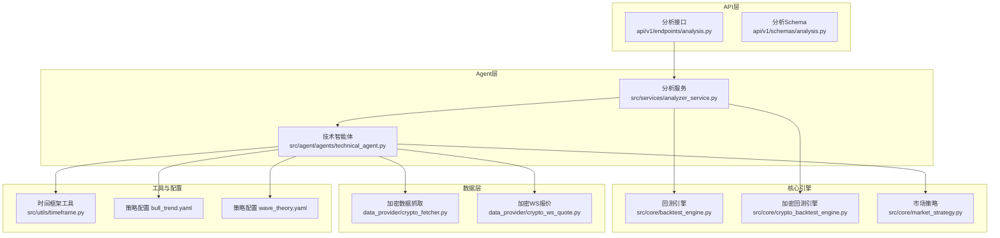
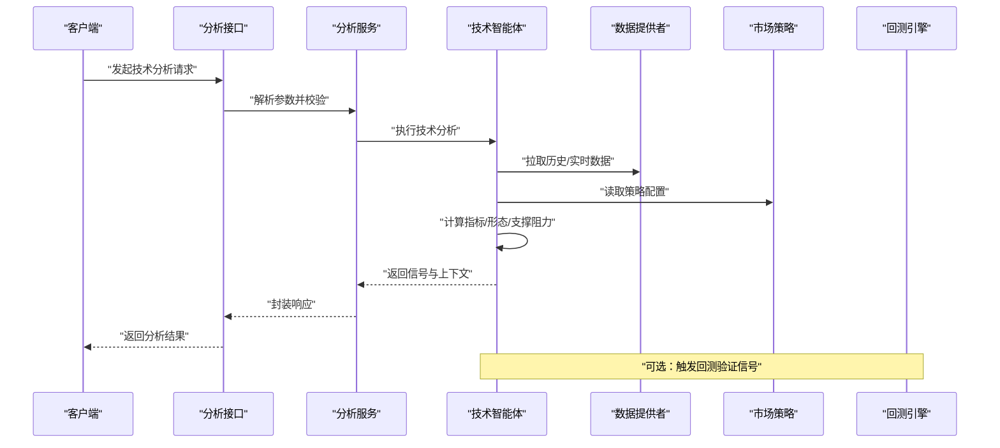
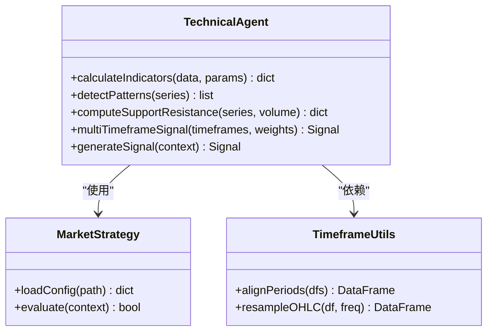
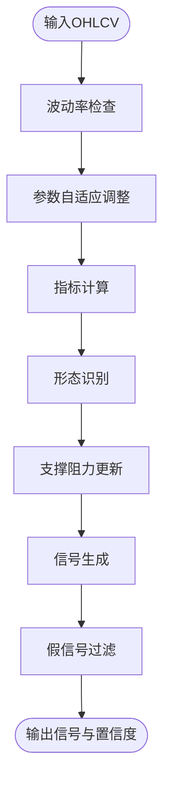
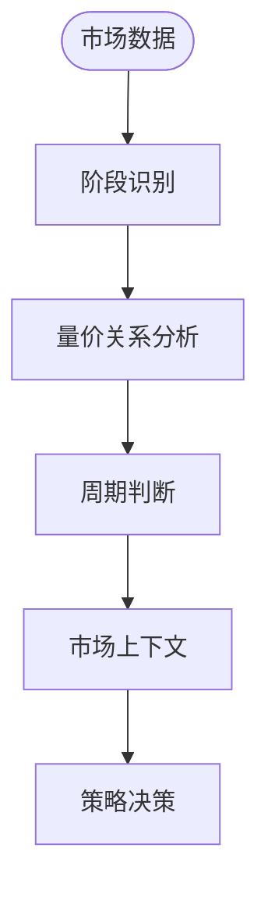
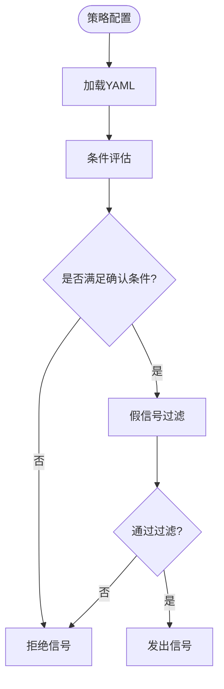
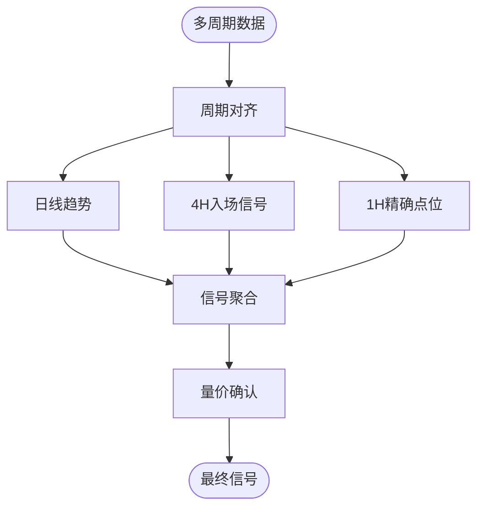
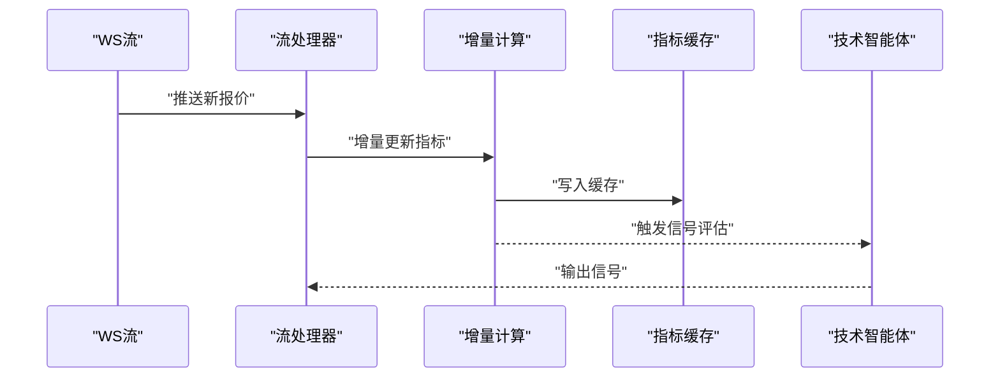
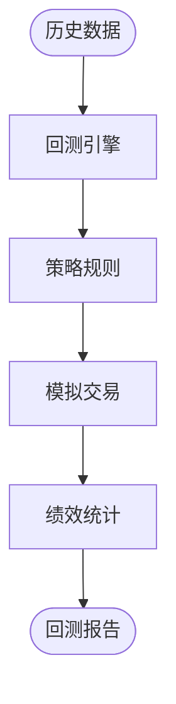
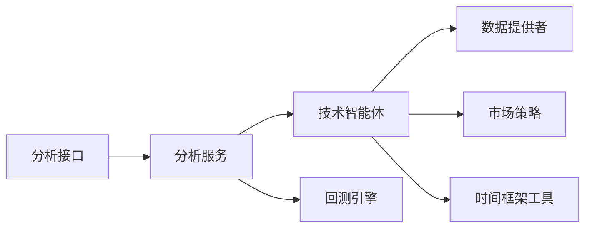

# 技术分析智能体

<cite>
**本文引用的文件**   
- [src/agent/agents/technical_agent.py](file://src/agent/agents/technical_agent.py)
- [src/crypto_technical.py](file://src/crypto_technical.py)
- [src/market_analyzer.py](file://src/market_analyzer.py)
- [src/stock_analyzer.py](file://src/stock_analyzer.py)
- [src/core/market_strategy.py](file://src/core/market_strategy.py)
- [src/services/analyzer_service.py](file://src/services/analyzer_service.py)
- [api/v1/endpoints/analysis.py](file://api/v1/endpoints/analysis.py)
- [api/v1/schemas/analysis.py](file://api/v1/schemas/analysis.py)
- [data_provider/crypto_fetcher.py](file://data_provider/crypto_fetcher.py)
- [data_provider/crypto_ws_quote.py](file://data_provider/crypto_ws_quote.py)
- [src/utils/timeframe.py](file://src/utils/timeframe.py)
- [src/core/backtest_engine.py](file://src/core/backtest_engine.py)
- [src/core/crypto_backtest_engine.py](file://src/core/crypto_backtest_engine.py)
- [strategies/bull_trend.yaml](file://strategies/bull_trend.yaml)
- [strategies/wave_theory.yaml](file://strategies/wave_theory.yaml)
</cite>

## 目录
1. [简介](#简介)
2. [项目结构](#项目结构)
3. [核心组件](#核心组件)
4. [架构总览](#架构总览)
5. [详细组件分析](#详细组件分析)
6. [依赖关系分析](#依赖关系分析)
7. [性能考虑](#性能考虑)
8. [故障排查指南](#故障排查指南)
9. [结论](#结论)
10. [附录](#附录)

## 简介
本技术文档围绕“技术分析智能体”展开，系统阐述技术指标计算与分析算法（趋势识别、支撑阻力位、形态分析）、多时间框架与量价关系、市场周期判断、指标组合策略与信号确认机制、假信号过滤，以及加密货币市场的特性适配。同时给出实时数据处理机制与优化策略，帮助读者从工程实现到交易应用全面理解该智能体的设计与落地方式。

## 项目结构
技术分析智能体位于后端服务中，由API层暴露接口，通过Agent编排器调度技术分析与策略执行，数据源覆盖股票与加密货币，回测引擎支持历史验证与参数优化。关键目录与职责：
- API层：提供分析、回测、决策信号等REST接口
- Agent层：技术智能体、策略智能体、工具与技能编排
- 核心引擎：通用与加密专属回测引擎、市场策略定义
- 数据层：行情获取、WebSocket实时报价、历史数据加载
- 工具与配置：时间框架转换、指标参数、策略YAML配置

图表来源 
- [api/v1/endpoints/analysis.py](file://api/v1/endpoints/analysis.py)
- [api/v1/schemas/analysis.py](file://api/v1/schemas/analysis.py)
- [src/agent/agents/technical_agent.py](file://src/agent/agents/technical_agent.py)
- [src/services/analyzer_service.py](file://src/services/analyzer_service.py)
- [src/core/backtest_engine.py](file://src/core/backtest_engine.py)
- [src/core/crypto_backtest_engine.py](file://src/core/crypto_backtest_engine.py)
- [src/core/market_strategy.py](file://src/core/market_strategy.py)
- [data_provider/crypto_fetcher.py](file://data_provider/crypto_fetcher.py)
- [data_provider/crypto_ws_quote.py](file://data_provider/crypto_ws_quote.py)
- [src/utils/timeframe.py](file://src/utils/timeframe.py)
- [strategies/bull_trend.yaml](file://strategies/bull_trend.yaml)
- [strategies/wave_theory.yaml](file://strategies/wave_theory.yaml)

章节来源
- [api/v1/endpoints/analysis.py](file://api/v1/endpoints/analysis.py)
- [api/v1/schemas/analysis.py](file://api/v1/schemas/analysis.py)
- [src/agent/agents/technical_agent.py](file://src/agent/agents/technical_agent.py)
- [src/services/analyzer_service.py](file://src/services/analyzer_service.py)
- [src/core/backtest_engine.py](file://src/core/backtest_engine.py)
- [src/core/crypto_backtest_engine.py](file://src/core/crypto_backtest_engine.py)
- [src/core/market_strategy.py](file://src/core/market_strategy.py)
- [data_provider/crypto_fetcher.py](file://data_provider/crypto_fetcher.py)
- [data_provider/crypto_ws_quote.py](file://data_provider/crypto_ws_quote.py)
- [src/utils/timeframe.py](file://src/utils/timeframe.py)
- [strategies/bull_trend.yaml](file://strategies/bull_trend.yaml)
- [strategies/wave_theory.yaml](file://strategies/wave_theory.yaml)

## 核心组件
- 技术智能体：负责整合多类技术指标、形态识别、支撑阻力计算、多时间框架聚合与信号生成
- 分析服务：协调数据获取、指标计算、策略评估与结果封装
- 市场策略：以YAML声明式定义指标组合、阈值与规则，驱动信号判定
- 回测引擎：通用与加密专用引擎，支持历史数据回放、滑点手续费、绩效统计
- 数据提供者：历史与实时数据接入，含加密交易所WS流
- 时间框架工具：统一多周期换算与对齐

章节来源
- [src/agent/agents/technical_agent.py](file://src/agent/agents/technical_agent.py)
- [src/services/analyzer_service.py](file://src/services/analyzer_service.py)
- [src/core/market_strategy.py](file://src/core/market_strategy.py)
- [src/core/backtest_engine.py](file://src/core/backtest_engine.py)
- [src/core/crypto_backtest_engine.py](file://src/core/crypto_backtest_engine.py)
- [data_provider/crypto_fetcher.py](file://data_provider/crypto_fetcher.py)
- [data_provider/crypto_ws_quote.py](file://data_provider/crypto_ws_quote.py)
- [src/utils/timeframe.py](file://src/utils/timeframe.py)

## 架构总览
技术分析智能体的端到端流程如下：
- API接收分析请求，校验并路由至分析服务
- 分析服务调用技术智能体，拉取历史与实时数据
- 技术智能体按策略配置计算指标、识别形态、确定支撑阻力、进行多时间框架聚合
- 生成信号并返回给API；可选触发回测或通知

图表来源 
- [api/v1/endpoints/analysis.py](file://api/v1/endpoints/analysis.py)
- [src/services/analyzer_service.py](file://src/services/analyzer_service.py)
- [src/agent/agents/technical_agent.py](file://src/agent/agents/technical_agent.py)
- [data_provider/crypto_fetcher.py](file://data_provider/crypto_fetcher.py)
- [data_provider/crypto_ws_quote.py](file://data_provider/crypto_ws_quote.py)
- [src/core/market_strategy.py](file://src/core/market_strategy.py)
- [src/core/backtest_engine.py](file://src/core/backtest_engine.py)

## 详细组件分析

### 技术智能体（Technical Agent）
职责与能力：
- 指标集成：趋势类（均线、MACD、ADX）、动量类（RSI、Stochastic）、波动率（ATR、布林带）、成交量（OBV、VWAP）
- 形态分析：K线形态与价格结构（高低点、通道、三角形、头肩顶/底）
- 支撑阻力：基于前高/前低、成交密集区、斐波那契回撤、枢轴点
- 多时间框架：将日线、4小时、1小时等周期信号加权聚合
- 信号生成：结合策略YAML阈值、条件组合、确认逻辑与过滤规则

图表来源 
- [src/agent/agents/technical_agent.py](file://src/agent/agents/technical_agent.py)
- [src/core/market_strategy.py](file://src/core/market_strategy.py)
- [src/utils/timeframe.py](file://src/utils/timeframe.py)

章节来源
- [src/agent/agents/technical_agent.py](file://src/agent/agents/technical_agent.py)
- [src/core/market_strategy.py](file://src/core/market_strategy.py)
- [src/utils/timeframe.py](file://src/utils/timeframe.py)

### 加密技术分析（Crypto Technical）
针对加密货币的24/7交易、高波动、流动性差异与链上/衍生品数据，提供：
- 波动率自适应参数（如ATR倍数动态调整）
- 成交量异常检测与洗盘识别
- 资金费率与持仓量辅助判断
- 跨交易所价差与深度快照融合

图表来源 
- [src/crypto_technical.py](file://src/crypto_technical.py)

章节来源
- [src/crypto_technical.py](file://src/crypto_technical.py)

### 市场分析与周期判断
- 市场阶段识别：趋势、震荡、转折期
- 量价关系：放量突破、缩量回调、背离信号
- 周期判断：短中长期共振与背离

图表来源 
- [src/market_analyzer.py](file://src/market_analyzer.py)
- [src/stock_analyzer.py](file://src/stock_analyzer.py)

章节来源
- [src/market_analyzer.py](file://src/market_analyzer.py)
- [src/stock_analyzer.py](file://src/stock_analyzer.py)

### 指标组合策略与信号确认
- 策略配置：YAML定义指标、阈值、权重与条件组合
- 信号确认：多指标共振、时间框架一致性、成交量确认
- 假信号过滤：波动率阈值、噪音过滤、连续确认次数

图表来源 
- [strategies/bull_trend.yaml](file://strategies/bull_trend.yaml)
- [strategies/wave_theory.yaml](file://strategies/wave_theory.yaml)
- [src/core/market_strategy.py](file://src/core/market_strategy.py)

章节来源
- [strategies/bull_trend.yaml](file://strategies/bull_trend.yaml)
- [strategies/wave_theory.yaml](file://strategies/wave_theory.yaml)
- [src/core/market_strategy.py](file://src/core/market_strategy.py)

### 多时间框架与量价关系
- 多时间框架：日线定方向、4小时找入场、1小时精定位
- 量价关系：放量上涨为真突破，缩量下跌为健康回调
- 背离与收敛：价格与指标背离提示反转

图表来源 
- [src/utils/timeframe.py](file://src/utils/timeframe.py)

章节来源
- [src/utils/timeframe.py](file://src/utils/timeframe.py)

### 加密货币特有考虑与市场特性适配
- 24/7交易与跳空处理：采用滚动窗口与插值填充
- 高波动与极端行情：动态止损、宽幅过滤、波动率缩放
- 流动性分层：不同交易所深度与滑点建模
- 衍生品联动：资金费率、持仓量、期权隐含波动率

章节来源
- [data_provider/crypto_fetcher.py](file://data_provider/crypto_fetcher.py)
- [data_provider/crypto_ws_quote.py](file://data_provider/crypto_ws_quote.py)
- [src/crypto_technical.py](file://src/crypto_technical.py)

### 指标计算的优化策略与实时数据处理
- 增量计算：仅对最新Bar更新指标，避免全量重算
- 向量化与缓存：Pandas/Numpy向量化，指标结果缓存
- 异步与并发：数据拉取与指标计算并行化
- 流式处理：WebSocket推送实时更新，事件驱动更新

图表来源 
- [data_provider/crypto_ws_quote.py](file://data_provider/crypto_ws_quote.py)
- [src/agent/agents/technical_agent.py](file://src/agent/agents/technical_agent.py)

章节来源
- [data_provider/crypto_ws_quote.py](file://data_provider/crypto_ws_quote.py)
- [src/agent/agents/technical_agent.py](file://src/agent/agents/technical_agent.py)

### 回测引擎与策略验证
- 通用回测：支持股票与指数，滑点、手续费、仓位管理
- 加密回测：24/7日历、跨交易所数据、资金费率
- 绩效统计：夏普比率、最大回撤、胜率、盈亏比

图表来源 
- [src/core/backtest_engine.py](file://src/core/backtest_engine.py)
- [src/core/crypto_backtest_engine.py](file://src/core/crypto_backtest_engine.py)

章节来源
- [src/core/backtest_engine.py](file://src/core/backtest_engine.py)
- [src/core/crypto_backtest_engine.py](file://src/core/crypto_backtest_engine.py)

## 依赖关系分析
- API层依赖分析服务与Schema校验
- 分析服务依赖技术智能体与策略配置
- 技术智能体依赖数据提供者、时间框架工具与策略
- 回测引擎依赖历史数据与策略规则

图表来源 
- [api/v1/endpoints/analysis.py](file://api/v1/endpoints/analysis.py)
- [src/services/analyzer_service.py](file://src/services/analyzer_service.py)
- [src/agent/agents/technical_agent.py](file://src/agent/agents/technical_agent.py)
- [data_provider/crypto_fetcher.py](file://data_provider/crypto_fetcher.py)
- [src/core/market_strategy.py](file://src/core/market_strategy.py)
- [src/utils/timeframe.py](file://src/utils/timeframe.py)
- [src/core/backtest_engine.py](file://src/core/backtest_engine.py)

章节来源
- [api/v1/endpoints/analysis.py](file://api/v1/endpoints/analysis.py)
- [src/services/analyzer_service.py](file://src/services/analyzer_service.py)
- [src/agent/agents/technical_agent.py](file://src/agent/agents/technical_agent.py)
- [data_provider/crypto_fetcher.py](file://data_provider/crypto_fetcher.py)
- [src/core/market_strategy.py](file://src/core/market_strategy.py)
- [src/utils/timeframe.py](file://src/utils/timeframe.py)
- [src/core/backtest_engine.py](file://src/core/backtest_engine.py)

## 性能考虑
- 指标计算优化：增量更新、向量化、缓存命中
- 数据拉取优化：批量请求、连接池、重试与超时控制
- 并发模型：异步IO与线程池结合，避免阻塞
- 内存管理：大对象释放、流式处理减少峰值内存
- 实时性：事件驱动与最小延迟路径设计

[本节为通用指导，不直接分析具体文件]

## 故障排查指南
- 数据缺失与异常：检查数据源可用性、时间戳对齐、NaN处理
- 指标发散与数值溢出：检查参数范围、标准化与边界保护
- 信号误报：放宽确认条件、增加过滤规则、提高阈值
- 实时延迟：监控WS连接状态、队列积压与CPU占用
- 回测不一致：核对复权、滑点设置、交易日历

章节来源
- [src/services/analyzer_service.py](file://src/services/analyzer_service.py)
- [data_provider/crypto_fetcher.py](file://data_provider/crypto_fetcher.py)
- [data_provider/crypto_ws_quote.py](file://data_provider/crypto_ws_quote.py)
- [src/core/backtest_engine.py](file://src/core/backtest_engine.py)

## 结论
技术分析智能体通过模块化设计将指标计算、形态识别、支撑阻力、多时间框架与策略配置有机整合，并结合加密市场特性与实时数据处理机制，形成可验证、可扩展的技术分析体系。通过回测引擎与信号确认机制，可有效降低假信号风险，提升实战稳定性。

[本节为总结性内容，不直接分析具体文件]

## 附录
- 常用指标参考：均线、MACD、RSI、ATR、布林带、OBV、VWAP
- 形态识别要点：高低点结构、通道、三角形、头肩顶/底
- 支撑阻力方法：前高前低、成交密集区、斐波那契、枢轴点
- 策略YAML示例：趋势跟踪与波浪理论的参数与规则

[本节为概念性内容，不直接分析具体文件]