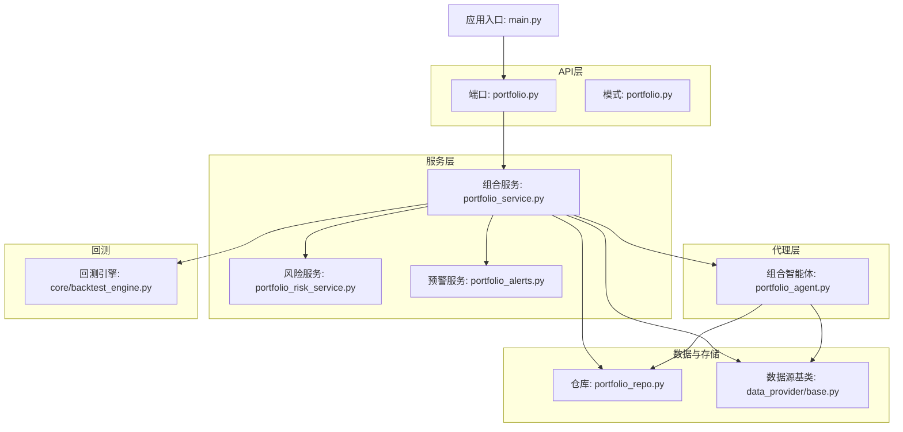
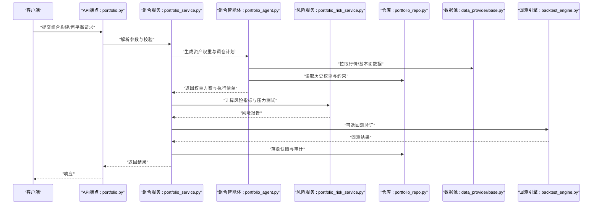
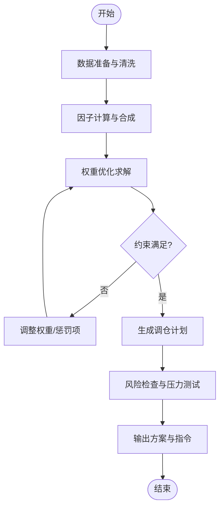
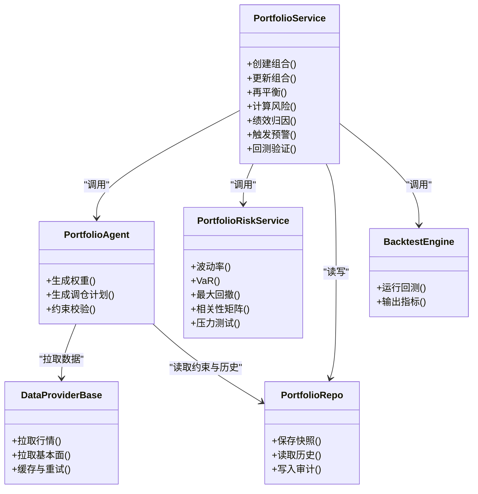
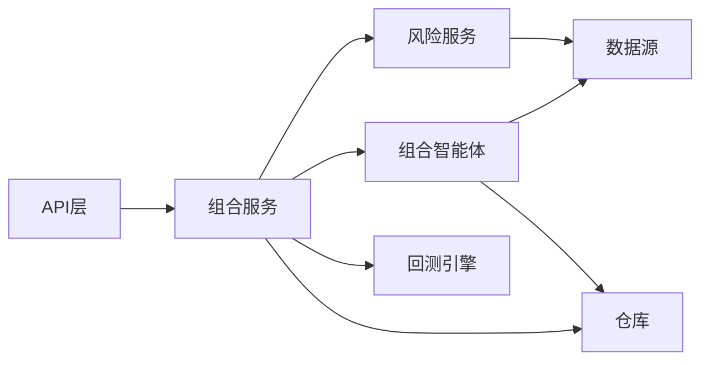

# 投资组合智能体

<cite>
**本文引用的文件**   
- [portfolio_agent.py](file://src/agent/agents/portfolio_agent.py)
- [portfolio_service.py](file://src/services/portfolio_service.py)
- [portfolio_risk_service.py](file://src/services/portfolio_risk_service.py)
- [portfolio_repo.py](file://src/repositories/portfolio_repo.py)
- [api/v1/endpoints/portfolio.py](file://api/v1/endpoints/portfolio.py)
- [api/v1/schemas/portfolio.py](file://api/v1/schemas/portfolio.py)
- [services/portfolio_alerts.py](file://src/services/portfolio_alerts.py)
- [core/backtest_engine.py](file://src/core/backtest_engine.py)
- [data_provider/base.py](file://data_provider/base.py)
- [main.py](file://main.py)
</cite>

## 目录
1. [简介](#简介)
2. [项目结构](#项目结构)
3. [核心组件](#核心组件)
4. [架构总览](#架构总览)
5. [详细组件分析](#详细组件分析)
6. [依赖关系分析](#依赖关系分析)
7. [性能考量](#性能考量)
8. [故障排查指南](#故障排查指南)
9. [结论](#结论)
10. [附录](#附录)

## 简介
本文件面向“投资组合智能体”模块，系统性阐述资产配置策略与优化算法、组合构建逻辑、风险收益分析与绩效归因方法、持仓监控与调仓触发条件、执行策略、健康度评估、流动性管理与相关性分析，以及与账户服务、交易系统的集成接口和数据同步机制。文档以代码级分析为基础，辅以架构图与时序图，帮助读者从业务到实现全面理解该模块。

## 项目结构
投资组合智能体由“Agent层（策略与编排）—Service层（业务编排）—Repository层（持久化）—API层（对外接口）—数据源层（行情与基本面）—回测引擎（离线验证）”构成。关键路径如下：
- Agent层：portfolio_agent.py 定义组合智能体的职责边界与工具调用入口
- Service层：portfolio_service.py 负责组合构建、再平衡、风控与绩效归因；portfolio_risk_service.py 专注风险指标计算；portfolio_alerts.py 负责预警与阈值管理
- Repository层：portfolio_repo.py 提供组合快照、历史与元数据的读写能力
- API层：endpoints/portfolio.py + schemas/portfolio.py 暴露REST接口，承载前端与外部系统交互
- 数据源层：data_provider/base.py 抽象数据获取协议，供组合分析拉取行情与基本面
- 回测引擎：core/backtest_engine.py 用于策略与权重方案的离线验证
- 应用入口：main.py 启动API与服务，注册路由与中间件

图表来源
- [api/v1/endpoints/portfolio.py](file://api/v1/endpoints/portfolio.py)
- [api/v1/schemas/portfolio.py](file://api/v1/schemas/portfolio.py)
- [src/services/portfolio_service.py](file://src/services/portfolio_service.py)
- [src/services/portfolio_risk_service.py](file://src/services/portfolio_risk_service.py)
- [src/services/portfolio_alerts.py](file://src/services/portfolio_alerts.py)
- [src/agent/agents/portfolio_agent.py](file://src/agent/agents/portfolio_agent.py)
- [src/repositories/portfolio_repo.py](file://src/repositories/portfolio_repo.py)
- [data_provider/base.py](file://data_provider/base.py)
- [src/core/backtest_engine.py](file://src/core/backtest_engine.py)
- [main.py](file://main.py)

章节来源
- [main.py](file://main.py)
- [api/v1/endpoints/portfolio.py](file://api/v1/endpoints/portfolio.py)
- [api/v1/schemas/portfolio.py](file://api/v1/schemas/portfolio.py)
- [src/services/portfolio_service.py](file://src/services/portfolio_service.py)
- [src/agent/agents/portfolio_agent.py](file://src/agent/agents/portfolio_agent.py)
- [src/repositories/portfolio_repo.py](file://src/repositories/portfolio_repo.py)
- [data_provider/base.py](file://data_provider/base.py)
- [src/core/backtest_engine.py](file://src/core/backtest_engine.py)

## 核心组件
- 组合智能体（Portfolio Agent）
  - 职责：将用户意图或系统信号转化为可执行的资产配置计划；协调数据拉取、因子计算、权重优化与再平衡建议；输出决策信号与执行清单。
  - 关键点：工具注册与路由、上下文拼装、约束校验、结果结构化。
- 组合服务（Portfolio Service）
  - 职责：组合生命周期管理（创建、更新、删除）、权重分配与再平衡、风险度量、绩效归因、预警联动、回测验证。
  - 关键点：事务性操作、幂等性、并发安全、审计日志。
- 风险服务（Portfolio Risk Service）
  - 职责：波动率、VaR、最大回撤、Beta、跟踪误差、相关性矩阵、压力测试等指标计算。
  - 关键点：数值稳定性、窗口选择、协方差估计方法。
- 预警服务（Portfolio Alerts）
  - 职责：阈值配置、事件检测、告警路由、抑制与聚合。
  - 关键点：规则引擎、去抖、分级通知。
- 仓库（Portfolio Repo）
  - 职责：组合快照、历史权重、交易记录、风险指标与绩效指标的持久化。
  - 关键点：索引设计、查询性能、一致性。
- 数据源（Data Provider Base）
  - 职责：统一行情、基本面、宏观数据接入；缓存与重试；异常降级。
  - 关键点：适配器模式、超时控制、限流。
- 回测引擎（Backtest Engine）
  - 职责：基于历史数据对权重方案与再平衡策略进行回测，输出收益曲线、风险指标与归因分解。
  - 关键点：事件驱动、滑点与手续费建模、基准对齐。

章节来源
- [src/agent/agents/portfolio_agent.py](file://src/agent/agents/portfolio_agent.py)
- [src/services/portfolio_service.py](file://src/services/portfolio_service.py)
- [src/services/portfolio_risk_service.py](file://src/services/portfolio_risk_service.py)
- [src/services/portfolio_alerts.py](file://src/services/portfolio_alerts.py)
- [src/repositories/portfolio_repo.py](file://src/repositories/portfolio_repo.py)
- [data_provider/base.py](file://data_provider/base.py)
- [src/core/backtest_engine.py](file://src/core/backtest_engine.py)

## 架构总览
组合智能体采用分层解耦设计：API层接收请求并做参数校验，Service层编排业务逻辑，Agent层封装策略与工具调用，Repository层负责数据存取，数据源层提供行情与基本面，回测引擎支撑离线验证。

图表来源
- [api/v1/endpoints/portfolio.py](file://api/v1/endpoints/portfolio.py)
- [src/services/portfolio_service.py](file://src/services/portfolio_service.py)
- [src/agent/agents/portfolio_agent.py](file://src/agent/agents/portfolio_agent.py)
- [src/services/portfolio_risk_service.py](file://src/services/portfolio_risk_service.py)
- [src/repositories/portfolio_repo.py](file://src/repositories/portfolio_repo.py)
- [data_provider/base.py](file://data_provider/base.py)
- [src/core/backtest_engine.py](file://src/core/backtest_engine.py)

## 详细组件分析

### 组合智能体（Portfolio Agent）
- 目标：将输入的市场环境与约束转化为可执行的资产配置方案，包括权重分配、分散化原则与再平衡触发条件。
- 输入：资产池、风险偏好、约束（单资产上限、行业/风格暴露、流动性门槛）、历史与实时数据。
- 处理流程：
  - 数据准备：通过数据源拉取价格序列、基本面与宏观因子，清洗与对齐时间戳。
  - 因子计算：动量、波动率、估值、质量等因子标准化与合成。
  - 权重优化：均值-方差优化、风险平价、Black-Litterman或自定义启发式；考虑交易成本与冲击。
  - 约束满足：硬约束（上限/下限、行业中性）与软约束（惩罚项）。
  - 输出：目标权重、调仓指令、预期风险与收益、敏感性分析。
- 关键设计：
  - 工具注册与路由：按功能域组织工具，避免耦合。
  - 上下文拼装：将市场状态、约束、历史快照组装为Agent上下文。
  - 幂等与审计：重复请求不产生副作用，记录决策轨迹。

图表来源
- [src/agent/agents/portfolio_agent.py](file://src/agent/agents/portfolio_agent.py)
- [data_provider/base.py](file://data_provider/base.py)

章节来源
- [src/agent/agents/portfolio_agent.py](file://src/agent/agents/portfolio_agent.py)
- [data_provider/base.py](file://data_provider/base.py)

### 组合服务（Portfolio Service）
- 职责：组合生命周期管理、权重分配与再平衡、风险度量、绩效归因、预警联动、回测验证。
- 主要流程：
  - 组合创建/更新：校验资产与权重合法性，写入仓库快照。
  - 再平衡：比较目标权重与实际权重，生成最小交易集，考虑交易成本与流动性。
  - 风险度量：波动率、VaR、最大回撤、Beta、相关性矩阵。
  - 绩效归因：Brinson归因（配置、选股、交互）、因子归因（风格/行业）、交易成本归因。
  - 预警联动：阈值触发、通知路由、抑制与聚合。
  - 回测验证：对权重方案进行历史回测，输出对比报告。
- 关键设计：
  - 事务性：组合快照与审计记录原子写入。
  - 并发安全：锁机制防止重复再平衡。
  - 可扩展：策略与风险模型插件化。

图表来源
- [src/services/portfolio_service.py](file://src/services/portfolio_service.py)
- [src/agent/agents/portfolio_agent.py](file://src/agent/agents/portfolio_agent.py)
- [src/services/portfolio_risk_service.py](file://src/services/portfolio_risk_service.py)
- [src/repositories/portfolio_repo.py](file://src/repositories/portfolio_repo.py)
- [data_provider/base.py](file://data_provider/base.py)
- [src/core/backtest_engine.py](file://src/core/backtest_engine.py)

章节来源
- [src/services/portfolio_service.py](file://src/services/portfolio_service.py)
- [src/services/portfolio_risk_service.py](file://src/services/portfolio_risk_service.py)
- [src/repositories/portfolio_repo.py](file://src/repositories/portfolio_repo.py)
- [data_provider/base.py](file://data_provider/base.py)
- [src/core/backtest_engine.py](file://src/core/backtest_engine.py)

### 风险服务（Portfolio Risk Service）
- 指标体系：
  - 波动率：年化波动率、滚动波动率、分位数波动率。
  - VaR：历史模拟法、蒙特卡洛、参数法。
  - 最大回撤：峰值到谷值的最大跌幅。
  - Beta与相关性：与基准及资产间的相关矩阵。
  - 压力测试：极端情景下的组合表现。
- 计算方法：
  - 协方差估计：样本协方差、指数加权、收缩估计。
  - 风险贡献：边际风险贡献与成分风险。
- 性能与稳定性：
  - 数值稳定：协方差矩阵正定性与正则化。
  - 窗口选择：自适应窗口与事件驱动更新。

章节来源
- [src/services/portfolio_risk_service.py](file://src/services/portfolio_risk_service.py)

### 预警服务（Portfolio Alerts）
- 规则类型：权重偏离阈值、波动率突破、VaR超限、相关性突变、流动性不足。
- 处理流程：
  - 规则匹配：事件检测与评分。
  - 通知路由：多渠道发送（邮件、IM、Webhook）。
  - 抑制与聚合：去抖、合并同类告警。
- 配置管理：动态加载、版本化管理、灰度发布。

章节来源
- [src/services/portfolio_alerts.py](file://src/services/portfolio_alerts.py)

### 仓库（Portfolio Repo）
- 数据模型：
  - 组合快照：时间戳、资产权重、现金比例、风险指标摘要。
  - 历史权重：时间序列权重变化。
  - 审计日志：操作人、动作、前后状态。
- 查询优化：
  - 索引：组合ID、时间戳、资产代码。
  - 分页与过滤：高效检索。
- 一致性：
  - 事务写入与快照版本号。

章节来源
- [src/repositories/portfolio_repo.py](file://src/repositories/portfolio_repo.py)

### API层（Portfolio API）
- 端点：
  - 组合CRUD：创建、更新、删除、查询。
  - 再平衡：触发再平衡与查看进度。
  - 风险与绩效：查询风险指标与绩效归因。
  - 预警：规则管理与告警历史。
- 模式：Pydantic模型校验请求与响应，确保契约一致。
- 错误处理：统一错误码与消息，便于前端展示与调试。

章节来源
- [api/v1/endpoints/portfolio.py](file://api/v1/endpoints/portfolio.py)
- [api/v1/schemas/portfolio.py](file://api/v1/schemas/portfolio.py)

### 数据源（Data Provider Base）
- 抽象协议：统一拉取接口，支持多数据源适配。
- 特性：
  - 缓存：内存与磁盘缓存，减少重复请求。
  - 重试与退避：网络异常自动重试。
  - 限流：保护上游服务。
- 扩展：新增数据源只需实现适配器。

章节来源
- [data_provider/base.py](file://data_provider/base.py)

### 回测引擎（Backtest Engine）
- 能力：
  - 事件驱动回测：逐日/逐分钟回放。
  - 成本建模：手续费、滑点、冲击成本。
  - 基准对齐：同口径收益与风险指标。
- 输出：收益曲线、风险指标、归因分解、交易明细。
- 使用场景：策略验证、参数寻优、压力测试。

章节来源
- [src/core/backtest_engine.py](file://src/core/backtest_engine.py)

## 依赖关系分析
- 组件耦合：
  - API层仅依赖Service层，保持薄接口。
  - Service层依赖Agent、Risk、Repo、DataProvider与BacktestEngine，职责清晰。
  - Agent层依赖DataProvider与Repo，避免直接访问API。
- 外部依赖：
  - 数据源适配器：行情与基本面数据。
  - 通知渠道：邮件、IM、Webhook。
  - 数据库：组合快照与审计日志。
- 潜在循环依赖：
  - 通过接口隔离与依赖注入避免循环。

图表来源
- [api/v1/endpoints/portfolio.py](file://api/v1/endpoints/portfolio.py)
- [src/services/portfolio_service.py](file://src/services/portfolio_service.py)
- [src/agent/agents/portfolio_agent.py](file://src/agent/agents/portfolio_agent.py)
- [src/services/portfolio_risk_service.py](file://src/services/portfolio_risk_service.py)
- [src/repositories/portfolio_repo.py](file://src/repositories/portfolio_repo.py)
- [data_provider/base.py](file://data_provider/base.py)
- [src/core/backtest_engine.py](file://src/core/backtest_engine.py)

章节来源
- [api/v1/endpoints/portfolio.py](file://api/v1/endpoints/portfolio.py)
- [src/services/portfolio_service.py](file://src/services/portfolio_service.py)
- [src/agent/agents/portfolio_agent.py](file://src/agent/agents/portfolio_agent.py)
- [src/services/portfolio_risk_service.py](file://src/services/portfolio_risk_service.py)
- [src/repositories/portfolio_repo.py](file://src/repositories/portfolio_repo.py)
- [data_provider/base.py](file://data_provider/base.py)
- [src/core/backtest_engine.py](file://src/core/backtest_engine.py)

## 性能考量
- 数据拉取：
  - 批量拉取与缓存命中优先，减少网络开销。
  - 异步并发与限流保护上游。
- 风险计算：
  - 协方差矩阵估计采用收缩或指数加权提升稳定性。
  - 滚动窗口增量更新，避免全量重算。
- 回测性能：
  - 向量化计算与并行回放。
  - 事件驱动减少不必要的数据扫描。
- 存储查询：
  - 合理索引与分区，提高查询效率。
  - 快照压缩与归档策略。

[本节为通用指导，无需特定文件引用]

## 故障排查指南
- 常见问题：
  - 数据拉取失败：检查数据源适配器配置、网络连通性与限流策略。
  - 风险指标异常：检查协方差矩阵正定性、窗口长度与异常值处理。
  - 再平衡未触发：检查阈值配置、去抖策略与事件队列。
  - 回测结果偏差：核对成本建模、基准对齐与数据对齐。
- 诊断步骤：
  - 查看审计日志与快照版本，确认操作轨迹。
  - 启用详细日志与追踪ID，定位调用链。
  - 使用回测引擎复现实验，对比差异。
- 恢复策略：
  - 回滚至最近稳定快照。
  - 重置规则与阈值，逐步恢复。

章节来源
- [src/repositories/portfolio_repo.py](file://src/repositories/portfolio_repo.py)
- [src/services/portfolio_alerts.py](file://src/services/portfolio_alerts.py)
- [src/core/backtest_engine.py](file://src/core/backtest_engine.py)

## 结论
投资组合智能体通过分层解耦与插件化设计，实现了从资产配置到风险度量、从预警到回测的完整闭环。其核心在于稳健的数据管道、可解释的风险模型与高效的执行策略。未来可在因子库扩展、更精细的成本建模与实时风控方面持续演进。

[本节为总结性内容，无需特定文件引用]

## 附录
- 术语表：
  - 再平衡：调整资产权重以回归目标配置。
  - VaR：在给定置信水平下的最大可能损失。
  - Brinson归因：将超额收益分解为配置、选股与交互效应。
- 最佳实践：
  - 约束先行：明确硬约束与软约束，避免过度拟合。
  - 成本敏感：将交易成本纳入优化目标。
  - 监控闭环：建立预警与回测反馈机制。

[本节为补充信息，无需特定文件引用]