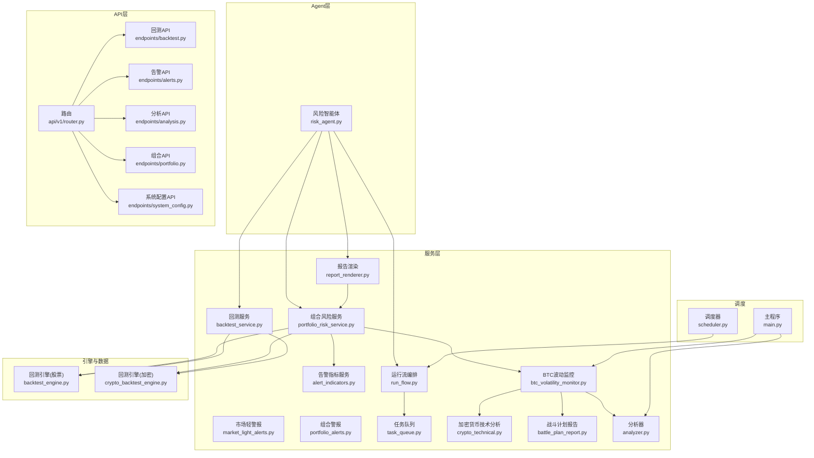
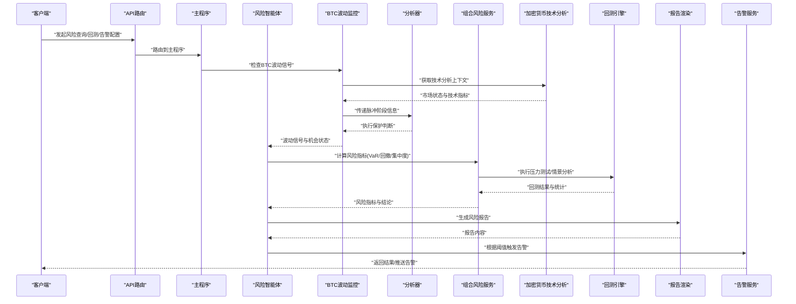
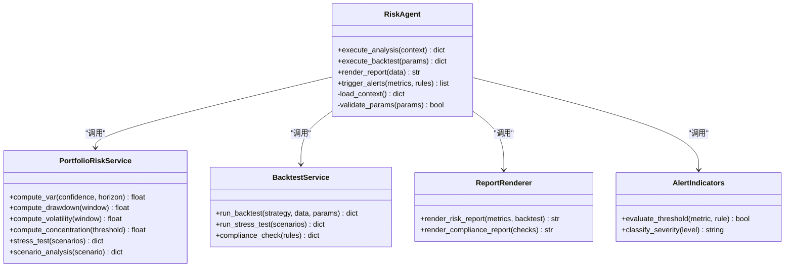
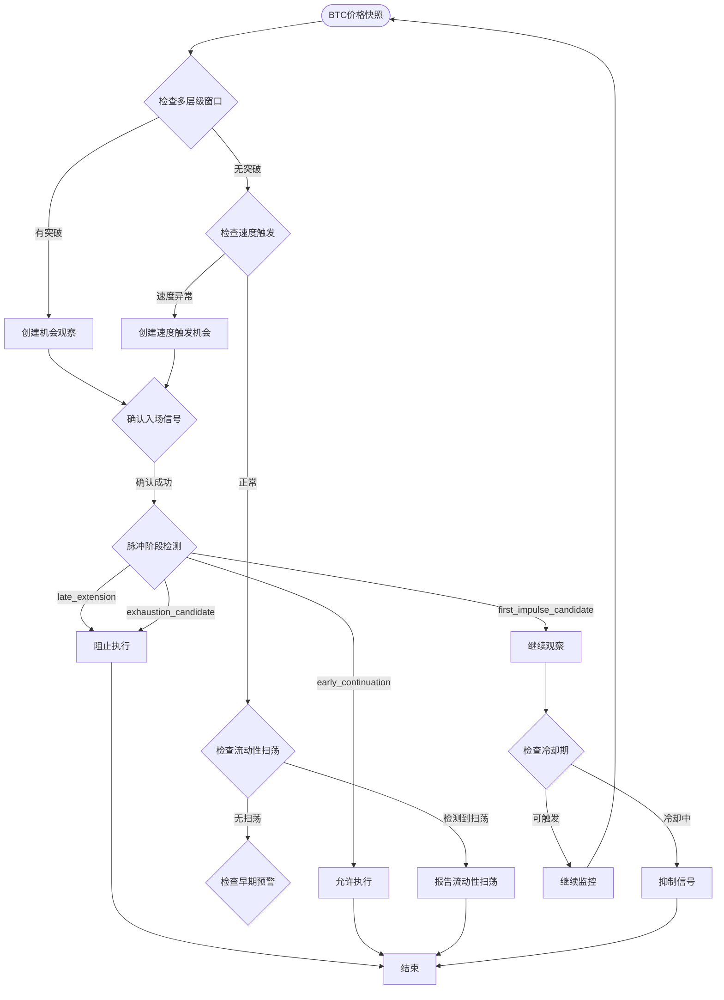
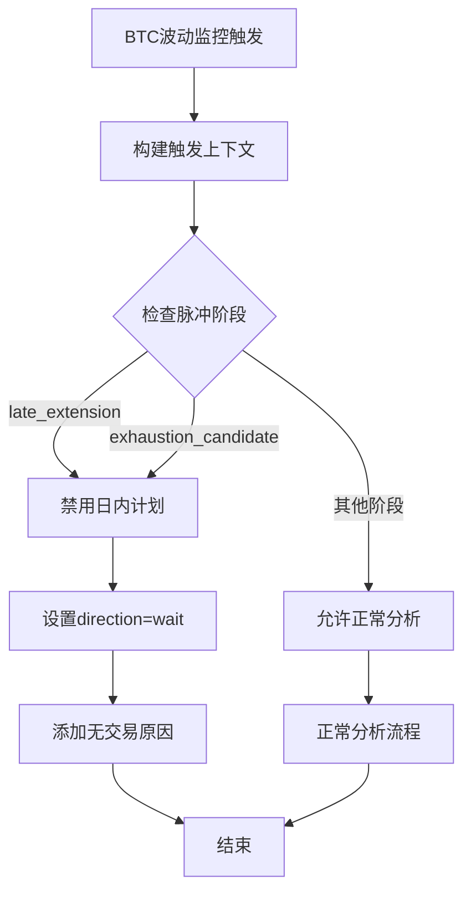
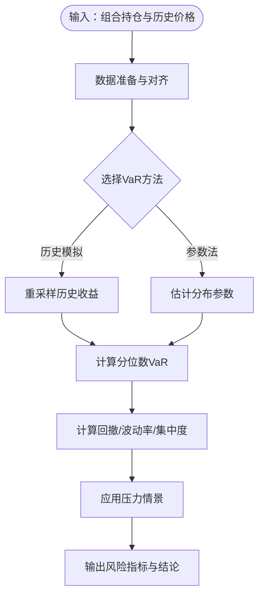
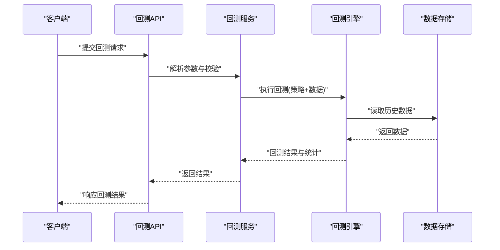
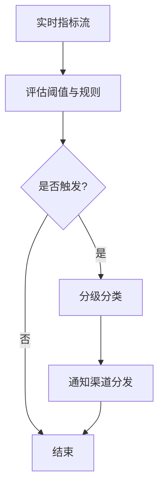
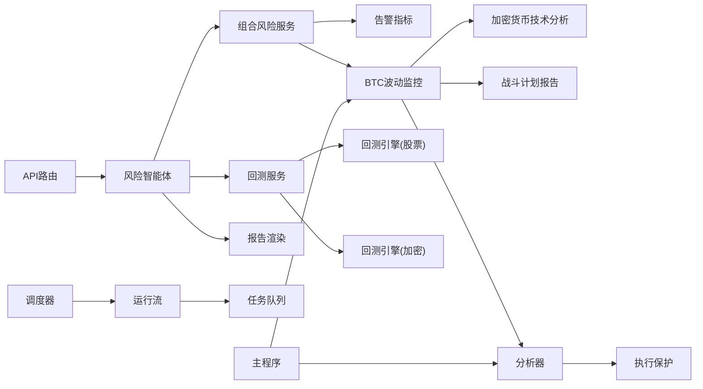

# 风险管理智能体

<cite>
**本文引用的文件**   
- [risk_agent.py](file://src/agent/agents/risk_agent.py)
- [portfolio_risk_service.py](file://src/services/portfolio_risk_service.py)
- [alert_indicators.py](file://src/services/alert_indicators.py)
- [btc_volatility_monitor.py](file://src/services/btc_volatility_monitor.py)
- [crypto_technical.py](file://src/crypto_technical.py)
- [battle_plan_report.py](file://src/utils/battle_plan_report.py)
- [backtest_engine.py](file://src/core/backtest_engine.py)
- [crypto_backtest_engine.py](file://src/core/crypto_backtest_engine.py)
- [backtest_service.py](file://src/services/backtest_service.py)
- [report_renderer.py](file://src/services/report_renderer.py)
- [market_light_alerts.py](file://src/services/market_light_alerts.py)
- [portfolio_alerts.py](file://src/services/portfolio_alerts.py)
- [api_router_v1.py](file://api/v1/router.py)
- [backtest_api.py](file://api/v1/endpoints/backtest.py)
- [alerts_api.py](file://api/v1/endpoints/alerts.py)
- [analysis_api.py](file://api/v1/endpoints/analysis.py)
- [portfolio_api.py](file://api/v1/endpoints/portfolio.py)
- [system_config_api.py](file://api/v1/endpoints/system_config.py)
- [run_flow.py](file://src/services/run_flow.py)
- [task_queue.py](file://src/services/task_queue.py)
- [scheduler.py](file://src/scheduler.py)
- [analyzer.py](file://src/analyzer.py)
- [main.py](file://main.py)
</cite>

## 更新摘要
**变更内容**   
- 增强了BTC波动监控系统，新增脉冲阶段检测系统（first_impulse_candidate, early_continuation, late_extension, exhaustion_candidate）
- 添加了执行保护逻辑以防止追涨已延伸的行情
- 实现了多层级窗口检测与自适应阈值机制
- 集成了加密货币特定上下文检测和战斗计划提示注入
- 更新了风险指标监控和预警触发条件

## 目录
1. [简介](#简介)
2. [项目结构](#项目结构)
3. [核心组件](#核心组件)
4. [架构总览](#架构总览)
5. [详细组件分析](#详细组件分析)
6. [依赖关系分析](#依赖关系分析)
7. [性能考量](#性能考量)
8. [故障排查指南](#故障排查指南)
9. [结论](#结论)
10. [附录](#附录)

## 简介
本文件面向"风险管理智能体"的完整技术文档，覆盖风险控制机制与风险评估模型（VaR、压力测试、情景分析）、风险指标监控与阈值预警、风险限额管理、止损策略与仓位限制、风险报告生成、历史回测与合规检查，以及与市场波动监测、流动性风险和信用风险的关联处理。同时给出风险模型的校准方法与参数调优策略，帮助读者从业务到实现全面理解系统。

**更新** 本次更新重点增强了BTC波动监控系统，引入了脉冲阶段检测系统、执行保护逻辑、多层级窗口检测、流动性扫荡识别、自适应阈值调整等高级功能，并集成了加密货币特定的上下文检测和战斗计划提示注入机制。

## 项目结构
风险管理智能体由"Agent层 + 服务层 + 数据与引擎层 + API层 + 调度与任务层"构成：
- Agent层：风险智能体负责编排风控流程、调用工具与服务、输出风控决策建议。
- 服务层：组合计算风险指标、执行回测、渲染报告、触发告警等。
- 数据与引擎层：提供回测引擎（股票/加密资产）、市场波动监控、行情与持仓数据接入。
- API层：对外暴露风险查询、回测、告警、配置等接口。
- 调度与任务层：定时任务与异步任务队列支撑批量计算与实时告警。

**图表来源** 
- [risk_agent.py](file://src/agent/agents/risk_agent.py)
- [portfolio_risk_service.py](file://src/services/portfolio_risk_service.py)
- [alert_indicators.py](file://src/services/alert_indicators.py)
- [btc_volatility_monitor.py](file://src/services/btc_volatility_monitor.py)
- [crypto_technical.py](file://src/crypto_technical.py)
- [battle_plan_report.py](file://src/utils/battle_plan_report.py)
- [backtest_engine.py](file://src/core/backtest_engine.py)
- [crypto_backtest_engine.py](file://src/core/crypto_backtest_engine.py)
- [backtest_service.py](file://src/services/backtest_service.py)
- [report_renderer.py](file://src/services/report_renderer.py)
- [market_light_alerts.py](file://src/services/market_light_alerts.py)
- [portfolio_alerts.py](file://src/services/portfolio_alerts.py)
- [run_flow.py](file://src/services/run_flow.py)
- [task_queue.py](file://src/services/task_queue.py)
- [api/v1/router.py](file://api/v1/router.py)
- [api/v1/endpoints/backtest.py](file://api/v1/endpoints/backtest.py)
- [api/v1/endpoints/alerts.py](file://api/v1/endpoints/alerts.py)
- [api/v1/endpoints/analysis.py](file://api/v1/endpoints/analysis.py)
- [api/v1/endpoints/portfolio.py](file://api/v1/endpoints/portfolio.py)
- [api/v1/endpoints/system_config.py](file://api/v1/endpoints/system_config.py)
- [scheduler.py](file://src/scheduler.py)
- [analyzer.py](file://src/analyzer.py)
- [main.py](file://main.py)

**章节来源**
- [risk_agent.py](file://src/agent/agents/risk_agent.py)
- [portfolio_risk_service.py](file://src/services/portfolio_risk_service.py)
- [backtest_service.py](file://src/services/backtest_service.py)
- [report_renderer.py](file://src/services/report_renderer.py)
- [api/v1/router.py](file://api/v1/router.py)
- [scheduler.py](file://src/scheduler.py)

## 核心组件
- 风险智能体（Risk Agent）：编排风控流程，聚合多源数据，驱动回测与指标计算，输出限额与止损建议。
- 组合风险服务（Portfolio Risk Service）：实现VaR、回撤、波动率、集中度、流动性与信用风险度量；对接回测引擎进行压力测试与情景分析。
- 告警指标服务（Alert Indicators）：定义指标阈值、触发条件与分级告警策略。
- **增强的** BTC波动监控系统（BTC Volatility Monitor）：支持脉冲阶段检测、多层级窗口检测、流动性扫荡识别、自适应阈值调整、速度触发和快速确认模式。
- 加密货币技术分析（Crypto Technical Analysis）：提供BTC特有的技术分析框架和市场状态评估。
- 战斗计划报告（Battle Plan Report）：生成双向交易计划和分步执行方案。
- 分析器（Analyzer）：集成脉冲阶段检测和执行保护逻辑，防止追涨已延伸的行情。
- 回测服务（Backtest Service）：统一封装股票与加密资产的回测能力，支持历史回测与合规检查。
- 报告渲染（Report Renderer）：将风险指标、回测结果与合规检查结果渲染为结构化报告。
- 运行流与任务队列（Run Flow & Task Queue）：编排复杂风控任务，支持异步执行与重试。

**章节来源**
- [risk_agent.py](file://src/agent/agents/risk_agent.py)
- [portfolio_risk_service.py](file://src/services/portfolio_risk_service.py)
- [alert_indicators.py](file://src/services/alert_indicators.py)
- [btc_volatility_monitor.py](file://src/services/btc_volatility_monitor.py)
- [crypto_technical.py](file://src/crypto_technical.py)
- [battle_plan_report.py](file://src/utils/battle_plan_report.py)
- [analyzer.py](file://src/analyzer.py)
- [backtest_service.py](file://src/services/backtest_service.py)
- [report_renderer.py](file://src/services/report_renderer.py)
- [run_flow.py](file://src/services/run_flow.py)
- [task_queue.py](file://src/services/task_queue.py)

## 架构总览
下图展示从API请求到风险计算、回测、报告与告警的端到端流程，包括增强的BTC波动监控功能和脉冲阶段检测。

**图表来源** 
- [api/v1/router.py](file://api/v1/router.py)
- [main.py](file://main.py)
- [risk_agent.py](file://src/agent/agents/risk_agent.py)
- [portfolio_risk_service.py](file://src/services/portfolio_risk_service.py)
- [btc_volatility_monitor.py](file://src/services/btc_volatility_monitor.py)
- [crypto_technical.py](file://src/crypto_technical.py)
- [analyzer.py](file://src/analyzer.py)
- [backtest_engine.py](file://src/core/backtest_engine.py)
- [crypto_backtest_engine.py](file://src/core/crypto_backtest_engine.py)
- [report_renderer.py](file://src/services/report_renderer.py)
- [portfolio_alerts.py](file://src/services/portfolio_alerts.py)
- [market_light_alerts.py](file://src/services/market_light_alerts.py)

## 详细组件分析

### 风险智能体（Risk Agent）
- 职责：协调数据获取、指标计算、回测执行、报告生成与告警触发；维护风控上下文与策略开关。
- 关键流程：
  - 接收外部请求（分析/回测/告警）。
  - 调用组合风险服务计算指标。
  - 调用回测服务执行压力测试与情景分析。
  - 渲染报告并持久化。
  - 基于阈值与规则触发告警。
- 设计要点：
  - 可插拔的工具与服务注册，便于扩展新的风险因子或回测场景。
  - 错误隔离与降级：当某服务不可用时，仍尽量返回部分结果与警告。

**图表来源** 
- [risk_agent.py](file://src/agent/agents/risk_agent.py)
- [portfolio_risk_service.py](file://src/services/portfolio_risk_service.py)
- [backtest_service.py](file://src/services/backtest_service.py)
- [report_renderer.py](file://src/services/report_renderer.py)
- [alert_indicators.py](file://src/services/alert_indicators.py)

**章节来源**
- [risk_agent.py](file://src/agent/agents/risk_agent.py)

### 增强的BTC波动监控系统
**更新** 系统现已支持脉冲阶段检测、执行保护逻辑、多层级窗口检测、流动性扫荡识别、自适应阈值调整和速度触发等高级功能。

#### 脉冲阶段检测系统
系统现在能够识别四种不同的脉冲阶段，为交易决策提供更精细的风险控制：

- **first_impulse_candidate**：首次脉冲候选阶段，价格刚突破阈值，需要进一步确认
- **early_continuation**：早期延续阶段，入场信号已确认，适合执行交易
- **late_extension**：晚期延伸阶段，价格已过度延伸，禁止追涨
- **exhaustion_candidate**：衰竭候选阶段，脉冲动能耗尽，等待新的确认信号

#### 执行保护逻辑
为了防止追涨已延伸的行情，系统实现了智能的执行保护机制：

- **追涨检测**：当检测到`late_extension`或`exhaustion_candidate`阶段时，自动禁用日内交易计划
- **无追价保护**：设置`no_chase_price`作为追涨上限，超过此价格不执行新仓位
- **智能降级**：在危险阶段将交易方向设置为`wait`，避免冲动交易

#### 多层级窗口检测系统
- **短窗口快速移动检测**：1分钟窗口，0.4%阈值，用于捕捉快速价格变动
- **中长窗口趋势检测**：15分钟窗口，1.5%阈值，用于识别较慢的趋势性移动
- **灵活窗口配置**：支持自定义窗口大小和阈值组合，格式如"1:0.4,3:0.7,5:1.0,15:1.5"

#### 流动性扫荡检测
- **极端价格识别**：检测窗口内最高价和最低价的极端移动
- **反转确认**：当价格从极端位置大幅回落后，标记为流动性扫荡事件
- **非交易信号**：流动性扫荡仅作为告警，不触发完整的分析流程

#### 自适应阈值机制
- **动态调整**：基于近期波动率统计自动调整检测阈值
- **最小样本要求**：需要至少30个样本点才能启用自适应功能
- **范围限制**：阈值在0.1%-2.0%范围内调整，避免过度敏感

#### 速度触发器
- **瞬时速度检测**：检测单轮轮询间的异常高速度移动
- **基线比较**：与近期中位数速度进行比较，超过倍数阈值时触发
- **防噪机制**：设置绝对最小百分比阈值，避免在平静市场中误报

#### 快速确认模式
- **暴力移动加速**：对于超过阈值1.5倍的剧烈移动，仅需单个样本确认
- **时间优先**：在快速市场中优先考虑及时性而非噪声过滤
- **可配置参数**：可通过`fast_confirmation_mult`参数调整触发条件

**图表来源** 
- [btc_volatility_monitor.py:419-557](file://src/services/btc_volatility_monitor.py#L419-L557)
- [btc_volatility_monitor.py:559-619](file://src/services/btc_volatility_monitor.py#L559-L619)
- [btc_volatility_monitor.py:755-916](file://src/services/btc_volatility_monitor.py#L755-L916)
- [btc_volatility_monitor.py:954-1006](file://src/services/btc_volatility_monitor.py#L954-L1006)

**章节来源**
- [btc_volatility_monitor.py:54-77](file://src/services/btc_volatility_monitor.py#L54-L77)
- [btc_volatility_monitor.py:80-418](file://src/services/btc_volatility_monitor.py#L80-L418)
- [btc_volatility_monitor.py:419-557](file://src/services/btc_volatility_monitor.py#L419-L557)
- [btc_volatility_monitor.py:559-619](file://src/services/btc_volatility_monitor.py#L559-L619)
- [btc_volatility_monitor.py:755-916](file://src/services/btc_volatility_monitor.py#L755-L916)
- [btc_volatility_monitor.py:954-1006](file://src/services/btc_volatility_monitor.py#L954-L1006)

### 分析器与执行保护
**更新** 分析器现在集成了脉冲阶段检测和执行保护逻辑，防止追涨已延伸的行情。

#### 脉冲阶段保护机制
- **阶段识别**：检测`late_extension`和`exhaustion_candidate`两种危险阶段
- **自动禁用**：在危险阶段自动禁用日内交易计划，设置方向为`wait`
- **原因说明**：提供中英文双语的原因说明，解释为什么当前不具备执行条件

#### 执行上下文传递
- **上下文传递**：从主程序传递脉冲阶段信息到分析器
- **价格保护**：传递`no_chase_price`作为追涨保护价位
- **智能降级**：根据脉冲阶段自动调整交易计划的执行状态

**图表来源** 
- [analyzer.py:1870-1914](file://src/analyzer.py#L1870-L1914)
- [main.py:1480-1516](file://main.py#L1480-L1516)

**章节来源**
- [analyzer.py:1870-1914](file://src/analyzer.py#L1870-L1914)
- [main.py:1480-1516](file://main.py#L1480-L1516)

### 加密货币技术分析框架
**更新** 新增了专门的加密货币技术分析模块，提供BTC特有的市场状态评估和技术指标。

#### 多时间框架分析
- **日线框架**：提供长期趋势判断和关键支撑阻力位
- **小时线框架**：独立日内机会识别，不受日线完全约束
- **时间框架对齐**：评估不同时间框架间的一致性

#### 技术指标体系
- **价格行为分析**：突破、跌破、流动性扫荡、区间震荡
- **斐波那契回撤**：关键回撤位计算和识别
- **成交量分析**：成交量比率确认和活跃度评估
- **VWAP定位**：价格相对成交量加权平均价的位置
- **EMA结构**：指数移动平均线的多头/空头排列

#### 事件驱动分析
- **急跌反弹识别**：检测恐慌性抛售后的反弹机会
- **流动性扫荡反转**：识别假突破后的反转信号
- **支撑阻力确认**：关键价位的有效性和失效判断

**章节来源**
- [crypto_technical.py:19-81](file://src/crypto_technical.py#L19-L81)
- [crypto_technical.py:138-222](file://src/crypto_technical.py#L138-L222)
- [crypto_technical.py:225-402](file://src/crypto_technical.py#L225-L402)
- [crypto_technical.py:467-501](file://src/crypto_technical.py#L467-L501)

### 战斗计划报告系统
**更新** 集成了加密货币特定的战斗计划生成和双向交易策略支持。

#### 双向交易计划
- **日线多单计划**：长期看涨策略的详细执行方案
- **日线空单计划**：长期看跌策略的详细执行方案  
- **小时线日内计划**：短期交易机会的日内执行方案

#### 分步执行机制
- **试仓阶段**：初始小仓位试探市场反应
- **确认后加仓**：信号确认后的仓位增加策略
- **失效撤销**：条件不满足时的退出机制

#### 执行验证系统
- **校验状态跟踪**：实时监控计划执行状态
- **条件验证**：自动检查入场、止损、止盈条件
- **执行日志**：记录每个阶段的执行情况

**章节来源**
- [battle_plan_report.py:18-91](file://src/utils/battle_plan_report.py#L18-L91)
- [battle_plan_report.py:94-150](file://src/utils/battle_plan_report.py#L94-L150)

### 组合风险服务（Portfolio Risk Service）
- VaR计算：支持历史模拟法与参数法（正态/学生t），可按置信水平与持有期计算。
- 回撤与波动率：滚动窗口计算最大回撤与年化波动率，支持不同频率数据。
- 集中度与流动性：按权重分布评估集中度；结合买卖价差与成交量估算流动性风险。
- 信用风险：对债券/衍生品头寸评估违约概率与损失敞口（基于外部评级或内部模型）。
- 压力测试与情景分析：内置宏观冲击、行业冲击、个股黑天鹅等情景模板，支持自定义情景。

**图表来源** 
- [portfolio_risk_service.py](file://src/services/portfolio_risk_service.py)

**章节来源**
- [portfolio_risk_service.py](file://src/services/portfolio_risk_service.py)

### 回测服务与引擎（Backtest Service & Engines）
- 回测服务：统一封装股票与加密资产回测，支持策略参数扫描、绩效统计、合规检查。
- 回测引擎（股票）：事件驱动或向量化回测，支持交易成本、滑点、涨跌停与停牌处理。
- 回测引擎（加密）：支持24小时连续合约、资金费率、深度与订单簿快照。
- 合规检查：对照监管规则（如单一标的上限、杠杆限制、禁投名单）进行校验。

**图表来源** 
- [api/v1/endpoints/backtest.py](file://api/v1/endpoints/backtest.py)
- [backtest_service.py](file://src/services/backtest_service.py)
- [backtest_engine.py](file://src/core/backtest_engine.py)
- [crypto_backtest_engine.py](file://src/core/crypto_backtest_engine.py)

**章节来源**
- [backtest_service.py](file://src/services/backtest_service.py)
- [backtest_engine.py](file://src/core/backtest_engine.py)
- [crypto_backtest_engine.py](file://src/core/crypto_backtest_engine.py)
- [api/v1/endpoints/backtest.py](file://api/v1/endpoints/backtest.py)

### 告警指标与阈值（Alert Indicators）
- 指标定义：VaR突破、回撤超阈、波动率飙升、集中度超限、流动性枯竭、信用事件。
- 阈值设置：支持静态阈值与动态阈值（基于滚动统计与分位数）。
- 触发条件：多级告警（提示/警告/严重），支持去抖与冷却时间。
- 联动策略：与市场波动监控联动，自动切换风控强度。

**图表来源** 
- [alert_indicators.py](file://src/services/alert_indicators.py)
- [market_light_alerts.py](file://src/services/market_light_alerts.py)
- [portfolio_alerts.py](file://src/services/portfolio_alerts.py)

**章节来源**
- [alert_indicators.py](file://src/services/alert_indicators.py)
- [market_light_alerts.py](file://src/services/market_light_alerts.py)
- [portfolio_alerts.py](file://src/services/portfolio_alerts.py)

### 报告渲染（Report Renderer）
- 内容：风险指标汇总、回测绩效、合规检查结果、告警历史与建议。
- 格式：Markdown/HTML/PDF，支持模板定制与多语言。
- 集成：与系统配置API联动，支持主题与语言切换。

**章节来源**
- [report_renderer.py](file://src/services/report_renderer.py)
- [api/v1/endpoints/system_config.py](file://api/v1/endpoints/system_config.py)

### 运行流与任务队列（Run Flow & Task Queue）
- 运行流：编排多步骤风控任务（数据拉取→指标计算→回测→报告→告警）。
- 任务队列：异步执行长耗时任务，支持重试、超时与进度查询。
- 调度器：定时触发每日风控巡检与报告生成。

**章节来源**
- [run_flow.py](file://src/services/run_flow.py)
- [task_queue.py](file://src/services/task_queue.py)
- [scheduler.py](file://src/scheduler.py)

## 依赖关系分析
- 低耦合：各服务通过清晰接口交互，便于替换实现（如更换回测引擎或告警通道）。
- 可扩展：新增风险因子或情景只需扩展服务层与指标定义。
- 外部依赖：数据源（行情/基本面）、通知渠道（邮件/IM）、存储（数据库/对象存储）。

**图表来源** 
- [risk_agent.py](file://src/agent/agents/risk_agent.py)
- [portfolio_risk_service.py](file://src/services/portfolio_risk_service.py)
- [backtest_service.py](file://src/services/backtest_service.py)
- [report_renderer.py](file://src/services/report_renderer.py)
- [alert_indicators.py](file://src/services/alert_indicators.py)
- [btc_volatility_monitor.py](file://src/services/btc_volatility_monitor.py)
- [crypto_technical.py](file://src/crypto_technical.py)
- [battle_plan_report.py](file://src/utils/battle_plan_report.py)
- [analyzer.py](file://src/analyzer.py)
- [backtest_engine.py](file://src/core/backtest_engine.py)
- [crypto_backtest_engine.py](file://src/core/crypto_backtest_engine.py)
- [api/v1/router.py](file://api/v1/router.py)
- [run_flow.py](file://src/services/run_flow.py)
- [task_queue.py](file://src/services/task_queue.py)
- [scheduler.py](file://src/scheduler.py)
- [main.py](file://main.py)

**章节来源**
- [api/v1/router.py](file://api/v1/router.py)
- [scheduler.py](file://src/scheduler.py)

## 性能考量
- 指标计算优化：使用向量化计算与缓存热点数据（价格、波动率、VaR）。
- 回测并行：策略参数扫描采用并发执行，限制并发度避免资源争用。
- 内存管理：大窗口历史数据采用分块加载与增量更新。
- 告警去抖：高频指标采用滑动窗口与冷却时间减少误报。
- I/O优化：异步I/O与连接池提升数据拉取与通知发送效率。
- **新增** 多层级窗口检测的性能优化：通过分层处理和短路逻辑减少不必要的计算。
- **新增** 脉冲阶段检测的轻量级实现：避免重复计算，提高响应速度。

## 故障排查指南
- 常见问题：
  - 数据缺失或延迟：检查数据源连通性与缓存失效策略。
  - 回测失败：核对参数合法性、数据对齐与交易规则约束。
  - 告警风暴：调整阈值与冷却时间，启用分级告警。
  - 报告渲染异常：检查模板变量与语言配置。
  - **新增** BTC波动监控误报：检查多层级窗口配置和自适应阈值设置。
  - **新增** 脉冲阶段检测异常：检查`impulse_stage`字段是否正确传递。
  - **新增** 执行保护误判：检查`entry_executable_now`和`no_chase_price`参数。
- 定位方法：
  - 查看运行流日志与任务队列状态。
  - 使用健康检查接口确认服务可用性。
  - 回放历史数据验证指标一致性。
  - **新增** 检查BTC波动监控的配置参数和窗口层级设置。
  - **新增** 验证脉冲阶段检测逻辑和执行保护机制。

**章节来源**
- [api/v1/endpoints/analysis.py](file://api/v1/endpoints/analysis.py)
- [api/v1/endpoints/portfolio.py](file://api/v1/endpoints/portfolio.py)
- [api/v1/endpoints/alerts.py](file://api/v1/endpoints/alerts.py)
- [api/v1/endpoints/system_config.py](file://api/v1/endpoints/system_config.py)

## 结论
风险管理智能体以"智能体编排 + 服务化计算 + 引擎化回测 + 报告与告警"为核心架构，覆盖VaR、压力测试、情景分析、限额与止损、流动性与信用风险、合规检查与报告生成。**更新** 本次增强显著提升了BTC市场的波动监控能力，通过脉冲阶段检测系统、执行保护逻辑、多层级窗口检测、流动性扫荡识别、自适应阈值调整和速度触发等高级功能，能够更精准地捕捉市场机会和风险信号。

系统现在支持：
- 脉冲阶段检测（first_impulse_candidate, early_continuation, late_extension, exhaustion_candidate）
- 执行保护逻辑防止追涨已延伸的行情
- 多层级窗口检测（1分钟0.4%到15分钟1.5%）
- 流动性扫荡事件的专门识别
- 自适应阈值调整机制
- 速度触发器的瞬时波动检测
- 快速确认模式的暴力移动加速
- 加密货币特定的上下文检测和战斗计划生成

建议持续优化指标计算性能、完善情景库与校准流程，并加强监控与故障自愈能力。

## 附录
- 风险模型校准与参数调优：
  - 校准方法：滚动窗口估计、贝叶斯更新、机器学习辅助的参数回归。
  - 调优策略：网格搜索与贝叶斯优化结合，目标函数包含夏普比率、最大回撤与VaR覆盖率。
  - 验证方式：样本外回测、交叉验证、压力测试一致性检验。
- 合规检查清单：
  - 单一标的权重上限、行业集中度限制、杠杆倍数限制、禁投名单匹配。
  - 流动性指标阈值（买卖价差、成交量占比）与信用事件预警。
- **新增** BTC波动监控配置参数：
  - `BTC_VOLATILITY_MONITOR_WINDOW_TIERS`：多层级窗口配置（如"1:0.4,3:0.7,5:1.0,15:1.5"）
  - `BTC_VOLATILITY_MONITOR_ADAPTIVE_THRESHOLD_ENABLED`：启用自适应阈值
  - `BTC_VOLATILITY_MONITOR_VELOCITY_ENABLED`：启用速度触发器
  - `BTC_VOLATILITY_MONITOR_FAST_CONFIRMATION_ENABLED`：启用快速确认模式
  - `BTC_VOLATILITY_MONITOR_SPIKE_REVERT_PCT`：流动性扫荡反转阈值
- **新增** 脉冲阶段检测相关参数：
  - `max_entry_overshoot_pct`：最大追涨百分比，默认0.3%
  - `exhaustion_retrace_pct`：衰竭回撤百分比，默认0.25%
  - `fast_confirmation_mult`：快速确认倍数，默认1.5

[本节为补充说明，不直接分析具体文件]