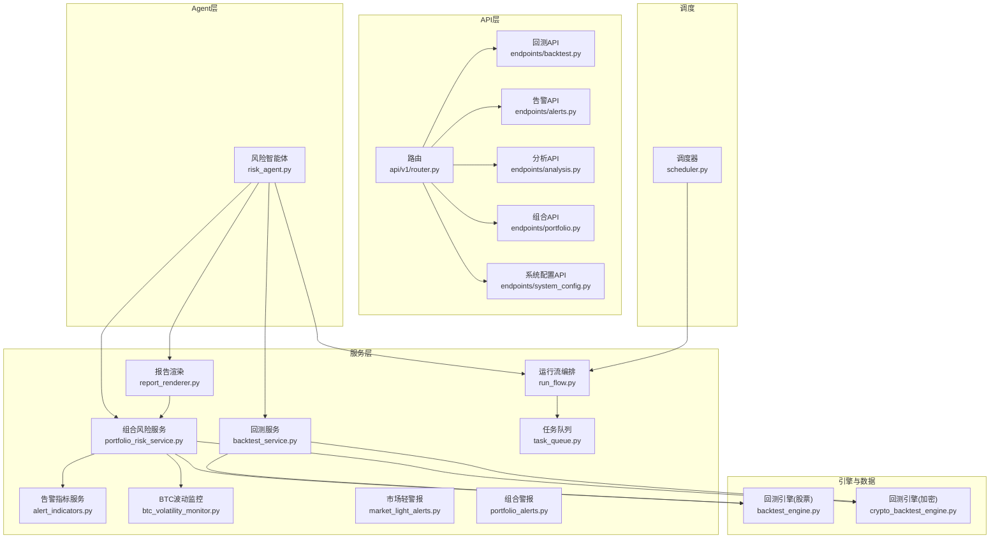
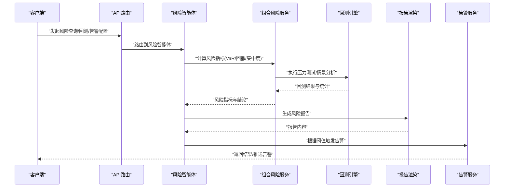
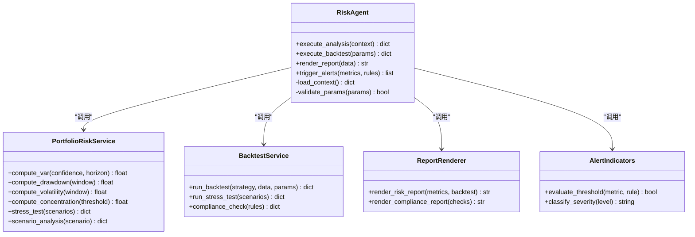
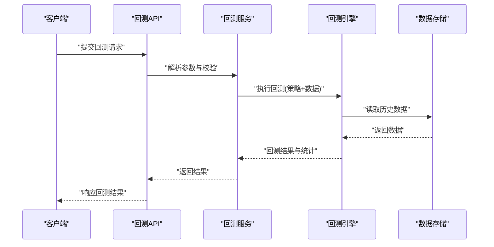
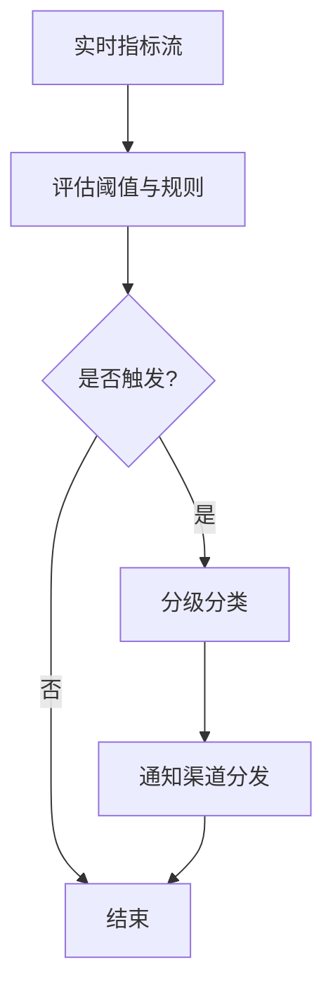
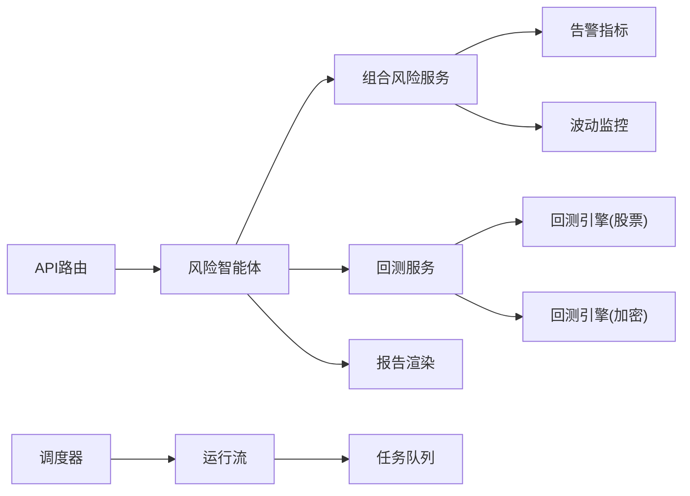

# 风险管理智能体

<cite>
**本文引用的文件**   
- [risk_agent.py](file://src/agent/agents/risk_agent.py)
- [portfolio_risk_service.py](file://src/services/portfolio_risk_service.py)
- [alert_indicators.py](file://src/services/alert_indicators.py)
- [btc_volatility_monitor.py](file://src/services/btc_volatility_monitor.py)
- [backtest_engine.py](file://src/core/backtest_engine.py)
- [crypto_backtest_engine.py](file://src/core/crypto_backtest_engine.py)
- [backtest_service.py](file://src/services/backtest_service.py)
- [report_renderer.py](file://src/services/report_renderer.py)
- [market_light_alerts.py](file://src/services/market_light_alerts.py)
- [portfolio_alerts.py](file://src/services/portfolio_alerts.py)
- [api_router_v1.py](file://api/v1/router.py)
- [backtest_api.py](file://api/v1/endpoints/backtest.py)
- [alerts_api.py](file://api/v1/endpoints/alerts.py)
- [analysis_api.py](file://api/v1/endpoints/analysis.py)
- [portfolio_api.py](file://api/v1/endpoints/portfolio.py)
- [system_config_api.py](file://api/v1/endpoints/system_config.py)
- [run_flow.py](file://src/services/run_flow.py)
- [task_queue.py](file://src/services/task_queue.py)
- [scheduler.py](file://src/scheduler.py)
</cite>

## 目录
1. [简介](#简介)
2. [项目结构](#项目结构)
3. [核心组件](#核心组件)
4. [架构总览](#架构总览)
5. [详细组件分析](#详细组件分析)
6. [依赖关系分析](#依赖关系分析)
7. [性能考量](#性能考量)
8. [故障排查指南](#故障排查指南)
9. [结论](#结论)
10. [附录](#附录)

## 简介
本文件面向“风险管理智能体”的完整技术文档，覆盖风险控制机制与风险评估模型（VaR、压力测试、情景分析）、风险指标监控与阈值预警、风险限额管理、止损策略与仓位限制、风险报告生成、历史回测与合规检查，以及与市场波动监测、流动性风险和信用风险的关联处理。同时给出风险模型的校准方法与参数调优策略，帮助读者从业务到实现全面理解系统。

## 项目结构
风险管理智能体由“Agent层 + 服务层 + 数据与引擎层 + API层 + 调度与任务层”构成：
- Agent层：风险智能体负责编排风控流程、调用工具与服务、输出风控决策建议。
- 服务层：组合计算风险指标、执行回测、渲染报告、触发告警等。
- 数据与引擎层：提供回测引擎（股票/加密资产）、市场波动监控、行情与持仓数据接入。
- API层：对外暴露风险查询、回测、告警、配置等接口。
- 调度与任务层：定时任务与异步任务队列支撑批量计算与实时告警。

**图表来源** 
- [risk_agent.py](file://src/agent/agents/risk_agent.py)
- [portfolio_risk_service.py](file://src/services/portfolio_risk_service.py)
- [alert_indicators.py](file://src/services/alert_indicators.py)
- [btc_volatility_monitor.py](file://src/services/btc_volatility_monitor.py)
- [backtest_engine.py](file://src/core/backtest_engine.py)
- [crypto_backtest_engine.py](file://src/core/crypto_backtest_engine.py)
- [backtest_service.py](file://src/services/backtest_service.py)
- [report_renderer.py](file://src/services/report_renderer.py)
- [market_light_alerts.py](file://src/services/market_light_alerts.py)
- [portfolio_alerts.py](file://src/services/portfolio_alerts.py)
- [run_flow.py](file://src/services/run_flow.py)
- [task_queue.py](file://src/services/task_queue.py)
- [api/v1/router.py](file://api/v1/router.py)
- [api/v1/endpoints/backtest.py](file://api/v1/endpoints/backtest.py)
- [api/v1/endpoints/alerts.py](file://api/v1/endpoints/alerts.py)
- [api/v1/endpoints/analysis.py](file://api/v1/endpoints/analysis.py)
- [api/v1/endpoints/portfolio.py](file://api/v1/endpoints/portfolio.py)
- [api/v1/endpoints/system_config.py](file://api/v1/endpoints/system_config.py)
- [scheduler.py](file://src/scheduler.py)

**章节来源**
- [risk_agent.py](file://src/agent/agents/risk_agent.py)
- [portfolio_risk_service.py](file://src/services/portfolio_risk_service.py)
- [backtest_service.py](file://src/services/backtest_service.py)
- [report_renderer.py](file://src/services/report_renderer.py)
- [api/v1/router.py](file://api/v1/router.py)
- [scheduler.py](file://src/scheduler.py)

## 核心组件
- 风险智能体（Risk Agent）：编排风控流程，聚合多源数据，驱动回测与指标计算，输出限额与止损建议。
- 组合风险服务（Portfolio Risk Service）：实现VaR、回撤、波动率、集中度、流动性与信用风险度量；对接回测引擎进行压力测试与情景分析。
- 告警指标服务（Alert Indicators）：定义指标阈值、触发条件与分级告警策略。
- 市场波动监控（BTC Volatility Monitor）：监测市场波动状态，联动风控策略切换。
- 回测服务（Backtest Service）：统一封装股票与加密资产的回测能力，支持历史回测与合规检查。
- 报告渲染（Report Renderer）：将风险指标、回测结果与合规检查结果渲染为结构化报告。
- 运行流与任务队列（Run Flow & Task Queue）：编排复杂风控任务，支持异步执行与重试。

**章节来源**
- [risk_agent.py](file://src/agent/agents/risk_agent.py)
- [portfolio_risk_service.py](file://src/services/portfolio_risk_service.py)
- [alert_indicators.py](file://src/services/alert_indicators.py)
- [btc_volatility_monitor.py](file://src/services/btc_volatility_monitor.py)
- [backtest_service.py](file://src/services/backtest_service.py)
- [report_renderer.py](file://src/services/report_renderer.py)
- [run_flow.py](file://src/services/run_flow.py)
- [task_queue.py](file://src/services/task_queue.py)

## 架构总览
下图展示从API请求到风险计算、回测、报告与告警的端到端流程。

**图表来源** 
- [api/v1/router.py](file://api/v1/router.py)
- [risk_agent.py](file://src/agent/agents/risk_agent.py)
- [portfolio_risk_service.py](file://src/services/portfolio_risk_service.py)
- [backtest_engine.py](file://src/core/backtest_engine.py)
- [crypto_backtest_engine.py](file://src/core/crypto_backtest_engine.py)
- [report_renderer.py](file://src/services/report_renderer.py)
- [portfolio_alerts.py](file://src/services/portfolio_alerts.py)
- [market_light_alerts.py](file://src/services/market_light_alerts.py)

## 详细组件分析

### 风险智能体（Risk Agent）
- 职责：协调数据获取、指标计算、回测执行、报告生成与告警触发；维护风控上下文与策略开关。
- 关键流程：
  - 接收外部请求（分析/回测/告警）。
  - 调用组合风险服务计算指标。
  - 调用回测服务执行压力测试与情景分析。
  - 渲染报告并持久化。
  - 基于阈值与规则触发告警。
- 设计要点：
  - 可插拔的工具与服务注册，便于扩展新的风险因子或回测场景。
  - 错误隔离与降级：当某服务不可用时，仍尽量返回部分结果与警告。

**图表来源** 
- [risk_agent.py](file://src/agent/agents/risk_agent.py)
- [portfolio_risk_service.py](file://src/services/portfolio_risk_service.py)
- [backtest_service.py](file://src/services/backtest_service.py)
- [report_renderer.py](file://src/services/report_renderer.py)
- [alert_indicators.py](file://src/services/alert_indicators.py)

**章节来源**
- [risk_agent.py](file://src/agent/agents/risk_agent.py)

### 组合风险服务（Portfolio Risk Service）
- VaR计算：支持历史模拟法与参数法（正态/学生t），可按置信水平与持有期计算。
- 回撤与波动率：滚动窗口计算最大回撤与年化波动率，支持不同频率数据。
- 集中度与流动性：按权重分布评估集中度；结合买卖价差与成交量估算流动性风险。
- 信用风险：对债券/衍生品头寸评估违约概率与损失敞口（基于外部评级或内部模型）。
- 压力测试与情景分析：内置宏观冲击、行业冲击、个股黑天鹅等情景模板，支持自定义情景。

**图表来源** 
- [portfolio_risk_service.py](file://src/services/portfolio_risk_service.py)

**章节来源**
- [portfolio_risk_service.py](file://src/services/portfolio_risk_service.py)

### 回测服务与引擎（Backtest Service & Engines）
- 回测服务：统一封装股票与加密资产回测，支持策略参数扫描、绩效统计、合规检查。
- 回测引擎（股票）：事件驱动或向量化回测，支持交易成本、滑点、涨跌停与停牌处理。
- 回测引擎（加密）：支持24小时连续合约、资金费率、深度与订单簿快照。
- 合规检查：对照监管规则（如单一标的上限、杠杆限制、禁投名单）进行校验。

**图表来源** 
- [api/v1/endpoints/backtest.py](file://api/v1/endpoints/backtest.py)
- [backtest_service.py](file://src/services/backtest_service.py)
- [backtest_engine.py](file://src/core/backtest_engine.py)
- [crypto_backtest_engine.py](file://src/core/crypto_backtest_engine.py)

**章节来源**
- [backtest_service.py](file://src/services/backtest_service.py)
- [backtest_engine.py](file://src/core/backtest_engine.py)
- [crypto_backtest_engine.py](file://src/core/crypto_backtest_engine.py)
- [api/v1/endpoints/backtest.py](file://api/v1/endpoints/backtest.py)

### 告警指标与阈值（Alert Indicators）
- 指标定义：VaR突破、回撤超阈、波动率飙升、集中度超限、流动性枯竭、信用事件。
- 阈值设置：支持静态阈值与动态阈值（基于滚动统计与分位数）。
- 触发条件：多级告警（提示/警告/严重），支持去抖与冷却时间。
- 联动策略：与市场波动监控联动，自动切换风控强度。

**图表来源** 
- [alert_indicators.py](file://src/services/alert_indicators.py)
- [market_light_alerts.py](file://src/services/market_light_alerts.py)
- [portfolio_alerts.py](file://src/services/portfolio_alerts.py)

**章节来源**
- [alert_indicators.py](file://src/services/alert_indicators.py)
- [market_light_alerts.py](file://src/services/market_light_alerts.py)
- [portfolio_alerts.py](file://src/services/portfolio_alerts.py)

### 市场波动监控（BTC Volatility Monitor）
- 功能：监测波动率指数与极端波动事件，输出市场状态（平稳/震荡/高波）。
- 联动：高风险状态下自动收紧限额、提高保证金、降低杠杆。
- 数据源：跨交易所聚合报价与波动率指标。

**章节来源**
- [btc_volatility_monitor.py](file://src/services/btc_volatility_monitor.py)

### 报告渲染（Report Renderer）
- 内容：风险指标汇总、回测绩效、合规检查结果、告警历史与建议。
- 格式：Markdown/HTML/PDF，支持模板定制与多语言。
- 集成：与系统配置API联动，支持主题与语言切换。

**章节来源**
- [report_renderer.py](file://src/services/report_renderer.py)
- [api/v1/endpoints/system_config.py](file://api/v1/endpoints/system_config.py)

### 运行流与任务队列（Run Flow & Task Queue）
- 运行流：编排多步骤风控任务（数据拉取→指标计算→回测→报告→告警）。
- 任务队列：异步执行长耗时任务，支持重试、超时与进度查询。
- 调度器：定时触发每日风控巡检与报告生成。

**章节来源**
- [run_flow.py](file://src/services/run_flow.py)
- [task_queue.py](file://src/services/task_queue.py)
- [scheduler.py](file://src/scheduler.py)

## 依赖关系分析
- 低耦合：各服务通过清晰接口交互，便于替换实现（如更换回测引擎或告警通道）。
- 可扩展：新增风险因子或情景只需扩展服务层与指标定义。
- 外部依赖：数据源（行情/基本面）、通知渠道（邮件/IM）、存储（数据库/对象存储）。

**图表来源** 
- [risk_agent.py](file://src/agent/agents/risk_agent.py)
- [portfolio_risk_service.py](file://src/services/portfolio_risk_service.py)
- [backtest_service.py](file://src/services/backtest_service.py)
- [report_renderer.py](file://src/services/report_renderer.py)
- [alert_indicators.py](file://src/services/alert_indicators.py)
- [btc_volatility_monitor.py](file://src/services/btc_volatility_monitor.py)
- [backtest_engine.py](file://src/core/backtest_engine.py)
- [crypto_backtest_engine.py](file://src/core/crypto_backtest_engine.py)
- [api/v1/router.py](file://api/v1/router.py)
- [run_flow.py](file://src/services/run_flow.py)
- [task_queue.py](file://src/services/task_queue.py)
- [scheduler.py](file://src/scheduler.py)

**章节来源**
- [api/v1/router.py](file://api/v1/router.py)
- [scheduler.py](file://src/scheduler.py)

## 性能考量
- 指标计算优化：使用向量化计算与缓存热点数据（价格、波动率、VaR）。
- 回测并行：策略参数扫描采用并发执行，限制并发度避免资源争用。
- 内存管理：大窗口历史数据采用分块加载与增量更新。
- 告警去抖：高频指标采用滑动窗口与冷却时间减少误报。
- I/O优化：异步I/O与连接池提升数据拉取与通知发送效率。

[本节为通用指导，不直接分析具体文件]

## 故障排查指南
- 常见问题：
  - 数据缺失或延迟：检查数据源连通性与缓存失效策略。
  - 回测失败：核对参数合法性、数据对齐与交易规则约束。
  - 告警风暴：调整阈值与冷却时间，启用分级告警。
  - 报告渲染异常：检查模板变量与语言配置。
- 定位方法：
  - 查看运行流日志与任务队列状态。
  - 使用健康检查接口确认服务可用性。
  - 回放历史数据验证指标一致性。

**章节来源**
- [api/v1/endpoints/analysis.py](file://api/v1/endpoints/analysis.py)
- [api/v1/endpoints/portfolio.py](file://api/v1/endpoints/portfolio.py)
- [api/v1/endpoints/alerts.py](file://api/v1/endpoints/alerts.py)
- [api/v1/endpoints/system_config.py](file://api/v1/endpoints/system_config.py)

## 结论
风险管理智能体以“智能体编排 + 服务化计算 + 引擎化回测 + 报告与告警”为核心架构，覆盖VaR、压力测试、情景分析、限额与止损、流动性与信用风险、合规检查与报告生成。通过清晰的依赖关系与可扩展设计，能够灵活适配不同市场与策略需求。建议持续优化指标计算性能、完善情景库与校准流程，并加强监控与故障自愈能力。

[本节为总结性内容，不直接分析具体文件]

## 附录
- 风险模型校准与参数调优：
  - 校准方法：滚动窗口估计、贝叶斯更新、机器学习辅助的参数回归。
  - 调优策略：网格搜索与贝叶斯优化结合，目标函数包含夏普比率、最大回撤与VaR覆盖率。
  - 验证方式：样本外回测、交叉验证、压力测试一致性检验。
- 合规检查清单：
  - 单一标的权重上限、行业集中度限制、杠杆倍数限制、禁投名单匹配。
  - 流动性指标阈值（买卖价差、成交量占比）与信用事件预警。

[本节为补充说明，不直接分析具体文件]