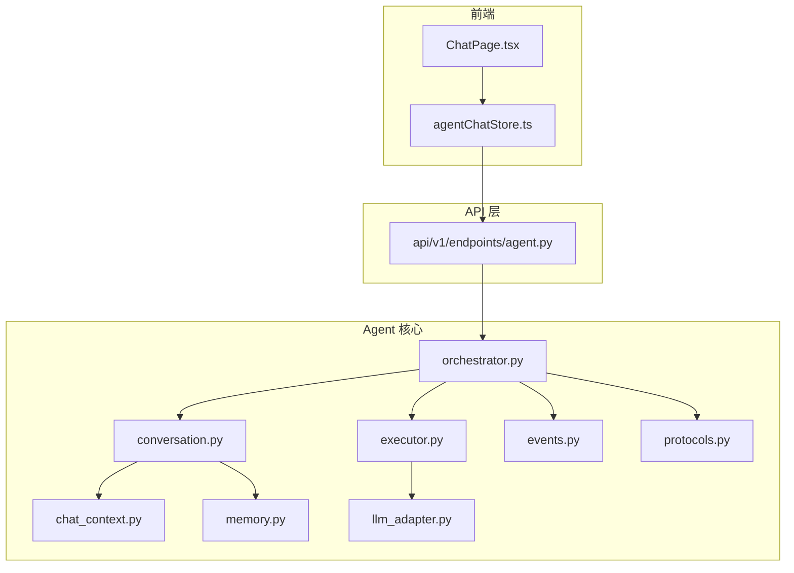
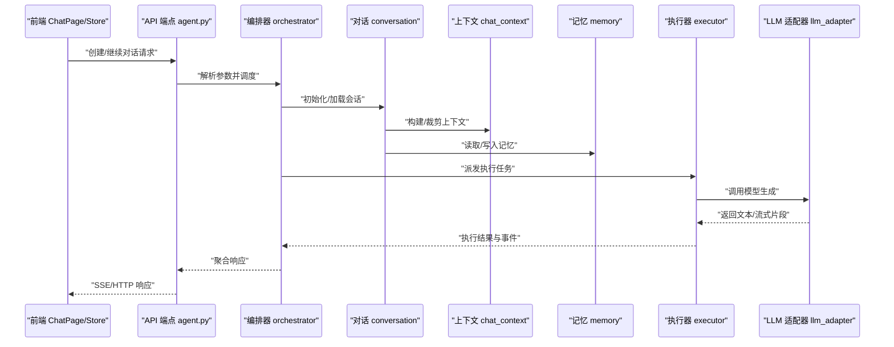
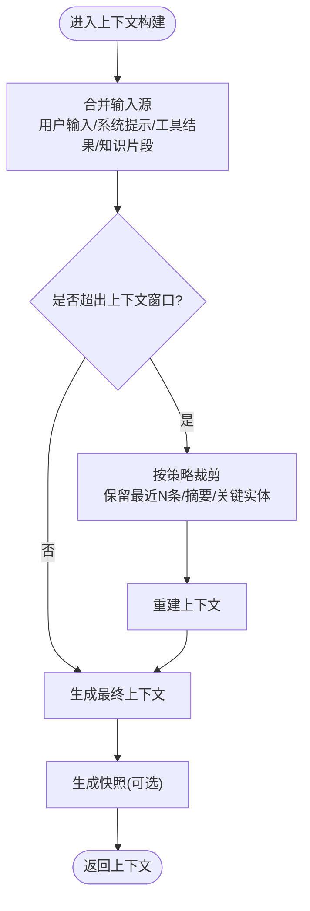
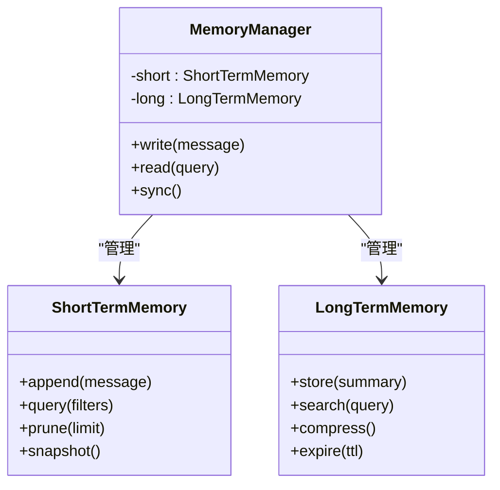
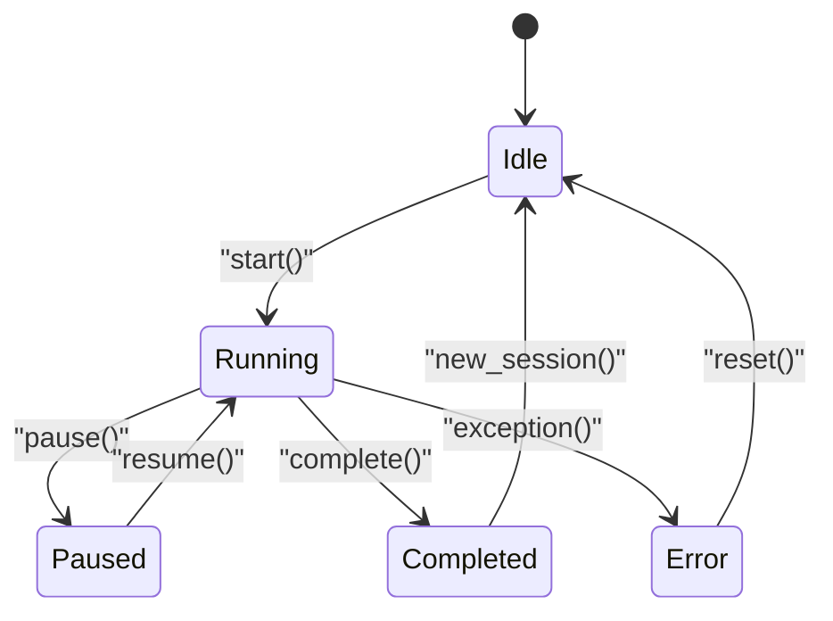
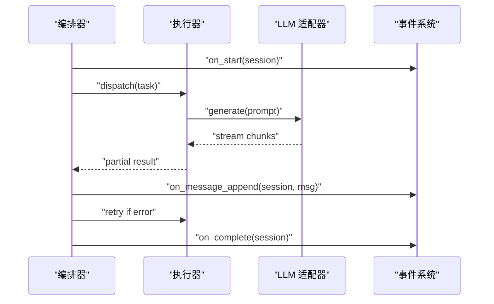
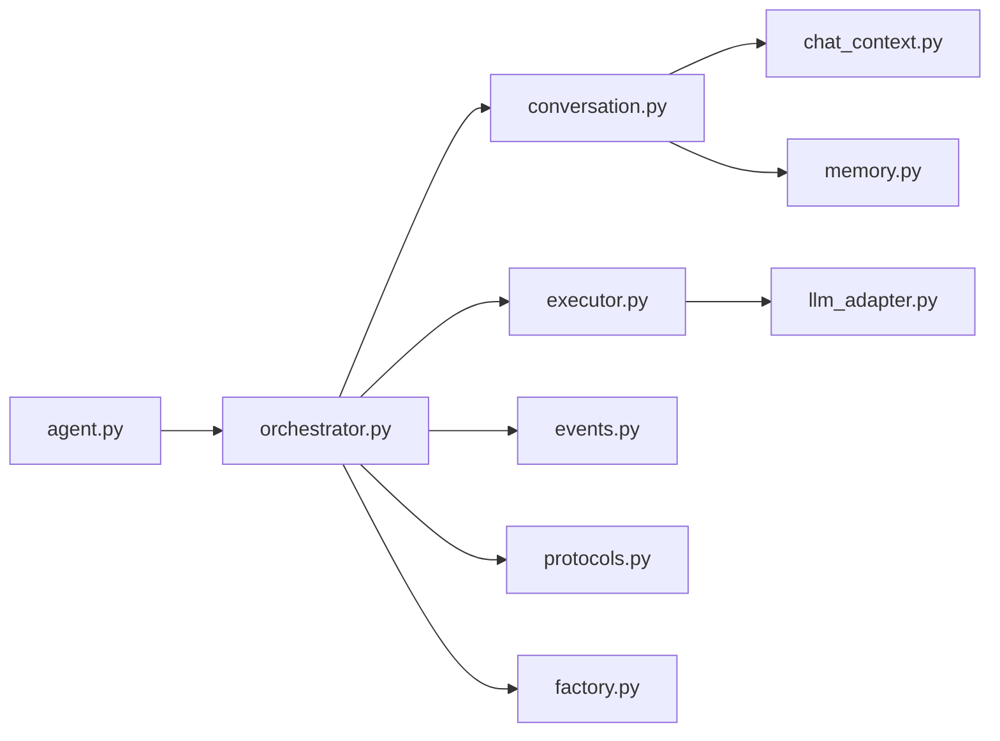

# 对话管理

<cite>
**本文引用的文件**   
- [src/agent/conversation.py](file://src/agent/conversation.py)
- [src/agent/chat_context.py](file://src/agent/chat_context.py)
- [src/agent/memory.py](file://src/agent/memory.py)
- [src/agent/orchestrator.py](file://src/agent/orchestrator.py)
- [src/agent/executor.py](file://src/agent/executor.py)
- [src/agent/factory.py](file://src/agent/factory.py)
- [src/agent/llm_adapter.py](file://src/agent/llm_adapter.py)
- [src/agent/events.py](file://src/agent/events.py)
- [src/agent/protocols.py](file://src/agent/protocols.py)
- [api/v1/endpoints/agent.py](file://api/v1/endpoints/agent.py)
- [apps/dsa-web/src/stores/agentChatStore.ts](file://apps/dsa-web/src/stores/agentChatStore.ts)
- [apps/dsa-web/src/pages/ChatPage.tsx](file://apps/dsa-web/src/pages/ChatPage.tsx)
- [tests/test_conversation_manager.py](file://tests/test_conversation_manager.py)
- [tests/test_chat_context.py](file://tests/test_chat_context.py)
</cite>

## 目录
1. [简介](#简介)
2. [项目结构](#项目结构)
3. [核心组件](#核心组件)
4. [架构总览](#架构总览)
5. [详细组件分析](#详细组件分析)
6. [依赖关系分析](#依赖关系分析)
7. [性能与内存优化](#性能与内存优化)
8. [故障排查指南](#故障排查指南)
9. [结论](#结论)
10. [附录](#附录)

## 简介
本文件面向“对话管理系统”的设计与实现，聚焦以下目标：
- 对话上下文管理机制：如何维护、裁剪、重建对话上下文窗口。
- 记忆存储与检索策略：短期记忆、长期记忆的存取与召回方式。
- 对话状态管理与历史消息处理：会话生命周期、消息序列与增量更新。
- 对话持久化与恢复机制：会话落盘、快照与多会话管理。
- 对话优化策略：上下文窗口控制、流式输出、错误恢复与重试。
- 调试工具与常见问题：定位问题、日志与测试用例参考。

## 项目结构
对话相关代码主要分布在后端 Agent 层与前端 Web UI 中：
- 后端（Python）：conversation、chat_context、memory、orchestrator、executor、llm_adapter、events、protocols 等模块构成对话核心。
- API 层：v1 端点暴露对话接口，负责请求校验、路由与响应封装。
- 前端（TypeScript/React）：agentChatStore 管理会话状态，ChatPage 负责交互与展示。
- 测试：覆盖对话管理器、上下文管理等关键路径。

**图表来源** 
- [apps/dsa-web/src/pages/ChatPage.tsx](file://apps/dsa-web/src/pages/ChatPage.tsx)
- [apps/dsa-web/src/stores/agentChatStore.ts](file://apps/dsa-web/src/stores/agentChatStore.ts)
- [api/v1/endpoints/agent.py](file://api/v1/endpoints/agent.py)
- [src/agent/orchestrator.py](file://src/agent/orchestrator.py)
- [src/agent/conversation.py](file://src/agent/conversation.py)
- [src/agent/chat_context.py](file://src/agent/chat_context.py)
- [src/agent/memory.py](file://src/agent/memory.py)
- [src/agent/executor.py](file://src/agent/executor.py)
- [src/agent/llm_adapter.py](file://src/agent/llm_adapter.py)
- [src/agent/events.py](file://src/agent/events.py)
- [src/agent/protocols.py](file://src/agent/protocols.py)

**章节来源**
- [src/agent/conversation.py](file://src/agent/conversation.py)
- [src/agent/chat_context.py](file://src/agent/chat_context.py)
- [src/agent/memory.py](file://src/agent/memory.py)
- [src/agent/orchestrator.py](file://src/agent/orchestrator.py)
- [src/agent/executor.py](file://src/agent/executor.py)
- [src/agent/llm_adapter.py](file://src/agent/llm_adapter.py)
- [src/agent/events.py](file://src/agent/events.py)
- [src/agent/protocols.py](file://src/agent/protocols.py)
- [api/v1/endpoints/agent.py](file://api/v1/endpoints/agent.py)
- [apps/dsa-web/src/stores/agentChatStore.ts](file://apps/dsa-web/src/stores/agentChatStore.ts)
- [apps/dsa-web/src/pages/ChatPage.tsx](file://apps/dsa-web/src/pages/ChatPage.tsx)

## 核心组件
- 对话上下文（chat_context）：维护当前对话的输入、系统提示、工具调用结果、外部知识片段等，提供上下文构建与裁剪能力。
- 记忆模块（memory）：短期记忆（会话内消息）、长期记忆（跨会话摘要/知识库），支持写入、查询与压缩。
- 对话对象（conversation）：封装单条对话的生命周期，包含消息序列、状态机、上下文窗口控制、持久化与恢复。
- 编排器（orchestrator）：协调对话流程、事件分发、错误处理与重试，驱动执行器与 LLM 适配器。
- 执行器（executor）：将编排器的指令转化为具体动作（如调用工具、生成回复、更新记忆）。
- LLM 适配器（llm_adapter）：统一不同大模型接口的调用、参数映射与使用量统计。
- 事件系统（events）：定义并广播对话生命周期事件（开始、消息追加、完成、错误等）。
- 协议与工厂（protocols, factory）：抽象接口与实例化策略，便于扩展新的对话类型或记忆后端。

**章节来源**
- [src/agent/chat_context.py](file://src/agent/chat_context.py)
- [src/agent/memory.py](file://src/agent/memory.py)
- [src/agent/conversation.py](file://src/agent/conversation.py)
- [src/agent/orchestrator.py](file://src/agent/orchestrator.py)
- [src/agent/executor.py](file://src/agent/executor.py)
- [src/agent/llm_adapter.py](file://src/agent/llm_adapter.py)
- [src/agent/events.py](file://src/agent/events.py)
- [src/agent/protocols.py](file://src/agent/protocols.py)
- [src/agent/factory.py](file://src/agent/factory.py)

## 架构总览
对话系统采用分层与事件驱动相结合的设计：
- 前端通过 store 发起对话请求，后端 API 接收并路由到编排器。
- 编排器根据对话类型选择执行器，执行器调用 LLM 适配器与工具。
- 对话上下文与记忆模块贯穿整个流程，确保上下文窗口可控、记忆可持久化。
- 事件系统用于前后端解耦与可观测性。

**图表来源** 
- [api/v1/endpoints/agent.py](file://api/v1/endpoints/agent.py)
- [src/agent/orchestrator.py](file://src/agent/orchestrator.py)
- [src/agent/conversation.py](file://src/agent/conversation.py)
- [src/agent/chat_context.py](file://src/agent/chat_context.py)
- [src/agent/memory.py](file://src/agent/memory.py)
- [src/agent/executor.py](file://src/agent/executor.py)
- [src/agent/llm_adapter.py](file://src/agent/llm_adapter.py)

## 详细组件分析

### 对话上下文（chat_context）
职责与要点：
- 上下文构建：合并用户输入、系统提示、工具结果、外部知识片段。
- 上下文窗口控制：按 token 预算或消息数量进行裁剪，保留关键信息（最近消息、摘要、重要实体）。
- 增量更新：支持追加新消息与动态调整窗口，避免全量重建。
- 序列化与快照：为持久化提供结构化表示。

**图表来源** 
- [src/agent/chat_context.py](file://src/agent/chat_context.py)

**章节来源**
- [src/agent/chat_context.py](file://src/agent/chat_context.py)

### 记忆模块（memory）
职责与要点：
- 短期记忆：会话内消息序列，支持追加、分页、去重与快速检索。
- 长期记忆：跨会话摘要、主题标签、实体索引；支持压缩与过期清理。
- 检索策略：关键词匹配、语义检索（向量库）、时间衰减权重。
- 持久化：本地文件或数据库存储，支持备份与迁移。

**图表来源** 
- [src/agent/memory.py](file://src/agent/memory.py)

**章节来源**
- [src/agent/memory.py](file://src/agent/memory.py)

### 对话对象（conversation）
职责与要点：
- 生命周期：创建、运行、暂停、恢复、销毁。
- 状态机：idle、running、paused、error、completed。
- 历史消息：有序追加、回滚、版本化。
- 上下文窗口：与 chat_context 协作，动态裁剪。
- 持久化：会话快照、增量保存、恢复时重建状态。

**图表来源** 
- [src/agent/conversation.py](file://src/agent/conversation.py)

**章节来源**
- [src/agent/conversation.py](file://src/agent/conversation.py)

### 编排器（orchestrator）
职责与要点：
- 任务派发：根据对话类型与输入选择执行器与策略。
- 事件分发：发布生命周期事件，供监听与追踪。
- 错误处理：捕获异常、重试、降级与回滚。
- 资源协调：限流、并发控制、超时管理。

**图表来源** 
- [src/agent/orchestrator.py](file://src/agent/orchestrator.py)
- [src/agent/events.py](file://src/agent/events.py)

**章节来源**
- [src/agent/orchestrator.py](file://src/agent/orchestrator.py)
- [src/agent/events.py](file://src/agent/events.py)

### 执行器（executor）
职责与要点：
- 动作执行：调用工具、生成回复、更新记忆、刷新上下文。
- 流式处理：逐块消费 LLM 输出，降低延迟。
- 幂等与回滚：保证重复执行的安全性，失败时回滚中间状态。

**章节来源**
- [src/agent/executor.py](file://src/agent/executor.py)

### LLM 适配器（llm_adapter）
职责与要点：
- 统一接口：屏蔽不同模型差异，标准化参数与返回。
- 用量统计：记录 token 消耗、成本估算。
- 重试与降级：网络异常自动重试，切换备用提供商。

**章节来源**
- [src/agent/llm_adapter.py](file://src/agent/llm_adapter.py)

### 协议与工厂（protocols, factory）
职责与要点：
- 协议抽象：定义对话、记忆、执行器等接口契约。
- 工厂模式：按配置动态创建实例，便于扩展与替换。

**章节来源**
- [src/agent/protocols.py](file://src/agent/protocols.py)
- [src/agent/factory.py](file://src/agent/factory.py)

### API 端点（agent.py）
职责与要点：
- 请求校验：参数合法性、权限检查。
- 路由与转发：将请求转给编排器。
- 响应封装：SSE/HTTP 格式、错误码与消息体。

**章节来源**
- [api/v1/endpoints/agent.py](file://api/v1/endpoints/agent.py)

### 前端 Store 与页面（agentChatStore.ts, ChatPage.tsx）
职责与要点：
- 状态管理：会话列表、当前会话、消息队列、加载状态。
- 交互逻辑：发送消息、接收流式响应、错误提示。
- 持久化：本地缓存与会话同步。

**章节来源**
- [apps/dsa-web/src/stores/agentChatStore.ts](file://apps/dsa-web/src/stores/agentChatStore.ts)
- [apps/dsa-web/src/pages/ChatPage.tsx](file://apps/dsa-web/src/pages/ChatPage.tsx)

## 依赖关系分析
- 低耦合高内聚：各模块通过协议接口通信，减少直接依赖。
- 事件驱动：编排器与执行器之间通过事件解耦，提升可观测性与可测试性。
- 可扩展性：工厂与协议支持新增对话类型、记忆后端与 LLM 提供商。

**图表来源** 
- [api/v1/endpoints/agent.py](file://api/v1/endpoints/agent.py)
- [src/agent/orchestrator.py](file://src/agent/orchestrator.py)
- [src/agent/conversation.py](file://src/agent/conversation.py)
- [src/agent/executor.py](file://src/agent/executor.py)
- [src/agent/events.py](file://src/agent/events.py)
- [src/agent/chat_context.py](file://src/agent/chat_context.py)
- [src/agent/memory.py](file://src/agent/memory.py)
- [src/agent/llm_adapter.py](file://src/agent/llm_adapter.py)
- [src/agent/protocols.py](file://src/agent/protocols.py)
- [src/agent/factory.py](file://src/agent/factory.py)

**章节来源**
- [api/v1/endpoints/agent.py](file://api/v1/endpoints/agent.py)
- [src/agent/orchestrator.py](file://src/agent/orchestrator.py)
- [src/agent/conversation.py](file://src/agent/conversation.py)
- [src/agent/executor.py](file://src/agent/executor.py)
- [src/agent/events.py](file://src/agent/events.py)
- [src/agent/chat_context.py](file://src/agent/chat_context.py)
- [src/agent/memory.py](file://src/agent/memory.py)
- [src/agent/llm_adapter.py](file://src/agent/llm_adapter.py)
- [src/agent/protocols.py](file://src/agent/protocols.py)
- [src/agent/factory.py](file://src/agent/factory.py)

## 性能与内存优化
- 上下文窗口控制：
  - 基于 token 预算的动态裁剪，优先保留最近消息与关键实体。
  - 增量构建上下文，避免全量重建。
- 记忆压缩：
  - 定期压缩短期记忆，提取摘要存入长期记忆。
  - 设置 TTL 与过期策略，释放无用数据。
- 流式输出：
  - 使用 SSE 或类似机制，降低首字节延迟。
- 并发与限流：
  - 限制并发请求数，避免 LLM 提供商限流。
  - 超时与重试策略，提高鲁棒性。
- 内存管理：
  - 及时释放临时对象，避免内存泄漏。
  - 使用生成器与惰性加载处理大消息。

[本节为通用指导，不直接分析具体文件]

## 故障排查指南
- 常见问题：
  - 上下文溢出：检查上下文裁剪策略与 token 预算。
  - 记忆丢失：确认持久化写入成功与恢复逻辑。
  - LLM 调用失败：查看重试与降级配置，检查网络与密钥。
  - 前端状态不同步：检查事件订阅与消息队列处理。
- 调试工具：
  - 启用详细日志，关注事件广播与错误堆栈。
  - 使用单元测试定位边界条件（见测试文件）。
- 参考测试：
  - 对话管理器测试：验证状态机与持久化。
  - 上下文管理测试：验证裁剪与重建逻辑。

**章节来源**
- [tests/test_conversation_manager.py](file://tests/test_conversation_manager.py)
- [tests/test_chat_context.py](file://tests/test_chat_context.py)

## 结论
对话管理系统通过清晰的模块划分、事件驱动与上下文窗口控制，实现了高效、可扩展且健壮的对话处理能力。结合记忆模块与持久化机制，系统能够支持多会话管理与长对话场景。通过性能优化与调试工具，开发者可以快速定位问题并提升用户体验。

[本节为总结，不直接分析具体文件]

## 附录
- 术语表：
  - 上下文窗口：指单次 LLM 调用可容纳的最大 token 数量。
  - 短期记忆：会话内的消息历史。
  - 长期记忆：跨会话的摘要与知识库。
  - 编排器：协调对话流程的核心组件。
- 最佳实践：
  - 合理设置上下文窗口大小，避免频繁裁剪。
  - 定期压缩记忆，保持存储效率。
  - 使用事件系统进行解耦与监控。

[本节为补充信息，不直接分析具体文件]