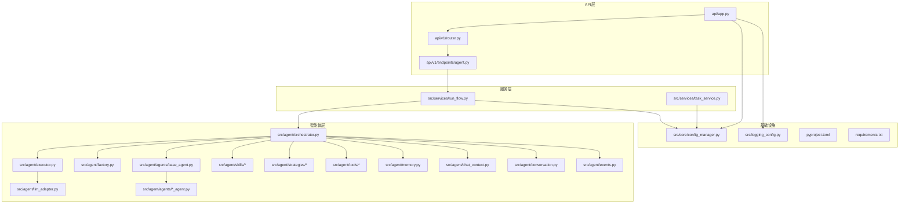
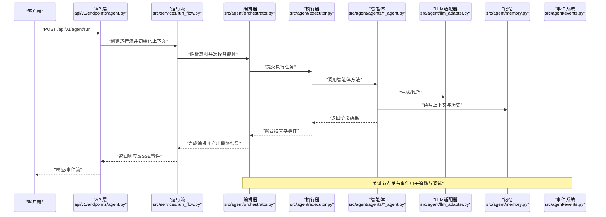
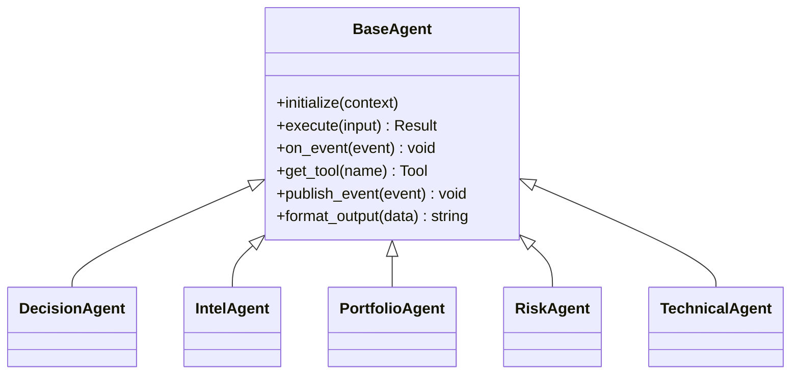
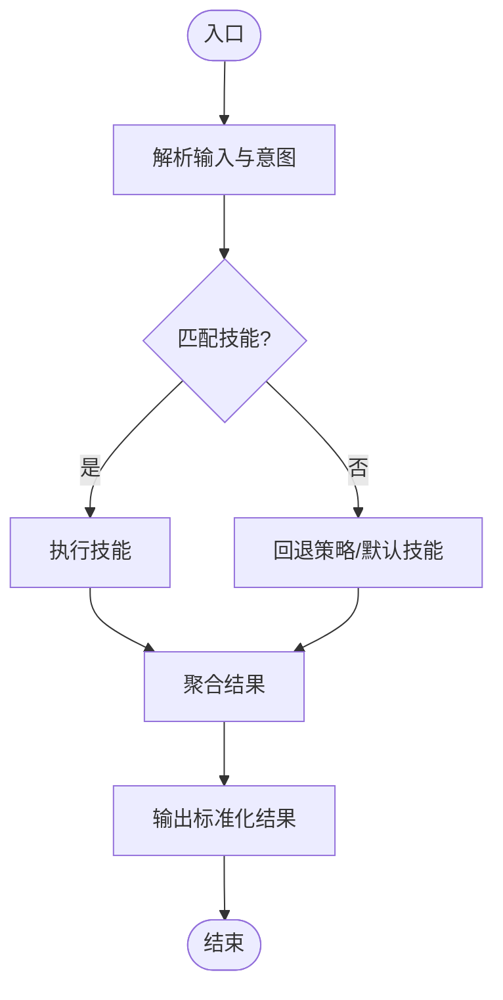
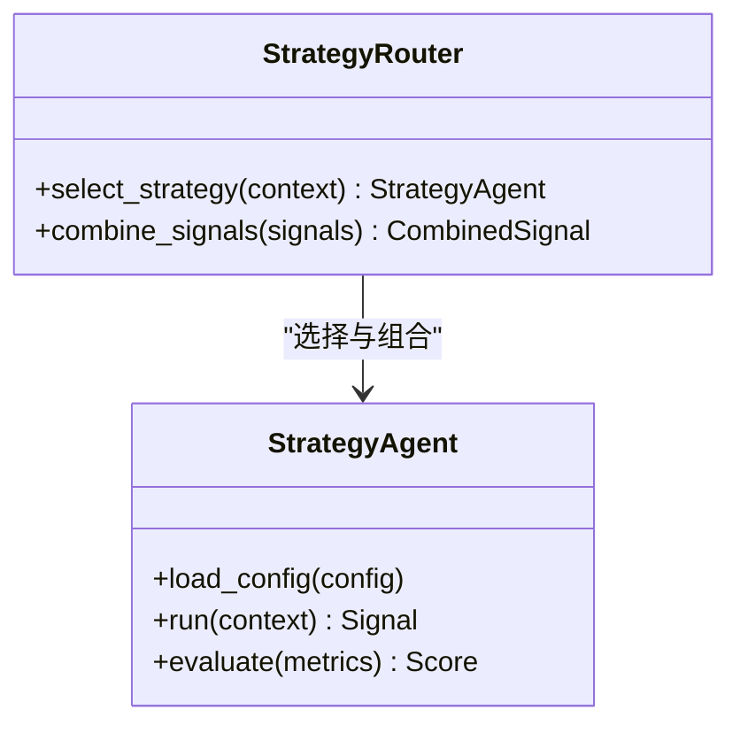
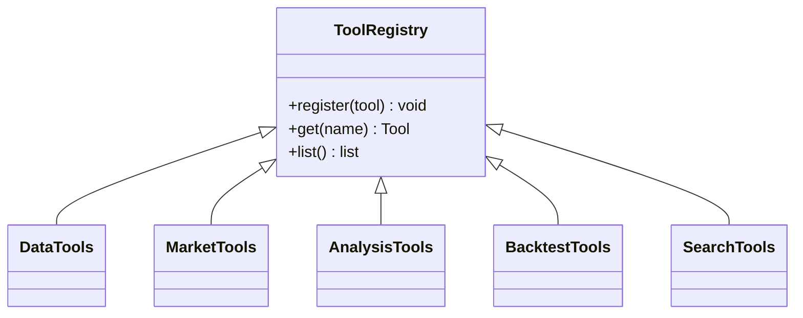
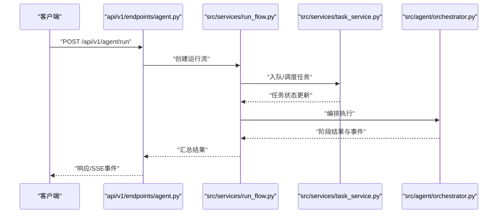
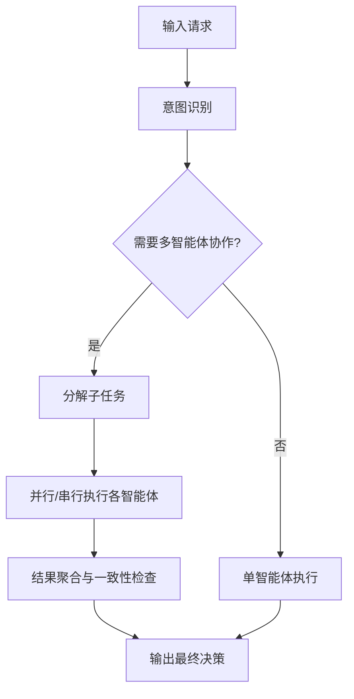
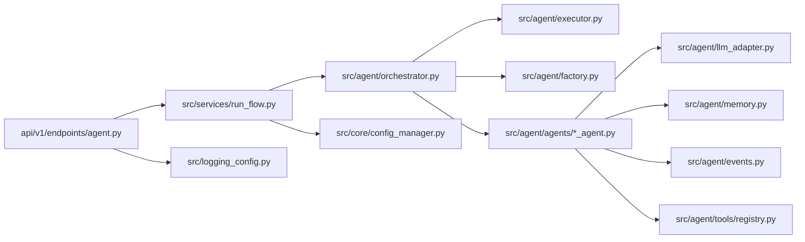

# 智能体开发指南

<cite>
**本文引用的文件**   
- [main.py](file://main.py)
- [server.py](file://server.py)
- [pyproject.toml](file://pyproject.toml)
- [requirements.txt](file://requirements.txt)
- [src/agent/orchestrator.py](file://src/agent/orchestrator.py)
- [src/agent/executor.py](file://src/agent/executor.py)
- [src/agent/factory.py](file://src/agent/factory.py)
- [src/agent/llm_adapter.py](file://src/agent/llm_adapter.py)
- [src/agent/memory.py](file://src/agent/memory.py)
- [src/agent/chat_context.py](file://src/agent/chat_context.py)
- [src/agent/conversation.py](file://src/agent/conversation.py)
- [src/agent/events.py](file://src/agent/events.py)
- [src/agent/protocols.py](file://src/agent/protocols.py)
- [src/agent/agents/base_agent.py](file://src/agent/agents/base_agent.py)
- [src/agent/agents/decision_agent.py](file://src/agent/agents/decision_agent.py)
- [src/agent/agents/intel_agent.py](file://src/agent/agents/intel_agent.py)
- [src/agent/agents/portfolio_agent.py](file://src/agent/agents/portfolio_agent.py)
- [src/agent/agents/risk_agent.py](file://src/agent/agents/risk_agent.py)
- [src/agent/agents/technical_agent.py](file://src/agent/agents/technical_agent.py)
- [src/agent/skills/router.py](file://src/agent/skills/router.py)
- [src/agent/skills/base.py](file://src/agent/skills/base.py)
- [src/agent/skills/aggregator.py](file://src/agent/skills/aggregator.py)
- [src/agent/skills/skill_agent.py](file://src/agent/skills/skill_agent.py)
- [src/agent/strategies/router.py](file://src/agent/strategies/router.py)
- [src/agent/strategies/strategy_agent.py](file://src/agent/strategies/strategy_agent.py)
- [src/agent/tools/registry.py](file://src/agent/tools/registry.py)
- [src/agent/tools/data_tools.py](file://src/agent/tools/data_tools.py)
- [src/agent/tools/market_tools.py](file://src/agent/tools/market_tools.py)
- [src/agent/tools/analysis_tools.py](file://src/agent/tools/analysis_tools.py)
- [src/agent/tools/backtest_tools.py](file://src/agent/tools/backtest_tools.py)
- [src/agent/tools/search_tools.py](file://src/agent/tools/search_tools.py)
- [api/v1/endpoints/agent.py](file://api/v1/endpoints/agent.py)
- [api/v1/router.py](file://api/v1/router.py)
- [api/app.py](file://api/app.py)
- [api/deps.py](file://api/deps.py)
- [src/services/run_flow.py](file://src/services/run_flow.py)
- [src/services/task_service.py](file://src/services/task_service.py)
- [src/core/config_manager.py](file://src/core/config_manager.py)
- [src/logging_config.py](file://src/logging_config.py)
- [tests/test_agent_executor.py](file://tests/test_agent_executor.py)
- [tests/test_agent_orchestrator_sniper_fallback.py](file://tests/test_agent_orchestrator_sniper_fallback.py)
- [tests/test_multi_agent.py](file://tests/test_multi_agent.py)
- [docker/Dockerfile](file://docker/Dockerfile)
- [docker/docker-compose.yml](file://docker/docker-compose.yml)
</cite>

## 目录
1. [简介](#简介)
2. [项目结构](#项目结构)
3. [核心组件](#核心组件)
4. [架构总览](#架构总览)
5. [详细组件分析](#详细组件分析)
6. [依赖关系分析](#依赖关系分析)
7. [性能考虑](#性能考虑)
8. [故障排查指南](#故障排查指南)
9. [结论](#结论)
10. [附录](#附录)

## 简介
本指南面向希望在本项目中开发“智能体”的工程师，提供从环境搭建、基础类继承、接口实现到测试与部署的全流程说明。文档覆盖：
- 智能体的生命周期与编排机制
- 技能与策略的扩展方式
- 工具注册与调用规范
- 多智能体协作模式
- 调试、监控与运维最佳实践
- 常见问题的定位与修复步骤

## 项目结构
本项目采用分层与模块化组织：
- API 层：FastAPI 路由与中间件，暴露智能体相关接口
- 服务层：业务编排、任务调度、运行流管理
- 智能体层：Agent 基类、具体 Agent、技能、策略、工具
- 数据与配置：配置管理、存储、日志、LLM 适配
- 前端与桌面应用：Web UI 与 Electron 客户端
- 测试与脚本：单元测试、端到端测试、构建与发布脚本
- Docker 化：容器镜像与编排

图表来源
- [api/app.py](file://api/app.py)
- [api/v1/router.py](file://api/v1/router.py)
- [api/v1/endpoints/agent.py](file://api/v1/endpoints/agent.py)
- [src/services/run_flow.py](file://src/services/run_flow.py)
- [src/services/task_service.py](file://src/services/task_service.py)
- [src/agent/orchestrator.py](file://src/agent/orchestrator.py)
- [src/agent/executor.py](file://src/agent/executor.py)
- [src/agent/factory.py](file://src/agent/factory.py)
- [src/agent/llm_adapter.py](file://src/agent/llm_adapter.py)
- [src/agent/memory.py](file://src/agent/memory.py)
- [src/agent/chat_context.py](file://src/agent/chat_context.py)
- [src/agent/conversation.py](file://src/agent/conversation.py)
- [src/agent/events.py](file://src/agent/events.py)
- [src/agent/agents/base_agent.py](file://src/agent/agents/base_agent.py)
- [src/agent/skills/router.py](file://src/agent/skills/router.py)
- [src/agent/strategies/router.py](file://src/agent/strategies/router.py)
- [src/agent/tools/registry.py](file://src/agent/tools/registry.py)
- [src/core/config_manager.py](file://src/core/config_manager.py)
- [src/logging_config.py](file://src/logging_config.py)
- [pyproject.toml](file://pyproject.toml)
- [requirements.txt](file://requirements.txt)

章节来源
- [main.py](file://main.py)
- [server.py](file://server.py)
- [pyproject.toml](file://pyproject.toml)
- [requirements.txt](file://requirements.txt)

## 核心组件
- 编排器（Orchestrator）：负责解析请求、选择智能体、协调执行、事件分发与结果聚合
- 执行器（Executor）：封装异步执行、重试、超时、并发控制与资源清理
- 工厂（Factory）：按配置或上下文动态创建智能体实例
- LLM 适配器（LLM Adapter）：统一不同 LLM 提供商的调用接口与参数映射
- 记忆（Memory）：会话级与跨会话的记忆存取
- 聊天上下文（Chat Context）：维护对话状态、历史摘要与变量注入
- 事件系统（Events）：结构化事件发布/订阅，便于追踪与调试
- 技能（Skills）：可插拔的能力模块，如搜索、数据分析、报告生成等
- 策略（Strategies）：交易或决策策略的可组合单元
- 工具（Tools）：数据获取、市场分析、回测、搜索等能力注册与调用

章节来源
- [src/agent/orchestrator.py](file://src/agent/orchestrator.py)
- [src/agent/executor.py](file://src/agent/executor.py)
- [src/agent/factory.py](file://src/agent/factory.py)
- [src/agent/llm_adapter.py](file://src/agent/llm_adapter.py)
- [src/agent/memory.py](file://src/agent/memory.py)
- [src/agent/chat_context.py](file://src/agent/chat_context.py)
- [src/agent/events.py](file://src/agent/events.py)
- [src/agent/skills/base.py](file://src/agent/skills/base.py)
- [src/agent/skills/router.py](file://src/agent/skills/router.py)
- [src/agent/strategies/router.py](file://src/agent/strategies/router.py)
- [src/agent/tools/registry.py](file://src/agent/tools/registry.py)

## 架构总览
下图展示一次典型的智能体请求从 API 到执行与返回的完整流程，包括事件流与错误处理路径。

图表来源
- [api/v1/endpoints/agent.py](file://api/v1/endpoints/agent.py)
- [src/services/run_flow.py](file://src/services/run_flow.py)
- [src/agent/orchestrator.py](file://src/agent/orchestrator.py)
- [src/agent/executor.py](file://src/agent/executor.py)
- [src/agent/agents/base_agent.py](file://src/agent/agents/base_agent.py)
- [src/agent/llm_adapter.py](file://src/agent/llm_adapter.py)
- [src/agent/memory.py](file://src/agent/memory.py)
- [src/agent/events.py](file://src/agent/events.py)

## 详细组件分析

### 智能体基类与继承体系
- 基类定义统一的接口契约：输入校验、上下文注入、工具访问、事件上报、结果格式化
- 具体智能体继承基类，实现领域逻辑：决策、情报、投资组合、风险、技术分析等
- 通过工厂按配置或运行时上下文动态实例化

图表来源
- [src/agent/agents/base_agent.py](file://src/agent/agents/base_agent.py)
- [src/agent/agents/decision_agent.py](file://src/agent/agents/decision_agent.py)
- [src/agent/agents/intel_agent.py](file://src/agent/agents/intel_agent.py)
- [src/agent/agents/portfolio_agent.py](file://src/agent/agents/portfolio_agent.py)
- [src/agent/agents/risk_agent.py](file://src/agent/agents/risk_agent.py)
- [src/agent/agents/technical_agent.py](file://src/agent/agents/technical_agent.py)

章节来源
- [src/agent/agents/base_agent.py](file://src/agent/agents/base_agent.py)
- [src/agent/agents/decision_agent.py](file://src/agent/agents/decision_agent.py)
- [src/agent/agents/intel_agent.py](file://src/agent/agents/intel_agent.py)
- [src/agent/agents/portfolio_agent.py](file://src/agent/agents/portfolio_agent.py)
- [src/agent/agents/risk_agent.py](file://src/agent/agents/risk_agent.py)
- [src/agent/agents/technical_agent.py](file://src/agent/agents/technical_agent.py)

### 技能系统与路由
- 技能基类定义标准能力接口：名称、描述、参数、执行函数、权限与限流
- 路由器根据意图或上下文将任务分发给对应技能
- 聚合器合并多个技能的输出，形成统一结果

图表来源
- [src/agent/skills/base.py](file://src/agent/skills/base.py)
- [src/agent/skills/router.py](file://src/agent/skills/router.py)
- [src/agent/skills/aggregator.py](file://src/agent/skills/aggregator.py)

章节来源
- [src/agent/skills/base.py](file://src/agent/skills/base.py)
- [src/agent/skills/router.py](file://src/agent/skills/router.py)
- [src/agent/skills/aggregator.py](file://src/agent/skills/aggregator.py)

### 策略系统与路由
- 策略代理封装策略配置与执行逻辑
- 路由器根据市场状态或用户偏好选择策略
- 支持多策略组合与权重分配

图表来源
- [src/agent/strategies/strategy_agent.py](file://src/agent/strategies/strategy_agent.py)
- [src/agent/strategies/router.py](file://src/agent/strategies/router.py)

章节来源
- [src/agent/strategies/strategy_agent.py](file://src/agent/strategies/strategy_agent.py)
- [src/agent/strategies/router.py](file://src/agent/strategies/router.py)

### 工具注册与调用
- 工具注册表集中管理可用工具及其元信息
- 数据、市场、分析、回测、搜索等工具按需加载
- 智能体通过统一接口调用工具，避免直接耦合

图表来源
- [src/agent/tools/registry.py](file://src/agent/tools/registry.py)
- [src/agent/tools/data_tools.py](file://src/agent/tools/data_tools.py)
- [src/agent/tools/market_tools.py](file://src/agent/tools/market_tools.py)
- [src/agent/tools/analysis_tools.py](file://src/agent/tools/analysis_tools.py)
- [src/agent/tools/backtest_tools.py](file://src/agent/tools/backtest_tools.py)
- [src/agent/tools/search_tools.py](file://src/agent/tools/search_tools.py)

章节来源
- [src/agent/tools/registry.py](file://src/agent/tools/registry.py)
- [src/agent/tools/data_tools.py](file://src/agent/tools/data_tools.py)
- [src/agent/tools/market_tools.py](file://src/agent/tools/market_tools.py)
- [src/agent/tools/analysis_tools.py](file://src/agent/tools/analysis_tools.py)
- [src/agent/tools/backtest_tools.py](file://src/agent/tools/backtest_tools.py)
- [src/agent/tools/search_tools.py](file://src/agent/tools/search_tools.py)

### API 与运行流
- API 层接收请求，校验参数，创建运行流
- 运行流负责编排智能体执行、事件收集与结果组装
- 支持 SSE 流式输出与任务队列异步处理

图表来源
- [api/v1/endpoints/agent.py](file://api/v1/endpoints/agent.py)
- [src/services/run_flow.py](file://src/services/run_flow.py)
- [src/services/task_service.py](file://src/services/task_service.py)
- [src/agent/orchestrator.py](file://src/agent/orchestrator.py)

章节来源
- [api/v1/endpoints/agent.py](file://api/v1/endpoints/agent.py)
- [src/services/run_flow.py](file://src/services/run_flow.py)
- [src/services/task_service.py](file://src/services/task_service.py)

### 多智能体协作
- 编排器协调多个智能体分工合作，如情报、技术、风险、投资决策
- 通过事件与共享上下文进行通信
- 支持失败回退与重试策略

图表来源
- [src/agent/orchestrator.py](file://src/agent/orchestrator.py)
- [src/agent/agents/decision_agent.py](file://src/agent/agents/decision_agent.py)
- [src/agent/agents/intel_agent.py](file://src/agent/agents/intel_agent.py)
- [src/agent/agents/technical_agent.py](file://src/agent/agents/technical_agent.py)
- [src/agent/agents/risk_agent.py](file://src/agent/agents/risk_agent.py)
- [src/agent/agents/portfolio_agent.py](file://src/agent/agents/portfolio_agent.py)

章节来源
- [src/agent/orchestrator.py](file://src/agent/orchestrator.py)
- [src/agent/agents/decision_agent.py](file://src/agent/agents/decision_agent.py)
- [src/agent/agents/intel_agent.py](file://src/agent/agents/intel_agent.py)
- [src/agent/agents/technical_agent.py](file://src/agent/agents/technical_agent.py)
- [src/agent/agents/risk_agent.py](file://src/agent/agents/risk_agent.py)
- [src/agent/agents/portfolio_agent.py](file://src/agent/agents/portfolio_agent.py)

## 依赖关系分析
- API 层依赖运行流与服务层，服务层依赖编排器与工具
- 智能体依赖 LLM 适配器、记忆、事件系统与工具注册表
- 配置管理与日志为全局依赖

图表来源
- [api/v1/endpoints/agent.py](file://api/v1/endpoints/agent.py)
- [src/services/run_flow.py](file://src/services/run_flow.py)
- [src/agent/orchestrator.py](file://src/agent/orchestrator.py)
- [src/agent/executor.py](file://src/agent/executor.py)
- [src/agent/factory.py](file://src/agent/factory.py)
- [src/agent/agents/base_agent.py](file://src/agent/agents/base_agent.py)
- [src/agent/llm_adapter.py](file://src/agent/llm_adapter.py)
- [src/agent/memory.py](file://src/agent/memory.py)
- [src/agent/events.py](file://src/agent/events.py)
- [src/agent/tools/registry.py](file://src/agent/tools/registry.py)
- [src/core/config_manager.py](file://src/core/config_manager.py)
- [src/logging_config.py](file://src/logging_config.py)

章节来源
- [api/v1/endpoints/agent.py](file://api/v1/endpoints/agent.py)
- [src/services/run_flow.py](file://src/services/run_flow.py)
- [src/agent/orchestrator.py](file://src/agent/orchestrator.py)
- [src/agent/executor.py](file://src/agent/executor.py)
- [src/agent/factory.py](file://src/agent/factory.py)
- [src/agent/agents/base_agent.py](file://src/agent/agents/base_agent.py)
- [src/agent/llm_adapter.py](file://src/agent/llm_adapter.py)
- [src/agent/memory.py](file://src/agent/memory.py)
- [src/agent/events.py](file://src/agent/events.py)
- [src/agent/tools/registry.py](file://src/agent/tools/registry.py)
- [src/core/config_manager.py](file://src/core/config_manager.py)
- [src/logging_config.py](file://src/logging_config.py)

## 性能考虑
- 并发与限流：在 executor 中合理设置并发度与超时，避免 LLM 与外部 API 过载
- 缓存与预取：对热点数据（行情、基本面）使用缓存；在编排阶段预取必要上下文
- 事件去重与节流：减少重复事件与高频日志对 I/O 的影响
- 内存管理：及时释放大对象，限制上下文长度，避免记忆膨胀
- 批处理与批量查询：合并多次工具调用，降低网络开销
- 降级与回退：当某工具或 LLM 不可用时，切换到备用方案

[本节为通用指导，不直接分析具体文件]

## 故障排查指南
- 常见问题分类
  - 配置错误：环境变量缺失、LLM 密钥无效、端口冲突
  - 依赖问题：包版本不兼容、缺少系统依赖
  - 运行时错误：超时、内存不足、并发竞争
  - 数据问题：数据源不可用、字段缺失、格式异常
- 定位步骤
  - 查看日志：启用详细日志级别，关注关键事件与错误堆栈
  - 检查配置：验证配置文件与环境变量
  - 最小化复现：剥离无关依赖，构造最小用例
  - 断点与打印：在关键路径插入临时日志
  - 单元测试与集成测试：快速回归验证
- 常用命令与工具
  - 本地启动与热重载
  - 容器化启动与日志收集
  - 健康检查与依赖探测

章节来源
- [src/logging_config.py](file://src/logging_config.py)
- [src/core/config_manager.py](file://src/core/config_manager.py)
- [tests/test_agent_executor.py](file://tests/test_agent_executor.py)
- [tests/test_agent_orchestrator_sniper_fallback.py](file://tests/test_agent_orchestrator_sniper_fallback.py)
- [tests/test_multi_agent.py](file://tests/test_multi_agent.py)

## 结论
通过本指南，开发者可以系统地掌握智能体的设计与实现方法，理解编排、执行、技能、策略与工具的协作机制，并在生产环境中进行可靠的部署与运维。建议遵循代码规范与最佳实践，持续完善测试与监控，确保系统的稳定性与可扩展性。

[本节为总结性内容，不直接分析具体文件]

## 附录

### 环境搭建
- 安装依赖：使用项目提供的依赖清单与包管理器
- 配置环境变量：LLM 密钥、数据源、端口等
- 启动服务：后端服务与 Web UI
- 容器化：使用 Docker 与 docker-compose 一键启动

章节来源
- [requirements.txt](file://requirements.txt)
- [pyproject.toml](file://pyproject.toml)
- [docker/Dockerfile](file://docker/Dockerfile)
- [docker/docker-compose.yml](file://docker/docker-compose.yml)

### 基础类继承与接口实现
- 继承基类：实现必要方法与约定
- 注册工具：在工具注册表中声明与绑定
- 事件上报：在关键节点发布事件
- 结果格式化：统一输出结构

章节来源
- [src/agent/agents/base_agent.py](file://src/agent/agents/base_agent.py)
- [src/agent/tools/registry.py](file://src/agent/tools/registry.py)
- [src/agent/events.py](file://src/agent/events.py)

### 测试方法
- 单元测试：针对工具、技能、策略的独立功能
- 集成测试：端到端流程与多智能体协作
- 模拟与桩：替换 LLM 与外部数据源
- 性能测试：压测与资源监控

章节来源
- [tests/test_agent_executor.py](file://tests/test_agent_executor.py)
- [tests/test_agent_orchestrator_sniper_fallback.py](file://tests/test_agent_orchestrator_sniper_fallback.py)
- [tests/test_multi_agent.py](file://tests/test_multi_agent.py)

### 实际开发示例
- 简单任务型智能体：实现单一技能的数据查询与报告生成
- 复杂多智能体协作：情报、技术、风险、投资决策协同，形成综合决策
- 策略组合：多策略加权与信号融合

章节来源
- [src/agent/skills/base.py](file://src/agent/skills/base.py)
- [src/agent/skills/router.py](file://src/agent/skills/router.py)
- [src/agent/strategies/router.py](file://src/agent/strategies/router.py)
- [src/agent/orchestrator.py](file://src/agent/orchestrator.py)

### 部署、监控与维护
- 部署：容器化与编排，灰度发布与回滚策略
- 监控：指标采集、告警规则、链路追踪
- 维护：配置变更、依赖升级、数据迁移

章节来源
- [docker/Dockerfile](file://docker/Dockerfile)
- [docker/docker-compose.yml](file://docker/docker-compose.yml)
- [src/logging_config.py](file://src/logging_config.py)
- [src/core/config_manager.py](file://src/core/config_manager.py)