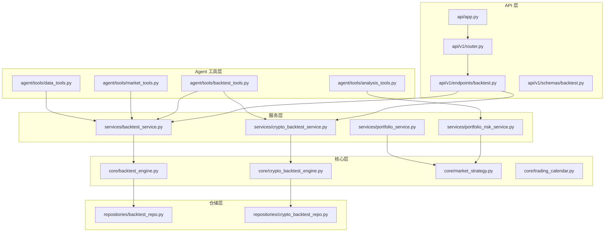
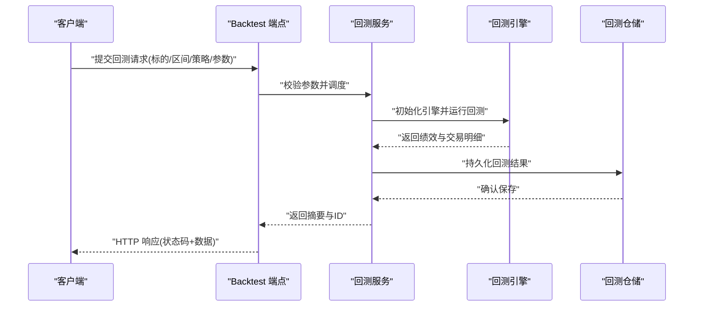
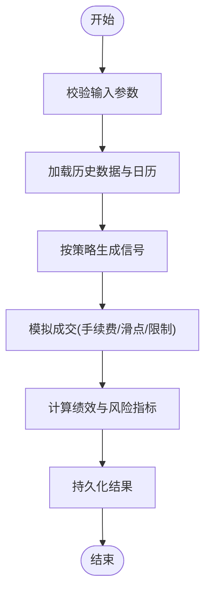
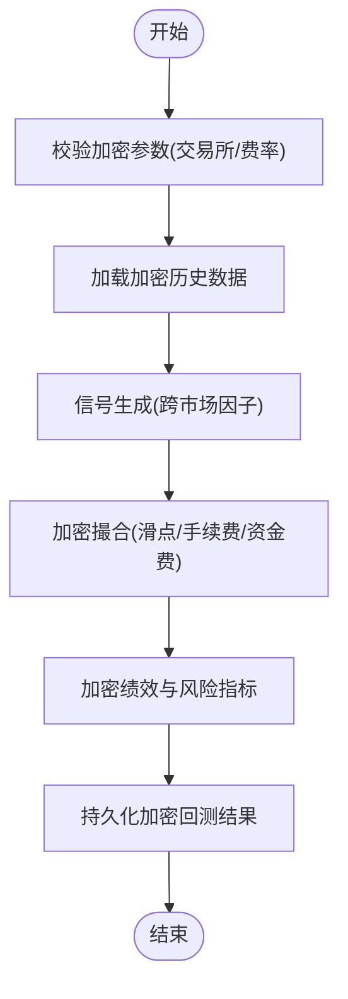
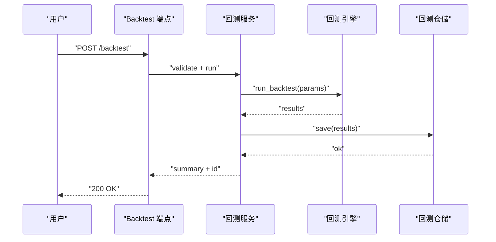
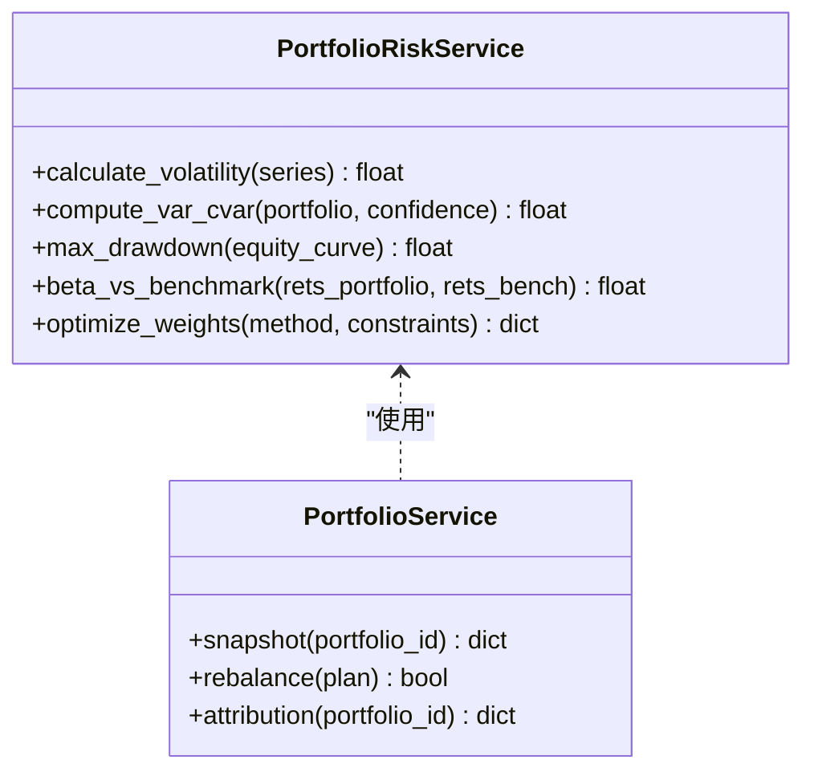
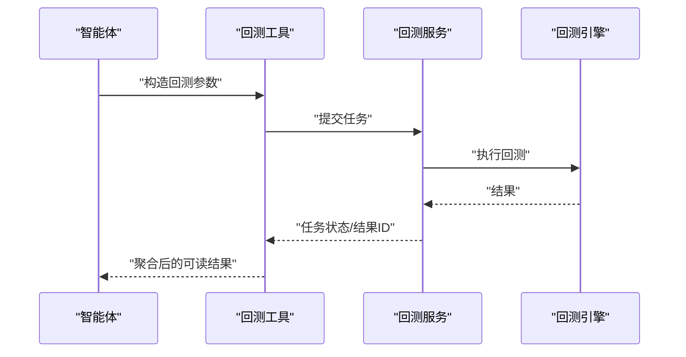
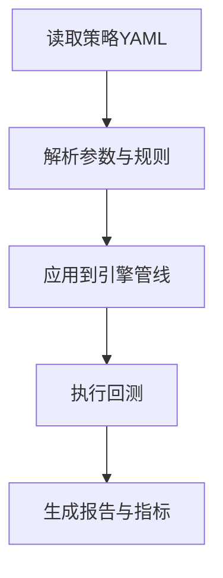
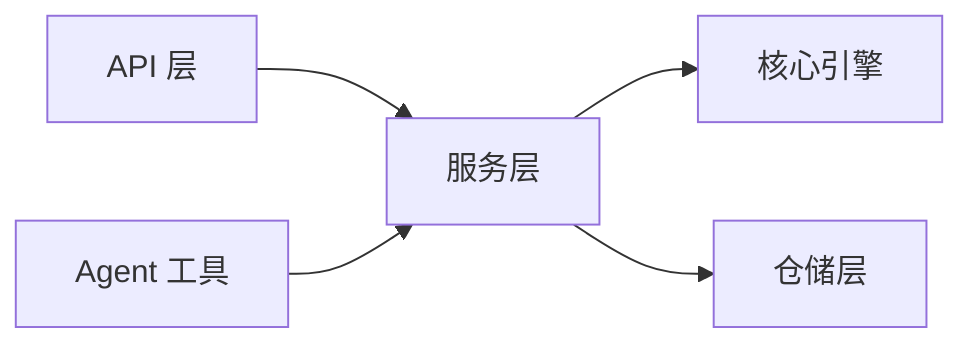

# 交易工具技能

<cite>
**本文引用的文件**   
- [main.py](file://main.py)
- [server.py](file://server.py)
- [api/app.py](file://api/app.py)
- [api/v1/router.py](file://api/v1/router.py)
- [api/v1/endpoints/backtest.py](file://api/v1/endpoints/backtest.py)
- [api/v1/schemas/backtest.py](file://api/v1/schemas/backtest.py)
- [src/core/backtest_engine.py](file://src/core/backtest_engine.py)
- [src/core/crypto_backtest_engine.py](file://src/core/crypto_backtest_engine.py)
- [src/services/backtest_service.py](file://src/services/backtest_service.py)
- [src/services/crypto_backtest_service.py](file://src/services/crypto_backtest_service.py)
- [src/repositories/backtest_repo.py](file://src/repositories/backtest_repo.py)
- [src/repositories/crypto_backtest_repo.py](file://src/repositories/crypto_backtest_repo.py)
- [src/agent/tools/backtest_tools.py](file://src/agent/tools/backtest_tools.py)
- [src/agent/tools/analysis_tools.py](file://src/agent/tools/analysis_tools.py)
- [src/agent/tools/market_tools.py](file://src/agent/tools/market_tools.py)
- [src/agent/tools/data_tools.py](file://src/agent/tools/data_tools.py)
- [src/services/portfolio_risk_service.py](file://src/services/portfolio_risk_service.py)
- [src/services/portfolio_service.py](file://src/services/portfolio_service.py)
- [src/core/market_strategy.py](file://src/core/market_strategy.py)
- [src/core/trading_calendar.py](file://src/core/trading_calendar.py)
- [strategies/bull_trend.yaml](file://strategies/bull_trend.yaml)
- [strategies/volume_breakout.yaml](file://strategies/volume_breakout.yaml)
- [tests/test_backtest_engine.py](file://tests/test_backtest_engine.py)
- [tests/test_crypto_backtest_engine.py](file://tests/test_crypto_backtest_engine.py)
- [tests/test_backtest_service.py](file://tests/test_backtest_service.py)
</cite>

## 目录
1. [简介](#简介)
2. [项目结构](#项目结构)
3. [核心组件](#核心组件)
4. [架构总览](#架构总览)
5. [详细组件分析](#详细组件分析)
6. [依赖关系分析](#依赖关系分析)
7. [性能考量](#性能考量)
8. [故障排除指南](#故障排除指南)
9. [结论](#结论)
10. [附录](#附录)

## 简介
本文件面向“交易工具技能”，系统性梳理回测执行、风险评估与投资组合分析等能力，覆盖：
- 回测引擎调用方式（股票与加密货币）
- 风险指标计算方法与组合优化思路
- 策略配置与测试流程
- 参数配置、性能监控与结果分析方法
- 集成最佳实践与常见问题排查

## 项目结构
本项目采用分层架构：API 层暴露接口，服务层编排业务逻辑，核心层提供回测引擎与策略框架，仓储层负责持久化，Agent 工具层封装可被智能体调用的能力。

图表来源
- [api/app.py](file://api/app.py)
- [api/v1/router.py](file://api/v1/router.py)
- [api/v1/endpoints/backtest.py](file://api/v1/endpoints/backtest.py)
- [api/v1/schemas/backtest.py](file://api/v1/schemas/backtest.py)
- [src/services/backtest_service.py](file://src/services/backtest_service.py)
- [src/services/crypto_backtest_service.py](file://src/services/crypto_backtest_service.py)
- [src/core/backtest_engine.py](file://src/core/backtest_engine.py)
- [src/core/crypto_backtest_engine.py](file://src/core/crypto_backtest_engine.py)
- [src/repositories/backtest_repo.py](file://src/repositories/backtest_repo.py)
- [src/repositories/crypto_backtest_repo.py](file://src/repositories/crypto_backtest_repo.py)
- [src/agent/tools/backtest_tools.py](file://src/agent/tools/backtest_tools.py)
- [src/agent/tools/analysis_tools.py](file://src/agent/tools/analysis_tools.py)
- [src/agent/tools/market_tools.py](file://src/agent/tools/market_tools.py)
- [src/agent/tools/data_tools.py](file://src/agent/tools/data_tools.py)

章节来源
- [main.py](file://main.py)
- [server.py](file://server.py)
- [api/app.py](file://api/app.py)
- [api/v1/router.py](file://api/v1/router.py)

## 核心组件
- 回测引擎
  - 股票回测引擎：负责历史数据加载、信号生成、成交模拟、绩效统计与报告输出。
  - 加密货币回测引擎：适配加密市场特性（如连续交易、手续费差异、滑点模型）。
- 服务层
  - 回测服务：统一入口，协调数据、引擎、风控与持久化。
  - 组合与风险服务：计算风险指标、进行资产配置优化、生成组合快照。
- Agent 工具
  - 回测工具：供智能体以自然语言或结构化参数触发回测任务。
  - 分析与市场工具：辅助获取行情、技术指标与上下文信息。
- 策略与日历
  - 策略定义：YAML 配置驱动的策略模板。
  - 交易日历：过滤非交易日与节假日，保证回测时间线准确。

章节来源
- [src/core/backtest_engine.py](file://src/core/backtest_engine.py)
- [src/core/crypto_backtest_engine.py](file://src/core/crypto_backtest_engine.py)
- [src/services/backtest_service.py](file://src/services/backtest_service.py)
- [src/services/crypto_backtest_service.py](file://src/services/crypto_backtest_service.py)
- [src/services/portfolio_risk_service.py](file://src/services/portfolio_risk_service.py)
- [src/services/portfolio_service.py](file://src/services/portfolio_service.py)
- [src/agent/tools/backtest_tools.py](file://src/agent/tools/backtest_tools.py)
- [src/agent/tools/analysis_tools.py](file://src/agent/tools/analysis_tools.py)
- [src/agent/tools/market_tools.py](file://src/agent/tools/market_tools.py)
- [src/agent/tools/data_tools.py](file://src/agent/tools/data_tools.py)
- [src/core/market_strategy.py](file://src/core/market_strategy.py)
- [src/core/trading_calendar.py](file://src/core/trading_calendar.py)
- [strategies/bull_trend.yaml](file://strategies/bull_trend.yaml)
- [strategies/volume_breakout.yaml](file://strategies/volume_breakout.yaml)

## 架构总览
下图展示一次典型回测请求从 API 到引擎执行的完整链路，以及结果落库与返回的时序。

图表来源
- [api/v1/endpoints/backtest.py](file://api/v1/endpoints/backtest.py)
- [src/services/backtest_service.py](file://src/services/backtest_service.py)
- [src/core/backtest_engine.py](file://src/core/backtest_engine.py)
- [src/repositories/backtest_repo.py](file://src/repositories/backtest_repo.py)

## 详细组件分析

### 回测引擎（股票）
- 职责
  - 加载历史数据与交易日历
  - 按策略生成买卖信号
  - 模拟成交（含手续费、滑点、涨跌停限制）
  - 计算收益曲线与风险指标（年化收益、最大回撤、夏普比率等）
- 关键流程
  - 参数校验 → 数据准备 → 信号生成 → 成交撮合 → 指标计算 → 结果序列化

图表来源
- [src/core/backtest_engine.py](file://src/core/backtest_engine.py)
- [src/core/trading_calendar.py](file://src/core/trading_calendar.py)

章节来源
- [src/core/backtest_engine.py](file://src/core/backtest_engine.py)
- [src/core/trading_calendar.py](file://src/core/trading_calendar.py)
- [tests/test_backtest_engine.py](file://tests/test_backtest_engine.py)

### 回测引擎（加密货币）
- 特点
  - 无休市、T+0 与高波动环境下的滑点与手续费建模
  - 支持多交易所费率与资金费率差异
- 流程
  - 与股票引擎类似，但数据源与撮合模型不同

图表来源
- [src/core/crypto_backtest_engine.py](file://src/core/crypto_backtest_engine.py)

章节来源
- [src/core/crypto_backtest_engine.py](file://src/core/crypto_backtest_engine.py)
- [tests/test_crypto_backtest_engine.py](file://tests/test_crypto_backtest_engine.py)

### 回测服务与 API
- API 端点
  - 接收回测请求，校验入参，调用服务层
- 服务层
  - 编排数据、引擎、风控与仓储
  - 支持异步任务与进度查询

图表来源
- [api/v1/endpoints/backtest.py](file://api/v1/endpoints/backtest.py)
- [src/services/backtest_service.py](file://src/services/backtest_service.py)
- [src/repositories/backtest_repo.py](file://src/repositories/backtest_repo.py)

章节来源
- [api/v1/endpoints/backtest.py](file://api/v1/endpoints/backtest.py)
- [api/v1/schemas/backtest.py](file://api/v1/schemas/backtest.py)
- [src/services/backtest_service.py](file://src/services/backtest_service.py)
- [tests/test_backtest_service.py](file://tests/test_backtest_service.py)

### 风险评估与组合分析
- 风险指标
  - 波动率、VaR/CVaR、最大回撤、Beta、信息比率、换手率等
- 组合优化
  - 均值-方差优化、风险平价、Black-Litterman 等（由服务层实现）
- 输出
  - 风险快照、归因分析、再平衡建议

图表来源
- [src/services/portfolio_risk_service.py](file://src/services/portfolio_risk_service.py)
- [src/services/portfolio_service.py](file://src/services/portfolio_service.py)

章节来源
- [src/services/portfolio_risk_service.py](file://src/services/portfolio_risk_service.py)
- [src/services/portfolio_service.py](file://src/services/portfolio_service.py)

### Agent 工具（回测与数据分析）
- 回测工具
  - 将自然语言或结构化参数转换为回测任务
  - 支持批量与并行回测
- 分析与市场工具
  - 拉取行情、技术指标、新闻与宏观背景
- 数据工具
  - 标准化数据格式、清洗与缓存

图表来源
- [src/agent/tools/backtest_tools.py](file://src/agent/tools/backtest_tools.py)
- [src/services/backtest_service.py](file://src/services/backtest_service.py)
- [src/core/backtest_engine.py](file://src/core/backtest_engine.py)

章节来源
- [src/agent/tools/backtest_tools.py](file://src/agent/tools/backtest_tools.py)
- [src/agent/tools/analysis_tools.py](file://src/agent/tools/analysis_tools.py)
- [src/agent/tools/market_tools.py](file://src/agent/tools/market_tools.py)
- [src/agent/tools/data_tools.py](file://src/agent/tools/data_tools.py)

### 策略配置与测试
- 策略 YAML
  - 定义入场/出场条件、仓位管理、止损止盈、过滤规则
- 测试
  - 单元测试覆盖引擎边界条件与指标计算正确性

图表来源
- [strategies/bull_trend.yaml](file://strategies/bull_trend.yaml)
- [strategies/volume_breakout.yaml](file://strategies/volume_breakout.yaml)
- [src/core/market_strategy.py](file://src/core/market_strategy.py)

章节来源
- [strategies/bull_trend.yaml](file://strategies/bull_trend.yaml)
- [strategies/volume_breakout.yaml](file://strategies/volume_breakout.yaml)
- [src/core/market_strategy.py](file://src/core/market_strategy.py)

## 依赖关系分析
- 组件耦合
  - API 仅依赖服务层；服务层依赖引擎与仓储；Agent 工具通过服务层间接访问引擎
- 外部依赖
  - 数据提供方（未在图中展开）、存储后端（由仓储抽象）
- 潜在循环
  - 当前分层清晰，未见循环导入

图表来源
- [api/v1/endpoints/backtest.py](file://api/v1/endpoints/backtest.py)
- [src/services/backtest_service.py](file://src/services/backtest_service.py)
- [src/core/backtest_engine.py](file://src/core/backtest_engine.py)
- [src/repositories/backtest_repo.py](file://src/repositories/backtest_repo.py)
- [src/agent/tools/backtest_tools.py](file://src/agent/tools/backtest_tools.py)

章节来源
- [api/v1/endpoints/backtest.py](file://api/v1/endpoints/backtest.py)
- [src/services/backtest_service.py](file://src/services/backtest_service.py)
- [src/core/backtest_engine.py](file://src/core/backtest_engine.py)
- [src/repositories/backtest_repo.py](file://src/repositories/backtest_repo.py)
- [src/agent/tools/backtest_tools.py](file://src/agent/tools/backtest_tools.py)

## 性能考量
- 数据加载
  - 预取与缓存历史数据，减少重复 IO
- 计算加速
  - 向量化指标计算、并行回测（多标的/多参数网格）
- 内存控制
  - 分块处理长序列，避免全量驻留
- 结果输出
  - 增量写入与分页查询，降低大对象传输开销

[本节为通用指导，不直接分析具体文件]

## 故障排除指南
- 常见错误
  - 参数校验失败：检查标的代码、时间区间、策略名称与必填字段
  - 数据缺失：确认数据源可用性与时间范围覆盖
  - 引擎异常：查看日志中的撮合与指标计算阶段报错
  - 持久化失败：检查仓储连接与权限
- 定位方法
  - 启用调试日志，记录关键步骤输入输出
  - 使用最小复现用例验证问题
  - 隔离网络与数据源，逐步缩小范围

章节来源
- [api/v1/endpoints/backtest.py](file://api/v1/endpoints/backtest.py)
- [src/services/backtest_service.py](file://src/services/backtest_service.py)
- [src/core/backtest_engine.py](file://src/core/backtest_engine.py)
- [src/repositories/backtest_repo.py](file://src/repositories/backtest_repo.py)

## 结论
本交易工具集以分层架构为核心，提供可扩展的回测引擎、完善的风险评估与组合分析能力，并通过 Agent 工具降低使用门槛。建议在生产环境中结合缓存、并行与监控手段提升稳定性与吞吐，同时建立完善的策略评审与回归测试流程。

[本节为总结，不直接分析具体文件]

## 附录
- 参数配置要点
  - 回测区间、初始资金、手续费与滑点、涨跌停限制、基准指数
  - 加密场景需额外设置交易所费率、资金费率与交易时段
- 结果分析方法
  - 关注收益曲线、最大回撤、夏普比率、胜率与盈亏比
  - 对比基准与行业指数，进行归因分析
- 集成最佳实践
  - 通过 API 或 Agent 工具统一接入
  - 使用仓储抽象屏蔽存储差异
  - 对关键路径增加重试与熔断机制

[本节为补充说明，不直接分析具体文件]