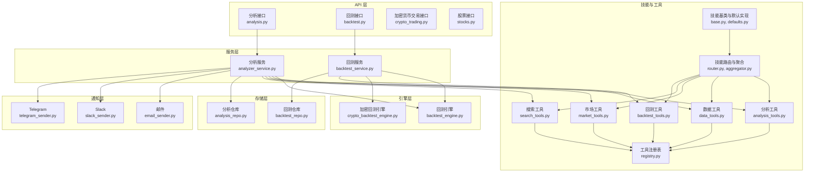
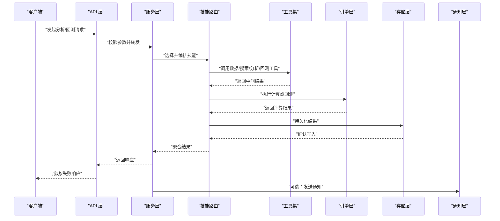
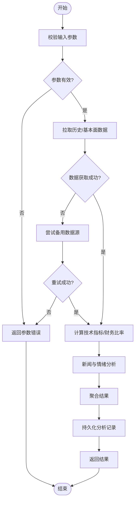
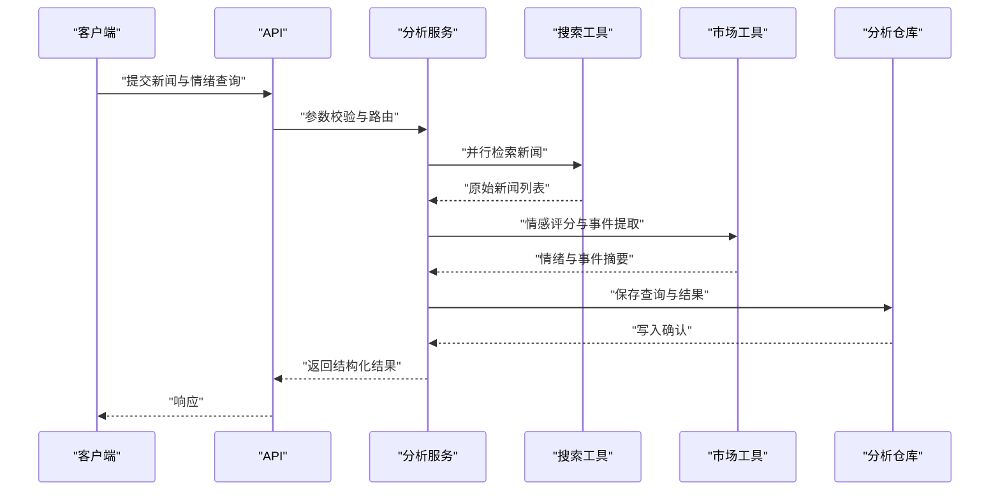
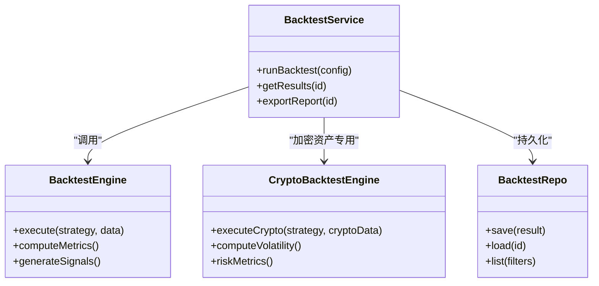
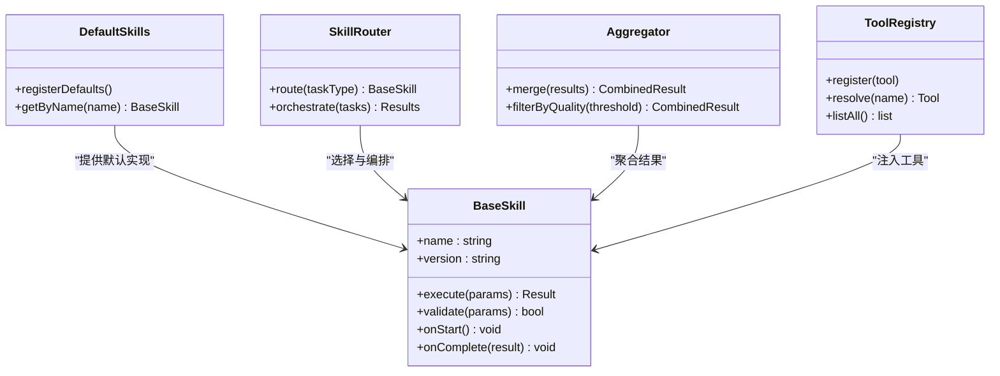
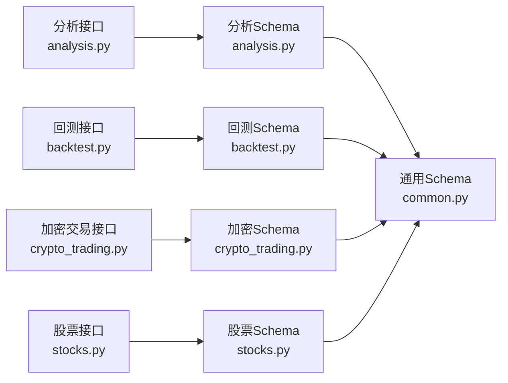
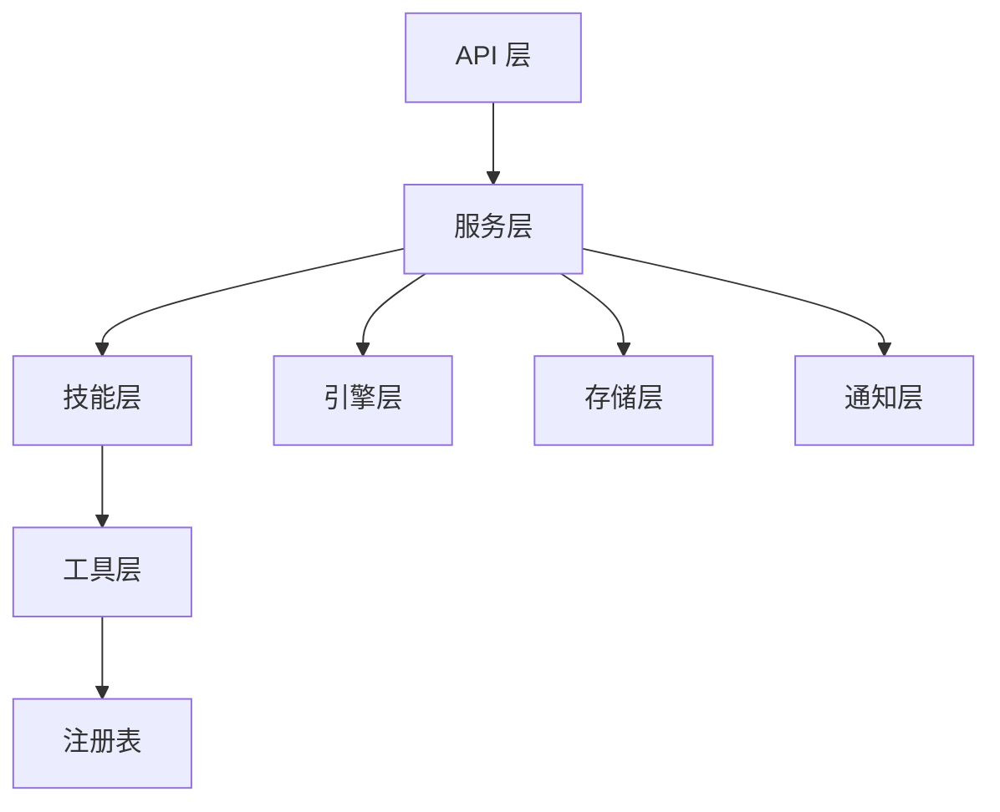

# 内置技能集合

<cite>
**本文引用的文件**   
- [src/agent/skills/base.py](file://src/agent/skills/base.py)
- [src/agent/skills/defaults.py](file://src/agent/skills/defaults.py)
- [src/agent/skills/router.py](file://src/agent/skills/router.py)
- [src/agent/skills/aggregator.py](file://src/agent/skills/aggregator.py)
- [src/agent/skills/skill_agent.py](file://src/agent/skills/skill_agent.py)
- [src/agent/tools/analysis_tools.py](file://src/agent/tools/analysis_tools.py)
- [src/agent/tools/backtest_tools.py](file://src/agent/tools/backtest_tools.py)
- [src/agent/tools/data_tools.py](file://src/agent/tools/data_tools.py)
- [src/agent/tools/market_tools.py](file://src/agent/tools/market_tools.py)
- [src/agent/tools/search_tools.py](file://src/agent/tools/search_tools.py)
- [src/agent/tools/registry.py](file://src/agent/tools/registry.py)
- [api/v1/endpoints/backtest.py](file://api/v1/endpoints/backtest.py)
- [api/v1/endpoints/analysis.py](file://api/v1/endpoints/analysis.py)
- [api/v1/endpoints/crypto_trading.py](file://api/v1/endpoints/crypto_trading.py)
- [api/v1/endpoints/stocks.py](file://api/v1/endpoints/stocks.py)
- [api/v1/schemas/backtest.py](file://api/v1/schemas/backtest.py)
- [api/v1/schemas/analysis.py](file://api/v1/schemas/analysis.py)
- [api/v1/schemas/common.py](file://api/v1/schemas/common.py)
- [src/services/backtest_service.py](file://src/services/backtest_service.py)
- [src/services/analyzer_service.py](file://src/services/analyzer_service.py)
- [src/core/backtest_engine.py](file://src/core/backtest_engine.py)
- [src/core/crypto_backtest_engine.py](file://src/core/crypto_backtest_engine.py)
- [src/repositories/backtest_repo.py](file://src/repositories/backtest_repo.py)
- [src/repositories/analysis_repo.py](file://src/repositories/analysis_repo.py)
- [src/notification_sender/email_sender.py](file://src/notification_sender/email_sender.py)
- [src/notification_sender/slack_sender.py](file://src/notification_sender/slack_sender.py)
- [src/notification_sender/telegram_sender.py](file://src/notification_sender/telegram_sender.py)
</cite>

## 目录
1. [简介](#简介)
2. [项目结构](#项目结构)
3. [核心组件](#核心组件)
4. [架构总览](#架构总览)
5. [详细组件分析](#详细组件分析)
6. [依赖关系分析](#依赖关系分析)
7. [性能考量](#性能考量)
8. [故障排查指南](#故障排查指南)
9. [结论](#结论)
10. [附录](#附录)

## 简介
本文件系统化梳理并文档化项目的“内置技能集合”，覆盖数据分析、市场研究、交易工具三大类。每个技能均包含功能特性、参数配置、输入输出格式、错误处理机制与性能特点，并提供调用示例与最佳实践，帮助开发者与用户快速集成与使用。

## 项目结构
本项目采用分层与模块化设计：
- API 层：提供 HTTP 接口，定义请求/响应 Schema，路由到服务层。
- 服务层：封装业务逻辑（回测、分析、通知等），协调仓库与引擎。
- 引擎层：回测引擎、加密资产回测引擎等核心计算模块。
- 技能与工具层：技能注册、路由、聚合与执行；工具集提供数据获取、搜索、分析、回测等能力。
- 存储层：仓库负责持久化（回测结果、分析记录等）。
- 通知层：多渠道消息发送（邮件、Slack、Telegram 等）。

**图表来源** 
- [api/v1/endpoints/analysis.py](file://api/v1/endpoints/analysis.py)
- [api/v1/endpoints/backtest.py](file://api/v1/endpoints/backtest.py)
- [api/v1/endpoints/crypto_trading.py](file://api/v1/endpoints/crypto_trading.py)
- [api/v1/endpoints/stocks.py](file://api/v1/endpoints/stocks.py)
- [src/services/analyzer_service.py](file://src/services/analyzer_service.py)
- [src/services/backtest_service.py](file://src/services/backtest_service.py)
- [src/core/backtest_engine.py](file://src/core/backtest_engine.py)
- [src/core/crypto_backtest_engine.py](file://src/core/crypto_backtest_engine.py)
- [src/agent/skills/base.py](file://src/agent/skills/base.py)
- [src/agent/skills/defaults.py](file://src/agent/skills/defaults.py)
- [src/agent/skills/router.py](file://src/agent/skills/router.py)
- [src/agent/skills/aggregator.py](file://src/agent/skills/aggregator.py)
- [src/agent/tools/analysis_tools.py](file://src/agent/tools/analysis_tools.py)
- [src/agent/tools/data_tools.py](file://src/agent/tools/data_tools.py)
- [src/agent/tools/market_tools.py](file://src/agent/tools/market_tools.py)
- [src/agent/tools/search_tools.py](file://src/agent/tools/search_tools.py)
- [src/agent/tools/backtest_tools.py](file://src/agent/tools/backtest_tools.py)
- [src/agent/tools/registry.py](file://src/agent/tools/registry.py)
- [src/repositories/backtest_repo.py](file://src/repositories/backtest_repo.py)
- [src/repositories/analysis_repo.py](file://src/repositories/analysis_repo.py)
- [src/notification_sender/email_sender.py](file://src/notification_sender/email_sender.py)
- [src/notification_sender/slack_sender.py](file://src/notification_sender/slack_sender.py)
- [src/notification_sender/telegram_sender.py](file://src/notification_sender/telegram_sender.py)

**章节来源**
- [api/v1/endpoints/analysis.py](file://api/v1/endpoints/analysis.py)
- [api/v1/endpoints/backtest.py](file://api/v1/endpoints/backtest.py)
- [api/v1/endpoints/crypto_trading.py](file://api/v1/endpoints/crypto_trading.py)
- [api/v1/endpoints/stocks.py](file://api/v1/endpoints/stocks.py)
- [src/services/analyzer_service.py](file://src/services/analyzer_service.py)
- [src/services/backtest_service.py](file://src/services/backtest_service.py)
- [src/core/backtest_engine.py](file://src/core/backtest_engine.py)
- [src/core/crypto_backtest_engine.py](file://src/core/crypto_backtest_engine.py)
- [src/agent/skills/base.py](file://src/agent/skills/base.py)
- [src/agent/skills/defaults.py](file://src/agent/skills/defaults.py)
- [src/agent/skills/router.py](file://src/agent/skills/router.py)
- [src/agent/skills/aggregator.py](file://src/agent/skills/aggregator.py)
- [src/agent/tools/analysis_tools.py](file://src/agent/tools/analysis_tools.py)
- [src/agent/tools/data_tools.py](file://src/agent/tools/data_tools.py)
- [src/agent/tools/market_tools.py](file://src/agent/tools/market_tools.py)
- [src/agent/tools/search_tools.py](file://src/agent/tools/search_tools.py)
- [src/agent/tools/backtest_tools.py](file://src/agent/tools/backtest_tools.py)
- [src/agent/tools/registry.py](file://src/agent/tools/registry.py)
- [src/repositories/backtest_repo.py](file://src/repositories/backtest_repo.py)
- [src/repositories/analysis_repo.py](file://src/repositories/analysis_repo.py)
- [src/notification_sender/email_sender.py](file://src/notification_sender/email_sender.py)
- [src/notification_sender/slack_sender.py](file://src/notification_sender/slack_sender.py)
- [src/notification_sender/telegram_sender.py](file://src/notification_sender/telegram_sender.py)

## 核心组件
- 技能基类与默认实现：定义技能的统一接口、生命周期与默认行为，便于扩展新技能。
- 技能路由与聚合：根据任务类型将请求分发至对应技能，支持多技能组合执行与结果聚合。
- 工具集：按领域划分的数据获取、搜索、分析与回测工具，供技能与服务调用。
- 服务层：面向 API 的业务编排，串联工具、引擎与仓库，完成端到端流程。
- 引擎层：高性能回测与指标计算，支撑策略评估与风险度量。
- 存储层：结构化持久化分析结果与回测记录，支持查询与回溯。
- 通知层：多渠道推送分析摘要、警报与报告。

**章节来源**
- [src/agent/skills/base.py](file://src/agent/skills/base.py)
- [src/agent/skills/defaults.py](file://src/agent/skills/defaults.py)
- [src/agent/skills/router.py](file://src/agent/skills/router.py)
- [src/agent/skills/aggregator.py](file://src/agent/skills/aggregator.py)
- [src/agent/tools/analysis_tools.py](file://src/agent/tools/analysis_tools.py)
- [src/agent/tools/data_tools.py](file://src/agent/tools/data_tools.py)
- [src/agent/tools/market_tools.py](file://src/agent/tools/market_tools.py)
- [src/agent/tools/search_tools.py](file://src/agent/tools/search_tools.py)
- [src/agent/tools/backtest_tools.py](file://src/agent/tools/backtest_tools.py)
- [src/agent/tools/registry.py](file://src/agent/tools/registry.py)
- [src/services/analyzer_service.py](file://src/services/analyzer_service.py)
- [src/services/backtest_service.py](file://src/services/backtest_service.py)
- [src/core/backtest_engine.py](file://src/core/backtest_engine.py)
- [src/core/crypto_backtest_engine.py](file://src/core/crypto_backtest_engine.py)
- [src/repositories/backtest_repo.py](file://src/repositories/backtest_repo.py)
- [src/repositories/analysis_repo.py](file://src/repositories/analysis_repo.py)
- [src/notification_sender/email_sender.py](file://src/notification_sender/email_sender.py)
- [src/notification_sender/slack_sender.py](file://src/notification_sender/slack_sender.py)
- [src/notification_sender/telegram_sender.py](file://src/notification_sender/telegram_sender.py)

## 架构总览
系统以“API -> 服务 -> 技能/工具 -> 引擎/仓库 -> 通知”的链路组织，技能作为可插拔单元，通过路由与聚合器协同工作，形成灵活的分析与交易工作流。

**图表来源** 
- [api/v1/endpoints/analysis.py](file://api/v1/endpoints/analysis.py)
- [api/v1/endpoints/backtest.py](file://api/v1/endpoints/backtest.py)
- [src/services/analyzer_service.py](file://src/services/analyzer_service.py)
- [src/services/backtest_service.py](file://src/services/backtest_service.py)
- [src/agent/skills/router.py](file://src/agent/skills/router.py)
- [src/agent/tools/analysis_tools.py](file://src/agent/tools/analysis_tools.py)
- [src/agent/tools/data_tools.py](file://src/agent/tools/data_tools.py)
- [src/agent/tools/market_tools.py](file://src/agent/tools/market_tools.py)
- [src/agent/tools/search_tools.py](file://src/agent/tools/search_tools.py)
- [src/agent/tools/backtest_tools.py](file://src/agent/tools/backtest_tools.py)
- [src/core/backtest_engine.py](file://src/core/backtest_engine.py)
- [src/core/crypto_backtest_engine.py](file://src/core/crypto_backtest_engine.py)
- [src/repositories/backtest_repo.py](file://src/repositories/backtest_repo.py)
- [src/repositories/analysis_repo.py](file://src/repositories/analysis_repo.py)
- [src/notification_sender/email_sender.py](file://src/notification_sender/email_sender.py)
- [src/notification_sender/slack_sender.py](file://src/notification_sender/slack_sender.py)
- [src/notification_sender/telegram_sender.py](file://src/notification_sender/telegram_sender.py)

## 详细组件分析

### 数据分析技能
涵盖技术指标计算、财务数据分析、历史行情与基本面数据拉取、新闻与社交媒体情绪分析等。

- 功能特性
  - 技术指标：移动平均线、RSI、MACD、布林带等常用指标计算。
  - 财务数据：估值指标、利润表、资产负债表、现金流等关键比率。
  - 数据源：多数据提供商适配，支持 A 股、美股、港股与加密货币。
  - 新闻与情绪：新闻检索、关键词过滤、情感评分与趋势汇总。
- 参数配置
  - 标的代码、时间范围、频率（日/周/月）、指标参数窗口。
  - 数据源选择与优先级、缓存开关、重试次数与超时。
  - 新闻搜索关键词、语言、平台、时间粒度。
- 输入输出格式
  - 输入：标准化 JSON 对象，包含标的、时间范围、指标列表、数据源偏好等。
  - 输出：结构化指标序列、财务比率字典、新闻摘要与情绪分数。
- 错误处理
  - 数据缺失回退（多源冗余）、网络异常重试、字段校验失败报错。
  - 统一错误码与可观测日志，便于追踪与告警。
- 性能特点
  - 批量拉取与并行请求、惰性计算与缓存命中优化。
  - 大数据集分块处理，避免内存峰值。

**图表来源** 
- [src/agent/tools/analysis_tools.py](file://src/agent/tools/analysis_tools.py)
- [src/agent/tools/data_tools.py](file://src/agent/tools/data_tools.py)
- [src/agent/tools/market_tools.py](file://src/agent/tools/market_tools.py)
- [src/agent/tools/search_tools.py](file://src/agent/tools/search_tools.py)
- [src/services/analyzer_service.py](file://src/services/analyzer_service.py)
- [src/repositories/analysis_repo.py](file://src/repositories/analysis_repo.py)

**章节来源**
- [src/agent/tools/analysis_tools.py](file://src/agent/tools/analysis_tools.py)
- [src/agent/tools/data_tools.py](file://src/agent/tools/data_tools.py)
- [src/agent/tools/market_tools.py](file://src/agent/tools/market_tools.py)
- [src/agent/tools/search_tools.py](file://src/agent/tools/search_tools.py)
- [src/services/analyzer_service.py](file://src/services/analyzer_service.py)
- [src/repositories/analysis_repo.py](file://src/repositories/analysis_repo.py)

### 市场研究技能
聚焦新闻搜索、社交媒体分析与市场情绪监测，为投资决策提供信息支撑。

- 功能特性
  - 新闻检索：多搜索引擎与财经媒体聚合，去重与相关性排序。
  - 社媒分析：热门话题抓取、情感倾向判断、事件影响评估。
  - 市场阶段识别：结合宏观与微观信号生成市场状态摘要。
- 参数配置
  - 关键词、时间窗口、平台白名单、情感阈值、语言设置。
  - 并发度、缓存策略、结果分页与最大条目数。
- 输入输出格式
  - 输入：查询条件（关键词、时间、平台）、分析维度（情绪、事件）。
  - 输出：新闻清单、情感分数、事件摘要与趋势图数据。
- 错误处理
  - 外部 API 限流与降级、内容解析失败容错、空结果提示。
- 性能特点
  - 异步并发抓取、增量更新与热点缓存、结果压缩传输。

**图表来源** 
- [api/v1/endpoints/analysis.py](file://api/v1/endpoints/analysis.py)
- [src/services/analyzer_service.py](file://src/services/analyzer_service.py)
- [src/agent/tools/search_tools.py](file://src/agent/tools/search_tools.py)
- [src/agent/tools/market_tools.py](file://src/agent/tools/market_tools.py)
- [src/repositories/analysis_repo.py](file://src/repositories/analysis_repo.py)

**章节来源**
- [api/v1/endpoints/analysis.py](file://api/v1/endpoints/analysis.py)
- [src/services/analyzer_service.py](file://src/services/analyzer_service.py)
- [src/agent/tools/search_tools.py](file://src/agent/tools/search_tools.py)
- [src/agent/tools/market_tools.py](file://src/agent/tools/market_tools.py)
- [src/repositories/analysis_repo.py](file://src/repositories/analysis_repo.py)

### 交易工具技能
包括回测执行、风险评估、策略评估与交易信号生成，为策略开发与风控提供基础设施。

- 功能特性
  - 回测执行：历史数据驱动的策略回测，支持多资产与多周期。
  - 风险评估：波动率、最大回撤、夏普比率、VaR 等风险指标。
  - 信号生成：基于规则或模型的交易信号，附带置信度与触发条件。
- 参数配置
  - 策略参数、初始资金、手续费与滑点、仓位管理规则。
  - 回测区间、采样频率、基准指数、风险阈值。
- 输入输出格式
  - 输入：策略配置、标的与时间范围、风控参数。
  - 输出：收益曲线、交易明细、风险指标与信号序列。
- 错误处理
  - 数据不完整回退、参数非法拒绝、引擎异常捕获与重试。
- 性能特点
  - 向量化计算、并行回测、结果分页与增量导出。

**图表来源** 
- [src/services/backtest_service.py](file://src/services/backtest_service.py)
- [src/core/backtest_engine.py](file://src/core/backtest_engine.py)
- [src/core/crypto_backtest_engine.py](file://src/core/crypto_backtest_engine.py)
- [src/repositories/backtest_repo.py](file://src/repositories/backtest_repo.py)

**章节来源**
- [src/services/backtest_service.py](file://src/services/backtest_service.py)
- [src/core/backtest_engine.py](file://src/core/backtest_engine.py)
- [src/core/crypto_backtest_engine.py](file://src/core/crypto_backtest_engine.py)
- [src/repositories/backtest_repo.py](file://src/repositories/backtest_repo.py)

### 技能框架与执行
- 技能基类与默认实现：定义统一的技能接口、生命周期钩子与默认行为，确保可扩展性与一致性。
- 技能路由与聚合：根据任务类型选择技能，支持串行/并行编排与结果合并。
- 工具注册表：集中管理工具元数据与实例，便于动态加载与版本控制。

**图表来源** 
- [src/agent/skills/base.py](file://src/agent/skills/base.py)
- [src/agent/skills/defaults.py](file://src/agent/skills/defaults.py)
- [src/agent/skills/router.py](file://src/agent/skills/router.py)
- [src/agent/skills/aggregator.py](file://src/agent/skills/aggregator.py)
- [src/agent/tools/registry.py](file://src/agent/tools/registry.py)

**章节来源**
- [src/agent/skills/base.py](file://src/agent/skills/base.py)
- [src/agent/skills/defaults.py](file://src/agent/skills/defaults.py)
- [src/agent/skills/router.py](file://src/agent/skills/router.py)
- [src/agent/skills/aggregator.py](file://src/agent/skills/aggregator.py)
- [src/agent/tools/registry.py](file://src/agent/tools/registry.py)

### API 与 Schema
- 接口定义：分析、回测、加密货币交易与股票相关接口，统一入参出参与错误码。
- Schema 规范：Pydantic 模型约束字段类型、必填项与默认值，保障前后端契约一致。

**图表来源** 
- [api/v1/endpoints/analysis.py](file://api/v1/endpoints/analysis.py)
- [api/v1/endpoints/backtest.py](file://api/v1/endpoints/backtest.py)
- [api/v1/endpoints/crypto_trading.py](file://api/v1/endpoints/crypto_trading.py)
- [api/v1/endpoints/stocks.py](file://api/v1/endpoints/stocks.py)
- [api/v1/schemas/analysis.py](file://api/v1/schemas/analysis.py)
- [api/v1/schemas/backtest.py](file://api/v1/schemas/backtest.py)
- [api/v1/schemas/common.py](file://api/v1/schemas/common.py)

**章节来源**
- [api/v1/endpoints/analysis.py](file://api/v1/endpoints/analysis.py)
- [api/v1/endpoints/backtest.py](file://api/v1/endpoints/backtest.py)
- [api/v1/endpoints/crypto_trading.py](file://api/v1/endpoints/crypto_trading.py)
- [api/v1/endpoints/stocks.py](file://api/v1/endpoints/stocks.py)
- [api/v1/schemas/analysis.py](file://api/v1/schemas/analysis.py)
- [api/v1/schemas/backtest.py](file://api/v1/schemas/backtest.py)
- [api/v1/schemas/common.py](file://api/v1/schemas/common.py)

## 依赖关系分析
- 低耦合高内聚：技能与工具通过注册表解耦，服务层仅依赖抽象接口。
- 外部依赖：数据源、搜索引擎与通知渠道均可替换与扩展。
- 潜在循环依赖：通过分层与接口隔离避免循环引用。

**图表来源** 
- [api/v1/endpoints/analysis.py](file://api/v1/endpoints/analysis.py)
- [api/v1/endpoints/backtest.py](file://api/v1/endpoints/backtest.py)
- [src/services/analyzer_service.py](file://src/services/analyzer_service.py)
- [src/services/backtest_service.py](file://src/services/backtest_service.py)
- [src/agent/skills/router.py](file://src/agent/skills/router.py)
- [src/agent/tools/registry.py](file://src/agent/tools/registry.py)
- [src/core/backtest_engine.py](file://src/core/backtest_engine.py)
- [src/repositories/backtest_repo.py](file://src/repositories/backtest_repo.py)
- [src/notification_sender/email_sender.py](file://src/notification_sender/email_sender.py)

**章节来源**
- [api/v1/endpoints/analysis.py](file://api/v1/endpoints/analysis.py)
- [api/v1/endpoints/backtest.py](file://api/v1/endpoints/backtest.py)
- [src/services/analyzer_service.py](file://src/services/analyzer_service.py)
- [src/services/backtest_service.py](file://src/services/backtest_service.py)
- [src/agent/skills/router.py](file://src/agent/skills/router.py)
- [src/agent/tools/registry.py](file://src/agent/tools/registry.py)
- [src/core/backtest_engine.py](file://src/core/backtest_engine.py)
- [src/repositories/backtest_repo.py](file://src/repositories/backtest_repo.py)
- [src/notification_sender/email_sender.py](file://src/notification_sender/email_sender.py)

## 性能考量
- 数据拉取：批量与并行请求、连接池与超时控制、缓存与增量更新。
- 计算优化：向量化指标计算、惰性求值、分块处理大数组。
- 回测性能：策略参数网格并行、结果分页与异步导出。
- 存储与查询：索引优化、只读副本与读写分离。
- 通知与 I/O：异步发送、消息队列与限流保护。

[本节为通用指导，不直接分析具体文件]

## 故障排查指南
- 常见错误
  - 参数校验失败：检查必填字段、类型与取值范围。
  - 数据源不可用：切换备用源、检查网络与认证配置。
  - 回测引擎异常：核对策略参数、数据完整性与时间对齐。
  - 通知发送失败：验证渠道配置与权限。
- 定位方法
  - 查看统一错误码与日志上下文。
  - 使用健康检查接口确认服务状态。
  - 回放请求与响应 Schema 差异。
- 恢复策略
  - 自动重试与降级、结果缓存与断点续传。
  - 告警与人工介入流程。

**章节来源**
- [api/v1/endpoints/analysis.py](file://api/v1/endpoints/analysis.py)
- [api/v1/endpoints/backtest.py](file://api/v1/endpoints/backtest.py)
- [src/services/analyzer_service.py](file://src/services/analyzer_service.py)
- [src/services/backtest_service.py](file://src/services/backtest_service.py)
- [src/notification_sender/email_sender.py](file://src/notification_sender/email_sender.py)
- [src/notification_sender/slack_sender.py](file://src/notification_sender/slack_sender.py)
- [src/notification_sender/telegram_sender.py](file://src/notification_sender/telegram_sender.py)

## 结论
内置技能集合以模块化与可扩展为核心，覆盖数据分析、市场研究与交易工具三大领域。通过清晰的架构与完善的错误处理、性能优化与通知机制，用户可快速构建稳定的分析工作流与交易辅助系统。建议遵循最佳实践进行参数配置与调用编排，以获得稳定高效的运行效果。

[本节为总结性内容，不直接分析具体文件]

## 附录
- 调用示例（概念性）
  - 数据分析：提交标的与时间范围，选择指标与数据源，获取指标序列与新闻情绪摘要。
  - 市场研究：输入关键词与时间窗口，返回新闻清单、情感分数与事件摘要。
  - 回测执行：配置策略与风控参数，启动回测并下载收益曲线与交易明细。
- 最佳实践
  - 合理设置并发与超时，避免资源耗尽。
  - 使用缓存与增量更新降低重复计算。
  - 对关键路径添加监控与告警。
  - 保持 Schema 与接口版本兼容。

[本节为补充说明，不直接分析具体文件]