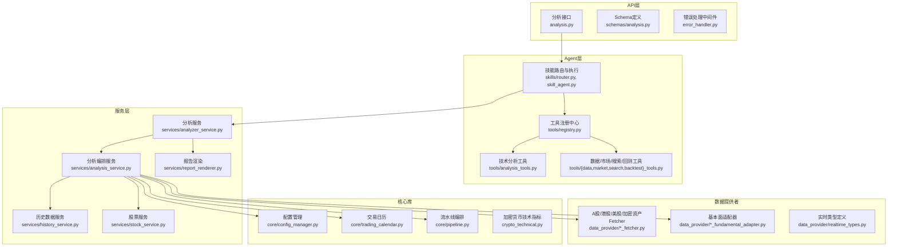
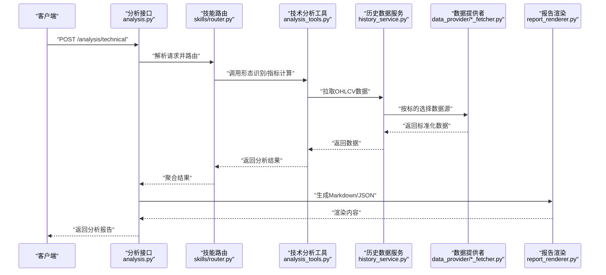
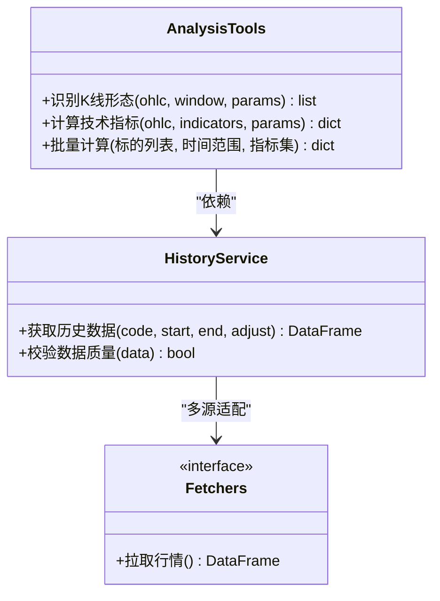
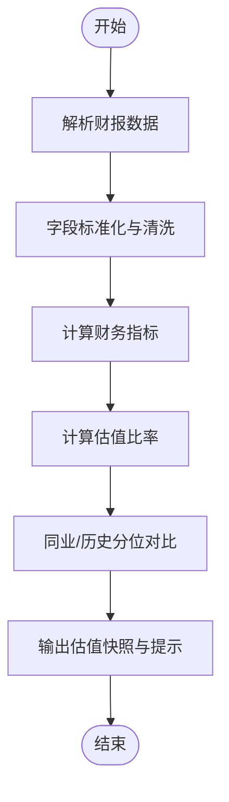
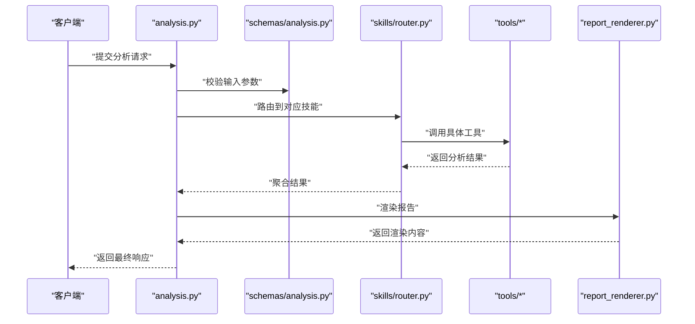
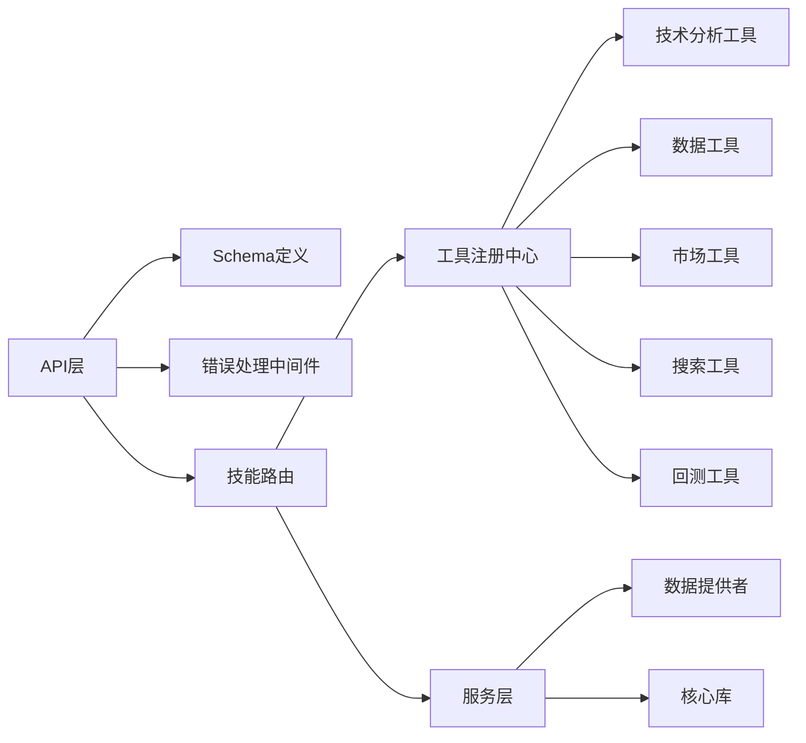

# 分析技能

<cite>
**本文引用的文件**   
- [SKILL.md](file://SKILL.md)
- [analysis.py](file://api/v1/endpoints/analysis.py)
- [analysis.py](file://api/v1/schemas/analysis.py)
- [analysis_tools.py](file://src/agent/tools/analysis_tools.py)
- [data_tools.py](file://src/agent/tools/data_tools.py)
- [market_tools.py](file://src/agent/tools/market_tools.py)
- [search_tools.py](file://src/agent/tools/search_tools.py)
- [backtest_tools.py](file://src/agent/tools/backtest_tools.py)
- [registry.py](file://src/agent/tools/registry.py)
- [skill_agent.py](file://src/agent/skills/skill_agent.py)
- [aggregator.py](file://src/agent/skills/aggregator.py)
- [base.py](file://src/agent/skills/base.py)
- [defaults.py](file://src/agent/skills/defaults.py)
- [router.py](file://src/agent/skills/router.py)
- [analyzer_service.py](file://src/services/analyzer_service.py)
- [analysis_service.py](file://src/services/analysis_service.py)
- [history_service.py](file://src/services/history_service.py)
- [stock_service.py](file://src/services/stock_service.py)
- [error_handler.py](file://api/middlewares/error_handler.py)
- [errors.py](file://api/v1/errors.py)
- [config_manager.py](file://src/core/config_manager.py)
- [pipeline.py](file://src/core/pipeline.py)
- [trading_calendar.py](file://src/core/trading_calendar.py)
- [crypto_technical.py](file://src/crypto_technical.py)
- [yfinance_fundamental_adapter.py](file://data_provider/yfinance_fundamental_adapter.py)
- [fundamental_adapter.py](file://data_provider/fundamental_adapter.py)
- [akshare_fetcher.py](file://data_provider/akshare_fetcher.py)
- [tushare_fetcher.py](file://data_provider/tushare_fetcher.py)
- [yfinance_fetcher.py](file://data_provider/yfinance_fetcher.py)
- [efinance_fetcher.py](file://data_provider/efinance_fetcher.py)
- [baostock_fetcher.py](file://data_provider/baostock_fetcher.py)
- [alphavantage_fetcher.py](file://data_provider/alphavantage_fetcher.py)
- [finnhub_fetcher.py](file://data_provider/finnhub_fetcher.py)
- [longbridge_fetcher.py](file://data_provider/longbridge_fetcher.py)
- [tickflow_fetcher.py](file://data_provider/tickflow_fetcher.py)
- [tencent_fetcher.py](file://data_provider/tencent_fetcher.py)
- [realtime_types.py](file://data_provider/realtime_types.py)
- [stock_index_loader.py](file://src/data/stock_index_loader.py)
- [stock_mapping.py](file://src/data/stock_mapping.py)
- [report_renderer.py](file://src/services/report_renderer.py)
- [formatters.py](file://src/formatters.py)
- [analysis_metadata.py](file://src/utils/analysis_metadata.py)
- [timeframe.py](file://src/utils/timeframe.py)
- [data_processing.py](file://src/utils/data_processing.py)
- [sniper_points.py](file://src/utils/sniper_points.py)
- [sanitizer.py](file://src/utils/sanitize.py)
- [llm_adapter.py](file://src/agent/llm_adapter.py)
- [usage.py](file://src/llm/usage.py)
- [errors.py](file://src/llm/errors.py)
- [generation_params.py](file://src/llm/generation_params.py)
</cite>

## 目录
1. [简介](#简介)
2. [项目结构](#项目结构)
3. [核心组件](#核心组件)
4. [架构总览](#架构总览)
5. [详细组件分析](#详细组件分析)
6. [依赖关系分析](#依赖关系分析)
7. [性能考虑](#性能考虑)
8. [故障排查指南](#故障排查指南)
9. [结论](#结论)
10. [附录](#附录)

## 简介
本文件面向“分析技能”的完整说明，覆盖技术分析工具（K线形态识别、技术指标计算）、财务数据分析（财务报表解析、估值分析）以及基本面分析技能的功能特性。文档将明确每个工具的输入参数、输出格式与使用场景，并提供调用示例路径、错误处理机制与性能优化建议，帮助读者快速上手并高效使用。

## 项目结构
本项目采用分层模块化设计：
- API 层：提供 REST 接口，定义请求/响应 Schema，统一错误处理与鉴权中间件。
- Agent 层：技能注册、路由、编排与执行；工具集（技术分析、数据、市场、搜索、回测）。
- 服务层：分析服务、历史数据服务、股票服务、报告渲染等。
- 数据提供者：多源行情与基本面数据获取适配层。
- 核心库：配置管理、交易日历、流水线编排、技术指标计算等。
- 前端应用：Web 与桌面端 UI，用于交互与可视化。

图表来源
- [analysis.py](file://api/v1/endpoints/analysis.py)
- [analysis.py](file://api/v1/schemas/analysis.py)
- [skill_agent.py](file://src/agent/skills/skill_agent.py)
- [registry.py](file://src/agent/tools/registry.py)
- [analysis_tools.py](file://src/agent/tools/analysis_tools.py)
- [data_tools.py](file://src/agent/tools/data_tools.py)
- [market_tools.py](file://src/agent/tools/market_tools.py)
- [search_tools.py](file://src/agent/tools/search_tools.py)
- [backtest_tools.py](file://src/agent/tools/backtest_tools.py)
- [analyzer_service.py](file://src/services/analyzer_service.py)
- [analysis_service.py](file://src/services/analysis_service.py)
- [history_service.py](file://src/services/history_service.py)
- [stock_service.py](file://src/services/stock_service.py)
- [report_renderer.py](file://src/services/report_renderer.py)
- [config_manager.py](file://src/core/config_manager.py)
- [trading_calendar.py](file://src/core/trading_calendar.py)
- [pipeline.py](file://src/core/pipeline.py)
- [crypto_technical.py](file://src/crypto_technical.py)
- [yfinance_fundamental_adapter.py](file://data_provider/yfinance_fundamental_adapter.py)
- [fundamental_adapter.py](file://data_provider/fundamental_adapter.py)
- [akshare_fetcher.py](file://data_provider/akshare_fetcher.py)
- [tushare_fetcher.py](file://data_provider/tushare_fetcher.py)
- [yfinance_fetcher.py](file://data_provider/yfinance_fetcher.py)
- [efinance_fetcher.py](file://data_provider/efinance_fetcher.py)
- [baostock_fetcher.py](file://data_provider/baostock_fetcher.py)
- [alphavantage_fetcher.py](file://data_provider/alphavantage_fetcher.py)
- [finnhub_fetcher.py](file://data_provider/finnhub_fetcher.py)
- [longbridge_fetcher.py](file://data_provider/longbridge_fetcher.py)
- [tickflow_fetcher.py](file://data_provider/tickflow_fetcher.py)
- [tencent_fetcher.py](file://data_provider/tencent_fetcher.py)
- [realtime_types.py](file://data_provider/realtime_types.py)

章节来源
- [SKILL.md](file://SKILL.md)

## 核心组件
- 技术分析工具
  - K线形态识别：支持常见形态检测（如吞没、十字星、启明星等），输入为时间序列OHLCV数据与窗口参数，输出为形态事件列表及置信度。
  - 技术指标计算：MA、EMA、MACD、RSI、布林带、ATR、成交量指标等，输入为价格/成交量序列与周期参数，输出为指标序列与信号标记。
- 财务数据分析
  - 财务报表解析：利润表、资产负债表、现金流量表的字段提取与清洗，输入为财报原始数据或代码+报告期，输出为标准化的财务指标字典。
  - 估值分析：PE/PB/PS/EV/EBITDA等比率计算与历史分位对比，输入为财务指标与市值/股本信息，输出为估值快照与趋势判断。
- 基本面分析技能
  - 行业与公司维度因子聚合，结合宏观与资金面数据，生成基本面评分与风险提示，输入为标的代码、时间范围与因子开关，输出为结构化摘要与可解释要点。

章节来源
- [analysis_tools.py](file://src/agent/tools/analysis_tools.py)
- [data_tools.py](file://src/agent/tools/data_tools.py)
- [market_tools.py](file://src/agent/tools/market_tools.py)
- [search_tools.py](file://src/agent/tools/search_tools.py)
- [backtest_tools.py](file://src/agent/tools/backtest_tools.py)
- [yfinance_fundamental_adapter.py](file://data_provider/yfinance_fundamental_adapter.py)
- [fundamental_adapter.py](file://data_provider/fundamental_adapter.py)

## 架构总览
分析技能通过API暴露能力，由Agent技能路由到具体工具，再由服务层协调数据提供者与核心库完成计算与报告渲染。

图表来源
- [analysis.py](file://api/v1/endpoints/analysis.py)
- [router.py](file://src/agent/skills/router.py)
- [analysis_tools.py](file://src/agent/tools/analysis_tools.py)
- [history_service.py](file://src/services/history_service.py)
- [akshare_fetcher.py](file://data_provider/akshare_fetcher.py)
- [tushare_fetcher.py](file://data_provider/tushare_fetcher.py)
- [yfinance_fetcher.py](file://data_provider/yfinance_fetcher.py)
- [report_renderer.py](file://src/services/report_renderer.py)

## 详细组件分析

### 技术分析工具（K线形态识别与指标计算）
- 功能特性
  - 形态识别：基于滑动窗口匹配经典K线组合，支持自定义阈值与过滤规则。
  - 指标计算：向量化计算常用技术指标，支持多周期与复权处理。
- 输入参数
  - 标的代码、时间范围、复权方式、窗口长度、指标参数（如MA周期、RSI周期等）。
- 输出格式
  - 形态事件：时间戳、形态名称、方向、置信度、参考价位。
  - 指标序列：时间戳对齐的数值列，附带信号标记（金叉/死叉、超买/超卖等）。
- 使用场景
  - 短线交易辅助、策略回测特征工程、盘中监控预警。

图表来源
- [analysis_tools.py](file://src/agent/tools/analysis_tools.py)
- [history_service.py](file://src/services/history_service.py)
- [akshare_fetcher.py](file://data_provider/akshare_fetcher.py)
- [tushare_fetcher.py](file://data_provider/tushare_fetcher.py)
- [yfinance_fetcher.py](file://data_provider/yfinance_fetcher.py)

章节来源
- [analysis_tools.py](file://src/agent/tools/analysis_tools.py)
- [history_service.py](file://src/services/history_service.py)

### 财务数据分析（报表解析与估值分析）
- 功能特性
  - 报表解析：统一不同数据源的财报字段映射，缺失值填充与异常值处理。
  - 估值分析：动态计算估值比率，结合历史分位与同业对比给出评估。
- 输入参数
  - 标的代码、报告期（季度/年度）、币种与会计准则、可比公司集合。
- 输出格式
  - 标准化财务指标字典、估值快照、趋势图数据、风险提示要点。
- 使用场景
  - 价值投资研究、财报季复盘、选股因子构建。

图表来源
- [yfinance_fundamental_adapter.py](file://data_provider/yfinance_fundamental_adapter.py)
- [fundamental_adapter.py](file://data_provider/fundamental_adapter.py)

章节来源
- [yfinance_fundamental_adapter.py](file://data_provider/yfinance_fundamental_adapter.py)
- [fundamental_adapter.py](file://data_provider/fundamental_adapter.py)

### 基本面分析技能
- 功能特性
  - 多维度因子聚合（盈利、成长、质量、估值、资金流、舆情）。
  - 生成可解释的基本面评分与风险清单。
- 输入参数
  - 标的代码、时间范围、因子开关、权重配置、报告语言。
- 输出格式
  - 结构化摘要、因子得分明细、关键驱动因素与建议。
- 使用场景
  - 中长期持仓决策、投研报告生成、组合基本面体检。

章节来源
- [skill_agent.py](file://src/agent/skills/skill_agent.py)
- [aggregator.py](file://src/agent/skills/aggregator.py)
- [base.py](file://src/agent/skills/base.py)
- [defaults.py](file://src/agent/skills/defaults.py)
- [router.py](file://src/agent/skills/router.py)

### API 接口与 Schema
- 接口职责
  - 接收分析请求，校验参数，路由至技能与工具，返回结构化结果。
- Schema 定义
  - 统一的输入输出模型，确保前后端一致性与可扩展性。

图表来源
- [analysis.py](file://api/v1/endpoints/analysis.py)
- [analysis.py](file://api/v1/schemas/analysis.py)
- [router.py](file://src/agent/skills/router.py)
- [report_renderer.py](file://src/services/report_renderer.py)

章节来源
- [analysis.py](file://api/v1/endpoints/analysis.py)
- [analysis.py](file://api/v1/schemas/analysis.py)

### 工具注册与路由
- 工具注册中心集中管理所有可用工具，支持动态加载与版本控制。
- 技能路由根据请求类型与参数选择合适工具链，支持并行与降级策略。

章节来源
- [registry.py](file://src/agent/tools/registry.py)
- [router.py](file://src/agent/skills/router.py)

### 数据提供者与适配层
- 多源适配：A股、港股、美股、加密资产等多数据源统一抽象。
- 实时类型：标准化的实时行情数据结构，便于跨源一致性。

章节来源
- [akshare_fetcher.py](file://data_provider/akshare_fetcher.py)
- [tushare_fetcher.py](file://data_provider/tushare_fetcher.py)
- [yfinance_fetcher.py](file://data_provider/yfinance_fetcher.py)
- [efinance_fetcher.py](file://data_provider/efinance_fetcher.py)
- [baostock_fetcher.py](file://data_provider/baostock_fetcher.py)
- [alphavantage_fetcher.py](file://data_provider/alphavantage_fetcher.py)
- [finnhub_fetcher.py](file://data_provider/finnhub_fetcher.py)
- [longbridge_fetcher.py](file://data_provider/longbridge_fetcher.py)
- [tickflow_fetcher.py](file://data_provider/tickflow_fetcher.py)
- [tencent_fetcher.py](file://data_provider/tencent_fetcher.py)
- [realtime_types.py](file://data_provider/realtime_types.py)

## 依赖关系分析
- 组件耦合
  - API 层依赖 Schema 与中间件，低耦合高内聚。
  - Agent 层通过注册中心解耦工具实现，便于扩展与维护。
  - 服务层协调数据提供者与核心库，保证数据处理流程稳定。
- 外部依赖
  - 多数据源Fetcher可能受网络与配额限制，需具备重试与降级。
  - LLM 适配器用于文本生成与摘要，需关注用量与错误恢复。

图表来源
- [analysis.py](file://api/v1/endpoints/analysis.py)
- [analysis.py](file://api/v1/schemas/analysis.py)
- [error_handler.py](file://api/middlewares/error_handler.py)
- [router.py](file://src/agent/skills/router.py)
- [registry.py](file://src/agent/tools/registry.py)
- [analysis_tools.py](file://src/agent/tools/analysis_tools.py)
- [data_tools.py](file://src/agent/tools/data_tools.py)
- [market_tools.py](file://src/agent/tools/market_tools.py)
- [search_tools.py](file://src/agent/tools/search_tools.py)
- [backtest_tools.py](file://src/agent/tools/backtest_tools.py)
- [analyzer_service.py](file://src/services/analyzer_service.py)
- [analysis_service.py](file://src/services/analysis_service.py)
- [history_service.py](file://src/services/history_service.py)
- [stock_service.py](file://src/services/stock_service.py)
- [config_manager.py](file://src/core/config_manager.py)
- [trading_calendar.py](file://src/core/trading_calendar.py)
- [pipeline.py](file://src/core/pipeline.py)

章节来源
- [registry.py](file://src/agent/tools/registry.py)
- [router.py](file://src/agent/skills/router.py)
- [error_handler.py](file://api/middlewares/error_handler.py)
- [errors.py](file://api/v1/errors.py)

## 性能考虑
- 数据拉取优化
  - 使用缓存与增量更新，减少重复请求。
  - 合理设置时间窗口与复权方式，避免不必要的数据量。
- 计算优化
  - 向量化计算指标，避免循环开销。
  - 并行处理多标的与多指标，利用任务队列提升吞吐。
- 报告渲染
  - 按需渲染，避免大对象序列化。
  - 模板化输出，减少字符串拼接成本。
- 资源管理
  - 连接池与超时控制，防止资源泄漏。
  - 限流与熔断，保护上游数据源与服务。

[本节为通用指导，不直接分析具体文件]

## 故障排查指南
- 常见问题
  - 数据源不可用：检查网络、凭证与配额，启用备用数据源。
  - 参数校验失败：核对输入Schema，确保必填字段与取值范围。
  - 指标计算异常：检查数据质量（缺失值、异常值），调整窗口与参数。
- 错误处理机制
  - API 层统一错误码与消息，便于前端展示与日志追踪。
  - 中间件捕获异常并记录上下文，支持重试与降级。
  - LLM 适配器错误分类与用量统计，避免无限重试。

章节来源
- [error_handler.py](file://api/middlewares/error_handler.py)
- [errors.py](file://api/v1/errors.py)
- [errors.py](file://src/llm/errors.py)
- [usage.py](file://src/llm/usage.py)
- [generation_params.py](file://src/llm/generation_params.py)

## 结论
分析技能以模块化与可扩展为核心，通过清晰的API、技能路由与工具注册机制，实现了技术分析、财务数据与基本面分析的端到端能力。借助多数据源适配与核心库支撑，系统具备良好的稳定性与性能。建议在生产环境中加强缓存、并发与错误恢复策略，以提升整体可靠性与用户体验。

[本节为总结性内容，不直接分析具体文件]

## 附录
- 使用示例（调用路径）
  - 技术分析：调用分析接口并提交标的代码、时间范围与指标参数，查看形态识别与指标序列输出。
  - 财务分析：提交财报期号与准则，获取标准化财务指标与估值快照。
  - 基本面分析：开启因子开关与权重，生成评分与风险提示。
- 最佳实践
  - 合理划分时间窗口，避免过大查询导致延迟。
  - 使用缓存与增量更新，降低数据源压力。
  - 对异常数据进行预处理与清洗，提高计算准确性。
  - 监控用量与错误率，及时扩容与优化。

[本节为补充信息，不直接分析具体文件]