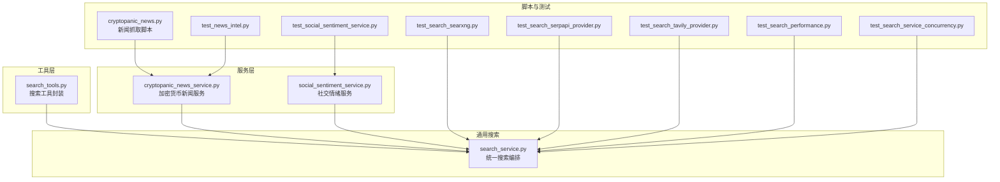
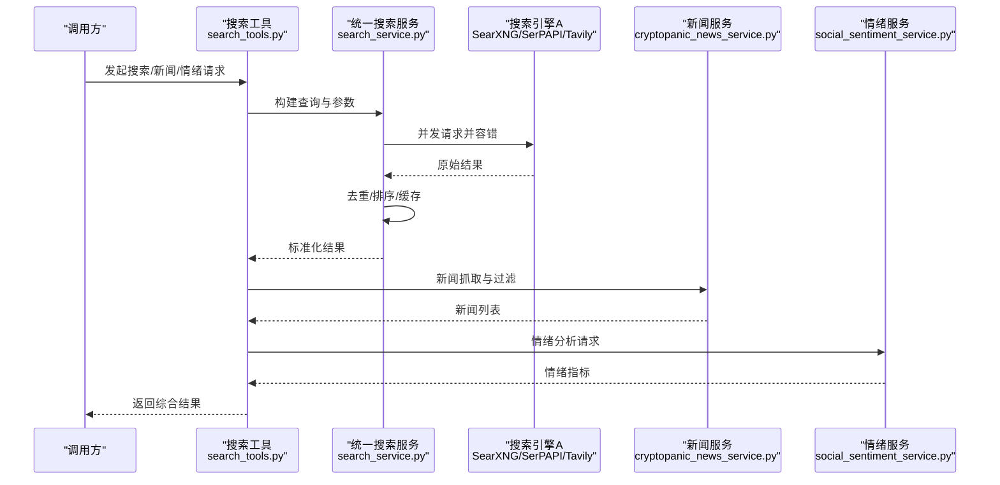
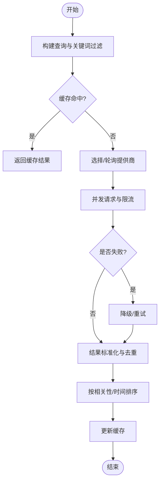
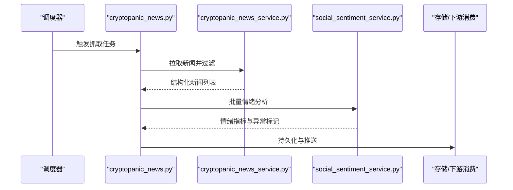
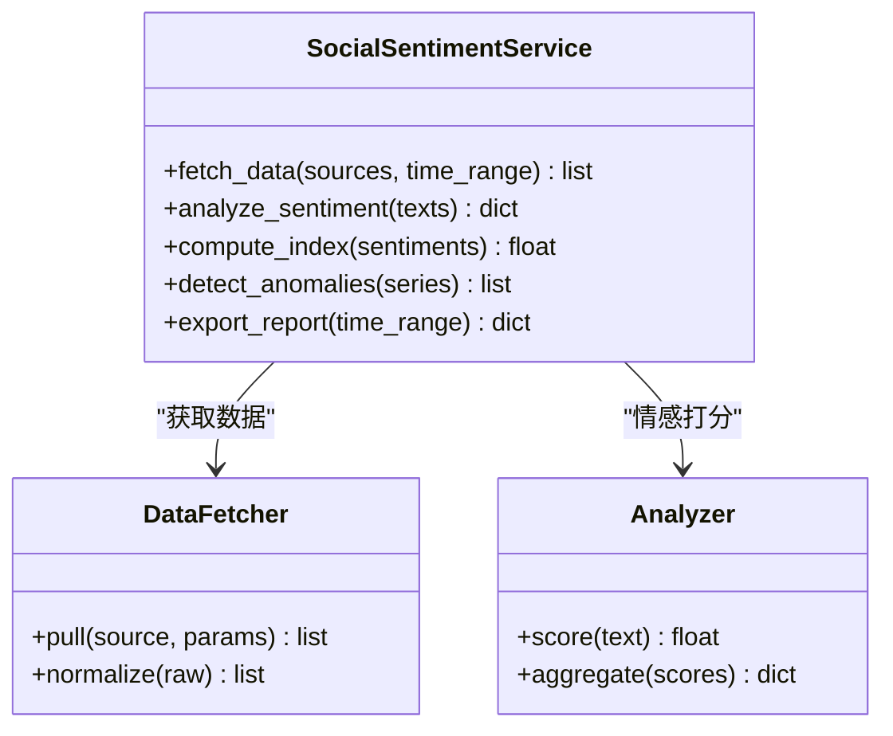
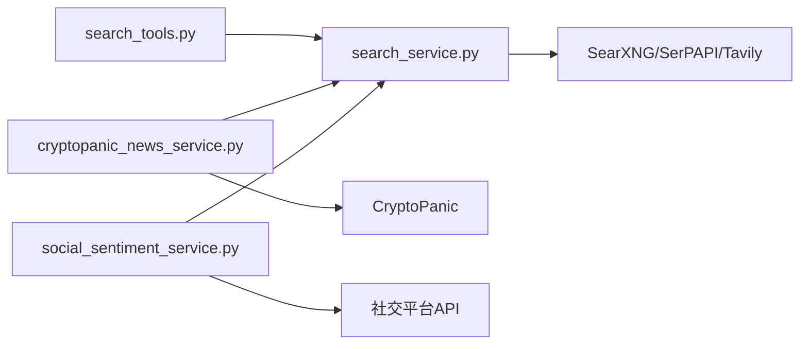

# 市场研究技能

<cite>
**本文引用的文件**   
- [src/agent/tools/search_tools.py](file://src/agent/tools/search_tools.py)
- [src/services/cryptopanic_news_service.py](file://src/services/cryptopanic_news_service.py)
- [src/services/social_sentiment_service.py](file://src/services/social_sentiment_service.py)
- [src/search_service.py](file://src/search_service.py)
- [scripts/cryptopanic_news.py](file://scripts/cryptopanic_news.py)
- [tests/test_search_searxng.py](file://tests/test_search_searxng.py)
- [tests/test_search_serpapi_provider.py](file://tests/test_search_serpapi_provider.py)
- [tests/test_search_tavily_provider.py](file://tests/test_search_tavily_provider.py)
- [tests/test_search_performance.py](file://tests/test_search_performance.py)
- [tests/test_search_service_concurrency.py](file://tests/test_search_service_concurrency.py)
- [tests/test_news_intel.py](file://tests/test_news_intel.py)
- [tests/test_social_sentiment_service.py](file://tests/test_social_sentiment_service.py)
</cite>

## 目录
1. [简介](#简介)
2. [项目结构](#项目结构)
3. [核心组件](#核心组件)
4. [架构总览](#架构总览)
5. [详细组件分析](#详细组件分析)
6. [依赖关系分析](#依赖关系分析)
7. [性能考量](#性能考量)
8. [故障排查指南](#故障排查指南)
9. [结论](#结论)
10. [附录](#附录)

## 简介
本文件面向“市场研究技能”，聚焦新闻搜索、社交媒体情绪分析与市场情报收集三大能力。文档从系统架构、数据流与处理逻辑出发，解释搜索引擎集成（SearXNG、SerPAPI、Tavily）、关键词过滤与情感分析算法的实现细节，并提供新闻抓取、舆情监控与市场趋势分析的使用示例。同时涵盖数据源配置、搜索策略与结果处理方法，以及性能调优与错误恢复的最佳实践。

## 项目结构
围绕市场研究技能的相关代码主要分布在以下位置：
- 工具层：搜索工具封装与调用入口
- 服务层：新闻聚合服务、社交情绪服务
- 通用搜索服务：统一搜索编排、并发控制与缓存
- 脚本与测试：新闻抓取脚本与多提供商搜索测试

图表来源 
- [src/agent/tools/search_tools.py](file://src/agent/tools/search_tools.py)
- [src/services/cryptopanic_news_service.py](file://src/services/cryptopanic_news_service.py)
- [src/services/social_sentiment_service.py](file://src/services/social_sentiment_service.py)
- [src/search_service.py](file://src/search_service.py)
- [scripts/cryptopanic_news.py](file://scripts/cryptopanic_news.py)
- [tests/test_search_searxng.py](file://tests/test_search_searxng.py)
- [tests/test_search_serpapi_provider.py](file://tests/test_search_serpapi_provider.py)
- [tests/test_search_tavily_provider.py](file://tests/test_search_tavily_provider.py)
- [tests/test_search_performance.py](file://tests/test_search_performance.py)
- [tests/test_search_service_concurrency.py](file://tests/test_search_service_concurrency.py)
- [tests/test_news_intel.py](file://tests/test_news_intel.py)
- [tests/test_social_sentiment_service.py](file://tests/test_social_sentiment_service.py)

章节来源
- [src/agent/tools/search_tools.py](file://src/agent/tools/search_tools.py)
- [src/services/cryptopanic_news_service.py](file://src/services/cryptopanic_news_service.py)
- [src/services/social_sentiment_service.py](file://src/services/social_sentiment_service.py)
- [src/search_service.py](file://src/search_service.py)
- [scripts/cryptopanic_news.py](file://scripts/cryptopanic_news.py)
- [tests/test_search_searxng.py](file://tests/test_search_searxng.py)
- [tests/test_search_serpapi_provider.py](file://tests/test_search_serpapi_provider.py)
- [tests/test_search_tavily_provider.py](file://tests/test_search_tavily_provider.py)
- [tests/test_search_performance.py](file://tests/test_search_performance.py)
- [tests/test_search_service_concurrency.py](file://tests/test_search_service_concurrency.py)
- [tests/test_news_intel.py](file://tests/test_news_intel.py)
- [tests/test_social_sentiment_service.py](file://tests/test_social_sentiment_service.py)

## 核心组件
- 搜索工具（search_tools）：对外暴露统一的搜索接口，负责参数校验、查询构建与结果标准化，支持多种搜索引擎后端。
- 统一搜索服务（search_service）：编排并发请求、重试与降级、缓存命中与失效、结果去重与排序，屏蔽底层提供商差异。
- 新闻服务（cryptopanic_news_service）：对接加密新闻聚合源，提供关键词过滤、时间窗口筛选与热点事件提取。
- 社交情绪服务（social_sentiment_service）：聚合社交平台内容，执行情感打分与趋势统计，输出情绪指标与异常波动告警。

章节来源
- [src/agent/tools/search_tools.py](file://src/agent/tools/search_tools.py)
- [src/search_service.py](file://src/search_service.py)
- [src/services/cryptopanic_news_service.py](file://src/services/cryptopanic_news_service.py)
- [src/services/social_sentiment_service.py](file://src/services/social_sentiment_service.py)

## 架构总览
下图展示了从上层调用到搜索与数据服务的整体流程，包括搜索引擎集成、关键词过滤、情感分析与结果处理。

图表来源 
- [src/agent/tools/search_tools.py](file://src/agent/tools/search_tools.py)
- [src/search_service.py](file://src/search_service.py)
- [src/services/cryptopanic_news_service.py](file://src/services/cryptopanic_news_service.py)
- [src/services/social_sentiment_service.py](file://src/services/social_sentiment_service.py)

## 详细组件分析

### 搜索引擎集成与搜索策略
- 支持的提供商：SearXNG、SerPAPI、Tavily。通过统一搜索服务进行路由与降级，确保在某一提供商不可用时自动切换或回退。
- 关键词过滤：在查询构建阶段对关键词进行规范化、停用词去除与同义词扩展；在结果阶段按标题/摘要匹配度与发布时间加权排序。
- 并发与限流：统一搜索服务维护并发上限、超时与重试策略，避免上游限流导致失败。
- 缓存策略：基于查询指纹的短期缓存，减少重复请求；对时效性强的新闻采用短 TTL。

图表来源 
- [src/search_service.py](file://src/search_service.py)
- [tests/test_search_searxng.py](file://tests/test_search_searxng.py)
- [tests/test_search_serpapi_provider.py](file://tests/test_search_serpapi_provider.py)
- [tests/test_search_tavily_provider.py](file://tests/test_search_tavily_provider.py)

章节来源
- [src/search_service.py](file://src/search_service.py)
- [tests/test_search_searxng.py](file://tests/test_search_searxng.py)
- [tests/test_search_serpapi_provider.py](file://tests/test_search_serpapi_provider.py)
- [tests/test_search_tavily_provider.py](file://tests/test_search_tavily_provider.py)

### 新闻抓取与舆情监控
- 数据源配置：通过环境变量或配置文件指定新闻聚合源（如 CryptoPanic）的 API Key、基础 URL、请求头与速率限制。
- 抓取流程：定时或按需拉取新闻，按时间窗口与关键词过滤，生成结构化条目（标题、摘要、链接、时间戳、来源）。
- 舆情监控：结合情绪服务对新闻文本进行情感打分，识别异常波动与热点话题，触发告警或纳入分析报告。

图表来源 
- [scripts/cryptopanic_news.py](file://scripts/cryptopanic_news.py)
- [src/services/cryptopanic_news_service.py](file://src/services/cryptopanic_news_service.py)
- [src/services/social_sentiment_service.py](file://src/services/social_sentiment_service.py)

章节来源
- [scripts/cryptopanic_news.py](file://scripts/cryptopanic_news.py)
- [src/services/cryptopanic_news_service.py](file://src/services/cryptopanic_news_service.py)
- [src/services/social_sentiment_service.py](file://src/services/social_sentiment_service.py)
- [tests/test_news_intel.py](file://tests/test_news_intel.py)

### 社交媒体情绪分析
- 数据接入：聚合社交平台（如 Twitter/X、Reddit、微博等）的内容流或 API。
- 情感分析算法：基于规则与模型混合的方式，计算正面/负面/中性比例，输出情绪指数与置信度；支持领域词典增强与上下文修正。
- 趋势分析：按时间窗口滑动统计情绪变化，检测拐点与异常峰值，生成趋势报告与可视化数据。

图表来源 
- [src/services/social_sentiment_service.py](file://src/services/social_sentiment_service.py)

章节来源
- [src/services/social_sentiment_service.py](file://src/services/social_sentiment_service.py)
- [tests/test_social_sentiment_service.py](file://tests/test_social_sentiment_service.py)

### 使用示例与最佳实践
- 新闻抓取示例：通过脚本或 API 调用新闻服务，设置关键词与时间范围，输出结构化新闻列表并写入存储。
- 舆情监控示例：订阅情绪服务的事件流，当情绪指数超过阈值时触发告警，并生成简要报告。
- 市场趋势分析示例：结合搜索结果与情绪指标，按行业/主题聚合，绘制趋势图与热点词云。

章节来源
- [scripts/cryptopanic_news.py](file://scripts/cryptopanic_news.py)
- [src/services/cryptopanic_news_service.py](file://src/services/cryptopanic_news_service.py)
- [src/services/social_sentiment_service.py](file://src/services/social_sentiment_service.py)

## 依赖关系分析
- 组件耦合：搜索工具依赖统一搜索服务；新闻与情绪服务均依赖统一搜索服务以获取外部信息。
- 外部依赖：SearXNG、SerPAPI、Tavily 等搜索引擎；CryptoPanic 新闻聚合；社交平台 API。
- 潜在循环依赖：当前设计通过服务层解耦，未发现直接循环依赖。

图表来源 
- [src/agent/tools/search_tools.py](file://src/agent/tools/search_tools.py)
- [src/search_service.py](file://src/search_service.py)
- [src/services/cryptopanic_news_service.py](file://src/services/cryptopanic_news_service.py)
- [src/services/social_sentiment_service.py](file://src/services/social_sentiment_service.py)

章节来源
- [src/agent/tools/search_tools.py](file://src/agent/tools/search_tools.py)
- [src/search_service.py](file://src/search_service.py)
- [src/services/cryptopanic_news_service.py](file://src/services/cryptopanic_news_service.py)
- [src/services/social_sentiment_service.py](file://src/services/social_sentiment_service.py)

## 性能考量
- 并发与吞吐：统一搜索服务支持并发请求与队列管理，建议根据上游限流调整并发上限与超时时间。
- 缓存命中率：合理设置缓存 TTL 与查询指纹，提升热点查询命中率，降低重复请求。
- 结果去重与排序：采用相似度与时间衰减函数，保证结果质量与时效性。
- 资源占用：批量情绪分析建议使用批处理与异步 IO，避免阻塞主流程。

章节来源
- [src/search_service.py](file://src/search_service.py)
- [tests/test_search_performance.py](file://tests/test_search_performance.py)
- [tests/test_search_service_concurrency.py](file://tests/test_search_service_concurrency.py)

## 故障排查指南
- 搜索引擎不可用：检查提供商配置与网络连通性；启用降级与重试策略；查看日志定位具体失败点。
- 关键词过滤无效：确认关键词规范化与停用词配置；验证结果排序权重是否合理。
- 情绪分析偏差：检查领域词典与模型版本；增加样本标注与回归测试。
- 性能瓶颈：监控并发与缓存命中率；优化批处理大小与超时配置。

章节来源
- [tests/test_search_searxng.py](file://tests/test_search_searxng.py)
- [tests/test_search_serpapi_provider.py](file://tests/test_search_serpapi_provider.py)
- [tests/test_search_tavily_provider.py](file://tests/test_search_tavily_provider.py)
- [tests/test_search_performance.py](file://tests/test_search_performance.py)
- [tests/test_search_service_concurrency.py](file://tests/test_search_service_concurrency.py)
- [tests/test_news_intel.py](file://tests/test_news_intel.py)
- [tests/test_social_sentiment_service.py](file://tests/test_social_sentiment_service.py)

## 结论
市场研究技能通过统一的搜索编排与专业的新闻、情绪服务，实现了高效、可靠的市场情报采集与分析。合理的关键词过滤、情感分析算法与性能调优策略，使其能够支撑高频舆情监控与趋势分析需求。建议在部署中关注提供商稳定性、缓存命中率与批处理效率，以确保系统的鲁棒性与可扩展性。

## 附录
- 数据源配置要点：为各提供商设置 API Key、基础 URL、请求头与速率限制；在环境变量或配置文件中统一管理。
- 搜索策略建议：优先使用本地缓存与去重；对时效性强的内容缩短 TTL；对高价值查询提升权重。
- 错误恢复最佳实践：实现多级降级（提供商切换、结果回退）、幂等重试与熔断保护；记录详细日志便于定位问题。