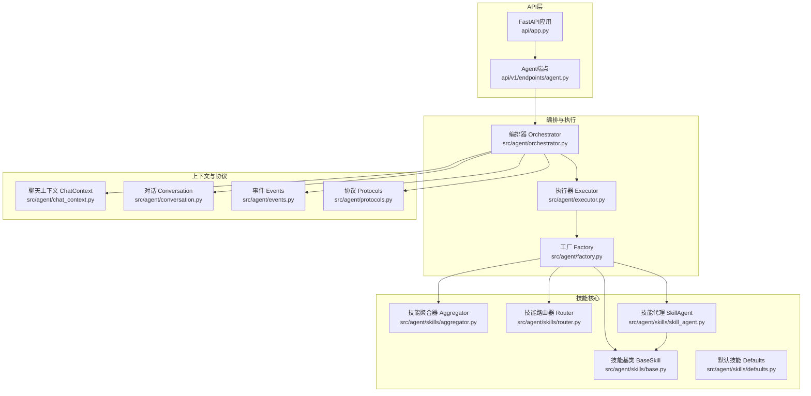
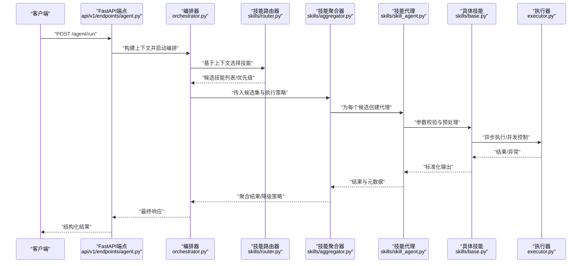
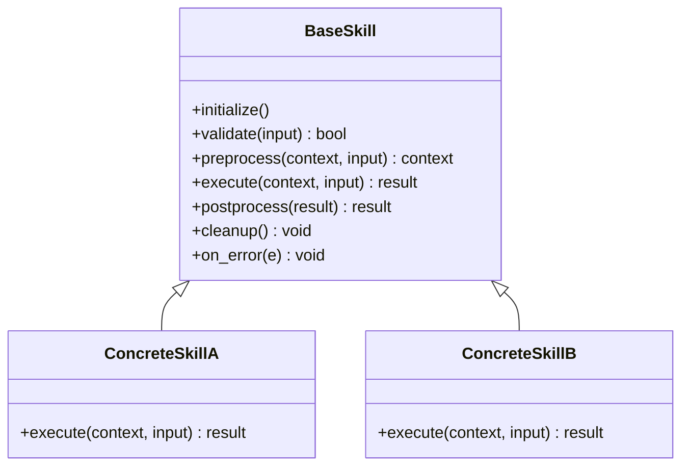
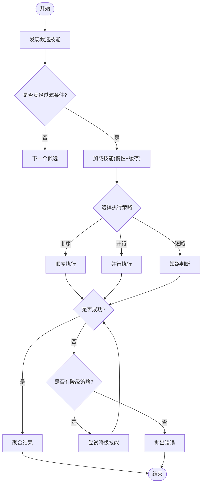
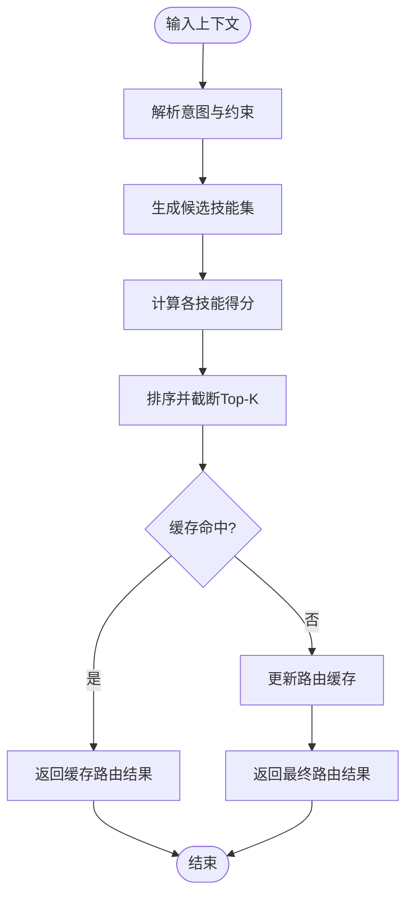
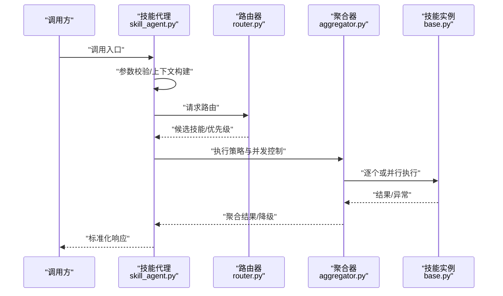
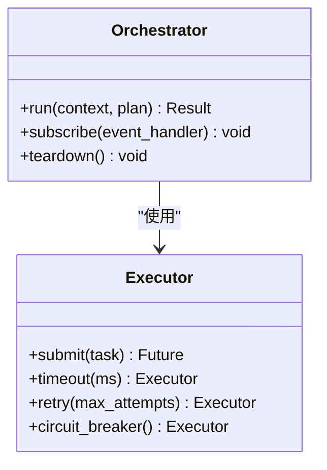
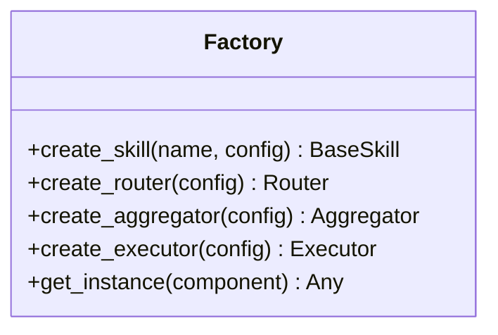
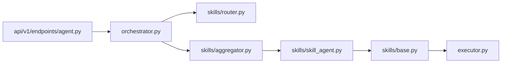

# 技能框架核心

<cite>
**本文引用的文件**   
- [src/agent/skills/base.py](file://src/agent/skills/base.py)
- [src/agent/skills/aggregator.py](file://src/agent/skills/aggregator.py)
- [src/agent/skills/router.py](file://src/agent/skills/router.py)
- [src/agent/skills/skill_agent.py](file://src/agent/skills/skill_agent.py)
- [src/agent/skills/defaults.py](file://src/agent/skills/defaults.py)
- [src/agent/orchestrator.py](file://src/agent/orchestrator.py)
- [src/agent/executor.py](file://src/agent/executor.py)
- [src/agent/factory.py](file://src/agent/factory.py)
- [src/agent/protocols.py](file://src/agent/protocols.py)
- [src/agent/chat_context.py](file://src/agent/chat_context.py)
- [src/agent/conversation.py](file://src/agent/conversation.py)
- [src/agent/events.py](file://src/agent/events.py)
- [api/v1/endpoints/agent.py](file://api/v1/endpoints/agent.py)
- [api/app.py](file://api/app.py)
</cite>

## 目录
1. [简介](#简介)
2. [项目结构](#项目结构)
3. [核心组件](#核心组件)
4. [架构总览](#架构总览)
5. [详细组件分析](#详细组件分析)
6. [依赖关系分析](#依赖关系分析)
7. [性能考量](#性能考量)
8. [故障排查指南](#故障排查指南)
9. [结论](#结论)
10. [附录：技能开发接口与示例](#附录技能开发接口与示例)

## 简介
本文件面向“技能框架核心”的开发者与维护者，系统化阐述技能基类设计模式、技能注册机制、生命周期管理、技能聚合器（发现/加载/执行策略）、技能路由器（基于上下文选择）以及技能代理（从请求到结果返回的完整流程）。文档同时提供技能开发的基础接口定义与使用示例路径，帮助快速上手并保证扩展性与可维护性。

## 项目结构
技能框架位于 src/agent/skills 目录下，围绕“基类—聚合器—路由器—代理—编排器”的分层组织；API 层通过 FastAPI 路由暴露能力，由 orchestrator/executor 驱动执行。

**图表来源** 
- [api/app.py](file://api/app.py)
- [api/v1/endpoints/agent.py](file://api/v1/endpoints/agent.py)
- [src/agent/orchestrator.py](file://src/agent/orchestrator.py)
- [src/agent/executor.py](file://src/agent/executor.py)
- [src/agent/factory.py](file://src/agent/factory.py)
- [src/agent/skills/base.py](file://src/agent/skills/base.py)
- [src/agent/skills/aggregator.py](file://src/agent/skills/aggregator.py)
- [src/agent/skills/router.py](file://src/agent/skills/router.py)
- [src/agent/skills/skill_agent.py](file://src/agent/skills/skill_agent.py)
- [src/agent/skills/defaults.py](file://src/agent/skills/defaults.py)
- [src/agent/chat_context.py](file://src/agent/chat_context.py)
- [src/agent/conversation.py](file://src/agent/conversation.py)
- [src/agent/events.py](file://src/agent/events.py)
- [src/agent/protocols.py](file://src/agent/protocols.py)

**章节来源**
- [api/app.py](file://api/app.py)
- [api/v1/endpoints/agent.py](file://api/v1/endpoints/agent.py)
- [src/agent/orchestrator.py](file://src/agent/orchestrator.py)
- [src/agent/executor.py](file://src/agent/executor.py)
- [src/agent/factory.py](file://src/agent/factory.py)
- [src/agent/skills/base.py](file://src/agent/skills/base.py)
- [src/agent/skills/aggregator.py](file://src/agent/skills/aggregator.py)
- [src/agent/skills/router.py](file://src/agent/skills/router.py)
- [src/agent/skills/skill_agent.py](file://src/agent/skills/skill_agent.py)
- [src/agent/skills/defaults.py](file://src/agent/skills/defaults.py)
- [src/agent/chat_context.py](file://src/agent/chat_context.py)
- [src/agent/conversation.py](file://src/agent/conversation.py)
- [src/agent/events.py](file://src/agent/events.py)
- [src/agent/protocols.py](file://src/agent/protocols.py)

## 核心组件
- 技能基类 BaseSkill：定义技能的统一抽象、生命周期钩子、输入输出契约与错误处理约定。
- 技能聚合器 Aggregator：负责技能发现、加载、缓存与批量执行策略（顺序/并行/短路等）。
- 技能路由器 Router：根据上下文（意图、领域、数据可用性、用户偏好等）选择最合适的技能。
- 技能代理 SkillAgent：封装一次完整的调用链路，包括参数校验、路由、执行、结果组装与回退。
- 编排器 Orchestrator：协调多个技能或步骤，管理会话上下文、事件流与资源清理。
- 执行器 Executor：底层任务调度与并发控制，保障超时、重试与幂等。
- 工厂 Factory：集中创建与装配组件实例，注入配置与依赖。
- 协议与上下文：Protocols 定义最小接口契约；ChatContext/Conversation 承载对话状态与历史。

**章节来源**
- [src/agent/skills/base.py](file://src/agent/skills/base.py)
- [src/agent/skills/aggregator.py](file://src/agent/skills/aggregator.py)
- [src/agent/skills/router.py](file://src/agent/skills/router.py)
- [src/agent/skills/skill_agent.py](file://src/agent/skills/skill_agent.py)
- [src/agent/orchestrator.py](file://src/agent/orchestrator.py)
- [src/agent/executor.py](file://src/agent/executor.py)
- [src/agent/factory.py](file://src/agent/factory.py)
- [src/agent/protocols.py](file://src/agent/protocols.py)
- [src/agent/chat_context.py](file://src/agent/chat_context.py)
- [src/agent/conversation.py](file://src/agent/conversation.py)

## 架构总览
下图展示从 API 请求到技能执行的端到端流程，强调路由选择、聚合执行与结果返回的关键节点。

**图表来源** 
- [api/v1/endpoints/agent.py](file://api/v1/endpoints/agent.py)
- [src/agent/orchestrator.py](file://src/agent/orchestrator.py)
- [src/agent/skills/router.py](file://src/agent/skills/router.py)
- [src/agent/skills/aggregator.py](file://src/agent/skills/aggregator.py)
- [src/agent/skills/skill_agent.py](file://src/agent/skills/skill_agent.py)
- [src/agent/skills/base.py](file://src/agent/skills/base.py)
- [src/agent/executor.py](file://src/agent/executor.py)

## 详细组件分析

### 技能基类 BaseSkill（设计模式与生命周期）
- 设计模式
  - 模板方法：定义统一的 execute/validate/hook 流程，子类仅实现关键步骤。
  - 策略模式：通过外部策略注入执行行为（如重试、超时、缓存）。
  - 观察者模式：在生命周期钩子中发布事件，供监听器记录与追踪。
- 生命周期
  - 初始化：依赖注入、配置校验、资源准备。
  - 预处理：参数校验、上下文增强、权限检查。
  - 执行：核心逻辑，支持异步与并发。
  - 后处理：结果规范化、指标上报、日志埋点。
  - 清理：释放资源、关闭连接、清理临时文件。
- 错误处理
  - 统一异常分类与映射，便于上层降级与重试。
  - 失败回退：当主技能不可用时，自动切换到备选策略。

**图表来源** 
- [src/agent/skills/base.py](file://src/agent/skills/base.py)

**章节来源**
- [src/agent/skills/base.py](file://src/agent/skills/base.py)

### 技能聚合器 Aggregator（发现/加载/执行策略）
- 技能发现
  - 扫描已注册的技能模块，读取元信息（名称、版本、依赖、描述）。
  - 支持按标签/领域过滤，减少候选集规模。
- 加载与缓存
  - 惰性加载：按需导入，避免冷启动开销。
  - 内存缓存：对已加载技能进行引用缓存，提升重复调用性能。
- 执行策略
  - 顺序执行：按优先级依次尝试，命中即止。
  - 并行执行：多技能并发，取最快成功结果或多数投票。
  - 短路策略：当满足特定条件时提前终止后续执行。
  - 降级策略：当主技能失败时，自动切换至备选技能。

**图表来源** 
- [src/agent/skills/aggregator.py](file://src/agent/skills/aggregator.py)

**章节来源**
- [src/agent/skills/aggregator.py](file://src/agent/skills/aggregator.py)

### 技能路由器 Router（基于上下文的技能选择）
- 选择依据
  - 意图识别：从用户输入或系统事件推断目标领域。
  - 数据可用性：检查所需数据源是否就绪。
  - 约束条件：时间窗口、地域、资产类别等。
  - 历史表现：基于过往成功率与延迟动态调整权重。
- 决策过程
  - 评分排序：对候选技能打分，选出最优或Top-K集合。
  - 规则引擎：支持可插拔的规则集，便于业务定制。
  - 缓存命中：对常见上下文组合缓存路由结果。

**图表来源** 
- [src/agent/skills/router.py](file://src/agent/skills/router.py)

**章节来源**
- [src/agent/skills/router.py](file://src/agent/skills/router.py)

### 技能代理 SkillAgent（请求到结果的完整流程）
- 职责
  - 参数校验与标准化。
  - 调用路由器选择技能。
  - 协调聚合器执行与结果整合。
  - 异常捕获、重试与降级。
  - 结果格式化与审计日志。
- 典型流程
  - 接收请求 → 构建上下文 → 路由选择 → 执行策略 → 结果聚合 → 返回响应。

**图表来源** 
- [src/agent/skills/skill_agent.py](file://src/agent/skills/skill_agent.py)
- [src/agent/skills/router.py](file://src/agent/skills/router.py)
- [src/agent/skills/aggregator.py](file://src/agent/skills/aggregator.py)
- [src/agent/skills/base.py](file://src/agent/skills/base.py)

**章节来源**
- [src/agent/skills/skill_agent.py](file://src/agent/skills/skill_agent.py)

### 编排器 Orchestrator 与执行器 Executor
- 编排器
  - 管理多技能协作流程，维护会话上下文与事件流。
  - 协调失败回退、补偿与事务一致性。
- 执行器
  - 提供线程/协程池、超时控制、重试与熔断。
  - 保障幂等与可观测性（指标、追踪ID）。

**图表来源** 
- [src/agent/orchestrator.py](file://src/agent/orchestrator.py)
- [src/agent/executor.py](file://src/agent/executor.py)

**章节来源**
- [src/agent/orchestrator.py](file://src/agent/orchestrator.py)
- [src/agent/executor.py](file://src/agent/executor.py)

### 工厂 Factory（装配与依赖注入）
- 作用
  - 集中创建与配置组件实例（技能、路由器、聚合器、执行器等）。
  - 注入配置项与环境变量，支持热更新。
  - 提供单例或作用域内共享的生命周期管理。

**图表来源** 
- [src/agent/factory.py](file://src/agent/factory.py)

**章节来源**
- [src/agent/factory.py](file://src/agent/factory.py)

### 默认技能 Defaults
- 提供开箱即用的基础技能实现，覆盖常见场景（如数据查询、简单分析、格式化输出）。
- 作为新技能开发的参考模板，确保一致的行为与接口。

**章节来源**
- [src/agent/skills/defaults.py](file://src/agent/skills/defaults.py)

### 协议与上下文（Protocols、ChatContext、Conversation、Events）
- Protocols：定义最小接口契约，确保组件间松耦合。
- ChatContext：承载单次调用的上下文（用户、会话、工具链、环境变量）。
- Conversation：维护对话历史与状态机。
- Events：事件总线，用于解耦与可观测性。

**章节来源**
- [src/agent/protocols.py](file://src/agent/protocols.py)
- [src/agent/chat_context.py](file://src/agent/chat_context.py)
- [src/agent/conversation.py](file://src/agent/conversation.py)
- [src/agent/events.py](file://src/agent/events.py)

## 依赖关系分析
- 低耦合高内聚：BaseSkill 定义稳定接口；Router/Aggregator/Agent 围绕其扩展。
- 依赖方向：API → Orchestrator → Router/Aggregator → Skill → Executor。
- 潜在循环依赖：应避免在 BaseSkill 中直接依赖 Router/Aggregator，改为通过工厂或注入方式获取。
- 外部依赖：HTTP/数据库/消息队列等通过 Executor 或独立适配器隔离。

**图表来源** 
- [api/v1/endpoints/agent.py](file://api/v1/endpoints/agent.py)
- [src/agent/orchestrator.py](file://src/agent/orchestrator.py)
- [src/agent/skills/router.py](file://src/agent/skills/router.py)
- [src/agent/skills/aggregator.py](file://src/agent/skills/aggregator.py)
- [src/agent/skills/skill_agent.py](file://src/agent/skills/skill_agent.py)
- [src/agent/skills/base.py](file://src/agent/skills/base.py)
- [src/agent/executor.py](file://src/agent/executor.py)

**章节来源**
- [api/v1/endpoints/agent.py](file://api/v1/endpoints/agent.py)
- [src/agent/orchestrator.py](file://src/agent/orchestrator.py)
- [src/agent/skills/router.py](file://src/agent/skills/router.py)
- [src/agent/skills/aggregator.py](file://src/agent/skills/aggregator.py)
- [src/agent/skills/skill_agent.py](file://src/agent/skills/skill_agent.py)
- [src/agent/skills/base.py](file://src/agent/skills/base.py)
- [src/agent/executor.py](file://src/agent/executor.py)

## 性能考量
- 惰性加载与缓存：技能按需加载，路由结果与聚合中间态缓存，降低冷启动与重复计算。
- 并发与限流：Executor 提供线程/协程池与速率限制，避免下游过载。
- 短路策略：命中即停，减少不必要调用。
- 批处理与合并：对相似请求进行合并，减少重复工作。
- 监控与追踪：埋点耗时、错误率与吞吐，定位瓶颈。

[本节为通用指导，不直接分析具体文件]

## 故障排查指南
- 常见问题
  - 技能未注册：检查注册表与模块扫描路径。
  - 路由失败：确认上下文字段完整性与规则配置。
  - 执行超时：调整 Executor 超时与重试策略。
  - 资源泄漏：确保 cleanup 钩子被调用。
- 诊断手段
  - 启用详细日志与事件追踪。
  - 使用健康检查端点验证依赖服务。
  - 回放失败请求，复现场景并定位根因。

**章节来源**
- [src/agent/events.py](file://src/agent/events.py)
- [src/agent/executor.py](file://src/agent/executor.py)

## 结论
技能框架以 BaseSkill 为核心抽象，配合 Router/Aggregator/Agent 形成清晰的职责边界与可扩展的执行管线。通过 Orchestrator/Executor 的统一编排与调度，实现了高可用、高性能与易维护的技能生态。遵循本文档的设计与最佳实践，可快速开发高质量技能并融入现有系统。

[本节为总结，不直接分析具体文件]

## 附录：技能开发接口与示例
- 基础接口
  - 继承 BaseSkill，实现 execute 与必要的生命周期钩子。
  - 在 validate/preprocess 中完成参数校验与上下文增强。
  - 在 postprocess/cleanup 中完成结果标准化与资源释放。
- 注册与发现
  - 将技能模块纳入扫描范围，确保元信息正确。
  - 使用 Factory 创建实例并注入配置。
- 路由与执行
  - 通过 Router 配置选择策略（意图、数据、约束）。
  - 使用 Aggregator 指定执行策略（顺序/并行/短路/降级）。
- 示例路径
  - 参考默认技能实现，快速搭建新技能骨架。
  - 在 API 端点中调用 Orchestrator，完成端到端流程。

**章节来源**
- [src/agent/skills/base.py](file://src/agent/skills/base.py)
- [src/agent/skills/defaults.py](file://src/agent/skills/defaults.py)
- [src/agent/factory.py](file://src/agent/factory.py)
- [src/agent/skills/router.py](file://src/agent/skills/router.py)
- [src/agent/skills/aggregator.py](file://src/agent/skills/aggregator.py)
- [api/v1/endpoints/agent.py](file://api/v1/endpoints/agent.py)