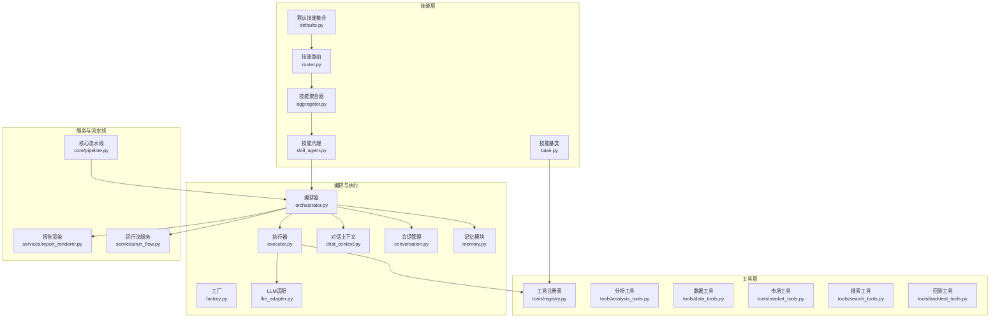
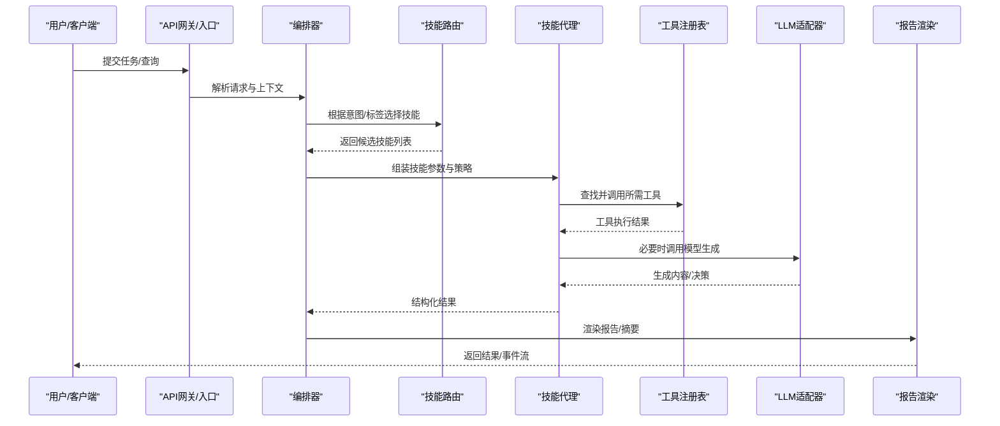
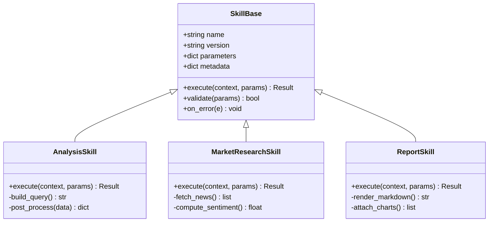
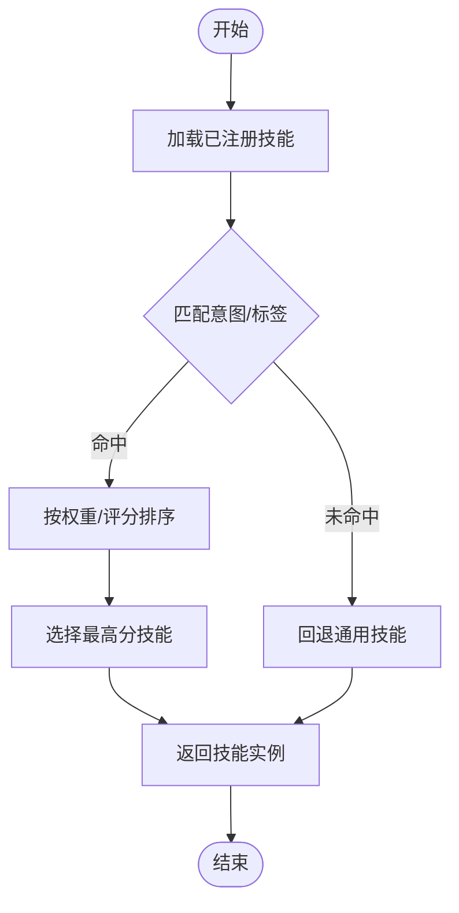
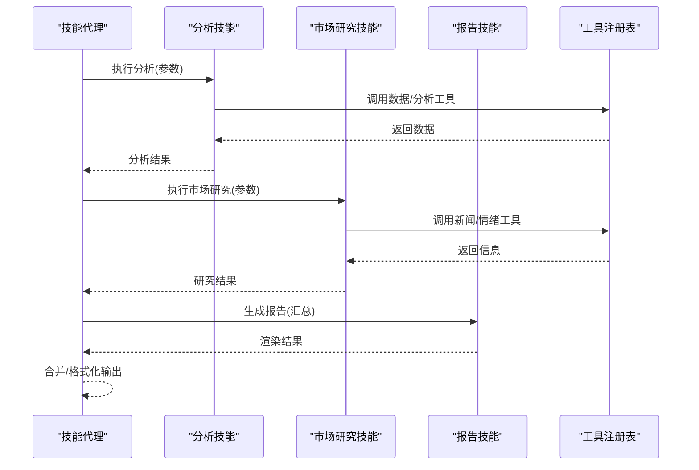
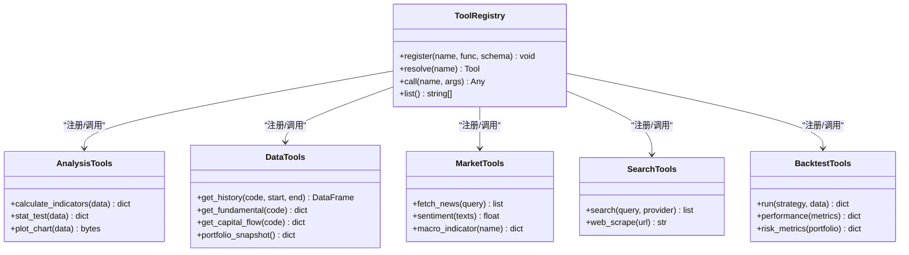
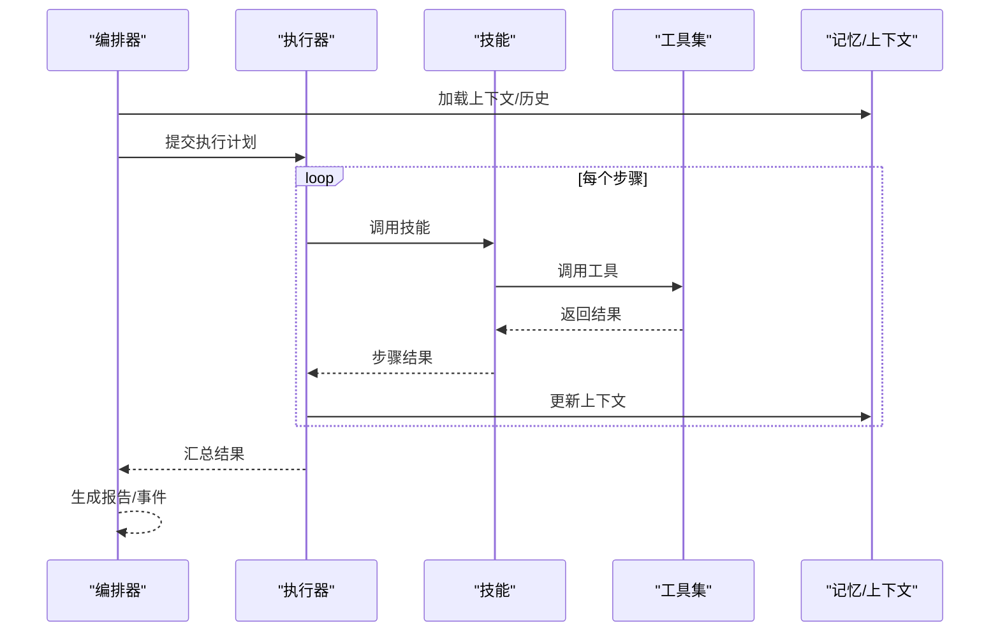
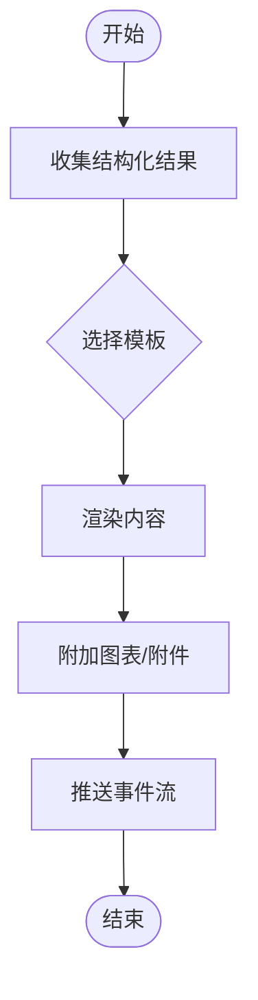
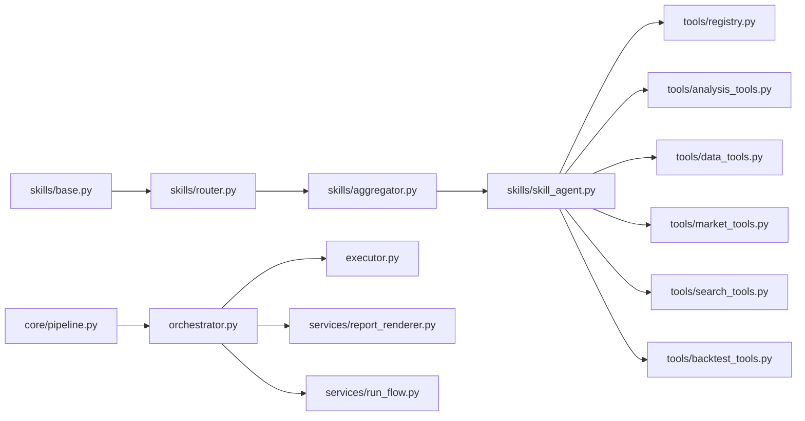

# 智能体技能系统

<cite>
**本文档引用的文件**   
- [SKILL.md](file://SKILL.md)
- [analyze-issue/SKILL.md](file://.agents/skills/analyze-issue/SKILL.md)
- [analyze-pr/SKILL.md](file://.agents/skills/analyze-pr/SKILL.md)
- [fix-issue/SKILL.md](file://.agents/skills/fix-issue/SKILL.md)
- [src/agent/skills/base.py](file://src/agent/skills/base.py)
- [src/agent/skills/aggregator.py](file://src/agent/skills/aggregator.py)
- [src/agent/skills/router.py](file://src/agent/skills/router.py)
- [src/agent/skills/skill_agent.py](file://src/agent/skills/skill_agent.py)
- [src/agent/skills/defaults.py](file://src/agent/skills/defaults.py)
- [src/agent/tools/registry.py](file://src/agent/tools/registry.py)
- [src/agent/tools/analysis_tools.py](file://src/agent/tools/analysis_tools.py)
- [src/agent/tools/data_tools.py](file://src/agent/tools/data_tools.py)
- [src/agent/tools/market_tools.py](file://src/agent/tools/market_tools.py)
- [src/agent/tools/search_tools.py](file://src/agent/tools/search_tools.py)
- [src/agent/tools/backtest_tools.py](file://src/agent/tools/backtest_tools.py)
- [src/agent/orchestrator.py](file://src/agent/orchestrator.py)
- [src/agent/executor.py](file://src/agent/executor.py)
- [src/agent/factory.py](file://src/agent/factory.py)
- [src/agent/chat_context.py](file://src/agent/chat_context.py)
- [src/agent/conversation.py](file://src/agent/conversation.py)
- [src/agent/memory.py](file://src/agent/memory.py)
- [src/agent/llm_adapter.py](file://src/agent/llm_adapter.py)
- [src/agent/protocols.py](file://src/agent/protocols.py)
- [src/agent/events.py](file://src/agent/events.py)
- [src/agent/research.py](file://src/agent/research.py)
- [src/agent/runner.py](file://src/agent/runner.py)
- [src/agent/provider_trace.py](file://src/agent/provider_trace.py)
- [src/agent/stock_scope.py](file://src/agent/stock_scope.py)
- [src/services/report_renderer.py](file://src/services/report_renderer.py)
- [src/services/run_flow.py](file://src/services/run_flow.py)
- [src/core/pipeline.py](file://src/core/pipeline.py)
- [src/config.py](file://src/config.py)
- [main.py](file://main.py)
- [server.py](file://server.py)
</cite>

## 目录
1. [引言](#引言)
2. [项目结构](#项目结构)
3. [核心组件](#核心组件)
4. [架构总览](#架构总览)
5. [详细组件分析](#详细组件分析)
6. [依赖关系分析](#依赖关系分析)
7. [性能考量](#性能考量)
8. [故障排查指南](#故障排查指南)
9. [结论](#结论)
10. [附录](#附录)

## 引言
本文件面向“智能体技能系统”的设计与使用，聚焦以下目标：
- 解释技能框架的设计原理、技能注册机制与执行流程
- 说明内置技能（数据分析、市场研究、报告生成等）的功能与用法
- 文档化技能开发规范、接口定义与测试方法
- 提供工具集使用指南（外部API调用、计算任务、数据处理）
- 给出自定义技能开发的完整示例与最佳实践

## 项目结构
技能系统位于 src/agent 子系统中，围绕“技能（Skill）—工具（Tool）—编排器（Orchestrator）—执行器（Executor）”分层组织。同时，.agents/skills 下存放以 SKILL.md 描述的技能说明，便于LLM或上层编排读取能力边界与约束。

图表来源
- [src/agent/skills/base.py](file://src/agent/skills/base.py)
- [src/agent/skills/defaults.py](file://src/agent/skills/defaults.py)
- [src/agent/skills/router.py](file://src/agent/skills/router.py)
- [src/agent/skills/aggregator.py](file://src/agent/skills/aggregator.py)
- [src/agent/skills/skill_agent.py](file://src/agent/skills/skill_agent.py)
- [src/agent/tools/registry.py](file://src/agent/tools/registry.py)
- [src/agent/tools/analysis_tools.py](file://src/agent/tools/analysis_tools.py)
- [src/agent/tools/data_tools.py](file://src/agent/tools/data_tools.py)
- [src/agent/tools/market_tools.py](file://src/agent/tools/market_tools.py)
- [src/agent/tools/search_tools.py](file://src/agent/tools/search_tools.py)
- [src/agent/tools/backtest_tools.py](file://src/agent/tools/backtest_tools.py)
- [src/agent/orchestrator.py](file://src/agent/orchestrator.py)
- [src/agent/executor.py](file://src/agent/executor.py)
- [src/agent/factory.py](file://src/agent/factory.py)
- [src/agent/chat_context.py](file://src/agent/chat_context.py)
- [src/agent/conversation.py](file://src/agent/conversation.py)
- [src/agent/memory.py](file://src/agent/memory.py)
- [src/agent/llm_adapter.py](file://src/agent/llm_adapter.py)
- [src/services/report_renderer.py](file://src/services/report_renderer.py)
- [src/services/run_flow.py](file://src/services/run_flow.py)
- [src/core/pipeline.py](file://src/core/pipeline.py)

章节来源
- [SKILL.md](file://SKILL.md)
- [.agents/skills/analyze-issue/SKILL.md](file://.agents/skills/analyze-issue/SKILL.md)
- [.agents/skills/analyze-pr/SKILL.md](file://.agents/skills/analyze-pr/SKILL.md)
- [.agents/skills/fix-issue/SKILL.md](file://.agents/skills/fix-issue/SKILL.md)

## 核心组件
- 技能基类与协议：定义技能的统一接口、参数校验、结果结构与错误处理契约
- 技能注册与路由：集中注册技能元信息，按意图/标签进行路由选择
- 技能聚合与代理：组合多个技能形成复合能力，屏蔽细节并暴露统一入口
- 工具注册表：统一管理可调用的工具函数，支持动态发现与权限控制
- 编排器与执行器：将用户请求分解为步骤，调度工具与LLM，维护上下文与状态
- 报告渲染与运行流：将结构化结果渲染为Markdown/HTML，并以事件流形式反馈进度

章节来源
- [src/agent/skills/base.py](file://src/agent/skills/base.py)
- [src/agent/skills/router.py](file://src/agent/skills/router.py)
- [src/agent/skills/aggregator.py](file://src/agent/skills/aggregator.py)
- [src/agent/skills/skill_agent.py](file://src/agent/skills/skill_agent.py)
- [src/agent/tools/registry.py](file://src/agent/tools/registry.py)
- [src/agent/orchestrator.py](file://src/agent/orchestrator.py)
- [src/agent/executor.py](file://src/agent/executor.py)
- [src/services/report_renderer.py](file://src/services/report_renderer.py)
- [src/services/run_flow.py](file://src/services/run_flow.py)

## 架构总览
技能系统采用“声明式技能 + 可插拔工具 + 编排驱动”的架构。上层通过SKILL.md声明能力边界，运行时由路由选择具体技能，再由编排器协调工具与LLM完成执行，最终通过报告渲染输出。

图表来源
- [src/agent/orchestrator.py](file://src/agent/orchestrator.py)
- [src/agent/skills/router.py](file://src/agent/skills/router.py)
- [src/agent/skills/skill_agent.py](file://src/agent/skills/skill_agent.py)
- [src/agent/tools/registry.py](file://src/agent/tools/registry.py)
- [src/agent/llm_adapter.py](file://src/agent/llm_adapter.py)
- [src/services/report_renderer.py](file://src/services/report_renderer.py)

## 详细组件分析

### 技能基类与协议
- 职责：定义技能输入/输出Schema、参数校验、错误码、重试与超时策略
- 关键点：统一的execute接口、结果标准化、可观测性埋点
- 扩展点：子类实现具体业务逻辑，注册到路由与工具链

图表来源
- [src/agent/skills/base.py](file://src/agent/skills/base.py)
- [src/agent/skills/defaults.py](file://src/agent/skills/defaults.py)

章节来源
- [src/agent/skills/base.py](file://src/agent/skills/base.py)
- [src/agent/skills/defaults.py](file://src/agent/skills/defaults.py)

### 技能注册与路由
- 职责：集中注册技能元信息（名称、版本、参数Schema、标签），按意图匹配最优技能
- 关键点：优先级排序、冲突消解、热更新支持
- 扩展点：新增技能后自动被发现与注册

图表来源
- [src/agent/skills/router.py](file://src/agent/skills/router.py)
- [src/agent/skills/aggregator.py](file://src/agent/skills/aggregator.py)

章节来源
- [src/agent/skills/router.py](file://src/agent/skills/router.py)
- [src/agent/skills/aggregator.py](file://src/agent/skills/aggregator.py)

### 技能代理与聚合
- 职责：封装多技能协作流程，屏蔽内部复杂度，对外暴露统一接口
- 关键点：并行/串行编排、失败回退、结果合并
- 扩展点：组合不同技能形成工作流模板

图表来源
- [src/agent/skills/skill_agent.py](file://src/agent/skills/skill_agent.py)
- [src/agent/tools/registry.py](file://src/agent/tools/registry.py)

章节来源
- [src/agent/skills/skill_agent.py](file://src/agent/skills/skill_agent.py)

### 工具注册表与工具集
- 职责：统一注册工具函数，提供类型安全调用、鉴权、限流与监控
- 分类：
  - 分析工具：指标计算、统计检验、可视化
  - 数据工具：历史行情、基本面、资金流向、快照
  - 市场工具：新闻抓取、情绪分析、宏观指标
  - 搜索工具：内外部搜索引擎集成
  - 回测工具：策略回测、绩效评估、风险指标
- 关键点：异步调用、错误隔离、结果缓存

图表来源
- [src/agent/tools/registry.py](file://src/agent/tools/registry.py)
- [src/agent/tools/analysis_tools.py](file://src/agent/tools/analysis_tools.py)
- [src/agent/tools/data_tools.py](file://src/agent/tools/data_tools.py)
- [src/agent/tools/market_tools.py](file://src/agent/tools/market_tools.py)
- [src/agent/tools/search_tools.py](file://src/agent/tools/search_tools.py)
- [src/agent/tools/backtest_tools.py](file://src/agent/tools/backtest_tools.py)

章节来源
- [src/agent/tools/registry.py](file://src/agent/tools/registry.py)
- [src/agent/tools/analysis_tools.py](file://src/agent/tools/analysis_tools.py)
- [src/agent/tools/data_tools.py](file://src/agent/tools/data_tools.py)
- [src/agent/tools/market_tools.py](file://src/agent/tools/market_tools.py)
- [src/agent/tools/search_tools.py](file://src/agent/tools/search_tools.py)
- [src/agent/tools/backtest_tools.py](file://src/agent/tools/backtest_tools.py)

### 编排器与执行器
- 编排器：解析用户意图，构建执行计划，协调技能与工具，维护上下文与记忆
- 执行器：负责并发调度、重试、超时、错误恢复与事件上报
- 关键点：步骤级可观测性、幂等性、资源限制

图表来源
- [src/agent/orchestrator.py](file://src/agent/orchestrator.py)
- [src/agent/executor.py](file://src/agent/executor.py)
- [src/agent/memory.py](file://src/agent/memory.py)

章节来源
- [src/agent/orchestrator.py](file://src/agent/orchestrator.py)
- [src/agent/executor.py](file://src/agent/executor.py)
- [src/agent/memory.py](file://src/agent/memory.py)

### 报告渲染与运行流
- 报告渲染：将结构化结果转换为Markdown/HTML，支持模板与附件
- 运行流：以事件流形式反馈执行进度、节点详情与拓扑视图
- 关键点：模板变量注入、增量渲染、流式传输

图表来源
- [src/services/report_renderer.py](file://src/services/report_renderer.py)
- [src/services/run_flow.py](file://src/services/run_flow.py)

章节来源
- [src/services/report_renderer.py](file://src/services/report_renderer.py)
- [src/services/run_flow.py](file://src/services/run_flow.py)

### 内置技能功能与使用方法
- 数据分析技能：用于技术指标计算、统计检验、数据清洗与可视化
  - 输入：标的代码、时间范围、指标列表
  - 输出：指标序列、统计摘要、图表二进制
  - 使用：通过技能路由选择“分析”相关技能，传入参数即可
- 市场研究技能：用于新闻抓取、情绪分析、宏观指标获取
  - 输入：关键词、时间窗口、指标名
  - 输出：新闻列表、情绪分数、指标值
  - 使用：选择“市场研究”技能，配置搜索源与过滤条件
- 报告生成技能：将分析与研究结果整合为Markdown/HTML报告
  - 输入：结构化结果、模板ID、语言偏好
  - 输出：渲染后的文本/HTML、附件清单
  - 使用：在编排阶段调用报告技能，传入前序步骤结果

章节来源
- [src/agent/skills/defaults.py](file://src/agent/skills/defaults.py)
- [src/agent/skills/router.py](file://src/agent/skills/router.py)
- [src/services/report_renderer.py](file://src/services/report_renderer.py)

### 技能开发规范与接口定义
- 命名与版本：技能名称唯一，语义清晰；版本号遵循语义化版本
- 参数Schema：使用强类型Schema定义输入，包含必填/可选字段与校验规则
- 结果结构：统一Result包装，包含data、meta、errors字段
- 错误处理：明确错误码与消息，支持重试与降级
- 可观测性：记录关键日志与埋点，便于追踪与诊断

章节来源
- [src/agent/skills/base.py](file://src/agent/skills/base.py)
- [src/agent/protocols.py](file://src/agent/protocols.py)

### 测试方法与最佳实践
- 单元测试：对技能参数校验、工具调用、结果格式进行断言
- 集成测试：模拟外部API响应，验证端到端流程
- 性能测试：压测并发调用、内存占用与延迟
- 回归测试：确保模板变更与Schema演进不破坏兼容性

章节来源
- [tests/test_skill_load_warning.py](file://tests/test_skill_load_warning.py)
- [tests/test_report_renderer.py](file://tests/test_report_renderer.py)

## 依赖关系分析
技能系统与工具集、编排器、执行器之间存在清晰的依赖边界。工具集通过注册表被技能与执行器访问；编排器依赖路由与技能代理；报告渲染与运行流作为横切服务被编排器调用。

图表来源
- [src/agent/skills/base.py](file://src/agent/skills/base.py)
- [src/agent/skills/router.py](file://src/agent/skills/router.py)
- [src/agent/skills/aggregator.py](file://src/agent/skills/aggregator.py)
- [src/agent/skills/skill_agent.py](file://src/agent/skills/skill_agent.py)
- [src/agent/tools/registry.py](file://src/agent/tools/registry.py)
- [src/agent/tools/analysis_tools.py](file://src/agent/tools/analysis_tools.py)
- [src/agent/tools/data_tools.py](file://src/agent/tools/data_tools.py)
- [src/agent/tools/market_tools.py](file://src/agent/tools/market_tools.py)
- [src/agent/tools/search_tools.py](file://src/agent/tools/search_tools.py)
- [src/agent/tools/backtest_tools.py](file://src/agent/tools/backtest_tools.py)
- [src/agent/orchestrator.py](file://src/agent/orchestrator.py)
- [src/agent/executor.py](file://src/agent/executor.py)
- [src/services/report_renderer.py](file://src/services/report_renderer.py)
- [src/services/run_flow.py](file://src/services/run_flow.py)
- [src/core/pipeline.py](file://src/core/pipeline.py)

章节来源
- [src/agent/skills/base.py](file://src/agent/skills/base.py)
- [src/agent/orchestrator.py](file://src/agent/orchestrator.py)
- [src/core/pipeline.py](file://src/core/pipeline.py)

## 性能考量
- 并发与限流：工具调用应支持并发与限流，避免外部API过载
- 缓存策略：对热点数据（如历史行情、新闻）实施缓存，减少重复请求
- 批处理：批量拉取数据与渲染报告，降低网络与序列化开销
- 资源隔离：不同技能/工具的内存与CPU配额，防止相互影响
- 可观测性：关键路径埋点与指标采集，便于定位瓶颈

[本节为通用指导，无需特定文件引用]

## 故障排查指南
- 常见问题
  - 技能未注册：检查注册表是否成功加载，确认名称与版本一致
  - 工具调用失败：查看错误码与日志，确认外部API可用性与鉴权
  - 渲染异常：检查模板变量与数据结构是否匹配
  - 执行超时：调整超时阈值与重试策略
- 调试建议
  - 启用详细日志与追踪ID
  - 使用运行流事件逐步定位问题节点
  - 对关键工具进行Mock测试

章节来源
- [src/agent/executor.py](file://src/agent/executor.py)
- [src/services/run_flow.py](file://src/services/run_flow.py)
- [src/agent/tools/registry.py](file://src/agent/tools/registry.py)

## 结论
智能体技能系统通过“声明式技能 + 可插拔工具 + 编排驱动”的架构，实现了高内聚、低耦合与可扩展的能力体系。开发者可基于统一接口快速扩展技能与工具，借助编排器与执行器完成复杂任务的自动化执行与报告生成。

[本节为总结性内容，无需特定文件引用]

## 附录

### 自定义技能开发示例与最佳实践
- 步骤
  - 定义技能Schema与参数校验
  - 实现execute方法，调用工具集与LLM
  - 注册技能到路由与聚合器
  - 编写单元与集成测试
- 最佳实践
  - 保持幂等与健壮的错误处理
  - 使用模板与Schema保证一致性
  - 通过运行流与日志提升可观测性

章节来源
- [src/agent/skills/base.py](file://src/agent/skills/base.py)
- [src/agent/skills/router.py](file://src/agent/skills/router.py)
- [src/agent/skills/aggregator.py](file://src/agent/skills/aggregator.py)
- [src/agent/tools/registry.py](file://src/agent/tools/registry.py)

### 工具集使用指南
- 外部API调用：通过MarketTools/SearchTools封装，统一鉴权与重试
- 计算任务：AnalysisTools提供指标计算与统计检验
- 数据处理：DataTools提供历史数据、基本面与资金流向获取
- 回测：BacktestTools支持策略回测与绩效评估

章节来源
- [src/agent/tools/market_tools.py](file://src/agent/tools/market_tools.py)
- [src/agent/tools/search_tools.py](file://src/agent/tools/search_tools.py)
- [src/agent/tools/analysis_tools.py](file://src/agent/tools/analysis_tools.py)
- [src/agent/tools/data_tools.py](file://src/agent/tools/data_tools.py)
- [src/agent/tools/backtest_tools.py](file://src/agent/tools/backtest_tools.py)

### 入口与配置
- 应用入口：main.py/server.py负责启动服务与装配依赖
- 配置管理：src/config.py集中管理环境变量与系统配置

章节来源
- [main.py](file://main.py)
- [server.py](file://server.py)
- [src/config.py](file://src/config.py)