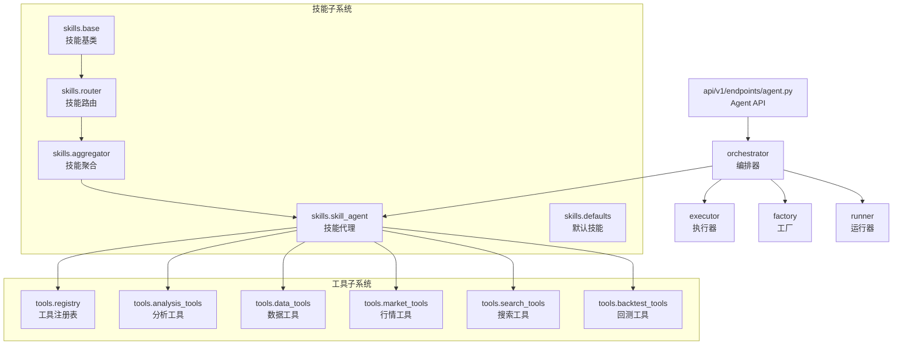
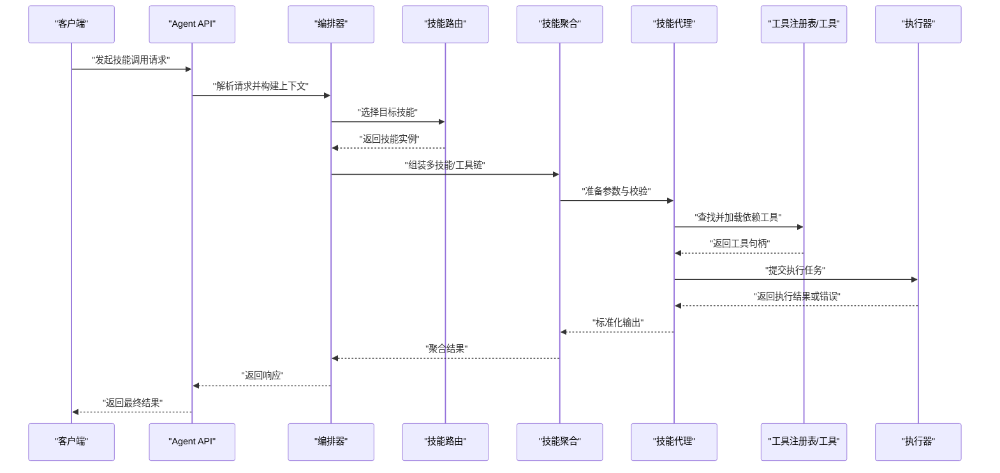
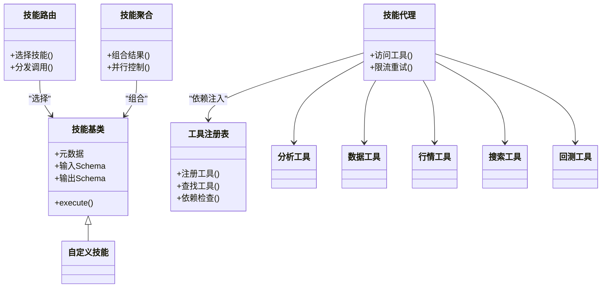

# 自定义技能开发

<cite>
**本文引用的文件**   
- [src/agent/skills/base.py](file://src/agent/skills/base.py)
- [src/agent/skills/router.py](file://src/agent/skills/router.py)
- [src/agent/skills/aggregator.py](file://src/agent/skills/aggregator.py)
- [src/agent/skills/skill_agent.py](file://src/agent/skills/skill_agent.py)
- [src/agent/skills/defaults.py](file://src/agent/skills/defaults.py)
- [src/agent/tools/registry.py](file://src/agent/tools/registry.py)
- [src/agent/tools/analysis_tools.py](file://src/agent/tools/analysis_tools.py)
- [src/agent/tools/data_tools.py](file://src/agent/tools/data_tools.py)
- [src/agent/tools/market_tools.py](file://src/agent/tools/market_tools.py)
- [src/agent/tools/search_tools.py](file://src/agent/tools/search_tools.py)
- [src/agent/tools/backtest_tools.py](file://src/agent/tools/backtest_tools.py)
- [src/agent/orchestrator.py](file://src/agent/orchestrator.py)
- [src/agent/executor.py](file://src/agent/executor.py)
- [src/agent/factory.py](file://src/agent/factory.py)
- [src/agent/runner.py](file://src/agent/runner.py)
- [api/v1/endpoints/agent.py](file://api/v1/endpoints/agent.py)
- [tests/test_skill_load_warning.py](file://tests/test_skill_load_warning.py)
</cite>

## 目录
1. [简介](#简介)
2. [项目结构](#项目结构)
3. [核心组件](#核心组件)
4. [架构总览](#架构总览)
5. [详细组件分析](#详细组件分析)
6. [依赖分析](#依赖分析)
7. [性能考虑](#性能考虑)
8. [故障排查指南](#故障排查指南)
9. [结论](#结论)
10. [附录](#附录)

## 简介
本文件面向希望在本项目中扩展“自定义技能”的开发者，提供从设计到落地的完整指南。内容涵盖：
- 如何创建自定义技能类、继承基类并实现必要方法
- 技能元数据定义、参数校验与错误处理规范
- 技能注册机制与依赖管理
- 从简单工具到复杂业务逻辑的示例路径
- 测试方法、调试技巧与性能优化建议

## 项目结构
技能系统位于 agent 子系统中，围绕“技能基类—路由器—聚合器—执行器—编排器”的分层组织展开；工具子系统提供可复用的能力（数据分析、行情、搜索、回测等），并通过统一注册表暴露给技能使用。

图表来源
- [src/agent/skills/base.py](file://src/agent/skills/base.py)
- [src/agent/skills/router.py](file://src/agent/skills/router.py)
- [src/agent/skills/aggregator.py](file://src/agent/skills/aggregator.py)
- [src/agent/skills/skill_agent.py](file://src/agent/skills/skill_agent.py)
- [src/agent/skills/defaults.py](file://src/agent/skills/defaults.py)
- [src/agent/tools/registry.py](file://src/agent/tools/registry.py)
- [src/agent/tools/analysis_tools.py](file://src/agent/tools/analysis_tools.py)
- [src/agent/tools/data_tools.py](file://src/agent/tools/data_tools.py)
- [src/agent/tools/market_tools.py](file://src/agent/tools/market_tools.py)
- [src/agent/tools/search_tools.py](file://src/agent/tools/search_tools.py)
- [src/agent/tools/backtest_tools.py](file://src/agent/tools/backtest_tools.py)
- [src/agent/orchestrator.py](file://src/agent/orchestrator.py)
- [src/agent/executor.py](file://src/agent/executor.py)
- [src/agent/factory.py](file://src/agent/factory.py)
- [src/agent/runner.py](file://src/agent/runner.py)
- [api/v1/endpoints/agent.py](file://api/v1/endpoints/agent.py)

章节来源
- [src/agent/skills/base.py](file://src/agent/skills/base.py)
- [src/agent/skills/router.py](file://src/agent/skills/router.py)
- [src/agent/skills/aggregator.py](file://src/agent/skills/aggregator.py)
- [src/agent/skills/skill_agent.py](file://src/agent/skills/skill_agent.py)
- [src/agent/tools/registry.py](file://src/agent/tools/registry.py)
- [src/agent/orchestrator.py](file://src/agent/orchestrator.py)
- [api/v1/endpoints/agent.py](file://api/v1/endpoints/agent.py)

## 核心组件
- 技能基类：定义技能的元数据、输入输出契约、参数校验与错误处理模板，以及统一的执行接口。
- 技能路由：根据请求上下文或策略将调用分发到具体技能实例。
- 技能聚合：组合多个技能或工具的调用结果，形成复合能力。
- 技能代理：封装对底层工具的访问，提供权限、限流、重试等横切关注点。
- 默认技能：内置常用技能实现，供快速集成与参考。
- 工具注册表：集中管理工具的生命周期、版本与依赖声明。
- 编排器/执行器/工厂/运行器：负责调度、资源管理与生命周期控制。

章节来源
- [src/agent/skills/base.py](file://src/agent/skills/base.py)
- [src/agent/skills/router.py](file://src/agent/skills/router.py)
- [src/agent/skills/aggregator.py](file://src/agent/skills/aggregator.py)
- [src/agent/skills/skill_agent.py](file://src/agent/skills/skill_agent.py)
- [src/agent/skills/defaults.py](file://src/agent/skills/defaults.py)
- [src/agent/tools/registry.py](file://src/agent/tools/registry.py)
- [src/agent/orchestrator.py](file://src/agent/orchestrator.py)
- [src/agent/executor.py](file://src/agent/executor.py)
- [src/agent/factory.py](file://src/agent/factory.py)
- [src/agent/runner.py](file://src/agent/runner.py)

## 架构总览
下图展示了从 API 入口到技能执行的端到端流程，包括路由、聚合、工具调用与异常处理。

图表来源
- [api/v1/endpoints/agent.py](file://api/v1/endpoints/agent.py)
- [src/agent/orchestrator.py](file://src/agent/orchestrator.py)
- [src/agent/skills/router.py](file://src/agent/skills/router.py)
- [src/agent/skills/aggregator.py](file://src/agent/skills/aggregator.py)
- [src/agent/skills/skill_agent.py](file://src/agent/skills/skill_agent.py)
- [src/agent/tools/registry.py](file://src/agent/tools/registry.py)
- [src/agent/executor.py](file://src/agent/executor.py)

## 详细组件分析

### 技能基类与元数据
- 职责
  - 定义技能的名称、描述、版本、作者等元数据字段
  - 定义输入参数的 Schema 与校验规则
  - 定义输出数据结构与序列化格式
  - 提供统一的 execute 接口与错误处理模板
- 关键要点
  - 元数据应包含唯一标识与版本，便于路由与兼容性检查
  - 参数校验应在进入 execute 前完成，失败时抛出明确的错误类型
  - 错误处理需区分参数错误、运行时错误与外部依赖错误，便于上层捕获与降级

章节来源
- [src/agent/skills/base.py](file://src/agent/skills/base.py)

### 技能路由与聚合
- 路由
  - 基于请求上下文（如用户意图、市场阶段、股票范围）选择合适技能
  - 支持按优先级、权重或条件分支进行动态选择
- 聚合
  - 将多个技能或工具的结果合并为统一视图
  - 支持并行调用与超时控制，保证整体 SLA

章节来源
- [src/agent/skills/router.py](file://src/agent/skills/router.py)
- [src/agent/skills/aggregator.py](file://src/agent/skills/aggregator.py)

### 技能代理与工具访问
- 职责
  - 封装对工具注册表的访问，提供依赖注入与懒加载
  - 统一管理权限、限流、重试、熔断等横切逻辑
  - 将工具调用结果标准化为技能输出格式
- 关键点
  - 工具依赖声明应显式表达，避免隐式耦合
  - 对第三方服务调用需具备超时与重试策略

章节来源
- [src/agent/skills/skill_agent.py](file://src/agent/skills/skill_agent.py)
- [src/agent/tools/registry.py](file://src/agent/tools/registry.py)

### 默认技能与示例
- 默认技能提供了常见场景的实现范式，可作为自定义技能的参考模板
- 典型场景包括：基础指标计算、历史数据拉取、新闻摘要、回测执行等

章节来源
- [src/agent/skills/defaults.py](file://src/agent/skills/defaults.py)

### 工具子系统与注册表
- 工具分类
  - 分析工具：技术指标、因子计算、信号生成
  - 数据工具：历史行情、基本面、资金流向
  - 行情工具：实时报价、指数、板块
  - 搜索工具：新闻、公告、研报检索
  - 回测工具：策略回测、绩效评估、报告生成
- 注册表
  - 维护工具清单、版本、依赖关系与可用性状态
  - 提供按需加载与缓存机制

章节来源
- [src/agent/tools/analysis_tools.py](file://src/agent/tools/analysis_tools.py)
- [src/agent/tools/data_tools.py](file://src/agent/tools/data_tools.py)
- [src/agent/tools/market_tools.py](file://src/agent/tools/market_tools.py)
- [src/agent/tools/search_tools.py](file://src/agent/tools/search_tools.py)
- [src/agent/tools/backtest_tools.py](file://src/agent/tools/backtest_tools.py)
- [src/agent/tools/registry.py](file://src/agent/tools/registry.py)

### 编排器、执行器、工厂与运行器
- 编排器
  - 协调技能与工具的生命周期，管理上下文与资源
- 执行器
  - 负责并发控制、任务队列、超时与重试
- 工厂
  - 根据配置与依赖创建技能与工具实例
- 运行器
  - 驱动整个流程的执行与监控

章节来源
- [src/agent/orchestrator.py](file://src/agent/orchestrator.py)
- [src/agent/executor.py](file://src/agent/executor.py)
- [src/agent/factory.py](file://src/agent/factory.py)
- [src/agent/runner.py](file://src/agent/runner.py)

### 自定义技能开发步骤
- 步骤概览
  - 继承技能基类，定义元数据与输入输出契约
  - 实现参数校验与错误处理
  - 通过技能代理访问所需工具
  - 在路由中注册新技能，或在聚合器中组合现有技能
  - 编写单元测试与集成测试，覆盖正常与异常路径
- 最佳实践
  - 保持单一职责，避免在一个技能中做过多无关逻辑
  - 明确依赖声明，减少隐式耦合
  - 对耗时操作设置超时与重试，提升鲁棒性

章节来源
- [src/agent/skills/base.py](file://src/agent/skills/base.py)
- [src/agent/skills/router.py](file://src/agent/skills/router.py)
- [src/agent/skills/aggregator.py](file://src/agent/skills/aggregator.py)
- [src/agent/skills/skill_agent.py](file://src/agent/skills/skill_agent.py)
- [src/agent/tools/registry.py](file://src/agent/tools/registry.py)

### 技能注册机制与依赖管理
- 注册
  - 在工具注册表中声明技能与工具的名称、版本、依赖与可用状态
  - 支持热更新与灰度发布
- 依赖管理
  - 显式声明工具依赖，确保加载顺序正确
  - 对缺失依赖给出清晰错误提示与降级方案

章节来源
- [src/agent/tools/registry.py](file://src/agent/tools/registry.py)

### API 集成与调用流程
- 入口
  - 通过 Agent API 接收请求，解析上下文并交由编排器处理
- 流程
  - 路由选择技能 → 聚合器组合 → 技能代理调用工具 → 执行器执行 → 返回结果

章节来源
- [api/v1/endpoints/agent.py](file://api/v1/endpoints/agent.py)
- [src/agent/orchestrator.py](file://src/agent/orchestrator.py)

## 依赖分析
技能与工具之间的依赖关系如下所示，强调显式声明与最小化耦合。

图表来源
- [src/agent/skills/base.py](file://src/agent/skills/base.py)
- [src/agent/skills/router.py](file://src/agent/skills/router.py)
- [src/agent/skills/aggregator.py](file://src/agent/skills/aggregator.py)
- [src/agent/skills/skill_agent.py](file://src/agent/skills/skill_agent.py)
- [src/agent/tools/registry.py](file://src/agent/tools/registry.py)
- [src/agent/tools/analysis_tools.py](file://src/agent/tools/analysis_tools.py)
- [src/agent/tools/data_tools.py](file://src/agent/tools/data_tools.py)
- [src/agent/tools/market_tools.py](file://src/agent/tools/market_tools.py)
- [src/agent/tools/search_tools.py](file://src/agent/tools/search_tools.py)
- [src/agent/tools/backtest_tools.py](file://src/agent/tools/backtest_tools.py)

章节来源
- [src/agent/skills/base.py](file://src/agent/skills/base.py)
- [src/agent/skills/router.py](file://src/agent/skills/router.py)
- [src/agent/skills/aggregator.py](file://src/agent/skills/aggregator.py)
- [src/agent/skills/skill_agent.py](file://src/agent/skills/skill_agent.py)
- [src/agent/tools/registry.py](file://src/agent/tools/registry.py)

## 性能考虑
- 并发与超时
  - 对 I/O 密集的工具调用采用并发与超时控制，避免阻塞
- 缓存与预取
  - 对热点数据（如指数、热门股）进行缓存与预取，降低延迟
- 幂等与重试
  - 对外部服务调用实现幂等与重试，提高稳定性
- 资源隔离
  - 不同技能与工具之间进行资源隔离，防止相互影响
- 监控与度量
  - 记录关键指标（QPS、延迟、错误率），便于定位瓶颈

[本节为通用指导，不直接分析具体文件]

## 故障排查指南
- 常见问题
  - 技能未注册或版本不匹配导致路由失败
  - 工具依赖缺失或服务不可用导致调用失败
  - 参数校验失败导致请求被拒绝
- 排查步骤
  - 检查技能与工具的注册状态与版本
  - 查看日志中的错误类型与堆栈信息
  - 使用最小化用例复现问题，逐步缩小范围
- 调试技巧
  - 启用详细日志与追踪，记录关键节点耗时
  - 使用沙箱环境隔离外部依赖，便于本地验证

章节来源
- [tests/test_skill_load_warning.py](file://tests/test_skill_load_warning.py)

## 结论
通过遵循本指南，开发者可以高效地创建、注册与集成自定义技能，充分利用工具子系统的能力，构建稳定、可扩展的技能生态。建议在开发过程中严格遵循元数据定义、参数校验与错误处理规范，并结合测试与监控手段保障质量与性能。

[本节为总结性内容，不直接分析具体文件]

## 附录
- 示例路径
  - 简单工具型技能：参考默认技能中的基础指标计算实现
  - 复杂业务逻辑技能：结合多个工具进行数据拉取、分析与报告生成
- 参考文件
  - 技能基类与默认实现：用于理解契约与范式
  - 工具注册表与各工具模块：用于依赖管理与能力复用
  - 编排器与执行器：用于理解调度与执行模型

[本节为补充说明，不直接分析具体文件]