# 智能体架构设计

<cite>
**本文引用的文件**   
- [src/agent/orchestrator.py](file://src/agent/orchestrator.py)
- [src/agent/factory.py](file://src/agent/factory.py)
- [src/agent/conversation.py](file://src/agent/conversation.py)
- [src/agent/chat_context.py](file://src/agent/chat_context.py)
- [src/agent/memory.py](file://src/agent/memory.py)
- [src/agent/events.py](file://src/agent/events.py)
- [src/agent/executor.py](file://src/agent/executor.py)
- [src/agent/runner.py](file://src/agent/runner.py)
- [src/agent/llm_adapter.py](file://src/agent/llm_adapter.py)
- [src/agent/provider_trace.py](file://src/agent/provider_trace.py)
- [src/agent/protocols.py](file://src/agent/protocols.py)
- [src/agent/agents/base_agent.py](file://src/agent/agents/base_agent.py)
- [src/agent/agents/intel_agent.py](file://src/agent/agents/intel_agent.py)
- [src/agent/agents/technical_agent.py](file://src/agent/agents/technical_agent.py)
- [src/agent/agents/risk_agent.py](file://src/agent/agents/risk_agent.py)
- [src/agent/agents/portfolio_agent.py](file://src/agent/agents/portfolio_agent.py)
- [src/agent/agents/decision_agent.py](file://src/agent/agents/decision_agent.py)
- [src/agent/skills/router.py](file://src/agent/skills/router.py)
- [src/agent/skills/aggregator.py](file://src/agent/skills/aggregator.py)
- [src/agent/skills/skill_agent.py](file://src/agent/skills/skill_agent.py)
- [src/agent/strategies/router.py](file://src/agent/strategies/router.py)
- [src/agent/strategies/aggregator.py](file://src/agent/strategies/aggregator.py)
- [src/agent/strategies/strategy_agent.py](file://src/agent/strategies/strategy_agent.py)
- [src/agent/tools/registry.py](file://src/agent/tools/registry.py)
- [src/agent/tools/data_tools.py](file://src/agent/tools/data_tools.py)
- [src/agent/tools/market_tools.py](file://src/agent/tools/market_tools.py)
- [src/agent/tools/analysis_tools.py](file://src/agent/tools/analysis_tools.py)
- [src/agent/tools/backtest_tools.py](file://src/agent/tools/backtest_tools.py)
- [src/agent/tools/search_tools.py](file://src/agent/tools/search_tools.py)
- [api/v1/endpoints/agent.py](file://api/v1/endpoints/agent.py)
- [api/app.py](file://api/app.py)
- [main.py](file://main.py)
- [server.py](file://server.py)
</cite>

## 目录
1. [简介](#简介)
2. [项目结构](#项目结构)
3. [核心组件](#核心组件)
4. [架构总览](#架构总览)
5. [详细组件分析](#详细组件分析)
6. [依赖关系分析](#依赖关系分析)
7. [性能考量](#性能考量)
8. [故障排查指南](#故障排查指南)
9. [结论](#结论)
10. [附录](#附录)

## 简介
本文件面向多智能体系统的架构设计与实现，重点阐述以下方面：
- 整体架构模式：编排器、工厂模式与对话管理器的职责与协作
- 智能体生命周期管理、注册机制与调度算法
- 智能体间通信协议、消息传递机制与状态同步策略
- 扩展点设计与插件机制（技能、策略、工具）
- 架构图与数据流图，帮助理解各组件交互

该文档既适合具备工程背景的读者快速定位关键模块，也适合非技术读者通过图示与分层说明理解系统行为。

## 项目结构
仓库采用“领域分层 + 功能域”组织方式：
- src/agent：智能体核心（编排、工厂、对话、记忆、事件、执行、运行器等）
- src/agent/agents：具体智能体（情报、技术、风险、组合、决策等）
- src/agent/skills：技能路由与聚合，支持按能力编排
- src/agent/strategies：策略路由与聚合，支持策略级编排
- src/agent/tools：工具注册与调用（数据、行情、分析、回测、搜索）
- api：HTTP API 层，暴露智能体相关接口
- main/server：应用启动与进程入口

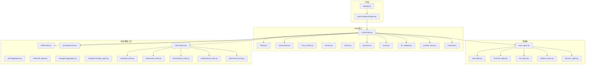

图表来源
- [api/app.py](file://api/app.py)
- [api/v1/endpoints/agent.py](file://api/v1/endpoints/agent.py)
- [src/agent/orchestrator.py](file://src/agent/orchestrator.py)
- [src/agent/factory.py](file://src/agent/factory.py)
- [src/agent/conversation.py](file://src/agent/conversation.py)
- [src/agent/executor.py](file://src/agent/executor.py)
- [src/agent/runner.py](file://src/agent/runner.py)
- [src/agent/llm_adapter.py](file://src/agent/llm_adapter.py)
- [src/agent/provider_trace.py](file://src/agent/provider_trace.py)
- [src/agent/protocols.py](file://src/agent/protocols.py)
- [src/agent/agents/base_agent.py](file://src/agent/agents/base_agent.py)
- [src/agent/agents/intel_agent.py](file://src/agent/agents/intel_agent.py)
- [src/agent/agents/technical_agent.py](file://src/agent/agents/technical_agent.py)
- [src/agent/agents/risk_agent.py](file://src/agent/agents/risk_agent.py)
- [src/agent/agents/portfolio_agent.py](file://src/agent/agents/portfolio_agent.py)
- [src/agent/agents/decision_agent.py](file://src/agent/agents/decision_agent.py)
- [src/agent/skills/router.py](file://src/agent/skills/router.py)
- [src/agent/skills/aggregator.py](file://src/agent/skills/aggregator.py)
- [src/agent/skills/skill_agent.py](file://src/agent/skills/skill_agent.py)
- [src/agent/strategies/router.py](file://src/agent/strategies/router.py)
- [src/agent/strategies/aggregator.py](file://src/agent/strategies/aggregator.py)
- [src/agent/strategies/strategy_agent.py](file://src/agent/strategies/strategy_agent.py)
- [src/agent/tools/registry.py](file://src/agent/tools/registry.py)
- [src/agent/tools/data_tools.py](file://src/agent/tools/data_tools.py)
- [src/agent/tools/market_tools.py](file://src/agent/tools/market_tools.py)
- [src/agent/tools/analysis_tools.py](file://src/agent/tools/analysis_tools.py)
- [src/agent/tools/backtest_tools.py](file://src/agent/tools/backtest_tools.py)
- [src/agent/tools/search_tools.py](file://src/agent/tools/search_tools.py)

章节来源
- [main.py](file://main.py)
- [server.py](file://server.py)
- [api/app.py](file://api/app.py)
- [api/v1/endpoints/agent.py](file://api/v1/endpoints/agent.py)

## 核心组件
- 编排器（Orchestrator）：负责请求接入、意图识别、任务分解、智能体选择与编排、结果聚合与输出
- 工厂（Factory）：统一创建与管理智能体实例，支持按需加载、缓存与生命周期控制
- 对话管理器（Conversation）：会话上下文、历史维护、状态持久化与恢复
- 执行器（Executor）：并发调度、超时控制、重试与熔断
- 运行器（Runner）：流程编排、阶段推进、事件驱动的执行管线
- LLM适配器（LLM Adapter）：模型调用抽象、参数标准化、追踪与用量统计
- 事件总线（Events）：异步事件发布/订阅，解耦组件间通信
- 协议（Protocols）：定义智能体、技能、策略、工具的接口契约

章节来源
- [src/agent/orchestrator.py](file://src/agent/orchestrator.py)
- [src/agent/factory.py](file://src/agent/factory.py)
- [src/agent/conversation.py](file://src/agent/conversation.py)
- [src/agent/executor.py](file://src/agent/executor.py)
- [src/agent/runner.py](file://src/agent/runner.py)
- [src/agent/llm_adapter.py](file://src/agent/llm_adapter.py)
- [src/agent/events.py](file://src/agent/events.py)
- [src/agent/protocols.py](file://src/agent/protocols.py)

## 架构总览
下图展示从HTTP请求到智能体执行与结果返回的端到端流程，以及编排器如何协调工厂、对话、执行器与LLM适配器。

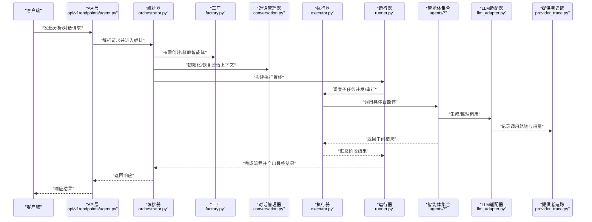

图表来源
- [api/v1/endpoints/agent.py](file://api/v1/endpoints/agent.py)
- [src/agent/orchestrator.py](file://src/agent/orchestrator.py)
- [src/agent/factory.py](file://src/agent/factory.py)
- [src/agent/conversation.py](file://src/agent/conversation.py)
- [src/agent/executor.py](file://src/agent/executor.py)
- [src/agent/runner.py](file://src/agent/runner.py)
- [src/agent/llm_adapter.py](file://src/agent/llm_adapter.py)
- [src/agent/provider_trace.py](file://src/agent/provider_trace.py)

## 详细组件分析

### 编排器（Orchestrator）
- 职责：接收外部请求，进行意图识别与任务分解；选择并编排合适的智能体；管理执行顺序与资源；聚合结果并返回
- 关键点：
  - 与工厂协作，按需创建或复用智能体实例
  - 与对话管理器协作，维护会话上下文与历史
  - 与执行器协作，处理并发、超时、重试
  - 与运行器协作，定义阶段式执行流程
  - 与LLM适配器协作，统一模型调用与追踪

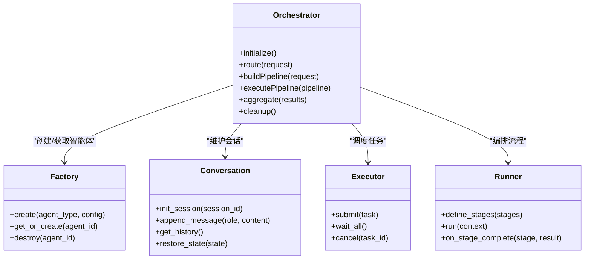

图表来源
- [src/agent/orchestrator.py](file://src/agent/orchestrator.py)
- [src/agent/factory.py](file://src/agent/factory.py)
- [src/agent/conversation.py](file://src/agent/conversation.py)
- [src/agent/executor.py](file://src/agent/executor.py)
- [src/agent/runner.py](file://src/agent/runner.py)

章节来源
- [src/agent/orchestrator.py](file://src/agent/orchestrator.py)

### 工厂模式（Factory）
- 职责：统一管理智能体的创建、缓存、销毁与配置注入
- 关键点：
  - 支持按类型与ID创建实例，避免重复开销
  - 提供生命周期钩子（初始化、预热、清理）
  - 与配置中心集成，动态更新智能体参数

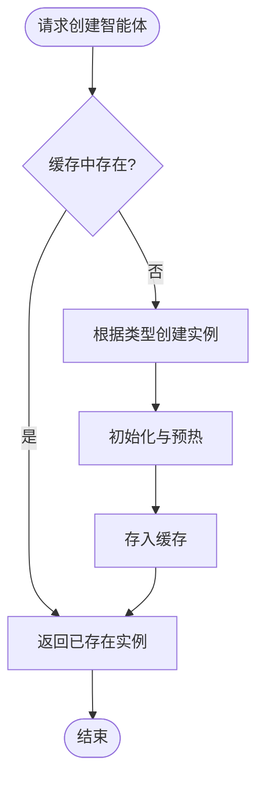

图表来源
- [src/agent/factory.py](file://src/agent/factory.py)

章节来源
- [src/agent/factory.py](file://src/agent/factory.py)

### 对话管理器（Conversation）
- 职责：会话上下文管理、消息历史维护、状态持久化与恢复
- 关键点：
  - 支持多会话隔离与会话迁移
  - 提供增量追加与快照机制，便于回溯
  - 与内存模块协作，实现轻量级状态存储

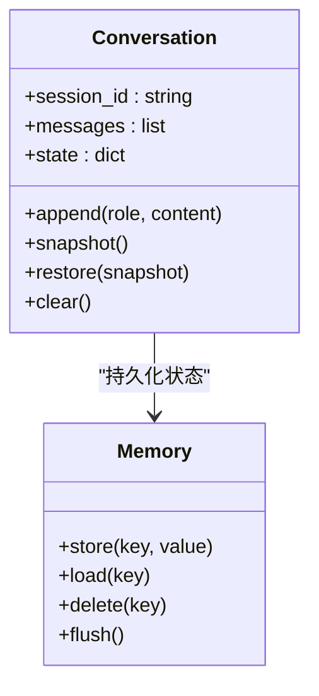

图表来源
- [src/agent/conversation.py](file://src/agent/conversation.py)
- [src/agent/memory.py](file://src/agent/memory.py)

章节来源
- [src/agent/conversation.py](file://src/agent/conversation.py)
- [src/agent/memory.py](file://src/agent/memory.py)

### 执行器与运行器（Executor & Runner）
- 执行器：负责任务提交、并发控制、超时与重试
- 运行器：定义阶段式流程，支持条件分支与回调
- 关键点：
  - 执行器支持队列与优先级，保障高负载下的稳定性
  - 运行器支持阶段间数据共享与错误传播

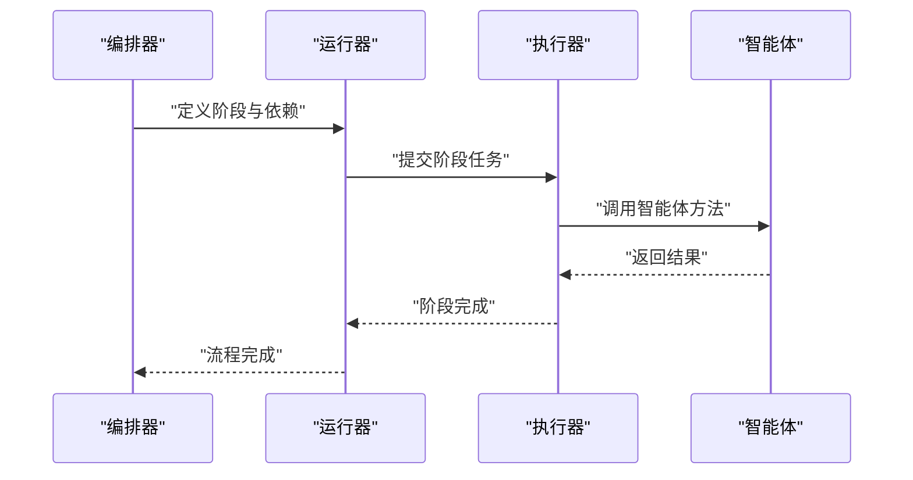

图表来源
- [src/agent/executor.py](file://src/agent/executor.py)
- [src/agent/runner.py](file://src/agent/runner.py)

章节来源
- [src/agent/executor.py](file://src/agent/executor.py)
- [src/agent/runner.py](file://src/agent/runner.py)

### LLM适配器与提供者追踪（LLM Adapter & Provider Trace）
- LLM适配器：统一模型调用接口，标准化参数与响应格式
- 提供者追踪：记录每次调用的提供者、模型、耗时、Token用量与错误信息
- 关键点：
  - 支持多提供者切换与降级
  - 提供可观测性指标，便于监控与成本分析

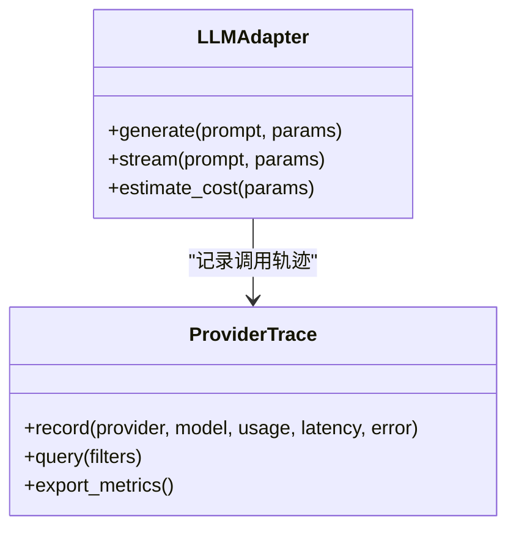

图表来源
- [src/agent/llm_adapter.py](file://src/agent/llm_adapter.py)
- [src/agent/provider_trace.py](file://src/agent/provider_trace.py)

章节来源
- [src/agent/llm_adapter.py](file://src/agent/llm_adapter.py)
- [src/agent/provider_trace.py](file://src/agent/provider_trace.py)

### 智能体基类与具体智能体（Base Agent & Specialized Agents）
- 基类：定义智能体通用接口（输入校验、工具调用、结果格式化）
- 具体智能体：情报、技术、风险、组合、决策等，各自专注特定领域
- 关键点：
  - 通过协议约束确保一致性
  - 支持工具链注入与动态扩展

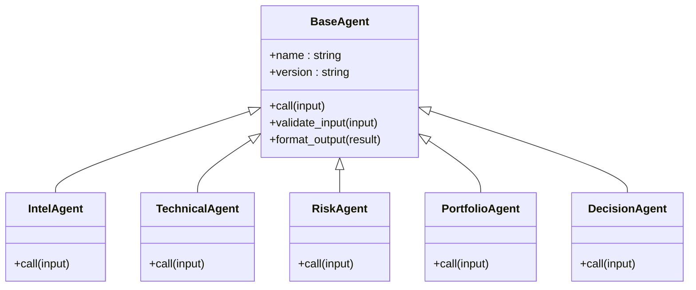

图表来源
- [src/agent/agents/base_agent.py](file://src/agent/agents/base_agent.py)
- [src/agent/agents/intel_agent.py](file://src/agent/agents/intel_agent.py)
- [src/agent/agents/technical_agent.py](file://src/agent/agents/technical_agent.py)
- [src/agent/agents/risk_agent.py](file://src/agent/agents/risk_agent.py)
- [src/agent/agents/portfolio_agent.py](file://src/agent/agents/portfolio_agent.py)
- [src/agent/agents/decision_agent.py](file://src/agent/agents/decision_agent.py)

章节来源
- [src/agent/agents/base_agent.py](file://src/agent/agents/base_agent.py)
- [src/agent/agents/intel_agent.py](file://src/agent/agents/intel_agent.py)
- [src/agent/agents/technical_agent.py](file://src/agent/agents/technical_agent.py)
- [src/agent/agents/risk_agent.py](file://src/agent/agents/risk_agent.py)
- [src/agent/agents/portfolio_agent.py](file://src/agent/agents/portfolio_agent.py)
- [src/agent/agents/decision_agent.py](file://src/agent/agents/decision_agent.py)

### 技能与策略编排（Skills & Strategies）
- 技能路由：按能力维度分发任务，支持聚合与并行
- 策略路由：按策略维度编排，支持组合与权重投票
- 关键点：
  - 技能与策略均遵循协议，便于替换与扩展
  - 聚合器支持多种合并策略（加权、投票、阈值）

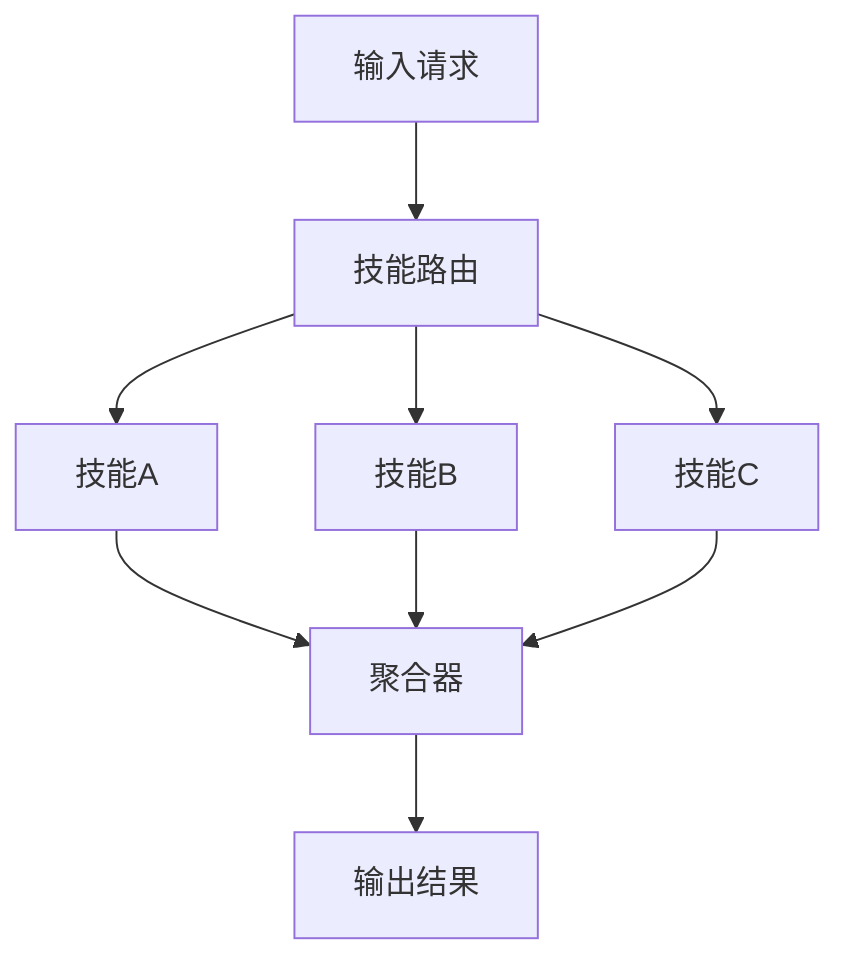

图表来源
- [src/agent/skills/router.py](file://src/agent/skills/router.py)
- [src/agent/skills/aggregator.py](file://src/agent/skills/aggregator.py)
- [src/agent/skills/skill_agent.py](file://src/agent/skills/skill_agent.py)
- [src/agent/strategies/router.py](file://src/agent/strategies/router.py)
- [src/agent/strategies/aggregator.py](file://src/agent/strategies/aggregator.py)
- [src/agent/strategies/strategy_agent.py](file://src/agent/strategies/strategy_agent.py)

章节来源
- [src/agent/skills/router.py](file://src/agent/skills/router.py)
- [src/agent/skills/aggregator.py](file://src/agent/skills/aggregator.py)
- [src/agent/skills/skill_agent.py](file://src/agent/skills/skill_agent.py)
- [src/agent/strategies/router.py](file://src/agent/strategies/router.py)
- [src/agent/strategies/aggregator.py](file://src/agent/strategies/aggregator.py)
- [src/agent/strategies/strategy_agent.py](file://src/agent/strategies/strategy_agent.py)

### 工具注册与调用（Tools Registry）
- 工具注册表：集中管理可用工具，支持版本与元数据
- 工具实现：数据、行情、分析、回测、搜索等
- 关键点：
  - 通过装饰器或注册函数自动发现与挂载
  - 支持权限控制与限流

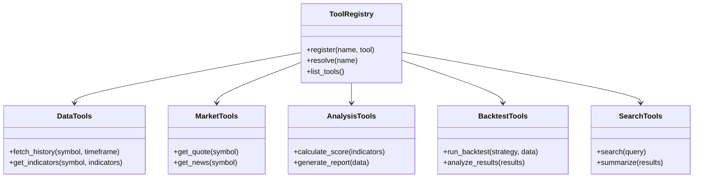

图表来源
- [src/agent/tools/registry.py](file://src/agent/tools/registry.py)
- [src/agent/tools/data_tools.py](file://src/agent/tools/data_tools.py)
- [src/agent/tools/market_tools.py](file://src/agent/tools/market_tools.py)
- [src/agent/tools/analysis_tools.py](file://src/agent/tools/analysis_tools.py)
- [src/agent/tools/backtest_tools.py](file://src/agent/tools/backtest_tools.py)
- [src/agent/tools/search_tools.py](file://src/agent/tools/search_tools.py)

章节来源
- [src/agent/tools/registry.py](file://src/agent/tools/registry.py)
- [src/agent/tools/data_tools.py](file://src/agent/tools/data_tools.py)
- [src/agent/tools/market_tools.py](file://src/agent/tools/market_tools.py)
- [src/agent/tools/analysis_tools.py](file://src/agent/tools/analysis_tools.py)
- [src/agent/tools/backtest_tools.py](file://src/agent/tools/backtest_tools.py)
- [src/agent/tools/search_tools.py](file://src/agent/tools/search_tools.py)

### 通信协议与消息传递（Protocols & Events）
- 协议：定义智能体、技能、策略、工具的输入输出规范
- 事件：基于发布/订阅的消息机制，支持异步与解耦
- 关键点：
  - 事件包含类型、载荷、时间戳与来源
  - 支持过滤与路由，便于细粒度控制

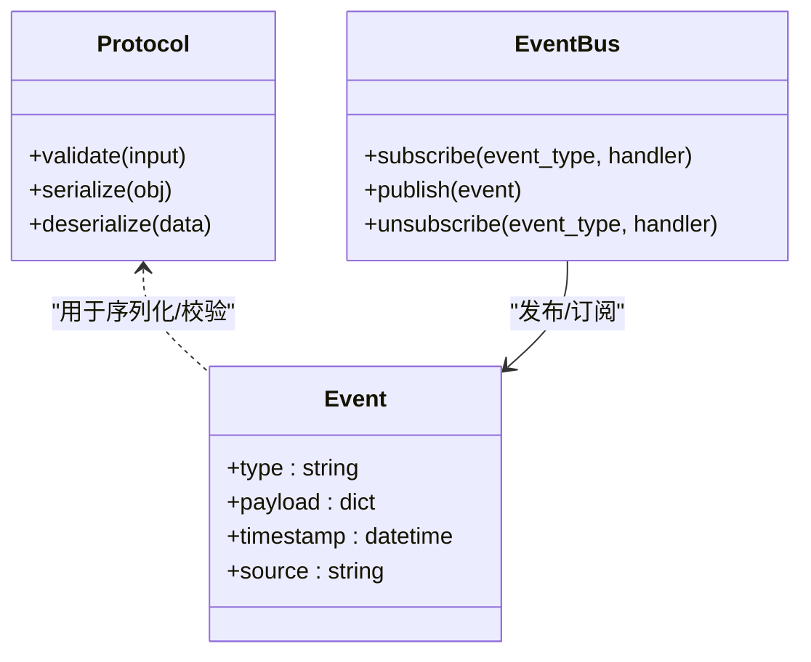

图表来源
- [src/agent/protocols.py](file://src/agent/protocols.py)
- [src/agent/events.py](file://src/agent/events.py)

章节来源
- [src/agent/protocols.py](file://src/agent/protocols.py)
- [src/agent/events.py](file://src/agent/events.py)

## 依赖关系分析
- 编排器依赖工厂、对话、执行器、运行器、LLM适配器与提供者追踪
- 智能体依赖工具注册表与协议
- 技能与策略通过路由与聚合器协同工作
- API层仅与编排器交互，保持边界清晰

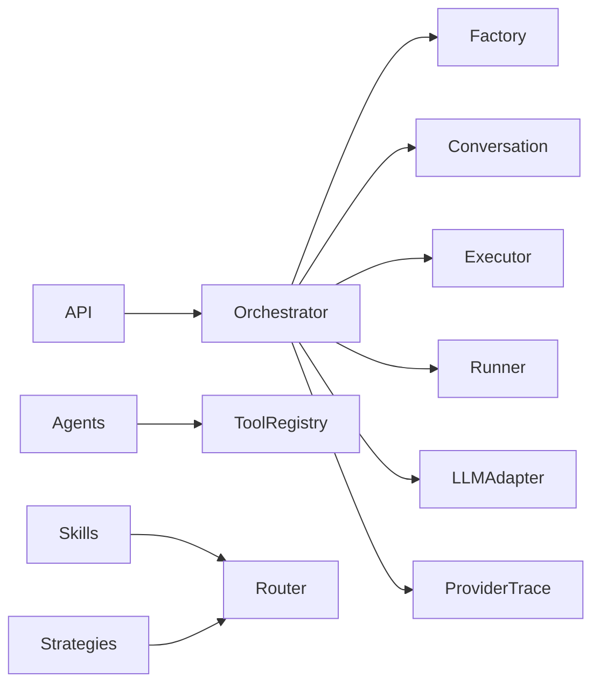

图表来源
- [src/agent/orchestrator.py](file://src/agent/orchestrator.py)
- [src/agent/factory.py](file://src/agent/factory.py)
- [src/agent/conversation.py](file://src/agent/conversation.py)
- [src/agent/executor.py](file://src/agent/executor.py)
- [src/agent/runner.py](file://src/agent/runner.py)
- [src/agent/llm_adapter.py](file://src/agent/llm_adapter.py)
- [src/agent/provider_trace.py](file://src/agent/provider_trace.py)
- [src/agent/tools/registry.py](file://src/agent/tools/registry.py)
- [src/agent/skills/router.py](file://src/agent/skills/router.py)
- [src/agent/strategies/router.py](file://src/agent/strategies/router.py)
- [api/v1/endpoints/agent.py](file://api/v1/endpoints/agent.py)

章节来源
- [api/v1/endpoints/agent.py](file://api/v1/endpoints/agent.py)
- [src/agent/orchestrator.py](file://src/agent/orchestrator.py)

## 性能考量
- 并发与批处理：执行器支持任务队列与优先级，合理设置并发度以避免过载
- 缓存与复用：工厂对智能体实例进行缓存，减少创建开销
- 流式输出：LLM适配器支持流式响应，提升用户体验
- 资源隔离：会话与状态隔离，避免相互干扰
- 监控与追踪：提供者追踪记录关键指标，便于容量规划与成本优化

[本节为通用指导，不直接分析具体文件]

## 故障排查指南
- 常见问题：
  - 智能体创建失败：检查工厂配置与依赖注入
  - 对话状态丢失：确认会话ID一致性与持久化配置
  - 工具调用异常：查看工具注册表与权限设置
  - LLM调用失败：检查提供者配置与网络连通性
- 诊断步骤：
  - 启用提供者追踪，定位调用链问题
  - 使用事件日志，分析异步任务执行情况
  - 检查执行器队列长度与超时设置

章节来源
- [src/agent/provider_trace.py](file://src/agent/provider_trace.py)
- [src/agent/events.py](file://src/agent/events.py)
- [src/agent/executor.py](file://src/agent/executor.py)

## 结论
本架构通过编排器、工厂与对话管理器形成清晰的职责边界，结合执行器与运行器实现灵活的任务编排与并发控制。技能、策略与工具的插件化设计使得系统具备良好的可扩展性。通过协议与事件机制，组件间松耦合且易于测试与维护。建议在生产环境中加强监控与限流，确保高可用与稳定运行。

[本节为总结性内容，不直接分析具体文件]

## 附录
- 扩展点设计：
  - 新增智能体：继承基类并实现必要接口，通过工厂注册
  - 新增技能/策略：实现协议并通过路由注册
  - 新增工具：实现工具接口并通过注册表挂载
- 最佳实践：
  - 使用会话快照进行状态备份
  - 对长耗时任务使用异步与重试
  - 对敏感操作增加权限校验

[本节为补充说明，不直接分析具体文件]