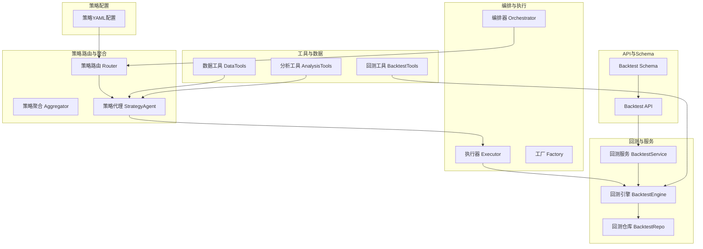
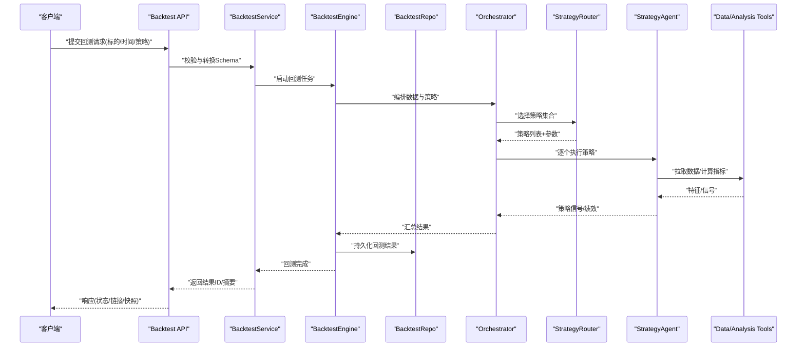
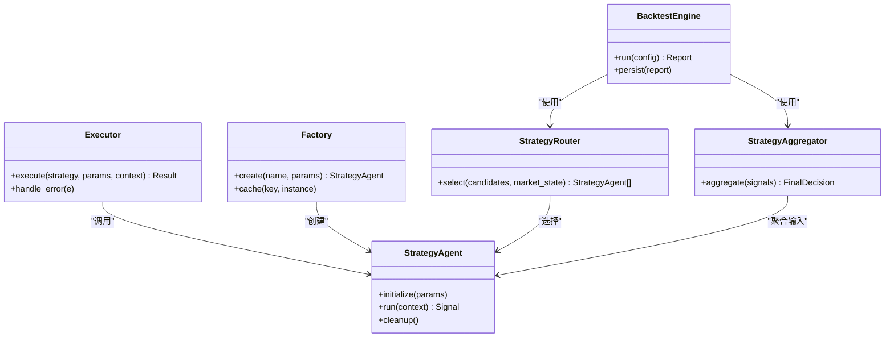
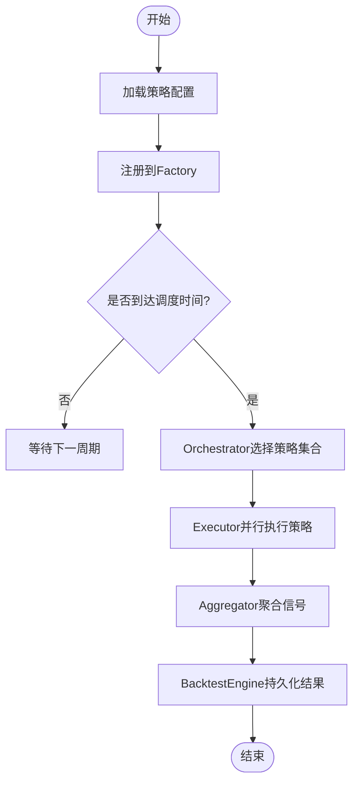
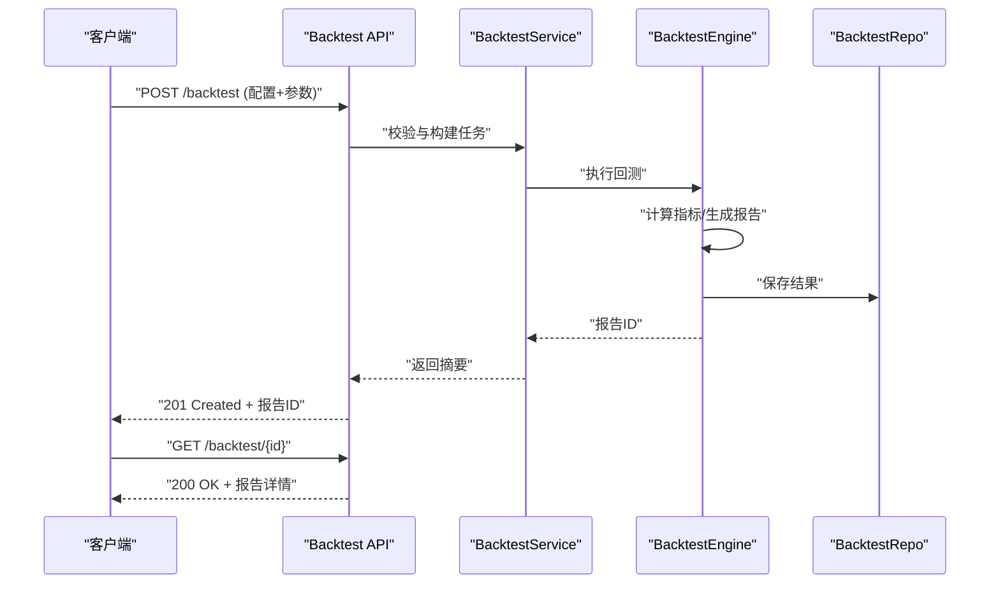
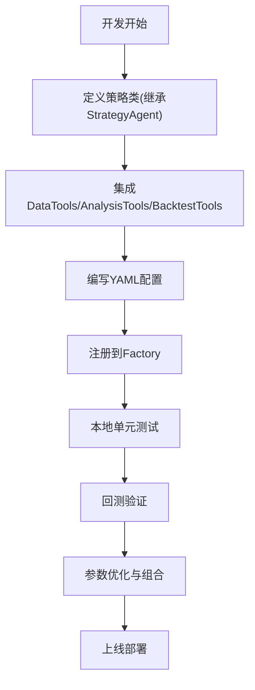
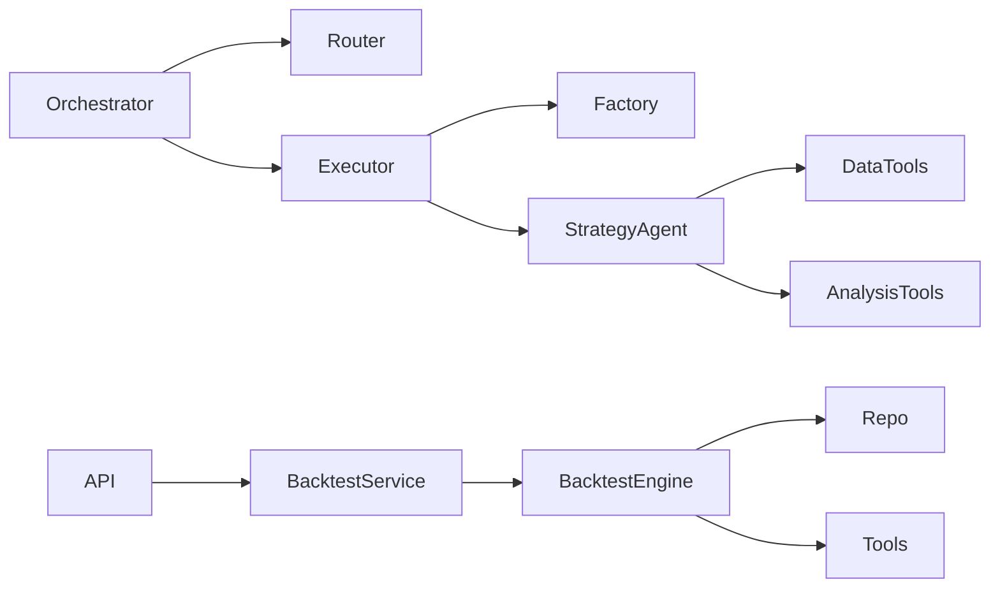

# 智能体策略系统

<cite>
**本文档引用的文件**   
- [src/agent/orchestrator.py](file://src/agent/orchestrator.py)
- [src/agent/executor.py](file://src/agent/executor.py)
- [src/agent/factory.py](file://src/agent/factory.py)
- [src/agent/strategies/router.py](file://src/agent/strategies/router.py)
- [src/agent/strategies/aggregator.py](file://src/agent/strategies/aggregator.py)
- [src/agent/strategies/strategy_agent.py](file://src/agent/strategies/strategy_agent.py)
- [src/core/backtest_engine.py](file://src/core/backtest_engine.py)
- [src/core/market_strategy.py](file://src/core/market_strategy.py)
- [src/services/backtest_service.py](file://src/services/backtest_service.py)
- [api/v1/endpoints/backtest.py](file://api/v1/endpoints/backtest.py)
- [api/v1/schemas/backtest.py](file://api/v1/schemas/backtest.py)
- [strategies/bull_trend.yaml](file://strategies/bull_trend.yaml)
- [strategies/bottom_volume.yaml](file://strategies/bottom_volume.yaml)
- [strategies/box_oscillation.yaml](file://strategies/box_oscillation.yaml)
- [strategies/emotion_cycle.yaml](file://strategies/emotion_cycle.yaml)
- [strategies/growth_quality.yaml](file://strategies/growth_quality.yaml)
- [strategies/one_yang_three_yin.yaml](file://strategies/one_yang_three_yin.yaml)
- [strategies/shrink_pullback.yaml](file://strategies/shrink_pullback.yaml)
- [strategies/volume_breakout.yaml](file://strategies/volume_breakout.yaml)
- [strategies/wave_theory.yaml](file://strategies/wave_theory.yaml)
- [src/agent/tools/backtest_tools.py](file://src/agent/tools/backtest_tools.py)
- [src/agent/tools/data_tools.py](file://src/agent/tools/data_tools.py)
- [src/agent/tools/analysis_tools.py](file://src/agent/tools/analysis_tools.py)
- [src/agent/tools/registry.py](file://src/agent/tools/registry.py)
- [src/core/config_manager.py](file://src/core/config_manager.py)
- [src/core/config_registry.py](file://src/core/config_registry.py)
- [src/repositories/backtest_repo.py](file://src/repositories/backtest_repo.py)
- [src/services/run_flow.py](file://src/services/run_flow.py)
- [src/scheduler.py](file://src/scheduler.py)
</cite>

## 目录
1. [简介](#简介)
2. [项目结构](#项目结构)
3. [核心组件](#核心组件)
4. [架构总览](#架构总览)
5. [详细组件分析](#详细组件分析)
6. [依赖关系分析](#依赖关系分析)
7. [性能考量](#性能考量)
8. [故障排查指南](#故障排查指南)
9. [结论](#结论)
10. [附录](#附录)

## 简介
本文件面向“智能体策略系统”的开发者与使用者，系统性阐述策略框架的设计模式、策略注册与调度机制，内置策略的实现逻辑与配置方法（趋势跟踪、均值回归、动量等），以及策略开发规范、回测接口与性能评估方法。同时提供策略组合与优化策略的配置说明，并给出自定义策略开发的完整示例，涵盖数据接入、信号生成与风险控制模块实现。

## 项目结构
智能体策略系统围绕“策略编排器—策略路由—策略执行—回测引擎—服务层—API层”分层组织：
- 策略编排与执行：orchestrator、executor、factory
- 策略路由与聚合：strategies/router、aggregator、strategy_agent
- 回测引擎与服务：core/backtest_engine、services/backtest_service
- API与Schema：api/v1/endpoints/backtest.py、api/v1/schemas/backtest.py
- 策略配置：strategies/*.yaml
- 工具与数据：agent/tools/*（数据、分析、回测工具）
- 配置管理：core/config_manager、core/config_registry
- 持久化：repositories/backtest_repo
- 任务调度：scheduler、services/run_flow

**图表来源** 
- [src/agent/orchestrator.py](file://src/agent/orchestrator.py)
- [src/agent/executor.py](file://src/agent/executor.py)
- [src/agent/factory.py](file://src/agent/factory.py)
- [src/agent/strategies/router.py](file://src/agent/strategies/router.py)
- [src/agent/strategies/aggregator.py](file://src/agent/strategies/aggregator.py)
- [src/agent/strategies/strategy_agent.py](file://src/agent/strategies/strategy_agent.py)
- [src/core/backtest_engine.py](file://src/core/backtest_engine.py)
- [src/services/backtest_service.py](file://src/services/backtest_service.py)
- [api/v1/endpoints/backtest.py](file://api/v1/endpoints/backtest.py)
- [api/v1/schemas/backtest.py](file://api/v1/schemas/backtest.py)
- [src/agent/tools/backtest_tools.py](file://src/agent/tools/backtest_tools.py)
- [src/agent/tools/data_tools.py](file://src/agent/tools/data_tools.py)
- [src/agent/tools/analysis_tools.py](file://src/agent/tools/analysis_tools.py)

**章节来源**
- [src/agent/orchestrator.py](file://src/agent/orchestrator.py)
- [src/agent/executor.py](file://src/agent/executor.py)
- [src/agent/factory.py](file://src/agent/factory.py)
- [src/agent/strategies/router.py](file://src/agent/strategies/router.py)
- [src/agent/strategies/aggregator.py](file://src/agent/strategies/aggregator.py)
- [src/agent/strategies/strategy_agent.py](file://src/agent/strategies/strategy_agent.py)
- [src/core/backtest_engine.py](file://src/core/backtest_engine.py)
- [src/services/backtest_service.py](file://src/services/backtest_service.py)
- [api/v1/endpoints/backtest.py](file://api/v1/endpoints/backtest.py)
- [api/v1/schemas/backtest.py](file://api/v1/schemas/backtest.py)

## 核心组件
- 编排器 Orchestrator：负责整体流程编排，协调数据准备、策略选择、执行与结果汇总。
- 执行器 Executor：将具体策略实例化并执行，处理参数校验、上下文注入与异常捕获。
- 工厂 Factory：按名称或类型创建策略实例，支持动态加载与缓存。
- 策略路由 Router：根据市场状态、标的范围、时间窗口等条件选择合适策略。
- 策略聚合 Aggregator：对多策略输出进行加权、投票或阈值合并，形成最终决策。
- 策略代理 StrategyAgent：封装单策略生命周期（初始化、运行、清理），暴露统一接口。
- 回测引擎 BacktestEngine：历史数据回放、交易模拟、指标计算与结果持久化。
- 回测服务 BacktestService：对外提供回测任务提交、查询、导出等能力。
- 工具集 Tools：数据获取、技术分析、回测辅助工具，供策略与引擎调用。
- 配置管理 ConfigManager/ConfigRegistry：集中管理策略与系统配置，支持热更新与校验。
- 持久化 Repo：回测结果存储与检索。

**章节来源**
- [src/agent/orchestrator.py](file://src/agent/orchestrator.py)
- [src/agent/executor.py](file://src/agent/executor.py)
- [src/agent/factory.py](file://src/agent/factory.py)
- [src/agent/strategies/router.py](file://src/agent/strategies/router.py)
- [src/agent/strategies/aggregator.py](file://src/agent/strategies/aggregator.py)
- [src/agent/strategies/strategy_agent.py](file://src/agent/strategies/strategy_agent.py)
- [src/core/backtest_engine.py](file://src/core/backtest_engine.py)
- [src/services/backtest_service.py](file://src/services/backtest_service.py)
- [src/agent/tools/backtest_tools.py](file://src/agent/tools/backtest_tools.py)
- [src/agent/tools/data_tools.py](file://src/agent/tools/data_tools.py)
- [src/agent/tools/analysis_tools.py](file://src/agent/tools/analysis_tools.py)
- [src/core/config_manager.py](file://src/core/config_manager.py)
- [src/core/config_registry.py](file://src/core/config_registry.py)
- [src/repositories/backtest_repo.py](file://src/repositories/backtest_repo.py)

## 架构总览
下图展示了从API到策略执行的端到端流程，包括请求校验、策略路由、执行、回测与结果返回。

**图表来源** 
- [api/v1/endpoints/backtest.py](file://api/v1/endpoints/backtest.py)
- [api/v1/schemas/backtest.py](file://api/v1/schemas/backtest.py)
- [src/services/backtest_service.py](file://src/services/backtest_service.py)
- [src/core/backtest_engine.py](file://src/core/backtest_engine.py)
- [src/repositories/backtest_repo.py](file://src/repositories/backtest_repo.py)
- [src/agent/orchestrator.py](file://src/agent/orchestrator.py)
- [src/agent/strategies/router.py](file://src/agent/strategies/router.py)
- [src/agent/strategies/strategy_agent.py](file://src/agent/strategies/strategy_agent.py)
- [src/agent/tools/data_tools.py](file://src/agent/tools/data_tools.py)
- [src/agent/tools/analysis_tools.py](file://src/agent/tools/analysis_tools.py)

## 详细组件分析

### 策略框架设计模式
- 策略抽象与代理：通过StrategyAgent统一封装策略生命周期，屏蔽差异；Executor负责实例化与执行；Factory按名称或类型创建。
- 路由与聚合：Router基于规则或学习模型选择策略；Aggregator对多策略输出进行融合，降低单一策略风险。
- 工具解耦：DataTools/AnalysisTools/BacktestTools以插件形式被策略与引擎调用，便于扩展与维护。
- 配置驱动：所有策略行为由YAML配置驱动，支持参数覆盖、开关控制与版本化管理。

**图表来源** 
- [src/agent/strategies/strategy_agent.py](file://src/agent/strategies/strategy_agent.py)
- [src/agent/executor.py](file://src/agent/executor.py)
- [src/agent/factory.py](file://src/agent/factory.py)
- [src/agent/strategies/router.py](file://src/agent/strategies/router.py)
- [src/agent/strategies/aggregator.py](file://src/agent/strategies/aggregator.py)
- [src/core/backtest_engine.py](file://src/core/backtest_engine.py)

**章节来源**
- [src/agent/strategies/strategy_agent.py](file://src/agent/strategies/strategy_agent.py)
- [src/agent/executor.py](file://src/agent/executor.py)
- [src/agent/factory.py](file://src/agent/factory.py)
- [src/agent/strategies/router.py](file://src/agent/strategies/router.py)
- [src/agent/strategies/aggregator.py](file://src/agent/strategies/aggregator.py)
- [src/core/backtest_engine.py](file://src/core/backtest_engine.py)

### 策略注册与调度机制
- 注册：策略通过配置文件声明（名称、类路径、默认参数、依赖工具）。Factory维护注册表，支持热加载。
- 调度：Scheduler定时触发任务；RunFlow编排步骤；Orchestrator根据市场状态与标的范围选择策略集合；Executor并发执行策略。
- 容错：失败重试、超时控制、降级策略（如切换备用数据源或简化策略）。

**图表来源** 
- [src/core/config_manager.py](file://src/core/config_manager.py)
- [src/core/config_registry.py](file://src/core/config_registry.py)
- [src/agent/factory.py](file://src/agent/factory.py)
- [src/scheduler.py](file://src/scheduler.py)
- [src/services/run_flow.py](file://src/services/run_flow.py)
- [src/agent/orchestrator.py](file://src/agent/orchestrator.py)
- [src/agent/executor.py](file://src/agent/executor.py)
- [src/agent/strategies/aggregator.py](file://src/agent/strategies/aggregator.py)
- [src/core/backtest_engine.py](file://src/core/backtest_engine.py)

**章节来源**
- [src/core/config_manager.py](file://src/core/config_manager.py)
- [src/core/config_registry.py](file://src/core/config_registry.py)
- [src/agent/factory.py](file://src/agent/factory.py)
- [src/scheduler.py](file://src/scheduler.py)
- [src/services/run_flow.py](file://src/services/run_flow.py)
- [src/agent/orchestrator.py](file://src/agent/orchestrator.py)
- [src/agent/executor.py](file://src/agent/executor.py)
- [src/agent/strategies/aggregator.py](file://src/agent/strategies/aggregator.py)
- [src/core/backtest_engine.py](file://src/core/backtest_engine.py)

### 内置策略实现与配置
以下为常见内置策略类别及其典型配置要点（以YAML为主）：
- 趋势跟踪（如 bull_trend.yaml）
  - 关键参数：趋势强度阈值、移动平均周期、止损止盈比例、滑点与手续费。
  - 适用场景：单边行情，配合波动率过滤。
- 均值回归（如 bottom_volume.yaml、shrink_pullback.yaml）
  - 关键参数：偏离度阈值、回归窗口、成交量放大因子、回撤限制。
  - 适用场景：震荡市，低波环境。
- 动量策略（如 volume_breakout.yaml、wave_theory.yaml）
  - 关键参数：动量窗口、突破阈值、量能确认、趋势延续判定。
  - 适用场景：强趋势与放量突破。
- 情绪周期（emotion_cycle.yaml）
  - 关键参数：情绪指标权重、周期识别阈值、反转信号确认。
  - 适用场景：情绪驱动的短期波动。
- 成长质量（growth_quality.yaml）
  - 关键参数：基本面因子权重、质量评分阈值、行业轮动规则。
  - 适用场景：中长期选股与持仓优化。
- 形态策略（one_yang_three_yin.yaml、box_oscillation.yaml）
  - 关键参数：K线形态识别规则、箱体边界、突破确认。
  - 适用场景：技术形态交易。

配置项通用字段建议：
- strategy_name：策略唯一标识
- class_path：策略类路径
- params：策略参数字典
- tools：依赖的数据与分析工具名
- risk：风控参数（最大仓位、止损、止盈、回撤上限）
- schedule：调度频率与时间窗
- filters：标的筛选与市场状态过滤

**章节来源**
- [strategies/bull_trend.yaml](file://strategies/bull_trend.yaml)
- [strategies/bottom_volume.yaml](file://strategies/bottom_volume.yaml)
- [strategies/box_oscillation.yaml](file://strategies/box_oscillation.yaml)
- [strategies/emotion_cycle.yaml](file://strategies/emotion_cycle.yaml)
- [strategies/growth_quality.yaml](file://strategies/growth_quality.yaml)
- [strategies/one_yang_three_yin.yaml](file://strategies/one_yang_three_yin.yaml)
- [strategies/shrink_pullback.yaml](file://strategies/shrink_pullback.yaml)
- [strategies/volume_breakout.yaml](file://strategies/volume_breakout.yaml)
- [strategies/wave_theory.yaml](file://strategies/wave_theory.yaml)

### 回测接口与性能评估
- 回测接口（Backtest API）
  - 输入：标的列表、起止时间、策略配置、资金与费用假设、风控参数。
  - 输出：回测报告ID、关键指标（年化收益、夏普比率、最大回撤、胜率、盈亏比）、交易明细、净值曲线。
- 性能评估
  - 指标维度：收益性（年化、累计）、风险性（最大回撤、波动率）、稳定性（滚动夏普、月度收益分布）、交易成本敏感性（滑点、手续费影响）。
  - 评估方法：样本内/外划分、交叉验证、蒙特卡洛扰动、压力测试（极端行情）。
- 持久化与查询
  - 通过BacktestRepo保存与检索回测结果，支持按策略、时间、标的维度查询。

**图表来源** 
- [api/v1/endpoints/backtest.py](file://api/v1/endpoints/backtest.py)
- [api/v1/schemas/backtest.py](file://api/v1/schemas/backtest.py)
- [src/services/backtest_service.py](file://src/services/backtest_service.py)
- [src/core/backtest_engine.py](file://src/core/backtest_engine.py)
- [src/repositories/backtest_repo.py](file://src/repositories/backtest_repo.py)

**章节来源**
- [api/v1/endpoints/backtest.py](file://api/v1/endpoints/backtest.py)
- [api/v1/schemas/backtest.py](file://api/v1/schemas/backtest.py)
- [src/services/backtest_service.py](file://src/services/backtest_service.py)
- [src/core/backtest_engine.py](file://src/core/backtest_engine.py)
- [src/repositories/backtest_repo.py](file://src/repositories/backtest_repo.py)

### 策略组合与优化策略
- 组合方式
  - 加权平均：按历史表现或主观权重分配。
  - 投票机制：多数决或置信度加权。
  - 动态切换：根据市场阶段（趋势/震荡）自动选择子策略。
- 优化方法
  - 网格搜索/贝叶斯优化：参数空间探索。
  - 正则化与早停：防止过拟合。
  - 滚动窗口优化：保持策略时效性。
- 配置建议
  - 在Aggregator中定义组合规则与权重更新策略。
  - 在Router中设置市场状态判断与切换条件。
  - 在ConfigRegistry中统一管理优化超参与约束。

**章节来源**
- [src/agent/strategies/aggregator.py](file://src/agent/strategies/aggregator.py)
- [src/agent/strategies/router.py](file://src/agent/strategies/router.py)
- [src/core/config_registry.py](file://src/core/config_registry.py)

### 自定义策略开发规范与示例
- 开发规范
  - 继承StrategyAgent，实现initialize、run、cleanup。
  - 使用DataTools获取行情与基本面数据，使用AnalysisTools计算技术指标。
  - 通过BacktestTools进行交易模拟与绩效统计。
  - 在YAML中声明策略名称、类路径、参数、工具依赖与风控。
- 数据接入
  - 通过DataTools统一接口拉取历史与实时数据，支持多数据源与缓存。
- 信号生成
  - 在run中根据输入上下文计算信号（买入/卖出/持有），输出标准化Signal对象。
- 风险控制
  - 在params.risk中定义止损、止盈、仓位上限、回撤限制；在Executor中统一拦截异常与强制平仓。
- 示例流程
  - 编写策略类 → YAML配置 → 注册到Factory → 通过Router选择 → Executor执行 → Aggregator聚合 → BacktestEngine回测 → Repo持久化。

**图表来源** 
- [src/agent/strategies/strategy_agent.py](file://src/agent/strategies/strategy_agent.py)
- [src/agent/tools/data_tools.py](file://src/agent/tools/data_tools.py)
- [src/agent/tools/analysis_tools.py](file://src/agent/tools/analysis_tools.py)
- [src/agent/tools/backtest_tools.py](file://src/agent/tools/backtest_tools.py)
- [src/agent/factory.py](file://src/agent/factory.py)
- [src/core/backtest_engine.py](file://src/core/backtest_engine.py)

**章节来源**
- [src/agent/strategies/strategy_agent.py](file://src/agent/strategies/strategy_agent.py)
- [src/agent/tools/data_tools.py](file://src/agent/tools/data_tools.py)
- [src/agent/tools/analysis_tools.py](file://src/agent/tools/analysis_tools.py)
- [src/agent/tools/backtest_tools.py](file://src/agent/tools/backtest_tools.py)
- [src/agent/factory.py](file://src/agent/factory.py)
- [src/core/backtest_engine.py](file://src/core/backtest_engine.py)

## 依赖关系分析
- 组件耦合
  - Orchestrator依赖Router与Executor，Executor依赖Factory与StrategyAgent。
  - BacktestEngine依赖Repo与Tools；BacktestService封装Engine并提供API。
- 外部依赖
  - 数据源适配器（data_provider）通过DataTools接入；LLM与通知模块为可选增强。
- 潜在循环依赖
  - 通过接口抽象与工具解耦避免循环；Factory与ConfigRegistry作为中心注册点。

**图表来源** 
- [src/agent/orchestrator.py](file://src/agent/orchestrator.py)
- [src/agent/executor.py](file://src/agent/executor.py)
- [src/agent/factory.py](file://src/agent/factory.py)
- [src/agent/strategies/strategy_agent.py](file://src/agent/strategies/strategy_agent.py)
- [src/agent/tools/data_tools.py](file://src/agent/tools/data_tools.py)
- [src/agent/tools/analysis_tools.py](file://src/agent/tools/analysis_tools.py)
- [src/core/backtest_engine.py](file://src/core/backtest_engine.py)
- [src/repositories/backtest_repo.py](file://src/repositories/backtest_repo.py)
- [src/services/backtest_service.py](file://src/services/backtest_service.py)
- [api/v1/endpoints/backtest.py](file://api/v1/endpoints/backtest.py)

**章节来源**
- [src/agent/orchestrator.py](file://src/agent/orchestrator.py)
- [src/agent/executor.py](file://src/agent/executor.py)
- [src/agent/factory.py](file://src/agent/factory.py)
- [src/agent/strategies/strategy_agent.py](file://src/agent/strategies/strategy_agent.py)
- [src/agent/tools/data_tools.py](file://src/agent/tools/data_tools.py)
- [src/agent/tools/analysis_tools.py](file://src/agent/tools/analysis_tools.py)
- [src/core/backtest_engine.py](file://src/core/backtest_engine.py)
- [src/repositories/backtest_repo.py](file://src/repositories/backtest_repo.py)
- [src/services/backtest_service.py](file://src/services/backtest_service.py)
- [api/v1/endpoints/backtest.py](file://api/v1/endpoints/backtest.py)

## 性能考量
- 并发与异步：Executor支持并行执行策略，注意I/O瓶颈与资源竞争。
- 数据缓存：DataTools应启用本地缓存与增量更新，减少重复拉取。
- 指标计算：AnalysisTools采用向量化计算，避免逐条循环。
- 回测效率：BacktestEngine分批回放数据，内存管理与垃圾回收优化。
- 监控与告警：记录关键耗时与错误率，设置阈值告警。

[本节为通用指导，不直接分析具体文件]

## 故障排查指南
- 常见问题
  - 策略未注册：检查Factory注册表与YAML配置路径。
  - 数据缺失：确认DataTools数据源可用性与缓存状态。
  - 回测失败：查看BacktestEngine日志与Repo写入权限。
  - 调度不触发：检查Scheduler配置与RunFlow步骤顺序。
- 调试建议
  - 开启详细日志，定位异常堆栈。
  - 使用最小数据集复现问题。
  - 逐步禁用策略或工具，隔离故障点。

**章节来源**
- [src/agent/factory.py](file://src/agent/factory.py)
- [src/agent/tools/data_tools.py](file://src/agent/tools/data_tools.py)
- [src/core/backtest_engine.py](file://src/core/backtest_engine.py)
- [src/repositories/backtest_repo.py](file://src/repositories/backtest_repo.py)
- [src/scheduler.py](file://src/scheduler.py)
- [src/services/run_flow.py](file://src/services/run_flow.py)

## 结论
智能体策略系统通过清晰的层次化设计与模块化架构，实现了策略的可插拔、可配置与可扩展。借助统一的注册与调度机制、强大的回测引擎与工具集，用户可快速开发、验证与部署策略，并通过组合与优化提升稳健性。建议在开发过程中严格遵循规范，重视数据质量与风险控制，持续迭代策略与参数。

[本节为总结，不直接分析具体文件]

## 附录
- 策略配置模板与最佳实践
  - 明确参数含义与取值范围，提供默认值与校验规则。
  - 使用环境变量覆盖敏感配置（如API密钥）。
  - 版本化管理策略配置，支持灰度发布。
- 性能基准与压测
  - 建立标准数据集与基准用例，定期回归测试。
  - 监控CPU/内存/IO，识别热点与瓶颈。
- 安全与合规
  - 数据脱敏与访问控制，审计日志留存。
  - 策略逻辑透明与可解释性，避免黑箱风险。

[本节为补充信息，不直接分析具体文件]