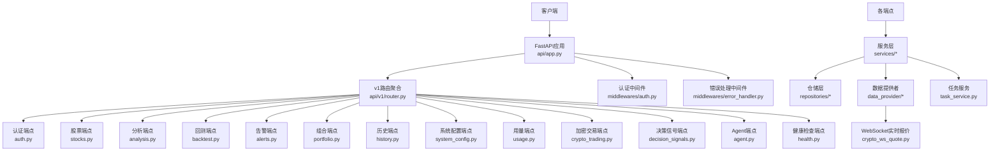
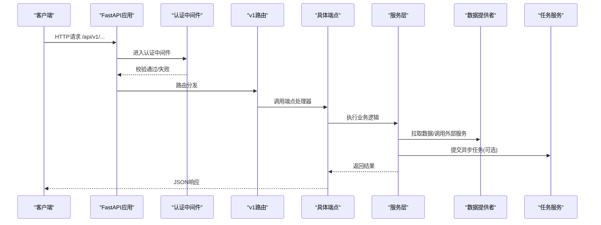
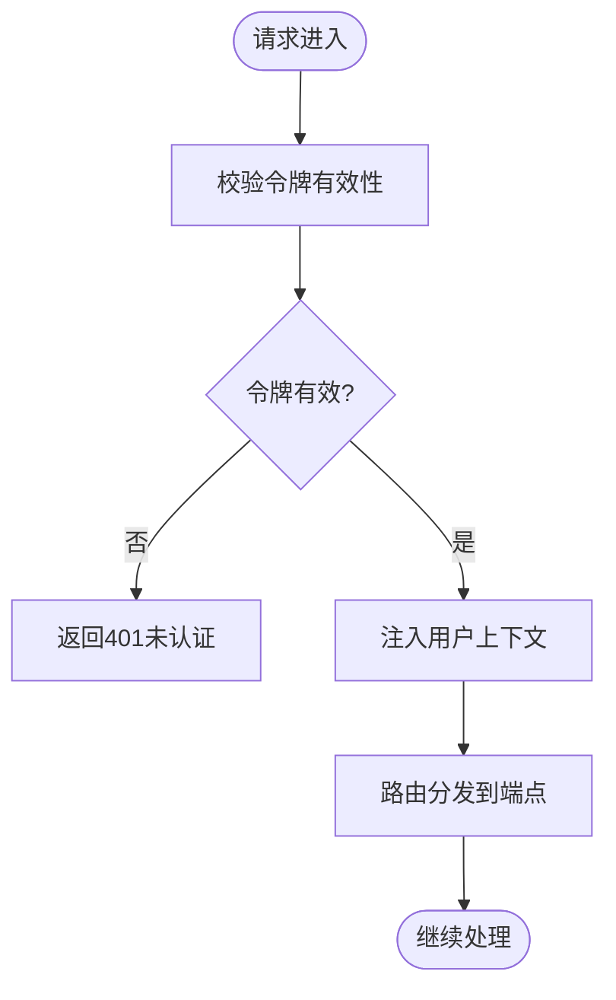
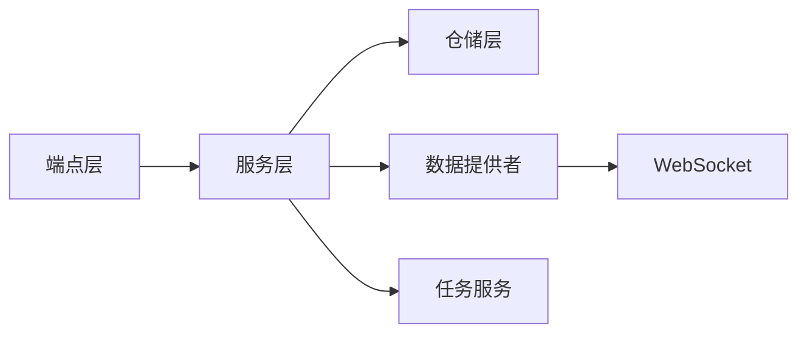

# API参考文档

<cite>
**本文档引用的文件**   
- [main.py](file://main.py)
- [server.py](file://server.py)
- [api/app.py](file://api/app.py)
- [api/v1/router.py](file://api/v1/router.py)
- [api/v1/endpoints/auth.py](file://api/v1/endpoints/auth.py)
- [api/v1/endpoints/stocks.py](file://api/v1/endpoints/stocks.py)
- [api/v1/endpoints/analysis.py](file://api/v1/endpoints/analysis.py)
- [api/v1/endpoints/backtest.py](file://api/v1/endpoints/backtest.py)
- [api/v1/endpoints/alerts.py](file://api/v1/endpoints/alerts.py)
- [api/v1/endpoints/portfolio.py](file://api/v1/endpoints/portfolio.py)
- [api/v1/endpoints/history.py](file://api/v1/endpoints/history.py)
- [api/v1/endpoints/system_config.py](file://api/v1/endpoints/system_config.py)
- [api/v1/endpoints/usage.py](file://api/v1/endpoints/usage.py)
- [api/v1/endpoints/crypto_trading.py](file://api/v1/endpoints/crypto_trading.py)
- [api/v1/endpoints/decision_signals.py](file://api/v1/endpoints/decision_signals.py)
- [api/v1/endpoints/agent.py](file://api/v1/endpoints/agent.py)
- [api/v1/endpoints/health.py](file://api/v1/endpoints/health.py)
- [api/middlewares/auth.py](file://api/middlewares/auth.py)
- [api/middlewares/error_handler.py](file://api/middlewares/error_handler.py)
- [api/deps.py](file://api/deps.py)
- [src/services/task_service.py](file://src/services/task_service.py)
- [data_provider/crypto_ws_quote.py](file://data_provider/crypto_ws_quote.py)
</cite>

## 目录
1. [简介](#简介)
2. [项目结构](#项目结构)
3. [核心组件](#核心组件)
4. [架构总览](#架构总览)
5. [详细组件分析](#详细组件分析)
6. [依赖关系分析](#依赖关系分析)
7. [性能考虑](#性能考虑)
8. [故障排查指南](#故障排查指南)
9. [结论](#结论)
10. [附录](#附录)

## 简介
本API参考文档面向开发者与集成方，系统化描述该股票分析系统的RESTful接口规范、认证与权限控制、速率限制策略、错误码约定、版本管理与兼容性保证，并提供WebSocket实时数据接口的连接协议与消息格式说明。同时给出常用调用示例、SDK使用建议与最佳实践，帮助快速接入与稳定运行。

## 项目结构
后端采用FastAPI构建，按功能域划分v1版本路由，中间件统一处理认证与错误，服务层封装业务逻辑，数据提供者负责行情与历史数据获取，任务队列支撑异步长耗时操作，WebSocket用于加密货币实时报价推送。

**图表来源** 
- [api/app.py](file://api/app.py)
- [api/v1/router.py](file://api/v1/router.py)
- [api/middlewares/auth.py](file://api/middlewares/auth.py)
- [api/middlewares/error_handler.py](file://api/middlewares/error_handler.py)
- [src/services/task_service.py](file://src/services/task_service.py)
- [data_provider/crypto_ws_quote.py](file://data_provider/crypto_ws_quote.py)

**章节来源**
- [main.py](file://main.py)
- [server.py](file://server.py)
- [api/app.py](file://api/app.py)
- [api/v1/router.py](file://api/v1/router.py)

## 核心组件
- 应用入口与路由聚合：FastAPI应用初始化、全局中间件注册、v1路由挂载。
- 认证与授权：基于令牌（如JWT）的鉴权中间件，保护受保护端点。
- 错误处理：统一异常捕获、HTTP状态码映射、结构化错误响应体。
- 服务层：业务编排、跨模块协作、外部数据源调用。
- 任务服务：异步任务调度与进度查询，支持长耗时操作（如回测、批量分析）。
- 数据提供者：多源行情与历史数据拉取，标准化输出。
- WebSocket：加密货币实时报价推送，事件驱动的消息流。

**章节来源**
- [api/app.py](file://api/app.py)
- [api/middlewares/auth.py](file://api/middlewares/auth.py)
- [api/middlewares/error_handler.py](file://api/middlewares/error_handler.py)
- [src/services/task_service.py](file://src/services/task_service.py)
- [data_provider/crypto_ws_quote.py](file://data_provider/crypto_ws_quote.py)

## 架构总览
整体采用分层架构：API层定义REST端点与请求校验；中间件层提供认证、限流、错误处理；服务层实现业务逻辑；仓储层持久化数据；数据提供者对接外部数据源；任务服务管理异步任务；WebSocket提供实时数据通道。

**图表来源** 
- [api/app.py](file://api/app.py)
- [api/v1/router.py](file://api/v1/router.py)
- [api/middlewares/auth.py](file://api/middlewares/auth.py)
- [src/services/task_service.py](file://src/services/task_service.py)

## 详细组件分析

### 认证与授权
- 机制：基于令牌的认证（例如JWT），在请求头携带凭证，中间件解析并注入用户上下文。
- 受保护端点：除公开端点外，多数业务端点需携带有效令牌。
- 权限控制：根据角色或资源范围进行细粒度访问控制（由服务层实现）。
- 错误响应：未认证返回401，无权限返回403，附带结构化错误信息。

**图表来源** 
- [api/middlewares/auth.py](file://api/middlewares/auth.py)

**章节来源**
- [api/middlewares/auth.py](file://api/middlewares/auth.py)
- [api/v1/endpoints/auth.py](file://api/v1/endpoints/auth.py)

### 健康检查
- 目的：快速探测服务可用性、依赖健康状态。
- 典型路径：/api/v1/health
- 方法：GET
- 响应：包含服务状态、时间戳、依赖检查结果。

**章节来源**
- [api/v1/endpoints/health.py](file://api/v1/endpoints/health.py)

### 股票相关接口
- 常见能力：股票列表查询、基本信息获取、实时/历史行情、搜索与自动补全。
- 典型路径：/api/v1/stocks
- 方法：GET/POST/PUT/DELETE（按资源操作）
- 参数：股票代码、时间范围、指标类型等
- 响应：标准化数据结构，含字段说明与分页信息（如适用）

**章节来源**
- [api/v1/endpoints/stocks.py](file://api/v1/endpoints/stocks.py)

### 分析接口
- 能力：个股/指数分析、市场阶段判断、报告生成。
- 典型路径：/api/v1/analysis
- 方法：POST触发分析任务，GET查询结果
- 参数：标的、时间窗口、分析维度、报告语言等
- 响应：分析结果摘要、关键指标、可视化数据引用

**章节来源**
- [api/v1/endpoints/analysis.py](file://api/v1/endpoints/analysis.py)

### 回测接口
- 能力：策略回测、参数优化、结果导出。
- 典型路径：/api/v1/backtest
- 方法：POST提交回测任务，GET查询进度与结果
- 参数：策略配置、标的、起止时间、资金与手续费设置等
- 响应：回测统计、收益曲线、风险指标、交易明细

**章节来源**
- [api/v1/endpoints/backtest.py](file://api/v1/endpoints/backtest.py)

### 告警接口
- 能力：规则管理、触发历史、通知测试。
- 典型路径：/api/v1/alerts
- 方法：CRUD与触发查询
- 参数：规则条件、阈值、通知渠道等
- 响应：规则详情、触发记录、通知状态

**章节来源**
- [api/v1/endpoints/alerts.py](file://api/v1/endpoints/alerts.py)

### 投资组合接口
- 能力：组合创建、持仓管理、风险评估、导入导出。
- 典型路径：/api/v1/portfolio
- 方法：CRUD与快照查询
- 参数：资产权重、成本、日期范围等
- 响应：组合概览、持仓明细、风险指标

**章节来源**
- [api/v1/endpoints/portfolio.py](file://api/v1/endpoints/portfolio.py)

### 历史数据接口
- 能力：历史K线、财务数据、新闻与公告。
- 典型路径：/api/v1/history
- 方法：GET为主
- 参数：标的、周期、起止时间、数据字段
- 响应：时间序列数据、元数据、分页

**章节来源**
- [api/v1/endpoints/history.py](file://api/v1/endpoints/history.py)

### 系统配置接口
- 能力：读取与更新系统级配置项（如LLM渠道、通知渠道、数据源开关）。
- 典型路径：/api/v1/system-config
- 方法：GET/PUT
- 参数：配置键值对、作用域
- 响应：当前配置、变更结果

**章节来源**
- [api/v1/endpoints/system_config.py](file://api/v1/endpoints/system_config.py)

### 用量统计接口
- 能力：查看模型调用用量、配额与计费信息。
- 典型路径：/api/v1/usage
- 方法：GET
- 参数：时间范围、模型名称
- 响应：用量汇总、趋势图数据

**章节来源**
- [api/v1/endpoints/usage.py](file://api/v1/endpoints/usage.py)

### 加密货币交易接口
- 能力：交易指令提交、订单状态查询、账户余额与成交记录。
- 典型路径：/api/v1/crypto-trading
- 方法：POST提交订单，GET查询状态
- 参数：交易所、交易对、方向、数量、价格等
- 响应：订单ID、状态、回执信息

**章节来源**
- [api/v1/endpoints/crypto_trading.py](file://api/v1/endpoints/crypto_trading.py)

### 决策信号接口
- 能力：信号生成、过滤、存储与展示。
- 典型路径：/api/v1/decision-signals
- 方法：CRUD与筛选查询
- 参数：标的、时间、信号类型、置信度阈值
- 响应：信号列表、详情、关联分析

**章节来源**
- [api/v1/endpoints/decision_signals.py](file://api/v1/endpoints/decision_signals.py)

### Agent接口
- 能力：对话式分析、工具调用、上下文管理。
- 典型路径：/api/v1/agent
- 方法：POST发送消息，SSE或轮询获取回复
- 参数：消息内容、会话ID、工具选择
- 响应：逐步推理过程、最终结论、工具执行结果

**章节来源**
- [api/v1/endpoints/agent.py](file://api/v1/endpoints/agent.py)

### 错误处理与统一响应
- 统一错误体：包含错误码、消息、详情、请求ID等字段。
- 常见状态码：400参数错误、401未认证、403无权限、404资源不存在、429限流、500服务器错误。
- 中间件：集中捕获异常并转换为标准JSON响应。

**章节来源**
- [api/middlewares/error_handler.py](file://api/middlewares/error_handler.py)

## 依赖关系分析
- 端点与服务：每个端点依赖对应的服务模块，服务再调用仓储与数据提供者。
- 任务服务：为长耗时操作提供异步执行与进度查询。
- 数据提供者：抽象多种数据源，统一接口与输出格式。
- WebSocket：独立于REST，提供实时数据通道。

**图表来源** 
- [api/v1/router.py](file://api/v1/router.py)
- [src/services/task_service.py](file://src/services/task_service.py)
- [data_provider/crypto_ws_quote.py](file://data_provider/crypto_ws_quote.py)

**章节来源**
- [api/v1/router.py](file://api/v1/router.py)
- [src/services/task_service.py](file://src/services/task_service.py)
- [data_provider/crypto_ws_quote.py](file://data_provider/crypto_ws_quote.py)

## 性能考虑
- 缓存策略：对热点数据（如股票索引、基础信息）启用缓存，减少重复计算与外部调用。
- 分页与限页：列表接口默认分页，避免一次性返回大量数据。
- 异步任务：将耗时操作放入任务队列，前端轮询或SSE获取进度。
- 连接池：数据库与HTTP客户端使用连接池，提升并发能力。
- 压缩与传输：启用Gzip压缩，减少网络传输开销。

[本节为通用指导，不直接分析具体文件]

## 故障排查指南
- 认证失败：检查令牌有效期、签名算法、请求头是否正确。
- 限流触发：观察429响应，调整请求频率或申请更高配额。
- 数据源异常：查看数据提供者日志，确认外部服务可用性与限频。
- 任务失败：通过任务服务查询失败原因与重试策略。
- 错误定位：利用统一错误响应中的请求ID与详情字段定位问题。

**章节来源**
- [api/middlewares/error_handler.py](file://api/middlewares/error_handler.py)
- [src/services/task_service.py](file://src/services/task_service.py)

## 结论
本API参考文档覆盖了RESTful接口规范、认证与权限、错误处理、版本管理、WebSocket实时数据以及性能与排障建议。遵循本文档可确保稳定集成与高效开发。建议在集成前完成环境准备、密钥配置与最小可用用例验证。

[本节为总结性内容，不直接分析具体文件]

## 附录

### 认证机制与权限控制
- 认证方式：Bearer Token（JWT），在请求头Authorization中传递。
- 权限模型：基于角色的访问控制（RBAC），不同角色拥有不同资源访问权限。
- 安全建议：HTTPS强制、令牌短生命周期、服务端校验签名与过期时间。

**章节来源**
- [api/middlewares/auth.py](file://api/middlewares/auth.py)
- [api/v1/endpoints/auth.py](file://api/v1/endpoints/auth.py)

### 速率限制策略
- 策略：按IP或用户令牌进行限流，支持滑动窗口与固定窗口。
- 响应：达到上限返回429，附带重试After-Seconds。
- 配置：可通过系统配置动态调整限流阈值与白名单。

**章节来源**
- [api/middlewares/error_handler.py](file://api/middlewares/error_handler.py)

### API版本管理与兼容性
- 版本路径：/api/v1/...，未来新增v2时保持向后兼容。
- 兼容性保证：不破坏性变更（新增字段、新增端点），废弃字段保留一段时间。
- 迁移指南：发布迁移说明，提供脚本与示例，逐步淘汰旧版。

**章节来源**
- [api/v1/router.py](file://api/v1/router.py)

### WebSocket实时数据接口
- 连接地址：ws://host/api/v1/ws/crypto-quote
- 握手：建立连接后发送订阅消息，指定交易对与频道。
- 消息格式：
  - 订阅：{action:"subscribe", channel:"trade", symbols:["BTCUSDT"]}
  - 推送：{type:"quote", symbol:"BTCUSDT", price:..., volume:...}
  - 心跳：{type:"ping"} / {type:"pong"}
- 重连策略：指数退避，断线自动重连，保留订阅状态。

**章节来源**
- [data_provider/crypto_ws_quote.py](file://data_provider/crypto_ws_quote.py)

### SDK使用指南与最佳实践
- SDK选型：优先使用官方SDK或OpenAPI生成的客户端。
- 初始化：配置Base URL、认证令牌、超时与重试策略。
- 调用示例：以Python为例，先初始化客户端，再调用对应模块方法。
- 最佳实践：
  - 使用连接池与HTTP客户端复用。
  - 合理设置超时与重试次数。
  - 对长耗时任务使用异步与回调。
  - 本地缓存热点数据，减少重复请求。
  - 监控与日志：采集关键指标与错误堆栈。

[本节为通用指导，不直接分析具体文件]

### 错误代码与响应格式
- 统一响应体：包含code、message、data、request_id等字段。
- 常见错误码：
  - 400：参数校验失败
  - 401：未认证
  - 403：无权限
  - 404：资源不存在
  - 429：速率限制
  - 500：服务器内部错误
- 调试建议：记录request_id，结合服务端日志定位问题。

**章节来源**
- [api/middlewares/error_handler.py](file://api/middlewares/error_handler.py)

### 常用API调用示例（路径与要点）
- 健康检查：GET /api/v1/health
- 登录获取令牌：POST /api/v1/auth/login
- 查询股票列表：GET /api/v1/stocks?symbol=...
- 提交分析任务：POST /api/v1/analysis
- 提交回测任务：POST /api/v1/backtest
- 查询任务进度：GET /api/v1/tasks/{task_id}
- 订阅实时报价：WS /api/v1/ws/crypto-quote

**章节来源**
- [api/v1/endpoints/health.py](file://api/v1/endpoints/health.py)
- [api/v1/endpoints/auth.py](file://api/v1/endpoints/auth.py)
- [api/v1/endpoints/stocks.py](file://api/v1/endpoints/stocks.py)
- [api/v1/endpoints/analysis.py](file://api/v1/endpoints/analysis.py)
- [api/v1/endpoints/backtest.py](file://api/v1/endpoints/backtest.py)
- [src/services/task_service.py](file://src/services/task_service.py)
- [data_provider/crypto_ws_quote.py](file://data_provider/crypto_ws_quote.py)