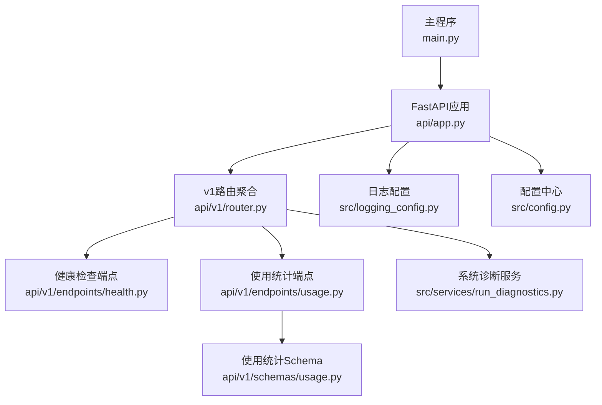
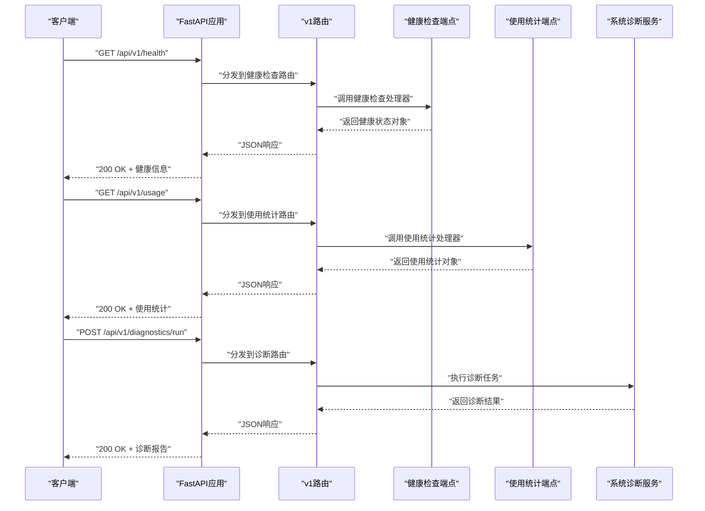
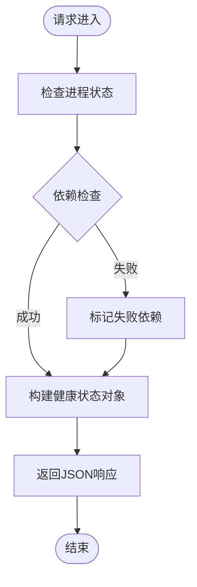
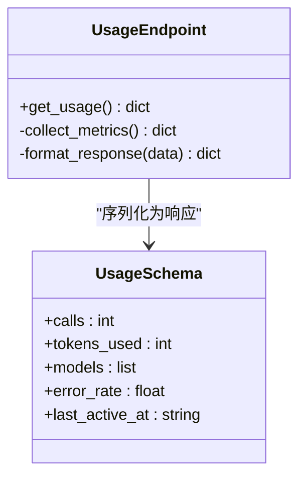
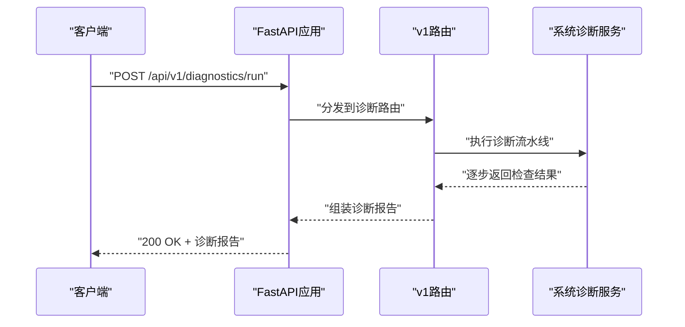
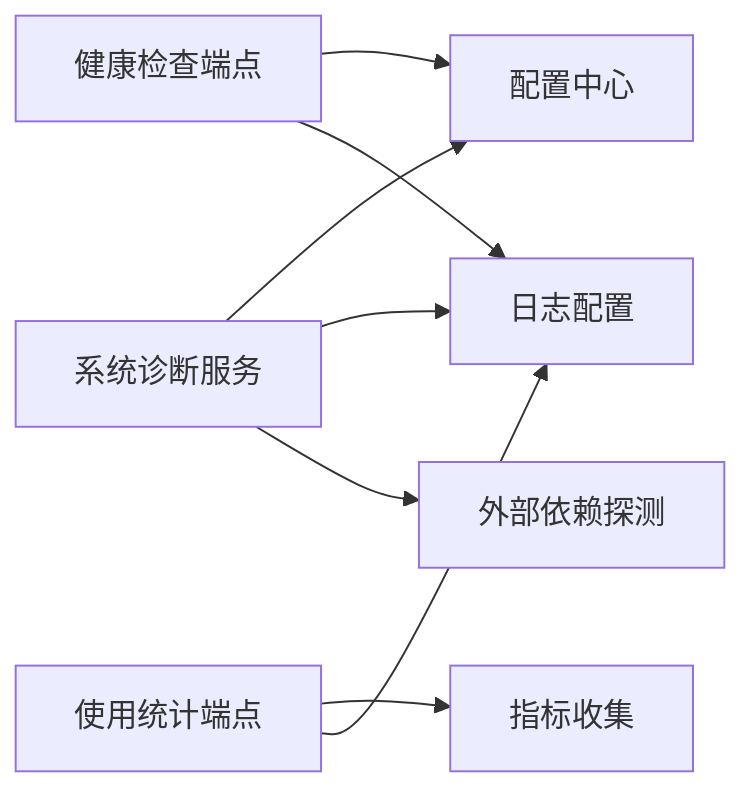

# 健康检查与监控API

<cite>
**本文引用的文件**   
- [main.py](file://main.py)
- [server.py](file://server.py)
- [api/app.py](file://api/app.py)
- [api/v1/router.py](file://api/v1/router.py)
- [api/v1/endpoints/health.py](file://api/v1/endpoints/health.py)
- [api/v1/endpoints/usage.py](file://api/v1/endpoints/usage.py)
- [api/v1/schemas/usage.py](file://api/v1/schemas/usage.py)
- [src/services/run_diagnostics.py](file://src/services/run_diagnostics.py)
- [src/logging_config.py](file://src/logging_config.py)
- [src/config.py](file://src/config.py)
- [tests/test_api_health.py](file://tests/test_api_health.py)
- [tests/test_usage_api.py](file://tests/test_usage_api.py)
</cite>

## 目录
1. [简介](#简介)
2. [项目结构](#项目结构)
3. [核心组件](#核心组件)
4. [架构总览](#架构总览)
5. [详细组件分析](#详细组件分析)
6. [依赖关系分析](#依赖关系分析)
7. [性能考虑](#性能考虑)
8. [故障排查指南](#故障排查指南)
9. [结论](#结论)
10. [附录](#附录)

## 简介
本文件面向系统运维与开发者，系统化说明“健康检查与监控API”的设计与实现，包括：
- 服务状态检测与健康检查端点
- 资源使用情况与性能指标监控接口
- 使用统计（Usage）接口
- 系统诊断功能
- 监控数据收集、告警配置与日志管理的技术要点
- 监控系统集成示例与常见故障排查

该文档以代码仓库中的实际实现为依据，提供端到端的调用流程、数据结构与最佳实践。

## 项目结构
与“健康检查与监控API”相关的后端入口与路由组织如下：
- 应用启动与中间件挂载由主程序与API应用装配
- v1版本路由集中注册各业务端点，包含健康检查与使用统计
- 健康检查与使用统计的处理器分别位于独立模块中
- 系统诊断能力通过服务层暴露
- 日志与配置为支撑性基础设施

**图表来源** 
- [main.py](file://main.py)
- [api/app.py](file://api/app.py)
- [api/v1/router.py](file://api/v1/router.py)
- [api/v1/endpoints/health.py](file://api/v1/endpoints/health.py)
- [api/v1/endpoints/usage.py](file://api/v1/endpoints/usage.py)
- [api/v1/schemas/usage.py](file://api/v1/schemas/usage.py)
- [src/services/run_diagnostics.py](file://src/services/run_diagnostics.py)
- [src/logging_config.py](file://src/logging_config.py)
- [src/config.py](file://src/config.py)

**章节来源**
- [main.py](file://main.py)
- [api/app.py](file://api/app.py)
- [api/v1/router.py](file://api/v1/router.py)

## 核心组件
- 健康检查端点：提供进程存活、依赖可达性与基础运行状态的快速探测
- 使用统计端点：汇总并返回关键使用量与配额信息（如LLM调用次数、令牌消耗等）
- 系统诊断服务：执行多维度自检（配置、外部依赖、存储、调度任务等），输出结构化诊断报告
- 日志与配置：统一日志级别、输出格式与配置加载策略，保障可观测性与稳定性

**章节来源**
- [api/v1/endpoints/health.py](file://api/v1/endpoints/health.py)
- [api/v1/endpoints/usage.py](file://api/v1/endpoints/usage.py)
- [api/v1/schemas/usage.py](file://api/v1/schemas/usage.py)
- [src/services/run_diagnostics.py](file://src/services/run_diagnostics.py)
- [src/logging_config.py](file://src/logging_config.py)
- [src/config.py](file://src/config.py)

## 架构总览
健康检查与监控API采用分层设计：HTTP端点负责请求解析与响应序列化；服务层封装业务逻辑；基础设施层提供日志与配置。监控数据来源于运行时指标、外部依赖探测与内部计数器。

**图表来源** 
- [api/app.py](file://api/app.py)
- [api/v1/router.py](file://api/v1/router.py)
- [api/v1/endpoints/health.py](file://api/v1/endpoints/health.py)
- [api/v1/endpoints/usage.py](file://api/v1/endpoints/usage.py)
- [src/services/run_diagnostics.py](file://src/services/run_diagnostics.py)

## 详细组件分析

### 健康检查端点（/api/v1/health）
- 功能：快速判断服务是否可用、关键依赖是否可达、基础运行环境是否正常
- 典型返回字段：服务状态、时间戳、依赖项状态（数据库、缓存、外部API等）、负载指标摘要
- 使用方式：
  - GET /api/v1/health
  - 用于负载均衡器探针、容器编排健康检查、自动化巡检
- 错误处理：
  - 依赖不可达时仍返回健康状态但标记对应依赖为异常
  - 超时或IO错误记录日志并返回部分健康信息

**图表来源** 
- [api/v1/endpoints/health.py](file://api/v1/endpoints/health.py)

**章节来源**
- [api/v1/endpoints/health.py](file://api/v1/endpoints/health.py)
- [tests/test_api_health.py](file://tests/test_api_health.py)

### 使用统计端点（/api/v1/usage）
- 功能：汇总当前周期内的使用量与配额信息，便于计费、限流与容量规划
- 典型返回字段：调用次数、令牌消耗、模型分布、错误率、最近活跃时间
- 使用方式：
  - GET /api/v1/usage
  - 支持按维度过滤（可选参数）
- 数据源：
  - 内部计数器与事件总线
  - LLM适配器追踪（如调用计数、令牌用量）
- 错误处理：
  - 计数器初始化未完成时返回空集合或默认值
  - 外部依赖读取失败时降级返回本地缓存

**图表来源** 
- [api/v1/endpoints/usage.py](file://api/v1/endpoints/usage.py)
- [api/v1/schemas/usage.py](file://api/v1/schemas/usage.py)

**章节来源**
- [api/v1/endpoints/usage.py](file://api/v1/endpoints/usage.py)
- [api/v1/schemas/usage.py](file://api/v1/schemas/usage.py)
- [tests/test_usage_api.py](file://tests/test_usage_api.py)

### 系统诊断服务（/api/v1/diagnostics）
- 功能：执行多维度自检，生成结构化诊断报告，辅助定位问题
- 检查项：
  - 配置校验（环境变量、配置文件）
  - 外部依赖连通性（数据库、缓存、消息队列、第三方API）
  - 存储可用性（本地磁盘、对象存储）
  - 调度任务状态（定时任务、后台作业）
  - 日志与告警通道连通性
- 使用方式：
  - POST /api/v1/diagnostics/run
  - 返回诊断步骤、状态、耗时与建议
- 错误处理：
  - 单项失败不影响整体诊断流程
  - 关键失败项附带建议与修复指引

**图表来源** 
- [api/v1/router.py](file://api/v1/router.py)
- [src/services/run_diagnostics.py](file://src/services/run_diagnostics.py)

**章节来源**
- [src/services/run_diagnostics.py](file://src/services/run_diagnostics.py)

### 日志管理与监控数据收集
- 日志配置：
  - 统一日志级别、格式化与输出目标（控制台、文件、远程收集）
  - 结构化日志便于接入ELK、Prometheus等
- 监控数据收集：
  - 指标采集点：请求延迟、错误率、资源占用（CPU、内存、磁盘）
  - 上报机制：定期推送至监控系统（Prometheus、Grafana、云监控）
- 告警配置：
  - 阈值规则：基于指标变化与历史基线
  - 通知渠道：邮件、短信、IM工具、Webhook

**章节来源**
- [src/logging_config.py](file://src/logging_config.py)
- [src/config.py](file://src/config.py)

## 依赖关系分析
健康检查与监控API的依赖关系清晰，低耦合高内聚：
- HTTP层仅负责路由与序列化
- 服务层封装业务逻辑与外部依赖
- 基础设施层提供日志与配置

**图表来源** 
- [api/v1/endpoints/health.py](file://api/v1/endpoints/health.py)
- [api/v1/endpoints/usage.py](file://api/v1/endpoints/usage.py)
- [src/services/run_diagnostics.py](file://src/services/run_diagnostics.py)
- [src/logging_config.py](file://src/logging_config.py)
- [src/config.py](file://src/config.py)

**章节来源**
- [api/v1/router.py](file://api/v1/router.py)
- [api/app.py](file://api/app.py)

## 性能考虑
- 健康检查应轻量无阻塞，避免引入额外IO
- 使用统计接口需异步采集与缓存，避免热点竞争
- 诊断任务支持分页与增量检查，减少单次开销
- 指标上报批量合并与去抖，降低网络压力
- 合理设置超时与重试策略，提升鲁棒性

[本节为通用指导，不直接分析具体文件]

## 故障排查指南
- 健康检查失败：
  - 检查依赖连通性（数据库、缓存、外部API）
  - 查看日志中的错误堆栈与超时信息
  - 确认资源配置与环境变量正确
- 使用统计为空或不准确：
  - 验证指标采集器是否启动
  - 检查计数器初始化与持久化
  - 核对外部依赖读取权限
- 诊断报告异常：
  - 逐项检查诊断步骤的状态与建议
  - 关注关键失败项的修复指引
  - 复现问题并收集上下文日志

**章节来源**
- [tests/test_api_health.py](file://tests/test_api_health.py)
- [tests/test_usage_api.py](file://tests/test_usage_api.py)
- [src/logging_config.py](file://src/logging_config.py)

## 结论
健康检查与监控API为系统稳定性与可观测性提供了坚实基础。通过标准化的健康探测、使用统计与诊断能力，结合统一的日志与配置管理，能够有效支撑生产环境的监控、告警与故障定位。建议持续完善指标覆盖度与告警规则，确保系统在复杂场景下的可靠性与可维护性。

[本节为总结性内容，不直接分析具体文件]

## 附录
- 常用端点清单：
  - GET /api/v1/health：健康检查
  - GET /api/v1/usage：使用统计
  - POST /api/v1/diagnostics/run：系统诊断
- 集成示例：
  - Prometheus抓取指标
  - Grafana可视化面板
  - 告警规则与通知渠道配置
- 最佳实践：
  - 健康检查保持轻量
  - 指标采集异步化
  - 诊断任务幂等与可重试
  - 日志结构化与分级

[本节为补充信息，不直接分析具体文件]