# 加密货币交易API

<cite>
**本文引用的文件**   
- [api/v1/endpoints/crypto_trading.py](file://api/v1/endpoints/crypto_trading.py)
- [api/v1/schemas/crypto_trading.py](file://api/v1/schemas/crypto_trading.py)
- [src/services/crypto_market_data_service.py](file://src/services/crypto_market_data_service.py)
- [src/storage.py](file://src/storage.py)
- [data_provider/crypto_fetcher.py](file://data_provider/crypto_fetcher.py)
- [data_provider/crypto_ws_quote.py](file://data_provider/crypto_ws_quote.py)
- [src/services/crypto_trading_service.py](file://src/services/crypto_trading_service.py)
- [src/core/crypto_backtest_engine.py](file://src/core/crypto_backtest_engine.py)
- [src/crypto_technical.py](file://src/crypto_technical.py)
- [apps/dsa-web/src/api/cryptoTrading.ts](file://apps/dsa-web/src/api/cryptoTrading.ts)
- [apps/dsa-web/src/types/cryptoTrading.ts](file://apps/dsa-web/src/types/cryptoTrading.ts)
- [server.py](file://server.py)
- [src/services/btc_shadow_forecast_service.py](file://src/services/btc_shadow_forecast_service.py)
- [src/core/pipeline.py](file://src/core/pipeline.py)
</cite>

## 更新摘要
**所做更改**
- 新增BTC影子预测服务集成到主分析管道，支持条件执行、上下文注入和错误处理机制
- 增强CryptoOhlcvBar模型支持现货和永续合约的执行价格、标记价格和资金费率
- 改进管道集成，使用CryptoMarketDataService替代直接调用CryptoFetcher
- 更新数据持久化和缓存机制以支持更丰富的市场数据结构
- 改进永续合约数据处理，包括执行价格与标记价格的分离处理

## 目录
1. [简介](#简介)
2. [项目结构](#项目结构)
3. [核心组件](#核心组件)
4. [架构总览](#架构总览)
5. [详细组件分析](#详细组件分析)
6. [依赖关系分析](#依赖关系分析)
7. [性能考量](#性能考量)
8. [故障排查指南](#故障排查指南)
9. [结论](#结论)
10. [附录](#附录)

## 简介
本文件为加密货币交易相关API的完整文档，覆盖行情获取、技术指标计算、交易信号生成、WebSocket实时数据推送、订单管理与风险控制等能力。面向开发者与集成方提供清晰的接口规范、数据模型说明、调用示例与最佳实践，帮助快速构建稳定高效的加密交易系统。

**更新** 新增了BTC影子预测服务集成到主分析管道，支持条件执行、上下文注入和错误处理机制，同时增强了现货和永续合约的数据处理能力。

## 项目结构
本项目采用前后端分离与模块化设计：
- API层：基于FastAPI的路由与Pydantic数据模型，定义REST接口与请求/响应结构。
- 服务层：封装业务逻辑（如交易服务、回测引擎、风控策略）。
- 数据层：统一的数据获取器（历史/实时）与WebSocket行情订阅。
- Web前端：TypeScript客户端封装API调用与类型定义。

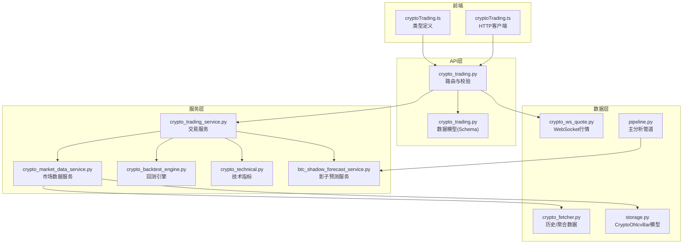

**图表来源**
- [api/v1/endpoints/crypto_trading.py](file://api/v1/endpoints/crypto_trading.py)
- [api/v1/schemas/crypto_trading.py](file://api/v1/schemas/crypto_trading.py)
- [src/services/crypto_market_data_service.py](file://src/services/crypto_market_data_service.py)
- [src/storage.py](file://src/storage.py)
- [data_provider/crypto_fetcher.py](file://data_provider/crypto_fetcher.py)
- [data_provider/crypto_ws_quote.py](file://data_provider/crypto_ws_quote.py)
- [src/services/btc_shadow_forecast_service.py](file://src/services/btc_shadow_forecast_service.py)
- [src/core/pipeline.py](file://src/core/pipeline.py)

章节来源
- [server.py](file://server.py)

## 核心组件
- **增强型行情获取**：支持多交易所历史K线与实时报价，具备本地缓存与降级策略，支持现货和永续合约的不同价格类型。
- **高级技术指标**：内置常用指标（如MA、RSI、MACD、布林带等），支持自定义参数和多时间框架分析。
- **智能交易信号**：基于规则或策略组合生成买卖信号，附带置信度与风险提示，支持永续合约的资金费率考虑。
- **BTC影子预测服务**：独立的观察型预测服务，提供小时线级别的BTC收益预测，不影响实际交易决策。
- **WebSocket推送**：低延迟行情流，支持频道订阅与断线重连。
- **订单管理**：下单、撤单、查询订单状态与成交回报。
- **风险控制**：仓位控制、止损止盈、波动率监控与熔断机制。

**更新** 现在支持区分执行价格和标记价格，特别适用于永续合约交易场景，并集成了BTC影子预测服务用于离线校准和历史诊断。

章节来源
- [api/v1/endpoints/crypto_trading.py](file://api/v1/endpoints/crypto_trading.py)
- [api/v1/schemas/crypto_trading.py](file://api/v1/schemas/crypto_trading.py)
- [src/services/crypto_market_data_service.py](file://src/services/crypto_market_data_service.py)
- [src/storage.py](file://src/storage.py)
- [src/services/btc_shadow_forecast_service.py](file://src/services/btc_shadow_forecast_service.py)

## 架构总览
系统分层清晰，职责单一，便于扩展与维护。API层负责协议与校验；服务层编排业务；数据层屏蔽底层差异；前端通过TS客户端调用。

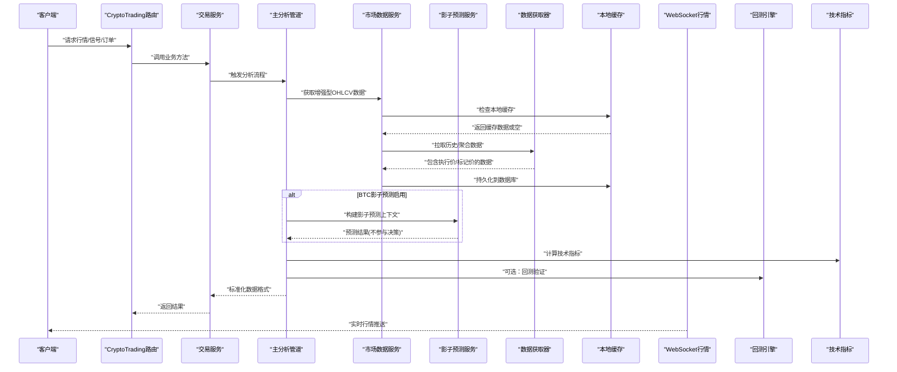

**图表来源**
- [api/v1/endpoints/crypto_trading.py](file://api/v1/endpoints/crypto_trading.py)
- [src/services/crypto_market_data_service.py](file://src/services/crypto_market_data_service.py)
- [src/storage.py](file://src/storage.py)
- [data_provider/crypto_fetcher.py](file://data_provider/crypto_fetcher.py)
- [data_provider/crypto_ws_quote.py](file://data_provider/crypto_ws_quote.py)
- [src/services/btc_shadow_forecast_service.py](file://src/services/btc_shadow_forecast_service.py)
- [src/core/pipeline.py](file://src/core/pipeline.py)

## 详细组件分析

### 增强型行情获取API
- **功能**：获取指定币种的历史K线、聚合数据与最新报价，支持现货和永续合约的不同价格类型。
- **输入**：交易对、时间范围、周期、数据源偏好、工具类型（spot/perpetual）。
- **输出**：标准化OHLCV数据，包含执行价格和执行价格、标记价格（永续合约）、统计摘要、数据质量标记。
- **错误处理**：网络异常、数据缺失、格式校验失败。

**更新** 现在支持区分执行价格（用于实际交易）和标记价格（用于永续合约估值），并包含资金费率信息。

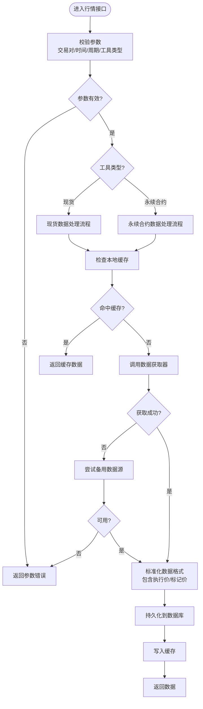

**图表来源**
- [api/v1/endpoints/crypto_trading.py](file://api/v1/endpoints/crypto_trading.py)
- [src/services/crypto_market_data_service.py](file://src/services/crypto_market_data_service.py)
- [data_provider/crypto_fetcher.py](file://data_provider/crypto_fetcher.py)

章节来源
- [api/v1/endpoints/crypto_trading.py](file://api/v1/endpoints/crypto_trading.py)
- [src/services/crypto_market_data_service.py](file://src/services/crypto_market_data_service.py)
- [data_provider/crypto_fetcher.py](file://data_provider/crypto_fetcher.py)

### BTC影子预测服务 - BtcShadowForecastService
- **功能**：提供BTC小时线级别的收益预测，仅用于离线校准和历史诊断，不参与实际交易决策。
- **特性**：使用扩展式滚动窗口验证、训练集独立缩放、严格的泄漏防护。
- **配置**：支持最小训练数据量、折叠数量、验证数据量的灵活配置。
- **输出**：包含预期收益率、上涨概率、方向预测和交叉验证结果。

**更新** 现已集成到主分析管道中，支持条件执行、上下文注入和完善的错误处理机制。

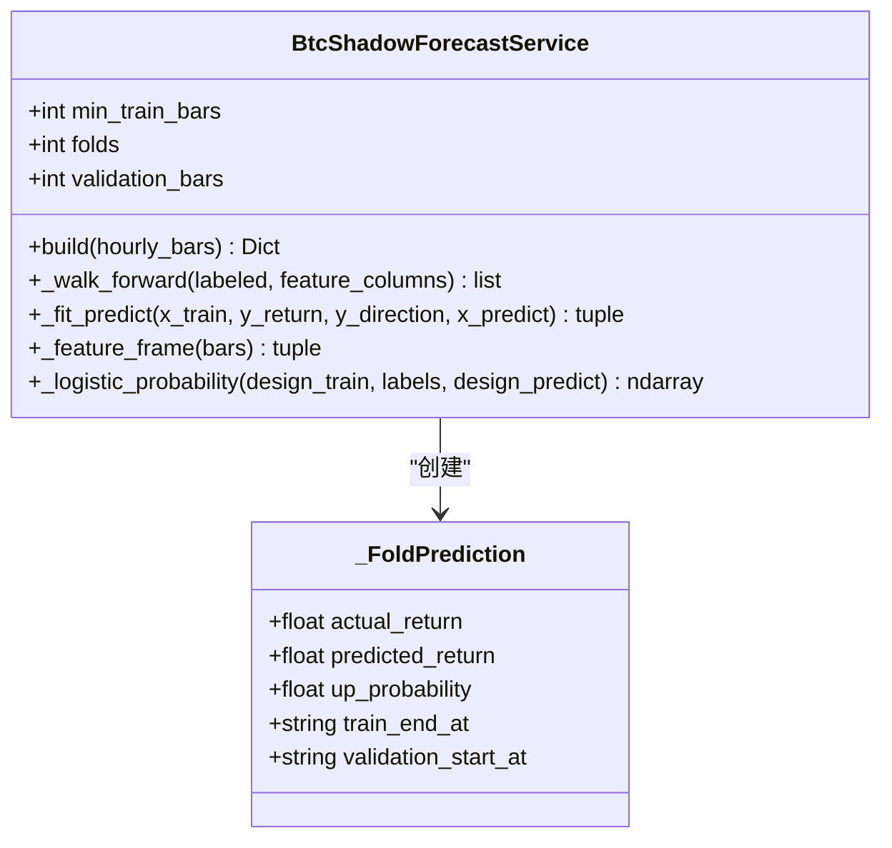

**图表来源**
- [src/services/btc_shadow_forecast_service.py](file://src/services/btc_shadow_forecast_service.py)

章节来源
- [src/services/btc_shadow_forecast_service.py](file://src/services/btc_shadow_forecast_service.py)

### 管道集成 - 影子预测服务集成
- **功能**：在主分析管道中集成BTC影子预测服务，支持条件执行和错误处理。
- **条件执行**：通过`btc_shadow_forecast_enabled`配置项控制是否启用。
- **上下文注入**：将影子预测结果注入到分析上下文中，但不影响实际决策。
- **错误处理**：预测失败时记录警告日志，继续使用现有技术面上下文。

**更新** 现在在BTC分析流程中自动检测并执行影子预测，确保数据质量和预测准确性。

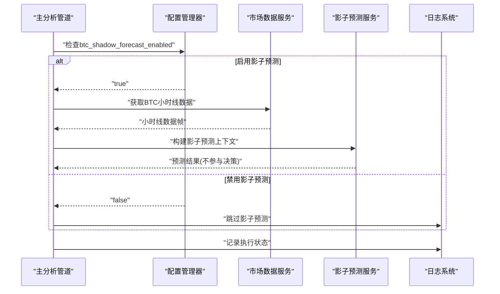

**图表来源**
- [src/core/pipeline.py](file://src/core/pipeline.py)
- [src/services/btc_shadow_forecast_service.py](file://src/services/btc_shadow_forecast_service.py)

章节来源
- [src/core/pipeline.py](file://src/core/pipeline.py)
- [src/services/btc_shadow_forecast_service.py](file://src/services/btc_shadow_forecast_service.py)

### 增强型数据模型 - CryptoOhlcvBar
- **功能**：存储加密货币OHLCV数据的数据库模型，支持现货和永续合约的完整价格信息。
- **字段**：基础OHLCV字段 + 执行价格字段 + 标记价格字段 + 资金费率字段。
- **索引**：支持按代码、交易所、工具类型、价格类型、周期和时间的高效查询。
- **约束**：唯一性约束确保数据完整性。

**更新** 新增了对永续合约特有的执行价格、标记价格和资金费率的支持。

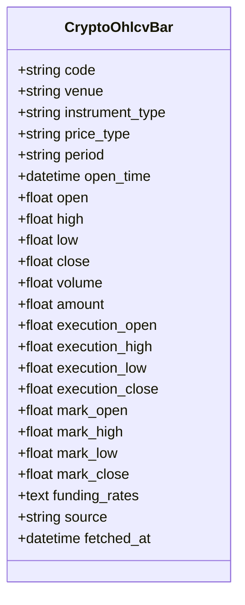

**图表来源**
- [src/storage.py](file://src/storage.py)

章节来源
- [src/storage.py](file://src/storage.py)

### 市场数据服务 - CryptoMarketDataService
- **功能**：提供统一的加密货币市场数据访问接口，整合本地缓存和远程数据源。
- **特性**：自动缓存管理、数据完整性检查、多时间框架支持。
- **优化**：增量更新、去重处理、错误恢复机制。

**更新** 现在专门处理现货和永续合约的不同数据结构，支持执行价格和标记价格的分离处理。

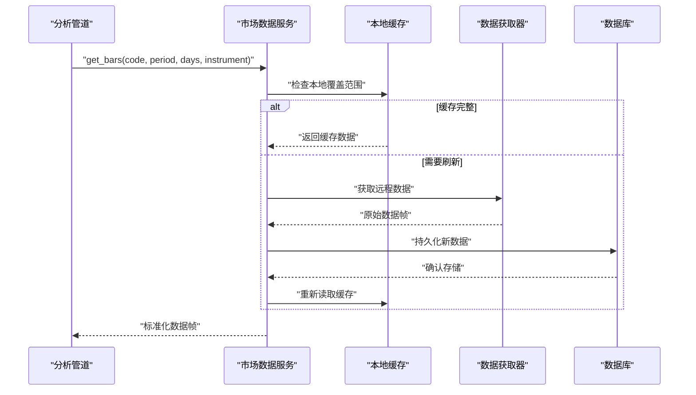

**图表来源**
- [src/services/crypto_market_data_service.py](file://src/services/crypto_market_data_service.py)
- [src/storage.py](file://src/storage.py)

章节来源
- [src/services/crypto_market_data_service.py](file://src/services/crypto_market_data_service.py)

### 技术指标计算API
- **功能**：计算移动平均、动量、波动率等指标，支持批量与滑动窗口。
- **输入**：时间序列、指标类型、参数配置。
- **输出**：指标值序列、阈值触发点、信号强度。
- **优化**：向量化计算、增量更新、缓存中间结果。

**更新** 现在支持基于执行价格和标记价格的差异化指标计算，特别适用于永续合约分析。

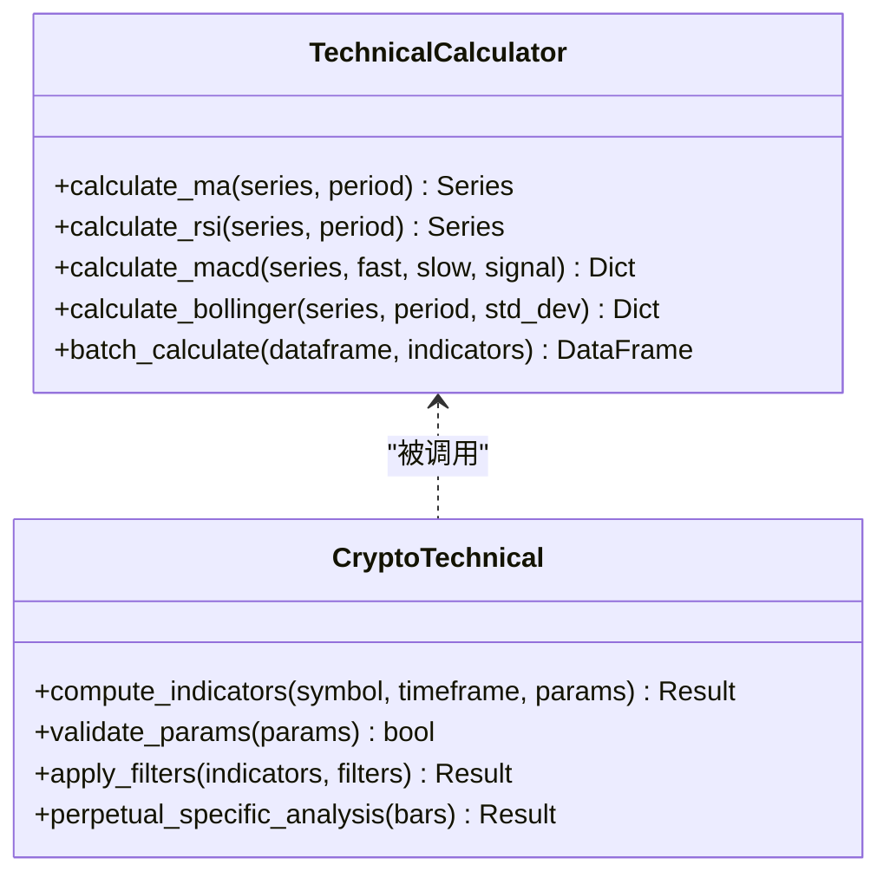

**图表来源**
- [src/crypto_technical.py](file://src/crypto_technical.py)

章节来源
- [src/crypto_technical.py](file://src/crypto_technical.py)

### 交易信号生成API
- **功能**：结合技术指标与市场上下文生成买卖信号，包含置信度与风险等级。
- **输入**：标的、时间框架、策略配置、风控参数。
- **输出**：信号类型、入场价、止损止盈位、建议仓位、理由说明。
- **可解释性**：提供决策依据与关键指标快照。

**更新** 现在考虑永续合约的资金费率和标记价格溢价，提供更准确的交易信号，并集成影子预测结果用于辅助分析。

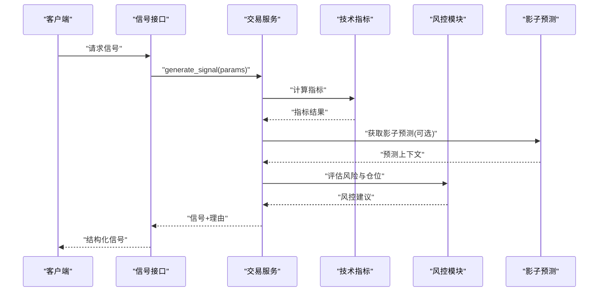

**图表来源**
- [api/v1/endpoints/crypto_trading.py](file://api/v1/endpoints/crypto_trading.py)
- [src/services/crypto_trading_service.py](file://src/services/crypto_trading_service.py)
- [src/crypto_technical.py](file://src/crypto_technical.py)
- [src/services/btc_shadow_forecast_service.py](file://src/services/btc_shadow_forecast_service.py)

章节来源
- [api/v1/endpoints/crypto_trading.py](file://api/v1/endpoints/crypto_trading.py)
- [src/services/crypto_trading_service.py](file://src/services/crypto_trading_service.py)

### WebSocket实时数据推送
- **功能**：订阅实时报价、深度、成交流，支持频道过滤与心跳保活。
- **连接**：建立WS连接，鉴权后订阅频道。
- **消息**：标准化JSON格式，含时间戳、交易所标识、数据负载。
- **容错**：自动重连、断线检测、消息去重。

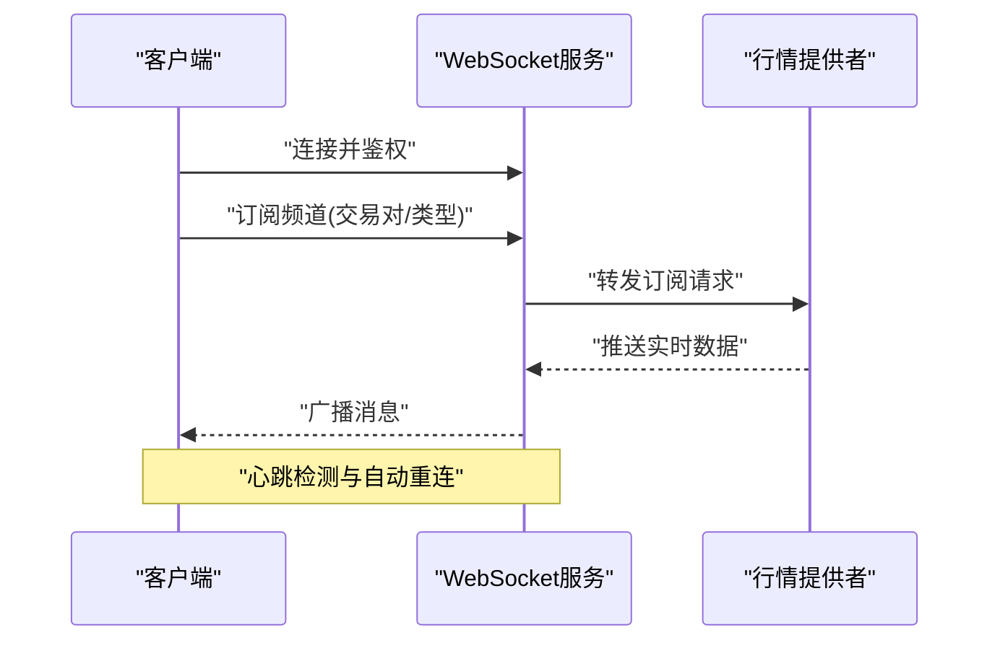

**图表来源**
- [data_provider/crypto_ws_quote.py](file://data_provider/crypto_ws_quote.py)

章节来源
- [data_provider/crypto_ws_quote.py](file://data_provider/crypto_ws_quote.py)

### 订单管理API
- **功能**：下单、撤单、修改订单、查询订单状态与成交记录。
- **输入**：交易对、方向、数量、价格类型、附加参数。
- **输出**：订单ID、状态、预估费用、滑点提示。
- **安全**：签名校验、速率限制、幂等性保障。

**图表来源**
- [api/v1/endpoints/crypto_trading.py](file://api/v1/endpoints/crypto_trading.py)
- [src/services/crypto_trading_service.py](file://src/services/crypto_trading_service.py)

章节来源
- [api/v1/endpoints/crypto_trading.py](file://api/v1/endpoints/crypto_trading.py)
- [src/services/crypto_trading_service.py](file://src/services/crypto_trading_service.py)

### 风险控制API
- **功能**：动态仓位管理、止损止盈、波动率监控、熔断开关。
- **输入**：账户余额、持仓、市场波动、策略风险偏好。
- **输出**：调整建议、强制平仓信号、告警事件。
- **审计**：全链路日志与可追溯决策记录。

**更新** 现在考虑永续合约的资金费率和标记价格，提供更精确的风险评估，并集成影子预测结果用于风险评估参考。

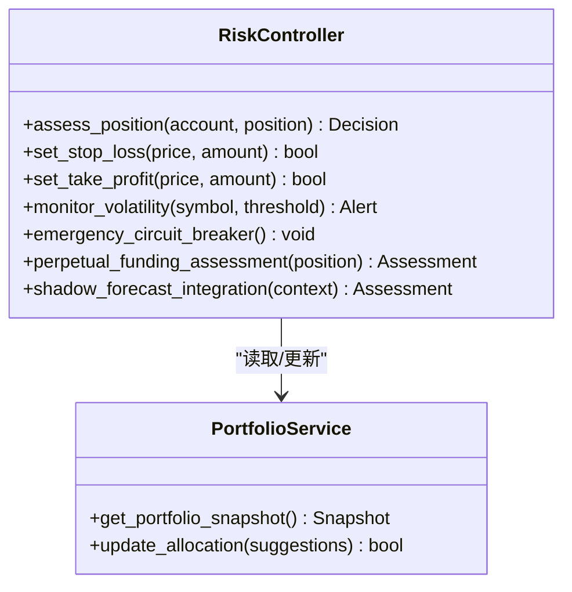

**图表来源**
- [src/services/crypto_trading_service.py](file://src/services/crypto_trading_service.py)

章节来源
- [src/services/crypto_trading_service.py](file://src/services/crypto_trading_service.py)

### 回测引擎（加密专用）
- **功能**：基于历史数据进行策略回测，评估收益、回撤、胜率等。
- **输入**：策略参数、时间范围、手续费模型、滑点设置。
- **输出**：回测报告、交易明细、绩效指标、可视化图表数据。

**更新** 现在支持区分执行价格和标记价格进行更精确的回测，特别适用于永续合约策略，并支持影子预测结果的验证。

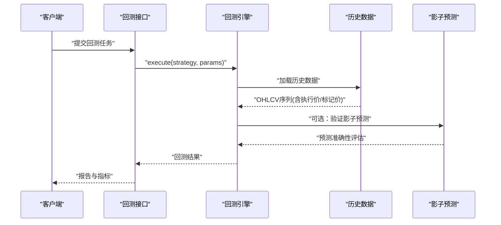

**图表来源**
- [src/core/crypto_backtest_engine.py](file://src/core/crypto_backtest_engine.py)
- [data_provider/crypto_fetcher.py](file://data_provider/crypto_fetcher.py)
- [src/services/btc_shadow_forecast_service.py](file://src/services/btc_shadow_forecast_service.py)

章节来源
- [src/core/crypto_backtest_engine.py](file://src/core/crypto_backtest_engine.py)

## 依赖关系分析
- API层依赖服务层进行业务编排，服务层依赖数据层与工具库。
- 前端通过TS客户端调用API，类型定义与服务端Schema保持一致。
- WebSocket独立于HTTP，提供低延迟通道。
- **更新** 市场数据服务作为中间层，统一管理本地缓存和远程数据源，影子预测服务作为可选组件集成到主分析管道。

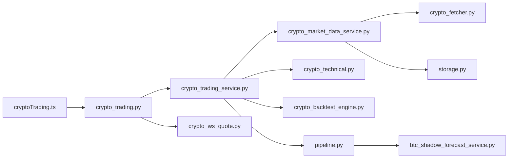

**图表来源**
- [apps/dsa-web/src/api/cryptoTrading.ts](file://apps/dsa-web/src/api/cryptoTrading.ts)
- [api/v1/endpoints/crypto_trading.py](file://api/v1/endpoints/crypto_trading.py)
- [src/services/crypto_market_data_service.py](file://src/services/crypto_market_data_service.py)
- [src/storage.py](file://src/storage.py)
- [data_provider/crypto_fetcher.py](file://data_provider/crypto_fetcher.py)
- [src/crypto_technical.py](file://src/crypto_technical.py)
- [src/core/crypto_backtest_engine.py](file://src/core/crypto_backtest_engine.py)
- [data_provider/crypto_ws_quote.py](file://data_provider/crypto_ws_quote.py)
- [src/core/pipeline.py](file://src/core/pipeline.py)
- [src/services/btc_shadow_forecast_service.py](file://src/services/btc_shadow_forecast_service.py)

章节来源
- [apps/dsa-web/src/api/cryptoTrading.ts](file://apps/dsa-web/src/api/cryptoTrading.ts)
- [apps/dsa-web/src/types/cryptoTrading.ts](file://apps/dsa-web/src/types/cryptoTrading.ts)

## 性能考量
- **数据层**：启用本地SQLite缓存、并行拉取、增量更新，降低延迟与带宽消耗。
- **计算层**：向量化指标计算、避免重复计算、使用内存映射大数组。
- **并发**：异步IO、连接池、限流与熔断保护。
- **存储**：冷热数据分层、压缩归档、索引优化。
- **更新** 新的市场数据服务提供了更智能的缓存策略和数据完整性检查，影子预测服务采用轻量级numpy模型确保高性能。

## 故障排查指南
- **常见错误**：参数校验失败、数据源不可用、签名错误、超时与重试。
- **诊断步骤**：检查日志、验证配置、模拟请求、逐步隔离组件。
- **恢复策略**：切换数据源、降级模式、人工干预开关。
- **更新** 现在可以检查本地缓存状态和数据完整性，影子预测服务的错误会被记录但不会中断主分析流程。

章节来源
- [api/v1/endpoints/crypto_trading.py](file://api/v1/endpoints/crypto_trading.py)
- [src/services/crypto_market_data_service.py](file://src/services/crypto_market_data_service.py)
- [src/core/pipeline.py](file://src/core/pipeline.py)

## 结论
本API体系以模块化与高内聚低耦合为原则，覆盖从数据到信号的完整链条，并提供WebSocket实时能力与完善的风控机制。通过标准化Schema与类型定义，确保前后端一致性与可维护性。

**更新** 新的增强型数据模型和市场数据服务提供了更强大的加密货币交易支持，特别是对于永续合约交易的执行价格与标记价格分离处理，以及资金费率的考虑。BTC影子预测服务的集成为主分析管道提供了额外的观察型预测能力，可用于离线校准和历史诊断，而不影响实际交易决策。建议在生产环境启用缓存、监控与告警，持续优化性能与稳定性。

## 附录
- **集成指南**：前端使用TS客户端封装HTTP调用，遵循类型定义进行开发。
- **数据处理示例**：参考历史数据拉取与指标计算流程，结合缓存与降级策略。
- **最佳实践**：合理设置超时与重试、使用幂等键、记录关键决策日志。
- **更新** 建议使用CryptoMarketDataService而非直接调用CryptoFetcher，以获得更好的缓存管理和数据一致性保证。影子预测服务可通过配置项灵活启用或禁用。

章节来源
- [apps/dsa-web/src/api/cryptoTrading.ts](file://apps/dsa-web/src/api/cryptoTrading.ts)
- [apps/dsa-web/src/types/cryptoTrading.ts](file://apps/dsa-web/src/types/cryptoTrading.ts)
- [src/services/crypto_market_data_service.py](file://src/services/crypto_market_data_service.py)
- [src/services/btc_shadow_forecast_service.py](file://src/services/btc_shadow_forecast_service.py)
- [src/core/pipeline.py](file://src/core/pipeline.py)