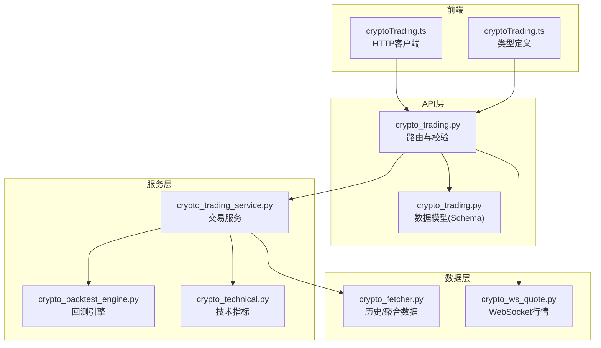
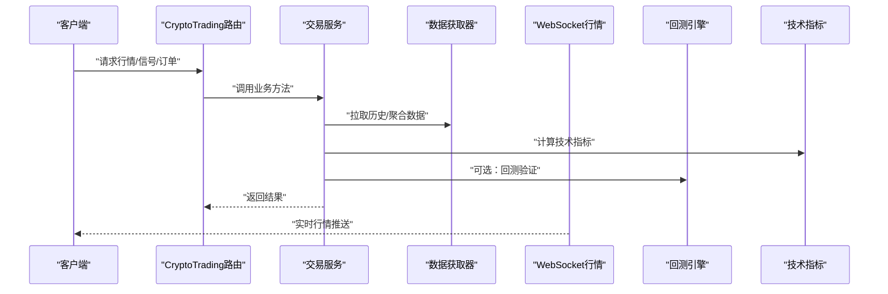
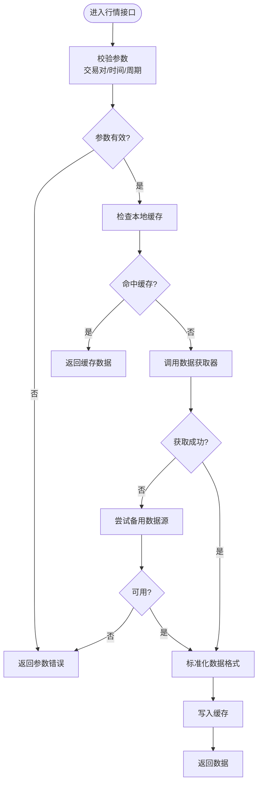
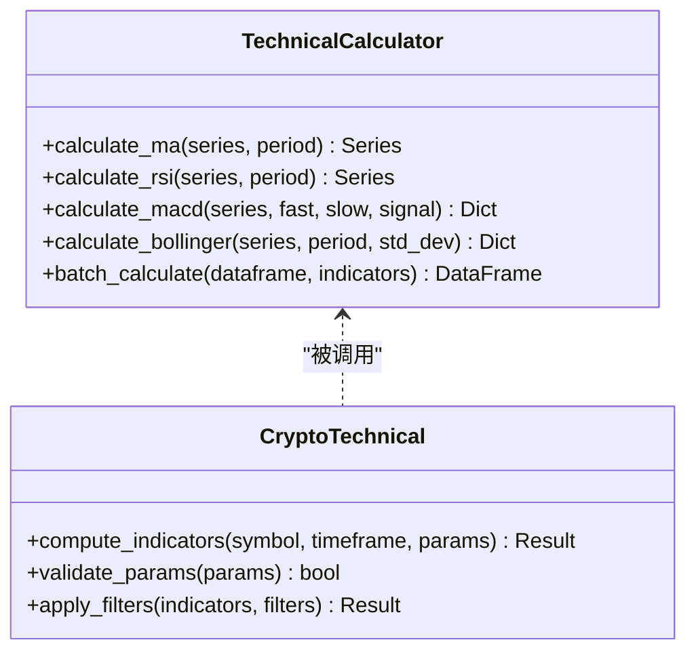
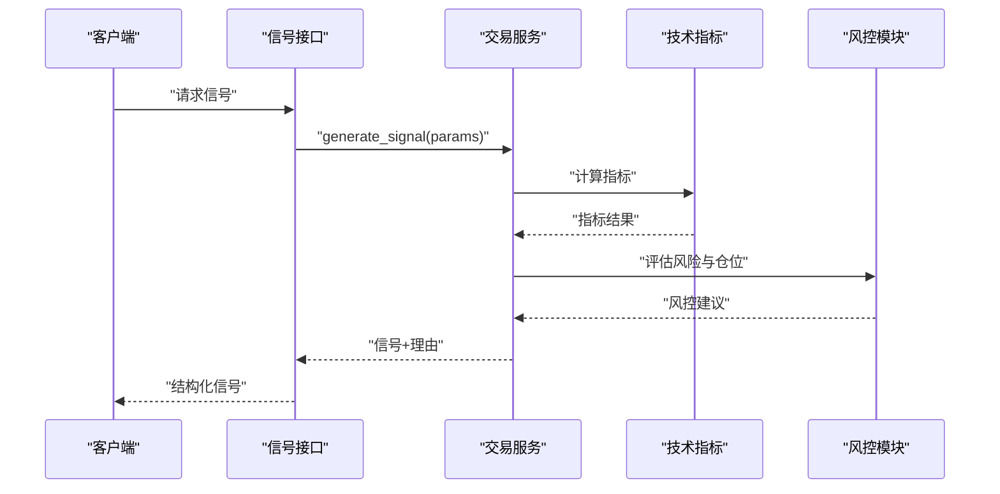
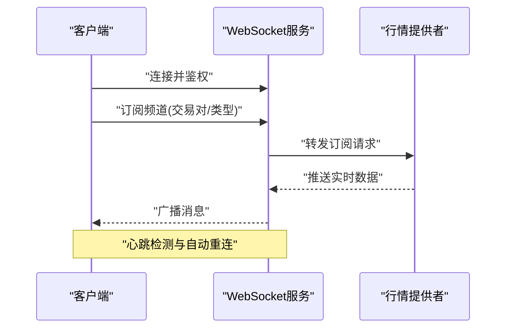
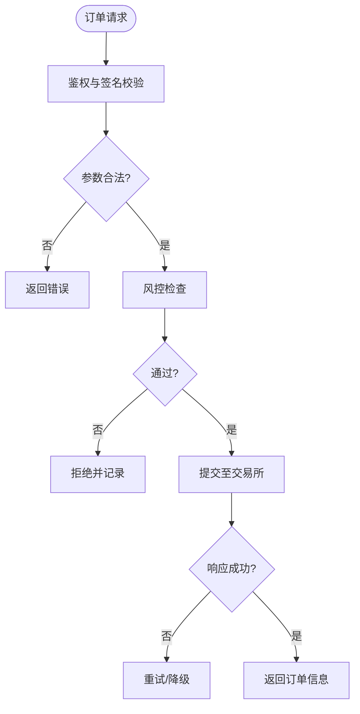
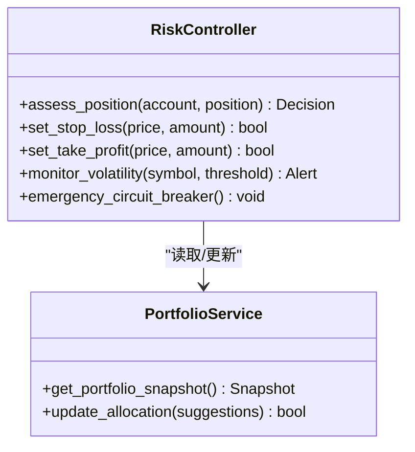
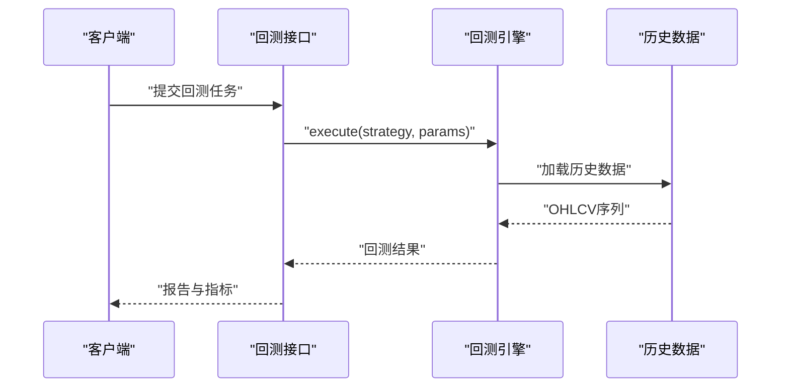
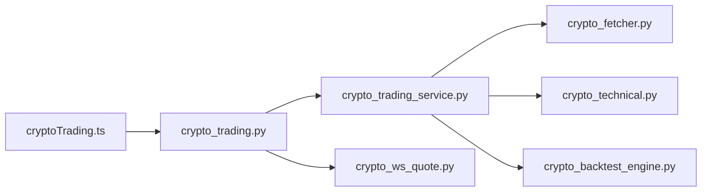

# 加密货币交易API

<cite>
**本文引用的文件**   
- [api/v1/endpoints/crypto_trading.py](file://api/v1/endpoints/crypto_trading.py)
- [api/v1/schemas/crypto_trading.py](file://api/v1/schemas/crypto_trading.py)
- [data_provider/crypto_fetcher.py](file://data_provider/crypto_fetcher.py)
- [data_provider/crypto_ws_quote.py](file://data_provider/crypto_ws_quote.py)
- [src/services/crypto_trading_service.py](file://src/services/crypto_trading_service.py)
- [src/core/crypto_backtest_engine.py](file://src/core/crypto_backtest_engine.py)
- [src/crypto_technical.py](file://src/crypto_technical.py)
- [apps/dsa-web/src/api/cryptoTrading.ts](file://apps/dsa-web/src/api/cryptoTrading.ts)
- [apps/dsa-web/src/types/cryptoTrading.ts](file://apps/dsa-web/src/types/cryptoTrading.ts)
- [server.py](file://server.py)
</cite>

## 目录
1. [简介](#简介)
2. [项目结构](#项目结构)
3. [核心组件](#核心组件)
4. [架构总览](#架构总览)
5. [详细组件分析](#详细组件分析)
6. [依赖关系分析](#依赖关系分析)
7. [性能考量](#性能考量)
8. [故障排查指南](#故障排查指南)
9. [结论](#结论)
10. [附录](#附录)

## 简介
本文件为加密货币交易相关API的完整文档，覆盖行情获取、技术指标计算、交易信号生成、WebSocket实时数据推送、订单管理与风险控制等能力。面向开发者与集成方提供清晰的接口规范、数据模型说明、调用示例与最佳实践，帮助快速构建稳定高效的加密交易系统。

## 项目结构
本项目采用前后端分离与模块化设计：
- API层：基于FastAPI的路由与Pydantic数据模型，定义REST接口与请求/响应结构。
- 服务层：封装业务逻辑（如交易服务、回测引擎、风控策略）。
- 数据层：统一的数据获取器（历史/实时）与WebSocket行情订阅。
- Web前端：TypeScript客户端封装API调用与类型定义。

图表来源
- [api/v1/endpoints/crypto_trading.py](file://api/v1/endpoints/crypto_trading.py)
- [api/v1/schemas/crypto_trading.py](file://api/v1/schemas/crypto_trading.py)
- [src/services/crypto_trading_service.py](file://src/services/crypto_trading_service.py)
- [src/core/crypto_backtest_engine.py](file://src/core/crypto_backtest_engine.py)
- [src/crypto_technical.py](file://src/crypto_technical.py)
- [data_provider/crypto_fetcher.py](file://data_provider/crypto_fetcher.py)
- [data_provider/crypto_ws_quote.py](file://data_provider/crypto_ws_quote.py)
- [apps/dsa-web/src/api/cryptoTrading.ts](file://apps/dsa-web/src/api/cryptoTrading.ts)
- [apps/dsa-web/src/types/cryptoTrading.ts](file://apps/dsa-web/src/types/cryptoTrading.ts)

章节来源
- [server.py](file://server.py)

## 核心组件
- 行情获取：支持多交易所历史K线与实时报价，具备缓存与降级策略。
- 技术指标：内置常用指标（如MA、RSI、MACD、布林带等），支持自定义参数。
- 交易信号：基于规则或策略组合生成买卖信号，附带置信度与风险提示。
- WebSocket推送：低延迟行情流，支持频道订阅与断线重连。
- 订单管理：下单、撤单、查询订单状态与成交回报。
- 风险控制：仓位控制、止损止盈、波动率监控与熔断机制。

章节来源
- [api/v1/endpoints/crypto_trading.py](file://api/v1/endpoints/crypto_trading.py)
- [api/v1/schemas/crypto_trading.py](file://api/v1/schemas/crypto_trading.py)
- [src/services/crypto_trading_service.py](file://src/services/crypto_trading_service.py)
- [src/crypto_technical.py](file://src/crypto_technical.py)
- [data_provider/crypto_fetcher.py](file://data_provider/crypto_fetcher.py)
- [data_provider/crypto_ws_quote.py](file://data_provider/crypto_ws_quote.py)

## 架构总览
系统分层清晰，职责单一，便于扩展与维护。API层负责协议与校验；服务层编排业务；数据层屏蔽底层差异；前端通过TS客户端调用。

图表来源
- [api/v1/endpoints/crypto_trading.py](file://api/v1/endpoints/crypto_trading.py)
- [src/services/crypto_trading_service.py](file://src/services/crypto_trading_service.py)
- [data_provider/crypto_fetcher.py](file://data_provider/crypto_fetcher.py)
- [src/crypto_technical.py](file://src/crypto_technical.py)
- [src/core/crypto_backtest_engine.py](file://src/core/crypto_backtest_engine.py)
- [data_provider/crypto_ws_quote.py](file://data_provider/crypto_ws_quote.py)

## 详细组件分析

### 行情获取API
- 功能：获取指定币种的历史K线、聚合数据与最新报价。
- 输入：交易对、时间范围、周期、数据源偏好。
- 输出：标准化OHLCV数据、统计摘要、数据质量标记。
- 错误处理：网络异常、数据缺失、格式校验失败。

图表来源
- [api/v1/endpoints/crypto_trading.py](file://api/v1/endpoints/crypto_trading.py)
- [data_provider/crypto_fetcher.py](file://data_provider/crypto_fetcher.py)

章节来源
- [api/v1/endpoints/crypto_trading.py](file://api/v1/endpoints/crypto_trading.py)
- [data_provider/crypto_fetcher.py](file://data_provider/crypto_fetcher.py)

### 技术指标计算API
- 功能：计算移动平均、动量、波动率等指标，支持批量与滑动窗口。
- 输入：时间序列、指标类型、参数配置。
- 输出：指标值序列、阈值触发点、信号强度。
- 优化：向量化计算、增量更新、缓存中间结果。

图表来源
- [src/crypto_technical.py](file://src/crypto_technical.py)

章节来源
- [src/crypto_technical.py](file://src/crypto_technical.py)

### 交易信号生成API
- 功能：结合技术指标与市场上下文生成买卖信号，包含置信度与风险等级。
- 输入：标的、时间框架、策略配置、风控参数。
- 输出：信号类型、入场价、止损止盈位、建议仓位、理由说明。
- 可解释性：提供决策依据与关键指标快照。

图表来源
- [api/v1/endpoints/crypto_trading.py](file://api/v1/endpoints/crypto_trading.py)
- [src/services/crypto_trading_service.py](file://src/services/crypto_trading_service.py)
- [src/crypto_technical.py](file://src/crypto_technical.py)

章节来源
- [api/v1/endpoints/crypto_trading.py](file://api/v1/endpoints/crypto_trading.py)
- [src/services/crypto_trading_service.py](file://src/services/crypto_trading_service.py)

### WebSocket实时数据推送
- 功能：订阅实时报价、深度、成交流，支持频道过滤与心跳保活。
- 连接：建立WS连接，鉴权后订阅频道。
- 消息：标准化JSON格式，含时间戳、交易所标识、数据负载。
- 容错：自动重连、断线检测、消息去重。

图表来源
- [data_provider/crypto_ws_quote.py](file://data_provider/crypto_ws_quote.py)

章节来源
- [data_provider/crypto_ws_quote.py](file://data_provider/crypto_ws_quote.py)

### 订单管理API
- 功能：下单、撤单、修改订单、查询订单状态与成交记录。
- 输入：交易对、方向、数量、价格类型、附加参数。
- 输出：订单ID、状态、预估费用、滑点提示。
- 安全：签名校验、速率限制、幂等性保障。

图表来源
- [api/v1/endpoints/crypto_trading.py](file://api/v1/endpoints/crypto_trading.py)
- [src/services/crypto_trading_service.py](file://src/services/crypto_trading_service.py)

章节来源
- [api/v1/endpoints/crypto_trading.py](file://api/v1/endpoints/crypto_trading.py)
- [src/services/crypto_trading_service.py](file://src/services/crypto_trading_service.py)

### 风险控制API
- 功能：动态仓位管理、止损止盈、波动率监控、熔断开关。
- 输入：账户余额、持仓、市场波动、策略风险偏好。
- 输出：调整建议、强制平仓信号、告警事件。
- 审计：全链路日志与可追溯决策记录。

图表来源
- [src/services/crypto_trading_service.py](file://src/services/crypto_trading_service.py)

章节来源
- [src/services/crypto_trading_service.py](file://src/services/crypto_trading_service.py)

### 回测引擎（加密专用）
- 功能：基于历史数据进行策略回测，评估收益、回撤、胜率等。
- 输入：策略参数、时间范围、手续费模型、滑点设置。
- 输出：回测报告、交易明细、绩效指标、可视化图表数据。

图表来源
- [src/core/crypto_backtest_engine.py](file://src/core/crypto_backtest_engine.py)
- [data_provider/crypto_fetcher.py](file://data_provider/crypto_fetcher.py)

章节来源
- [src/core/crypto_backtest_engine.py](file://src/core/crypto_backtest_engine.py)

## 依赖关系分析
- API层依赖服务层进行业务编排，服务层依赖数据层与工具库。
- 前端通过TS客户端调用API，类型定义与服务端Schema保持一致。
- WebSocket独立于HTTP，提供低延迟通道。

图表来源
- [apps/dsa-web/src/api/cryptoTrading.ts](file://apps/dsa-web/src/api/cryptoTrading.ts)
- [api/v1/endpoints/crypto_trading.py](file://api/v1/endpoints/crypto_trading.py)
- [src/services/crypto_trading_service.py](file://src/services/crypto_trading_service.py)
- [data_provider/crypto_fetcher.py](file://data_provider/crypto_fetcher.py)
- [src/crypto_technical.py](file://src/crypto_technical.py)
- [src/core/crypto_backtest_engine.py](file://src/core/crypto_backtest_engine.py)
- [data_provider/crypto_ws_quote.py](file://data_provider/crypto_ws_quote.py)

章节来源
- [apps/dsa-web/src/api/cryptoTrading.ts](file://apps/dsa-web/src/api/cryptoTrading.ts)
- [apps/dsa-web/src/types/cryptoTrading.ts](file://apps/dsa-web/src/types/cryptoTrading.ts)

## 性能考量
- 数据层：启用缓存、并行拉取、增量更新，降低延迟与带宽消耗。
- 计算层：向量化指标计算、避免重复计算、使用内存映射大数组。
- 并发：异步IO、连接池、限流与熔断保护。
- 存储：冷热数据分层、压缩归档、索引优化。

[本节为通用指导，不直接分析具体文件]

## 故障排查指南
- 常见错误：参数校验失败、数据源不可用、签名错误、超时与重试。
- 诊断步骤：检查日志、验证配置、模拟请求、逐步隔离组件。
- 恢复策略：切换数据源、降级模式、人工干预开关。

章节来源
- [api/v1/endpoints/crypto_trading.py](file://api/v1/endpoints/crypto_trading.py)
- [src/services/crypto_trading_service.py](file://src/services/crypto_trading_service.py)

## 结论
本API体系以模块化与高内聚低耦合为原则，覆盖从数据到信号的完整链条，并提供WebSocket实时能力与完善的风控机制。通过标准化Schema与类型定义，确保前后端一致性与可维护性。建议在生产环境启用缓存、监控与告警，持续优化性能与稳定性。

[本节为总结，不直接分析具体文件]

## 附录
- 集成指南：前端使用TS客户端封装HTTP调用，遵循类型定义进行开发。
- 数据处理示例：参考历史数据拉取与指标计算流程，结合缓存与降级策略。
- 最佳实践：合理设置超时与重试、使用幂等键、记录关键决策日志。

章节来源
- [apps/dsa-web/src/api/cryptoTrading.ts](file://apps/dsa-web/src/api/cryptoTrading.ts)
- [apps/dsa-web/src/types/cryptoTrading.ts](file://apps/dsa-web/src/types/cryptoTrading.ts)