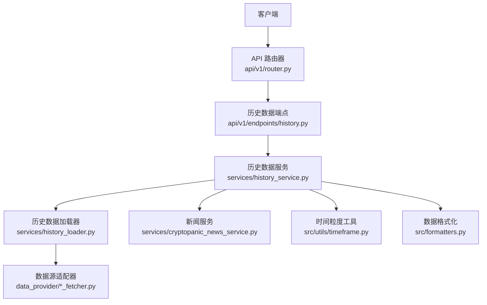
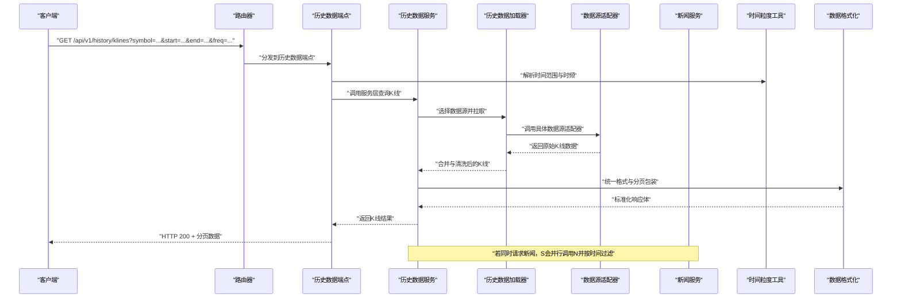
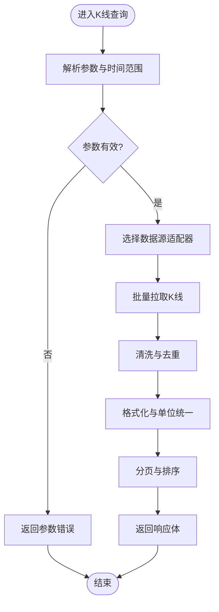
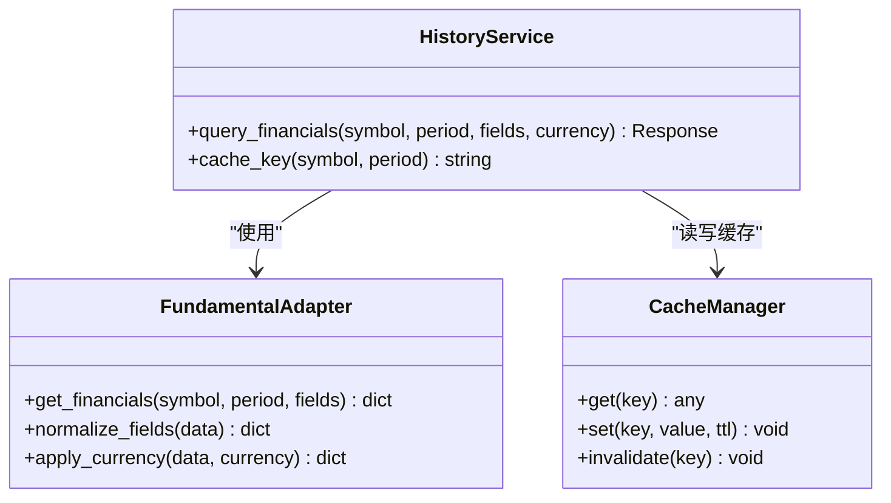
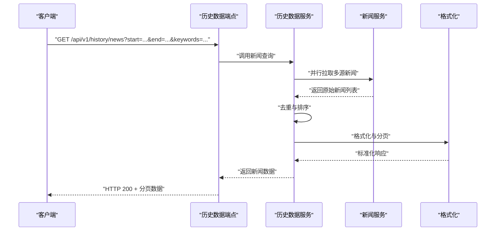
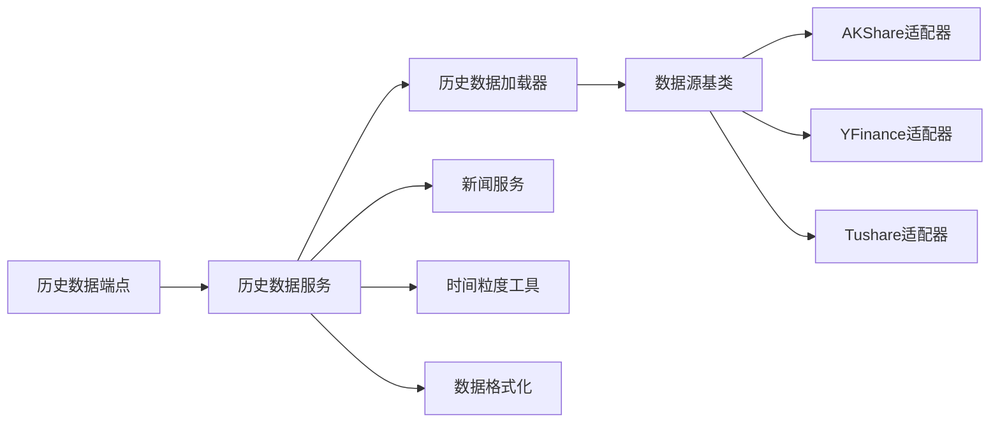

# 历史数据API

<cite>
**本文引用的文件**   
- [api/v1/endpoints/history.py](file://api/v1/endpoints/history.py)
- [api/v1/schemas/history.py](file://api/v1/schemas/history.py)
- [services/history_service.py](file://services/history_service.py)
- [services/history_loader.py](file://services/history_loader.py)
- [data_provider/base.py](file://data_provider/base.py)
- [data_provider/akshare_fetcher.py](file://data_provider/akshare_fetcher.py)
- [data_provider/yfinance_fetcher.py](file://data_provider/yfinance_fetcher.py)
- [data_provider/tushare_fetcher.py](file://data_provider/tushare_fetcher.py)
- [data_provider/fundamental_adapter.py](file://data_provider/fundamental_adapter.py)
- [services/cryptopanic_news_service.py](file://services/cryptopanic_news_service.py)
- [src/utils/timeframe.py](file://src/utils/timeframe.py)
- [src/formatters.py](file://src/formatters.py)
- [api/app.py](file://api/app.py)
- [api/v1/router.py](file://api/v1/router.py)
</cite>

## 目录
1. [简介](#简介)
2. [项目结构](#项目结构)
3. [核心组件](#核心组件)
4. [架构总览](#架构总览)
5. [详细组件分析](#详细组件分析)
6. [依赖关系分析](#依赖关系分析)
7. [性能与缓存策略](#性能与缓存策略)
8. [大数据量处理方案](#大数据量处理方案)
9. [故障排查指南](#故障排查指南)
10. [结论](#结论)
11. [附录：接口定义与示例](#附录接口定义与示例)

## 简介
本文件面向“历史数据查询API”，覆盖K线数据、财务数据、新闻数据的查询能力。文档重点说明：
- 时间范围过滤（起止时间、时频粒度）
- 数据格式化（统一响应结构、字段标准化）
- 分页加载机制（页码、每页大小、游标式翻页）
- 数据缓存策略（内存/本地缓存、失效与预热）
- 性能优化技巧（并发、批处理、降采样）
- 大数据量处理方案（流式返回、分片拉取、增量更新）
- 历史数据分析示例与集成指南（前端/后端对接要点）

## 项目结构
历史数据API位于后端FastAPI应用内，路由注册在v1版本下，具体实现由服务层与数据提供者组成。关键路径如下：
- API路由与端点：api/v1/endpoints/history.py
- 请求/响应模型：api/v1/schemas/history.py
- 业务编排与服务：services/history_service.py、services/history_loader.py
- 数据源适配层：data_provider/*_fetcher.py、data_provider/fundamental_adapter.py
- 工具与格式化工具：src/utils/timeframe.py、src/formatters.py
- 应用入口与路由挂载：api/app.py、api/v1/router.py

**图表来源** 
- [api/v1/router.py](file://api/v1/router.py)
- [api/v1/endpoints/history.py](file://api/v1/endpoints/history.py)
- [services/history_service.py](file://services/history_service.py)
- [services/history_loader.py](file://services/history_loader.py)
- [data_provider/base.py](file://data_provider/base.py)
- [src/utils/timeframe.py](file://src/utils/timeframe.py)
- [src/formatters.py](file://src/formatters.py)

**章节来源**
- [api/v1/router.py](file://api/v1/router.py)
- [api/app.py](file://api/app.py)

## 核心组件
- 历史数据端点（history.py）：暴露REST接口，接收时间范围、标的、时频等参数，调用服务层获取数据并返回统一格式。
- 历史数据服务（history_service.py）：封装查询逻辑，协调K线、财务、新闻三类数据，负责分页、去重、排序、格式化。
- 历史数据加载器（history_loader.py）：根据标的与时频选择合适的数据源适配器，执行拉取与合并。
- 数据源适配器（data_provider/*_fetcher.py）：对第三方数据源进行统一抽象，屏蔽差异，提供标准化数据结构。
- 财务数据适配器（fundamental_adapter.py）：将不同源的财报指标归一化为标准字段。
- 新闻服务（cryptopanic_news_service.py）：聚合财经新闻，支持按时间范围过滤与关键词检索。
- 时间粒度工具（timeframe.py）：解析与校验时频（如1m/5m/1d），计算起止时间边界。
- 数据格式化（formatters.py）：统一输出结构，处理缺失值、单位换算、时区转换。

**章节来源**
- [api/v1/endpoints/history.py](file://api/v1/endpoints/history.py)
- [api/v1/schemas/history.py](file://api/v1/schemas/history.py)
- [services/history_service.py](file://services/history_service.py)
- [services/history_loader.py](file://services/history_loader.py)
- [data_provider/base.py](file://data_provider/base.py)
- [data_provider/fundamental_adapter.py](file://data_provider/fundamental_adapter.py)
- [services/cryptopanic_news_service.py](file://services/cryptopanic_news_service.py)
- [src/utils/timeframe.py](file://src/utils/timeframe.py)
- [src/formatters.py](file://src/formatters.py)

## 架构总览
历史数据API采用分层架构：端点层仅做参数校验与路由转发；服务层负责业务编排；加载器与适配器负责数据获取；工具层提供时间与格式化处理。

**图表来源** 
- [api/v1/endpoints/history.py](file://api/v1/endpoints/history.py)
- [services/history_service.py](file://services/history_service.py)
- [services/history_loader.py](file://services/history_loader.py)
- [data_provider/base.py](file://data_provider/base.py)
- [src/utils/timeframe.py](file://src/utils/timeframe.py)
- [src/formatters.py](file://src/formatters.py)
- [services/cryptopanic_news_service.py](file://services/cryptopanic_news_service.py)

## 详细组件分析

### K线数据查询接口
- 功能：按标的、起止时间、时频粒度拉取K线，支持分页与排序。
- 输入参数：
  - symbol：标的代码（支持A股、港股、美股、加密货币等映射）
  - start/end：起止时间（ISO8601或Unix时间戳）
  - freq：时频（如1m/5m/15m/1h/1d）
  - page/page_size：分页参数
  - sort_by/order：排序字段与顺序
- 输出结构：
  - data：K线数组（包含时间、开高低收、成交量、成交额等）
  - meta：分页元信息（total、page、page_size、has_next）
  - errors：错误列表（可选）
- 时间范围过滤：
  - 自动对齐交易日边界，跳过非交易时段
  - 时频粒度校验与转换
- 数据格式化：
  - 统一字段名、单位、时区
  - 缺失值填充策略（前向填充/插值/标记NaN）
- 分页加载：
  - 基于页码的分页，支持游标翻页（cursor）
  - 大数据集建议启用游标模式减少偏移开销

**图表来源** 
- [api/v1/endpoints/history.py](file://api/v1/endpoints/history.py)
- [services/history_service.py](file://services/history_service.py)
- [services/history_loader.py](file://services/history_loader.py)
- [data_provider/base.py](file://data_provider/base.py)
- [src/utils/timeframe.py](file://src/utils/timeframe.py)
- [src/formatters.py](file://src/formatters.py)

**章节来源**
- [api/v1/endpoints/history.py](file://api/v1/endpoints/history.py)
- [api/v1/schemas/history.py](file://api/v1/schemas/history.py)
- [services/history_service.py](file://services/history_service.py)
- [services/history_loader.py](file://services/history_loader.py)
- [data_provider/akshare_fetcher.py](file://data_provider/akshare_fetcher.py)
- [data_provider/yfinance_fetcher.py](file://data_provider/yfinance_fetcher.py)
- [data_provider/tushare_fetcher.py](file://data_provider/tushare_fetcher.py)
- [src/utils/timeframe.py](file://src/utils/timeframe.py)
- [src/formatters.py](file://src/formatters.py)

### 财务数据查询接口
- 功能：按标的与报告期拉取财务报表与关键指标（营收、利润、现金流、估值等）。
- 输入参数：
  - symbol：标的代码
  - report_date/report_period：报告日期或周期（季度/年度）
  - fields：需要返回的字段集合（默认全量）
  - currency：币种（默认本地）
- 输出结构：
  - data：财务指标字典（按报表类型分组）
  - meta：数据来源、更新时间、币种
  - errors：错误列表
- 数据格式化：
  - 指标单位统一（万元/亿元、百分比）
  - 缺失字段回填策略（最近可用值/空值标记）
- 缓存策略：
  - 财报数据变更频率低，适合长TTL缓存（小时级）
  - 按标的+报告期作为缓存键

**图表来源** 
- [data_provider/fundamental_adapter.py](file://data_provider/fundamental_adapter.py)
- [services/history_service.py](file://services/history_service.py)

**章节来源**
- [api/v1/endpoints/history.py](file://api/v1/endpoints/history.py)
- [api/v1/schemas/history.py](file://api/v1/schemas/history.py)
- [services/history_service.py](file://services/history_service.py)
- [data_provider/fundamental_adapter.py](file://data_provider/fundamental_adapter.py)

### 新闻数据查询接口
- 功能：按时间范围与关键词检索财经新闻，支持多源聚合与去重。
- 输入参数：
  - start/end：时间范围
  - keywords：关键词列表（AND/OR语义）
  - sources：数据源白名单（可选）
  - page/page_size：分页参数
- 输出结构：
  - data：新闻条目数组（标题、摘要、链接、发布时间、来源）
  - meta：分页元信息、过滤条件
  - errors：错误列表
- 数据处理：
  - 多源聚合与重复检测（标题相似度/URL去重）
  - 内容摘要生成（可选）
  - 敏感词过滤与合规检查（可选）

**图表来源** 
- [api/v1/endpoints/history.py](file://api/v1/endpoints/history.py)
- [services/history_service.py](file://services/history_service.py)
- [services/cryptopanic_news_service.py](file://services/cryptopanic_news_service.py)
- [src/formatters.py](file://src/formatters.py)

**章节来源**
- [api/v1/endpoints/history.py](file://api/v1/endpoints/history.py)
- [api/v1/schemas/history.py](file://api/v1/schemas/history.py)
- [services/history_service.py](file://services/history_service.py)
- [services/cryptopanic_news_service.py](file://services/cryptopanic_news_service.py)
- [src/formatters.py](file://src/formatters.py)

## 依赖关系分析
历史数据API的依赖关系清晰分层：端点依赖服务，服务依赖加载器与适配器，工具层被多处复用。

**图表来源** 
- [api/v1/endpoints/history.py](file://api/v1/endpoints/history.py)
- [services/history_service.py](file://services/history_service.py)
- [services/history_loader.py](file://services/history_loader.py)
- [data_provider/base.py](file://data_provider/base.py)
- [data_provider/akshare_fetcher.py](file://data_provider/akshare_fetcher.py)
- [data_provider/yfinance_fetcher.py](file://data_provider/yfinance_fetcher.py)
- [data_provider/tushare_fetcher.py](file://data_provider/tushare_fetcher.py)
- [src/utils/timeframe.py](file://src/utils/timeframe.py)
- [src/formatters.py](file://src/formatters.py)

**章节来源**
- [data_provider/base.py](file://data_provider/base.py)
- [data_provider/akshare_fetcher.py](file://data_provider/akshare_fetcher.py)
- [data_provider/yfinance_fetcher.py](file://data_provider/yfinance_fetcher.py)
- [data_provider/tushare_fetcher.py](file://data_provider/tushare_fetcher.py)

## 性能与缓存策略
- 缓存层级
  - 内存缓存：热点标的与短时效数据（秒~分钟级）
  - 本地缓存：财报与低频数据（小时~天级）
  - 远端缓存：CDN或反向代理（静态资源）
- 缓存键设计
  - K线：symbol + freq + start + end + fields
  - 财务：symbol + period + fields + currency
  - 新闻：start + end + keywords_hash + sources
- 失效与预热
  - 定时任务预热热门标的数据
  - 事件驱动失效（财报发布、重大公告）
- 并发与批处理
  - 多数据源并行拉取，超时熔断与降级
  - 批量请求合并，减少网络往返
- 序列化优化
  - 使用高效序列化库（如orjson）
  - 按需返回字段，避免冗余传输

[本节为通用指导，不直接分析具体文件]

## 大数据量处理方案
- 分页与游标
  - 优先使用游标翻页，避免大偏移量
  - 限制最大page_size，防止单次响应过大
- 流式返回
  - 对超大K线集使用SSE或WebSocket推送
  - 前端增量渲染，提升交互体验
- 分片拉取与合并
  - 按时间分片拉取，服务端合并排序
  - 断点续传与重试机制
- 降采样与聚合
  - 超长时间范围自动降采样（如1m→5m→1h）
  - 提供聚合视图（均值、最大值、最小值）
- 增量更新
  - 记录最后更新时间，仅拉取增量
  - 冲突解决策略（以最新为准/保留差异）

[本节为通用指导，不直接分析具体文件]

## 故障排查指南
- 常见问题
  - 参数校验失败：检查时间格式、时频合法性、标的映射
  - 数据源超时：配置超时阈值与重试次数，启用降级
  - 缓存未命中：检查缓存键一致性、TTL设置
  - 分页异常：确认page/page_size范围、游标有效性
- 诊断步骤
  - 查看端点日志与请求ID
  - 检查服务层中间件与错误处理器
  - 验证数据源适配器连通性与限流
  - 使用健康检查接口确认服务状态
- 恢复策略
  - 启用只读模式，返回缓存数据
  - 切换备用数据源
  - 通知运维扩容或修复上游依赖

**章节来源**
- [api/v1/endpoints/history.py](file://api/v1/endpoints/history.py)
- [services/history_service.py](file://services/history_service.py)
- [services/history_loader.py](file://services/history_loader.py)

## 结论
历史数据API通过分层架构与统一适配器，实现了K线、财务、新闻三类数据的标准化查询。结合时间范围过滤、分页加载、缓存策略与性能优化，能够支撑大规模数据访问与分析场景。建议在集成时遵循本文档的参数规范与最佳实践，确保稳定性与可扩展性。

[本节为总结，不直接分析具体文件]

## 附录：接口定义与示例
- K线数据接口
  - 方法：GET
  - 路径：/api/v1/history/klines
  - 参数：symbol、start、end、freq、page、page_size、sort_by、order
  - 响应：{data:[], meta:{}, errors:[]}
- 财务数据接口
  - 方法：GET
  - 路径：/api/v1/history/financials
  - 参数：symbol、report_date/report_period、fields、currency
  - 响应：{data:{}, meta:{}, errors:[]}
- 新闻数据接口
  - 方法：GET
  - 路径：/api/v1/history/news
  - 参数：start、end、keywords、sources、page、page_size
  - 响应：{data:[], meta:{}, errors:[]}

**章节来源**
- [api/v1/endpoints/history.py](file://api/v1/endpoints/history.py)
- [api/v1/schemas/history.py](file://api/v1/schemas/history.py)