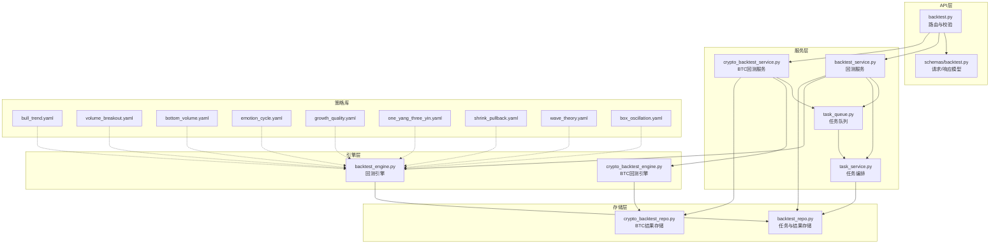
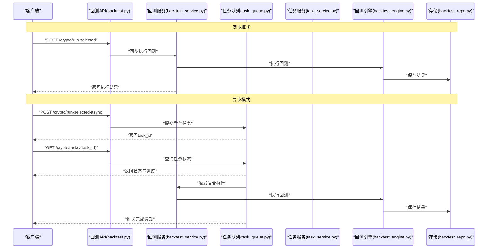
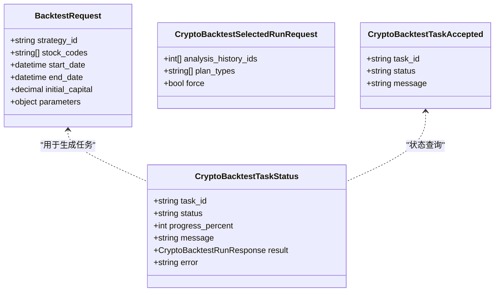
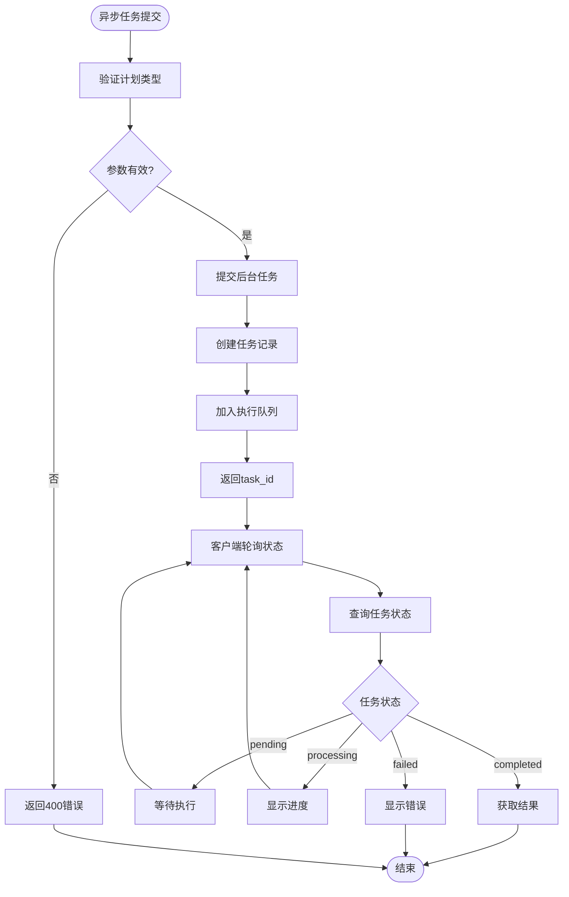
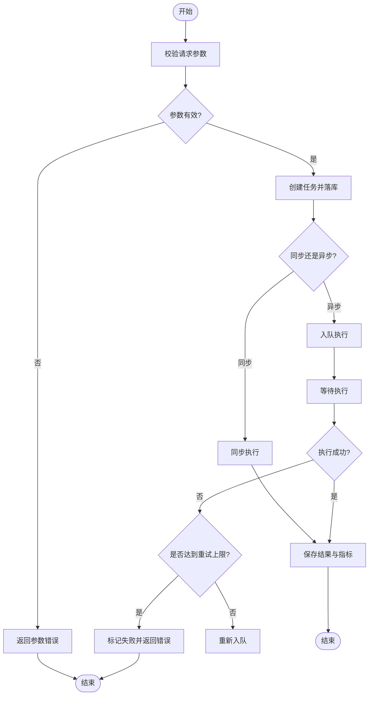
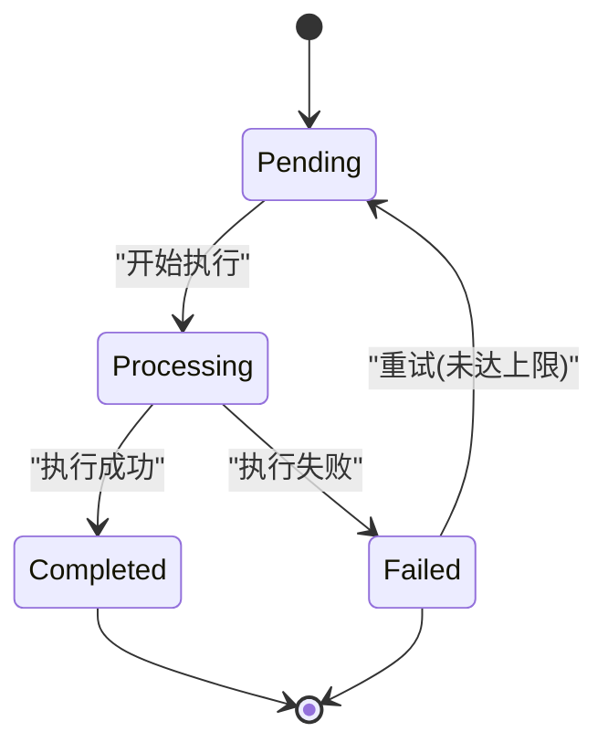
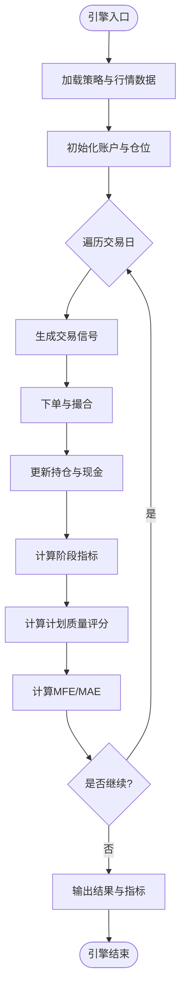
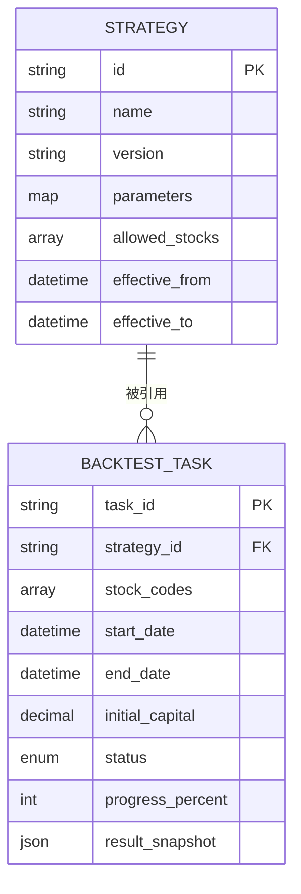
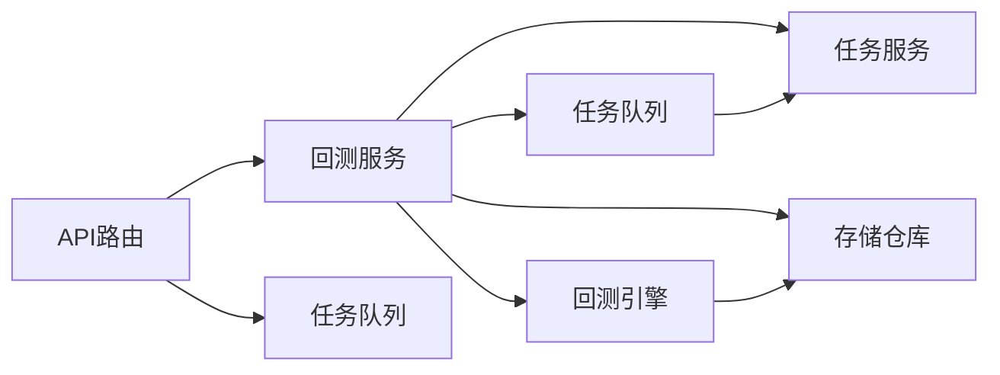

# 回测系统API

<cite>
**本文档引用的文件**   
- [api/v1/endpoints/backtest.py](file://api/v1/endpoints/backtest.py)
- [api/v1/schemas/backtest.py](file://api/v1/schemas/backtest.py)
- [src/services/backtest_service.py](file://src/services/backtest_service.py)
- [src/core/backtest_engine.py](file://src/core/backtest_engine.py)
- [src/repositories/backtest_repo.py](file://src/repositories/backtest_repo.py)
- [src/services/task_queue.py](file://src/services/task_queue.py)
- [src/services/task_service.py](file://src/services/task_service.py)
- [src/services/crypto_backtest_service.py](file://src/services/crypto_backtest_service.py)
- [src/core/crypto_backtest_engine.py](file://src/core/crypto_backtest_engine.py)
- [strategies/bull_trend.yaml](file://strategies/bull_trend.yaml)
- [strategies/box_oscillation.yaml](file://strategies/box_oscillation.yaml)
- [strategies/bottom_volume.yaml](file://strategies/bottom_volume.yaml)
- [strategies/emotion_cycle.yaml](file://strategies/emotion_cycle.yaml)
- [strategies/growth_quality.yaml](file://strategies/growth_quality.yaml)
- [strategies/one_yang_three_yin.yaml](file://strategies/one_yang_three_yin.yaml)
- [strategies/shrink_pullback.yaml](file://strategies/shrink_pullback.yaml)
- [strategies/volume_breakout.yaml](file://strategies/volume_breakout.yaml)
- [strategies/wave_theory.yaml](file://strategies/wave_theory.yaml)
- [tests/test_backtest_service.py](file://tests/test_backtest_service.py)
- [tests/test_backtest_engine.py](file://tests/test_backtest_engine.py)
- [tests/test_crypto_backtest_task_api.py](file://tests/test_crypto_backtest_task_api.py)
</cite>

## 更新摘要
**所做更改**
- 新增计划质量指标、交易性状态、仓位乘数上限、逆势控制参数等字段说明
- 增强MFE/MAE测量和原始方向准确率跟踪功能
- 更新CryptoBacktestResultItem和CryptoBacktestHistoryPlan模型结构
- 补充异步任务处理中的新字段支持
- 完善性能指标计算方法的文档说明

## 目录
1. [简介](#简介)
2. [项目结构](#项目结构)
3. [核心组件](#核心组件)
4. [架构总览](#架构总览)
5. [详细组件分析](#详细组件分析)
6. [依赖关系分析](#依赖关系分析)
7. [性能考量](#性能考量)
8. [故障排查指南](#故障排查指南)
9. [结论](#结论)
10. [附录](#附录)

## 简介
本文件面向回测系统的API使用者与集成方，系统化说明回测任务的提交、执行状态查询与结果获取的完整流程。文档覆盖以下要点：
- 同步与异步回测任务提交接口与参数规范（含策略定义格式）
- 异步任务处理、进度跟踪与错误恢复机制
- 回测引擎与指标计算方法
- 结果数据结构与数据分析指南
- 常见配置示例与最佳实践

**更新** 新增了针对大批量回测的异步处理机制，通过后台任务队列解决HTTP请求超时问题，并增强了计划质量评估和交易性控制功能。

## 项目结构
回测相关代码主要分布在以下模块：
- API层：路由与请求/响应模型定义
- 服务层：任务编排、队列调度、业务逻辑
- 引擎层：回测执行核心
- 存储层：任务与结果持久化
- 策略库：YAML策略定义
- 测试：服务与引擎的行为验证

**图表来源** 
- [api/v1/endpoints/backtest.py](file://api/v1/endpoints/backtest.py)
- [api/v1/schemas/backtest.py](file://api/v1/schemas/backtest.py)
- [src/services/backtest_service.py](file://src/services/backtest_service.py)
- [src/services/crypto_backtest_service.py](file://src/services/crypto_backtest_service.py)
- [src/services/task_queue.py](file://src/services/task_queue.py)
- [src/services/task_service.py](file://src/services/task_service.py)
- [src/core/backtest_engine.py](file://src/core/backtest_engine.py)
- [src/repositories/backtest_repo.py](file://src/repositories/backtest_repo.py)

**章节来源**
- [api/v1/endpoints/backtest.py](file://api/v1/endpoints/backtest.py)
- [api/v1/schemas/backtest.py](file://api/v1/schemas/backtest.py)
- [src/services/backtest_service.py](file://src/services/backtest_service.py)
- [src/services/crypto_backtest_service.py](file://src/services/crypto_backtest_service.py)
- [src/core/backtest_engine.py](file://src/core/backtest_engine.py)
- [src/repositories/backtest_repo.py](file://src/repositories/backtest_repo.py)
- [src/services/task_queue.py](file://src/services/task_queue.py)
- [src/services/task_service.py](file://src/services/task_service.py)

## 核心组件
- 路由与模型（API层）
  - 负责接收HTTP请求、校验入参、返回统一响应结构
  - 关键职责：同步/异步任务提交、状态查询、结果拉取、分页与过滤
- 回测服务（Service层）
  - 编排任务生命周期：创建、入队、执行、完成、失败重试
  - 协调引擎与存储，封装业务规则
- 任务队列与服务（Task层）
  - 提供异步执行能力，支持优先级、限流、重试
  - 维护任务状态机与进度上报
  - 支持后台任务执行，避免HTTP请求阻塞
- 回测引擎（Engine层）
  - 加载策略与数据，执行交易模拟，计算指标
  - 输出标准化结果集
- 存储仓库（Repository层）
  - 持久化任务元数据、执行日志、结果快照
  - 提供查询与导出能力

**更新** 新增了后台任务队列机制，专门处理大批量回测任务，通过异步方式避免HTTP请求超时，并增强了计划质量评估和交易性控制功能。

**章节来源**
- [api/v1/endpoints/backtest.py](file://api/v1/endpoints/backtest.py)
- [api/v1/schemas/backtest.py](file://api/v1/schemas/backtest.py)
- [src/services/backtest_service.py](file://src/services/backtest_service.py)
- [src/services/crypto_backtest_service.py](file://src/services/crypto_backtest_service.py)
- [src/services/task_queue.py](file://src/services/task_queue.py)
- [src/services/task_service.py](file://src/services/task_service.py)
- [src/core/backtest_engine.py](file://src/core/backtest_engine.py)
- [src/repositories/backtest_repo.py](file://src/repositories/backtest_repo.py)

## 架构总览
下图展示从客户端发起回测请求到结果获取的端到端流程，包括同步和异步两种模式。

**图表来源** 
- [api/v1/endpoints/backtest.py](file://api/v1/endpoints/backtest.py)
- [src/services/backtest_service.py](file://src/services/backtest_service.py)
- [src/services/crypto_backtest_service.py](file://src/services/crypto_backtest_service.py)
- [src/services/task_queue.py](file://src/services/task_queue.py)
- [src/services/task_service.py](file://src/services/task_service.py)
- [src/core/backtest_engine.py](file://src/core/backtest_engine.py)
- [src/repositories/backtest_repo.py](file://src/repositories/backtest_repo.py)

## 详细组件分析

### 回测API路由与模型
- 路由职责
  - 同步回测任务：接收策略、标的、时间范围、资金等参数，直接返回执行结果
  - 异步回测任务：提交后台任务并立即返回task_id，避免长时间等待
  - 任务状态查询：返回运行中、排队、成功、失败等状态及进度
  - 结果获取：返回标准化结果结构（收益曲线、持仓、成交明细、指标摘要）
- 模型校验
  - 使用Pydantic模型对请求体进行强类型校验与默认值填充
  - 对策略字段、时间范围、标的列表等进行约束检查
  - 新增计划类型验证，确保只接受支持的策略类型

**图表来源** 
- [api/v1/schemas/backtest.py](file://api/v1/schemas/backtest.py)

**更新** 新增了异步任务相关的请求和响应模型，支持任务ID管理和状态跟踪，并增强了计划质量评估字段。

**章节来源**
- [api/v1/endpoints/backtest.py](file://api/v1/endpoints/backtest.py)
- [api/v1/schemas/backtest.py](file://api/v1/schemas/backtest.py)

### 异步回测API（新增功能）
- 异步任务提交
  - 端点：`POST /crypto/run-selected-async`
  - 功能：提交大批量回测任务到后台队列，立即返回task_id
  - 优势：避免HTTP请求超时，支持大规模数据处理
- 任务状态查询
  - 端点：`GET /crypto/tasks/{task_id}`
  - 功能：查询任务执行状态、进度和最终结果
  - 状态：pending（待执行）、processing（执行中）、completed（已完成）、failed（失败）
- 参数验证增强
  - 新增 `_validate_selected_plan_types` 函数
  - 验证计划类型：daily_long、daily_short、intraday
  - 拒绝不支持的计划类型，返回400错误

**图表来源** 
- [api/v1/endpoints/backtest.py:188-266](file://api/v1/endpoints/backtest.py#L188-L266)
- [src/services/task_queue.py:464-505](file://src/services/task_queue.py#L464-L505)

**更新** 这是本次更新的核心功能，解决了大批量回测的性能问题，并增强了计划质量评估和交易性控制功能。

**章节来源**
- [api/v1/endpoints/backtest.py:172-266](file://api/v1/endpoints/backtest.py#L172-L266)
- [src/services/task_queue.py:464-505](file://src/services/task_queue.py#L464-L505)
- [tests/test_crypto_backtest_task_api.py:18-118](file://tests/test_crypto_backtest_task_api.py#L18-L118)

### 回测服务（任务编排）
- 任务生命周期
  - 创建：校验输入、生成任务ID、落库
  - 入队：根据策略复杂度与系统负载设置优先级
  - 执行：调用任务服务与引擎，记录阶段日志
  - 完成/失败：更新状态、保存结果或错误信息
- 错误恢复
  - 支持重试次数上限与退避策略
  - 失败时保留中间状态以便断点续跑
- 异步任务支持
  - 通过 `submit_background_task` 方法提交后台任务
  - 支持自定义执行函数，灵活处理不同业务场景

**图表来源** 
- [src/services/backtest_service.py](file://src/services/backtest_service.py)
- [src/services/task_queue.py](file://src/services/task_queue.py)
- [src/repositories/backtest_repo.py](file://src/repositories/backtest_repo.py)

**更新** 增强了异步任务处理能力，支持后台执行和状态跟踪，并增加了计划质量评估和交易性控制功能。

**章节来源**
- [src/services/backtest_service.py](file://src/services/backtest_service.py)
- [src/services/task_queue.py](file://src/services/task_queue.py)
- [src/repositories/backtest_repo.py](file://src/repositories/backtest_repo.py)

### 任务队列与服务（异步与进度）
- 队列特性
  - 支持并发消费者、任务优先级、超时控制
  - 心跳与进度上报，便于前端轮询或SSE推送
  - 后台任务执行，避免阻塞HTTP请求
- 任务服务
  - 管理任务状态机：pending、running、completed、failed
  - 聚合执行日志与阶段性指标
  - 支持任务清理和资源回收

**图表来源** 
- [src/services/task_service.py](file://src/services/task_service.py)
- [src/services/task_queue.py](file://src/services/task_queue.py)

**更新** 新增了后台任务执行机制，支持长时间运行的回测任务，并增强了计划质量评估功能。

**章节来源**
- [src/services/task_service.py](file://src/services/task_service.py)
- [src/services/task_queue.py](file://src/services/task_queue.py)

### 回测引擎（执行与指标）
- 执行流程
  - 加载策略与历史数据
  - 按时间步迭代，生成买卖信号与成交
  - 计算净值曲线、收益率、回撤、夏普等指标
- 指标计算
  - 收益类：累计收益、年化收益、月度收益分布
  - 风险类：最大回撤、波动率、VaR
  - 交易质量：胜率、盈亏比、滑点与手续费影响
  - **新增** 计划质量评分：方向准确性、位置合理性、风险收益比、执行效率
  - **新增** MFE/MAE测量：最大有利移动和最大不利移动百分比
  - **新增** 原始方向准确率：基于MFE/MAE的方向判断准确率
- 结果输出
  - 标准化JSON结构，包含摘要、明细与图表数据

**图表来源** 
- [src/core/backtest_engine.py](file://src/core/backtest_engine.py)

**更新** 新增了计划质量评估、MFE/MAE测量和原始方向准确率计算功能。

**章节来源**
- [src/core/backtest_engine.py](file://src/core/backtest_engine.py)

### 存储仓库（持久化）
- 任务元数据：任务ID、策略ID、标的、时间范围、初始资金、状态、进度
- 执行日志：阶段日志、错误堆栈、重试计数
- 结果快照：摘要、净值曲线、成交明细、指标字典
- **新增** 计划质量数据：四维评分、质量状态、缺失字段
- **新增** 交易性控制：交易性状态、原因、仓位乘数上限、逆势控制参数
- 查询接口：按任务ID、策略ID、时间范围筛选

**更新** 新增了计划质量和交易性控制相关的数据存储支持。

**章节来源**
- [src/repositories/backtest_repo.py](file://src/repositories/backtest_repo.py)

### 策略定义格式（YAML）
- 通用字段
  - 策略标识、名称、版本
  - 参数键值对（如均线周期、阈值、止损止盈比例）
  - 标的范围与时间窗口
- 示例策略
  - 趋势突破、箱体震荡、底部放量、情绪周期、成长质量、一阳三阴、缩量回调、放量突破、波浪理论
- 使用方式
  - 通过strategy_id引用策略文件
  - 在请求参数中覆盖默认参数

**图表来源** 
- [strategies/bull_trend.yaml](file://strategies/bull_trend.yaml)
- [strategies/volume_breakout.yaml](file://strategies/volume_breakout.yaml)
- [strategies/bottom_volume.yaml](file://strategies/bottom_volume.yaml)
- [strategies/emotion_cycle.yaml](file://strategies/emotion_cycle.yaml)
- [strategies/growth_quality.yaml](file://strategies/growth_quality.yaml)
- [strategies/one_yang_three_yin.yaml](file://strategies/one_yang_three_yin.yaml)
- [strategies/shrink_pullback.yaml](file://strategies/shrink_pullback.yaml)
- [strategies/wave_theory.yaml](file://strategies/wave_theory.yaml)
- [strategies/box_oscillation.yaml](file://strategies/box_oscillation.yaml)
- [src/repositories/backtest_repo.py](file://src/repositories/backtest_repo.py)

**章节来源**
- [strategies/bull_trend.yaml](file://strategies/bull_trend.yaml)
- [strategies/volume_breakout.yaml](file://strategies/volume_breakout.yaml)
- [strategies/bottom_volume.yaml](file://strategies/bottom_volume.yaml)
- [strategies/emotion_cycle.yaml](file://strategies/emotion_cycle.yaml)
- [strategies/growth_quality.yaml](file://strategies/growth_quality.yaml)
- [strategies/one_yang_three_yin.yaml](file://strategies/one_yang_three_yin.yaml)
- [strategies/shrink_pullback.yaml](file://strategies/shrink_pullback.yaml)
- [strategies/wave_theory.yaml](file://strategies/wave_theory.yaml)
- [strategies/box_oscillation.yaml](file://strategies/box_oscillation.yaml)

### 计划质量评估与交易性控制（新增功能）
- 计划质量评分体系
  - 方向准确性评分：基于价格行为、EMA结构、VWAP位置的评分
  - 位置合理性评分：基于入场条件、设置类型、条件类型的评分
  - 风险收益比评分：基于风险距离、奖励距离、成本缓冲的评分
  - 执行效率评分：基于合约质量、质量检查、信号触发、订单执行的评分
- 交易性状态控制
  - 正常交易：tradeability_status为"normal"
  - 逆势限制：tradeability_status为"countertrend_limited"，仓位乘数上限为0.5
  - 降级交易：tradeability_status为"degraded_missing_context"，当缺失关键数据时
  - 阻止交易：tradeability_status为"blocked"，当存在严重问题时
- 逆势控制参数
  - position_multiplier_cap：仓位乘数上限，逆势交易限制为0.5
  - max_validity_bars：最大有效K线数，逆势交易限制为6根
  - alignment：对齐状态，识别逆势交易机会
- MFE/MAE测量
  - mfe_pct：最大有利移动百分比，衡量理想情况下的收益
  - mae_pct：最大不利移动百分比，衡量最坏情况下的损失
  - direction_correct_raw：基于MFE/MAE的原始方向准确率

**更新** 这是本次更新的核心功能，提供了更全面的计划质量评估和风险控制机制。

**章节来源**
- [api/v1/schemas/backtest.py:108-176](file://api/v1/schemas/backtest.py#L108-L176)
- [src/core/crypto_backtest_engine.py:800-872](file://src/core/crypto_backtest_engine.py#L800-L872)
- [src/analyzer.py:2023-2079](file://src/analyzer.py#L2023-L2079)

## 依赖关系分析
- 耦合度
  - API层仅依赖服务层，不直接访问引擎与存储，保持高内聚低耦合
  - 服务层依赖队列、任务服务、引擎与仓库，职责清晰
  - 异步任务通过任务队列解耦，提高系统可扩展性
- 外部依赖
  - 数据源由引擎内部抽象，便于替换不同行情源
  - 存储实现可通过仓库接口扩展（内存、SQLite、PostgreSQL等）

**图表来源** 
- [api/v1/endpoints/backtest.py](file://api/v1/endpoints/backtest.py)
- [src/services/backtest_service.py](file://src/services/backtest_service.py)
- [src/services/task_queue.py](file://src/services/task_queue.py)
- [src/services/task_service.py](file://src/services/task_service.py)
- [src/core/backtest_engine.py](file://src/core/backtest_engine.py)
- [src/repositories/backtest_repo.py](file://src/repositories/backtest_repo.py)

**更新** 新增了任务队列作为独立组件，支持异步任务处理，并增强了计划质量评估和交易性控制功能。

**章节来源**
- [api/v1/endpoints/backtest.py](file://api/v1/endpoints/backtest.py)
- [src/services/backtest_service.py](file://src/services/backtest_service.py)
- [src/services/task_queue.py](file://src/services/task_queue.py)
- [src/services/task_service.py](file://src/services/task_service.py)
- [src/core/backtest_engine.py](file://src/core/backtest_engine.py)
- [src/repositories/backtest_repo.py](file://src/repositories/backtest_repo.py)

## 性能考量
- 异步执行
  - 使用任务队列解耦请求与执行，避免阻塞API线程
  - 合理设置消费者数量与单任务超时
  - 支持后台任务执行，适合大批量数据处理
- 数据读取优化
  - 批量加载历史数据，减少IO次数
  - 缓存常用指标与因子，降低重复计算
- 结果序列化
  - 按需返回摘要与关键序列，避免大对象传输
  - 支持分页与增量拉取
- 资源隔离
  - 按策略或用户维度限制并发与内存占用
  - 失败任务快速释放资源，防止泄漏
- 批量处理优化
  - 异步API避免HTTP请求超时问题
  - 后台队列支持任务优先级和限流
  - 进度跟踪和状态查询提升用户体验
- **新增** 计划质量评估优化
  - 增量计算计划质量评分，避免重复计算
  - 缓存指标标签和质量评分结果
  - 支持部分数据缺失时的降级评估

**更新** 新增了异步处理和批量优化的性能考虑，特别针对大批量回测场景，并增强了计划质量评估的性能优化。

## 故障排查指南
- 常见问题
  - 参数校验失败：检查策略ID、标的列表、时间范围与初始资金格式
  - 任务长时间Pending：检查队列容量与消费者状态
  - 执行失败：查看任务日志与错误堆栈，确认数据可用性与策略参数合理性
  - 结果不完整：确认引擎是否中途异常退出，必要时启用断点续跑
  - 异步任务无响应：检查task_id是否正确，确认任务是否存在于队列中
  - **新增** 计划质量评分异常：检查指标数据完整性，确认质量评估配置
  - **新增** 交易性状态异常：检查数据质量，确认逆势控制参数设置
- 定位手段
  - 通过任务ID查询状态与进度
  - 拉取执行日志与中间结果快照
  - 复现实验时使用最小数据集与简化策略
  - 使用SSE事件流实时监控任务状态
  - **新增** 检查计划质量评分的四维分数，定位质量问题所在维度
  - **新增** 分析交易性状态变化原因，确认数据缺失或控制参数问题

**更新** 新增了异步任务相关的故障排查指南，并增加了计划质量评估和交易性控制的故障排查方法。

**章节来源**
- [tests/test_backtest_service.py](file://tests/test_backtest_service.py)
- [tests/test_backtest_engine.py](file://tests/test_backtest_engine.py)
- [tests/test_crypto_backtest_task_api.py](file://tests/test_crypto_backtest_task_api.py)

## 结论
本回测系统API以分层架构与异步任务为核心，提供稳定可靠的回测能力。通过清晰的策略定义、完善的指标计算与结果输出，以及健壮的错误恢复与进度跟踪机制，能够满足多策略、多标的的回测需求。**新增的异步回测机制**特别适用于大批量数据处理场景，通过后台任务队列避免了HTTP请求超时问题，显著提升了系统的性能和用户体验。**新增的计划质量评估和交易性控制功能**进一步增强了回测结果的可靠性和实用性，提供了更全面的策略分析和风险管理能力。建议在生产环境中结合队列监控、日志采集与结果归档，确保系统的高可用与可观测性。

## 附录
- 回测任务提交示例
  - 同步模式：使用策略ID与必要参数提交任务，直接返回执行结果
  - 异步模式：提交任务后轮询task_id获取状态，直到任务完成
- 结果数据分析指南
  - 关注净值曲线、最大回撤、夏普比率、胜率与盈亏比
  - 结合成交明细分析滑点与手续费影响
  - 对不同策略进行横向对比与稳健性检验
  - **新增** 分析计划质量评分，评估策略在不同维度的表现
  - **新增** 检查交易性状态，理解策略的可交易性和风险控制
  - **新增** 利用MFE/MAE分析策略的理想收益和潜在风险
- 异步任务最佳实践
  - 合理设置轮询间隔，避免过度请求
  - 实现任务取消和超时处理机制
  - 提供友好的用户界面展示任务进度
  - **新增** 监控计划质量评分的变化趋势，及时发现策略退化
  - **新增** 分析交易性状态的分布，优化策略的风险控制参数

**更新** 新增了异步模式的示例和最佳实践指导，并增加了计划质量评估和交易性控制的使用指南。