# 投资组合管理API

<cite>
**本文引用的文件**   
- [api/v1/endpoints/portfolio.py](file://api/v1/endpoints/portfolio.py)
- [api/v1/schemas/portfolio.py](file://api/v1/schemas/portfolio.py)
- [src/services/portfolio_service.py](file://src/services/portfolio_service.py)
- [src/services/portfolio_risk_service.py](file://src/services/portfolio_risk_service.py)
- [src/services/portfolio_import_service.py](file://src/services/portfolio_import_service.py)
- [src/repositories/portfolio_repo.py](file://src/repositories/portfolio_repo.py)
- [src/agent/agents/portfolio_agent.py](file://src/agent/agents/portfolio_agent.py)
- [src/core/backtest_engine.py](file://src/core/backtest_engine.py)
- [apps/dsa-web/src/api/portfolio.ts](file://apps/dsa-web/src/api/portfolio.ts)
- [apps/dsa-web/src/pages/PortfolioPage.tsx](file://apps/dsa-web/src/pages/PortfolioPage.tsx)
- [apps/dsa-web/src/utils/portfolioFormat.ts](file://apps/dsa-web/src/utils/portfolioFormat.ts)
</cite>

## 目录
1. [简介](#简介)
2. [项目结构](#项目结构)
3. [核心组件](#核心组件)
4. [架构总览](#架构总览)
5. [详细组件分析](#详细组件分析)
6. [依赖分析](#依赖分析)
7. [性能考虑](#性能考虑)
8. [故障排查指南](#故障排查指南)
9. [结论](#结论)
10. [附录](#附录)

## 简介
本文件为“投资组合管理API”的完整技术文档，覆盖组合创建、持仓管理、收益计算、风险评估、批量导入导出、资产配置优化与风险指标分析等能力。文档面向开发者与使用者，提供接口说明、数据模型、计算逻辑、调用示例与排错建议，帮助快速集成与高效使用。

## 项目结构
围绕投资组合管理的代码主要分布在以下层次：
- API层：路由与请求校验（FastAPI）
- 服务层：业务编排与计算（组合、风险、导入导出、回测）
- 仓储层：持久化访问（组合与持仓）
- 前端层：Web端调用与展示
- Agent层：智能分析与策略建议

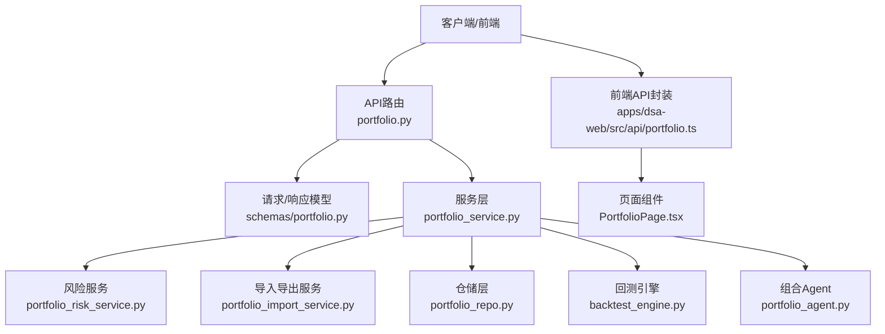

**图表来源** 
- [api/v1/endpoints/portfolio.py](file://api/v1/endpoints/portfolio.py)
- [api/v1/schemas/portfolio.py](file://api/v1/schemas/portfolio.py)
- [src/services/portfolio_service.py](file://src/services/portfolio_service.py)
- [src/services/portfolio_risk_service.py](file://src/services/portfolio_risk_service.py)
- [src/services/portfolio_import_service.py](file://src/services/portfolio_import_service.py)
- [src/repositories/portfolio_repo.py](file://src/repositories/portfolio_repo.py)
- [src/core/backtest_engine.py](file://src/core/backtest_engine.py)
- [src/agent/agents/portfolio_agent.py](file://src/agent/agents/portfolio_agent.py)
- [apps/dsa-web/src/api/portfolio.ts](file://apps/dsa-web/src/api/portfolio.ts)
- [apps/dsa-web/src/pages/PortfolioPage.tsx](file://apps/dsa-web/src/pages/PortfolioPage.tsx)

**章节来源**
- [api/v1/endpoints/portfolio.py](file://api/v1/endpoints/portfolio.py)
- [api/v1/schemas/portfolio.py](file://api/v1/schemas/portfolio.py)
- [src/services/portfolio_service.py](file://src/services/portfolio_service.py)

## 核心组件
- 路由与校验：定义组合CRUD、持仓增删改查、收益与风险计算、批量导入导出、回测与优化的HTTP接口，统一使用Pydantic模型进行入参出参校验。
- 服务层：组合服务负责业务编排；风险服务负责指标计算；导入导出服务处理批量数据解析与转换；仓储层负责持久化；回测引擎用于历史回测；组合Agent用于智能分析与配置优化建议。
- 前端封装：提供统一的API调用方法、错误处理与数据格式化，便于页面渲染与交互。

**章节来源**
- [api/v1/endpoints/portfolio.py](file://api/v1/endpoints/portfolio.py)
- [api/v1/schemas/portfolio.py](file://api/v1/schemas/portfolio.py)
- [src/services/portfolio_service.py](file://src/services/portfolio_service.py)
- [src/services/portfolio_risk_service.py](file://src/services/portfolio_risk_service.py)
- [src/services/portfolio_import_service.py](file://src/services/portfolio_import_service.py)
- [src/repositories/portfolio_repo.py](file://src/repositories/portfolio_repo.py)
- [src/core/backtest_engine.py](file://src/core/backtest_engine.py)
- [src/agent/agents/portfolio_agent.py](file://src/agent/agents/portfolio_agent.py)
- [apps/dsa-web/src/api/portfolio.ts](file://apps/dsa-web/src/api/portfolio.ts)

## 架构总览
整体采用分层架构：API路由接收请求并校验参数，服务层协调仓储、风险计算、回测与Agent，最终返回结构化结果。前端通过TS封装调用后端API，并在页面中展示组合概览、持仓明细、收益曲线与风险指标。

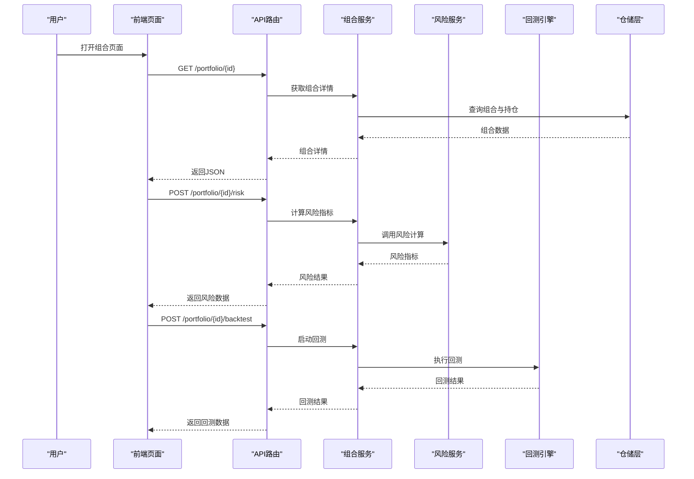

**图表来源** 
- [api/v1/endpoints/portfolio.py](file://api/v1/endpoints/portfolio.py)
- [src/services/portfolio_service.py](file://src/services/portfolio_service.py)
- [src/services/portfolio_risk_service.py](file://src/services/portfolio_risk_service.py)
- [src/core/backtest_engine.py](file://src/core/backtest_engine.py)
- [src/repositories/portfolio_repo.py](file://src/repositories/portfolio_repo.py)

## 详细组件分析

### 数据模型与接口定义
- 组合模型：包含组合ID、名称、描述、创建时间、更新时间、状态等字段。
- 持仓模型：包含标的代码、名称、数量、成本价、当前价、市值、权重、盈亏等字段。
- 风险指标：包含年化收益、波动率、夏普比率、最大回撤、VaR、CVaR、Beta、信息比率等。
- 回测参数：起止日期、基准、手续费、滑点、再平衡频率、约束条件等。
- 导入导出格式：CSV/Excel模板字段映射、必填项校验、错误行定位。

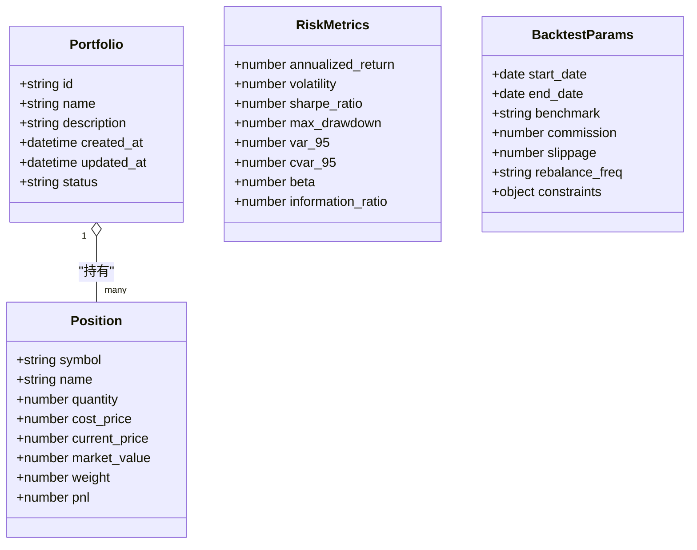

**图表来源** 
- [api/v1/schemas/portfolio.py](file://api/v1/schemas/portfolio.py)

**章节来源**
- [api/v1/schemas/portfolio.py](file://api/v1/schemas/portfolio.py)

### 组合创建与管理
- 创建组合：校验名称唯一性、初始化默认状态、写入仓储。
- 更新组合：支持基本信息修改与状态流转控制。
- 删除组合：级联清理持仓与相关缓存。
- 列表查询：分页、过滤、排序。

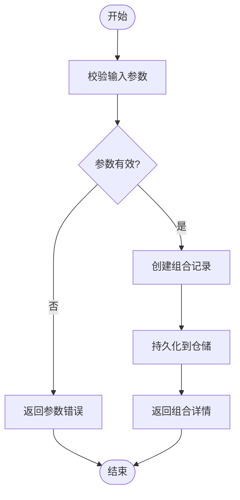

**图表来源** 
- [api/v1/endpoints/portfolio.py](file://api/v1/endpoints/portfolio.py)
- [src/services/portfolio_service.py](file://src/services/portfolio_service.py)
- [src/repositories/portfolio_repo.py](file://src/repositories/portfolio_repo.py)

**章节来源**
- [api/v1/endpoints/portfolio.py](file://api/v1/endpoints/portfolio.py)
- [src/services/portfolio_service.py](file://src/services/portfolio_service.py)
- [src/repositories/portfolio_repo.py](file://src/repositories/portfolio_repo.py)

### 持仓管理
- 添加持仓：校验标的有效性、价格来源、数量与成本合理性。
- 更新持仓：支持调仓、成本修正、复权处理。
- 删除持仓：移除记录并重新计算权重与收益。
- 批量操作：支持批量导入与导出，含错误行定位与重试机制。

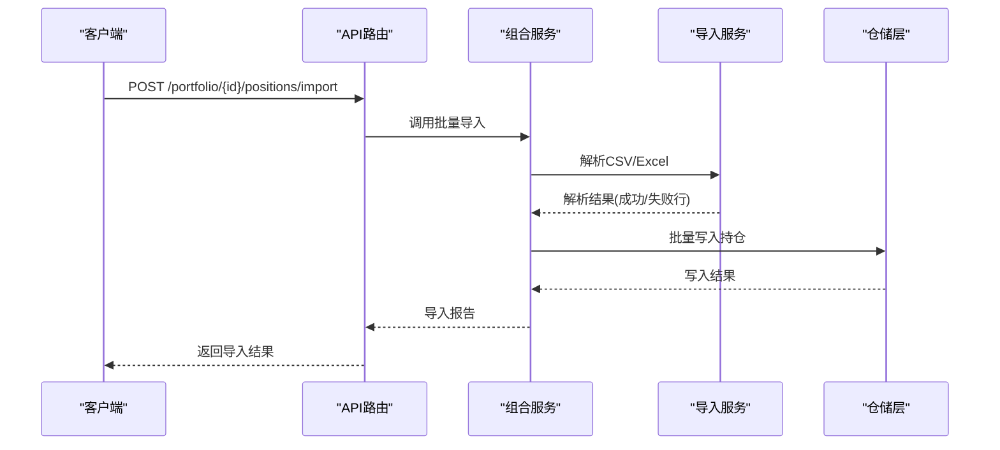

**图表来源** 
- [api/v1/endpoints/portfolio.py](file://api/v1/endpoints/portfolio.py)
- [src/services/portfolio_service.py](file://src/services/portfolio_service.py)
- [src/services/portfolio_import_service.py](file://src/services/portfolio_import_service.py)
- [src/repositories/portfolio_repo.py](file://src/repositories/portfolio_repo.py)

**章节来源**
- [api/v1/endpoints/portfolio.py](file://api/v1/endpoints/portfolio.py)
- [src/services/portfolio_import_service.py](file://src/services/portfolio_import_service.py)
- [src/repositories/portfolio_repo.py](file://src/repositories/portfolio_repo.py)

### 收益计算
- 日度收益：基于持仓市值变化与现金流调整计算。
- 累计收益：按时间序列累加日度收益。
- 超额收益：与基准对比计算相对表现。
- 归因分析：行业/因子贡献分解（可选）。

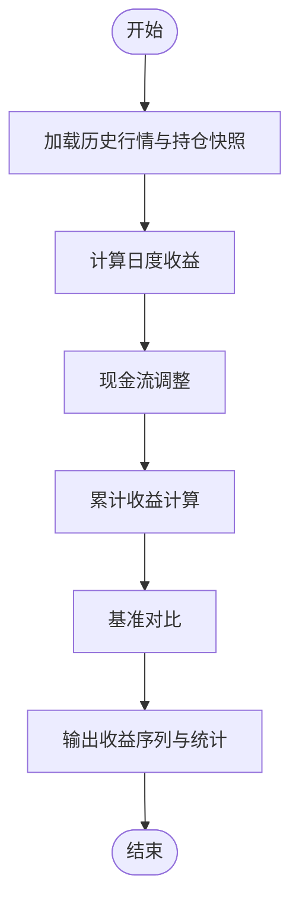

**图表来源** 
- [src/services/portfolio_service.py](file://src/services/portfolio_service.py)

**章节来源**
- [src/services/portfolio_service.py](file://src/services/portfolio_service.py)

### 风险评估
- 基础指标：年化收益、波动率、夏普比率、最大回撤。
- 尾部风险：VaR、CVaR（置信水平可配置）。
- 市场风险：Beta、跟踪误差、信息比率。
- 压力测试：极端情景下的损失估算（可选）。

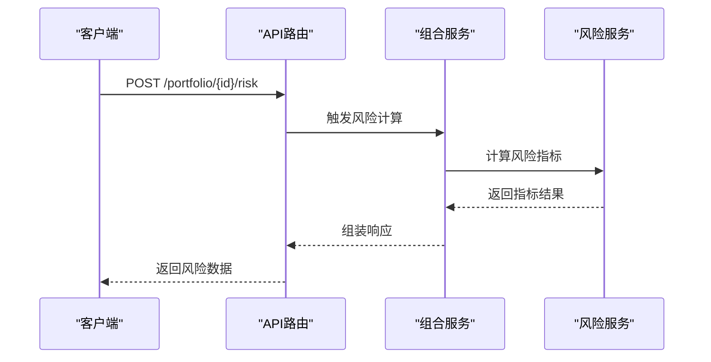

**图表来源** 
- [api/v1/endpoints/portfolio.py](file://api/v1/endpoints/portfolio.py)
- [src/services/portfolio_risk_service.py](file://src/services/portfolio_risk_service.py)

**章节来源**
- [api/v1/endpoints/portfolio.py](file://api/v1/endpoints/portfolio.py)
- [src/services/portfolio_risk_service.py](file://src/services/portfolio_risk_service.py)

### 回测与资产配置优化
- 回测引擎：支持多资产、多策略、交易成本与滑点模拟。
- 优化目标：最大化夏普、最小化回撤、目标波动率等。
- 约束条件：行业上限、个股权重上下限、流动性约束。
- 输出：最优权重、回测绩效、敏感性分析。

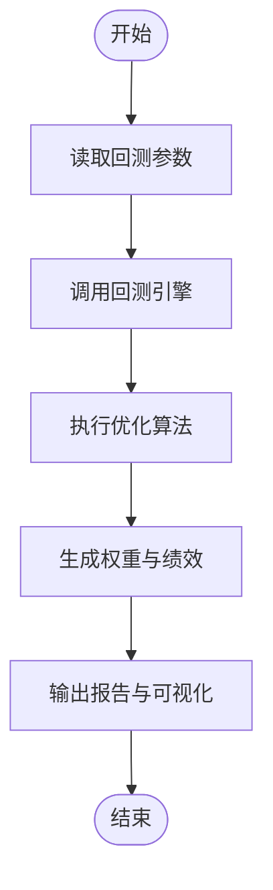

**图表来源** 
- [src/core/backtest_engine.py](file://src/core/backtest_engine.py)
- [src/services/portfolio_service.py](file://src/services/portfolio_service.py)

**章节来源**
- [src/core/backtest_engine.py](file://src/core/backtest_engine.py)
- [src/services/portfolio_service.py](file://src/services/portfolio_service.py)

### 批量导入导出
- 导入：支持CSV/Excel模板，字段映射、类型校验、重复检测、错误行定位。
- 导出：按模板导出组合与持仓数据，支持筛选与格式化。
- 事务性：导入失败回滚，保证数据一致性。

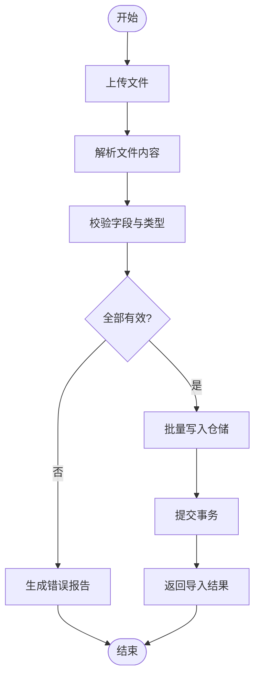

**图表来源** 
- [src/services/portfolio_import_service.py](file://src/services/portfolio_import_service.py)
- [src/repositories/portfolio_repo.py](file://src/repositories/portfolio_repo.py)

**章节来源**
- [src/services/portfolio_import_service.py](file://src/services/portfolio_import_service.py)
- [src/repositories/portfolio_repo.py](file://src/repositories/portfolio_repo.py)

### 智能分析与配置优化（Agent）
- 分析维度：历史表现、风险暴露、相关性、集中度。
- 建议生成：调仓建议、再平衡策略、风险对冲方案。
- 交互方式：自然语言问答与结构化建议输出。

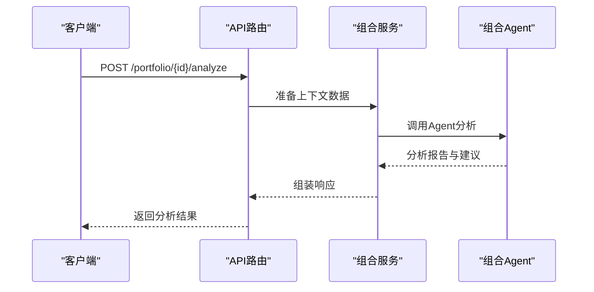

**图表来源** 
- [src/agent/agents/portfolio_agent.py](file://src/agent/agents/portfolio_agent.py)
- [src/services/portfolio_service.py](file://src/services/portfolio_service.py)

**章节来源**
- [src/agent/agents/portfolio_agent.py](file://src/agent/agents/portfolio_agent.py)
- [src/services/portfolio_service.py](file://src/services/portfolio_service.py)

### 前端集成与使用示例
- API封装：统一请求头、错误处理、重试与超时设置。
- 页面组件：组合列表、详情、持仓编辑、收益曲线、风险面板。
- 数据格式化：金额、百分比、日期与单位标准化。

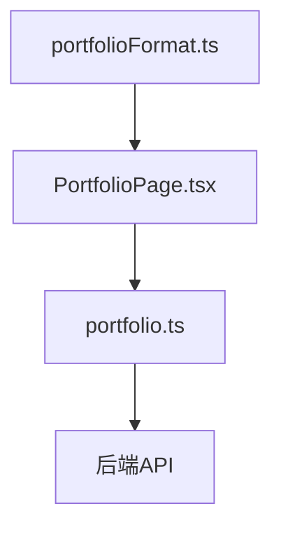

**图表来源** 
- [apps/dsa-web/src/api/portfolio.ts](file://apps/dsa-web/src/api/portfolio.ts)
- [apps/dsa-web/src/pages/PortfolioPage.tsx](file://apps/dsa-web/src/pages/PortfolioPage.tsx)
- [apps/dsa-web/src/utils/portfolioFormat.ts](file://apps/dsa-web/src/utils/portfolioFormat.ts)

**章节来源**
- [apps/dsa-web/src/api/portfolio.ts](file://apps/dsa-web/src/api/portfolio.ts)
- [apps/dsa-web/src/pages/PortfolioPage.tsx](file://apps/dsa-web/src/pages/PortfolioPage.tsx)
- [apps/dsa-web/src/utils/portfolioFormat.ts](file://apps/dsa-web/src/utils/portfolioFormat.ts)

## 依赖分析
- 模块耦合：API路由依赖服务层；服务层依赖仓储、风险服务、导入服务、回测引擎与Agent。
- 外部依赖：行情数据源、数据库、缓存与消息队列（按需）。
- 循环依赖：通过接口抽象与服务拆分避免。

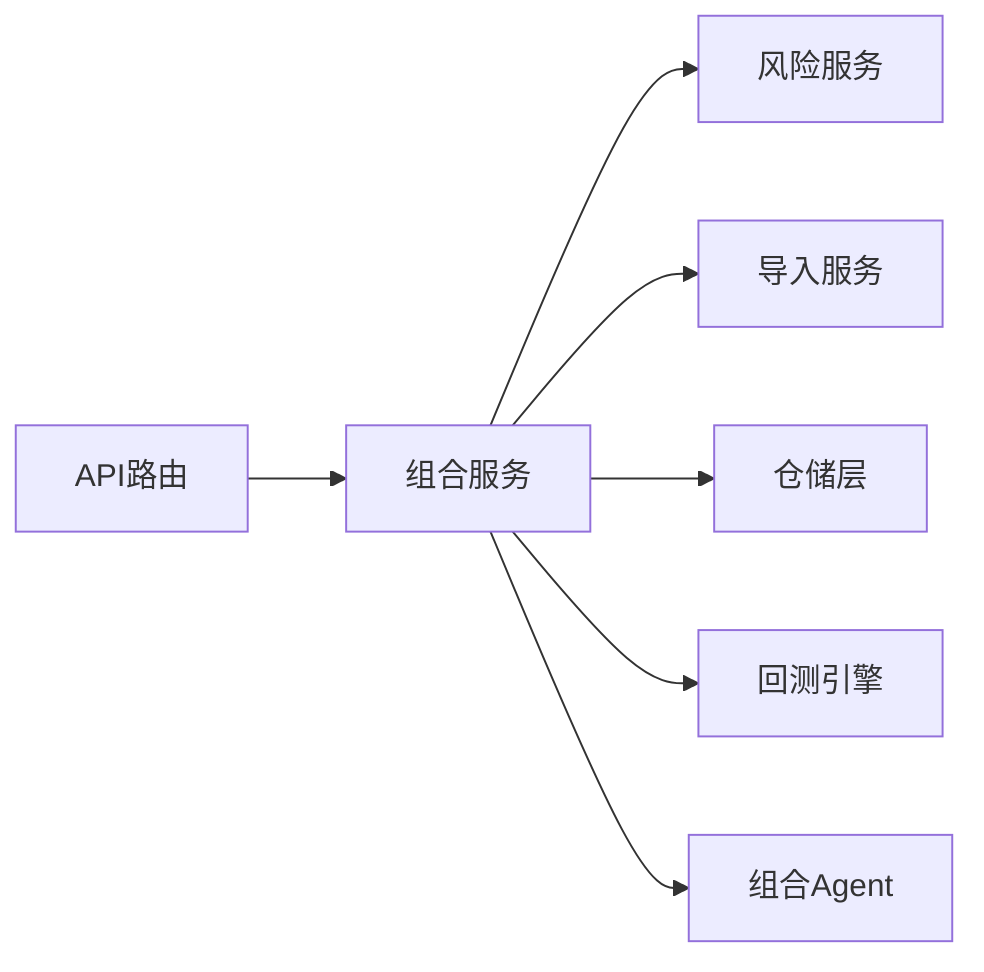

**图表来源** 
- [api/v1/endpoints/portfolio.py](file://api/v1/endpoints/portfolio.py)
- [src/services/portfolio_service.py](file://src/services/portfolio_service.py)
- [src/services/portfolio_risk_service.py](file://src/services/portfolio_risk_service.py)
- [src/services/portfolio_import_service.py](file://src/services/portfolio_import_service.py)
- [src/repositories/portfolio_repo.py](file://src/repositories/portfolio_repo.py)
- [src/core/backtest_engine.py](file://src/core/backtest_engine.py)
- [src/agent/agents/portfolio_agent.py](file://src/agent/agents/portfolio_agent.py)

**章节来源**
- [api/v1/endpoints/portfolio.py](file://api/v1/endpoints/portfolio.py)
- [src/services/portfolio_service.py](file://src/services/portfolio_service.py)

## 性能考虑
- 批量导入：分块处理、异步任务、错误隔离与重试。
- 风险计算：向量化计算、缓存中间结果、增量更新。
- 回测：并行回测、内存池、数据预取与索引优化。
- API响应：分页、懒加载、压缩传输与CDN加速。

[本节为通用指导，不直接分析具体文件]

## 故障排查指南
- 参数校验失败：检查必填字段、数据类型与范围限制。
- 导入失败：查看错误行定位与原因提示，修正后重试。
- 风险计算异常：确认数据完整性、时间对齐与基准可用性。
- 回测无结果：检查参数合法性、数据覆盖与引擎配置。
- 前端报错：核对API路径、鉴权令牌与跨域设置。

**章节来源**
- [api/v1/endpoints/portfolio.py](file://api/v1/endpoints/portfolio.py)
- [src/services/portfolio_import_service.py](file://src/services/portfolio_import_service.py)
- [src/services/portfolio_risk_service.py](file://src/services/portfolio_risk_service.py)
- [src/core/backtest_engine.py](file://src/core/backtest_engine.py)
- [apps/dsa-web/src/api/portfolio.ts](file://apps/dsa-web/src/api/portfolio.ts)

## 结论
本投资组合管理API提供完整的组合生命周期管理能力，涵盖创建、持仓、收益、风险、导入导出、回测与优化等关键功能。通过清晰的分层架构与完善的校验与错误处理，确保系统稳定可靠。结合前端封装与工具函数，便于快速集成与高效使用。

[本节为总结性内容，不直接分析具体文件]

## 附录
- 常用接口清单：组合CRUD、持仓管理、收益与风险计算、导入导出、回测与优化。
- 数据模型字典：组合、持仓、风险指标、回测参数、导入导出模板。
- 计算逻辑说明：收益序列构建、风险指标公式、回测流程与优化目标。
- 实际使用示例：前端调用步骤、错误处理与调试技巧。

[本节为补充信息，不直接分析具体文件]