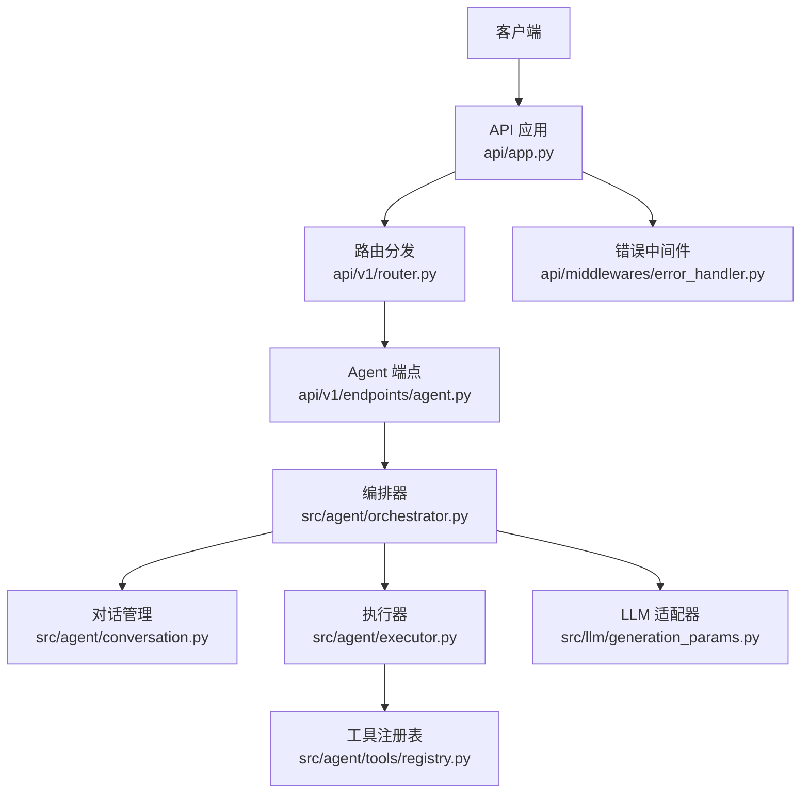
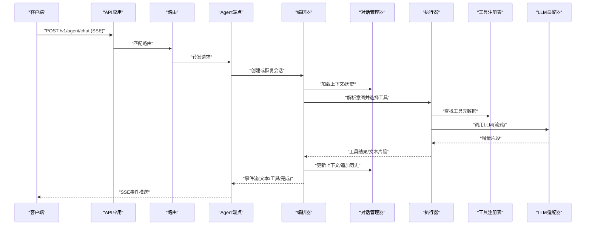
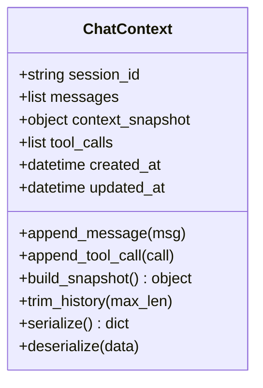
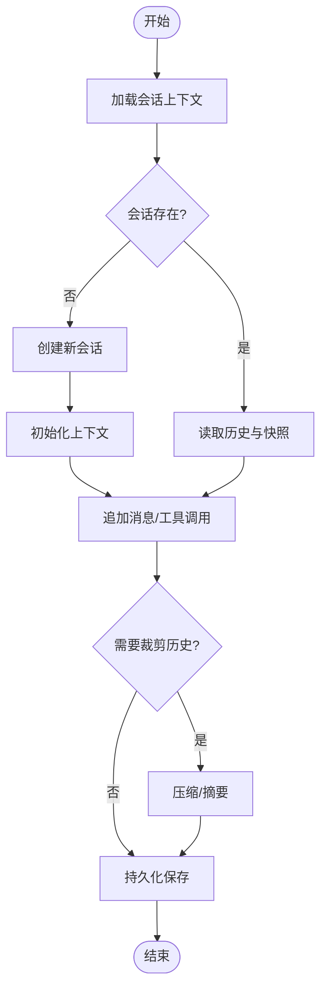
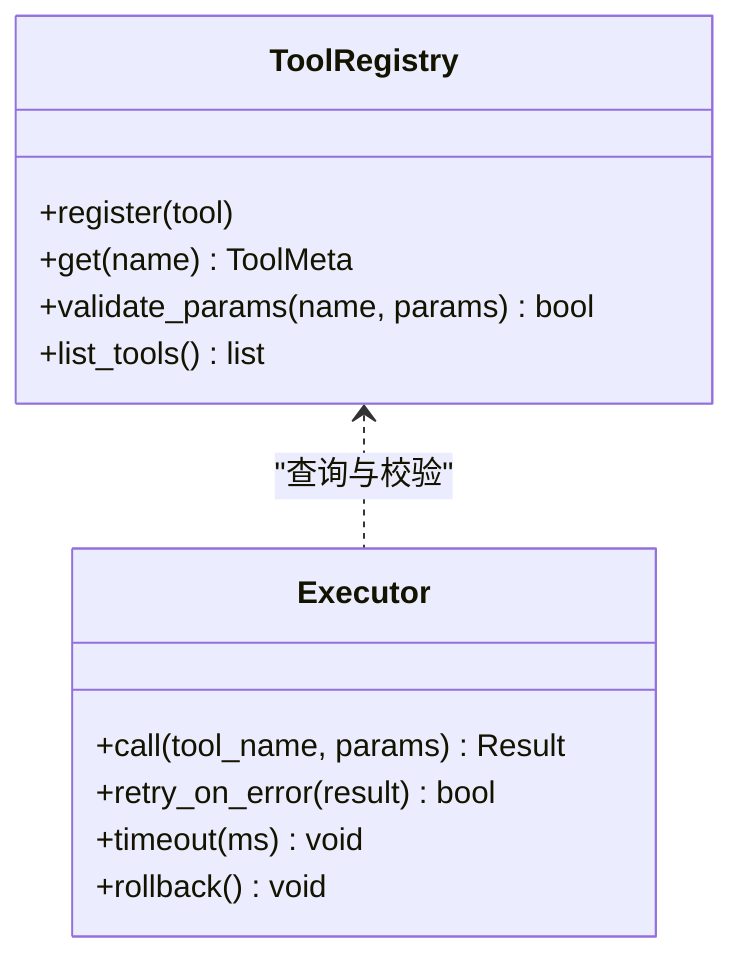
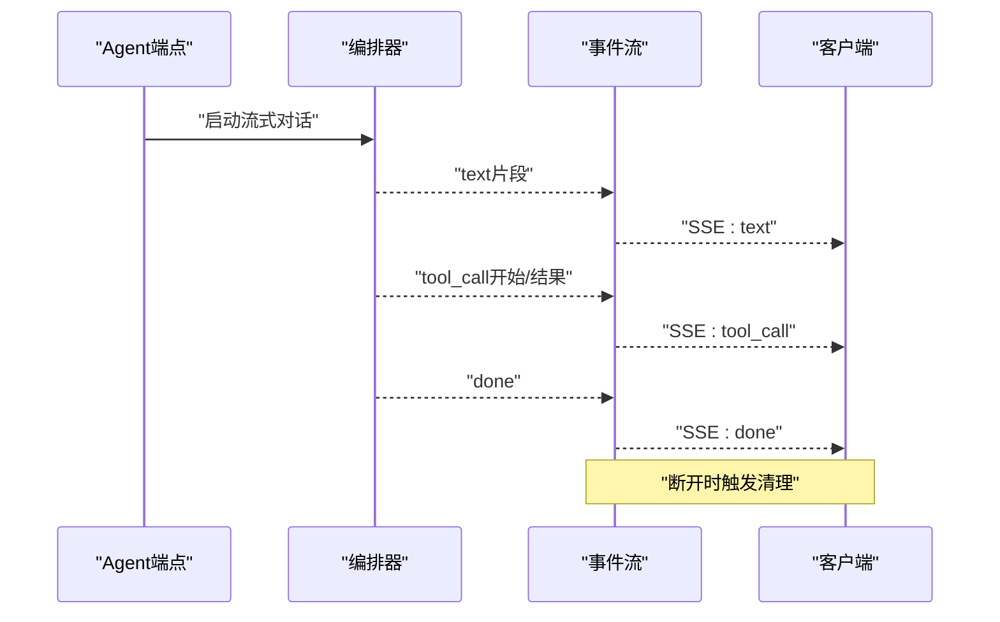
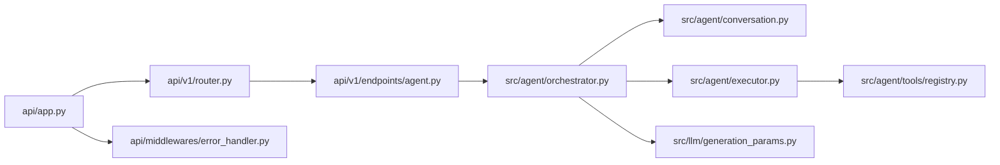

# 智能体对话API

<cite>
**本文档引用的文件**   
- [api/app.py](file://api/app.py)
- [api/v1/router.py](file://api/v1/router.py)
- [api/v1/endpoints/agent.py](file://api/v1/endpoints/agent.py)
- [src/agent/conversation.py](file://src/agent/conversation.py)
- [src/agent/chat_context.py](file://src/agent/chat_context.py)
- [src/agent/orchestrator.py](file://src/agent/orchestrator.py)
- [src/agent/executor.py](file://src/agent/executor.py)
- [src/agent/tools/registry.py](file://src/agent/tools/registry.py)
- [src/llm/generation_params.py](file://src/llm/generation_params.py)
- [api/middlewares/error_handler.py](file://api/middlewares/error_handler.py)
- [tests/test_agent_chat_api.py](file://tests/test_agent_chat_api.py)
- [tests/test_agent_sse_cleanup.py](file://tests/test_agent_sse_cleanup.py)
</cite>

## 目录
1. [简介](#简介)
2. [项目结构](#项目结构)
3. [核心组件](#核心组件)
4. [架构总览](#架构总览)
5. [详细组件分析](#详细组件分析)
6. [依赖关系分析](#依赖关系分析)
7. [性能考虑](#性能考虑)
8. [故障排查指南](#故障排查指南)
9. [结论](#结论)
10. [附录](#附录)

## 简介
本文件为智能体对话系统的API文档，聚焦以下能力：
- 对话上下文管理：会话状态、历史消息、上下文打包与持久化。
- 多轮对话处理：会话路由、增量更新、流式输出。
- 工具调用机制：工具注册、参数校验、执行与结果回写。
- SSE流式响应：事件类型、断线重连、清理策略。
- 错误处理策略：统一异常、重试与降级。
- 并发控制：请求限流、任务队列、锁与隔离。
- 集成示例与优化建议：前端对接、后端调优。

## 项目结构
系统采用分层与模块化组织：
- API层：FastAPI应用、路由、中间件、错误处理。
- Agent层：对话编排、上下文、工具、LLM适配。
- LLM层：生成参数、使用统计、错误定义。
- 测试层：端到端与单元用例覆盖SSE与清理流程。

**图表来源**
- [api/app.py](file://api/app.py)
- [api/v1/router.py](file://api/v1/router.py)
- [api/v1/endpoints/agent.py](file://api/v1/endpoints/agent.py)
- [src/agent/orchestrator.py](file://src/agent/orchestrator.py)
- [src/agent/conversation.py](file://src/agent/conversation.py)
- [src/agent/executor.py](file://src/agent/executor.py)
- [src/agent/tools/registry.py](file://src/agent/tools/registry.py)
- [src/llm/generation_params.py](file://src/llm/generation_params.py)
- [api/middlewares/error_handler.py](file://api/middlewares/error_handler.py)

**章节来源**
- [api/app.py](file://api/app.py)
- [api/v1/router.py](file://api/v1/router.py)
- [api/v1/endpoints/agent.py](file://api/v1/endpoints/agent.py)

## 核心组件
- 对话上下文（ChatContext）：维护会话ID、消息历史、上下文快照、工具调用记录、时间戳与版本。
- 对话管理器（Conversation）：会话生命周期、历史裁剪、持久化接口、并发访问控制。
- 编排器（Orchestrator）：解析用户意图、选择工具、调度执行、聚合结果、构建响应片段。
- 执行器（Executor）：工具调用封装、参数校验、超时与重试、错误归一化。
- 工具注册表（ToolRegistry）：工具声明、元数据、权限与版本控制。
- LLM生成参数（GenerationParams）：模型参数、温度、最大令牌、流式开关等。
- 错误中间件（ErrorHandler）：统一异常捕获、日志、标准化错误响应。

**章节来源**
- [src/agent/chat_context.py](file://src/agent/chat_context.py)
- [src/agent/conversation.py](file://src/agent/conversation.py)
- [src/agent/orchestrator.py](file://src/agent/orchestrator.py)
- [src/agent/executor.py](file://src/agent/executor.py)
- [src/agent/tools/registry.py](file://src/agent/tools/registry.py)
- [src/llm/generation_params.py](file://src/llm/generation_params.py)
- [api/middlewares/error_handler.py](file://api/middlewares/error_handler.py)

## 架构总览
下图展示一次SSE流式对话的完整调用链：从HTTP请求进入，经路由到Agent端点，编排器协调对话与工具执行，LLM返回增量片段，最终通过SSE推送给客户端。

**图表来源**
- [api/v1/endpoints/agent.py](file://api/v1/endpoints/agent.py)
- [src/agent/orchestrator.py](file://src/agent/orchestrator.py)
- [src/agent/conversation.py](file://src/agent/conversation.py)
- [src/agent/executor.py](file://src/agent/executor.py)
- [src/agent/tools/registry.py](file://src/agent/tools/registry.py)
- [src/llm/generation_params.py](file://src/llm/generation_params.py)

## 详细组件分析

### 对话上下文管理（ChatContext）
- 职责：维护会话ID、消息列表、上下文快照、工具调用记录、时间戳、版本号。
- 关键操作：
  - 追加消息与工具调用记录
  - 上下文快照生成与合并
  - 历史裁剪与压缩策略
  - 序列化/反序列化为持久化格式
- 复杂度：消息追加O(1)，历史裁剪O(n)，快照生成O(m)。

**图表来源**
- [src/agent/chat_context.py](file://src/agent/chat_context.py)

**章节来源**
- [src/agent/chat_context.py](file://src/agent/chat_context.py)

### 多轮对话处理（Conversation）
- 职责：会话生命周期管理、历史裁剪、持久化接口、并发访问控制。
- 关键操作：
  - 创建/恢复会话
  - 读取/写入上下文
  - 并发读写保护（锁/队列）
  - 持久化存储（内存/磁盘/数据库）
- 并发控制：基于会话ID的互斥锁，避免竞态条件；支持批量写入与事务性更新。

**图表来源**
- [src/agent/conversation.py](file://src/agent/conversation.py)

**章节来源**
- [src/agent/conversation.py](file://src/agent/conversation.py)

### 工具调用机制（Executor & ToolRegistry）
- 职责：工具发现、参数校验、执行封装、结果回写、错误归一化。
- 关键操作：
  - 工具注册与元数据描述
  - 参数模式校验（必填、类型、范围）
  - 执行器包装（超时、重试、降级）
  - 结果结构化与上下文注入
- 错误处理：统一异常类型、可重试标记、失败回滚。

**图表来源**
- [src/agent/tools/registry.py](file://src/agent/tools/registry.py)
- [src/agent/executor.py](file://src/agent/executor.py)

**章节来源**
- [src/agent/tools/registry.py](file://src/agent/tools/registry.py)
- [src/agent/executor.py](file://src/agent/executor.py)

### LLM生成参数（GenerationParams）
- 职责：集中管理模型参数（温度、最大令牌、流式开关、频率惩罚等）。
- 关键属性：
  - temperature、max_tokens、stream、top_p、frequency_penalty等
  - 默认值与校验规则
- 扩展性：支持动态参数注入与提供者差异兼容。

**章节来源**
- [src/llm/generation_params.py](file://src/llm/generation_params.py)

### SSE流式响应与清理
- 事件类型：
  - text：增量文本片段
  - tool_call：工具调用开始/结果
  - done：对话完成
  - error：错误事件
- 清理策略：
  - 客户端断开触发资源释放
  - 超时自动关闭连接
  - 会话上下文落盘保证一致性

**图表来源**
- [api/v1/endpoints/agent.py](file://api/v1/endpoints/agent.py)
- [tests/test_agent_sse_cleanup.py](file://tests/test_agent_sse_cleanup.py)

**章节来源**
- [api/v1/endpoints/agent.py](file://api/v1/endpoints/agent.py)
- [tests/test_agent_sse_cleanup.py](file://tests/test_agent_sse_cleanup.py)

### 错误处理策略
- 统一异常捕获：网络错误、LLM超时、工具执行失败、参数校验错误。
- 错误分类：可重试、不可重试、降级路径。
- 响应格式：标准错误码、消息、详情、建议操作。

**章节来源**
- [api/middlewares/error_handler.py](file://api/middlewares/error_handler.py)

## 依赖关系分析
- API层依赖路由与中间件，路由指向Agent端点。
- Agent端点依赖编排器、对话管理器、执行器、工具注册表、LLM适配器。
- 编排器协调对话与工具执行，确保上下文一致性与顺序性。
- 执行器依赖工具注册表进行参数校验与调用。
- LLM适配器提供流式与非流式生成能力。

**图表来源**
- [api/app.py](file://api/app.py)
- [api/v1/router.py](file://api/v1/router.py)
- [api/v1/endpoints/agent.py](file://api/v1/endpoints/agent.py)
- [src/agent/orchestrator.py](file://src/agent/orchestrator.py)
- [src/agent/conversation.py](file://src/agent/conversation.py)
- [src/agent/executor.py](file://src/agent/executor.py)
- [src/agent/tools/registry.py](file://src/agent/tools/registry.py)
- [src/llm/generation_params.py](file://src/llm/generation_params.py)
- [api/middlewares/error_handler.py](file://api/middlewares/error_handler.py)

**章节来源**
- [api/app.py](file://api/app.py)
- [api/v1/router.py](file://api/v1/router.py)
- [api/v1/endpoints/agent.py](file://api/v1/endpoints/agent.py)
- [src/agent/orchestrator.py](file://src/agent/orchestrator.py)
- [src/agent/conversation.py](file://src/agent/conversation.py)
- [src/agent/executor.py](file://src/agent/executor.py)
- [src/agent/tools/registry.py](file://src/agent/tools/registry.py)
- [src/llm/generation_params.py](file://src/llm/generation_params.py)
- [api/middlewares/error_handler.py](file://api/middlewares/error_handler.py)

## 性能考虑
- 流式传输：优先使用SSE减少首字节延迟，降低内存峰值。
- 上下文裁剪：按长度或时间窗口裁剪历史，避免上下文膨胀。
- 工具调用缓存：对幂等工具结果进行短期缓存。
- 并发控制：会话级锁+任务队列，限制同时处理的对话数。
- 超时与重试：设置合理超时，对瞬时错误进行指数退避重试。
- 资源清理：SSE断开立即释放资源，避免泄漏。

[本节为通用指导，不直接分析具体文件]

## 故障排查指南
- SSE断线：检查客户端连接状态与服务端清理逻辑。
- 上下文不一致：查看会话锁与持久化写入是否成功。
- 工具调用失败：核对工具元数据、参数校验与执行器日志。
- LLM超时：调整生成参数与超时阈值，启用降级路径。
- 错误响应：确认错误中间件是否正确捕获与格式化。

**章节来源**
- [tests/test_agent_chat_api.py](file://tests/test_agent_chat_api.py)
- [tests/test_agent_sse_cleanup.py](file://tests/test_agent_sse_cleanup.py)
- [api/middlewares/error_handler.py](file://api/middlewares/error_handler.py)

## 结论
本API文档围绕对话上下文、多轮对话、工具调用、SSE流式响应与错误处理展开，提供了清晰的架构视图与实现要点。通过会话级并发控制、上下文持久化与工具注册机制，系统具备高可用与可扩展性。建议在生产环境结合监控与日志完善问题定位，并根据业务负载优化上下文裁剪与工具缓存策略。

[本节为总结，不直接分析具体文件]

## 附录
- 集成示例：前端通过SSE订阅Agent端点，处理text/tool_call/done/error事件，维护本地消息列表与滚动行为。
- 配置项：LLM生成参数、工具超时、重试次数、上下文最大长度等。
- 测试用例：参考测试文件验证SSE清理、错误处理与上下文一致性。

[本节为补充信息，不直接分析具体文件]