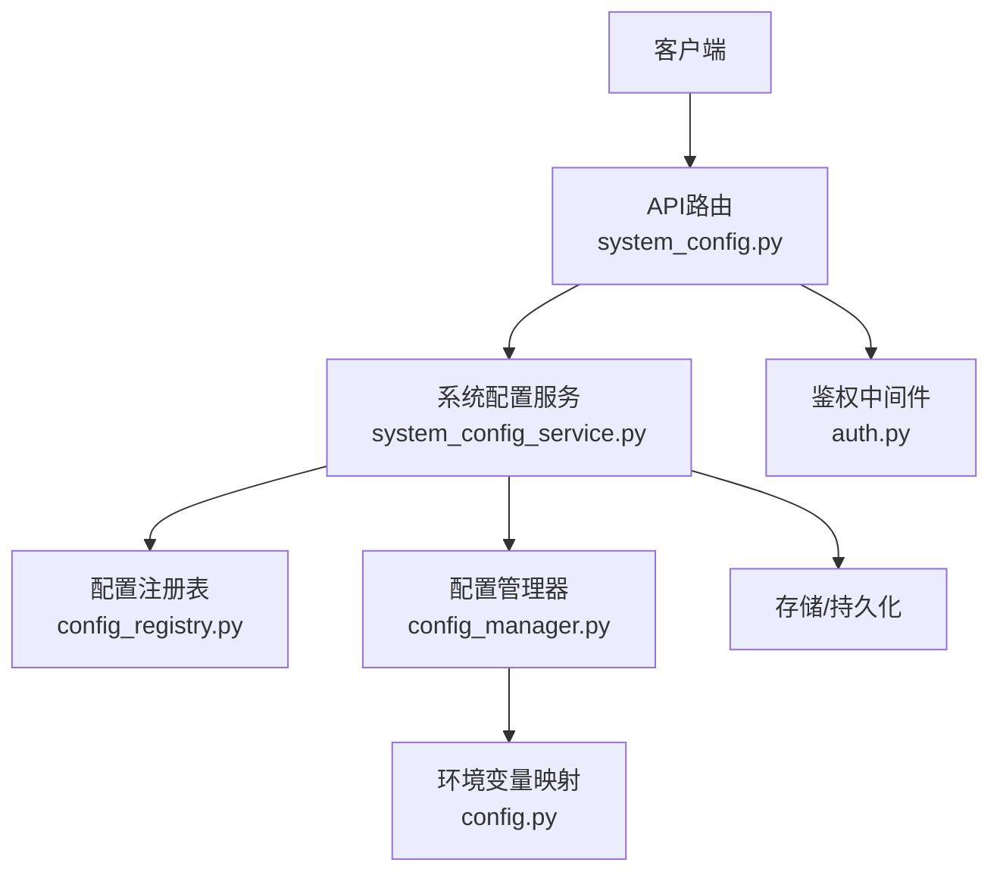
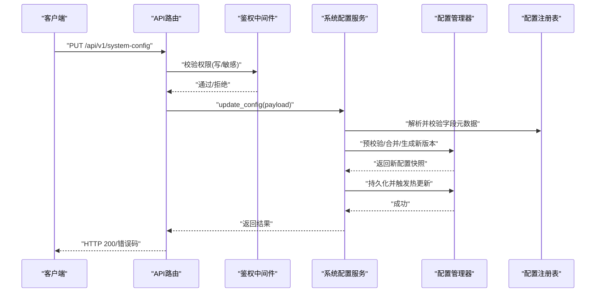
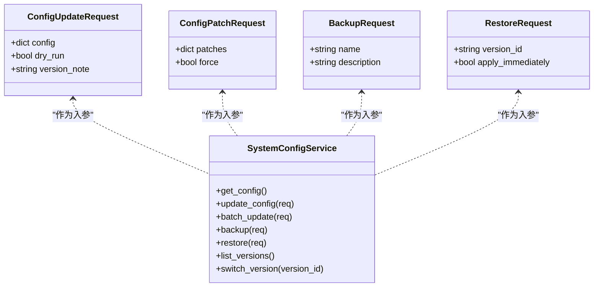
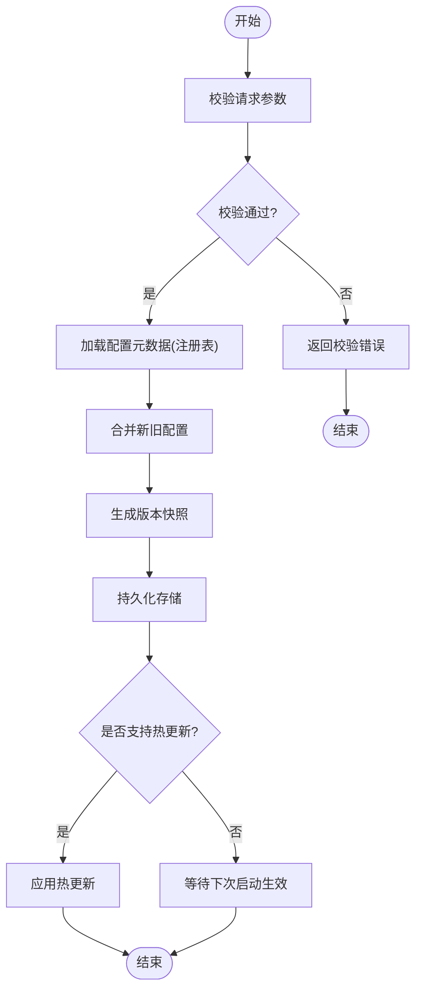
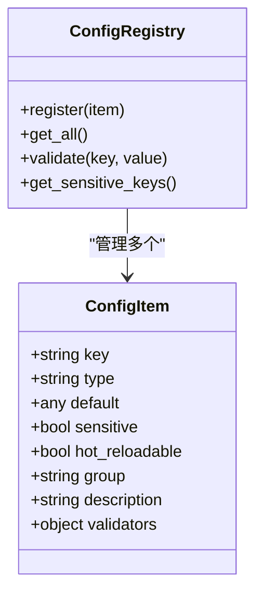
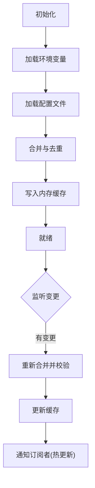
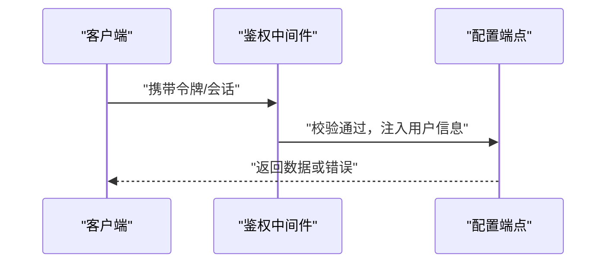
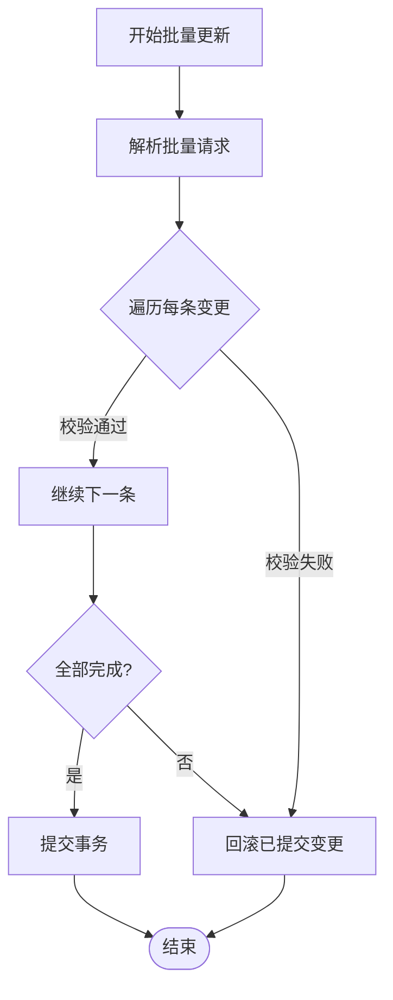
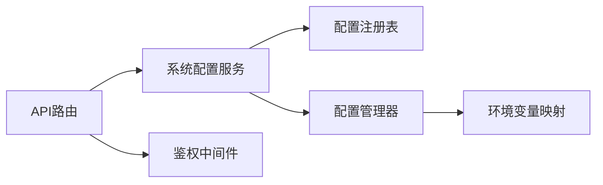

# 系统配置API

<cite>
**本文引用的文件**   
- [api/v1/endpoints/system_config.py](file://api/v1/endpoints/system_config.py)
- [api/v1/schemas/system_config.py](file://api/v1/schemas/system_config.py)
- [src/services/system_config_service.py](file://src/services/system_config_service.py)
- [src/core/config_manager.py](file://src/core/config_manager.py)
- [src/core/config_registry.py](file://src/core/config_registry.py)
- [api/middlewares/auth.py](file://api/middlewares/auth.py)
- [api/app.py](file://api/app.py)
- [src/config.py](file://src/config.py)
- [tests/test_system_config_api.py](file://tests/test_system_config_api.py)
- [tests/test_system_config_service.py](file://tests/test_system_config_service.py)
</cite>

## 目录
1. [简介](#简介)
2. [项目结构](#项目结构)
3. [核心组件](#核心组件)
4. [架构总览](#架构总览)
5. [详细组件分析](#详细组件分析)
6. [依赖关系分析](#依赖关系分析)
7. [性能考虑](#性能考虑)
8. [故障排查指南](#故障排查指南)
9. [结论](#结论)
10. [附录](#附录)

## 简介
本文件面向“系统配置管理API”，系统化说明配置项的读取、修改与验证流程，覆盖数据结构定义、环境变量映射、动态更新机制、备份恢复、版本管理与权限控制。文档同时提供配置模板与批量操作示例，帮助开发者快速集成与运维。

## 项目结构
围绕系统配置管理的代码主要分布在以下位置：
- API层：路由与请求/响应模型定义
- 服务层：业务逻辑（校验、持久化、版本、备份）
- 核心层：配置注册表与配置管理器（含环境映射、运行时更新）
- 中间件：鉴权与错误处理
- 测试：接口与服务行为验证

**图示来源** 
- [api/v1/endpoints/system_config.py](file://api/v1/endpoints/system_config.py)
- [src/services/system_config_service.py](file://src/services/system_config_service.py)
- [src/core/config_registry.py](file://src/core/config_registry.py)
- [src/core/config_manager.py](file://src/core/config_manager.py)
- [src/config.py](file://src/config.py)
- [api/middlewares/auth.py](file://api/middlewares/auth.py)

**章节来源**
- [api/v1/endpoints/system_config.py](file://api/v1/endpoints/system_config.py)
- [api/v1/schemas/system_config.py](file://api/v1/schemas/system_config.py)
- [src/services/system_config_service.py](file://src/services/system_config_service.py)
- [src/core/config_manager.py](file://src/core/config_manager.py)
- [src/core/config_registry.py](file://src/core/config_registry.py)
- [src/config.py](file://src/config.py)
- [api/middlewares/auth.py](file://api/middlewares/auth.py)

## 核心组件
- 路由与Schema：定义REST端点与Pydantic数据模型，负责输入校验与输出序列化
- 系统配置服务：封装配置读改、验证、版本、备份恢复、批量操作等核心能力
- 配置注册表：集中声明配置项元数据（类型、默认值、是否敏感、是否可热更等）
- 配置管理器：统一加载、合并、缓存、写入与热更新；与环境变量映射联动
- 鉴权中间件：基于角色的访问控制（RBAC），保护写操作与敏感字段

**章节来源**
- [api/v1/schemas/system_config.py](file://api/v1/schemas/system_config.py)
- [src/services/system_config_service.py](file://src/services/system_config_service.py)
- [src/core/config_registry.py](file://src/core/config_registry.py)
- [src/core/config_manager.py](file://src/core/config_manager.py)
- [api/middlewares/auth.py](file://api/middlewares/auth.py)

## 架构总览
下图展示一次“更新配置”的完整调用链，包括鉴权、校验、版本快照、持久化与热更新。

**图示来源** 
- [api/v1/endpoints/system_config.py](file://api/v1/endpoints/system_config.py)
- [api/middlewares/auth.py](file://api/middlewares/auth.py)
- [src/services/system_config_service.py](file://src/services/system_config_service.py)
- [src/core/config_manager.py](file://src/core/config_manager.py)
- [src/core/config_registry.py](file://src/core/config_registry.py)

## 详细组件分析

### API路由与Schema
- 路由职责
  - 暴露配置查询、更新、批量更新、备份/恢复、版本列表与切换等端点
  - 将请求体绑定到Pydantic模型，自动完成类型与约束校验
- Schema设计要点
  - 使用Pydantic v2进行严格校验（必填、枚举、范围、正则等）
  - 敏感字段支持掩码输出与写入白名单
  - 批量操作采用数组或字典批量提交，服务端按项校验

**图示来源** 
- [api/v1/schemas/system_config.py](file://api/v1/schemas/system_config.py)
- [src/services/system_config_service.py](file://src/services/system_config_service.py)

**章节来源**
- [api/v1/endpoints/system_config.py](file://api/v1/endpoints/system_config.py)
- [api/v1/schemas/system_config.py](file://api/v1/schemas/system_config.py)

### 系统配置服务
- 功能边界
  - 读取：聚合注册表与当前运行态，返回一致视图
  - 修改：逐项校验、合并、生成版本快照、持久化、触发热更新
  - 验证：结合注册表元数据与业务规则进行强校验
  - 备份恢复：按版本ID创建/回滚，支持描述信息与审计
  - 版本管理：列出历史版本、切换生效、保留策略
  - 批量操作：原子性事务（全部成功或全部失败）
- 关键流程
  - 预校验：检查字段存在性、类型、取值范围、依赖关系
  - 版本化：每次变更生成不可变快照，附带时间戳与备注
  - 热更新：对支持热更的配置项即时生效，无需重启

**图示来源** 
- [src/services/system_config_service.py](file://src/services/system_config_service.py)
- [src/core/config_registry.py](file://src/core/config_registry.py)
- [src/core/config_manager.py](file://src/core/config_manager.py)

**章节来源**
- [src/services/system_config_service.py](file://src/services/system_config_service.py)

### 配置注册表
- 作用
  - 集中声明所有配置项的元数据：名称、类型、默认值、是否敏感、是否可热更、分组、描述、校验规则等
  - 为服务层提供统一的“配置字典”与“校验器”
- 设计要点
  - 分层分组：便于前端渲染与权限控制
  - 可扩展：新增配置项只需在注册表中声明
  - 安全：敏感字段标记，避免日志泄露

**图示来源** 
- [src/core/config_registry.py](file://src/core/config_registry.py)

**章节来源**
- [src/core/config_registry.py](file://src/core/config_registry.py)

### 配置管理器
- 职责
  - 加载：从配置文件、环境变量、数据库/文件系统等多源合并
  - 缓存：内存中维护当前有效配置，减少IO
  - 写入：持久化变更，保证幂等与一致性
  - 热更新：监听变更事件，按需刷新运行期状态
- 环境变量映射
  - 支持前缀、大小写转换、类型转换
  - 优先级：显式设置 > 环境变量 > 默认值

**图示来源** 
- [src/core/config_manager.py](file://src/core/config_manager.py)
- [src/config.py](file://src/config.py)

**章节来源**
- [src/core/config_manager.py](file://src/core/config_manager.py)
- [src/config.py](file://src/config.py)

### 鉴权与权限控制
- 鉴权策略
  - 读操作：允许认证用户或特定角色
  - 写操作：需要管理员或指定角色
  - 敏感字段：仅允许受信任角色读写
- 实现方式
  - 中间件拦截请求，注入用户上下文
  - 路由级装饰器或守卫函数校验权限
  - 失败时返回标准错误码与消息

**图示来源** 
- [api/middlewares/auth.py](file://api/middlewares/auth.py)
- [api/v1/endpoints/system_config.py](file://api/v1/endpoints/system_config.py)

**章节来源**
- [api/middlewares/auth.py](file://api/middlewares/auth.py)
- [api/v1/endpoints/system_config.py](file://api/v1/endpoints/system_config.py)

### 配置模板与批量操作
- 配置模板
  - 提供JSON/YAML模板，包含常用分组与默认值
  - 支持导入模板一键初始化
- 批量操作
  - 支持一次性提交多条配置变更
  - 服务端逐条校验，整体原子提交
  - 失败回滚，保证一致性

**图示来源** 
- [src/services/system_config_service.py](file://src/services/system_config_service.py)
- [api/v1/schemas/system_config.py](file://api/v1/schemas/system_config.py)

**章节来源**
- [src/services/system_config_service.py](file://src/services/system_config_service.py)
- [api/v1/schemas/system_config.py](file://api/v1/schemas/system_config.py)

## 依赖关系分析
- 组件耦合
  - 路由依赖Schema与服务层
  - 服务层依赖注册表与管理器
  - 管理器依赖配置源与环境映射
  - 鉴权中间件独立于业务，横切关注点
- 外部依赖
  - 存储后端（文件/数据库）
  - 消息总线/事件（用于热更新广播）

**图示来源** 
- [api/v1/endpoints/system_config.py](file://api/v1/endpoints/system_config.py)
- [src/services/system_config_service.py](file://src/services/system_config_service.py)
- [src/core/config_registry.py](file://src/core/config_registry.py)
- [src/core/config_manager.py](file://src/core/config_manager.py)
- [src/config.py](file://src/config.py)
- [api/middlewares/auth.py](file://api/middlewares/auth.py)

**章节来源**
- [api/v1/endpoints/system_config.py](file://api/v1/endpoints/system_config.py)
- [src/services/system_config_service.py](file://src/services/system_config_service.py)
- [src/core/config_registry.py](file://src/core/config_registry.py)
- [src/core/config_manager.py](file://src/core/config_manager.py)
- [src/config.py](file://src/config.py)
- [api/middlewares/auth.py](file://api/middlewares/auth.py)

## 性能考虑
- 缓存优先：读路径优先命中内存缓存，降低IO压力
- 增量更新：仅对变更项执行热更新，避免全量重启
- 批量提交：合并多次小变更为大事务，减少锁竞争
- 异步处理：耗时操作（如备份导出）异步化，不阻塞主流程
- 限流与熔断：对高频写操作进行限流，防止雪崩

[本节为通用指导，不直接分析具体文件]

## 故障排查指南
- 常见问题
  - 权限不足：检查用户角色与端点权限配置
  - 校验失败：核对字段类型、取值范围与依赖关系
  - 热更新未生效：确认配置项是否标记为可热更
  - 版本回滚失败：检查版本ID是否存在与完整性
- 定位方法
  - 查看接口错误码与消息
  - 检查服务日志中的校验与持久化步骤
  - 对比注册表元数据与实际提交内容
  - 使用备份恢复验证一致性

**章节来源**
- [tests/test_system_config_api.py](file://tests/test_system_config_api.py)
- [tests/test_system_config_service.py](file://tests/test_system_config_service.py)

## 结论
系统配置API通过清晰的层次划分与严格的校验机制，实现了配置的集中化管理、版本化与热更新。配合鉴权中间件与备份恢复能力，可满足生产环境的稳定性与安全要求。建议在生产部署时启用最小权限原则与审计日志，并结合监控告警保障可用性。

[本节为总结，不直接分析具体文件]

## 附录
- 环境变量映射示例
  - 前缀：APP_CONFIG_
  - 键名：大写+下划线
  - 类型：自动转换为布尔、整数、浮点、字符串、数组
- 配置模板示例
  - 基础分组：系统、数据库、LLM、通知
  - 默认值：提供稳定基线，便于快速启动
- 批量操作示例
  - 提交数组形式的变更集，服务端逐条校验后原子提交
- 参考测试用例
  - 接口契约与行为验证
  - 服务层边界条件与异常路径

[本节为补充材料，不直接分析具体文件]