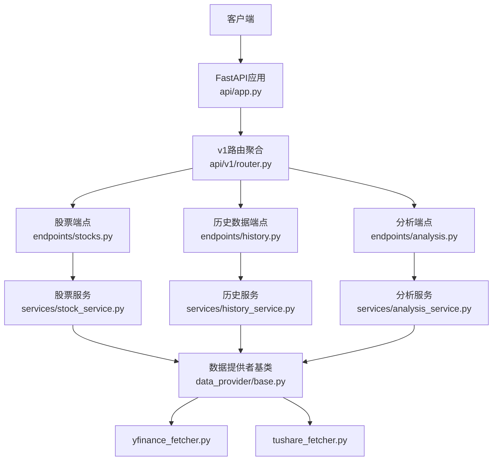
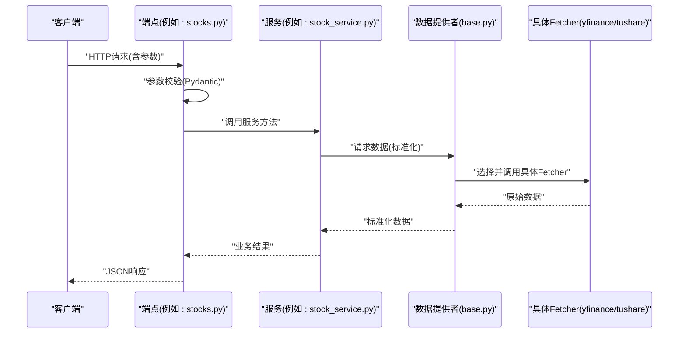
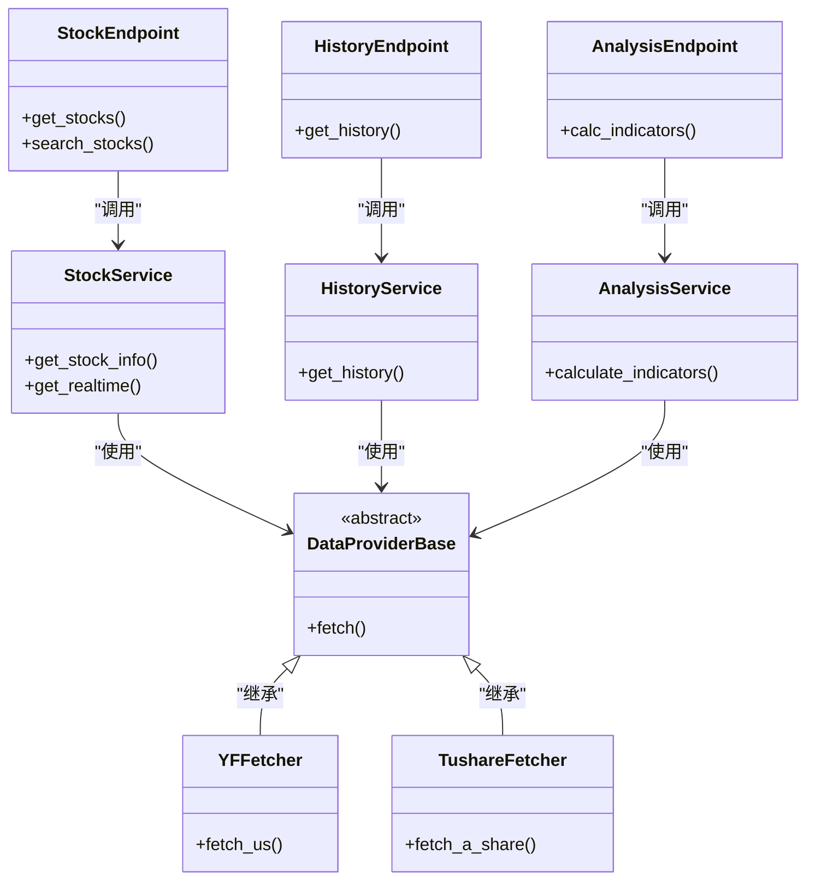

# 股票分析API

<cite>
**本文引用的文件**   
- [api/app.py](file://api/app.py)
- [api/v1/router.py](file://api/v1/router.py)
- [api/v1/endpoints/stocks.py](file://api/v1/endpoints/stocks.py)
- [api/v1/endpoints/history.py](file://api/v1/endpoints/history.py)
- [api/v1/endpoints/analysis.py](file://api/v1/endpoints/analysis.py)
- [api/v1/schemas/stocks.py](file://api/v1/schemas/stocks.py)
- [api/v1/schemas/history.py](file://api/v1/schemas/history.py)
- [api/v1/schemas/analysis.py](file://api/v1/schemas/analysis.py)
- [api/v1/errors.py](file://api/v1/errors.py)
- [api/middlewares/error_handler.py](file://api/middlewares/error_handler.py)
- [src/services/stock_service.py](file://src/services/stock_service.py)
- [src/services/history_service.py](file://src/services/history_service.py)
- [src/services/analysis_service.py](file://src/services/analysis_service.py)
- [data_provider/base.py](file://data_provider/base.py)
- [data_provider/yfinance_fetcher.py](file://data_provider/yfinance_fetcher.py)
- [data_provider/tushare_fetcher.py](file://data_provider/tushare_fetcher.py)
- [data_provider/fundamental_adapter.py](file://data_provider/fundamental_adapter.py)
- [src/services/stock_code_utils.py](file://src/services/stock_code_utils.py)
- [src/enums.py](file://src/enums.py)
</cite>

## 目录
1. [简介](#简介)
2. [项目结构](#项目结构)
3. [核心组件](#核心组件)
4. [架构总览](#架构总览)
5. [详细组件分析](#详细组件分析)
6. [依赖分析](#依赖分析)
7. [性能考虑](#性能考虑)
8. [故障排查指南](#故障排查指南)
9. [结论](#结论)
10. [附录](#附录)

## 简介
本文件为“股票分析API”的完整接口文档，覆盖以下能力：
- 股票信息查询（名称、代码映射、基础信息）
- 技术分析指标计算（如均线、RSI、MACD等）
- 基本面数据获取（财务与估值相关字段）
- 历史K线数据查询（支持分页与时间范围筛选）
- 实时行情获取（按市场路由到不同数据源）

文档包含：
- 请求参数校验规则
- 响应数据结构说明
- 分页机制规范
- 股票代码转换方法
- 历史数据查询与实时行情的具体示例
- 错误码含义与处理策略

## 项目结构
后端采用分层架构：
- API层：FastAPI应用、路由注册、中间件、统一错误处理
- 服务层：业务编排与领域逻辑（股票、历史、分析）
- 数据提供者：多源数据拉取与适配（yfinance、tushare、akshare等）
- 模型与Schema：Pydantic定义请求/响应结构与校验规则

图表来源
- [api/app.py](file://api/app.py)
- [api/v1/router.py](file://api/v1/router.py)
- [api/v1/endpoints/stocks.py](file://api/v1/endpoints/stocks.py)
- [api/v1/endpoints/history.py](file://api/v1/endpoints/history.py)
- [api/v1/endpoints/analysis.py](file://api/v1/endpoints/analysis.py)
- [src/services/stock_service.py](file://src/services/stock_service.py)
- [src/services/history_service.py](file://src/services/history_service.py)
- [src/services/analysis_service.py](file://src/services/analysis_service.py)
- [data_provider/base.py](file://data_provider/base.py)
- [data_provider/yfinance_fetcher.py](file://data_provider/yfinance_fetcher.py)
- [data_provider/tushare_fetcher.py](file://data_provider/tushare_fetcher.py)

章节来源
- [api/app.py](file://api/app.py)
- [api/v1/router.py](file://api/v1/router.py)

## 核心组件
- 股票查询组件
  - 功能：根据代码或名称解析并返回股票基础信息；支持A股、港股、美股等多市场。
  - 关键路径：[api/v1/endpoints/stocks.py](file://api/v1/endpoints/stocks.py) -> [src/services/stock_service.py](file://src/services/stock_service.py)
- 历史数据组件
  - 功能：按时间范围、复权方式、周期获取K线数据；支持分页。
  - 关键路径：[api/v1/endpoints/history.py](file://api/v1/endpoints/history.py) -> [src/services/history_service.py](file://src/services/history_service.py)
- 技术分析组件
  - 功能：计算常用技术指标（MA、EMA、RSI、MACD、布林带等），支持自定义窗口与参数。
  - 关键路径：[api/v1/endpoints/analysis.py](file://api/v1/endpoints/analysis.py) -> [src/services/analysis_service.py](file://src/services/analysis_service.py)
- 数据提供者
  - 功能：封装多数据源的拉取与标准化，提供统一的接口契约。
  - 关键路径：[data_provider/base.py](file://data_provider/base.py)、[data_provider/yfinance_fetcher.py](file://data_provider/yfinance_fetcher.py)、[data_provider/tushare_fetcher.py](file://data_provider/tushare_fetcher.py)

章节来源
- [api/v1/endpoints/stocks.py](file://api/v1/endpoints/stocks.py)
- [src/services/stock_service.py](file://src/services/stock_service.py)
- [api/v1/endpoints/history.py](file://api/v1/endpoints/history.py)
- [src/services/history_service.py](file://src/services/history_service.py)
- [api/v1/endpoints/analysis.py](file://api/v1/endpoints/analysis.py)
- [src/services/analysis_service.py](file://src/services/analysis_service.py)
- [data_provider/base.py](file://data_provider/base.py)
- [data_provider/yfinance_fetcher.py](file://data_provider/yfinance_fetcher.py)
- [data_provider/tushare_fetcher.py](file://data_provider/tushare_fetcher.py)

## 架构总览
整体调用链遵循“端点->服务->数据提供者”的分层模式，配合Pydantic进行强类型校验，并通过统一错误中间件输出标准化错误。

图表来源
- [api/v1/endpoints/stocks.py](file://api/v1/endpoints/stocks.py)
- [src/services/stock_service.py](file://src/services/stock_service.py)
- [data_provider/base.py](file://data_provider/base.py)
- [data_provider/yfinance_fetcher.py](file://data_provider/yfinance_fetcher.py)
- [data_provider/tushare_fetcher.py](file://data_provider/tushare_fetcher.py)

## 详细组件分析

### 股票信息查询接口
- 功能概述
  - 根据股票代码或名称返回股票基本信息（名称、市场、交易所、上市状态等）。
  - 支持代码自动补全与模糊搜索。
- 请求参数
  - 代码/名称：二选一，至少提供一个；支持A股、港股、美股前缀（如 sh600000、hk00700、us.AAPL）。
  - 市场过滤：可选，用于限定查询范围。
  - 模糊匹配开关：可选，默认关闭。
- 参数校验规则
  - 必填校验、长度限制、字符集限制、市场枚举值校验。
- 响应数据结构
  - 列表项包含：代码、名称、市场、交易所、行业、上市日期、状态等。
- 分页机制
  - 该接口通常返回精确匹配结果，无需分页；若开启模糊搜索，建议限制返回条数。
- 示例
  - 查询A股代码：GET /api/v1/stocks?code=sh600000
  - 模糊搜索名称：GET /api/v1/stocks?name=茅台&fuzzy=true
- 错误处理
  - 未找到：返回空列表或特定错误码
  - 参数非法：返回参数校验错误

章节来源
- [api/v1/endpoints/stocks.py](file://api/v1/endpoints/stocks.py)
- [api/v1/schemas/stocks.py](file://api/v1/schemas/stocks.py)
- [src/services/stock_service.py](file://src/services/stock_service.py)

### 历史数据查询接口
- 功能概述
  - 按时间范围、复权方式、周期获取K线数据；支持分页。
- 请求参数
  - code：必填，股票代码（支持多市场前缀）
  - start_date/end_date：必填，起止日期（YYYY-MM-DD）
  - period：可选，日线/周线/月线等
  - adjusted：可选，不复权/前复权/后复权
  - page/page_size：可选，分页参数
- 参数校验规则
  - 日期格式、区间合法性、period枚举、adjusted枚举、page/page_size正整数限制
- 响应数据结构
  - 列表项包含：日期、开盘、收盘、最高、最低、成交量、成交额、复权因子等
  - 分页元数据：total、page、page_size、has_next
- 分页机制
  - 基于page与page_size；服务端限制最大page_size（防止过大负载）
- 示例
  - GET /api/v1/history?code=sh600000&start_date=2024-01-01&end_date=2024-12-31&period=daily&adjusted=front&page=1&page_size=100
- 错误处理
  - 无数据：返回空列表+分页元数据
  - 参数非法：返回参数校验错误
  - 数据源异常：返回服务错误码

章节来源
- [api/v1/endpoints/history.py](file://api/v1/endpoints/history.py)
- [api/v1/schemas/history.py](file://api/v1/schemas/history.py)
- [src/services/history_service.py](file://src/services/history_service.py)

### 技术分析指标计算接口
- 功能概述
  - 对历史K线数据进行技术指标计算，支持多种指标与参数配置。
- 请求参数
  - code：必填
  - start_date/end_date：必填
  - indicators：必填，指标数组（如 ma, ema, rsi, macd, boll）
  - params：可选，各指标的窗口与参数映射
- 参数校验规则
  - 指标名白名单、参数范围校验、窗口大小下限检查
- 响应数据结构
  - 每个指标返回对应时间序列数值；缺失值以null表示
- 示例
  - POST /api/v1/analysis/indicators
  - 请求体：{"code":"sh600000","start_date":"2024-01-01","end_date":"2024-12-31","indicators":["ma","rsi"],"params":{"ma":[5,10,20],"rsi":14}}
- 错误处理
  - 指标不存在：返回参数错误
  - 数据不足：返回部分指标不可用提示

章节来源
- [api/v1/endpoints/analysis.py](file://api/v1/endpoints/analysis.py)
- [api/v1/schemas/analysis.py](file://api/v1/schemas/analysis.py)
- [src/services/analysis_service.py](file://src/services/analysis_service.py)

### 基本面数据获取接口
- 功能概述
  - 获取公司财务与估值相关数据（营收、净利润、PE/PB等）。
- 请求参数
  - code：必填
  - report_type：可选，年报/季报
  - fields：可选，指定返回字段
- 参数校验规则
  - 字段白名单、报告类型枚举
- 响应数据结构
  - 按报告期返回结构化财务字段
- 示例
  - GET /api/v1/fundamentals?code=sh600000&report_type=annual&fields=revenue,net_profit,pe,pb
- 错误处理
  - 数据源不可用：返回降级或空数据
  - 字段不存在：忽略或返回空

章节来源
- [data_provider/fundamental_adapter.py](file://data_provider/fundamental_adapter.py)

### 实时行情获取接口
- 功能概述
  - 获取最新报价、涨跌幅、成交量等实时数据；按市场路由至合适数据源。
- 请求参数
  - codes：必填，多个代码逗号分隔
  - market：可选，强制指定市场
- 参数校验规则
  - 代码格式、数量上限
- 响应数据结构
  - 每个代码返回最新价、涨跌额、涨跌幅、成交量、成交额、时间戳等
- 示例
  - GET /api/v1/realtime?codes=sh600000,hk00700,us.AAPL
- 错误处理
  - 单只股票失败不影响其他股票返回
  - 数据源限流：重试或降级

章节来源
- [src/services/stock_service.py](file://src/services/stock_service.py)

### 股票代码转换工具
- 功能概述
  - 将用户输入的代码转换为内部标准格式（如 sh600000、hk00700、us.AAPL）。
- 使用场景
  - 前端自动补全、跨市场统一查询、历史数据对齐
- 实现要点
  - 前缀识别、交易所映射、大小写规范化
- 示例
  - 输入：600000 -> 输出：sh600000
  - 输入：AAPL -> 输出：us.AAPL

章节来源
- [src/services/stock_code_utils.py](file://src/services/stock_code_utils.py)

## 依赖分析
- 组件耦合关系
  - 端点仅负责参数校验与响应组装，不直接访问数据源
  - 服务层编排业务逻辑，屏蔽数据源差异
  - 数据提供者提供统一抽象，具体Fetcher实现市场差异
- 外部依赖
  - yfinance：美股/部分港股数据
  - tushare：A股数据（需Token）
  - akshare：补充数据源
- 潜在循环依赖
  - 通过接口解耦，避免循环导入

图表来源
- [api/v1/endpoints/stocks.py](file://api/v1/endpoints/stocks.py)
- [api/v1/endpoints/history.py](file://api/v1/endpoints/history.py)
- [api/v1/endpoints/analysis.py](file://api/v1/endpoints/analysis.py)
- [src/services/stock_service.py](file://src/services/stock_service.py)
- [src/services/history_service.py](file://src/services/history_service.py)
- [src/services/analysis_service.py](file://src/services/analysis_service.py)
- [data_provider/base.py](file://data_provider/base.py)
- [data_provider/yfinance_fetcher.py](file://data_provider/yfinance_fetcher.py)
- [data_provider/tushare_fetcher.py](file://data_provider/tushare_fetcher.py)

章节来源
- [src/enums.py](file://src/enums.py)

## 性能考虑
- 缓存策略
  - 历史数据可按时间窗口缓存，减少重复拉取
  - 实时行情可设置短TTL缓存
- 并发控制
  - 多股票查询时限制并发数，避免数据源限流
- 分页优化
  - 限制最大page_size，避免大响应
- 数据源选择
  - 优先本地缓存，其次快速数据源，最后慢速数据源

## 故障排查指南
- 常见错误码
  - 400：参数校验失败（缺少必填、格式错误、枚举非法）
  - 404：资源不存在（股票代码无效、无历史数据）
  - 429：数据源限流（降低频率或等待重试）
  - 500：服务器内部错误（数据源异常、计算失败）
- 处理策略
  - 客户端重试：指数退避
  - 降级：返回部分数据或空数据
  - 日志：记录请求ID、参数摘要、错误堆栈
- 调试建议
  - 启用详细日志
  - 使用健康检查接口确认服务状态

章节来源
- [api/v1/errors.py](file://api/v1/errors.py)
- [api/middlewares/error_handler.py](file://api/middlewares/error_handler.py)

## 结论
本API通过清晰的分层设计与统一的数据提供者抽象，实现了股票信息查询、历史数据获取、技术分析计算与基本面数据获取的核心能力。结合严格的参数校验、标准化的错误处理与可扩展的数据源接入，能够满足多市场、多场景的股票分析需求。

## 附录
- 健康检查
  - GET /api/v1/health
- 版本信息
  - GET /api/v1/version
- 使用说明
  - 所有接口均返回JSON，错误响应包含code、message、details字段
  - 建议客户端实现重试与超时控制