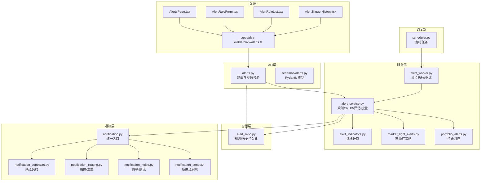
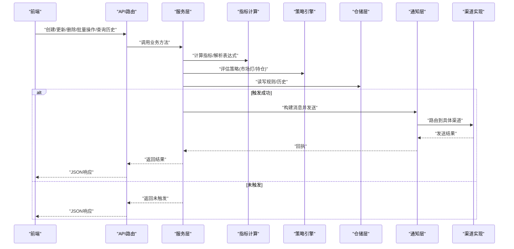
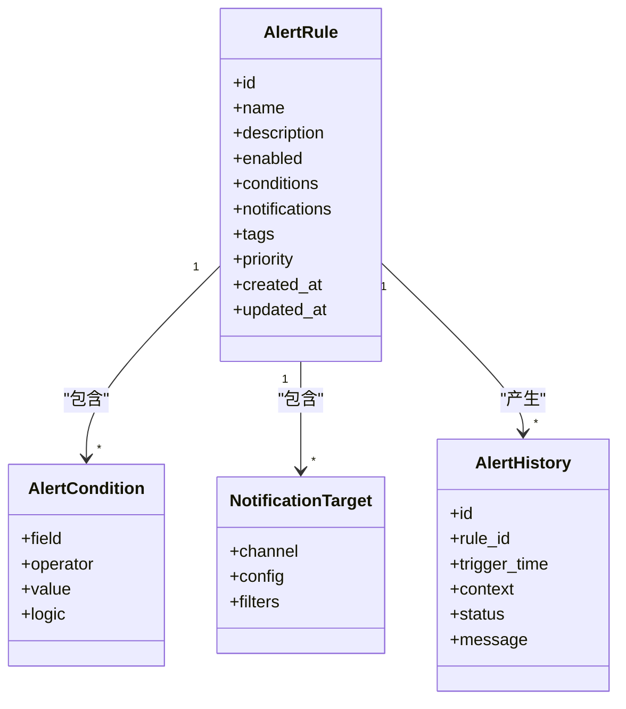
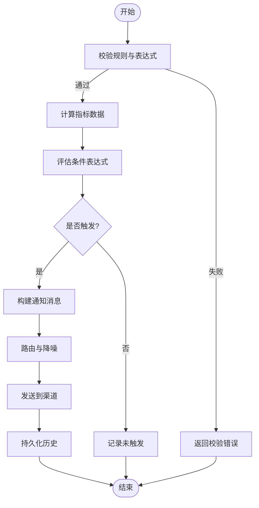
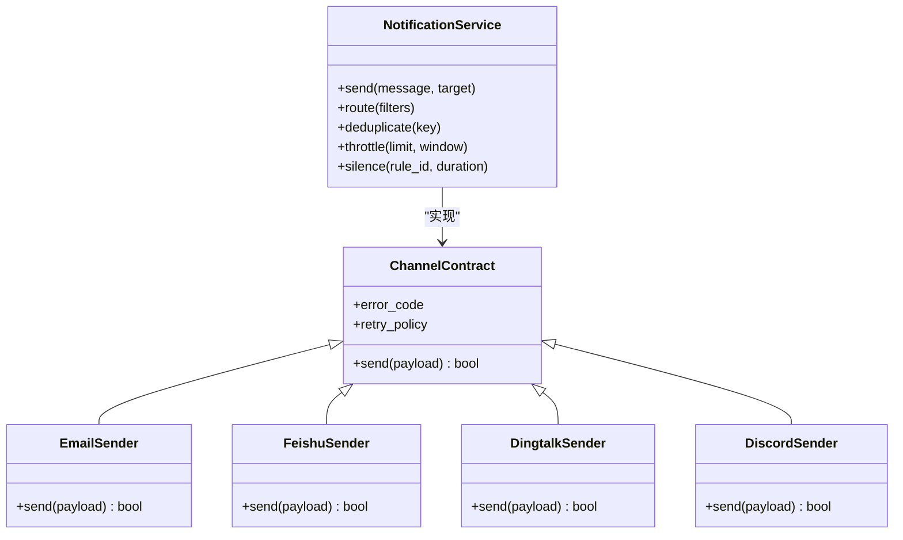
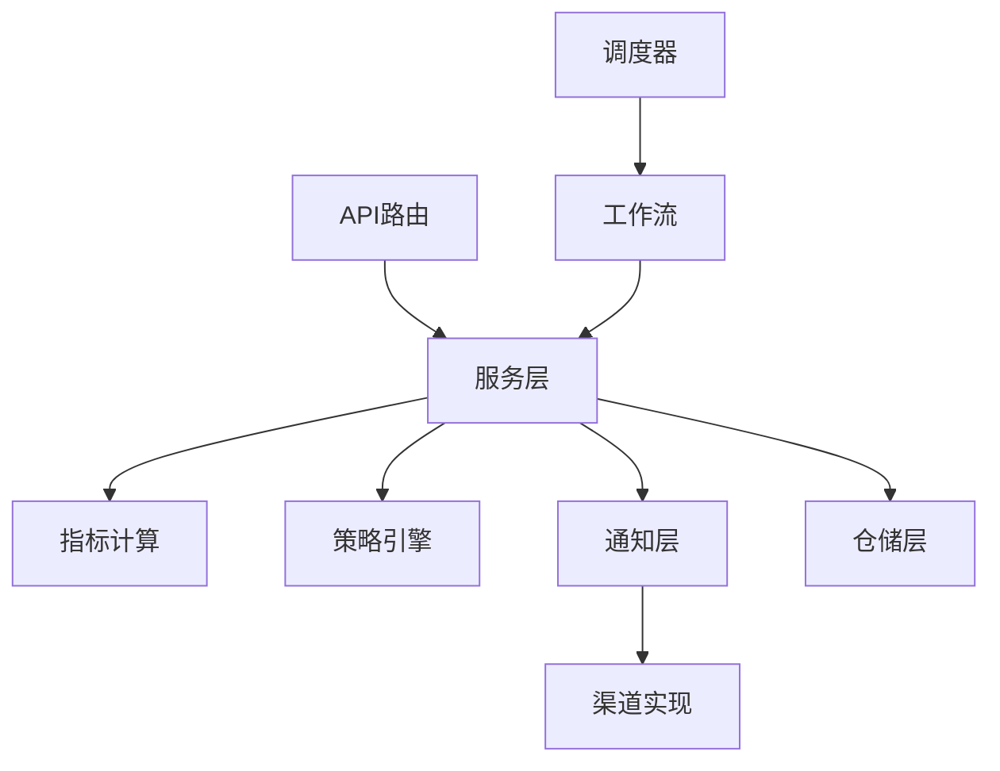

# 警报系统API

<cite>
**本文引用的文件**   
- [api/v1/endpoints/alerts.py](file://api/v1/endpoints/alerts.py)
- [api/v1/schemas/alerts.py](file://api/v1/schemas/alerts.py)
- [src/services/alert_service.py](file://src/services/alert_service.py)
- [src/repositories/alert_repo.py](file://src/repositories/alert_repo.py)
- [src/notification_sender/__init__.py](file://src/notification_sender/__init__.py)
- [src/notification.py](file://src/notification.py)
- [src/notification_contracts.py](file://src/notification_contracts.py)
- [src/notification_routing.py](file://src/notification_routing.py)
- [src/notification_noise.py](file://src/notification_noise.py)
- [src/services/alert_worker.py](file://src/services/alert_worker.py)
- [src/services/market_light_alerts.py](file://src/services/market_light_alerts.py)
- [src/services/portfolio_alerts.py](file://src/services/portfolio_alerts.py)
- [src/services/alert_indicators.py](file://src/services/alert_indicators.py)
- [src/scheduler.py](file://src/scheduler.py)
- [api/app.py](file://api/app.py)
- [api/v1/router.py](file://api/v1/router.py)
- [apps/dsa-web/src/api/alerts.ts](file://apps/dsa-web/src/api/alerts.ts)
- [apps/dsa-web/src/pages/AlertsPage.tsx](file://apps/dsa-web/src/pages/AlertsPage.tsx)
- [apps/dsa-web/src/components/alerts/AlertRuleForm.tsx](file://apps/dsa-web/src/components/alerts/AlertRuleForm.tsx)
- [apps/dsa-web/src/components/alerts/AlertRuleList.tsx](file://apps/dsa-web/src/components/alerts/AlertRuleList.tsx)
- [apps/dsa-web/src/components/alerts/AlertTriggerHistory.tsx](file://apps/dsa-web/src/components/alerts/AlertTriggerHistory.tsx)
- [apps/dsa-web/src/types/alerts.ts](file://apps/dsa-web/src/types/alerts.ts)
- [tests/test_alert_api.py](file://tests/test_alert_api.py)
- [tests/test_alert_worker.py](file://tests/test_alert_worker.py)
- [docs/alerts.md](file://docs/alerts.md)
</cite>

## 目录
1. [简介](#简介)
2. [项目结构](#项目结构)
3. [核心组件](#核心组件)
4. [架构总览](#架构总览)
5. [详细组件分析](#详细组件分析)
6. [依赖关系分析](#依赖关系分析)
7. [性能考虑](#性能考虑)
8. [故障排查指南](#故障排查指南)
9. [结论](#结论)
10. [附录](#附录)

## 简介
本文件为“警报系统API”的完整技术文档，覆盖以下能力：
- 警报规则创建、更新、删除与批量操作
- 条件表达式语法与支持的指标类型
- 触发通知流程与多渠道配置
- 状态管理与历史记录查询
- 前端集成示例与常见问题排查

该功能由后端FastAPI接口暴露，服务层负责规则校验与执行调度，仓储层持久化规则与触发记录，通知模块支持多种渠道（如邮件、飞书、钉钉、Discord等）。

## 项目结构
警报相关代码主要分布在以下位置：
- API层：路由定义与请求/响应模型
- 服务层：业务逻辑、指标计算、工作流编排
- 仓储层：规则与历史记录的持久化
- 通知层：多渠道发送与降噪策略
- 调度器：定时任务与事件驱动触发
- 前端：Web端规则管理、触发历史展示与测试面板

**图表来源** 
- [api/v1/endpoints/alerts.py](file://api/v1/endpoints/alerts.py)
- [api/v1/schemas/alerts.py](file://api/v1/schemas/alerts.py)
- [src/services/alert_service.py](file://src/services/alert_service.py)
- [src/repositories/alert_repo.py](file://src/repositories/alert_repo.py)
- [src/notification.py](file://src/notification.py)
- [src/notification_contracts.py](file://src/notification_contracts.py)
- [src/notification_routing.py](file://src/notification_routing.py)
- [src/notification_noise.py](file://src/notification_noise.py)
- [src/services/alert_worker.py](file://src/services/alert_worker.py)
- [src/services/market_light_alerts.py](file://src/services/market_light_alerts.py)
- [src/services/portfolio_alerts.py](file://src/services/portfolio_alerts.py)
- [src/services/alert_indicators.py](file://src/services/alert_indicators.py)
- [src/scheduler.py](file://src/scheduler.py)
- [apps/dsa-web/src/api/alerts.ts](file://apps/dsa-web/src/api/alerts.ts)
- [apps/dsa-web/src/pages/AlertsPage.tsx](file://apps/dsa-web/src/pages/AlertsPage.tsx)
- [apps/dsa-web/src/components/alerts/AlertRuleForm.tsx](file://apps/dsa-web/src/components/alerts/AlertRuleForm.tsx)
- [apps/dsa-web/src/components/alerts/AlertRuleList.tsx](file://apps/dsa-web/src/components/alerts/AlertRuleList.tsx)
- [apps/dsa-web/src/components/alerts/AlertTriggerHistory.tsx](file://apps/dsa-web/src/components/alerts/AlertTriggerHistory.tsx)

**章节来源**
- [api/v1/endpoints/alerts.py](file://api/v1/endpoints/alerts.py)
- [api/v1/schemas/alerts.py](file://api/v1/schemas/alerts.py)
- [src/services/alert_service.py](file://src/services/alert_service.py)
- [src/repositories/alert_repo.py](file://src/repositories/alert_repo.py)
- [src/notification.py](file://src/notification.py)
- [src/notification_contracts.py](file://src/notification_contracts.py)
- [src/notification_routing.py](file://src/notification_routing.py)
- [src/notification_noise.py](file://src/notification_noise.py)
- [src/services/alert_worker.py](file://src/services/alert_worker.py)
- [src/services/market_light_alerts.py](file://src/services/market_light_alerts.py)
- [src/services/portfolio_alerts.py](file://src/services/portfolio_alerts.py)
- [src/services/alert_indicators.py](file://src/services/alert_indicators.py)
- [src/scheduler.py](file://src/scheduler.py)
- [apps/dsa-web/src/api/alerts.ts](file://apps/dsa-web/src/api/alerts.ts)
- [apps/dsa-web/src/pages/AlertsPage.tsx](file://apps/dsa-web/src/pages/AlertsPage.tsx)
- [apps/dsa-web/src/components/alerts/AlertRuleForm.tsx](file://apps/dsa-web/src/components/alerts/AlertRuleForm.tsx)
- [apps/dsa-web/src/components/alerts/AlertRuleList.tsx](file://apps/dsa-web/src/components/alerts/AlertRuleList.tsx)
- [apps/dsa-web/src/components/alerts/AlertTriggerHistory.tsx](file://apps/dsa-web/src/components/alerts/AlertTriggerHistory.tsx)

## 核心组件
- API路由与模型
  - 路由：提供规则的CRUD、批量操作、触发历史查询、测试发送等接口
  - 模型：使用Pydantic定义输入输出结构，确保字段校验与默认值
- 服务层
  - 规则管理：创建、更新、启用/禁用、批量导入/导出
  - 指标计算：基于时间序列或快照数据计算技术指标与自定义表达式
  - 策略引擎：内置市场灯、持仓风险等策略，可扩展自定义策略
  - 工作流：异步执行、重试、失败回滚与告警
- 仓储层
  - 规则存储：保存规则元数据、条件表达式、通知目标
  - 历史存储：记录每次触发的上下文、结果与通知状态
- 通知层
  - 统一入口：封装消息构建、渲染、路由与发送
  - 渠道契约：定义各渠道的发送接口与错误码
  - 路由与降噪：按标签/级别路由，支持去重、限流、静默期
  - 多实现：邮件、飞书、钉钉、Discord、Slack、Telegram、Gotify、Ntfy、Pushover、Server酱3、AstrBot等
- 调度器
  - 定时任务：周期性扫描规则、拉取数据、评估触发
  - 事件驱动：外部事件触发评估（如行情推送）

**章节来源**
- [api/v1/endpoints/alerts.py](file://api/v1/endpoints/alerts.py)
- [api/v1/schemas/alerts.py](file://api/v1/schemas/alerts.py)
- [src/services/alert_service.py](file://src/services/alert_service.py)
- [src/repositories/alert_repo.py](file://src/repositories/alert_repo.py)
- [src/notification.py](file://src/notification.py)
- [src/notification_contracts.py](file://src/notification_contracts.py)
- [src/notification_routing.py](file://src/notification_routing.py)
- [src/notification_noise.py](file://src/notification_noise.py)
- [src/services/alert_worker.py](file://src/services/alert_worker.py)
- [src/services/market_light_alerts.py](file://src/services/market_light_alerts.py)
- [src/services/portfolio_alerts.py](file://src/services/portfolio_alerts.py)
- [src/services/alert_indicators.py](file://src/services/alert_indicators.py)
- [src/scheduler.py](file://src/scheduler.py)

## 架构总览
警报系统采用分层架构：API层接收请求并返回结构化响应；服务层编排指标计算、策略评估与工作流；仓储层负责持久化；通知层抽象多渠道发送；调度器驱动周期性评估。

**图表来源** 
- [api/v1/endpoints/alerts.py](file://api/v1/endpoints/alerts.py)
- [src/services/alert_service.py](file://src/services/alert_service.py)
- [src/services/alert_indicators.py](file://src/services/alert_indicators.py)
- [src/services/market_light_alerts.py](file://src/services/market_light_alerts.py)
- [src/services/portfolio_alerts.py](file://src/services/portfolio_alerts.py)
- [src/repositories/alert_repo.py](file://src/repositories/alert_repo.py)
- [src/notification.py](file://src/notification.py)
- [src/notification_contracts.py](file://src/notification_contracts.py)
- [src/notification_routing.py](file://src/notification_routing.py)
- [src/notification_noise.py](file://src/notification_noise.py)

## 详细组件分析

### API路由与模型
- 路由职责
  - 规则CRUD：创建、更新、删除、获取详情
  - 批量操作：批量创建、批量启用/禁用、批量导入/导出
  - 触发测试：对指定规则进行即时评估与发送
  - 历史查询：分页、过滤、排序
- 模型设计
  - 使用Pydantic定义请求体与响应体，包含字段校验、默认值、枚举约束
  - 支持条件表达式对象、通知目标列表、标签与优先级

**图表来源** 
- [api/v1/schemas/alerts.py](file://api/v1/schemas/alerts.py)
- [src/repositories/alert_repo.py](file://src/repositories/alert_repo.py)

**章节来源**
- [api/v1/endpoints/alerts.py](file://api/v1/endpoints/alerts.py)
- [api/v1/schemas/alerts.py](file://api/v1/schemas/alerts.py)

### 服务层：规则管理与评估
- 规则管理
  - 创建/更新：校验条件表达式与通知配置，写入仓储
  - 批量操作：事务性处理，失败回滚与部分成功报告
  - 状态管理：启用/禁用、优先级调整、标签分组
- 评估流程
  - 指标计算：根据规则字段选择数据源与时间窗口，计算技术指标
  - 表达式解析：支持比较、逻辑组合、函数调用
  - 策略引擎：内置市场灯与持仓风险策略，可扩展自定义策略
- 工作流
  - 异步执行：避免阻塞API线程
  - 重试与超时：网络异常与第三方服务不可用时的重试策略
  - 结果持久化：记录触发上下文、状态与消息摘要

**图表来源** 
- [src/services/alert_service.py](file://src/services/alert_service.py)
- [src/services/alert_indicators.py](file://src/services/alert_indicators.py)
- [src/services/market_light_alerts.py](file://src/services/market_light_alerts.py)
- [src/services/portfolio_alerts.py](file://src/services/portfolio_alerts.py)
- [src/repositories/alert_repo.py](file://src/repositories/alert_repo.py)

**章节来源**
- [src/services/alert_service.py](file://src/services/alert_service.py)
- [src/services/alert_indicators.py](file://src/services/alert_indicators.py)
- [src/services/market_light_alerts.py](file://src/services/market_light_alerts.py)
- [src/services/portfolio_alerts.py](file://src/services/portfolio_alerts.py)
- [src/repositories/alert_repo.py](file://src/repositories/alert_repo.py)

### 仓储层：持久化与查询
- 规则存储
  - 字段：名称、描述、条件、通知目标、标签、优先级、状态、时间戳
  - 索引：按标签、优先级、更新时间建立索引以优化查询
- 历史存储
  - 字段：规则ID、触发时间、上下文快照、状态、消息摘要
  - 查询：分页、过滤（规则ID、时间范围、状态）、排序
- 事务与一致性
  - 批量操作使用事务保证一致性
  - 失败时回滚并返回详细错误信息

**章节来源**
- [src/repositories/alert_repo.py](file://src/repositories/alert_repo.py)

### 通知层：多渠道与降噪
- 统一入口
  - 构建消息模板、渲染内容、附加上下文
  - 路由到具体渠道，支持按标签/级别筛选
- 渠道契约
  - 定义发送接口、错误码、重试策略
  - 支持配置项注入（如URL、Token、主题）
- 路由与降噪
  - 去重：相同内容与时间窗口的重复抑制
  - 限流：单位时间内最大发送次数
  - 静默期：规则级别的冷却时间
- 渠道实现
  - 邮件、飞书、钉钉、Discord、Slack、Telegram、Gotify、Ntfy、Pushover、Server酱3、AstrBot等

**图表来源** 
- [src/notification.py](file://src/notification.py)
- [src/notification_contracts.py](file://src/notification_contracts.py)
- [src/notification_routing.py](file://src/notification_routing.py)
- [src/notification_noise.py](file://src/notification_noise.py)
- [src/notification_sender/__init__.py](file://src/notification_sender/__init__.py)

**章节来源**
- [src/notification.py](file://src/notification.py)
- [src/notification_contracts.py](file://src/notification_contracts.py)
- [src/notification_routing.py](file://src/notification_routing.py)
- [src/notification_noise.py](file://src/notification_noise.py)
- [src/notification_sender/__init__.py](file://src/notification_sender/__init__.py)

### 调度器与工作流
- 定时任务
  - 周期扫描启用的规则
  - 拉取数据源（行情、基本面、新闻）
  - 评估触发并发送通知
- 事件驱动
  - 外部事件（如实时行情推送）触发评估
- 工作流编排
  - 异步执行、重试、超时控制
  - 失败回调与告警

**章节来源**
- [src/scheduler.py](file://src/scheduler.py)
- [src/services/alert_worker.py](file://src/services/alert_worker.py)

### 前端集成
- API客户端
  - 封装HTTP请求、错误处理、重试
- 页面与组件
  - 规则表单：创建/编辑规则、预览表达式
  - 规则列表：分页、搜索、批量操作
  - 触发历史：查看上下文、状态、消息
- 类型定义
  - TypeScript类型与后端模型对齐

**章节来源**
- [apps/dsa-web/src/api/alerts.ts](file://apps/dsa-web/src/api/alerts.ts)
- [apps/dsa-web/src/pages/AlertsPage.tsx](file://apps/dsa-web/src/pages/AlertsPage.tsx)
- [apps/dsa-web/src/components/alerts/AlertRuleForm.tsx](file://apps/dsa-web/src/components/alerts/AlertRuleForm.tsx)
- [apps/dsa-web/src/components/alerts/AlertRuleList.tsx](file://apps/dsa-web/src/components/alerts/AlertRuleList.tsx)
- [apps/dsa-web/src/components/alerts/AlertTriggerHistory.tsx](file://apps/dsa-web/src/components/alerts/AlertTriggerHistory.tsx)
- [apps/dsa-web/src/types/alerts.ts](file://apps/dsa-web/src/types/alerts.ts)

## 依赖关系分析
- 组件耦合
  - API层依赖服务层与仓储层，低耦合高内聚
  - 服务层依赖指标计算、策略引擎与通知层
  - 通知层通过契约解耦具体渠道实现
- 外部依赖
  - 数据源：行情、基本面、新闻等
  - 渠道：邮件、IM、Webhook等
- 循环依赖
  - 通过接口与事件机制避免循环引用

**图表来源** 
- [api/v1/endpoints/alerts.py](file://api/v1/endpoints/alerts.py)
- [src/services/alert_service.py](file://src/services/alert_service.py)
- [src/services/alert_indicators.py](file://src/services/alert_indicators.py)
- [src/services/market_light_alerts.py](file://src/services/market_light_alerts.py)
- [src/services/portfolio_alerts.py](file://src/services/portfolio_alerts.py)
- [src/repositories/alert_repo.py](file://src/repositories/alert_repo.py)
- [src/notification.py](file://src/notification.py)
- [src/scheduler.py](file://src/scheduler.py)
- [src/services/alert_worker.py](file://src/services/alert_worker.py)

**章节来源**
- [api/v1/endpoints/alerts.py](file://api/v1/endpoints/alerts.py)
- [src/services/alert_service.py](file://src/services/alert_service.py)
- [src/repositories/alert_repo.py](file://src/repositories/alert_repo.py)
- [src/notification.py](file://src/notification.py)
- [src/scheduler.py](file://src/scheduler.py)
- [src/services/alert_worker.py](file://src/services/alert_worker.py)

## 性能考虑
- 指标计算
  - 缓存最近时间窗口数据，减少重复计算
  - 并行计算多个指标的独立分支
- 表达式评估
  - 预编译表达式树，避免运行时解析开销
  - 短路逻辑优化，尽早返回未触发
- 通知发送
  - 批量合并消息，降低通道负载
  - 异步发送与重试队列，避免阻塞主流程
- 查询优化
  - 分页与索引，避免全表扫描
  - 按需加载上下文快照，减少IO

[本节为通用指导，不直接分析具体文件]

## 故障排查指南
- 常见错误
  - 表达式语法错误：检查字段名、运算符、函数签名
  - 数据源不可用：确认数据源配置与网络连通性
  - 渠道发送失败：检查渠道配置、Token、限流策略
- 诊断步骤
  - 查看触发历史中的上下文快照与状态
  - 启用调试日志，定位指标计算与表达式评估过程
  - 使用测试接口对规则进行即时评估与发送
- 恢复建议
  - 修正表达式后重新评估
  - 切换备用数据源或渠道
  - 调整限流与静默期参数

**章节来源**
- [tests/test_alert_api.py](file://tests/test_alert_api.py)
- [tests/test_alert_worker.py](file://tests/test_alert_worker.py)
- [docs/alerts.md](file://docs/alerts.md)

## 结论
警报系统API提供了完整的规则管理、条件评估与多渠道通知能力，具备高扩展性与良好的可维护性。通过分层架构与契约解耦，系统能够灵活接入新的数据源与通知渠道，同时通过降噪与限流保障稳定性。建议在生产环境中合理配置缓存、重试与监控，以提升整体可靠性与性能。

[本节为总结，不直接分析具体文件]

## 附录
- 条件表达式语法
  - 字段：支持股票基础字段、技术指标、新闻情感等
  - 运算符：比较（等于、不等于、大于、小于、区间）、逻辑（与、或、非）
  - 函数：时间窗口聚合、移动平均、波动率等
- 通知渠道配置
  - 邮件：SMTP服务器、发件人、收件人列表
  - IM：飞书、钉钉、Discord、Slack、Telegram等Webhook或API密钥
  - Webhook：自定义URL与请求头
- 批量操作示例
  - 批量创建：上传CSV/JSON，映射字段，校验后批量入库
  - 批量启用/禁用：按标签或ID集合操作
- 状态管理
  - 启用/禁用：控制规则是否参与评估
  - 优先级：影响评估顺序与资源分配
- 历史记录查询
  - 分页：页码与每页大小
  - 过滤：规则ID、时间范围、状态
  - 排序：触发时间、状态

[本节为概念性说明，不直接分析具体文件]