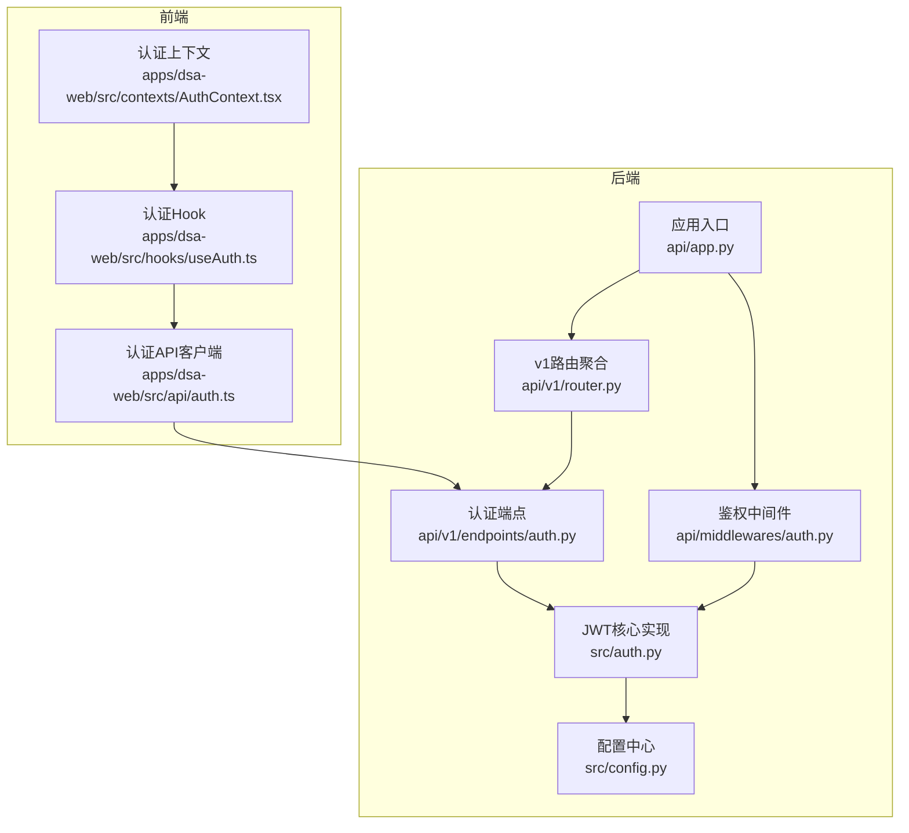
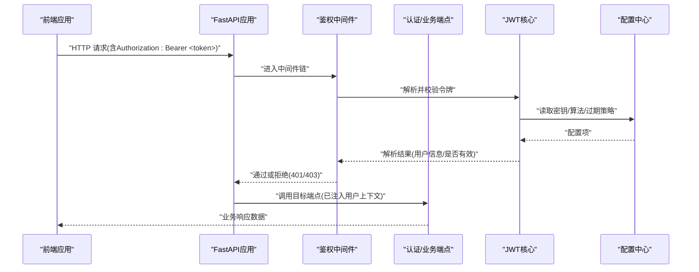
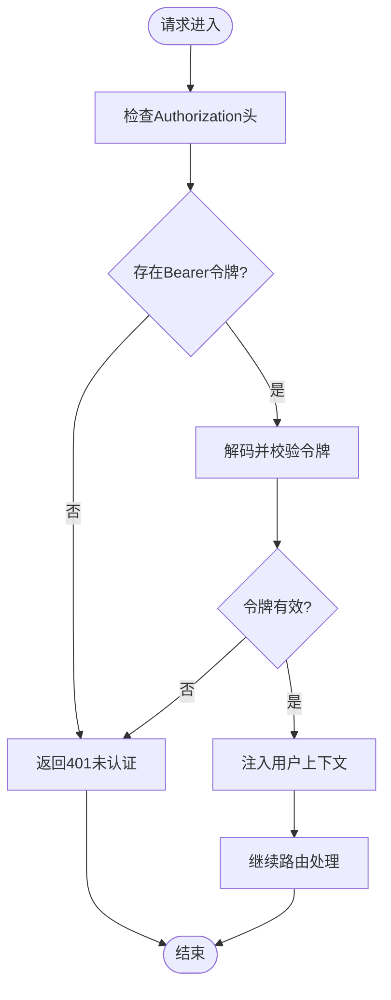
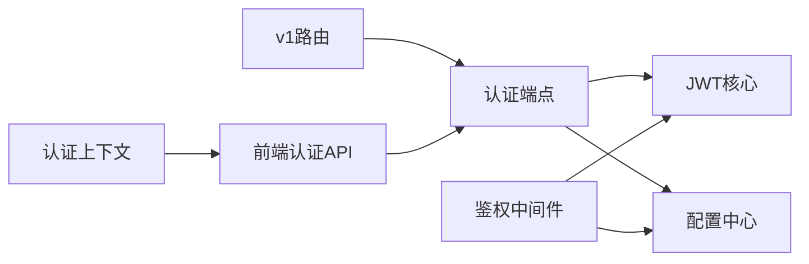

# 认证与授权

<cite>
**本文引用的文件**   
- [api/app.py](file://api/app.py)
- [api/v1/router.py](file://api/v1/router.py)
- [api/v1/endpoints/auth.py](file://api/v1/endpoints/auth.py)
- [api/middlewares/auth.py](file://api/middlewares/auth.py)
- [src/auth.py](file://src/auth.py)
- [src/config.py](file://src/config.py)
- [apps/dsa-web/src/api/auth.ts](file://apps/dsa-web/src/api/auth.ts)
- [apps/dsa-web/src/hooks/useAuth.ts](file://apps/dsa-web/src/hooks/useAuth.ts)
- [apps/dsa-web/src/contexts/AuthContext.tsx](file://apps/dsa-web/src/contexts/AuthContext.tsx)
- [tests/test_auth_api.py](file://tests/test_auth_api.py)
</cite>

## 目录
1. [简介](#简介)
2. [项目结构](#项目结构)
3. [核心组件](#核心组件)
4. [架构总览](#架构总览)
5. [详细组件分析](#详细组件分析)
6. [依赖分析](#依赖分析)
7. [性能考虑](#性能考虑)
8. [故障排查指南](#故障排查指南)
9. [结论](#结论)
10. [附录](#附录)

## 简介
本文件面向API认证与授权机制，围绕JWT令牌认证流程、用户登录注册接口、权限验证中间件的工作原理进行系统化说明。文档涵盖认证请求格式、响应结构、错误处理机制，并补充令牌刷新、会话管理、安全最佳实践，以及完整的调用示例与常见问题解决方案，帮助开发者快速集成与排障。

## 项目结构
后端采用FastAPI分层组织：路由定义在v1层，认证相关端点位于auth模块；鉴权逻辑通过中间件统一拦截；JWT核心能力由独立模块提供；前端通过API客户端与上下文Hook完成登录态管理与请求头注入。

图表来源
- [api/app.py](file://api/app.py)
- [api/v1/router.py](file://api/v1/router.py)
- [api/v1/endpoints/auth.py](file://api/v1/endpoints/auth.py)
- [api/middlewares/auth.py](file://api/middlewares/auth.py)
- [src/auth.py](file://src/auth.py)
- [src/config.py](file://src/config.py)
- [apps/dsa-web/src/api/auth.ts](file://apps/dsa-web/src/api/auth.ts)
- [apps/dsa-web/src/hooks/useAuth.ts](file://apps/dsa-web/src/hooks/useAuth.ts)
- [apps/dsa-web/src/contexts/AuthContext.tsx](file://apps/dsa-web/src/contexts/AuthContext.tsx)

章节来源
- [api/app.py](file://api/app.py)
- [api/v1/router.py](file://api/v1/router.py)
- [api/v1/endpoints/auth.py](file://api/v1/endpoints/auth.py)
- [api/middlewares/auth.py](file://api/middlewares/auth.py)
- [src/auth.py](file://src/auth.py)
- [src/config.py](file://src/config.py)
- [apps/dsa-web/src/api/auth.ts](file://apps/dsa-web/src/api/auth.ts)
- [apps/dsa-web/src/hooks/useAuth.ts](file://apps/dsa-web/src/hooks/useAuth.ts)
- [apps/dsa-web/src/contexts/AuthContext.tsx](file://apps/dsa-web/src/contexts/AuthContext.tsx)

## 核心组件
- 认证端点（登录/注册/状态）：负责接收凭证、签发JWT、返回用户基本信息与令牌有效期等。
- 鉴权中间件：统一拦截受保护请求，校验Authorization头中的Bearer令牌，解析并注入当前用户信息到请求上下文。
- JWT核心模块：封装令牌生成、解码、签名、过期校验、密钥管理等能力。
- 配置中心：集中管理JWT密钥、算法、过期时间、白名单路径等关键参数。
- 前端认证客户端与上下文：封装登录、刷新、登出、自动注入Authorization头、全局登录态管理。

章节来源
- [api/v1/endpoints/auth.py](file://api/v1/endpoints/auth.py)
- [api/middlewares/auth.py](file://api/middlewares/auth.py)
- [src/auth.py](file://src/auth.py)
- [src/config.py](file://src/config.py)
- [apps/dsa-web/src/api/auth.ts](file://apps/dsa-web/src/api/auth.ts)
- [apps/dsa-web/src/hooks/useAuth.ts](file://apps/dsa-web/src/hooks/useAuth.ts)
- [apps/dsa-web/src/contexts/AuthContext.tsx](file://apps/dsa-web/src/contexts/AuthContext.tsx)

## 架构总览
下图展示一次受保护API调用的端到端流程：前端携带JWT发起请求，中间件校验令牌并注入用户信息，业务端点执行业务逻辑并返回结果。

图表来源
- [api/app.py](file://api/app.py)
- [api/middlewares/auth.py](file://api/middlewares/auth.py)
- [src/auth.py](file://src/auth.py)
- [src/config.py](file://src/config.py)

## 详细组件分析

### 认证端点（登录/注册/状态）
- 登录接口：接收用户名与密码，校验成功后签发JWT，返回访问令牌、刷新令牌（如支持）、过期时间与用户基础信息。
- 注册接口：接收注册信息，创建用户并返回成功标识或必要字段。
- 状态接口：用于前端判断当前登录态，通常返回当前用户信息与令牌有效性。

请求与响应要点
- 登录请求体包含用户名与密码字段；响应包含访问令牌、可选刷新令牌、过期时间戳与用户信息。
- 注册请求体包含用户名、邮箱、密码等；响应为操作结果与用户ID等。
- 状态接口无需认证头，返回当前会话状态。

错误处理
- 凭证错误返回明确的状态码与错误消息，避免泄露敏感细节。
- 重复注册、非法输入等场景返回标准化错误结构。

章节来源
- [api/v1/endpoints/auth.py](file://api/v1/endpoints/auth.py)
- [tests/test_auth_api.py](file://tests/test_auth_api.py)

### 鉴权中间件（权限验证）
- 拦截所有受保护路由，从Authorization头提取Bearer令牌。
- 使用JWT核心模块解码并校验签名、过期时间、黑名单（如有）。
- 将解析出的用户信息注入请求上下文，供后续端点使用。
- 对未认证或无效令牌返回统一错误响应。

流程图（中间件校验）

图表来源
- [api/middlewares/auth.py](file://api/middlewares/auth.py)
- [src/auth.py](file://src/auth.py)

章节来源
- [api/middlewares/auth.py](file://api/middlewares/auth.py)
- [src/auth.py](file://src/auth.py)

### JWT核心模块
- 令牌生成：基于用户标识与角色等信息生成访问令牌，设置过期时间。
- 令牌解码：验证签名、解析载荷，提取用户信息。
- 安全策略：支持算法选择、密钥轮换、黑名单校验、最小权限原则。
- 配置驱动：从配置中心读取密钥、算法、过期时间、白名单路径等。

章节来源
- [src/auth.py](file://src/auth.py)
- [src/config.py](file://src/config.py)

### 前端认证客户端与上下文
- 认证API客户端：封装登录、注册、获取状态、刷新令牌等HTTP调用，统一处理错误与重试。
- 认证Hook：提供登录、登出、刷新、状态查询等方法，便于组件复用。
- 认证上下文：集中管理全局登录态、令牌存储、自动注入Authorization头。

章节来源
- [apps/dsa-web/src/api/auth.ts](file://apps/dsa-web/src/api/auth.ts)
- [apps/dsa-web/src/hooks/useAuth.ts](file://apps/dsa-web/src/hooks/useAuth.ts)
- [apps/dsa-web/src/contexts/AuthContext.tsx](file://apps/dsa-web/src/contexts/AuthContext.tsx)

## 依赖分析
- 路由层依赖认证端点，认证端点依赖JWT核心与配置中心。
- 中间件依赖JWT核心与配置中心，确保统一的鉴权策略。
- 前端依赖认证API客户端与上下文，保证一致的认证体验。

图表来源
- [api/v1/router.py](file://api/v1/router.py)
- [api/v1/endpoints/auth.py](file://api/v1/endpoints/auth.py)
- [api/middlewares/auth.py](file://api/middlewares/auth.py)
- [src/auth.py](file://src/auth.py)
- [src/config.py](file://src/config.py)
- [apps/dsa-web/src/api/auth.ts](file://apps/dsa-web/src/api/auth.ts)
- [apps/dsa-web/src/contexts/AuthContext.tsx](file://apps/dsa-web/src/contexts/AuthContext.tsx)

章节来源
- [api/v1/router.py](file://api/v1/router.py)
- [api/v1/endpoints/auth.py](file://api/v1/endpoints/auth.py)
- [api/middlewares/auth.py](file://api/middlewares/auth.py)
- [src/auth.py](file://src/auth.py)
- [src/config.py](file://src/config.py)
- [apps/dsa-web/src/api/auth.ts](file://apps/dsa-web/src/api/auth.ts)
- [apps/dsa-web/src/contexts/AuthContext.tsx](file://apps/dsa-web/src/contexts/AuthContext.tsx)

## 性能考虑
- 令牌校验应在中间件中尽早失败，减少不必要的业务处理。
- 合理设置JWT过期时间，平衡安全性与用户体验；必要时引入刷新令牌机制。
- 避免在令牌中存储敏感或大对象数据，保持载荷精简。
- 前端缓存登录态与令牌，减少重复登录与网络开销。
- 对高频认证接口进行限流与防重放设计。

[本节为通用指导，不直接分析具体文件]

## 故障排查指南
常见错误与定位方法
- 401未认证：检查Authorization头是否存在且格式正确；确认令牌未过期；核对中间件是否生效。
- 403禁止访问：检查用户权限与资源访问控制；确认角色与范围是否匹配。
- 令牌无效或签名错误：核对JWT密钥与算法配置；检查服务端与客户端时间同步。
- 登录失败：检查用户名/密码是否正确；查看后端日志与数据库记录；确认注册流程是否完整。
- 刷新令牌失败：确认刷新令牌是否有效；检查刷新接口是否被调用；关注令牌黑名单与吊销策略。

建议的调试步骤
- 启用详细日志，记录令牌解析过程与错误原因。
- 使用测试用例覆盖登录、注册、状态查询、鉴权失败等场景。
- 在前端控制台打印请求头与响应体，确认令牌传递与存储。

章节来源
- [tests/test_auth_api.py](file://tests/test_auth_api.py)
- [api/middlewares/auth.py](file://api/middlewares/auth.py)
- [src/auth.py](file://src/auth.py)

## 结论
本项目的认证与授权机制以JWT为核心，结合中间件统一鉴权与前端上下文管理，形成前后端一致的认证体验。通过合理的配置与安全策略，能够有效保障API访问安全与用户体验。建议在部署时严格管理密钥、启用HTTPS、实施令牌刷新与吊销策略，并持续完善监控与审计。

[本节为总结性内容，不直接分析具体文件]

## 附录

### 认证API调用示例（概念性）
- 登录
  - 方法：POST
  - 路径：/api/v1/auth/login
  - 请求体：{用户名, 密码}
  - 响应：{访问令牌, 刷新令牌(可选), 过期时间, 用户信息}
- 注册
  - 方法：POST
  - 路径：/api/v1/auth/register
  - 请求体：{用户名, 邮箱, 密码, ...}
  - 响应：{操作结果, 用户ID}
- 状态
  - 方法：GET
  - 路径：/api/v1/auth/me
  - 响应：{当前用户信息, 令牌有效性}
- 刷新令牌（如支持）
  - 方法：POST
  - 路径：/api/v1/auth/refresh
  - 请求体：{刷新令牌}
  - 响应：{新访问令牌, 新过期时间}

[本节为概念性示例，不直接映射具体代码文件]

### 安全最佳实践
- 使用强随机密钥与安全的签名算法。
- 限制令牌生命周期，启用刷新令牌与吊销机制。
- 仅传输HTTPS，防止中间人攻击。
- 最小权限原则，按角色与范围控制访问。
- 记录认证事件，便于审计与异常检测。
- 前端安全存储令牌，避免XSS与CSRF风险。

[本节为通用指导，不直接分析具体文件]