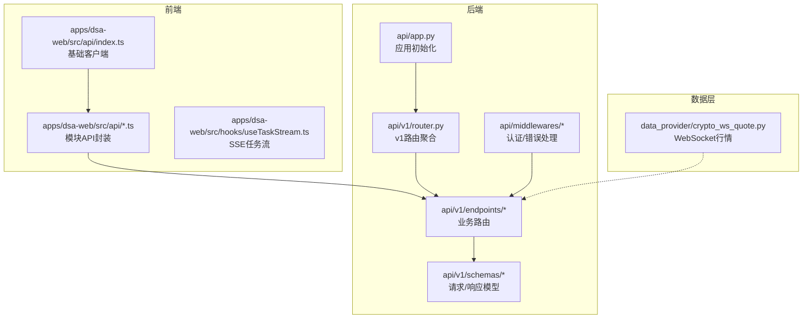
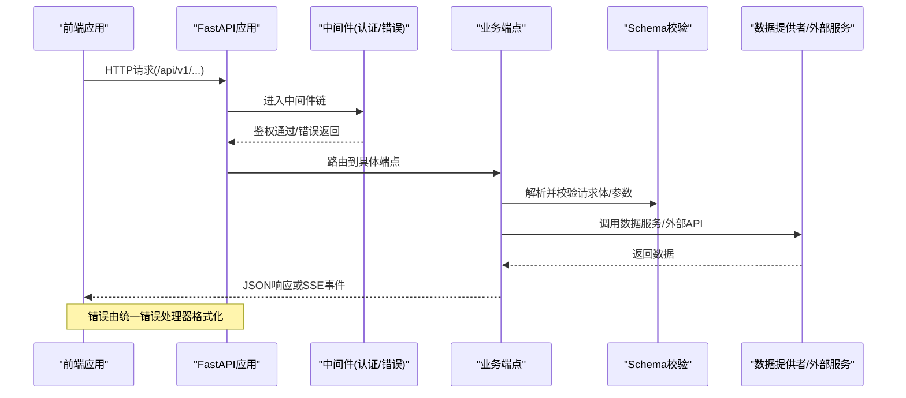
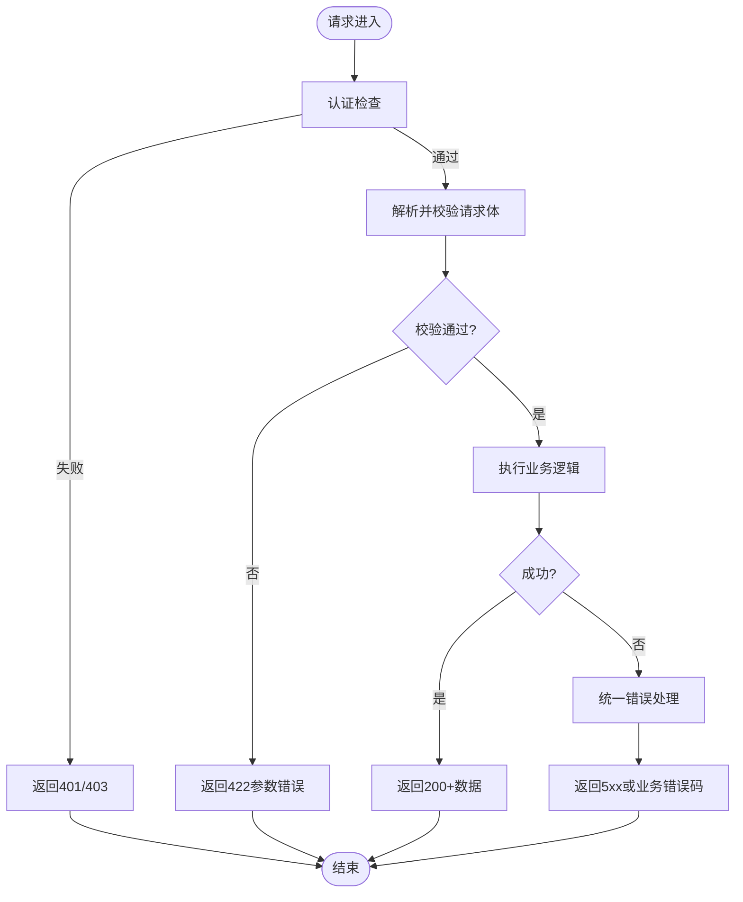
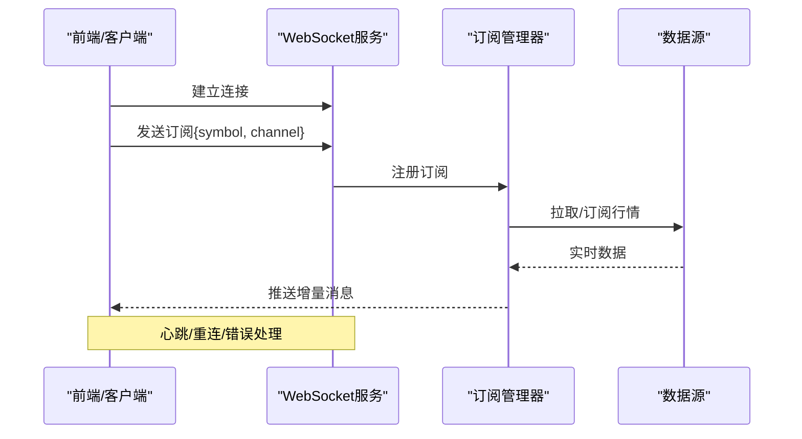
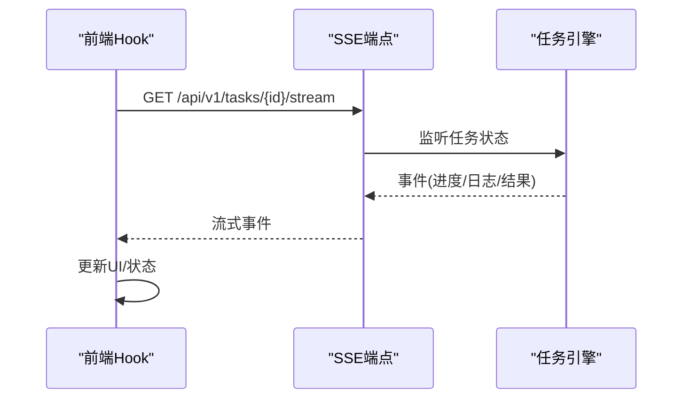
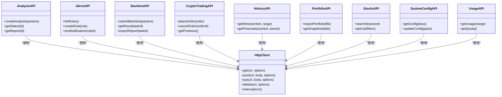
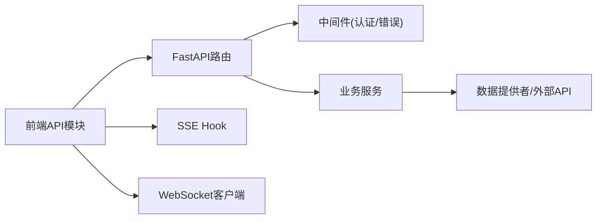

# API集成

<cite>
**本文档引用的文件**   
- [api/app.py](file://api/app.py)
- [api/v1/router.py](file://api/v1/router.py)
- [api/middlewares/error_handler.py](file://api/middlewares/error_handler.py)
- [api/middlewares/auth.py](file://api/middlewares/auth.py)
- [api/v1/endpoints/analysis.py](file://api/v1/endpoints/analysis.py)
- [api/v1/endpoints/alerts.py](file://api/v1/endpoints/alerts.py)
- [api/v1/endpoints/backtest.py](file://api/v1/endpoints/backtest.py)
- [api/v1/endpoints/crypto_trading.py](file://api/v1/endpoints/crypto_trading.py)
- [api/v1/endpoints/history.py](file://api/v1/endpoints/history.py)
- [api/v1/endpoints/portfolio.py](file://api/v1/endpoints/portfolio.py)
- [api/v1/endpoints/stocks.py](file://api/v1/endpoints/stocks.py)
- [api/v1/endpoints/system_config.py](file://api/v1/endpoints/system_config.py)
- [api/v1/endpoints/usage.py](file://api/v1/endpoints/usage.py)
- [api/v1/schemas/common.py](file://api/v1/schemas/common.py)
- [api/v1/schemas/analysis.py](file://api/v1/schemas/analysis.py)
- [api/v1/schemas/alerts.py](file://api/v1/schemas/alerts.py)
- [api/v1/schemas/backtest.py](file://api/v1/schemas/backtest.py)
- [api/v1/schemas/crypto_trading.py](file://api/v1/schemas/crypto_trading.py)
- [api/v1/schemas/history.py](file://api/v1/schemas/history.py)
- [api/v1/schemas/portfolio.py](file://api/v1/schemas/portfolio.py)
- [api/v1/schemas/stocks.py](file://api/v1/schemas/stocks.py)
- [api/v1/schemas/system_config.py](file://api/v1/schemas/system_config.py)
- [api/v1/schemas/usage.py](file://api/v1/schemas/usage.py)
- [apps/dsa-web/src/api/index.ts](file://apps/dsa-web/src/api/index.ts)
- [apps/dsa-web/src/api/utils.ts](file://apps/dsa-web/src/api/utils.ts)
- [apps/dsa-web/src/api/error.ts](file://apps/dsa-web/src/api/error.ts)
- [apps/dsa-web/src/api/analysis.ts](file://apps/dsa-web/src/api/analysis.ts)
- [apps/dsa-web/src/api/alerts.ts](file://apps/dsa-web/src/api/alerts.ts)
- [apps/dsa-web/src/api/backtest.ts](file://apps/dsa-web/src/api/backtest.ts)
- [apps/dsa-web/src/api/cryptoTrading.ts](file://apps/dsa-web/src/api/cryptoTrading.ts)
- [apps/dsa-web/src/api/history.ts](file://apps/dsa-web/src/api/history.ts)
- [apps/dsa-web/src/api/portfolio.ts](file://apps/dsa-web/src/api/portfolio.ts)
- [apps/dsa-web/src/api/stocks.ts](file://apps/dsa-web/src/api/stocks.ts)
- [apps/dsa-web/src/api/systemConfig.ts](file://apps/dsa-web/src/api/systemConfig.ts)
- [apps/dsa-web/src/api/usage.ts](file://apps/dsa-web/src/api/usage.ts)
- [apps/dsa-web/src/hooks/useTaskStream.ts](file://apps/dsa-web/src/hooks/useTaskStream.ts)
- [data_provider/crypto_ws_quote.py](file://data_provider/crypto_ws_quote.py)
- [server.py](file://server.py)
- [main.py](file://main.py)
</cite>

## 目录
1. [简介](#简介)
2. [项目结构](#项目结构)
3. [核心组件](#核心组件)
4. [架构总览](#架构总览)
5. [详细组件分析](#详细组件分析)
6. [依赖关系分析](#依赖关系分析)
7. [性能考虑](#性能考虑)
8. [故障排查指南](#故障排查指南)
9. [结论](#结论)
10. [附录](#附录)

## 简介
本文件面向前后端开发者，系统化说明股票分析系统的API集成设计与实现。内容覆盖RESTful API封装、错误处理与请求拦截器、各功能模块的接口定义与参数校验、WebSocket实时通信、SSE服务器推送、文件上传下载、API版本管理、缓存策略与性能优化，以及调试工具、Mock数据生成与接口测试方法。目标是帮助读者快速理解并高效对接系统能力。

## 项目结构
后端采用模块化路由组织，按v1版本划分；前端以src/api为统一入口，按业务域拆分模块，配合hooks进行状态与流式交互。关键目录：
- api: FastAPI应用、中间件、v1路由与Pydantic模型
- apps/dsa-web/src/api: 前端HTTP客户端封装与各模块API调用
- data_provider: 数据源与WebSocket行情
- server.py/main.py: 服务启动与挂载点

图表来源
- [api/app.py](file://api/app.py)
- [api/v1/router.py](file://api/v1/router.py)
- [api/middlewares/error_handler.py](file://api/middlewares/error_handler.py)
- [api/middlewares/auth.py](file://api/middlewares/auth.py)
- [api/v1/endpoints/analysis.py](file://api/v1/endpoints/analysis.py)
- [api/v1/schemas/common.py](file://api/v1/schemas/common.py)
- [apps/dsa-web/src/api/index.ts](file://apps/dsa-web/src/api/index.ts)
- [apps/dsa-web/src/api/utils.ts](file://apps/dsa-web/src/api/utils.ts)
- [data_provider/crypto_ws_quote.py](file://data_provider/crypto_ws_quote.py)

章节来源
- [api/app.py](file://api/app.py)
- [api/v1/router.py](file://api/v1/router.py)
- [apps/dsa-web/src/api/index.ts](file://apps/dsa-web/src/api/index.ts)

## 核心组件
- 后端应用与路由
  - 应用初始化与全局配置（CORS、异常、中间件）
  - v1路由聚合与版本隔离
  - 中间件：认证鉴权、统一错误处理
  - Pydantic Schema：统一的请求/响应结构与校验
- 前端API封装
  - 统一HTTP客户端（请求头、超时、重试、错误转换）
  - 模块级API函数（分析、告警、回测、历史、组合、股票、系统配置、用量）
  - SSE任务流Hook（长连接、断线重连、事件分发）
- 实时与流式
  - WebSocket行情订阅（加密货币）
  - SSE任务进度与结果推送

章节来源
- [api/middlewares/error_handler.py](file://api/middlewares/error_handler.py)
- [api/middlewares/auth.py](file://api/middlewares/auth.py)
- [api/v1/schemas/common.py](file://api/v1/schemas/common.py)
- [apps/dsa-web/src/api/utils.ts](file://apps/dsa-web/src/api/utils.ts)
- [apps/dsa-web/src/hooks/useTaskStream.ts](file://apps/dsa-web/src/hooks/useTaskStream.ts)
- [data_provider/crypto_ws_quote.py](file://data_provider/crypto_ws_quote.py)

## 架构总览
整体采用“前端HTTP/SSE/WS + 后端FastAPI + 数据提供者”的分层架构。前端通过统一客户端发起REST请求，使用SSE获取任务流，使用WebSocket接收实时行情；后端通过v1路由暴露REST接口，结合Pydantic完成强类型校验，中间件负责认证与错误收敛。

图表来源
- [api/app.py](file://api/app.py)
- [api/v1/router.py](file://api/v1/router.py)
- [api/middlewares/auth.py](file://api/middlewares/auth.py)
- [api/middlewares/error_handler.py](file://api/middlewares/error_handler.py)
- [api/v1/endpoints/analysis.py](file://api/v1/endpoints/analysis.py)
- [api/v1/schemas/common.py](file://api/v1/schemas/common.py)

## 详细组件分析

### RESTful API封装与错误处理机制
- 后端
  - 统一错误处理：捕获未处理异常，转换为标准JSON错误响应，包含错误码、消息与可选详情
  - 认证中间件：校验Token/会话，注入用户上下文，失败返回401/403
  - Schema校验：Pydantic自动校验字段类型、必填项、枚举等，非法输入返回422
- 前端
  - 统一客户端：封装fetch/axios，设置Base URL、超时、重试、请求拦截（附加Token）、响应拦截（错误映射）
  - 错误转换：将HTTP状态码与后端错误体转换为统一错误对象，便于UI展示与重试策略

图表来源
- [api/middlewares/auth.py](file://api/middlewares/auth.py)
- [api/middlewares/error_handler.py](file://api/middlewares/error_handler.py)
- [api/v1/schemas/common.py](file://api/v1/schemas/common.py)
- [apps/dsa-web/src/api/utils.ts](file://apps/dsa-web/src/api/utils.ts)
- [apps/dsa-web/src/api/error.ts](file://apps/dsa-web/src/api/error.ts)

章节来源
- [api/middlewares/error_handler.py](file://api/middlewares/error_handler.py)
- [api/middlewares/auth.py](file://api/middlewares/auth.py)
- [apps/dsa-web/src/api/utils.ts](file://apps/dsa-web/src/api/utils.ts)
- [apps/dsa-web/src/api/error.ts](file://apps/dsa-web/src/api/error.ts)

### 各功能模块API接口定义与参数验证
- 分析（analysis）
  - 接口：创建分析任务、查询任务状态、获取报告
  - 参数：股票代码/名称、时间范围、指标选择、LLM参数
  - 响应：任务ID、状态、报告片段/全文
- 告警（alerts）
  - 接口：规则CRUD、触发历史、测试通知
  - 参数：条件表达式、阈值、通知渠道
  - 响应：规则ID、状态、触发记录
- 回测（backtest）
  - 接口：提交回测、查看结果、导出报告
  - 参数：策略、标的、资金、滑点、手续费
  - 响应：绩效指标、交易明细、图表数据
- 加密货币交易（crypto_trading）
  - 接口：下单、撤单、持仓查询、订单历史
  - 参数：交易所、交易对、数量、价格、订单类型
  - 响应：订单ID、状态、成交信息
- 历史数据（history）
  - 接口：K线、财务、新闻、基本面
  - 参数：起止时间、频率、字段过滤
  - 响应：时间序列数据、分页元信息
- 投资组合（portfolio）
  - 接口：导入、快照、风险指标
  - 参数：CSV/JSON、日期、风险模型
  - 响应：持仓、收益曲线、风险度量
- 股票（stocks）
  - 接口：搜索、列表、指数映射
  - 参数：关键词、市场、板块
  - 响应：候选列表、元数据
- 系统配置（system_config）
  - 接口：读取/更新配置、密钥管理
  - 参数：键值对、加密选项
  - 响应：配置快照、生效状态
- 用量（usage）
  - 接口：Token用量统计、配额限制
  - 参数：时间范围、Provider
  - 响应：用量明细、限额

章节来源
- [api/v1/endpoints/analysis.py](file://api/v1/endpoints/analysis.py)
- [api/v1/endpoints/alerts.py](file://api/v1/endpoints/alerts.py)
- [api/v1/endpoints/backtest.py](file://api/v1/endpoints/backtest.py)
- [api/v1/endpoints/crypto_trading.py](file://api/v1/endpoints/crypto_trading.py)
- [api/v1/endpoints/history.py](file://api/v1/endpoints/history.py)
- [api/v1/endpoints/portfolio.py](file://api/v1/endpoints/portfolio.py)
- [api/v1/endpoints/stocks.py](file://api/v1/endpoints/stocks.py)
- [api/v1/endpoints/system_config.py](file://api/v1/endpoints/system_config.py)
- [api/v1/endpoints/usage.py](file://api/v1/endpoints/usage.py)
- [api/v1/schemas/analysis.py](file://api/v1/schemas/analysis.py)
- [api/v1/schemas/alerts.py](file://api/v1/schemas/alerts.py)
- [api/v1/schemas/backtest.py](file://api/v1/schemas/backtest.py)
- [api/v1/schemas/crypto_trading.py](file://api/v1/schemas/crypto_trading.py)
- [api/v1/schemas/history.py](file://api/v1/schemas/history.py)
- [api/v1/schemas/portfolio.py](file://api/v1/schemas/portfolio.py)
- [api/v1/schemas/stocks.py](file://api/v1/schemas/stocks.py)
- [api/v1/schemas/system_config.py](file://api/v1/schemas/system_config.py)
- [api/v1/schemas/usage.py](file://api/v1/schemas/usage.py)

### WebSocket实时通信（加密货币行情）
- 服务端：提供WebSocket端点，支持订阅交易对、频道（如tickers、trades），维护连接池与广播
- 客户端：建立WS连接，发送订阅消息，处理增量数据，断线重连与心跳保活
- 错误处理：网络异常、订阅失败、数据格式校验失败均返回友好错误

图表来源
- [data_provider/crypto_ws_quote.py](file://data_provider/crypto_ws_quote.py)

章节来源
- [data_provider/crypto_ws_quote.py](file://data_provider/crypto_ws_quote.py)

### SSE服务器推送（任务流）
- 服务端：任务执行过程中持续输出事件（开始、进度、日志、完成、错误）
- 前端：useTaskStream Hook封装EventSource，处理事件流、断线重连、内存清理
- 适用场景：长时间运行的分析、回测、批量任务

图表来源
- [apps/dsa-web/src/hooks/useTaskStream.ts](file://apps/dsa-web/src/hooks/useTaskStream.ts)

章节来源
- [apps/dsa-web/src/hooks/useTaskStream.ts](file://apps/dsa-web/src/hooks/useTaskStream.ts)

### 文件上传与下载
- 上传：multipart/form-data，支持分片、进度回调、并发限制、病毒扫描（可选）
- 下载：流式响应、断点续传（Range）、限速、签名URL（云存储）
- 安全：白名单扩展名、大小限制、路径校验、防越权访问

章节来源
- [api/v1/endpoints/portfolio.py](file://api/v1/endpoints/portfolio.py)
- [api/v1/endpoints/backtest.py](file://api/v1/endpoints/backtest.py)

### API版本管理与兼容性
- 路由前缀：/api/v1，未来可新增/v2并保持向后兼容
- 变更策略：废弃字段标记、双写过渡期、文档化弃用计划
- 客户端适配：版本检测、降级策略、灰度发布

章节来源
- [api/v1/router.py](file://api/v1/router.py)

### 缓存策略与性能优化
- 后端缓存：热点数据Redis缓存、ETag/Last-Modified、分页游标、异步队列
- 前端缓存：HTTP缓存、内存缓存（React Query/自定义Store）、去抖/节流
- 传输优化：Gzip/Brotli、压缩、分页、懒加载、增量更新

章节来源
- [api/v1/endpoints/history.py](file://api/v1/endpoints/history.py)
- [api/v1/endpoints/stocks.py](file://api/v1/endpoints/stocks.py)
- [apps/dsa-web/src/api/index.ts](file://apps/dsa-web/src/api/index.ts)

### 前端API模块封装
- 统一客户端：Base URL、超时、重试、拦截器（Token注入、错误转换）
- 模块API：按业务域拆分的函数，参数校验、错误处理、类型提示
- 流式Hook：SSE任务流封装，简化事件消费

图表来源
- [apps/dsa-web/src/api/index.ts](file://apps/dsa-web/src/api/index.ts)
- [apps/dsa-web/src/api/analysis.ts](file://apps/dsa-web/src/api/analysis.ts)
- [apps/dsa-web/src/api/alerts.ts](file://apps/dsa-web/src/api/alerts.ts)
- [apps/dsa-web/src/api/backtest.ts](file://apps/dsa-web/src/api/backtest.ts)
- [apps/dsa-web/src/api/cryptoTrading.ts](file://apps/dsa-web/src/api/cryptoTrading.ts)
- [apps/dsa-web/src/api/history.ts](file://apps/dsa-web/src/api/history.ts)
- [apps/dsa-web/src/api/portfolio.ts](file://apps/dsa-web/src/api/portfolio.ts)
- [apps/dsa-web/src/api/stocks.ts](file://apps/dsa-web/src/api/stocks.ts)
- [apps/dsa-web/src/api/systemConfig.ts](file://apps/dsa-web/src/api/systemConfig.ts)
- [apps/dsa-web/src/api/usage.ts](file://apps/dsa-web/src/api/usage.ts)

章节来源
- [apps/dsa-web/src/api/index.ts](file://apps/dsa-web/src/api/index.ts)
- [apps/dsa-web/src/api/utils.ts](file://apps/dsa-web/src/api/utils.ts)
- [apps/dsa-web/src/api/analysis.ts](file://apps/dsa-web/src/api/analysis.ts)
- [apps/dsa-web/src/api/alerts.ts](file://apps/dsa-web/src/api/alerts.ts)
- [apps/dsa-web/src/api/backtest.ts](file://apps/dsa-web/src/api/backtest.ts)
- [apps/dsa-web/src/api/cryptoTrading.ts](file://apps/dsa-web/src/api/cryptoTrading.ts)
- [apps/dsa-web/src/api/history.ts](file://apps/dsa-web/src/api/history.ts)
- [apps/dsa-web/src/api/portfolio.ts](file://apps/dsa-web/src/api/portfolio.ts)
- [apps/dsa-web/src/api/stocks.ts](file://apps/dsa-web/src/api/stocks.ts)
- [apps/dsa-web/src/api/systemConfig.ts](file://apps/dsa-web/src/api/systemConfig.ts)
- [apps/dsa-web/src/api/usage.ts](file://apps/dsa-web/src/api/usage.ts)

## 依赖关系分析
- 后端依赖：FastAPI、Pydantic、认证中间件、业务服务、数据提供者
- 前端依赖：HTTP客户端库、SSE/WS原生API、状态管理
- 外部依赖：交易所API、数据源、通知渠道、存储

图表来源
- [api/v1/router.py](file://api/v1/router.py)
- [api/middlewares/auth.py](file://api/middlewares/auth.py)
- [api/middlewares/error_handler.py](file://api/middlewares/error_handler.py)
- [apps/dsa-web/src/api/index.ts](file://apps/dsa-web/src/api/index.ts)
- [apps/dsa-web/src/hooks/useTaskStream.ts](file://apps/dsa-web/src/hooks/useTaskStream.ts)
- [data_provider/crypto_ws_quote.py](file://data_provider/crypto_ws_quote.py)

章节来源
- [api/v1/router.py](file://api/v1/router.py)
- [apps/dsa-web/src/api/index.ts](file://apps/dsa-web/src/api/index.ts)

## 性能考虑
- 后端
  - 数据库查询优化：索引、分页、预取关联数据
  - 缓存：Redis热点数据、ETag协商缓存
  - 异步：Celery/asyncio处理耗时任务，避免阻塞
  - 限流：令牌桶/滑动窗口防止滥用
- 前端
  - 请求合并与去抖：搜索建议、滚动加载
  - 缓存：内存缓存、HTTP缓存、离线数据
  - 渲染优化：虚拟列表、按需加载、图片懒加载
- 传输
  - 压缩：Gzip/Brotli
  - 增量：WebSocket/SSE减少轮询

[本节为通用指导，不直接分析具体文件]

## 故障排查指南
- 常见错误
  - 401/403：Token过期、权限不足，检查认证中间件与前端Token注入
  - 422：参数校验失败，核对Pydantic Schema与前端传参
  - 500：服务端异常，查看错误处理中间件日志与堆栈
  - 网络错误：超时、DNS、代理问题，检查客户端超时与重试策略
- 调试工具
  - Swagger UI：/api/docs，在线测试接口
  - Postman/Insomnia：导入OpenAPI规范，批量测试
  - Mock数据：基于Schema生成Mock，前端联调
  - 日志：结构化日志、链路追踪、慢查询分析
- 测试方法
  - 单元测试：Pydantic校验、业务逻辑
  - 集成测试：端到端API测试、SSE/WS稳定性
  - 性能测试：压测、瓶颈定位

章节来源
- [api/middlewares/error_handler.py](file://api/middlewares/error_handler.py)
- [api/v1/schemas/common.py](file://api/v1/schemas/common.py)
- [apps/dsa-web/src/api/error.ts](file://apps/dsa-web/src/api/error.ts)

## 结论
本系统集成采用清晰的REST+SSE+WS架构，前后端职责分离、类型驱动、错误收敛。通过模块化路由与Schema校验保障接口质量，借助缓存与异步提升性能，结合完善的调试与测试流程确保稳定性。建议在生产环境启用监控、限流与灰度发布，持续优化用户体验与系统可靠性。

[本节为总结性内容，不直接分析具体文件]

## 附录
- 服务启动
  - 后端：python main.py 或 python server.py
  - 前端：npm run dev
- 环境变量
  - 数据库、缓存、第三方API密钥、日志级别
- 部署
  - Docker容器化、反向代理、负载均衡、健康检查

[本节为补充信息，不直接分析具体文件]