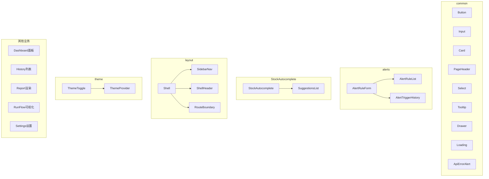
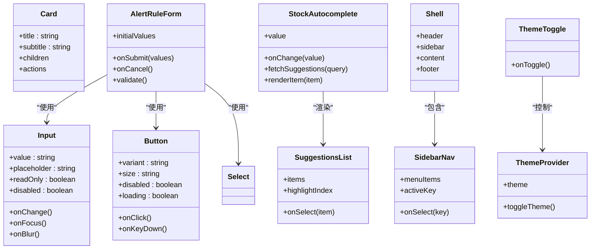
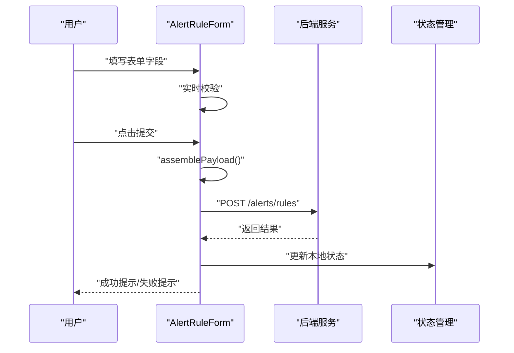
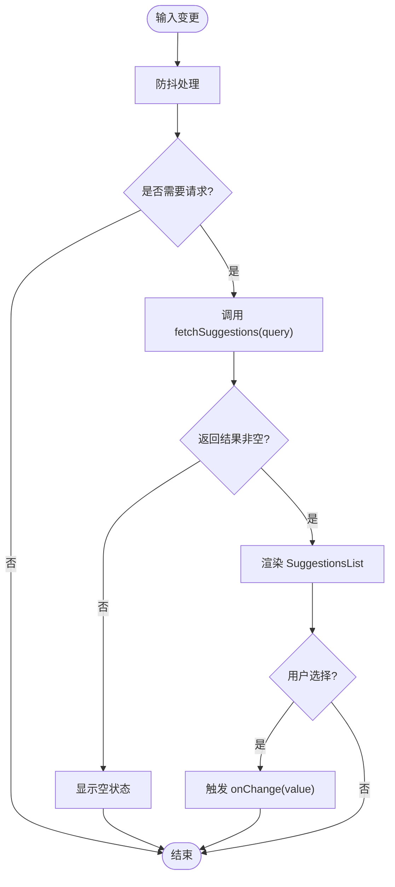
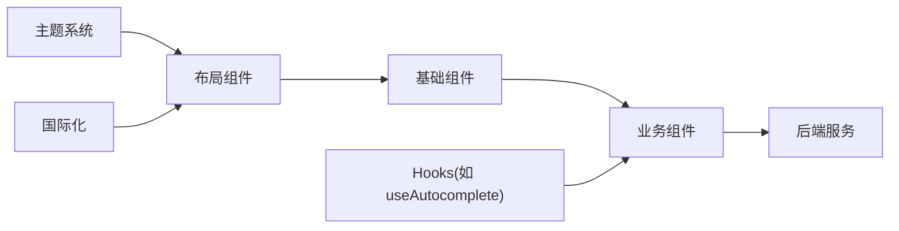

# UI组件库

<cite>
**本文引用的文件**   
- [Button.tsx](file://apps/dsa-web/src/components/common/Button.tsx)
- [Input.tsx](file://apps/dsa-web/src/components/common/Input.tsx)
- [Card.tsx](file://apps/dsa-web/src/components/common/Card.tsx)
- [AlertRuleForm.tsx](file://apps/dsa-web/src/components/alerts/AlertRuleForm.tsx)
- [StockAutocomplete.tsx](file://apps/dsa-web/src/components/StockAutocomplete/StockAutocomplete.tsx)
- [SuggestionsList.tsx](file://apps/dsa-web/src/components/StockAutocomplete/SuggestionsList.tsx)
- [index.ts](file://apps/dsa-web/src/components/StockAutocomplete/index.ts)
- [ThemeToggle.tsx](file://apps/dsa-web/src/components/theme/ThemeToggle.tsx)
- [ThemeProvider.tsx](file://apps/dsa-web/src/components/theme/ThemeProvider.tsx)
- [Shell.tsx](file://apps/dsa-web/src/components/layout/Shell.tsx)
- [SidebarNav.tsx](file://apps/dsa-web/src/components/layout/SidebarNav.tsx)
- [ShellHeader.tsx](file://apps/dsa-web/src/components/layout/ShellHeader.tsx)
- [RouteBoundary.tsx](file://apps/dsa-web/src/components/layout/RouteBoundary.tsx)
- [AppPage.tsx](file://apps/dsa-web/src/components/common/AppPage.tsx)
- [Badge.tsx](file://apps/dsa-web/src/components/common/Badge.tsx)
- [Checkbox.tsx](file://apps/dsa-web/src/components/common/Checkbox.tsx)
- [Collapsible.tsx](file://apps/dsa-web/src/components/common/Collapsible.tsx)
- [ConfirmDialog.tsx](file://apps/dsa-web/src/components/common/ConfirmDialog.tsx)
- [Drawer.tsx](file://apps/dsa-web/src/components/common/Drawer.tsx)
- [EmptyState.tsx](file://apps/dsa-web/src/components/common/EmptyState.tsx)
- [EyeToggleIcon.tsx](file://apps/dsa-web/src/components/common/EyeToggleIcon.tsx)
- [InlineAlert.tsx](file://apps/dsa-web/src/components/common/InlineAlert.tsx)
- [JsonViewer.tsx](file://apps/dsa-web/src/components/common/JsonViewer.tsx)
- [Loading.tsx](file://apps/dsa-web/src/components/common/Loading.tsx)
- [PageHeader.tsx](file://apps/dsa-web/src/components/common/PageHeader.tsx)
- [Pagination.tsx](file://apps/dsa-web/src/components/common/Pagination.tsx)
- [ParticleBackground.tsx](file://apps/dsa-web/src/components/common/ParticleBackground.tsx)
- [ScoreGauge.tsx](file://apps/dsa-web/src/components/common/ScoreGauge.tsx)
- [ScrollArea.tsx](file://apps/dsa-web/src/components/common/ScrollArea.tsx)
- [SectionCard.tsx](file://apps/dsa-web/src/components/common/SectionCard.tsx)
- [Select.tsx](file://apps/dsa-web/src/components/common/Select.tsx)
- [StatCard.tsx](file://apps/dsa-web/src/components/common/StatCard.tsx)
- [StatusDot.tsx](file://apps/dsa-web/src/components/common/StatusDot.tsx)
- [StickyActionBar.tsx](file://apps/dsa-web/src/components/common/StickyActionBar.tsx)
- [ToastViewport.tsx](file://apps/dsa-web/src/components/common/ToastViewport.tsx)
- [Toolbar.tsx](file://apps/dsa-web/src/components/common/Toolbar.tsx)
- [Tooltip.tsx](file://apps/dsa-web/src/components/common/Tooltip.tsx)
- [ApiErrorAlert.tsx](file://apps/dsa-web/src/components/common/ApiErrorAlert.tsx)
- [AlertRuleList.tsx](file://apps/dsa-web/src/components/alerts/AlertRuleList.tsx)
- [AlertTriggerHistory.tsx](file://apps/dsa-web/src/components/alerts/AlertTriggerHistory.tsx)
- [DashboardPanelHeader.tsx](file://apps/dsa-web/src/components/dashboard/DashboardPanelHeader.tsx)
- [DashboardStateBlock.tsx](file://apps/dsa-web/src/components/dashboard/DashboardStateBlock.tsx)
- [DecisionSignalDisplay.tsx](file://apps/dsa-web/src/components/decision-signals/DecisionSignalDisplay.tsx)
- [HistoryList.tsx](file://apps/dsa-web/src/components/history/HistoryList.tsx)
- [HistoryListItem.tsx](file://apps/dsa-web/src/components/history/HistoryListItem.tsx)
- [StockBar.tsx](file://apps/dsa-web/src/components/history/StockBar.tsx)
- [StockBarItem.tsx](file://apps/dsa-web/src/components/history/StockBarItem.tsx)
- [StockHistoryTrendDrawer.tsx](file://apps/dsa-web/src/components/history/StockHistoryTrendDrawer.tsx)
- [UiLanguageToggle.tsx](file://apps/dsa-web/src/components/i18n/UiLanguageToggle.tsx)
- [RunFlowEventList.tsx](file://apps/dsa-web/src/components/run-flow/RunFlowEventList.tsx)
- [RunFlowGraph.tsx](file://apps/dsa-web/src/components/run-flow/RunFlowGraph.tsx)
- [RunFlowNodeDetails.tsx](file://apps/dsa-web/src/components/run-flow/RunFlowNodeDetails.tsx)
- [RunFlowPanel.tsx](file://apps/dsa-web/src/components/run-flow/RunFlowPanel.tsx)
- [RunFlowSummaryBar.tsx](file://apps/dsa-web/src/components/run-flow/RunFlowSummaryBar.tsx)
- [topologyViewModel.ts](file://apps/dsa-web/src/components/run-flow/topologyViewModel.ts)
- [utils.ts](file://apps/dsa-web/src/components/run-flow/utils.ts)
- [AuthSettingsCard.tsx](file://apps/dsa-web/src/components/settings/AuthSettingsCard.tsx)
- [ChangePasswordCard.tsx](file://apps/dsa-web/src/components/settings/ChangePasswordCard.tsx)
- [IntelligentImport.tsx](file://apps/dsa-web/src/components/settings/IntelligentImport.tsx)
- [LLMChannelEditor.tsx](file://apps/dsa-web/src/components/settings/LLMChannelEditor.tsx)
- [NotificationTestPanel.tsx](file://apps/dsa-web/src/components/settings/NotificationTestPanel.tsx)
- [SettingsAlert.tsx](file://apps/dsa-web/src/components/settings/SettingsAlert.tsx)
- [SettingsCategoryNav.tsx](file://apps/dsa-web/src/components/settings/SettingsCategoryNav.tsx)
- [SettingsField.tsx](file://apps/dsa-web/src/components/settings/SettingsField.tsx)
- [SettingsHelpButton.tsx](file://apps/dsa-web/src/components/settings/SettingsHelpButton.tsx)
- [SettingsLoading.tsx](file://apps/dsa-web/src/components/settings/SettingsLoading.tsx)
- [SettingsPanelErrorBoundary.tsx](file://apps/dsa-web/src/components/settings/SettingsPanelErrorBoundary.tsx)
- [SettingsSectionCard.tsx](file://apps/dsa-web/src/components/settings/SettingsSectionCard.tsx)
- [ReportOverview.tsx](file://apps/dsa-web/src/components/report/ReportOverview.tsx)
- [ReportSummary.tsx](file://apps/dsa-web/src/components/report/ReportSummary.tsx)
- [ReportStrategy.tsx](file://apps/dsa-web/src/components/report/ReportStrategy.tsx)
- [ReportNews.tsx](file://apps/dsa-web/src/components/report/ReportNews.tsx)
- [ReportMarkdown.tsx](file://apps/dsa-web/src/components/report/ReportMarkdown.tsx)
- [ReportMarkdownBody.tsx](file://apps/dsa-web/src/components/report/ReportMarkdownBody.tsx)
- [ReportMarkdownDrawer.tsx](file://apps/dsa-web/src/components/report/ReportMarkdownDrawer.tsx)
- [ReportMarkdownPanel.tsx](file://apps/dsa-web/src/components/report/ReportMarkdownPanel.tsx)
- [ReportBacktestSummary.tsx](file://apps/dsa-web/src/components/report/ReportBacktestSummary.tsx)
- [ReportDecisionSignals.tsx](file://apps/dsa-web/src/components/report/ReportDecisionSignals.tsx)
- [ReportDiagnostics.tsx](file://apps/dsa-web/src/components/report/ReportDiagnostics.tsx)
- [ReportDetails.tsx](file://apps/dsa-web/src/components/report/ReportDetails.tsx)
- [AnalysisContextSummary.tsx](file://apps/dsa-web/src/components/report/AnalysisContextSummary.tsx)
- [useAutocomplete.ts](file://apps/dsa-web/src/hooks/useAutocomplete.ts)
- [index.theme-bootstrap.test.ts](file://apps/dsa-web/tests/index.theme-bootstrap.test.ts)
- [login-theme-tokens.test.ts](file://apps/dsa-web/tests/login-theme-tokens.test.ts)
- [settings_field_description_fallback.test.tsx](file://apps/dsa-web/tests/settings_field_description_fallback.test.tsx)
- [system_config_i18n.test.ts](file://apps/dsa-web/tests/system_config_i18n.test.ts)
- [ui_governance.test.ts](file://apps/dsa-web/tests/ui_governance.test.ts)
</cite>

## 目录
1. [简介](#简介)
2. [项目结构](#项目结构)
3. [核心组件](#核心组件)
4. [架构总览](#架构总览)
5. [详细组件分析](#详细组件分析)
6. [依赖关系分析](#依赖关系分析)
7. [性能考量](#性能考量)
8. [故障排查指南](#故障排查指南)
9. [结论](#结论)
10. [附录](#附录)

## 简介
本文件面向UI组件库的使用者与扩展开发者，系统化梳理可复用组件的设计原则、接口规范、事件处理与样式定制方法。文档覆盖基础组件（如Button、Input、Card）、业务组件（如AlertRuleForm、StockAutocomplete）以及布局组件（如Shell、SidebarNav等），并提供测试策略、无障碍访问支持、响应式设计实现说明，以及最佳实践与常见问题解决方案。同时给出自定义组件开发指南与组件库扩展方法，帮助团队在统一设计语言下高效构建一致的用户界面。

## 项目结构
UI组件库位于Web应用前端代码中，按功能域划分目录：
- common：通用基础组件与工具型组件
- alerts：告警规则相关业务组件
- StockAutocomplete：股票自动补全能力
- layout：页面布局与导航壳层
- theme：主题与国际化切换
- dashboard、history、report、run-flow、settings等：领域业务组件

图表来源
- [Button.tsx:1-200](file://apps/dsa-web/src/components/common/Button.tsx#L1-L200)
- [Input.tsx:1-200](file://apps/dsa-web/src/components/common/Input.tsx#L1-L200)
- [Card.tsx:1-200](file://apps/dsa-web/src/components/common/Card.tsx#L1-L200)
- [AlertRuleForm.tsx:1-200](file://apps/dsa-web/src/components/alerts/AlertRuleForm.tsx#L1-L200)
- [StockAutocomplete.tsx:1-200](file://apps/dsa-web/src/components/StockAutocomplete/StockAutocomplete.tsx#L1-L200)
- [SuggestionsList.tsx:1-200](file://apps/dsa-web/src/components/StockAutocomplete/SuggestionsList.tsx#L1-L200)
- [Shell.tsx:1-200](file://apps/dsa-web/src/components/layout/Shell.tsx#L1-L200)
- [SidebarNav.tsx:1-200](file://apps/dsa-web/src/components/layout/SidebarNav.tsx#L1-L200)
- [ShellHeader.tsx:1-200](file://apps/dsa-web/src/components/layout/ShellHeader.tsx#L1-L200)
- [RouteBoundary.tsx:1-200](file://apps/dsa-web/src/components/layout/RouteBoundary.tsx#L1-L200)
- [ThemeToggle.tsx:1-200](file://apps/dsa-web/src/components/theme/ThemeToggle.tsx#L1-L200)
- [ThemeProvider.tsx:1-200](file://apps/dsa-web/src/components/theme/ThemeProvider.tsx#L1-L200)

章节来源
- [Button.tsx:1-200](file://apps/dsa-web/src/components/common/Button.tsx#L1-L200)
- [Input.tsx:1-200](file://apps/dsa-web/src/components/common/Input.tsx#L1-L200)
- [Card.tsx:1-200](file://apps/dsa-web/src/components/common/Card.tsx#L1-L200)
- [AlertRuleForm.tsx:1-200](file://apps/dsa-web/src/components/alerts/AlertRuleForm.tsx#L1-L200)
- [StockAutocomplete.tsx:1-200](file://apps/dsa-web/src/components/StockAutocomplete/StockAutocomplete.tsx#L1-L200)
- [SuggestionsList.tsx:1-200](file://apps/dsa-web/src/components/StockAutocomplete/SuggestionsList.tsx#L1-L200)
- [Shell.tsx:1-200](file://apps/dsa-web/src/components/layout/Shell.tsx#L1-L200)
- [SidebarNav.tsx:1-200](file://apps/dsa-web/src/components/layout/SidebarNav.tsx#L1-L200)
- [ShellHeader.tsx:1-200](file://apps/dsa-web/src/components/layout/ShellHeader.tsx#L1-L200)
- [RouteBoundary.tsx:1-200](file://apps/dsa-web/src/components/layout/RouteBoundary.tsx#L1-L200)
- [ThemeToggle.tsx:1-200](file://apps/dsa-web/src/components/theme/ThemeToggle.tsx#L1-L200)
- [ThemeProvider.tsx:1-200](file://apps/dsa-web/src/components/theme/ThemeProvider.tsx#L1-L200)

## 核心组件
本节聚焦基础组件的Props接口、事件处理与样式定制要点，并给出使用示例路径与最佳实践。

- Button
  - Props建议：类型（primary/secondary/outline/danger等）、尺寸（sm/md/lg）、禁用态、加载态、图标插槽、对齐方式、无障碍标签
  - 事件：onClick、onKeyDown（回车/空格触发）
  - 样式：通过CSS变量或Tailwind类名覆盖；按钮焦点态需满足对比度要求
  - 示例路径：[Button.tsx:1-200](file://apps/dsa-web/src/components/common/Button.tsx#L1-L200)

- Input
  - Props建议：值绑定、占位符、只读、禁用、错误提示、前缀/后缀图标、输入限制（maxLength、pattern）
  - 事件：onChange、onFocus、onBlur、onSubmit（配合表单）
  - 无障碍：aria-invalid、aria-describedby、role="textbox"
  - 示例路径：[Input.tsx:1-200](file://apps/dsa-web/src/components/common/Input.tsx#L1-L200)

- Card
  - Props建议：标题、副标题、内容插槽、操作区、阴影、圆角、间距
  - 场景：信息展示、表单容器、统计卡片
  - 示例路径：[Card.tsx:1-200](file://apps/dsa-web/src/components/common/Card.tsx#L1-L200)

- Select
  - Props建议：选项数组、默认值、禁用、多选、搜索过滤、异步加载
  - 事件：onChange、onSearch
  - 示例路径：[Select.tsx:1-200](file://apps/dsa-web/src/components/common/Select.tsx#L1-L200)

- Tooltip
  - Props建议：文本、位置、触发方式（hover/focus/click）、延迟
  - 无障碍：aria-tooltip、键盘可达
  - 示例路径：[Tooltip.tsx:1-200](file://apps/dsa-web/src/components/common/Tooltip.tsx#L1-L200)

- Drawer
  - Props建议：打开状态、宽度、遮罩、关闭回调、嵌套滚动
  - 示例路径：[Drawer.tsx:1-200](file://apps/dsa-web/src/components/common/Drawer.tsx#L1-L200)

- Loading
  - Props建议：尺寸、颜色、是否阻塞交互
  - 示例路径：[Loading.tsx:1-200](file://apps/dsa-web/src/components/common/Loading.tsx#L1-L200)

- ApiErrorAlert
  - Props建议：错误对象、显示时长、重试回调
  - 事件：onRetry、onDismiss
  - 示例路径：[ApiErrorAlert.tsx:1-200](file://apps/dsa-web/src/components/common/ApiErrorAlert.tsx#L1-L200)

章节来源
- [Button.tsx:1-200](file://apps/dsa-web/src/components/common/Button.tsx#L1-L200)
- [Input.tsx:1-200](file://apps/dsa-web/src/components/common/Input.tsx#L1-L200)
- [Card.tsx:1-200](file://apps/dsa-web/src/components/common/Card.tsx#L1-L200)
- [Select.tsx:1-200](file://apps/dsa-web/src/components/common/Select.tsx#L1-L200)
- [Tooltip.tsx:1-200](file://apps/dsa-web/src/components/common/Tooltip.tsx#L1-L200)
- [Drawer.tsx:1-200](file://apps/dsa-web/src/components/common/Drawer.tsx#L1-L200)
- [Loading.tsx:1-200](file://apps/dsa-web/src/components/common/Loading.tsx#L1-L200)
- [ApiErrorAlert.tsx:1-200](file://apps/dsa-web/src/components/common/ApiErrorAlert.tsx#L1-L200)

## 架构总览
组件库采用“基础组件 + 业务组件 + 布局组件”的分层组织方式：
- 基础组件提供原子化UI元素，关注可访问性与样式一致性
- 业务组件组合基础组件，封装领域逻辑（如告警规则表单、股票自动补全）
- 布局组件负责页面骨架、导航与路由边界，确保整体体验一致

图表来源
- [Button.tsx:1-200](file://apps/dsa-web/src/components/common/Button.tsx#L1-L200)
- [Input.tsx:1-200](file://apps/dsa-web/src/components/common/Input.tsx#L1-L200)
- [Card.tsx:1-200](file://apps/dsa-web/src/components/common/Card.tsx#L1-L200)
- [AlertRuleForm.tsx:1-200](file://apps/dsa-web/src/components/alerts/AlertRuleForm.tsx#L1-L200)
- [StockAutocomplete.tsx:1-200](file://apps/dsa-web/src/components/StockAutocomplete/StockAutocomplete.tsx#L1-L200)
- [SuggestionsList.tsx:1-200](file://apps/dsa-web/src/components/StockAutocomplete/SuggestionsList.tsx#L1-L200)
- [Shell.tsx:1-200](file://apps/dsa-web/src/components/layout/Shell.tsx#L1-L200)
- [SidebarNav.tsx:1-200](file://apps/dsa-web/src/components/layout/SidebarNav.tsx#L1-L200)
- [ThemeToggle.tsx:1-200](file://apps/dsa-web/src/components/theme/ThemeToggle.tsx#L1-L200)
- [ThemeProvider.tsx:1-200](file://apps/dsa-web/src/components/theme/ThemeProvider.tsx#L1-L200)

## 详细组件分析

### 基础组件族（Button、Input、Card）
- 设计原则
  - 单一职责：每个组件聚焦一个明确的UI职责
  - 可组合性：通过props与插槽灵活组合
  - 可访问性：遵循ARIA规范，保证键盘可达与屏幕阅读器友好
  - 样式解耦：通过主题变量或CSS类名覆盖，避免硬编码样式
- 关键接口
  - Button：variant、size、disabled、loading、onClick、onKeyDown
  - Input：value、placeholder、readOnly、disabled、onChange、onFocus、onBlur
  - Card：title、subtitle、children、actions
- 使用示例路径
  - [Button.tsx:1-200](file://apps/dsa-web/src/components/common/Button.tsx#L1-L200)
  - [Input.tsx:1-200](file://apps/dsa-web/src/components/common/Input.tsx#L1-L200)
  - [Card.tsx:1-200](file://apps/dsa-web/src/components/common/Card.tsx#L1-L200)

章节来源
- [Button.tsx:1-200](file://apps/dsa-web/src/components/common/Button.tsx#L1-L200)
- [Input.tsx:1-200](file://apps/dsa-web/src/components/common/Input.tsx#L1-L200)
- [Card.tsx:1-200](file://apps/dsa-web/src/components/common/Card.tsx#L1-L200)

### 业务组件：AlertRuleForm（告警规则表单）
- 职责：收集并校验告警规则配置，提交到后端或状态管理
- 数据流
  - 初始化：从父组件传入初始值
  - 用户输入：实时校验与反馈
  - 提交：组装payload，调用API或更新store
- 事件与回调
  - onSubmit(values)、onCancel()、validate()
- 可访问性
  - 表单字段关联label与描述
  - 错误信息通过aria-describedby关联
- 使用示例路径
  - [AlertRuleForm.tsx:1-200](file://apps/dsa-web/src/components/alerts/AlertRuleForm.tsx#L1-L200)

图表来源
- [AlertRuleForm.tsx:1-200](file://apps/dsa-web/src/components/alerts/AlertRuleForm.tsx#L1-L200)

章节来源
- [AlertRuleForm.tsx:1-200](file://apps/dsa-web/src/components/alerts/AlertRuleForm.tsx#L1-L200)

### 业务组件：StockAutocomplete（股票自动补全）
- 职责：根据用户输入动态获取并展示股票建议，支持选择与键盘导航
- 数据流
  - 输入变化：防抖查询
  - 远程获取：fetchSuggestions(query)
  - 渲染建议：SuggestionsList
  - 选择项：onChange(value)
- 可访问性
  - role="combobox"、aria-autocomplete="list"、aria-activedescendant
- 使用示例路径
  - [StockAutocomplete.tsx:1-200](file://apps/dsa-web/src/components/StockAutocomplete/StockAutocomplete.tsx#L1-L200)
  - [SuggestionsList.tsx:1-200](file://apps/dsa-web/src/components/StockAutocomplete/SuggestionsList.tsx#L1-L200)
  - [index.ts:1-200](file://apps/dsa-web/src/components/StockAutocomplete/index.ts#L1-L200)

图表来源
- [StockAutocomplete.tsx:1-200](file://apps/dsa-web/src/components/StockAutocomplete/StockAutocomplete.tsx#L1-L200)
- [SuggestionsList.tsx:1-200](file://apps/dsa-web/src/components/StockAutocomplete/SuggestionsList.tsx#L1-L200)

章节来源
- [StockAutocomplete.tsx:1-200](file://apps/dsa-web/src/components/StockAutocomplete/StockAutocomplete.tsx#L1-L200)
- [SuggestionsList.tsx:1-200](file://apps/dsa-web/src/components/StockAutocomplete/SuggestionsList.tsx#L1-L200)
- [index.ts:1-200](file://apps/dsa-web/src/components/StockAutocomplete/index.ts#L1-L200)

### 布局组件：Shell、SidebarNav、ShellHeader、RouteBoundary
- Shell：页面外壳，整合头部、侧边栏、内容与页脚
- SidebarNav：菜单导航，支持高亮与选中态
- ShellHeader：顶部栏，集成主题切换、用户信息等
- RouteBoundary：路由边界，处理加载、错误与权限
- 使用示例路径
  - [Shell.tsx:1-200](file://apps/dsa-web/src/components/layout/Shell.tsx#L1-L200)
  - [SidebarNav.tsx:1-200](file://apps/dsa-web/src/components/layout/SidebarNav.tsx#L1-L200)
  - [ShellHeader.tsx:1-200](file://apps/dsa-web/src/components/layout/ShellHeader.tsx#L1-L200)
  - [RouteBoundary.tsx:1-200](file://apps/dsa-web/src/components/layout/RouteBoundary.tsx#L1-L200)

章节来源
- [Shell.tsx:1-200](file://apps/dsa-web/src/components/layout/Shell.tsx#L1-L200)
- [SidebarNav.tsx:1-200](file://apps/dsa-web/src/components/layout/SidebarNav.tsx#L1-L200)
- [ShellHeader.tsx:1-200](file://apps/dsa-web/src/components/layout/ShellHeader.tsx#L1-L200)
- [RouteBoundary.tsx:1-200](file://apps/dsa-web/src/components/layout/RouteBoundary.tsx#L1-L200)

### 主题与国际化：ThemeToggle、ThemeProvider、UiLanguageToggle
- ThemeProvider：提供主题上下文，支持明暗主题切换
- ThemeToggle：触发主题切换，保持用户偏好
- UiLanguageToggle：切换UI语言，影响组件文案
- 使用示例路径
  - [ThemeProvider.tsx:1-200](file://apps/dsa-web/src/components/theme/ThemeProvider.tsx#L1-L200)
  - [ThemeToggle.tsx:1-200](file://apps/dsa-web/src/components/theme/ThemeToggle.tsx#L1-L200)
  - [UiLanguageToggle.tsx:1-200](file://apps/dsa-web/src/components/i18n/UiLanguageToggle.tsx#L1-L200)

章节来源
- [ThemeProvider.tsx:1-200](file://apps/dsa-web/src/components/theme/ThemeProvider.tsx#L1-L200)
- [ThemeToggle.tsx:1-200](file://apps/dsa-web/src/components/theme/ThemeToggle.tsx#L1-L200)
- [UiLanguageToggle.tsx:1-200](file://apps/dsa-web/src/components/i18n/UiLanguageToggle.tsx#L1-L200)

### 其他常用组件（精选）
- Badge：状态标记，用于计数或标签
- Checkbox：复选框，支持禁用与错误态
- Collapsible：折叠面板，节省空间
- ConfirmDialog：确认对话框，防止误操作
- EmptyState：空状态占位，提升用户体验
- InlineAlert：行内提示，轻量级消息
- JsonViewer：JSON数据可视化
- PageHeader：页面标题区，统一风格
- Pagination：分页控件
- ScoreGauge：分数仪表盘
- ScrollArea：自定义滚动区域
- SectionCard：区块卡片
- StatCard：统计卡片
- StatusDot：状态点
- StickyActionBar：固定操作栏
- ToastViewport：通知视口
- Toolbar：工具栏
- DashboardPanelHeader、DashboardStateBlock：仪表板组件
- HistoryList、HistoryListItem、StockBar、StockBarItem、StockHistoryTrendDrawer：历史数据展示
- ReportOverview、ReportSummary、ReportStrategy、ReportNews、ReportMarkdown、ReportMarkdownBody、ReportMarkdownDrawer、ReportMarkdownPanel、ReportBacktestSummary、ReportDecisionSignals、ReportDiagnostics、ReportDetails、AnalysisContextSummary：报告渲染
- RunFlowEventList、RunFlowGraph、RunFlowNodeDetails、RunFlowPanel、RunFlowSummaryBar、topologyViewModel、utils：运行流程可视化
- Settings系列：设置页各类卡片与字段

使用示例路径（部分）
- [Badge.tsx:1-200](file://apps/dsa-web/src/components/common/Badge.tsx#L1-L200)
- [Checkbox.tsx:1-200](file://apps/dsa-web/src/components/common/Checkbox.tsx#L1-L200)
- [Collapsible.tsx:1-200](file://apps/dsa-web/src/components/common/Collapsible.tsx#L1-L200)
- [ConfirmDialog.tsx:1-200](file://apps/dsa-web/src/components/common/ConfirmDialog.tsx#L1-L200)
- [EmptyState.tsx:1-200](file://apps/dsa-web/src/components/common/EmptyState.tsx#L1-L200)
- [InlineAlert.tsx:1-200](file://apps/dsa-web/src/components/common/InlineAlert.tsx#L1-L200)
- [JsonViewer.tsx:1-200](file://apps/dsa-web/src/components/common/JsonViewer.tsx#L1-L200)
- [PageHeader.tsx:1-200](file://apps/dsa-web/src/components/common/PageHeader.tsx#L1-L200)
- [Pagination.tsx:1-200](file://apps/dsa-web/src/components/common/Pagination.tsx#L1-L200)
- [ScoreGauge.tsx:1-200](file://apps/dsa-web/src/components/common/ScoreGauge.tsx#L1-L200)
- [ScrollArea.tsx:1-200](file://apps/dsa-web/src/components/common/ScrollArea.tsx#L1-L200)
- [SectionCard.tsx:1-200](file://apps/dsa-web/src/components/common/SectionCard.tsx#L1-L200)
- [StatCard.tsx:1-200](file://apps/dsa-web/src/components/common/StatCard.tsx#L1-L200)
- [StatusDot.tsx:1-200](file://apps/dsa-web/src/components/common/StatusDot.tsx#L1-L200)
- [StickyActionBar.tsx:1-200](file://apps/dsa-web/src/components/common/StickyActionBar.tsx#L1-L200)
- [ToastViewport.tsx:1-200](file://apps/dsa-web/src/components/common/ToastViewport.tsx#L1-L200)
- [Toolbar.tsx:1-200](file://apps/dsa-web/src/components/common/Toolbar.tsx#L1-L200)
- [DashboardPanelHeader.tsx:1-200](file://apps/dsa-web/src/components/dashboard/DashboardPanelHeader.tsx#L1-L200)
- [DashboardStateBlock.tsx:1-200](file://apps/dsa-web/src/components/dashboard/DashboardStateBlock.tsx#L1-L200)
- [HistoryList.tsx:1-200](file://apps/dsa-web/src/components/history/HistoryList.tsx#L1-L200)
- [HistoryListItem.tsx:1-200](file://apps/dsa-web/src/components/history/HistoryListItem.tsx#L1-L200)
- [StockBar.tsx:1-200](file://apps/dsa-web/src/components/history/StockBar.tsx#1-L200)
- [StockBarItem.tsx:1-200](file://apps/dsa-web/src/components/history/StockBarItem.tsx#L1-L200)
- [StockHistoryTrendDrawer.tsx:1-200](file://apps/dsa-web/src/components/history/StockHistoryTrendDrawer.tsx#L1-L200)
- [ReportOverview.tsx:1-200](file://apps/dsa-web/src/components/report/ReportOverview.tsx#L1-L200)
- [ReportSummary.tsx:1-200](file://apps/dsa-web/src/components/report/ReportSummary.tsx#L1-L200)
- [ReportStrategy.tsx:1-200](file://apps/dsa-web/src/components/report/ReportStrategy.tsx#L1-L200)
- [ReportNews.tsx:1-200](file://apps/dsa-web/src/components/report/ReportNews.tsx#L1-L200)
- [ReportMarkdown.tsx:1-200](file://apps/dsa-web/src/components/report/ReportMarkdown.tsx#L1-L200)
- [ReportMarkdownBody.tsx:1-200](file://apps/dsa-web/src/components/report/ReportMarkdownBody.tsx#L1-L200)
- [ReportMarkdownDrawer.tsx:1-200](file://apps/dsa-web/src/components/report/ReportMarkdownDrawer.tsx#L1-L200)
- [ReportMarkdownPanel.tsx:1-200](file://apps/dsa-web/src/components/report/ReportMarkdownPanel.tsx#L1-L200)
- [ReportBacktestSummary.tsx:1-200](file://apps/dsa-web/src/components/report/ReportBacktestSummary.tsx#L1-L200)
- [ReportDecisionSignals.tsx:1-200](file://apps/dsa-web/src/components/report/ReportDecisionSignals.tsx#L1-L200)
- [ReportDiagnostics.tsx:1-200](file://apps/dsa-web/src/components/report/ReportDiagnostics.tsx#L1-L200)
- [ReportDetails.tsx:1-200](file://apps/dsa-web/src/components/report/ReportDetails.tsx#L1-L200)
- [AnalysisContextSummary.tsx:1-200](file://apps/dsa-web/src/components/report/AnalysisContextSummary.tsx#L1-L200)
- [RunFlowEventList.tsx:1-200](file://apps/dsa-web/src/components/run-flow/RunFlowEventList.tsx#L1-L200)
- [RunFlowGraph.tsx:1-200](file://apps/dsa-web/src/components/run-flow/RunFlowGraph.tsx#L1-L200)
- [RunFlowNodeDetails.tsx:1-200](file://apps/dsa-web/src/components/run-flow/RunFlowNodeDetails.tsx#L1-L200)
- [RunFlowPanel.tsx:1-200](file://apps/dsa-web/src/components/run-flow/RunFlowPanel.tsx#L1-L200)
- [RunFlowSummaryBar.tsx:1-200](file://apps/dsa-web/src/components/run-flow/RunFlowSummaryBar.tsx#L1-L200)
- [topologyViewModel.ts:1-200](file://apps/dsa-web/src/components/run-flow/topologyViewModel.ts#L1-L200)
- [utils.ts:1-200](file://apps/dsa-web/src/components/run-flow/utils.ts#L1-L200)
- [AuthSettingsCard.tsx:1-200](file://apps/dsa-web/src/components/settings/AuthSettingsCard.tsx#L1-L200)
- [ChangePasswordCard.tsx:1-200](file://apps/dsa-web/src/components/settings/ChangePasswordCard.tsx#L1-L200)
- [IntelligentImport.tsx:1-200](file://apps/dsa-web/src/components/settings/IntelligentImport.tsx#L1-L200)
- [LLMChannelEditor.tsx:1-200](file://apps/dsa-web/src/components/settings/LLMChannelEditor.tsx#L1-L200)
- [NotificationTestPanel.tsx:1-200](file://apps/dsa-web/src/components/settings/NotificationTestPanel.tsx#1-L200)
- [SettingsAlert.tsx:1-200](file://apps/dsa-web/src/components/settings/SettingsAlert.tsx#L1-L200)
- [SettingsCategoryNav.tsx:1-200](file://apps/dsa-web/src/components/settings/SettingsCategoryNav.tsx#L1-L200)
- [SettingsField.tsx:1-200](file://apps/dsa-web/src/components/settings/SettingsField.tsx#L1-L200)
- [SettingsHelpButton.tsx:1-200](file://apps/dsa-web/src/components/settings/SettingsHelpButton.tsx#L1-L200)
- [SettingsLoading.tsx:1-200](file://apps/dsa-web/src/components/settings/SettingsLoading.tsx#L1-L200)
- [SettingsPanelErrorBoundary.tsx:1-200](file://apps/dsa-web/src/components/settings/SettingsPanelErrorBoundary.tsx#L1-L200)
- [SettingsSectionCard.tsx:1-200](file://apps/dsa-web/src/components/settings/SettingsSectionCard.tsx#L1-L200)

章节来源
- [Badge.tsx:1-200](file://apps/dsa-web/src/components/common/Badge.tsx#L1-L200)
- [Checkbox.tsx:1-200](file://apps/dsa-web/src/components/common/Checkbox.tsx#L1-L200)
- [Collapsible.tsx:1-200](file://apps/dsa-web/src/components/common/Collapsible.tsx#L1-L200)
- [ConfirmDialog.tsx:1-200](file://apps/dsa-web/src/components/common/ConfirmDialog.tsx#L1-L200)
- [EmptyState.tsx:1-200](file://apps/dsa-web/src/components/common/EmptyState.tsx#L1-L200)
- [InlineAlert.tsx:1-200](file://apps/dsa-web/src/components/common/InlineAlert.tsx#L1-L200)
- [JsonViewer.tsx:1-200](file://apps/dsa-web/src/components/common/JsonViewer.tsx#L1-L200)
- [PageHeader.tsx:1-200](file://apps/dsa-web/src/components/common/PageHeader.tsx#L1-L200)
- [Pagination.tsx:1-200](file://apps/dsa-web/src/components/common/Pagination.tsx#L1-L200)
- [ScoreGauge.tsx:1-200](file://apps/dsa-web/src/components/common/ScoreGauge.tsx#L1-L200)
- [ScrollArea.tsx:1-200](file://apps/dsa-web/src/components/common/ScrollArea.tsx#L1-L200)
- [SectionCard.tsx:1-200](file://apps/dsa-web/src/components/common/SectionCard.tsx#L1-L200)
- [StatCard.tsx:1-200](file://apps/dsa-web/src/components/common/StatCard.tsx#L1-L200)
- [StatusDot.tsx:1-200](file://apps/dsa-web/src/components/common/StatusDot.tsx#L1-L200)
- [StickyActionBar.tsx:1-200](file://apps/dsa-web/src/components/common/StickyActionBar.tsx#L1-L200)
- [ToastViewport.tsx:1-200](file://apps/dsa-web/src/components/common/ToastViewport.tsx#L1-L200)
- [Toolbar.tsx:1-200](file://apps/dsa-web/src/components/common/Toolbar.tsx#L1-L200)
- [DashboardPanelHeader.tsx:1-200](file://apps/dsa-web/src/components/dashboard/DashboardPanelHeader.tsx#L1-L200)
- [DashboardStateBlock.tsx:1-200](file://apps/dsa-web/src/components/dashboard/DashboardStateBlock.tsx#L1-L200)
- [HistoryList.tsx:1-200](file://apps/dsa-web/src/components/history/HistoryList.tsx#L1-L200)
- [HistoryListItem.tsx:1-200](file://apps/dsa-web/src/components/history/HistoryListItem.tsx#L1-L200)
- [StockBar.tsx:1-200](file://apps/dsa-web/src/components/history/StockBar.tsx#L1-L200)
- [StockBarItem.tsx:1-200](file://apps/dsa-web/src/components/history/StockBarItem.tsx#L1-L200)
- [StockHistoryTrendDrawer.tsx:1-200](file://apps/dsa-web/src/components/history/StockHistoryTrendDrawer.tsx#L1-L200)
- [ReportOverview.tsx:1-200](file://apps/dsa-web/src/components/report/ReportOverview.tsx#L1-L200)
- [ReportSummary.tsx:1-200](file://apps/dsa-web/src/components/report/ReportSummary.tsx#L1-L200)
- [ReportStrategy.tsx:1-200](file://apps/dsa-web/src/components/report/ReportStrategy.tsx#L1-L200)
- [ReportNews.tsx:1-200](file://apps/dsa-web/src/components/report/ReportNews.tsx#L1-L200)
- [ReportMarkdown.tsx:1-200](file://apps/dsa-web/src/components/report/ReportMarkdown.tsx#L1-L200)
- [ReportMarkdownBody.tsx:1-200](file://apps/dsa-web/src/components/report/ReportMarkdownBody.tsx#L1-L200)
- [ReportMarkdownDrawer.tsx:1-200](file://apps/dsa-web/src/components/report/ReportMarkdownDrawer.tsx#L1-L200)
- [ReportMarkdownPanel.tsx:1-200](file://apps/dsa-web/src/components/report/ReportMarkdownPanel.tsx#L1-L200)
- [ReportBacktestSummary.tsx:1-200](file://apps/dsa-web/src/components/report/ReportBacktestSummary.tsx#L1-L200)
- [ReportDecisionSignals.tsx:1-200](file://apps/dsa-web/src/components/report/ReportDecisionSignals.tsx#L1-L200)
- [ReportDiagnostics.tsx:1-200](file://apps/dsa-web/src/components/report/ReportDiagnostics.tsx#L1-L200)
- [ReportDetails.tsx:1-200](file://apps/dsa-web/src/components/report/ReportDetails.tsx#L1-L200)
- [AnalysisContextSummary.tsx:1-200](file://apps/dsa-web/src/components/report/AnalysisContextSummary.tsx#L1-L200)
- [RunFlowEventList.tsx:1-200](file://apps/dsa-web/src/components/run-flow/RunFlowEventList.tsx#L1-L200)
- [RunFlowGraph.tsx:1-200](file://apps/dsa-web/src/components/run-flow/RunFlowGraph.tsx#L1-L200)
- [RunFlowNodeDetails.tsx:1-200](file://apps/dsa-web/src/components/run-flow/RunFlowNodeDetails.tsx#L1-L200)
- [RunFlowPanel.tsx:1-200](file://apps/dsa-web/src/components/run-flow/RunFlowPanel.tsx#L1-L200)
- [RunFlowSummaryBar.tsx:1-200](file://apps/dsa-web/src/components/run-flow/RunFlowSummaryBar.tsx#L1-L200)
- [topologyViewModel.ts:1-200](file://apps/dsa-web/src/components/run-flow/topologyViewModel.ts#L1-L200)
- [utils.ts:1-200](file://apps/dsa-web/src/components/run-flow/utils.ts#L1-L200)
- [AuthSettingsCard.tsx:1-200](file://apps/dsa-web/src/components/settings/AuthSettingsCard.tsx#L1-L200)
- [ChangePasswordCard.tsx:1-200](file://apps/dsa-web/src/components/settings/ChangePasswordCard.tsx#L1-L200)
- [IntelligentImport.tsx:1-200](file://apps/dsa-web/src/components/settings/IntelligentImport.tsx#L1-L200)
- [LLMChannelEditor.tsx:1-200](file://apps/dsa-web/src/components/settings/LLMChannelEditor.tsx#L1-L200)
- [NotificationTestPanel.tsx:1-200](file://apps/dsa-web/src/components/settings/NotificationTestPanel.tsx#L1-L200)
- [SettingsAlert.tsx:1-200](file://apps/dsa-web/src/components/settings/SettingsAlert.tsx#L1-L200)
- [SettingsCategoryNav.tsx:1-200](file://apps/dsa-web/src/components/settings/SettingsCategoryNav.tsx#L1-L200)
- [SettingsField.tsx:1-200](file://apps/dsa-web/src/components/settings/SettingsField.tsx#L1-L200)
- [SettingsHelpButton.tsx:1-200](file://apps/dsa-web/src/components/settings/SettingsHelpButton.tsx#L1-L200)
- [SettingsLoading.tsx:1-200](file://apps/dsa-web/src/components/settings/SettingsLoading.tsx#L1-L200)
- [SettingsPanelErrorBoundary.tsx:1-200](file://apps/dsa-web/src/components/settings/SettingsPanelErrorBoundary.tsx#L1-L200)
- [SettingsSectionCard.tsx:1-200](file://apps/dsa-web/src/components/settings/SettingsSectionCard.tsx#L1-L200)

## 依赖关系分析
- 组件间耦合
  - 基础组件低耦合，被业务组件广泛复用
  - 业务组件依赖基础组件与hooks（如useAutocomplete）
  - 布局组件聚合多个子组件，形成页面骨架
- 外部依赖
  - 主题系统（ThemeProvider）
  - 国际化（UiLanguageToggle）
  - 网络请求（在业务组件中调用API）
- 潜在循环依赖
  - 应避免组件互相引用，必要时通过抽象或context解耦

图表来源
- [useAutocomplete.ts:1-200](file://apps/dsa-web/src/hooks/useAutocomplete.ts#L1-L200)
- [ThemeProvider.tsx:1-200](file://apps/dsa-web/src/components/theme/ThemeProvider.tsx#L1-L200)
- [UiLanguageToggle.tsx:1-200](file://apps/dsa-web/src/components/i18n/UiLanguageToggle.tsx#L1-L200)

章节来源
- [useAutocomplete.ts:1-200](file://apps/dsa-web/src/hooks/useAutocomplete.ts#L1-L200)
- [ThemeProvider.tsx:1-200](file://apps/dsa-web/src/components/theme/ThemeProvider.tsx#L1-L200)
- [UiLanguageToggle.tsx:1-200](file://apps/dsa-web/src/components/i18n/UiLanguageToggle.tsx#L1-L200)

## 性能考量
- 渲染优化
  - 使用React.memo包裹纯展示组件
  - 列表渲染使用key与虚拟滚动（大数据量时）
- 网络请求
  - 防抖与节流（如StockAutocomplete）
  - 缓存策略（本地缓存最近查询结果）
- 样式与主题
  - 避免重排重绘，合理使用CSS变量
  - 按需加载主题资源
- 可访问性
  - 减少不必要的ARIA属性，避免语义冲突
  - 键盘导航与焦点管理

## 故障排查指南
- 常见错误
  - 表单校验失败：检查字段必填与格式
  - 自动补全无结果：检查网络请求与数据结构
  - 主题切换无效：检查ThemeProvider上下文是否正确注入
- 调试技巧
  - 使用浏览器开发者工具检查DOM与事件
  - 打印组件props与state变化
  - 查看控制台错误堆栈定位问题
- 测试用例参考
  - [index.theme-bootstrap.test.ts:1-200](file://apps/dsa-web/tests/index.theme-bootstrap.test.ts#L1-L200)
  - [login-theme-tokens.test.ts:1-200](file://apps/dsa-web/tests/login-theme-tokens.test.ts#L1-L200)
  - [settings_field_description_fallback.test.tsx:1-200](file://apps/dsa-web/tests/settings_field_description_fallback.test.tsx#L1-L200)
  - [system_config_i18n.test.ts:1-200](file://apps/dsa-web/tests/system_config_i18n.test.ts#L1-L200)
  - [ui_governance.test.ts:1-200](file://apps/dsa-web/tests/ui_governance.test.ts#L1-L200)

章节来源
- [index.theme-bootstrap.test.ts:1-200](file://apps/dsa-web/tests/index.theme-bootstrap.test.ts#L1-L200)
- [login-theme-tokens.test.ts:1-200](file://apps/dsa-web/tests/login-theme-tokens.test.ts#L1-L200)
- [settings_field_description_fallback.test.tsx:1-200](file://apps/dsa-web/tests/settings_field_description_fallback.test.tsx#L1-L200)
- [system_config_i18n.test.ts:1-200](file://apps/dsa-web/tests/system_config_i18n.test.ts#L1-L200)
- [ui_governance.test.ts:1-200](file://apps/dsa-web/tests/ui_governance.test.ts#L1-L200)

## 结论
本UI组件库以清晰的分层与一致的接口规范为基础，提供了丰富的基础、业务与布局组件。通过良好的可访问性、响应式设计与主题系统，确保了跨设备与跨主题的一致性体验。建议在扩展组件时遵循现有设计原则，保持接口简洁与行为可预测，并通过完善的测试保障质量。

## 附录
- 自定义组件开发指南
  - 明确组件职责与Props接口
  - 实现键盘可达与ARIA语义
  - 编写单元测试与快照测试
  - 提供使用示例与文档注释
- 组件库扩展方法
  - 新增组件放入对应目录（common/alerts/layout等）
  - 导出入口文件统一管理
  - 更新主题变量与样式覆盖
  - 添加测试用例与示例页面