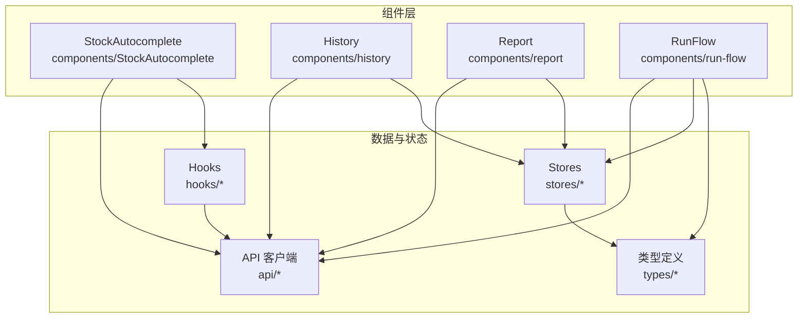
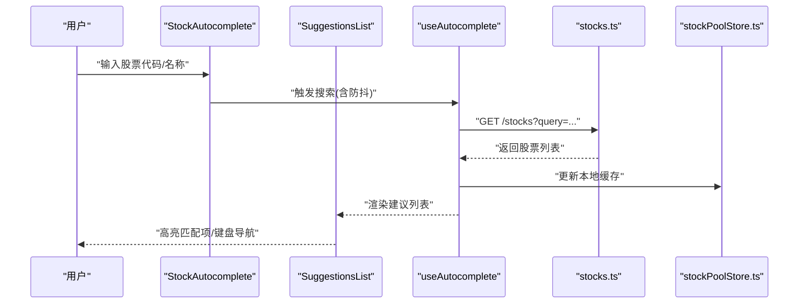
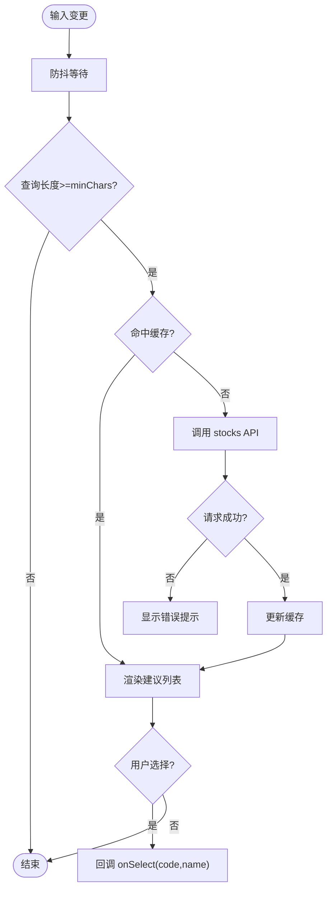
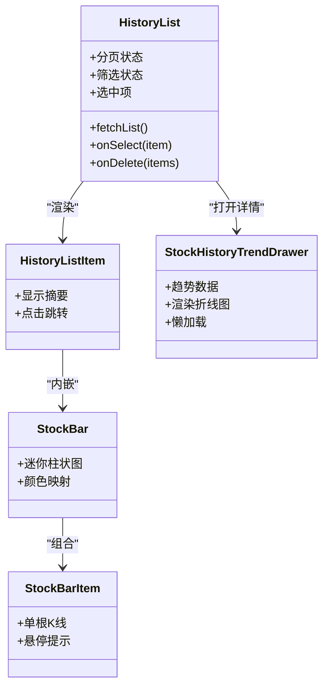
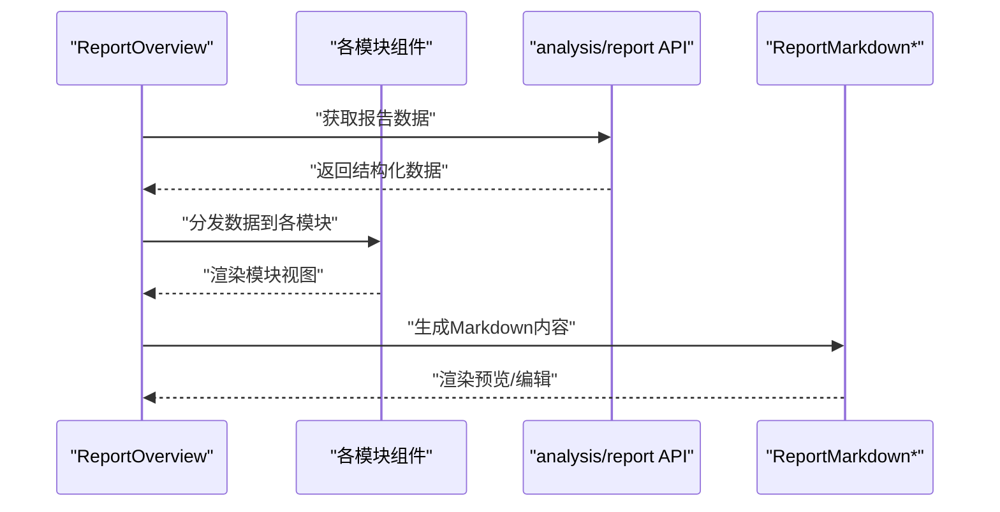
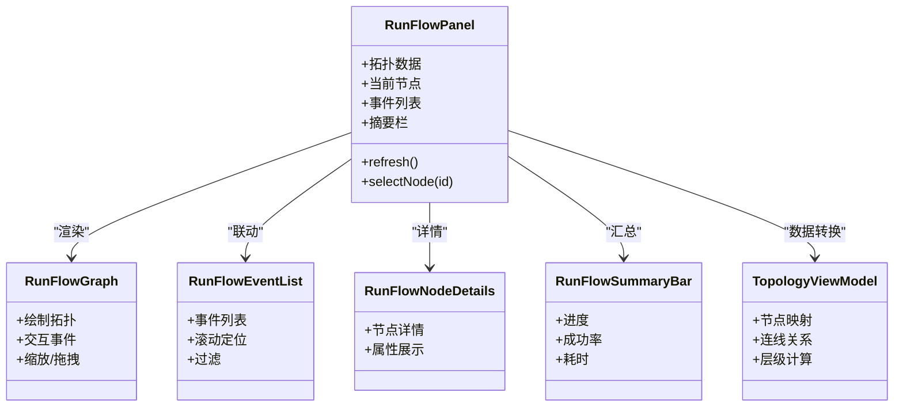
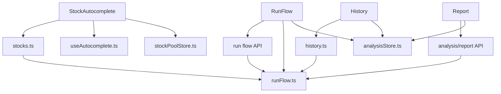

# 业务组件

<cite>
**本文引用的文件**   
- [StockAutocomplete.tsx](file://apps/dsa-web/src/components/StockAutocomplete/StockAutocomplete.tsx)
- [SuggestionsList.tsx](file://apps/dsa-web/src/components/StockAutocomplete/SuggestionsList.tsx)
- [index.ts](file://apps/dsa-web/src/components/StockAutocomplete/index.ts)
- [useAutocomplete.ts](file://apps/dsa-web/src/hooks/useAutocomplete.ts)
- [stocks.ts](file://apps/dsa-web/src/api/stocks.ts)
- [history.ts](file://apps/dsa-web/src/api/history.ts)
- [HistoryList.tsx](file://apps/dsa-web/src/components/history/HistoryList.tsx)
- [HistoryListItem.tsx](file://apps/dsa-web/src/components/history/HistoryListItem.tsx)
- [StockBar.tsx](file://apps/dsa-web/src/components/history/StockBar.tsx)
- [StockBarItem.tsx](file://apps/dsa-web/src/components/history/StockBarItem.tsx)
- [StockHistoryTrendDrawer.tsx](file://apps/dsa-web/src/components/history/StockHistoryTrendDrawer.tsx)
- [index.ts](file://apps/dsa-web/src/components/history/index.ts)
- [ReportOverview.tsx](file://apps/dsa-web/src/components/report/ReportOverview.tsx)
- [ReportStrategy.tsx](file://apps/dsa-web/src/components/report/ReportStrategy.tsx)
- [ReportDecisionSignals.tsx](file://apps/dsa-web/src/components/report/ReportDecisionSignals.tsx)
- [ReportNews.tsx](file://apps/dsa-web/src/components/report/ReportNews.tsx)
- [ReportMarkdown.tsx](file://apps/dsa-web/src/components/report/ReportMarkdown.tsx)
- [ReportMarkdownBody.tsx](file://apps/dsa-web/src/components/report/ReportMarkdownBody.tsx)
- [ReportMarkdownPanel.tsx](file://apps/dsa-web/src/components/report/ReportMarkdownPanel.tsx)
- [ReportMarkdownDrawer.tsx](file://apps/dsa-web/src/components/report/ReportMarkdownDrawer.tsx)
- [ReportBacktestSummary.tsx](file://apps/dsa-web/src/components/report/ReportBacktestSummary.tsx)
- [ReportDiagnostics.tsx](file://apps/dsa-web/src/components/report/ReportDiagnostics.tsx)
- [AnalysisContextSummary.tsx](file://apps/dsa-web/src/components/report/AnalysisContextSummary.tsx)
- [MarketReviewReportView.tsx](file://apps/dsa-web/src/components/report/MarketReviewReportView.tsx)
- [index.ts](file://apps/dsa-web/src/components/report/index.ts)
- [RunFlowPanel.tsx](file://apps/dsa-web/src/components/run-flow/RunFlowPanel.tsx)
- [RunFlowGraph.tsx](file://apps/dsa-web/src/components/run-flow/RunFlowGraph.tsx)
- [RunFlowEventList.tsx](file://apps/dsa-web/src/components/run-flow/RunFlowEventList.tsx)
- [RunFlowNodeDetails.tsx](file://apps/dsa-web/src/components/run-flow/RunFlowNodeDetails.tsx)
- [RunFlowSummaryBar.tsx](file://apps/dsa-web/src/components/run-flow/RunFlowSummaryBar.tsx)
- [topologyViewModel.ts](file://apps/dsa-web/src/components/run-flow/topologyViewModel.ts)
- [utils.ts](file://apps/dsa-web/src/components/run-flow/utils.ts)
- [index.ts](file://apps/dsa-web/src/components/run-flow/index.ts)
- [runFlow.ts](file://apps/dsa-web/src/types/runFlow.ts)
- [analysisStore.ts](file://apps/dsa-web/src/stores/analysisStore.ts)
- [stockPoolStore.ts](file://apps/dsa-web/src/stores/stockPoolStore.ts)
- [error.ts](file://apps/dsa-web/src/api/error.ts)
- [ApiErrorAlert.tsx](file://apps/dsa-web/src/components/common/ApiErrorAlert.tsx)
</cite>

## 目录
1. [简介](#简介)
2. [项目结构](#项目结构)
3. [核心组件](#核心组件)
4. [架构总览](#架构总览)
5. [详细组件分析](#详细组件分析)
6. [依赖关系分析](#依赖关系分析)
7. [性能考虑](#性能考虑)
8. [故障排查指南](#故障排查指南)
9. [结论](#结论)
10. [附录](#附录)

## 简介
本文件面向业务相关的前端组件，系统性梳理并文档化以下四个关键能力：
- StockAutocomplete 股票自动完成
- History 历史记录
- Report 报告生成与展示
- RunFlow 运行流程可视化与交互

内容覆盖各组件的业务逻辑、数据处理、用户交互模式、状态管理、异步数据获取与错误处理机制，并提供扩展方法与自定义配置选项，帮助读者在实际业务场景中高效集成与二次开发。

## 项目结构
围绕上述四个业务组件，前端代码主要位于 apps/dsa-web/src 下，按功能域组织为 components、hooks、api、stores、types 等目录。下图展示了这些目录与组件的对应关系及调用方向。

图表来源
- [StockAutocomplete.tsx](file://apps/dsa-web/src/components/StockAutocomplete/StockAutocomplete.tsx)
- [HistoryList.tsx](file://apps/dsa-web/src/components/history/HistoryList.tsx)
- [ReportOverview.tsx](file://apps/dsa-web/src/components/report/ReportOverview.tsx)
- [RunFlowPanel.tsx](file://apps/dsa-web/src/components/run-flow/RunFlowPanel.tsx)
- [stocks.ts](file://apps/dsa-web/src/api/stocks.ts)
- [history.ts](file://apps/dsa-web/src/api/history.ts)
- [analysisStore.ts](file://apps/dsa-web/src/stores/analysisStore.ts)
- [stockPoolStore.ts](file://apps/dsa-web/src/stores/stockPoolStore.ts)
- [runFlow.ts](file://apps/dsa-web/src/types/runFlow.ts)
- [useAutocomplete.ts](file://apps/dsa-web/src/hooks/useAutocomplete.ts)

章节来源
- [StockAutocomplete.tsx](file://apps/dsa-web/src/components/StockAutocomplete/StockAutocomplete.tsx)
- [HistoryList.tsx](file://apps/dsa-web/src/components/history/HistoryList.tsx)
- [ReportOverview.tsx](file://apps/dsa-web/src/components/report/ReportOverview.tsx)
- [RunFlowPanel.tsx](file://apps/dsa-web/src/components/run-flow/RunFlowPanel.tsx)
- [stocks.ts](file://apps/dsa-web/src/api/stocks.ts)
- [history.ts](file://apps/dsa-web/src/api/history.ts)
- [analysisStore.ts](file://apps/dsa-web/src/stores/analysisStore.ts)
- [stockPoolStore.ts](file://apps/dsa-web/src/stores/stockPoolStore.ts)
- [runFlow.ts](file://apps/dsa-web/src/types/runFlow.ts)
- [useAutocomplete.ts](file://apps/dsa-web/src/hooks/useAutocomplete.ts)

## 核心组件
本节对四个业务组件进行概览性说明，后续章节将深入每个组件的实现细节、数据流与交互流程。

- StockAutocomplete 股票自动完成
  - 职责：根据用户输入实时检索股票列表，提供高亮建议与键盘导航。
  - 数据来源：通过 stocks API 接口查询；本地缓存与去抖优化。
  - 状态管理：使用 useAutocomplete hook 封装搜索状态、加载态、错误态与结果集。
  - 交互模式：输入框聚焦、防抖请求、下拉列表选择、键盘上下键与回车确认。

- History 历史记录
  - 职责：展示历史分析记录，支持分页、筛选、详情查看与趋势图预览。
  - 数据来源：history API 接口；本地 store 缓存最近记录。
  - 状态管理：列表页状态（分页、排序）、选中项状态、抽屉展开状态。
  - 交互模式：点击条目查看详情、侧边抽屉展示趋势图、批量操作。

- Report 报告生成与展示
  - 职责：聚合多维度数据（概览、策略、决策信号、新闻、回测摘要、诊断）并以 Markdown 或结构化视图呈现。
  - 数据来源：analysis 与 report 相关 API；上下文摘要与策略配置。
  - 状态管理：报告构建进度、渲染状态、语言切换、Markdown 面板开关。
  - 交互模式：Tab 切换模块、Markdown 预览/编辑、导出与分享。

- RunFlow 运行流程
  - 职责：可视化执行拓扑，展示节点状态、事件流与汇总信息。
  - 数据来源：run flow API；拓扑视图模型转换。
  - 状态管理：拓扑数据、当前节点详情、事件列表滚动、摘要栏更新。
  - 交互模式：节点点击查看详情、事件过滤、时间线回放。

章节来源
- [StockAutocomplete.tsx](file://apps/dsa-web/src/components/StockAutocomplete/StockAutocomplete.tsx)
- [SuggestionsList.tsx](file://apps/dsa-web/src/components/StockAutocomplete/SuggestionsList.tsx)
- [useAutocomplete.ts](file://apps/dsa-web/src/hooks/useAutocomplete.ts)
- [stocks.ts](file://apps/dsa-web/src/api/stocks.ts)
- [HistoryList.tsx](file://apps/dsa-web/src/components/history/HistoryList.tsx)
- [HistoryListItem.tsx](file://apps/dsa-web/src/components/history/HistoryListItem.tsx)
- [StockBar.tsx](file://apps/dsa-web/src/components/history/StockBar.tsx)
- [StockBarItem.tsx](file://apps/dsa-web/src/components/history/StockBarItem.tsx)
- [StockHistoryTrendDrawer.tsx](file://apps/dsa-web/src/components/history/StockHistoryTrendDrawer.tsx)
- [ReportOverview.tsx](file://apps/dsa-web/src/components/report/ReportOverview.tsx)
- [ReportStrategy.tsx](file://apps/dsa-web/src/components/report/ReportStrategy.tsx)
- [ReportDecisionSignals.tsx](file://apps/dsa-web/src/components/report/ReportDecisionSignals.tsx)
- [ReportNews.tsx](file://apps/dsa-web/src/components/report/ReportNews.tsx)
- [ReportMarkdown.tsx](file://apps/dsa-web/src/components/report/ReportMarkdown.tsx)
- [ReportMarkdownBody.tsx](file://apps/dsa-web/src/components/report/ReportMarkdownBody.tsx)
- [ReportMarkdownPanel.tsx](file://apps/dsa-web/src/components/report/ReportMarkdownPanel.tsx)
- [ReportMarkdownDrawer.tsx](file://apps/dsa-web/src/components/report/ReportMarkdownDrawer.tsx)
- [ReportBacktestSummary.tsx](file://apps/dsa-web/src/components/report/ReportBacktestSummary.tsx)
- [ReportDiagnostics.tsx](file://apps/dsa-web/src/components/report/ReportDiagnostics.tsx)
- [AnalysisContextSummary.tsx](file://apps/dsa-web/src/components/report/AnalysisContextSummary.tsx)
- [MarketReviewReportView.tsx](file://apps/dsa-web/src/components/report/MarketReviewReportView.tsx)
- [RunFlowPanel.tsx](file://apps/dsa-web/src/components/run-flow/RunFlowPanel.tsx)
- [RunFlowGraph.tsx](file://apps/dsa-web/src/components/run-flow/RunFlowGraph.tsx)
- [RunFlowEventList.tsx](file://apps/dsa-web/src/components/run-flow/RunFlowEventList.tsx)
- [RunFlowNodeDetails.tsx](file://apps/dsa-web/src/components/run-flow/RunFlowNodeDetails.tsx)
- [RunFlowSummaryBar.tsx](file://apps/dsa-web/src/components/run-flow/RunFlowSummaryBar.tsx)
- [topologyViewModel.ts](file://apps/dsa-web/src/components/run-flow/topologyViewModel.ts)
- [utils.ts](file://apps/dsa-web/src/components/run-flow/utils.ts)
- [runFlow.ts](file://apps/dsa-web/src/types/runFlow.ts)

## 架构总览
下图展示了四个业务组件与 API、Store、Hook 以及类型定义的交互关系，体现数据从后端到前端的完整链路。

图表来源
- [StockAutocomplete.tsx](file://apps/dsa-web/src/components/StockAutocomplete/StockAutocomplete.tsx)
- [SuggestionsList.tsx](file://apps/dsa-web/src/components/StockAutocomplete/SuggestionsList.tsx)
- [useAutocomplete.ts](file://apps/dsa-web/src/hooks/useAutocomplete.ts)
- [stocks.ts](file://apps/dsa-web/src/api/stocks.ts)
- [stockPoolStore.ts](file://apps/dsa-web/src/stores/stockPoolStore.ts)

章节来源
- [StockAutocomplete.tsx](file://apps/dsa-web/src/components/StockAutocomplete/StockAutocomplete.tsx)
- [useAutocomplete.ts](file://apps/dsa-web/src/hooks/useAutocomplete.ts)
- [stocks.ts](file://apps/dsa-web/src/api/stocks.ts)
- [stockPoolStore.ts](file://apps/dsa-web/src/stores/stockPoolStore.ts)

## 详细组件分析

### StockAutocomplete 股票自动完成
- 业务逻辑
  - 输入监听与防抖：避免频繁请求，提升响应速度。
  - 搜索策略：支持按代码、名称模糊匹配；可结合本地索引加速。
  - 结果排序：优先匹配开头，其次包含匹配；按热度或字母序排序。
- 数据处理
  - 统一通过 stocks API 获取；失败时降级为空列表或提示。
  - 本地缓存最近搜索结果，减少重复请求。
- 用户交互
  - 下拉列表支持鼠标点击与键盘上下/回车选择。
  - 高亮匹配片段，便于快速识别。
- 状态管理
  - 使用 useAutocomplete hook 管理 query、loading、error、results、selectedIndex 等状态。
  - 与 stockPoolStore 同步缓存，保证跨组件一致性。
- 错误处理
  - 网络异常、超时、服务端错误均捕获并显示 ApiErrorAlert。
  - 空结果时给出友好提示。
- 扩展方法
  - 自定义匹配规则：在 suggestions 生成阶段注入过滤器。
  - 自定义渲染：替换 SuggestionsList 的子项渲染逻辑。
  - 自定义缓存策略：调整 TTL、最大条目数。
- 配置选项
  - debounceMs：防抖延迟
  - minChars：最小触发字符数
  - maxResults：最大建议条数
  - cacheEnabled：是否启用本地缓存
  - renderSuggestion：自定义建议项渲染函数

图表来源
- [StockAutocomplete.tsx](file://apps/dsa-web/src/components/StockAutocomplete/StockAutocomplete.tsx)
- [SuggestionsList.tsx](file://apps/dsa-web/src/components/StockAutocomplete/SuggestionsList.tsx)
- [useAutocomplete.ts](file://apps/dsa-web/src/hooks/useAutocomplete.ts)
- [stocks.ts](file://apps/dsa-web/src/api/stocks.ts)
- [stockPoolStore.ts](file://apps/dsa-web/src/stores/stockPoolStore.ts)

章节来源
- [StockAutocomplete.tsx](file://apps/dsa-web/src/components/StockAutocomplete/StockAutocomplete.tsx)
- [SuggestionsList.tsx](file://apps/dsa-web/src/components/StockAutocomplete/SuggestionsList.tsx)
- [useAutocomplete.ts](file://apps/dsa-web/src/hooks/useAutocomplete.ts)
- [stocks.ts](file://apps/dsa-web/src/api/stocks.ts)
- [stockPoolStore.ts](file://apps/dsa-web/src/stores/stockPoolStore.ts)

### History 历史记录
- 业务逻辑
  - 列表分页与筛选：支持按时间、标的、状态筛选。
  - 详情查看：点击条目打开详情抽屉，展示趋势图与关键指标。
  - 批量操作：多选删除、导出。
- 数据处理
  - 通过 history API 拉取列表与详情；本地 store 缓存最近记录。
  - 趋势图数据按需懒加载，减少首屏压力。
- 用户交互
  - 列表项点击、抽屉展开/收起、趋势图缩放与平移。
  - 键盘快捷键支持翻页与筛选重置。
- 状态管理
  - HistoryList 管理分页、筛选、选中项。
  - StockHistoryTrendDrawer 管理趋势数据加载与渲染。
- 错误处理
  - 列表加载失败重试；详情加载失败提示。
  - 趋势图渲染异常降级为静态图或占位符。
- 扩展方法
  - 自定义筛选条件：扩展筛选表单与查询参数。
  - 自定义详情视图：替换趋势图组件或增加新指标。
- 配置选项
  - pageSize：每页条数
  - defaultSort：默认排序字段与方向
  - enableTrend：是否启用趋势图
  - trendInterval：趋势数据时间粒度

图表来源
- [HistoryList.tsx](file://apps/dsa-web/src/components/history/HistoryList.tsx)
- [HistoryListItem.tsx](file://apps/dsa-web/src/components/history/HistoryListItem.tsx)
- [StockBar.tsx](file://apps/dsa-web/src/components/history/StockBar.tsx)
- [StockBarItem.tsx](file://apps/dsa-web/src/components/history/StockBarItem.tsx)
- [StockHistoryTrendDrawer.tsx](file://apps/dsa-web/src/components/history/StockHistoryTrendDrawer.tsx)

章节来源
- [HistoryList.tsx](file://apps/dsa-web/src/components/history/HistoryList.tsx)
- [HistoryListItem.tsx](file://apps/dsa-web/src/components/history/HistoryListItem.tsx)
- [StockBar.tsx](file://apps/dsa-web/src/components/history/StockBar.tsx)
- [StockBarItem.tsx](file://apps/dsa-web/src/components/history/StockBarItem.tsx)
- [StockHistoryTrendDrawer.tsx](file://apps/dsa-web/src/components/history/StockHistoryTrendDrawer.tsx)

### Report 报告生成与展示
- 业务逻辑
  - 多模块聚合：概览、策略、决策信号、新闻、回测摘要、诊断。
  - Markdown 渲染：支持主题切换、语言切换、面板/抽屉模式。
  - 上下文摘要：基于分析上下文生成报告骨架。
- 数据处理
  - 通过 analysis 与 report 相关 API 获取数据；失败时降级为部分数据。
  - Markdown 内容预处理与转义，确保安全渲染。
- 用户交互
  - Tab 切换模块；Markdown 预览/编辑；导出 PDF/文本。
  - 语言切换影响文案与日期格式。
- 状态管理
  - 报告构建进度与渲染状态；Markdown 面板开关；语言上下文。
- 错误处理
  - 模块加载失败显示占位与重试按钮。
  - Markdown 渲染异常回退到纯文本。
- 扩展方法
  - 新增报告模块：实现独立子组件并注册到主容器。
  - 自定义 Markdown 插件：扩展语法与样式。
- 配置选项
  - modules：启用的模块集合
  - markdownTheme：主题名
  - language：报告语言
  - exportFormats：支持的导出格式

图表来源
- [ReportOverview.tsx](file://apps/dsa-web/src/components/report/ReportOverview.tsx)
- [ReportStrategy.tsx](file://apps/dsa-web/src/components/report/ReportStrategy.tsx)
- [ReportDecisionSignals.tsx](file://apps/dsa-web/src/components/report/ReportDecisionSignals.tsx)
- [ReportNews.tsx](file://apps/dsa-web/src/components/report/ReportNews.tsx)
- [ReportMarkdown.tsx](file://apps/dsa-web/src/components/report/ReportMarkdown.tsx)
- [ReportMarkdownBody.tsx](file://apps/dsa-web/src/components/report/ReportMarkdownBody.tsx)
- [ReportMarkdownPanel.tsx](file://apps/dsa-web/src/components/report/ReportMarkdownPanel.tsx)
- [ReportMarkdownDrawer.tsx](file://apps/dsa-web/src/components/report/ReportMarkdownDrawer.tsx)
- [ReportBacktestSummary.tsx](file://apps/dsa-web/src/components/report/ReportBacktestSummary.tsx)
- [ReportDiagnostics.tsx](file://apps/dsa-web/src/components/report/ReportDiagnostics.tsx)
- [AnalysisContextSummary.tsx](file://apps/dsa-web/src/components/report/AnalysisContextSummary.tsx)
- [MarketReviewReportView.tsx](file://apps/dsa-web/src/components/report/MarketReviewReportView.tsx)

章节来源
- [ReportOverview.tsx](file://apps/dsa-web/src/components/report/ReportOverview.tsx)
- [ReportMarkdown.tsx](file://apps/dsa-web/src/components/report/ReportMarkdown.tsx)
- [ReportMarkdownBody.tsx](file://apps/dsa-web/src/components/report/ReportMarkdownBody.tsx)
- [ReportMarkdownPanel.tsx](file://apps/dsa-web/src/components/report/ReportMarkdownPanel.tsx)
- [ReportMarkdownDrawer.tsx](file://apps/dsa-web/src/components/report/ReportMarkdownDrawer.tsx)
- [AnalysisContextSummary.tsx](file://apps/dsa-web/src/components/report/AnalysisContextSummary.tsx)
- [MarketReviewReportView.tsx](file://apps/dsa-web/src/components/report/MarketReviewReportView.tsx)

### RunFlow 运行流程
- 业务逻辑
  - 拓扑可视化：节点状态、连线关系、层级布局。
  - 事件流：节点事件顺序、时间线回放、过滤与搜索。
  - 摘要信息：整体进度、成功率、耗时统计。
- 数据处理
  - 通过 run flow API 获取拓扑与事件；本地转换为视图模型。
  - 增量更新：仅刷新变化节点与事件。
- 用户交互
  - 节点点击查看详情；事件列表滚动定位；摘要栏实时更新。
  - 支持缩放、拖拽、全屏模式。
- 状态管理
  - topologyViewModel 管理拓扑数据与视图映射。
  - RunFlowPanel 管理当前节点、事件列表、摘要状态。
- 错误处理
  - 拓扑加载失败重试；事件流中断恢复。
  - 节点详情缺失时显示占位。
- 扩展方法
  - 自定义节点渲染：实现节点详情组件并注册。
  - 自定义事件处理器：扩展事件类型与行为。
- 配置选项
  - layout：布局算法
  - nodeRender：节点渲染函数
  - eventFilter：事件过滤规则
  - autoRefresh：是否自动刷新

图表来源
- [RunFlowPanel.tsx](file://apps/dsa-web/src/components/run-flow/RunFlowPanel.tsx)
- [RunFlowGraph.tsx](file://apps/dsa-web/src/components/run-flow/RunFlowGraph.tsx)
- [RunFlowEventList.tsx](file://apps/dsa-web/src/components/run-flow/RunFlowEventList.tsx)
- [RunFlowNodeDetails.tsx](file://apps/dsa-web/src/components/run-flow/RunFlowNodeDetails.tsx)
- [RunFlowSummaryBar.tsx](file://apps/dsa-web/src/components/run-flow/RunFlowSummaryBar.tsx)
- [topologyViewModel.ts](file://apps/dsa-web/src/components/run-flow/topologyViewModel.ts)
- [utils.ts](file://apps/dsa-web/src/components/run-flow/utils.ts)
- [runFlow.ts](file://apps/dsa-web/src/types/runFlow.ts)

章节来源
- [RunFlowPanel.tsx](file://apps/dsa-web/src/components/run-flow/RunFlowPanel.tsx)
- [RunFlowGraph.tsx](file://apps/dsa-web/src/components/run-flow/RunFlowGraph.tsx)
- [RunFlowEventList.tsx](file://apps/dsa-web/src/components/run-flow/RunFlowEventList.tsx)
- [RunFlowNodeDetails.tsx](file://apps/dsa-web/src/components/run-flow/RunFlowNodeDetails.tsx)
- [RunFlowSummaryBar.tsx](file://apps/dsa-web/src/components/run-flow/RunFlowSummaryBar.tsx)
- [topologyViewModel.ts](file://apps/dsa-web/src/components/run-flow/topologyViewModel.ts)
- [utils.ts](file://apps/dsa-web/src/components/run-flow/utils.ts)
- [runFlow.ts](file://apps/dsa-web/src/types/runFlow.ts)

## 依赖关系分析
四个业务组件共同依赖 API 层、Store 与 Hook，类型定义贯穿各层。下图展示组件间的依赖与耦合度。

图表来源
- [StockAutocomplete.tsx](file://apps/dsa-web/src/components/StockAutocomplete/StockAutocomplete.tsx)
- [HistoryList.tsx](file://apps/dsa-web/src/components/history/HistoryList.tsx)
- [ReportOverview.tsx](file://apps/dsa-web/src/components/report/ReportOverview.tsx)
- [RunFlowPanel.tsx](file://apps/dsa-web/src/components/run-flow/RunFlowPanel.tsx)
- [stocks.ts](file://apps/dsa-web/src/api/stocks.ts)
- [history.ts](file://apps/dsa-web/src/api/history.ts)
- [analysisStore.ts](file://apps/dsa-web/src/stores/analysisStore.ts)
- [stockPoolStore.ts](file://apps/dsa-web/src/stores/stockPoolStore.ts)
- [runFlow.ts](file://apps/dsa-web/src/types/runFlow.ts)

章节来源
- [stocks.ts](file://apps/dsa-web/src/api/stocks.ts)
- [history.ts](file://apps/dsa-web/src/api/history.ts)
- [analysisStore.ts](file://apps/dsa-web/src/stores/analysisStore.ts)
- [stockPoolStore.ts](file://apps/dsa-web/src/stores/stockPoolStore.ts)
- [runFlow.ts](file://apps/dsa-web/src/types/runFlow.ts)

## 性能考虑
- 防抖与节流：StockAutocomplete 使用防抖减少请求频率；RunFlow 事件列表采用虚拟滚动。
- 懒加载：History 趋势图与 Report 模块按需加载，降低首屏体积。
- 缓存策略：本地缓存股票索引与分析结果，设置合理 TTL。
- 增量更新：RunFlow 仅刷新变化节点与事件，避免全量重绘。
- 渲染优化：React.memo、useMemo、useCallback 合理使用，减少不必要重渲染。

## 故障排查指南
- 常见问题
  - 自动完成无结果：检查 query 长度、网络状态、API 返回格式。
  - 历史记录加载失败：检查分页参数、权限、后端服务可用性。
  - 报告渲染空白：检查 Markdown 内容合法性、主题配置、语言设置。
  - RunFlow 拓扑不更新：检查事件流完整性、拓扑数据版本、自动刷新开关。
- 错误处理
  - 统一使用 ApiErrorAlert 展示错误；记录错误上下文与堆栈。
  - 重试机制：指数退避、最大重试次数、熔断保护。
- 调试技巧
  - 开启网络日志与组件状态快照。
  - 使用浏览器开发者工具断点调试 Hook 与 Store。
  - 模拟错误场景验证降级路径。

章节来源
- [error.ts](file://apps/dsa-web/src/api/error.ts)
- [ApiErrorAlert.tsx](file://apps/dsa-web/src/components/common/ApiErrorAlert.tsx)

## 结论
StockAutocomplete、History、Report、RunFlow 四个业务组件构成了股票分析平台的核心交互与数据展示能力。通过清晰的职责划分、健壮的状态管理与完善的错误处理，它们能够在复杂业务场景中稳定运行。扩展方法与自定义配置为二次开发提供了灵活空间，建议在实际使用中结合业务需求进行定制与优化。

## 附录
- 使用示例
  - 股票自动完成：在搜索框中集成 StockAutocomplete，配置 debounceMs、minChars、maxResults，并在 onSelect 回调中处理选择结果。
  - 历史记录：在页面中引入 HistoryList，配置 pageSize、defaultSort、enableTrend，并监听 onSelect 事件打开详情抽屉。
  - 报告生成：在报表页面中引入 ReportOverview，配置 modules、markdownTheme、language，并实现导出功能。
  - 运行流程：在监控页面中引入 RunFlowPanel，配置 layout、nodeRender、eventFilter、autoRefresh，并订阅事件更新。
- 最佳实践
  - 统一错误处理与日志记录。
  - 合理使用缓存与懒加载。
  - 保持组件间低耦合，通过 Props 与 Context 传递数据。
  - 编写单元测试与端到端测试，确保稳定性。