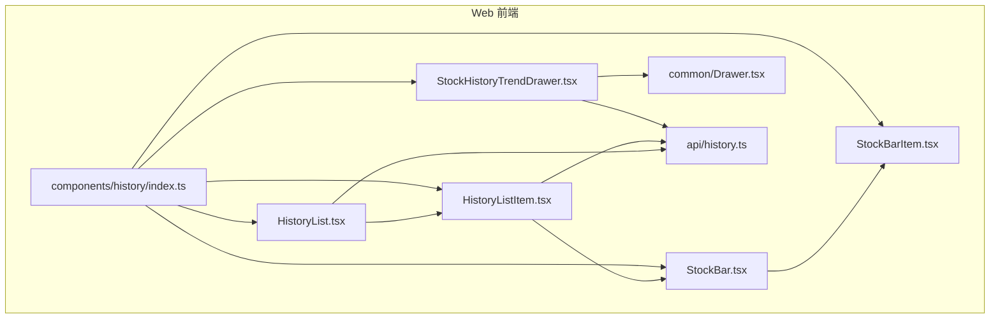
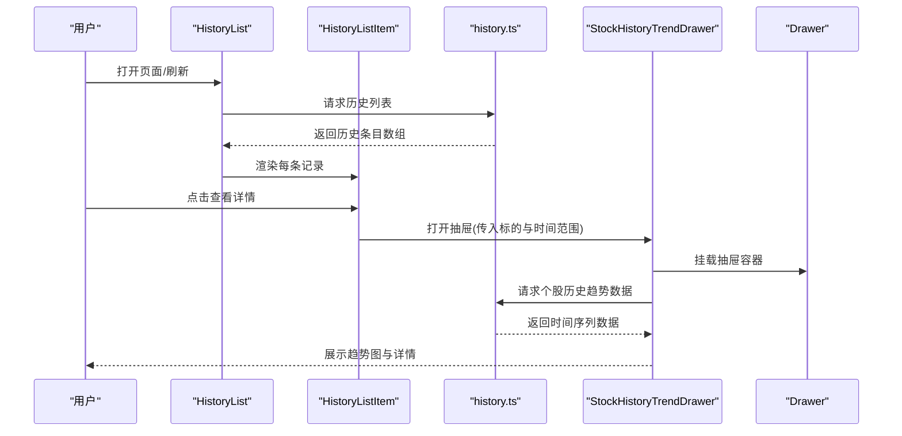
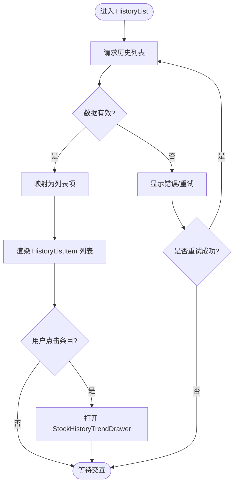
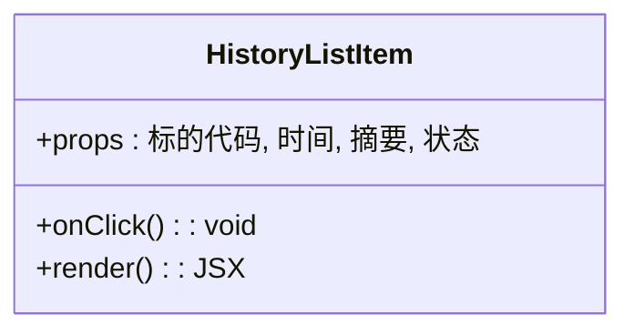
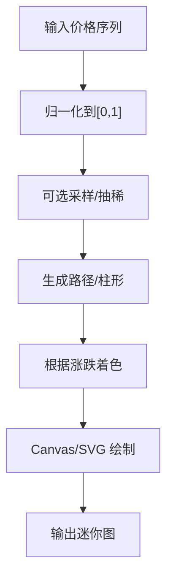
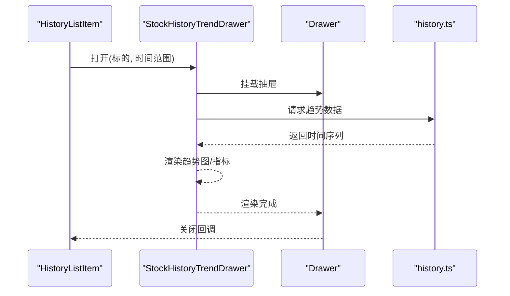
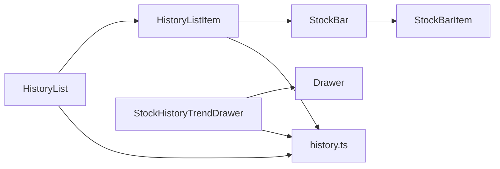

# 历史记录组件

<cite>
**本文引用的文件**   
- [HistoryList.tsx](file://apps/dsa-web/src/components/history/HistoryList.tsx)
- [HistoryListItem.tsx](file://apps/dsa-web/src/components/history/HistoryListItem.tsx)
- [StockBar.tsx](file://apps/dsa-web/src/components/history/StockBar.tsx)
- [StockBarItem.tsx](file://apps/dsa-web/src/components/history/StockBarItem.tsx)
- [StockHistoryTrendDrawer.tsx](file://apps/dsa-web/src/components/history/StockHistoryTrendDrawer.tsx)
- [history.ts](file://apps/dsa-web/src/api/history.ts)
- [Drawer.tsx](file://apps/dsa-web/src/components/common/Drawer.tsx)
- [index.ts](file://apps/dsa-web/src/components/history/index.ts)
</cite>

## 目录
1. [简介](#简介)
2. [项目结构](#项目结构)
3. [核心组件](#核心组件)
4. [架构总览](#架构总览)
5. [详细组件分析](#详细组件分析)
6. [依赖关系分析](#依赖关系分析)
7. [性能考虑](#性能考虑)
8. [故障排查指南](#故障排查指南)
9. [结论](#结论)
10. [附录：使用示例与最佳实践](#附录使用示例与最佳实践)

## 简介
本章节面向“历史记录”相关的前端组件，系统性说明 HistoryList、HistoryListItem、StockBar、StockBarItem 与 StockHistoryTrendDrawer 的功能与实现要点。内容覆盖历史数据的展示逻辑、图表渲染机制（趋势图）、抽屉式详情查看交互，以及配置、事件处理与数据更新流程。同时提供性能优化、虚拟滚动与响应式设计的最佳实践建议，帮助读者在复杂数据场景下获得流畅体验。

## 项目结构
历史记录组件位于 Web 前端应用的 components/history 目录下，配套 API 调用封装位于 api/history.ts，通用抽屉容器由 common/Drawer.tsx 提供。整体组织遵循“按功能域划分”的组件目录策略，便于复用与维护。



**图示来源** 
- [HistoryList.tsx](file://apps/dsa-web/src/components/history/HistoryList.tsx)
- [HistoryListItem.tsx](file://apps/dsa-web/src/components/history/HistoryListItem.tsx)
- [StockBar.tsx](file://apps/dsa-web/src/components/history/StockBar.tsx)
- [StockBarItem.tsx](file://apps/dsa-web/src/components/history/StockBarItem.tsx)
- [StockHistoryTrendDrawer.tsx](file://apps/dsa-web/src/components/history/StockHistoryTrendDrawer.tsx)
- [history.ts](file://apps/dsa-web/src/api/history.ts)
- [Drawer.tsx](file://apps/dsa-web/src/components/common/Drawer.tsx)
- [index.ts](file://apps/dsa-web/src/components/history/index.ts)

**章节来源**
- [HistoryList.tsx](file://apps/dsa-web/src/components/history/HistoryList.tsx)
- [HistoryListItem.tsx](file://apps/dsa-web/src/components/history/HistoryListItem.tsx)
- [StockBar.tsx](file://apps/dsa-web/src/components/history/StockBar.tsx)
- [StockBarItem.tsx](file://apps/dsa-web/src/components/history/StockBarItem.tsx)
- [StockHistoryTrendDrawer.tsx](file://apps/dsa-web/src/components/history/StockHistoryTrendDrawer.tsx)
- [history.ts](file://apps/dsa-web/src/api/history.ts)
- [Drawer.tsx](file://apps/dsa-web/src/components/common/Drawer.tsx)
- [index.ts](file://apps/dsa-web/src/components/history/index.ts)

## 核心组件
- HistoryList：负责加载并渲染历史列表，管理分页/筛选状态，协调子项渲染与抽屉打开行为。
- HistoryListItem：单条历史记录的展示单元，包含股票名称、时间、摘要等关键信息，并触发详情抽屉。
- StockBar：用于在列表或卡片中展示某只股票的短期走势概览（迷你折线/柱状）。
- StockBarItem：StockBar 的数据点/区间渲染单元，负责数值映射、颜色与尺寸计算。
- StockHistoryTrendDrawer：基于 Drawer 的抽屉式详情面板，承载个股历史趋势图与详细信息。

**章节来源**
- [HistoryList.tsx](file://apps/dsa-web/src/components/history/HistoryList.tsx)
- [HistoryListItem.tsx](file://apps/dsa-web/src/components/history/HistoryListItem.tsx)
- [StockBar.tsx](file://apps/dsa-web/src/components/history/StockBar.tsx)
- [StockBarItem.tsx](file://apps/dsa-web/src/components/history/StockBarItem.tsx)
- [StockHistoryTrendDrawer.tsx](file://apps/dsa-web/src/components/history/StockHistoryTrendDrawer.tsx)

## 架构总览
下图展示了从用户操作到数据获取、渲染与详情展示的完整链路。HistoryList 通过 API 层拉取历史数据，HistoryListItem 负责单项渲染并触发 StockHistoryTrendDrawer；后者借助 Drawer 容器以侧滑方式呈现个股历史趋势图。



**图示来源** 
- [HistoryList.tsx](file://apps/dsa-web/src/components/history/HistoryList.tsx)
- [HistoryListItem.tsx](file://apps/dsa-web/src/components/history/HistoryListItem.tsx)
- [history.ts](file://apps/dsa-web/src/api/history.ts)
- [StockHistoryTrendDrawer.tsx](file://apps/dsa-web/src/components/history/StockHistoryTrendDrawer.tsx)
- [Drawer.tsx](file://apps/dsa-web/src/components/common/Drawer.tsx)

## 详细组件分析

### HistoryList
- 职责
  - 聚合历史数据源，维护查询参数（如时间范围、筛选条件、分页）。
  - 控制加载态、错误态与空态展示。
  - 将数据映射为 HistoryListItem 列表，并透传选中项以打开抽屉。
- 数据流
  - 初始化时调用 history.ts 接口获取列表。
  - 用户交互（翻页、筛选）触发重新请求，局部更新列表。
- 渲染策略
  - 长列表建议使用虚拟滚动（见“性能考虑”），按需渲染可见区域。
  - 对异常数据做降级展示（占位骨架屏、错误提示）。
- 交互
  - 点击某条目打开 StockHistoryTrendDrawer，传递标的代码、时间窗口等上下文。



**图示来源** 
- [HistoryList.tsx](file://apps/dsa-web/src/components/history/HistoryList.tsx)
- [history.ts](file://apps/dsa-web/src/api/history.ts)

**章节来源**
- [HistoryList.tsx](file://apps/dsa-web/src/components/history/HistoryList.tsx)

### HistoryListItem
- 职责
  - 展示单条历史记录的标题、时间、摘要、状态等元信息。
  - 提供点击行为，向父级回调打开详情抽屉。
- 样式与可访问性
  - 高亮当前选中项，键盘导航支持。
  - 文本截断与多行折叠策略，保证可读性。
- 事件
  - onClick 触发父级打开抽屉，携带标的标识与时间范围。



**图示来源** 
- [HistoryListItem.tsx](file://apps/dsa-web/src/components/history/HistoryListItem.tsx)

**章节来源**
- [HistoryListItem.tsx](file://apps/dsa-web/src/components/history/HistoryListItem.tsx)

### StockBar
- 职责
  - 在有限空间内绘制某只股票的迷你趋势图（折线/面积/柱状）。
  - 根据数据范围自动缩放坐标轴，适配不同屏幕宽度。
- 渲染机制
  - 将原始价格序列归一化到 [0,1] 区间，映射为像素路径。
  - 根据涨跌方向应用主题色（涨/跌/中性）。
- 性能
  - 使用 Canvas/SVG 按需绘制，避免重绘整页。
  - 对大数据量采用抽稀采样（LTTB/Min-Max）减少点数。



**图示来源** 
- [StockBar.tsx](file://apps/dsa-web/src/components/history/StockBar.tsx)

**章节来源**
- [StockBar.tsx](file://apps/dsa-web/src/components/history/StockBar.tsx)

### StockBarItem
- 职责
  - StockBar 的最小渲染单元，负责单个数据点的坐标、尺寸与颜色计算。
  - 处理边界情况（NaN、重复时间戳、缺失值）。
- 算法
  - 线性插值与极值检测，确保视觉连续性。
  - 阈值判断决定涨跌颜色与描边样式。

```mermaid
classDiagram
class StockBarItem {
+props : 索引, 值, 范围
+computePosition() : {x,y,w,h}
+getColor() : string
+render() : JSX
}
```

**图示来源** 
- [StockBarItem.tsx](file://apps/dsa-web/src/components/history/StockBarItem.tsx)

**章节来源**
- [StockBarItem.tsx](file://apps/dsa-web/src/components/history/StockBarItem.tsx)

### StockHistoryTrendDrawer
- 职责
  - 基于 Drawer 的抽屉式详情面板，展示个股历史趋势大图与关键指标。
  - 支持时间范围选择、缩放、十字光标、标注等交互。
- 数据流
  - 打开抽屉后，根据标的与时间范围调用 history.ts 获取时间序列。
  - 数据到达后驱动图表库渲染，失败时回退为错误态。
- 交互
  - 关闭抽屉清理状态，避免内存泄漏。
  - 支持键盘 ESC 关闭与焦点管理。



**图示来源** 
- [StockHistoryTrendDrawer.tsx](file://apps/dsa-web/src/components/history/StockHistoryTrendDrawer.tsx)
- [Drawer.tsx](file://apps/dsa-web/src/components/common/Drawer.tsx)
- [history.ts](file://apps/dsa-web/src/api/history.ts)

**章节来源**
- [StockHistoryTrendDrawer.tsx](file://apps/dsa-web/src/components/history/StockHistoryTrendDrawer.tsx)

## 依赖关系分析
- 组件耦合
  - HistoryList 与 HistoryListItem 为父子关系，通过 props/cb 通信。
  - StockBar 与 StockBarItem 为组合关系，StockBar 聚合多个 StockBarItem。
  - StockHistoryTrendDrawer 依赖 Drawer 作为容器，依赖 history.ts 获取数据。
- 外部依赖
  - 图表渲染可能依赖第三方库（如 Canvas/SVG 绘图或图表库），需关注版本兼容与打包体积。
  - i18n、主题系统通过全局 context 注入，确保多语言与暗色模式一致性。



**图示来源** 
- [HistoryList.tsx](file://apps/dsa-web/src/components/history/HistoryList.tsx)
- [HistoryListItem.tsx](file://apps/dsa-web/src/components/history/HistoryListItem.tsx)
- [StockBar.tsx](file://apps/dsa-web/src/components/history/StockBar.tsx)
- [StockBarItem.tsx](file://apps/dsa-web/src/components/history/StockBarItem.tsx)
- [StockHistoryTrendDrawer.tsx](file://apps/dsa-web/src/components/history/StockHistoryTrendDrawer.tsx)
- [history.ts](file://apps/dsa-web/src/api/history.ts)
- [Drawer.tsx](file://apps/dsa-web/src/components/common/Drawer.tsx)

**章节来源**
- [index.ts](file://apps/dsa-web/src/components/history/index.ts)

## 性能考虑
- 虚拟滚动
  - 对 HistoryList 长列表启用虚拟滚动，仅渲染可视区条目，显著降低 DOM 节点数量与重排开销。
  - 结合固定高度与稳定 key，避免不必要的重渲染。
- 图表渲染优化
  - 对大样本数据进行采样（如 LTTB、Min-Max），减少路径点数。
  - 使用 requestAnimationFrame 分批绘制，避免主线程阻塞。
  - 对 StockBar 使用离屏缓存（OffscreenCanvas）或 SVG path 合并。
- 状态与记忆化
  - 使用 React.memo/useMemo/useCallback 减少子组件重渲染。
  - 对历史数据做不可变更新，避免浅比较失效。
- 网络与缓存
  - 对相同标的+时间范围的请求进行去抖与缓存（内存/本地存储）。
  - 失败重试与超时保护，提升鲁棒性。
- 响应式设计
  - 在小屏设备上隐藏次要信息，保留关键指标与趋势轮廓。
  - 图表自适应宽高，保持纵横比与可读性。

## 故障排查指南
- 常见问题
  - 列表不更新：检查请求参数变化是否触发了重新渲染；确认 key 唯一且稳定。
  - 抽屉无法打开：确认 Drawer 容器已挂载，且打开回调未被拦截。
  - 图表空白：检查数据格式（时间戳、数值类型）、坐标系映射与采样逻辑。
  - 性能卡顿：开启性能面板观察重渲染热点，定位未记忆化的函数或过度渲染的子组件。
- 调试建议
  - 打印关键 props 与 state，核对数据流向。
  - 对 API 层增加日志与错误码映射，快速定位后端问题。
  - 使用浏览器开发者工具的 Performance/Network 面板分析瓶颈。

**章节来源**
- [history.ts](file://apps/dsa-web/src/api/history.ts)
- [Drawer.tsx](file://apps/dsa-web/src/components/common/Drawer.tsx)

## 结论
历史记录组件通过清晰的层次分工与数据流设计，实现了高效的历史数据展示与详情查看。HistoryList 与 HistoryListItem 负责列表与交互，StockBar/StockBarItem 提供轻量趋势预览，StockHistoryTrendDrawer 承载深度分析视图。配合虚拟滚动、采样与记忆化等优化手段，可在大规模数据场景下保持流畅体验。建议在集成时严格校验数据契约、完善错误处理与可访问性，以获得更稳健的用户体验。

## 附录：使用示例与最佳实践
- 配置历史列表
  - 设置默认时间范围、分页大小与筛选条件。
  - 为 HistoryList 提供自定义渲染器（如替换摘要展示）。
- 处理用户交互
  - 监听 HistoryListItem 的点击事件，打开 StockHistoryTrendDrawer。
  - 在抽屉内支持时间范围切换、缩放与导出截图。
- 数据更新
  - 当新增历史条目时，增量更新列表而非全量替换。
  - 对频繁更新的趋势数据采用增量推送或轮询去抖。
- 最佳实践
  - 使用稳定的 key 与不可变数据结构。
  - 对重型渲染进行懒加载与按需加载。
  - 统一错误提示与重试入口，提升可用性。
  - 遵循无障碍规范，确保键盘与读屏友好。