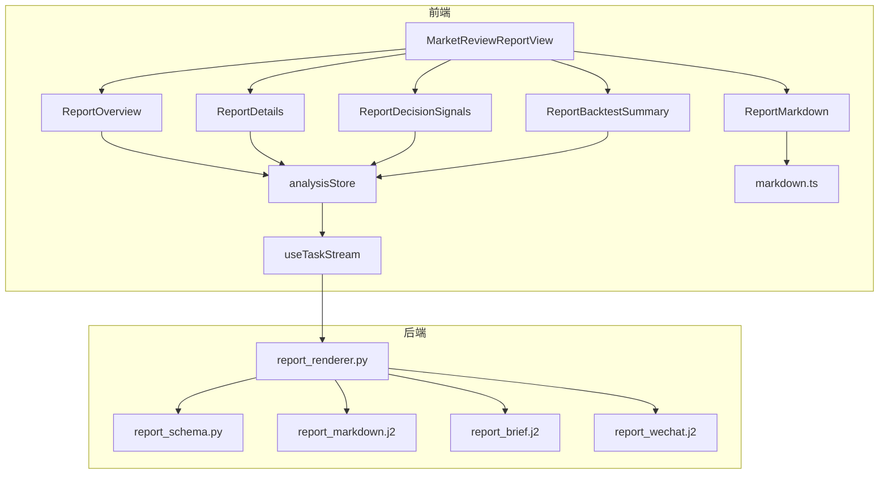
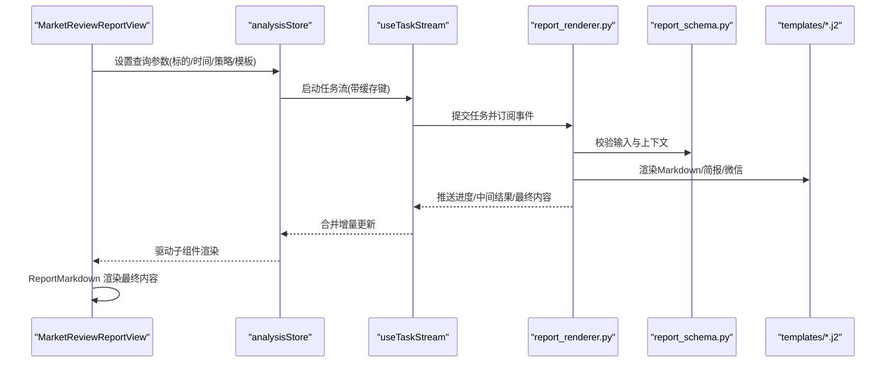
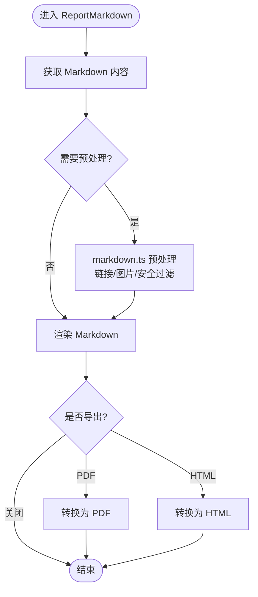
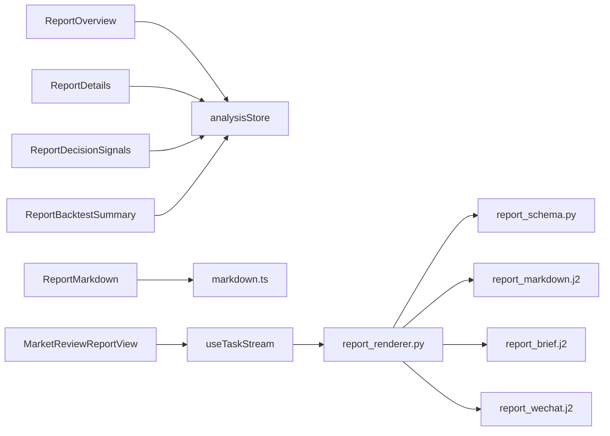

# 报告生成组件

<cite>
**本文引用的文件**   
- [ReportOverview.tsx](file://apps/dsa-web/src/components/report/ReportOverview.tsx)
- [ReportDetails.tsx](file://apps/dsa-web/src/components/report/ReportDetails.tsx)
- [ReportDecisionSignals.tsx](file://apps/dsa-web/src/components/report/ReportDecisionSignals.tsx)
- [ReportBacktestSummary.tsx](file://apps/dsa-web/src/components/report/ReportBacktestSummary.tsx)
- [ReportMarkdown.tsx](file://apps/dsa-web/src/components/report/ReportMarkdown.tsx)
- [ReportMarkdownBody.tsx](file://apps/dsa-web/src/components/report/ReportMarkdownBody.tsx)
- [ReportMarkdownDrawer.tsx](file://apps/dsa-web/src/components/report/ReportMarkdownDrawer.tsx)
- [ReportMarkdownPanel.tsx](file://apps/dsa-web/src/components/report/ReportMarkdownPanel.tsx)
- [MarketReviewReportView.tsx](file://apps/dsa-web/src/components/report/MarketReviewReportView.tsx)
- [report_renderer.py](file://src/services/report_renderer.py)
- [report_schema.py](file://src/schemas/report_schema.py)
- [markdown.ts](file://apps/dsa-web/src/utils/markdown.ts)
- [reportLanguage.ts](file://apps/dsa-web/src/utils/reportLanguage.ts)
- [templates/report_markdown.j2](file://templates/report_markdown.j2)
- [templates/report_brief.j2](file://templates/report_brief.j2)
- [templates/report_wechat.j2](file://templates/report_wechat.j2)
- [analysisStore.ts](file://apps/dsa-web/src/stores/analysisStore.ts)
- [useTaskStream.ts](file://apps/dsa-web/src/hooks/useTaskStream.ts)
- [ApiErrorAlert.tsx](file://apps/dsa-web/src/components/common/ApiErrorAlert.tsx)
</cite>

## 目录
1. [简介](#简介)
2. [项目结构](#项目结构)
3. [核心组件](#核心组件)
4. [架构总览](#架构总览)
5. [详细组件分析](#详细组件分析)
6. [依赖关系分析](#依赖关系分析)
7. [性能考虑](#性能考虑)
8. [故障排查指南](#故障排查指南)
9. [结论](#结论)
10. [附录](#附录)

## 简介
本文件面向“报告生成”相关的前端展示与后端渲染能力，系统性说明以下组件的职责与协作方式：
- ReportOverview：概览信息聚合展示（如标的、时间范围、策略摘要等）
- ReportDetails：详细数据与指标卡片
- ReportDecisionSignals：决策信号可视化与交互
- ReportBacktestSummary：回测结果摘要与关键指标
- ReportMarkdown：Markdown 内容渲染与多格式输出入口
- MarketReviewReportView：市场复盘报告的统一视图容器

同时覆盖：
- 报告数据的结构化处理流程（前端类型定义、后端 Schema、模板引擎）
- Markdown 渲染机制（前端渲染器、工具函数、模板变量注入）
- 多格式输出支持（Markdown、简报、微信消息等）
- 使用示例（端到端生成不同类型报告、自定义模板、复杂可视化）
- 缓存、异步加载与错误恢复机制（任务流、SSE/轮询、错误边界与降级）

## 项目结构
报告功能横跨前后端：
- 前端位于 apps/dsa-web/src/components/report 下的多个 React 组件，负责数据绑定、渲染与交互
- 后端位于 src/services/report_renderer.py，负责模板渲染、数据组装与多格式输出
- 模板位于 templates/*.j2，提供 Markdown、简报、微信等不同格式的模板
- 工具与类型定义位于 utils 与 stores，支撑语言切换、Markdown 渲染、任务流与状态管理

图表来源
- [MarketReviewReportView.tsx](file://apps/dsa-web/src/components/report/MarketReviewReportView.tsx)
- [ReportOverview.tsx](file://apps/dsa-web/src/components/report/ReportOverview.tsx)
- [ReportDetails.tsx](file://apps/dsa-web/src/components/report/ReportDetails.tsx)
- [ReportDecisionSignals.tsx](file://apps/dsa-web/src/components/report/ReportDecisionSignals.tsx)
- [ReportBacktestSummary.tsx](file://apps/dsa-web/src/components/report/ReportBacktestSummary.tsx)
- [ReportMarkdown.tsx](file://apps/dsa-web/src/components/report/ReportMarkdown.tsx)
- [useTaskStream.ts](file://apps/dsa-web/src/hooks/useTaskStream.ts)
- [analysisStore.ts](file://apps/dsa-web/src/stores/analysisStore.ts)
- [report_renderer.py](file://src/services/report_renderer.py)
- [report_schema.py](file://src/schemas/report_schema.py)
- [templates/report_markdown.j2](file://templates/report_markdown.j2)
- [templates/report_brief.j2](file://templates/report_brief.j2)
- [templates/report_wechat.j2](file://templates/report_wechat.j2)

章节来源
- [MarketReviewReportView.tsx](file://apps/dsa-web/src/components/report/MarketReviewReportView.tsx)
- [report_renderer.py](file://src/services/report_renderer.py)
- [report_schema.py](file://src/schemas/report_schema.py)
- [templates/report_markdown.j2](file://templates/report_markdown.j2)
- [templates/report_brief.j2](file://templates/report_brief.j2)
- [templates/report_wechat.j2](file://templates/report_wechat.j2)

## 核心组件
- ReportOverview：汇总关键元数据（标的、日期区间、策略名称、版本、运行ID），并提供快速导航到详情或 Markdown。
- ReportDetails：以卡片形式呈现技术指标、基本面摘要、新闻要点等结构化字段，支持折叠与筛选。
- ReportDecisionSignals：将决策信号按时间线或类别分组展示，包含动作、置信度、触发原因与可操作按钮。
- ReportBacktestSummary：展示回测收益曲线、最大回撤、夏普比率、胜率、交易次数等关键指标，并支持导出。
- ReportMarkdown：封装 Markdown 渲染逻辑，支持主题切换、代码高亮、图片懒加载与导出为 PDF/HTML。
- MarketReviewReportView：统一编排上述子组件，负责数据获取、状态同步、错误边界与加载态控制。

章节来源
- [ReportOverview.tsx](file://apps/dsa-web/src/components/report/ReportOverview.tsx)
- [ReportDetails.tsx](file://apps/dsa-web/src/components/report/ReportDetails.tsx)
- [ReportDecisionSignals.tsx](file://apps/dsa-web/src/components/report/ReportDecisionSignals.tsx)
- [ReportBacktestSummary.tsx](file://apps/dsa-web/src/components/report/ReportBacktestSummary.tsx)
- [ReportMarkdown.tsx](file://apps/dsa-web/src/components/report/ReportMarkdown.tsx)
- [MarketReviewReportView.tsx](file://apps/dsa-web/src/components/report/MarketReviewReportView.tsx)

## 架构总览
报告生成的端到端流程如下：
- 前端通过 MarketReviewReportView 发起任务（选择标的、时间范围、策略与模板）
- useTaskStream 建立与后端的任务流通道（SSE/轮询），实时推送进度与增量数据
- analysisStore 维护本地状态与缓存（避免重复请求、合并增量更新）
- 后端 report_renderer 根据 report_schema 校验输入，结合模板引擎渲染不同格式
- 前端 ReportMarkdown 对返回的 Markdown 进行渲染，必要时调用 markdown.ts 工具进行预处理与优化

图表来源
- [MarketReviewReportView.tsx](file://apps/dsa-web/src/components/report/MarketReviewReportView.tsx)
- [analysisStore.ts](file://apps/dsa-web/src/stores/analysisStore.ts)
- [useTaskStream.ts](file://apps/dsa-web/src/hooks/useTaskStream.ts)
- [report_renderer.py](file://src/services/report_renderer.py)
- [report_schema.py](file://src/schemas/report_schema.py)
- [templates/report_markdown.j2](file://templates/report_markdown.j2)
- [templates/report_brief.j2](file://templates/report_brief.j2)
- [templates/report_wechat.j2](file://templates/report_wechat.j2)

## 详细组件分析

### ReportOverview
- 职责：展示报告元数据与快捷入口；支持切换语言、复制报告ID、跳转详情
- 数据源：analysisStore 中的报告上下文与运行元数据
- 交互：点击跳转到 ReportDetails 或打开 ReportMarkdownDrawer
- 错误处理：当元数据缺失时显示占位提示，允许用户重新选择参数

章节来源
- [ReportOverview.tsx](file://apps/dsa-web/src/components/report/ReportOverview.tsx)
- [analysisStore.ts](file://apps/dsa-web/src/stores/analysisStore.ts)

### ReportDetails
- 职责：以结构化卡片展示技术面、基本面、新闻摘要等字段；支持折叠面板与搜索过滤
- 数据模型：遵循 report_schema 中定义的字段约束，确保一致性
- 性能：大字段采用懒加载与虚拟滚动，减少首屏压力

章节来源
- [ReportDetails.tsx](file://apps/dsa-web/src/components/report/ReportDetails.tsx)
- [report_schema.py](file://src/schemas/report_schema.py)

### ReportDecisionSignals
- 职责：将决策信号按时间轴或类别分组，展示动作、置信度、触发原因与后续建议
- 可视化：支持按信号类型筛选、排序与导出 CSV
- 交互：点击信号项可展开详情，联动 MarketReviewReportView 的高亮与定位

章节来源
- [ReportDecisionSignals.tsx](file://apps/dsa-web/src/components/report/ReportDecisionSignals.tsx)

### ReportBacktestSummary
- 职责：汇总回测关键指标（收益率、回撤、夏普、胜率、交易次数等），并展示趋势图
- 数据绑定：从 analysisStore 读取回测结果，自动计算衍生指标
- 导出：支持导出为图片/PDF，便于分享与归档

章节来源
- [ReportBacktestSummary.tsx](file://apps/dsa-web/src/components/report/ReportBacktestSummary.tsx)

### ReportMarkdown
- 职责：渲染后端返回的 Markdown 内容，支持主题、代码高亮、图片懒加载与导出
- 工具链：调用 markdown.ts 进行预处理（链接转换、图片优化、安全过滤）
- 多格式：配合后端模板，可输出纯文本、简报、微信消息等格式

章节来源
- [ReportMarkdown.tsx](file://apps/dsa-web/src/components/report/ReportMarkdown.tsx)
- [ReportMarkdownBody.tsx](file://apps/dsa-web/src/components/report/ReportMarkdownBody.tsx)
- [ReportMarkdownDrawer.tsx](file://apps/dsa-web/src/components/report/ReportMarkdownDrawer.tsx)
- [ReportMarkdownPanel.tsx](file://apps/dsa-web/src/components/report/ReportMarkdownPanel.tsx)
- [markdown.ts](file://apps/dsa-web/src/utils/markdown.ts)

### MarketReviewReportView
- 职责：统一编排各子组件，管理任务生命周期（创建、执行、完成、失败）、错误边界与缓存
- 异步加载：基于 useTaskStream 实现 SSE/轮询，支持断线重连与增量更新
- 错误恢复：捕获网络异常与渲染错误，提供重试与降级方案（如仅显示已缓存内容）

章节来源
- [MarketReviewReportView.tsx](file://apps/dsa-web/src/components/report/MarketReviewReportView.tsx)
- [useTaskStream.ts](file://apps/dsa-web/src/hooks/useTaskStream.ts)
- [analysisStore.ts](file://apps/dsa-web/src/stores/analysisStore.ts)

#### Markdown 渲染流程图

图表来源
- [ReportMarkdown.tsx](file://apps/dsa-web/src/components/report/ReportMarkdown.tsx)
- [markdown.ts](file://apps/dsa-web/src/utils/markdown.ts)

## 依赖关系分析
- 前端组件依赖 analysisStore 提供的状态与缓存键，确保跨组件数据一致
- useTaskStream 作为任务流抽象，屏蔽底层通信细节（SSE/轮询/重连）
- 后端 report_renderer 依赖 report_schema 进行输入校验，并使用模板引擎渲染不同格式
- 模板文件决定输出结构与样式，支持扩展新格式

图表来源
- [analysisStore.ts](file://apps/dsa-web/src/stores/analysisStore.ts)
- [useTaskStream.ts](file://apps/dsa-web/src/hooks/useTaskStream.ts)
- [report_renderer.py](file://src/services/report_renderer.py)
- [report_schema.py](file://src/schemas/report_schema.py)
- [templates/report_markdown.j2](file://templates/report_markdown.j2)
- [templates/report_brief.j2](file://templates/report_brief.j2)
- [templates/report_wechat.j2](file://templates/report_wechat.j2)

章节来源
- [analysisStore.ts](file://apps/dsa-web/src/stores/analysisStore.ts)
- [useTaskStream.ts](file://apps/dsa-web/src/hooks/useTaskStream.ts)
- [report_renderer.py](file://src/services/report_renderer.py)
- [report_schema.py](file://src/schemas/report_schema.py)

## 性能考虑
- 缓存策略：analysisStore 基于查询参数生成缓存键，避免重复请求；支持 TTL 与失效策略
- 增量更新：useTaskStream 推送中间结果，前端按需合并，减少全量刷新
- 懒加载：ReportDetails 的大字段与 ReportMarkdown 的图片采用懒加载，提升首屏速度
- 虚拟化：长列表（如决策信号）使用虚拟滚动，降低内存占用
- 错误降级：网络异常时回退到缓存内容，保证用户体验

[本节为通用指导，不直接分析具体文件]

## 故障排查指南
- 常见问题
  - 任务无响应：检查 useTaskStream 的连接状态与重连逻辑
  - Markdown 渲染异常：确认 markdown.ts 的安全过滤未误删必要标签
  - 模板变量缺失：核对 report_schema 字段与模板变量映射
  - 缓存不一致：清理缓存键或强制刷新任务
- 错误边界
  - ApiErrorAlert 用于统一展示 API 错误信息，支持重试与日志上报
  - 组件级错误边界捕获渲染异常，防止页面崩溃

章节来源
- [ApiErrorAlert.tsx](file://apps/dsa-web/src/components/common/ApiErrorAlert.tsx)
- [useTaskStream.ts](file://apps/dsa-web/src/hooks/useTaskStream.ts)
- [markdown.ts](file://apps/dsa-web/src/utils/markdown.ts)
- [report_schema.py](file://src/schemas/report_schema.py)

## 结论
本报告生成组件通过前后端协同，实现了结构化数据处理、灵活的 Markdown 渲染与多格式输出。借助缓存、异步任务流与错误恢复机制，系统在性能与稳定性方面具备良好表现。开发者可通过扩展模板与组件，快速定制新的报告类型与展示风格。

[本节为总结性内容，不直接分析具体文件]

## 附录
- 使用示例
  - 生成市场复盘报告：在 MarketReviewReportView 中选择标的与时间范围，选择“市场复盘”模板，观察各子组件数据加载与渲染
  - 自定义报告模板：在 templates 下新增 j2 模板，并在 report_renderer 中注册新格式
  - 复杂数据可视化：在 ReportBacktestSummary 中接入第三方图表库，绑定 analysisStore 的回测数据
- 最佳实践
  - 保持 report_schema 与模板变量的一致性
  - 合理使用缓存键与增量更新，避免不必要的请求
  - 对用户输入进行严格校验，防止模板注入风险

[本节为补充说明，不直接分析具体文件]