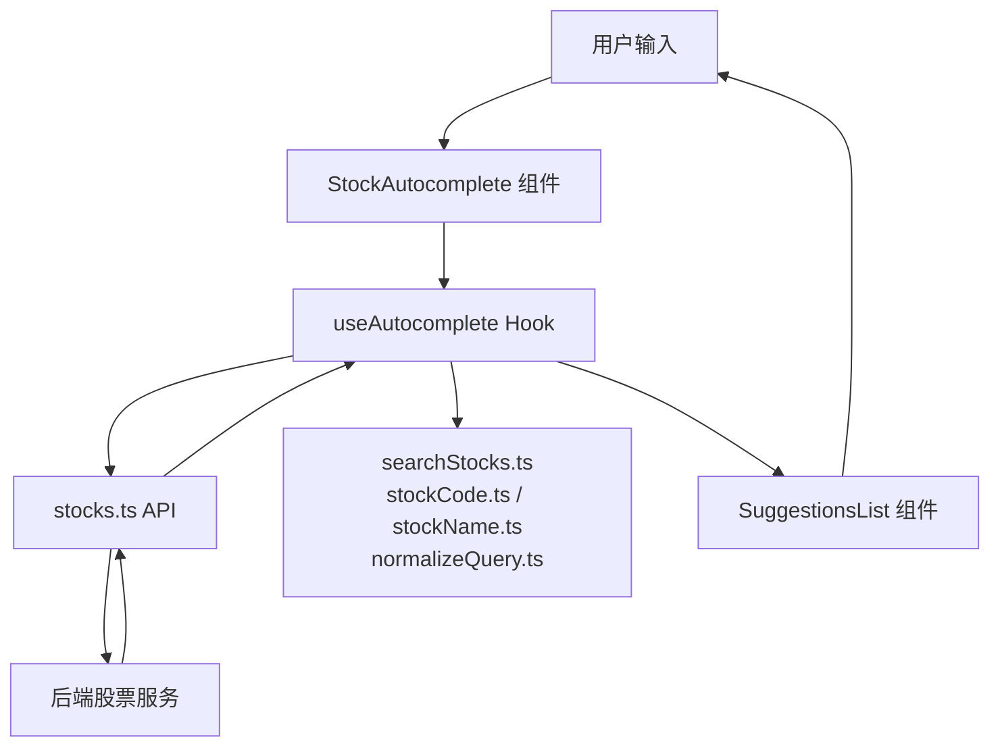
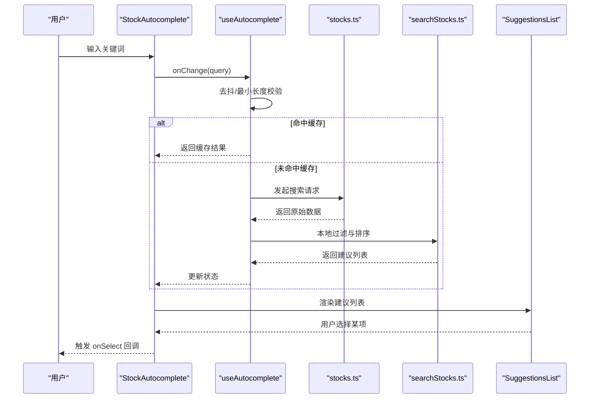
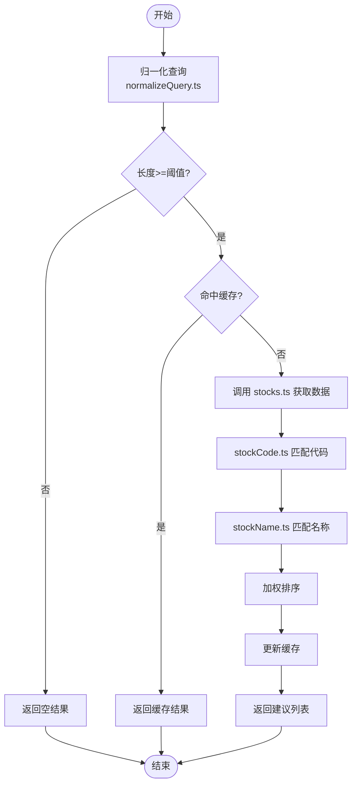
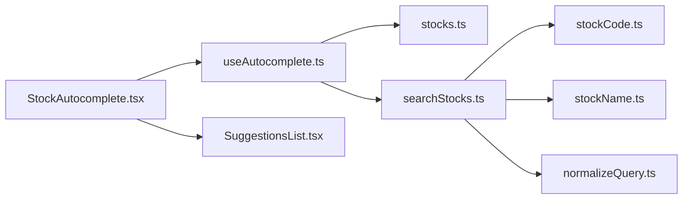

# 股票自动完成组件

<cite>
**本文引用的文件**   
- [StockAutocomplete.tsx](file://apps/dsa-web/src/components/StockAutocomplete/StockAutocomplete.tsx)
- [SuggestionsList.tsx](file://apps/dsa-web/src/components/StockAutocomplete/SuggestionsList.tsx)
- [index.ts](file://apps/dsa-web/src/components/StockAutocomplete/index.ts)
- [useAutocomplete.ts](file://apps/dsa-web/src/hooks/useAutocomplete.ts)
- [stocks.ts](file://apps/dsa-web/src/api/stocks.ts)
- [searchStocks.ts](file://apps/dsa-web/src/utils/searchStocks.ts)
- [stockCode.ts](file://apps/dsa-web/src/utils/stockCode.ts)
- [stockName.ts](file://apps/dsa-web/src/utils/stockName.ts)
- [normalizeQuery.ts](file://apps/dsa-web/src/utils/normalizeQuery.ts)
- [useAutocomplete.test.tsx](file://apps/dsa-web/src/hooks/__tests__/useAutocomplete.test.tsx)
</cite>

## 目录
1. [简介](#简介)
2. [项目结构](#项目结构)
3. [核心组件](#核心组件)
4. [架构总览](#架构总览)
5. [详细组件分析](#详细组件分析)
6. [依赖关系分析](#依赖关系分析)
7. [性能考虑](#性能考虑)
8. [故障排查指南](#故障排查指南)
9. [结论](#结论)
10. [附录：使用示例与集成指南](#附录使用示例与集成指南)

## 简介
本文件面向“股票自动完成”功能的前端实现，重点解析 StockAutocomplete 与 SuggestionsList 两个组件的实现原理、搜索算法与用户交互逻辑。文档同时说明如何接入后端股票数据源、实现实时搜索建议以及性能优化策略，并提供在不同场景下的配置与使用示例，涵盖自定义样式、事件处理与错误处理机制。

## 项目结构
股票自动完成相关代码位于 Web 应用前端模块中，主要包含：
- 组件层：StockAutocomplete（输入与状态管理）、SuggestionsList（下拉建议列表）
- Hook 层：useAutocomplete（搜索去抖、请求调度、结果缓存与过滤）
- API 层：stocks.ts（调用后端接口获取股票列表或建议）
- 工具层：searchStocks.ts、stockCode.ts、stockName.ts、normalizeQuery.ts（查询归一化、匹配与格式化）
- 测试：useAutocomplete.test.tsx（Hook 行为验证）

图表来源
- [StockAutocomplete.tsx](file://apps/dsa-web/src/components/StockAutocomplete/StockAutocomplete.tsx)
- [SuggestionsList.tsx](file://apps/dsa-web/src/components/StockAutocomplete/SuggestionsList.tsx)
- [useAutocomplete.ts](file://apps/dsa-web/src/hooks/useAutocomplete.ts)
- [stocks.ts](file://apps/dsa-web/src/api/stocks.ts)
- [searchStocks.ts](file://apps/dsa-web/src/utils/searchStocks.ts)
- [stockCode.ts](file://apps/dsa-web/src/utils/stockCode.ts)
- [stockName.ts](file://apps/dsa-web/src/utils/stockName.ts)
- [normalizeQuery.ts](file://apps/dsa-web/src/utils/normalizeQuery.ts)

章节来源
- [StockAutocomplete.tsx](file://apps/dsa-web/src/components/StockAutocomplete/StockAutocomplete.tsx)
- [SuggestionsList.tsx](file://apps/dsa-web/src/components/StockAutocomplete/SuggestionsList.tsx)
- [useAutocomplete.ts](file://apps/dsa-web/src/hooks/useAutocomplete.ts)
- [stocks.ts](file://apps/dsa-web/src/api/stocks.ts)
- [searchStocks.ts](file://apps/dsa-web/src/utils/searchStocks.ts)
- [stockCode.ts](file://apps/dsa-web/src/utils/stockCode.ts)
- [stockName.ts](file://apps/dsa-web/src/utils/stockName.ts)
- [normalizeQuery.ts](file://apps/dsa-web/src/utils/normalizeQuery.ts)

## 核心组件
- StockAutocomplete：负责输入框渲染、焦点管理、键盘导航、展开/收起建议列表、调用 useAutocomplete Hook 并透传回调与样式。
- SuggestionsList：负责渲染建议项、高亮匹配片段、滚动定位、选中项变更与点击选择。
- useAutocomplete：封装搜索去抖、请求节流、结果缓存、本地过滤与排序、错误状态暴露。

章节来源
- [StockAutocomplete.tsx](file://apps/dsa-web/src/components/StockAutocomplete/StockAutocomplete.tsx)
- [SuggestionsList.tsx](file://apps/dsa-web/src/components/StockAutocomplete/SuggestionsList.tsx)
- [useAutocomplete.ts](file://apps/dsa-web/src/hooks/useAutocomplete.ts)

## 架构总览
整体流程遵循“输入 → Hook 调度 → 网络请求 → 本地过滤 → 渲染建议”的链路。关键设计点包括：
- 输入去抖与最小字符阈值，避免频繁请求
- 结果缓存与失效策略，减少重复请求
- 本地快速过滤与排序，提升响应速度
- 统一错误处理与降级展示

图表来源
- [StockAutocomplete.tsx](file://apps/dsa-web/src/components/StockAutocomplete/StockAutocomplete.tsx)
- [SuggestionsList.tsx](file://apps/dsa-web/src/components/StockAutocomplete/SuggestionsList.tsx)
- [useAutocomplete.ts](file://apps/dsa-web/src/hooks/useAutocomplete.ts)
- [stocks.ts](file://apps/dsa-web/src/api/stocks.ts)
- [searchStocks.ts](file://apps/dsa-web/src/utils/searchStocks.ts)

## 详细组件分析

### StockAutocomplete 组件
职责与交互：
- 维护输入值、聚焦态、建议可见性
- 监听键盘事件（上/下/回车/ESC）进行导航与选择
- 将输入变化传递给 useAutocomplete Hook，并接收建议列表与加载/错误状态
- 通过 props 暴露 onSelect、onClose、onOpen、placeholder、className 等扩展点

可定制点：
- 样式：通过 className、inputProps、listProps 注入样式
- 行为：通过 onOpen/onClose 控制展开/收起时机
- 事件：onSelect 回调用于业务侧消费选中的股票对象

章节来源
- [StockAutocomplete.tsx](file://apps/dsa-web/src/components/StockAutocomplete/StockAutocomplete.tsx)

### SuggestionsList 组件
职责与交互：
- 渲染建议项，支持高亮匹配文本片段
- 支持键盘上下导航与回车选择
- 提供滚动定位到当前选中项的能力
- 暴露 onClick、onKeyDown、onMouseEnter 等事件以增强交互

可定制点：
- 列表容器与单项样式通过 className、itemClassName 注入
- 高亮规则可通过外部传入的 highlighter 函数定制

章节来源
- [SuggestionsList.tsx](file://apps/dsa-web/src/components/StockAutocomplete/SuggestionsList.tsx)

### useAutocomplete Hook
核心逻辑：
- 去抖：对输入变化设置定时器，避免高频请求
- 最小长度：当 query 长度小于阈值时直接返回空结果
- 缓存：按 query 缓存搜索结果，命中则直接返回
- 请求：调用 stocks.ts 提供的搜索接口，支持超时与重试策略
- 过滤与排序：结合 searchStocks.ts、stockCode.ts、stockName.ts、normalizeQuery.ts 进行本地匹配与排序
- 错误处理：捕获网络异常与解析异常，暴露 loading/error/status 状态供 UI 消费

复杂度与优化：
- 时间复杂度：本地过滤为 O(n)，n 为候选集大小；可通过分页/懒加载进一步降低
- 空间复杂度：缓存占用与候选集规模成正比；可限制缓存条目数与过期时间

章节来源
- [useAutocomplete.ts](file://apps/dsa-web/src/hooks/useAutocomplete.ts)
- [stocks.ts](file://apps/dsa-web/src/api/stocks.ts)
- [searchStocks.ts](file://apps/dsa-web/src/utils/searchStocks.ts)
- [stockCode.ts](file://apps/dsa-web/src/utils/stockCode.ts)
- [stockName.ts](file://apps/dsa-web/src/utils/stockName.ts)
- [normalizeQuery.ts](file://apps/dsa-web/src/utils/normalizeQuery.ts)

### 搜索算法与匹配策略
- 查询归一化：normalizeQuery.ts 负责去除多余空白、转小写、标准化标点等
- 代码匹配：stockCode.ts 支持前缀匹配、模糊匹配与交易所前缀识别
- 名称匹配：stockName.ts 支持中文名称分词与拼音近似匹配（如适用）
- 综合排序：优先匹配股票代码，其次匹配名称，再根据权重打分排序

图表来源
- [normalizeQuery.ts](file://apps/dsa-web/src/utils/normalizeQuery.ts)
- [stockCode.ts](file://apps/dsa-web/src/utils/stockCode.ts)
- [stockName.ts](file://apps/dsa-web/src/utils/stockName.ts)
- [stocks.ts](file://apps/dsa-web/src/api/stocks.ts)
- [useAutocomplete.ts](file://apps/dsa-web/src/hooks/useAutocomplete.ts)

## 依赖关系分析
- StockAutocomplete 依赖 useAutocomplete Hook 提供数据与状态
- useAutocomplete 依赖 stocks.ts 进行网络请求，依赖 searchStocks.ts 及 stockCode.ts、stockName.ts、normalizeQuery.ts 进行本地处理
- SuggestionsList 仅依赖数据与事件回调，无外部副作用

图表来源
- [StockAutocomplete.tsx](file://apps/dsa-web/src/components/StockAutocomplete/StockAutocomplete.tsx)
- [useAutocomplete.ts](file://apps/dsa-web/src/hooks/useAutocomplete.ts)
- [stocks.ts](file://apps/dsa-web/src/api/stocks.ts)
- [searchStocks.ts](file://apps/dsa-web/src/utils/searchStocks.ts)
- [stockCode.ts](file://apps/dsa-web/src/utils/stockCode.ts)
- [stockName.ts](file://apps/dsa-web/src/utils/stockName.ts)
- [normalizeQuery.ts](file://apps/dsa-web/src/utils/normalizeQuery.ts)

章节来源
- [StockAutocomplete.tsx](file://apps/dsa-web/src/components/StockAutocomplete/StockAutocomplete.tsx)
- [useAutocomplete.ts](file://apps/dsa-web/src/hooks/useAutocomplete.ts)
- [stocks.ts](file://apps/dsa-web/src/api/stocks.ts)
- [searchStocks.ts](file://apps/dsa-web/src/utils/searchStocks.ts)
- [stockCode.ts](file://apps/dsa-web/src/utils/stockCode.ts)
- [stockName.ts](file://apps/dsa-web/src/utils/stockName.ts)
- [normalizeQuery.ts](file://apps/dsa-web/src/utils/normalizeQuery.ts)

## 性能考虑
- 去抖与最小长度：减少无效请求，降低服务器压力
- 结果缓存：相同查询直接返回，避免重复 IO
- 本地过滤与排序：在客户端完成大部分匹配工作，提升响应速度
- 列表虚拟化：当候选集较大时，建议使用虚拟滚动以减少 DOM 节点数量
- 请求超时与重试：合理设置超时时间与重试次数，提高鲁棒性
- 内存管理：限制缓存大小与生命周期，避免内存泄漏

[本节为通用指导，不直接分析具体文件]

## 故障排查指南
常见问题与定位方法：
- 无结果返回：检查最小长度阈值、去抖延迟、缓存是否命中；确认 normalizeQuery 是否正确归一化
- 匹配不准确：检查 stockCode.ts 与 stockName.ts 的匹配规则与权重；必要时调整排序策略
- 网络错误：查看 stocks.ts 的错误处理分支，确认后端接口可用性、鉴权与跨域配置
- 键盘导航异常：检查 SuggestionsList 的事件绑定与焦点管理
- 性能问题：观察请求频率与候选集规模，启用虚拟化与缓存上限

章节来源
- [useAutocomplete.ts](file://apps/dsa-web/src/hooks/useAutocomplete.ts)
- [stocks.ts](file://apps/dsa-web/src/api/stocks.ts)
- [searchStocks.ts](file://apps/dsa-web/src/utils/searchStocks.ts)
- [stockCode.ts](file://apps/dsa-web/src/utils/stockCode.ts)
- [stockName.ts](file://apps/dsa-web/src/utils/stockName.ts)
- [normalizeQuery.ts](file://apps/dsa-web/src/utils/normalizeQuery.ts)

## 结论
StockAutocomplete 与 SuggestionsList 通过 useAutocomplete Hook 协同工作，实现了高效、可扩展的股票自动完成能力。其核心在于合理的去抖与缓存策略、强大的本地匹配与排序算法，以及良好的事件与样式扩展点。通过规范的数据源接入与完善的错误处理机制，可在多种业务场景中稳定运行。

[本节为总结，不直接分析具体文件]

## 附录：使用示例与集成指南

### 基本用法
- 引入 StockAutocomplete 组件，传入必要 props：placeholder、onSelect、className 等
- 使用 useAutocomplete Hook 管理搜索状态（可选），或直接由组件内部驱动
- 在 onSelect 回调中处理选中的股票对象，例如跳转详情页或加入自选

章节来源
- [StockAutocomplete.tsx](file://apps/dsa-web/src/components/StockAutocomplete/StockAutocomplete.tsx)
- [index.ts](file://apps/dsa-web/src/components/StockAutocomplete/index.ts)

### 自定义样式
- 通过 className 为输入框与列表容器注入样式
- 通过 itemClassName 自定义建议项样式
- 通过 inputProps/listProps 传递原生属性，如 aria-label、data-testid 等

章节来源
- [StockAutocomplete.tsx](file://apps/dsa-web/src/components/StockAutocomplete/StockAutocomplete.tsx)
- [SuggestionsList.tsx](file://apps/dsa-web/src/components/StockAutocomplete/SuggestionsList.tsx)

### 事件处理
- onSelect：用户选择某项时触发，参数为选中的股票对象
- onOpen/onClose：控制建议列表的展开与收起时机
- onKeyDown：支持自定义键盘行为，如回车提交、Esc 关闭

章节来源
- [StockAutocomplete.tsx](file://apps/dsa-web/src/components/StockAutocomplete/StockAutocomplete.tsx)
- [SuggestionsList.tsx](file://apps/dsa-web/src/components/StockAutocomplete/SuggestionsList.tsx)

### 错误处理
- 网络错误：stocks.ts 捕获异常并返回错误状态，UI 可显示提示
- 解析错误：searchStocks.ts 对数据结构进行校验，失败时回退为空列表
- 超时与重试：useAutocomplete 支持超时与重试配置，避免瞬时失败影响体验

章节来源
- [stocks.ts](file://apps/dsa-web/src/api/stocks.ts)
- [searchStocks.ts](file://apps/dsa-web/src/utils/searchStocks.ts)
- [useAutocomplete.ts](file://apps/dsa-web/src/hooks/useAutocomplete.ts)

### 数据源集成
- 后端接口：stocks.ts 定义搜索接口调用方式，需确保返回字段包含代码、名称等必要信息
- 本地缓存：useAutocomplete 默认按查询字符串缓存结果，可按需调整缓存策略
- 过滤与排序：searchStocks.ts 与 stockCode.ts、stockName.ts、normalizeQuery.ts 协作完成匹配与排序

章节来源
- [stocks.ts](file://apps/dsa-web/src/api/stocks.ts)
- [searchStocks.ts](file://apps/dsa-web/src/utils/searchStocks.ts)
- [stockCode.ts](file://apps/dsa-web/src/utils/stockCode.ts)
- [stockName.ts](file://apps/dsa-web/src/utils/stockName.ts)
- [normalizeQuery.ts](file://apps/dsa-web/src/utils/normalizeQuery.ts)

### 单元测试参考
- useAutocomplete.test.tsx 提供了 Hook 行为的测试用例，可用于验证去抖、缓存、过滤与错误处理逻辑

章节来源
- [useAutocomplete.test.tsx](file://apps/dsa-web/src/hooks/__tests__/useAutocomplete.test.tsx)