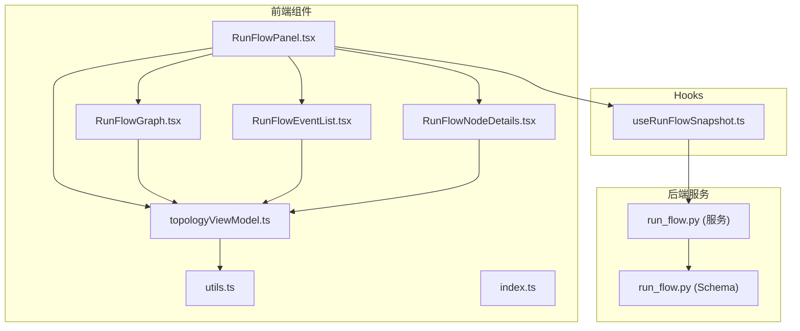
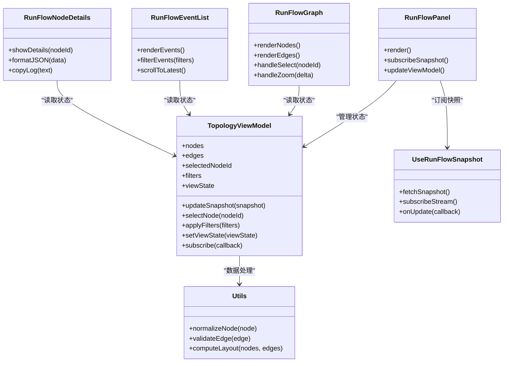

# 运行流程组件

<cite>
**本文引用的文件**   
- [RunFlowGraph.tsx](file://apps/dsa-web/src/components/run-flow/RunFlowGraph.tsx)
- [RunFlowEventList.tsx](file://apps/dsa-web/src/components/run-flow/RunFlowEventList.tsx)
- [RunFlowNodeDetails.tsx](file://apps/dsa-web/src/components/run-flow/RunFlowNodeDetails.tsx)
- [RunFlowPanel.tsx](file://apps/dsa-web/src/components/run-flow/RunFlowPanel.tsx)
- [topologyViewModel.ts](file://apps/dsa-web/src/components/run-flow/topologyViewModel.ts)
- [utils.ts](file://apps/dsa-web/src/components/run-flow/utils.ts)
- [index.ts](file://apps/dsa-web/src/components/run-flow/index.ts)
- [useRunFlowSnapshot.ts](file://apps/dsa-web/src/hooks/useRunFlowSnapshot.ts)
- [runFlow.ts](file://src/services/run_flow.py)
- [run_flow.py](file://api/v1/schemas/run_flow.py)
</cite>

## 目录
1. [简介](#简介)
2. [项目结构](#项目结构)
3. [核心组件](#核心组件)
4. [架构总览](#架构总览)
5. [详细组件分析](#详细组件分析)
6. [依赖关系分析](#依赖关系分析)
7. [性能考虑](#性能考虑)
8. [故障排查指南](#故障排查指南)
9. [结论](#结论)
10. [附录：使用示例与最佳实践](#附录使用示例与最佳实践)

## 简介
本文件面向“运行流程相关组件”的文档，聚焦以下目标：
- 详细说明 RunFlowGraph、RunFlowEventList、RunFlowNodeDetails、RunFlowPanel 和 topologyViewModel 的功能与实现。
- 解释流程图可视化、事件监听机制与拓扑状态管理。
- 提供完整的使用示例，展示如何监控和分析 AI 智能体的执行流程、调试节点状态和处理异步事件。
- 包含图形渲染优化、实时更新和交互操作的实现细节。

## 项目结构
运行流程相关的前端代码位于 apps/dsa-web/src/components/run-flow 目录，配合 hooks/useRunFlowSnapshot.ts 获取快照数据，后端服务由 src/services/run_flow.py 提供，API 数据模型在 api/v1/schemas/run_flow.py 中定义。



图表来源
- [RunFlowPanel.tsx](file://apps/dsa-web/src/components/run-flow/RunFlowPanel.tsx)
- [RunFlowGraph.tsx](file://apps/dsa-web/src/components/run-flow/RunFlowGraph.tsx)
- [RunFlowEventList.tsx](file://apps/dsa-web/src/components/run-flow/RunFlowEventList.tsx)
- [RunFlowNodeDetails.tsx](file://apps/dsa-web/src/components/run-flow/RunFlowNodeDetails.tsx)
- [topologyViewModel.ts](file://apps/dsa-web/src/components/run-flow/topologyViewModel.ts)
- [utils.ts](file://apps/dsa-web/src/components/run-flow/utils.ts)
- [useRunFlowSnapshot.ts](file://apps/dsa-web/src/hooks/useRunFlowSnapshot.ts)
- [run_flow.py](file://src/services/run_flow.py)
- [run_flow.py](file://api/v1/schemas/run_flow.py)

章节来源
- [index.ts](file://apps/dsa-web/src/components/run-flow/index.ts)
- [RunFlowPanel.tsx](file://apps/dsa-web/src/components/run-flow/RunFlowPanel.tsx)
- [RunFlowGraph.tsx](file://apps/dsa-web/src/components/run-flow/RunFlowGraph.tsx)
- [RunFlowEventList.tsx](file://apps/dsa-web/src/components/run-flow/RunFlowEventList.tsx)
- [RunFlowNodeDetails.tsx](file://apps/dsa-web/src/components/run-flow/RunFlowNodeDetails.tsx)
- [topologyViewModel.ts](file://apps/dsa-web/src/components/run-flow/topologyViewModel.ts)
- [utils.ts](file://apps/dsa-web/src/components/run-flow/utils.ts)
- [useRunFlowSnapshot.ts](file://apps/dsa-web/src/hooks/useRunFlowSnapshot.ts)
- [run_flow.py](file://src/services/run_flow.py)
- [run_flow.py](file://api/v1/schemas/run_flow.py)

## 核心组件
- RunFlowPanel：运行流程面板容器，负责组合子组件、订阅快照更新、控制可见性与布局。
- RunFlowGraph：流程图可视化组件，基于拓扑视图模型渲染节点与边，支持缩放、平移、选中与高亮。
- RunFlowEventList：事件列表组件，按时间顺序展示运行过程中的事件流，支持过滤与滚动定位。
- RunFlowNodeDetails：节点详情面板，展示选中节点的输入输出、日志与耗时等详细信息。
- topologyViewModel：拓扑状态管理器，维护节点集合、边集合、选中状态、过滤条件与渲染指令。

章节来源
- [RunFlowPanel.tsx](file://apps/dsa-web/src/components/run-flow/RunFlowPanel.tsx)
- [RunFlowGraph.tsx](file://apps/dsa-web/src/components/run-flow/RunFlowGraph.tsx)
- [RunFlowEventList.tsx](file://apps/dsa-web/src/components/run-flow/RunFlowEventList.tsx)
- [RunFlowNodeDetails.tsx](file://apps/dsa-web/src/components/run-flow/RunFlowNodeDetails.tsx)
- [topologyViewModel.ts](file://apps/dsa-web/src/components/run-flow/topologyViewModel.ts)

## 架构总览
运行流程组件采用“视图-模型-数据源”分层：
- 视图层：RunFlowPanel、RunFlowGraph、RunFlowEventList、RunFlowNodeDetails 负责 UI 渲染与交互。
- 模型层：topologyViewModel 集中管理拓扑状态（节点、边、选中、过滤），对外暴露稳定的读写接口。
- 数据层：useRunFlowSnapshot 钩子从后端 run_flow 服务拉取或订阅快照，将结构化数据注入到模型层。

```mermaid
sequenceDiagram
participant User as "用户"
participant Panel as "RunFlowPanel"
participant Hook as "useRunFlowSnapshot"
participant Service as "run_flow.py(服务)"
participant Schema as "run_flow.py(Schema)"
participant Model as "topologyViewModel"
participant Graph as "RunFlowGraph"
participant Events as "RunFlowEventList"
participant Details as "RunFlowNodeDetails"
User->>Panel : 打开运行流程面板
Panel->>Hook : 初始化并订阅快照
Hook->>Service : 请求/订阅运行快照
Service-->>Hook : 返回结构化快照
Hook-->>Model : 更新拓扑状态(节点/边/事件)
Model-->>Graph : 触发重绘
Model-->>Events : 触发事件列表刷新
Model-->>Details : 同步选中节点详情
User->>Graph : 点击节点/拖拽/缩放
Graph->>Model : 更新选中/视图状态
Model-->>Details : 更新详情面板
```

图表来源
- [RunFlowPanel.tsx](file://apps/dsa-web/src/components/run-flow/RunFlowPanel.tsx)
- [useRunFlowSnapshot.ts](file://apps/dsa-web/src/hooks/useRunFlowSnapshot.ts)
- [run_flow.py](file://src/services/run_flow.py)
- [run_flow.py](file://api/v1/schemas/run_flow.py)
- [topologyViewModel.ts](file://apps/dsa-web/src/components/run-flow/topologyViewModel.ts)
- [RunFlowGraph.tsx](file://apps/dsa-web/src/components/run-flow/RunFlowGraph.tsx)
- [RunFlowEventList.tsx](file://apps/dsa-web/src/components/run-flow/RunFlowEventList.tsx)
- [RunFlowNodeDetails.tsx](file://apps/dsa-web/src/components/run-flow/RunFlowNodeDetails.tsx)

## 详细组件分析

### RunFlowPanel 组件
- 职责：作为运行流程的主面板，组合图、事件列表与详情面板；管理面板开关、宽度与布局；订阅 useRunFlowSnapshot 提供的快照数据，并将数据传递给 topologyViewModel。
- 关键行为：
  - 初始化时创建或复用 topologyViewModel 实例。
  - 根据快照更新拓扑状态，保持视图与数据一致。
  - 处理用户交互（如切换标签页、调整面板尺寸）。
- 性能要点：避免重复创建模型实例；对快照增量更新进行合并，减少重渲染。

章节来源
- [RunFlowPanel.tsx](file://apps/dsa-web/src/components/run-flow/RunFlowPanel.tsx)

### RunFlowGraph 组件
- 职责：渲染拓扑图，包括节点、边、连线方向、状态颜色与交互（点击、拖拽、缩放、平移）。
- 关键行为：
  - 读取 topologyViewModel 的节点与边集合，计算布局与可视区域。
  - 响应选中事件，向模型写入选中节点 ID。
  - 支持键盘快捷键与鼠标滚轮缩放。
- 渲染优化：
  - 仅重绘变更节点与边。
  - 使用虚拟滚动或分片渲染大拓扑。
  - 缓存节点尺寸与位置，避免重复计算。

章节来源
- [RunFlowGraph.tsx](file://apps/dsa-web/src/components/run-flow/RunFlowGraph.tsx)
- [topologyViewModel.ts](file://apps/dsa-web/src/components/run-flow/topologyViewModel.ts)

### RunFlowEventList 组件
- 职责：以时间线形式展示运行事件，支持按类型过滤、搜索与滚动定位到最新事件。
- 关键行为：
  - 订阅 topologyViewModel 的事件队列，按时间排序显示。
  - 支持展开/折叠事件详情，复制事件内容。
  - 自动滚动到底部，并提供“跟随最新”开关。
- 性能要点：对长列表使用虚拟滚动；事件去重与节流更新。

章节来源
- [RunFlowEventList.tsx](file://apps/dsa-web/src/components/run-flow/RunFlowEventList.tsx)
- [topologyViewModel.ts](file://apps/dsa-web/src/components/run-flow/topologyViewModel.ts)

### RunFlowNodeDetails 组件
- 职责：展示选中节点的详细信息，包括输入参数、输出结果、日志、错误堆栈与耗时统计。
- 关键行为：
  - 根据 topologyViewModel 的选中节点 ID 加载详情。
  - 支持 JSON 格式化查看与关键字过滤。
  - 提供“跳转到图节点”操作，联动视图定位。
- 交互设计：可折叠区块、一键复制、导出日志片段。

章节来源
- [RunFlowNodeDetails.tsx](file://apps/dsa-web/src/components/run-flow/RunFlowNodeDetails.tsx)
- [topologyViewModel.ts](file://apps/dsa-web/src/components/run-flow/topologyViewModel.ts)

### topologyViewModel 状态管理
- 职责：集中管理拓扑状态，包括节点集合、边集合、选中节点、过滤条件、视图状态（缩放、平移）与渲染指令。
- 数据结构：
  - nodes：节点映射，键为节点 ID，值为节点元数据（名称、类型、状态、输入输出、日志、耗时）。
  - edges：边集合，描述节点间的依赖与流向。
  - selectedNodeId：当前选中节点 ID。
  - filters：事件与节点过滤条件（类型、关键词、时间范围）。
  - viewState：视图缩放与平移参数。
- 关键方法：
  - updateSnapshot(snapshot)：将后端快照转换为内部拓扑状态。
  - selectNode(nodeId)：设置选中节点并触发详情更新。
  - applyFilters(filters)：应用过滤条件并重新计算可见性。
  - setViewState(viewState)：更新视图缩放与平移。
  - subscribe(callback)：订阅状态变化，通知视图层重渲染。
- 线程安全：在单页面应用中通过不可变更新与批量提交保证一致性。

章节来源
- [topologyViewModel.ts](file://apps/dsa-web/src/components/run-flow/topologyViewModel.ts)
- [utils.ts](file://apps/dsa-web/src/components/run-flow/utils.ts)

### 数据流与快照机制
- useRunFlowSnapshot：封装与后端 run_flow 服务的通信，提供快照数据的拉取与订阅（如 SSE/WebSocket）。
- 数据契约：遵循 api/v1/schemas/run_flow.py 定义的字段结构，确保前后端一致性。
- 更新策略：增量更新优先，合并相同节点与事件，避免全量重绘。

章节来源
- [useRunFlowSnapshot.ts](file://apps/dsa-web/src/hooks/useRunFlowSnapshot.ts)
- [run_flow.py](file://src/services/run_flow.py)
- [run_flow.py](file://api/v1/schemas/run_flow.py)

## 依赖关系分析
组件间依赖清晰，耦合度低，内聚度高：
- RunFlowPanel 依赖 topologyViewModel 与 useRunFlowSnapshot。
- RunFlowGraph、RunFlowEventList、RunFlowNodeDetails 均依赖 topologyViewModel 提供的只读状态。
- topologyViewModel 依赖 utils 工具函数进行数据处理与校验。
- 数据源来自 useRunFlowSnapshot，最终指向后端 run_flow 服务与 schema。



图表来源
- [RunFlowPanel.tsx](file://apps/dsa-web/src/components/run-flow/RunFlowPanel.tsx)
- [RunFlowGraph.tsx](file://apps/dsa-web/src/components/run-flow/RunFlowGraph.tsx)
- [RunFlowEventList.tsx](file://apps/dsa-web/src/components/run-flow/RunFlowEventList.tsx)
- [RunFlowNodeDetails.tsx](file://apps/dsa-web/src/components/run-flow/RunFlowNodeDetails.tsx)
- [topologyViewModel.ts](file://apps/dsa-web/src/components/run-flow/topologyViewModel.ts)
- [utils.ts](file://apps/dsa-web/src/components/run-flow/utils.ts)
- [useRunFlowSnapshot.ts](file://apps/dsa-web/src/hooks/useRunFlowSnapshot.ts)

章节来源
- [RunFlowPanel.tsx](file://apps/dsa-web/src/components/run-flow/RunFlowPanel.tsx)
- [RunFlowGraph.tsx](file://apps/dsa-web/src/components/run-flow/RunFlowGraph.tsx)
- [RunFlowEventList.tsx](file://apps/dsa-web/src/components/run-flow/RunFlowEventList.tsx)
- [RunFlowNodeDetails.tsx](file://apps/dsa-web/src/components/run-flow/RunFlowNodeDetails.tsx)
- [topologyViewModel.ts](file://apps/dsa-web/src/components/run-flow/topologyViewModel.ts)
- [utils.ts](file://apps/dsa-web/src/components/run-flow/utils.ts)
- [useRunFlowSnapshot.ts](file://apps/dsa-web/src/hooks/useRunFlowSnapshot.ts)

## 性能考虑
- 渲染优化：
  - 使用不可变更新与最小化重渲染，仅在拓扑状态变化时触发局部更新。
  - 大图场景启用虚拟滚动与分片渲染，降低主线程压力。
  - 缓存节点尺寸与布局计算结果，避免重复计算。
- 事件处理：
  - 对高频事件（如滚动、缩放）进行节流与防抖。
  - 事件列表采用增量追加与去重，避免全量重建。
- 数据同步：
  - 优先增量更新快照，合并相同节点与事件。
  - 网络请求失败时提供重试与降级策略。

[本节为通用指导，不直接分析具体文件]

## 故障排查指南
- 常见问题：
  - 节点未显示：检查 topologyViewModel 的 nodes 集合是否被正确填充；确认 snapshot 字段是否符合 schema。
  - 事件不更新：确认 useRunFlowSnapshot 是否正确订阅后端流；检查过滤器是否过于严格。
  - 详情面板为空：验证 selectedNodeId 是否存在且节点数据完整。
- 调试建议：
  - 在 topologyViewModel 的 subscribe 回调中打印状态差异。
  - 使用浏览器开发者工具的网络面板检查快照数据格式。
  - 对 utils 中的 normalizeNode 与 validateEdge 添加断点验证数据转换。

章节来源
- [topologyViewModel.ts](file://apps/dsa-web/src/components/run-flow/topologyViewModel.ts)
- [useRunFlowSnapshot.ts](file://apps/dsa-web/src/hooks/useRunFlowSnapshot.ts)
- [utils.ts](file://apps/dsa-web/src/components/run-flow/utils.ts)

## 结论
运行流程组件通过清晰的视图-模型-数据源分层，实现了 AI 智能体执行流程的可视化、事件监听与拓扑状态管理。topologyViewModel 作为核心状态管理器，确保了数据一致性与渲染效率。结合 useRunFlowSnapshot 的快照订阅机制，系统能够实时反映后端运行状态，为用户提供强大的调试与分析能力。

[本节为总结，不直接分析具体文件]

## 附录：使用示例与最佳实践
- 基本用法：
  - 在页面中引入 RunFlowPanel，传入运行 ID 或会话标识。
  - 组件会自动初始化 topologyViewModel 并订阅快照。
- 监控与分析：
  - 使用 RunFlowEventList 过滤特定类型的节点事件，快速定位问题。
  - 通过 RunFlowNodeDetails 查看节点输入输出与日志，辅助调试。
- 交互操作：
  - 在 RunFlowGraph 中点击节点以查看详情，或使用缩放与平移导航大图。
  - 利用键盘快捷键提升操作效率。
- 性能优化：
  - 对大型拓扑启用虚拟滚动与分片渲染。
  - 合理设置过滤器，减少不必要的渲染。
- 最佳实践：
  - 避免在组件内直接修改 topologyViewModel 状态，统一通过其公开方法更新。
  - 对快照数据进行校验与容错处理，防止异常数据导致崩溃。

[本节为概念性内容，不直接分析具体文件]