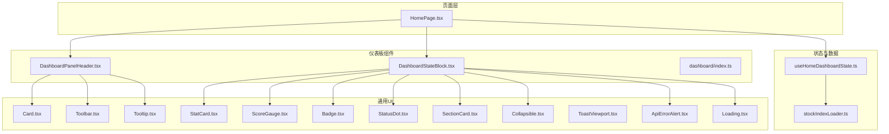
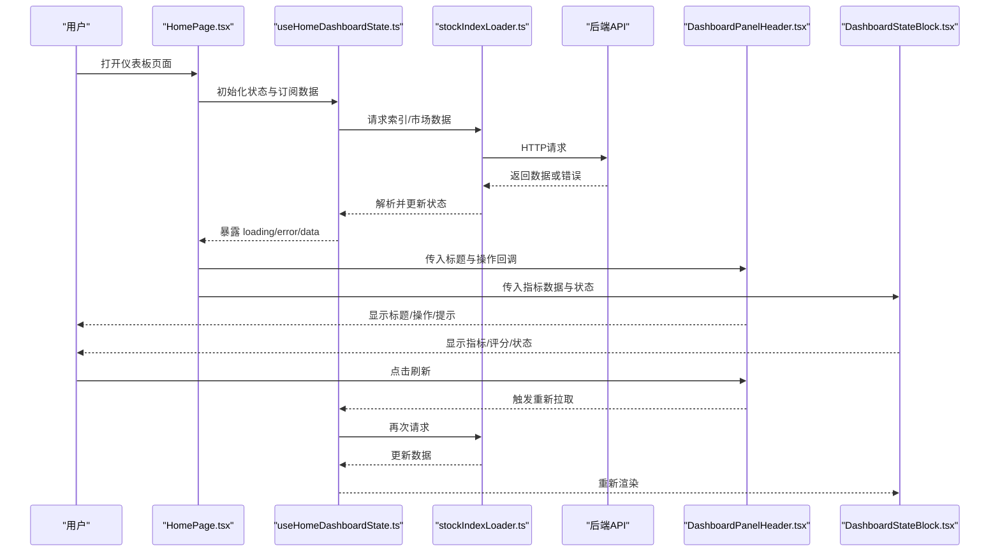
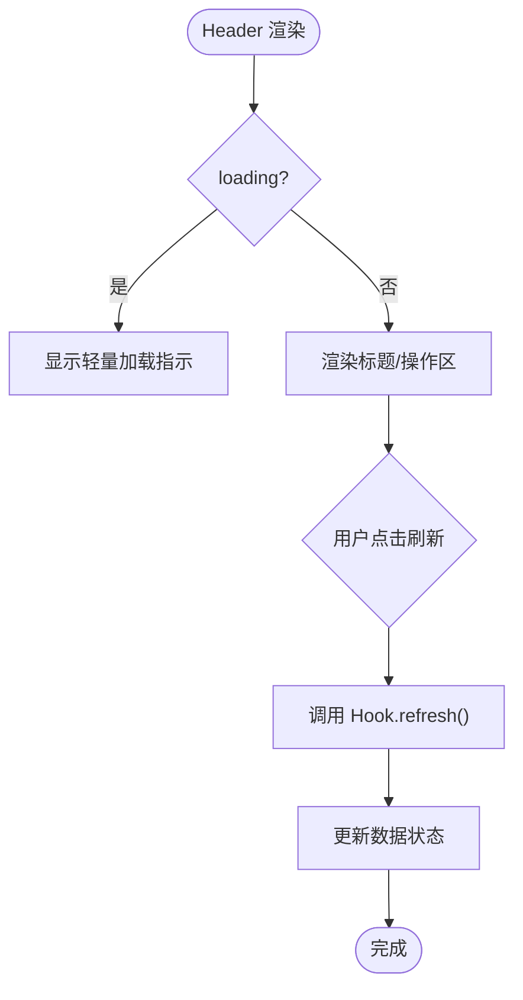
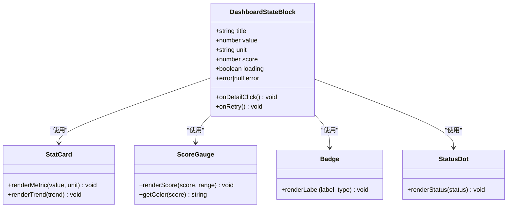
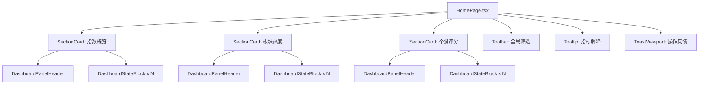
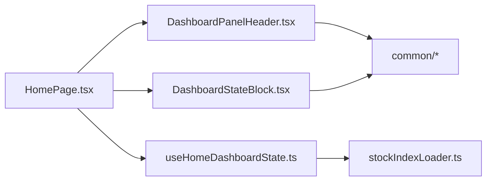

# 仪表板组件

<cite>
**本文引用的文件**   
- [DashboardStateBlock.tsx](file://apps/dsa-web/src/components/dashboard/DashboardStateBlock.tsx)
- [DashboardPanelHeader.tsx](file://apps/dsa-web/src/components/dashboard/DashboardPanelHeader.tsx)
- [index.ts](file://apps/dsa-web/src/components/dashboard/index.ts)
- [useHomeDashboardState.ts](file://apps/dsa-web/src/hooks/useHomeDashboardState.ts)
- [HomePage.tsx](file://apps/dsa-web/src/pages/HomePage.tsx)
- [ApiErrorAlert.tsx](file://apps/dsa-web/src/components/common/ApiErrorAlert.tsx)
- [Loading.tsx](file://apps/dsa-web/src/components/common/Loading.tsx)
- [Card.tsx](file://apps/dsa-web/src/components/common/Card.tsx)
- [StatCard.tsx](file://apps/dsa-web/src/components/common/StatCard.tsx)
- [ScoreGauge.tsx](file://apps/dsa-web/src/components/common/ScoreGauge.tsx)
- [Badge.tsx](file://apps/dsa-web/src/components/common/Badge.tsx)
- [StatusDot.tsx](file://apps/dsa-web/src/components/common/StatusDot.tsx)
- [SectionCard.tsx](file://apps/dsa-web/src/components/common/SectionCard.tsx)
- [Collapsible.tsx](file://apps/dsa-web/src/components/common/Collapsible.tsx)
- [Toolbar.tsx](file://apps/dsa-web/src/components/common/Toolbar.tsx)
- [Tooltip.tsx](file://apps/dsa-web/src/components/common/Tooltip.tsx)
- [ToastViewport.tsx](file://apps/dsa-web/src/components/common/ToastViewport.tsx)
- [StockIndexLoader.tsx](file://apps/dsa-web/src/utils/stockIndexLoader.ts)
- [format.ts](file://apps/dsa-web/src/utils/format.ts)
</cite>

## 目录
1. [简介](#简介)
2. [项目结构](#项目结构)
3. [核心组件](#核心组件)
4. [架构总览](#架构总览)
5. [详细组件分析](#详细组件分析)
6. [依赖关系分析](#依赖关系分析)
7. [性能考虑](#性能考虑)
8. [故障排查指南](#故障排查指南)
9. [结论](#结论)
10. [附录](#附录)

## 简介
本文件面向仪表板专用组件，重点围绕 DashboardStateBlock（状态块）与 DashboardPanelHeader（面板头部）两个核心组件进行系统化文档化。内容涵盖：
- 数据展示模式：指标、评分、趋势、状态等可视化方式
- 状态管理：加载、错误、空态、刷新、缓存等
- 交互逻辑：展开/收起、筛选、刷新、提示、通知等
- 页面构建示例：如何组合多个组件形成完整仪表板界面
- 数据更新机制：拉取、增量更新、轮询与事件驱动
- 错误处理与加载状态管理：统一错误提示、重试策略、骨架屏
- 性能优化与用户体验改进建议：懒加载、虚拟滚动、防抖节流、渲染优化

## 项目结构
仪表板相关代码位于 Web 前端应用 apps/dsa-web 中，采用按功能域划分的组件组织方式。仪表板组件集中在 components/dashboard 目录，并通过 index.ts 统一导出；页面级入口在 pages/HomePage.tsx；通用 UI 能力由 components/common 提供；数据获取与工具函数位于 utils 与 hooks 目录。

图表来源
- [DashboardPanelHeader.tsx](file://apps/dsa-web/src/components/dashboard/DashboardPanelHeader.tsx)
- [DashboardStateBlock.tsx](file://apps/dsa-web/src/components/dashboard/DashboardStateBlock.tsx)
- [index.ts](file://apps/dsa-web/src/components/dashboard/index.ts)
- [HomePage.tsx](file://apps/dsa-web/src/pages/HomePage.tsx)
- [useHomeDashboardState.ts](file://apps/dsa-web/src/hooks/useHomeDashboardState.ts)
- [StockIndexLoader.tsx](file://apps/dsa-web/src/utils/stockIndexLoader.ts)
- [Card.tsx](file://apps/dsa-web/src/components/common/Card.tsx)
- [StatCard.tsx](file://apps/dsa-web/src/components/common/StatCard.tsx)
- [ScoreGauge.tsx](file://apps/dsa-web/src/components/common/ScoreGauge.tsx)
- [Badge.tsx](file://apps/dsa-web/src/components/common/Badge.tsx)
- [StatusDot.tsx](file://apps/dsa-web/src/components/common/StatusDot.tsx)
- [SectionCard.tsx](file://apps/dsa-web/src/components/common/SectionCard.tsx)
- [Collapsible.tsx](file://apps/dsa-web/src/components/common/Collapsible.tsx)
- [Toolbar.tsx](file://apps/dsa-web/src/components/common/Toolbar.tsx)
- [Tooltip.tsx](file://apps/dsa-web/src/components/common/Tooltip.tsx)
- [ToastViewport.tsx](file://apps/dsa-web/src/components/common/ToastViewport.tsx)
- [ApiErrorAlert.tsx](file://apps/dsa-web/src/components/common/ApiErrorAlert.tsx)
- [Loading.tsx](file://apps/dsa-web/src/components/common/Loading.tsx)

章节来源
- [HomePage.tsx](file://apps/dsa-web/src/pages/HomePage.tsx)
- [index.ts](file://apps/dsa-web/src/components/dashboard/index.ts)

## 核心组件
本节聚焦 DashboardStateBlock 与 DashboardPanelHeader 的职责、属性、状态与交互行为。

- DashboardPanelHeader（面板头部）
  - 职责：承载仪表板面板的标题、操作按钮、筛选器、刷新、帮助提示等
  - 典型属性：标题文本、副标题、操作项列表、是否可折叠、是否显示工具栏
  - 交互：点击刷新触发数据重拉取；切换筛选条件；展开/收起详情区域；悬浮提示
  - 样式与布局：使用 Card/SectionCard 作为容器，Toolbar 承载操作区，Tooltip 提供辅助说明

- DashboardStateBlock（状态块）
  - 职责：以卡片形式呈现关键指标、评分、趋势与状态信息
  - 典型属性：指标名称、数值、单位、评分范围、颜色主题、是否可点击跳转
  - 交互：点击查看详情或进入详情页；长按或悬浮显示更多元数据；支持键盘导航
  - 状态：加载中（骨架屏）、成功（数据渲染）、错误（统一错误提示）、空态（占位图）

章节来源
- [DashboardPanelHeader.tsx](file://apps/dsa-web/src/components/dashboard/DashboardPanelHeader.tsx)
- [DashboardStateBlock.tsx](file://apps/dsa-web/src/components/dashboard/DashboardStateBlock.tsx)

## 架构总览
仪表板的数据流从页面层发起，通过自定义 Hook 管理状态并调用数据加载器，最终将数据注入到各组件进行渲染。错误与加载状态由通用组件统一处理，保证一致的用户体验。

图表来源
- [HomePage.tsx](file://apps/dsa-web/src/pages/HomePage.tsx)
- [useHomeDashboardState.ts](file://apps/dsa-web/src/hooks/useHomeDashboardState.ts)
- [StockIndexLoader.tsx](file://apps/dsa-web/src/utils/stockIndexLoader.ts)
- [DashboardPanelHeader.tsx](file://apps/dsa-web/src/components/dashboard/DashboardPanelHeader.tsx)
- [DashboardStateBlock.tsx](file://apps/dsa-web/src/components/dashboard/DashboardStateBlock.tsx)

## 详细组件分析

### DashboardPanelHeader（面板头部）
- 设计要点
  - 标题与副标题：清晰表达当前面板主题与上下文
  - 操作区：刷新、筛选、排序、导出、帮助等
  - 折叠控制：用于隐藏/显示详细内容，减少视觉噪音
  - 提示系统：Tooltip 提供简短说明，避免冗长文案
- 交互流程
  - 刷新：调用 Hook 提供的 refresh 方法，触发数据重拉取
  - 筛选：更新筛选参数后自动触发查询
  - 折叠：切换 Collapsible 的展开状态
- 错误与加载
  - 当父级 Hook 暴露 loading=true 时，Header 可显示轻量加载指示
  - 错误由 ApiErrorAlert 统一提示，Header 不直接处理业务错误

图表来源
- [DashboardPanelHeader.tsx](file://apps/dsa-web/src/components/dashboard/DashboardPanelHeader.tsx)
- [useHomeDashboardState.ts](file://apps/dsa-web/src/hooks/useHomeDashboardState.ts)
- [ApiErrorAlert.tsx](file://apps/dsa-web/src/components/common/ApiErrorAlert.tsx)
- [Loading.tsx](file://apps/dsa-web/src/components/common/Loading.tsx)

章节来源
- [DashboardPanelHeader.tsx](file://apps/dsa-web/src/components/dashboard/DashboardPanelHeader.tsx)
- [ApiErrorAlert.tsx](file://apps/dsa-web/src/components/common/ApiErrorAlert.tsx)
- [Loading.tsx](file://apps/dsa-web/src/components/common/Loading.tsx)

### DashboardStateBlock（状态块）
- 设计要点
  - 指标展示：数值、单位、同比/环比、趋势箭头
  - 评分展示：ScoreGauge 环形进度条，颜色映射等级
  - 状态标识：StatusDot 表示在线/离线、正常/异常
  - 标签与徽章：Badge 标注分类、优先级、版本等
- 交互流程
  - 点击：跳转到详情页或弹出抽屉
  - 悬浮：显示更多元数据或解释
  - 键盘：Tab 导航与 Enter 激活
- 状态管理
  - 加载中：骨架屏占位，避免布局抖动
  - 成功：渲染指标与评分
  - 错误：显示 ApiErrorAlert，并提供重试按钮
  - 空态：EmptyState 或占位图

图表来源
- [DashboardStateBlock.tsx](file://apps/dsa-web/src/components/dashboard/DashboardStateBlock.tsx)
- [StatCard.tsx](file://apps/dsa-web/src/components/common/StatCard.tsx)
- [ScoreGauge.tsx](file://apps/dsa-web/src/components/common/ScoreGauge.tsx)
- [Badge.tsx](file://apps/dsa-web/src/components/common/Badge.tsx)
- [StatusDot.tsx](file://apps/dsa-web/src/components/common/StatusDot.tsx)

章节来源
- [DashboardStateBlock.tsx](file://apps/dsa-web/src/components/dashboard/DashboardStateBlock.tsx)
- [StatCard.tsx](file://apps/dsa-web/src/components/common/StatCard.tsx)
- [ScoreGauge.tsx](file://apps/dsa-web/src/components/common/ScoreGauge.tsx)
- [Badge.tsx](file://apps/dsa-web/src/components/common/Badge.tsx)
- [StatusDot.tsx](file://apps/dsa-web/src/components/common/StatusDot.tsx)

### 仪表板页面构建示例
- 页面职责
  - 聚合多个仪表板模块（指数概览、板块热度、个股评分等）
  - 统一管理数据生命周期（加载、错误、刷新、缓存）
  - 组合 Header 与 StateBlock 形成网格布局
- 组合方式
  - 使用 SectionCard 划分区块，每个区块包含一个 Header 与若干 StateBlock
  - 使用 Toolbar 放置全局筛选与时间范围选择
  - 使用 Tooltip 为复杂指标提供解释
  - 使用 ToastViewport 集中展示操作反馈

图表来源
- [HomePage.tsx](file://apps/dsa-web/src/pages/HomePage.tsx)
- [DashboardPanelHeader.tsx](file://apps/dsa-web/src/components/dashboard/DashboardPanelHeader.tsx)
- [DashboardStateBlock.tsx](file://apps/dsa-web/src/components/dashboard/DashboardStateBlock.tsx)
- [SectionCard.tsx](file://apps/dsa-web/src/components/common/SectionCard.tsx)
- [Toolbar.tsx](file://apps/dsa-web/src/components/common/Toolbar.tsx)
- [Tooltip.tsx](file://apps/dsa-web/src/components/common/Tooltip.tsx)
- [ToastViewport.tsx](file://apps/dsa-web/src/components/common/ToastViewport.tsx)

章节来源
- [HomePage.tsx](file://apps/dsa-web/src/pages/HomePage.tsx)

## 依赖关系分析
- 组件内聚性
  - DashboardPanelHeader 与 DashboardStateBlock 各自职责清晰，低耦合
  - 通过 props 传递数据与回调，避免深层嵌套依赖
- 外部依赖
  - useHomeDashboardState 负责状态管理与数据拉取
  - stockIndexLoader 封装网络请求与错误处理
  - 通用 UI 组件提供一致的视觉与交互体验
- 潜在循环依赖
  - 组件之间无直接相互导入，仅通过页面层组合，避免循环依赖

图表来源
- [HomePage.tsx](file://apps/dsa-web/src/pages/HomePage.tsx)
- [DashboardPanelHeader.tsx](file://apps/dsa-web/src/components/dashboard/DashboardPanelHeader.tsx)
- [DashboardStateBlock.tsx](file://apps/dsa-web/src/components/dashboard/DashboardStateBlock.tsx)
- [useHomeDashboardState.ts](file://apps/dsa-web/src/hooks/useHomeDashboardState.ts)
- [StockIndexLoader.tsx](file://apps/dsa-web/src/utils/stockIndexLoader.ts)

章节来源
- [useHomeDashboardState.ts](file://apps/dsa-web/src/hooks/useHomeDashboardState.ts)
- [StockIndexLoader.tsx](file://apps/dsa-web/src/utils/stockIndexLoader.ts)

## 性能考虑
- 渲染优化
  - 对大数据集使用虚拟滚动或分页加载，避免一次性渲染过多节点
  - 使用 React.memo 包裹纯展示组件，减少不必要的重渲染
  - 拆分大组件为小组件，按需加载（React.lazy + Suspense）
- 数据获取优化
  - 合理设置缓存策略（内存缓存、本地存储），减少重复请求
  - 使用去抖/节流处理高频输入（如搜索、筛选）
  - 合并请求与批量拉取，降低网络开销
- 交互优化
  - 骨架屏替代白屏，提升感知速度
  - 错误提示与重试按钮就近展示，减少用户操作步骤
  - 键盘无障碍支持，提高可访问性

[本节为通用指导，无需列出具体文件来源]

## 故障排查指南
- 常见问题
  - 数据未更新：检查 Hook 的 refresh 是否被正确调用；确认 Loader 的请求参数是否正确
  - 错误提示不显示：确认 ApiErrorAlert 的挂载位置与错误对象结构是否符合预期
  - 加载状态卡住：检查异步任务是否被中断或未 resolve/reject
  - 布局抖动：确保骨架屏尺寸与实际内容一致
- 调试建议
  - 在 Hook 中打印关键状态变化，定位问题阶段
  - 使用浏览器开发者工具的网络面板查看请求与响应
  - 针对复杂组件添加边界测试用例，覆盖异常路径

章节来源
- [ApiErrorAlert.tsx](file://apps/dsa-web/src/components/common/ApiErrorAlert.tsx)
- [Loading.tsx](file://apps/dsa-web/src/components/common/Loading.tsx)
- [useHomeDashboardState.ts](file://apps/dsa-web/src/hooks/useHomeDashboardState.ts)

## 结论
DashboardStateBlock 与 DashboardPanelHeader 构成了仪表板的核心展示与交互单元。通过清晰的职责划分、统一的错误与加载处理、以及良好的组合方式，能够快速构建出高性能、易维护的仪表板界面。建议在后续迭代中持续优化数据加载策略与渲染性能，同时完善无障碍与国际化支持，以提升整体用户体验。

[本节为总结性内容，无需列出具体文件来源]

## 附录
- 数据格式与字段说明
  - 指标字段：名称、数值、单位、时间戳、来源
  - 评分字段：分数、范围、颜色映射规则
  - 状态字段：枚举值、含义、默认值
- 扩展建议
  - 增加多语言支持（i18n）
  - 引入主题切换（亮/暗色模式）
  - 增加导出与分享功能（截图、PDF）

[本节为补充信息，无需列出具体文件来源]