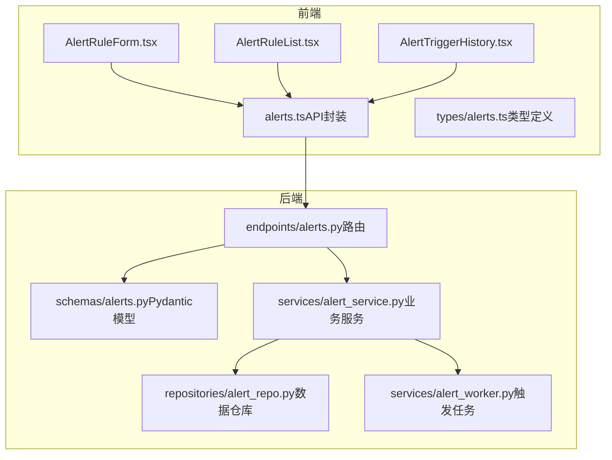
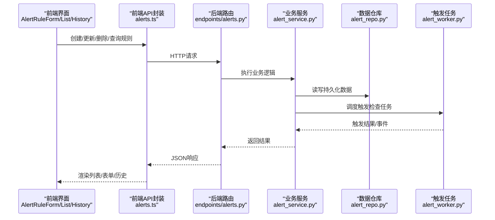
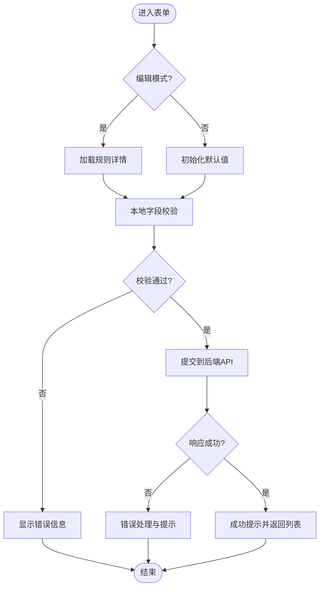
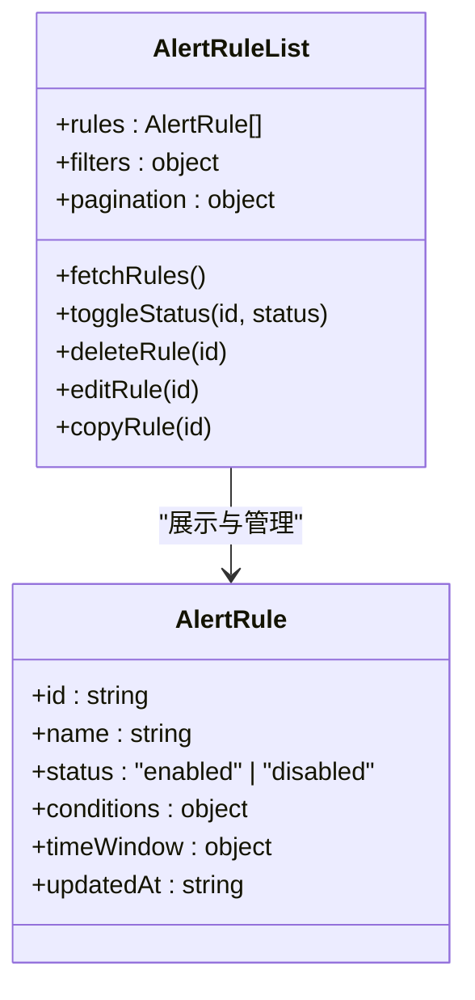
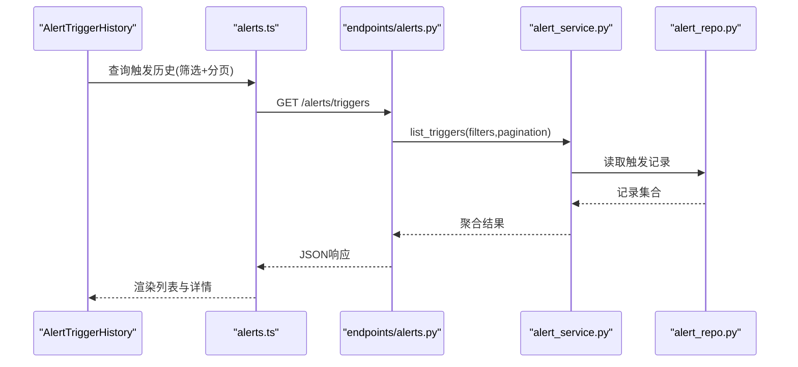
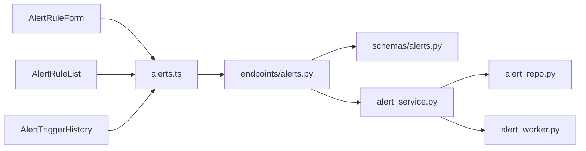

# 告警组件

<cite>
**本文引用的文件**   
- [AlertRuleForm.tsx](file://apps/dsa-web/src/components/alerts/AlertRuleForm.tsx)
- [AlertRuleList.tsx](file://apps/dsa-web/src/components/alerts/AlertRuleList.tsx)
- [AlertTriggerHistory.tsx](file://apps/dsa-web/src/components/alerts/AlertTriggerHistory.tsx)
- [alerts.ts](file://apps/dsa-web/src/api/alerts.ts)
- [alerts.ts（前端类型）](file://apps/dsa-web/src/types/alerts.ts)
- [alerts.py（API路由）](file://api/v1/endpoints/alerts.py)
- [alerts.py（Pydantic模式）](file://api/v1/schemas/alerts.py)
- [alert_service.py](file://src/services/alert_service.py)
- [alert_repo.py](file://src/repositories/alert_repo.py)
- [alert_worker.py](file://src/services/alert_worker.py)
- [alerts.md（文档）](file://docs/alerts.md)
</cite>

## 目录
1. [简介](#简介)
2. [项目结构](#项目结构)
3. [核心组件](#核心组件)
4. [架构总览](#架构总览)
5. [详细组件分析](#详细组件分析)
6. [依赖关系分析](#依赖关系分析)
7. [性能考虑](#性能考虑)
8. [故障排查指南](#故障排查指南)
9. [结论](#结论)
10. [附录](#附录)

## 简介
本文件面向告警系统的用户与开发者，系统性说明以下前端组件与后端能力：
- AlertRuleForm 告警规则表单：创建、编辑告警规则，包含字段校验与交互反馈。
- AlertRuleList 告警规则列表：展示、筛选、分页、删除等管理操作。
- AlertTriggerHistory 触发历史：查看告警触发记录、详情与状态。

同时覆盖告警规则的CRUD流程、表单验证与数据管理、实时数据更新、消息通知、错误处理、数据持久化与性能优化策略，并提供完整的使用示例与最佳实践。

## 项目结构
告警功能涉及前后端多模块协作：
- 前端页面与组件位于 apps/dsa-web/src/components/alerts 下，API 调用封装在 apps/dsa-web/src/api/alerts.ts，类型定义在 apps/dsa-web/src/types/alerts.ts。
- 后端 API 路由与请求/响应模型位于 api/v1/endpoints/alerts.py 与 api/v1/schemas/alerts.py。
- 业务服务层位于 src/services/alert_service.py，仓库层位于 src/repositories/alert_repo.py，后台任务与触发逻辑位于 src/services/alert_worker.py。
- 使用文档参考 docs/alerts.md。

图表来源
- [AlertRuleForm.tsx](file://apps/dsa-web/src/components/alerts/AlertRuleForm.tsx)
- [AlertRuleList.tsx](file://apps/dsa-web/src/components/alerts/AlertRuleList.tsx)
- [AlertTriggerHistory.tsx](file://apps/dsa-web/src/components/alerts/AlertTriggerHistory.tsx)
- [alerts.ts（前端类型）](file://apps/dsa-web/src/types/alerts.ts)
- [alerts.ts（API封装）](file://apps/dsa-web/src/api/alerts.ts)
- [alerts.py（API路由）](file://api/v1/endpoints/alerts.py)
- [alerts.py（Pydantic模式）](file://api/v1/schemas/alerts.py)
- [alert_service.py](file://src/services/alert_service.py)
- [alert_repo.py](file://src/repositories/alert_repo.py)
- [alert_worker.py](file://src/services/alert_worker.py)

章节来源
- [alerts.md（文档）](file://docs/alerts.md)

## 核心组件
- AlertRuleForm：负责告警规则的创建与编辑，包括字段校验、提交、加载默认值、错误提示与成功反馈。
- AlertRuleList：负责告警规则列表的展示、搜索过滤、分页、启用/禁用、删除等操作。
- AlertTriggerHistory：负责告警触发历史的查询、筛选、详情查看与导出。

这些组件通过统一的 API 封装与类型系统协同工作，确保前后端数据结构一致与强类型约束。

章节来源
- [AlertRuleForm.tsx](file://apps/dsa-web/src/components/alerts/AlertRuleForm.tsx)
- [AlertRuleList.tsx](file://apps/dsa-web/src/components/alerts/AlertRuleList.tsx)
- [AlertTriggerHistory.tsx](file://apps/dsa-web/src/components/alerts/AlertTriggerHistory.tsx)
- [alerts.ts（API封装）](file://apps/dsa-web/src/api/alerts.ts)
- [alerts.ts（前端类型）](file://apps/dsa-web/src/types/alerts.ts)

## 架构总览
告警系统采用“前端组件 -> API封装 -> 后端路由 -> 服务层 -> 仓库层/任务队列”的分层架构，保证职责清晰、可测试与可扩展。

图表来源
- [alerts.ts（API封装）](file://apps/dsa-web/src/api/alerts.ts)
- [alerts.py（API路由）](file://api/v1/endpoints/alerts.py)
- [alert_service.py](file://src/services/alert_service.py)
- [alert_repo.py](file://src/repositories/alert_repo.py)
- [alert_worker.py](file://src/services/alert_worker.py)

## 详细组件分析

### AlertRuleForm 告警规则表单
- 功能要点
  - 支持新建与编辑两种模式；编辑时回填规则详情。
  - 字段校验：必填项、数值范围、条件表达式合法性、时间窗口有效性等。
  - 提交流程：本地校验通过后发起API请求，成功后刷新列表并提示。
  - 错误处理：网络异常、服务端校验失败统一捕获并展示。
- 数据流
  - 表单状态管理：初始值、修改值、校验错误、提交中状态。
  - 提交后触发列表刷新或路由跳转。
- 交互设计
  - 即时校验与占位提示；提交按钮禁用态控制；成功/失败Toast提示。

图表来源
- [AlertRuleForm.tsx](file://apps/dsa-web/src/components/alerts/AlertRuleForm.tsx)
- [alerts.ts（API封装）](file://apps/dsa-web/src/api/alerts.ts)

章节来源
- [AlertRuleForm.tsx](file://apps/dsa-web/src/components/alerts/AlertRuleForm.tsx)
- [alerts.ts（API封装）](file://apps/dsa-web/src/api/alerts.ts)

### AlertRuleList 告警规则列表
- 功能要点
  - 列表展示：规则名称、状态、条件摘要、更新时间等。
  - 操作：启用/禁用、编辑、删除、复制规则。
  - 筛选与分页：按名称、状态、时间范围筛选；分页加载。
- 数据管理
  - 列表缓存与增量更新；删除后本地乐观更新。
  - 批量操作与确认对话框。
- 交互设计
  - 空状态与加载骨架屏；操作反馈与撤销机制。

图表来源
- [AlertRuleList.tsx](file://apps/dsa-web/src/components/alerts/AlertRuleList.tsx)
- [alerts.ts（前端类型）](file://apps/dsa-web/src/types/alerts.ts)

章节来源
- [AlertRuleList.tsx](file://apps/dsa-web/src/components/alerts/AlertRuleList.tsx)
- [alerts.ts（前端类型）](file://apps/dsa-web/src/types/alerts.ts)

### AlertTriggerHistory 触发历史
- 功能要点
  - 查询触发记录：按规则、时间范围、状态筛选。
  - 详情查看：触发原因、指标快照、通知渠道与结果。
  - 导出与分享：导出CSV/JSON，生成链接分享。
- 数据流
  - 分页拉取；详情懒加载；状态实时更新（如通知送达）。
- 交互设计
  - 时间轴视图；快速定位与高亮关键信息；错误重试入口。

图表来源
- [AlertTriggerHistory.tsx](file://apps/dsa-web/src/components/alerts/AlertTriggerHistory.tsx)
- [alerts.ts（API封装）](file://apps/dsa-web/src/api/alerts.ts)
- [alerts.py（API路由）](file://api/v1/endpoints/alerts.py)
- [alert_service.py](file://src/services/alert_service.py)
- [alert_repo.py](file://src/repositories/alert_repo.py)

章节来源
- [AlertTriggerHistory.tsx](file://apps/dsa-web/src/components/alerts/AlertTriggerHistory.tsx)
- [alerts.ts（API封装）](file://apps/dsa-web/src/api/alerts.ts)

## 依赖关系分析
- 前端依赖
  - 组件依赖 API 封装与类型定义，确保接口契约稳定。
  - 组件间通过共享状态或路由参数传递上下文（如规则ID）。
- 后端依赖
  - 路由依赖 Pydantic 模型进行请求/响应校验。
  - 服务层依赖仓库层进行数据持久化，依赖任务队列进行异步触发检查。
- 外部集成
  - 通知渠道（邮件、IM、Webhook等）由服务层或任务层调用。
  - 数据源（行情、基本面）由其他服务提供，触发器基于指标计算。

图表来源
- [AlertRuleForm.tsx](file://apps/dsa-web/src/components/alerts/AlertRuleForm.tsx)
- [AlertRuleList.tsx](file://apps/dsa-web/src/components/alerts/AlertRuleList.tsx)
- [AlertTriggerHistory.tsx](file://apps/dsa-web/src/components/alerts/AlertTriggerHistory.tsx)
- [alerts.ts（API封装）](file://apps/dsa-web/src/api/alerts.ts)
- [alerts.py（API路由）](file://api/v1/endpoints/alerts.py)
- [alerts.py（Pydantic模式）](file://api/v1/schemas/alerts.py)
- [alert_service.py](file://src/services/alert_service.py)
- [alert_repo.py](file://src/repositories/alert_repo.py)
- [alert_worker.py](file://src/services/alert_worker.py)

章节来源
- [alerts.py（API路由）](file://api/v1/endpoints/alerts.py)
- [alerts.py（Pydantic模式）](file://api/v1/schemas/alerts.py)
- [alert_service.py](file://src/services/alert_service.py)
- [alert_repo.py](file://src/repositories/alert_repo.py)
- [alert_worker.py](file://src/services/alert_worker.py)

## 性能考虑
- 前端
  - 列表分页与虚拟滚动减少DOM压力。
  - 防抖与节流优化输入与搜索。
  - 局部更新与乐观更新提升交互体验。
- 后端
  - 数据库索引优化查询与筛选。
  - 异步任务解耦触发检查与通知发送。
  - 缓存热点数据（如规则配置、指标阈值）。
- 传输
  - 压缩与最小化Payload。
  - 按需加载详情与懒加载图片。

[本节为通用指导，不直接分析具体文件]

## 故障排查指南
- 常见错误
  - 表单校验失败：检查必填项、数值范围、表达式语法。
  - 网络异常：检查后端服务状态、跨域配置、鉴权令牌。
  - 触发无结果：检查数据源可用性、指标计算逻辑、时间窗口设置。
- 调试建议
  - 前端：打开控制台查看API请求与响应；使用断点调试状态变化。
  - 后端：查看日志与错误堆栈；检查任务队列消费情况。
- 恢复策略
  - 重试机制：对幂等操作实现自动重试与退避。
  - 回滚与补偿：事务性写入与补偿任务。

章节来源
- [alerts.py（API路由）](file://api/v1/endpoints/alerts.py)
- [alert_service.py](file://src/services/alert_service.py)
- [alert_worker.py](file://src/services/alert_worker.py)

## 结论
告警组件通过清晰的前后端分层与强类型契约，实现了规则管理的CRUD、触发历史的可视化与通知的可靠投递。结合表单校验、错误处理与性能优化策略，提供了良好的用户体验与系统稳定性。建议在后续迭代中持续完善指标库、扩展通知渠道与增强监控诊断能力。

[本节为总结，不直接分析具体文件]

## 附录
- 使用示例
  - 创建规则：填写规则名称、选择指标与条件、设置时间窗口，提交后在列表中可见。
  - 编辑规则：从列表进入编辑页，修改条件或阈值，保存后生效。
  - 查看历史：进入触发历史，按时间与状态筛选，查看详情与通知结果。
- 最佳实践
  - 规则命名规范与注释说明。
  - 条件表达式简洁明确，避免复杂嵌套。
  - 合理设置时间窗口与频率限制，降低误报。
  - 定期审查与归档历史，保持系统整洁。

章节来源
- [alerts.md（文档）](file://docs/alerts.md)