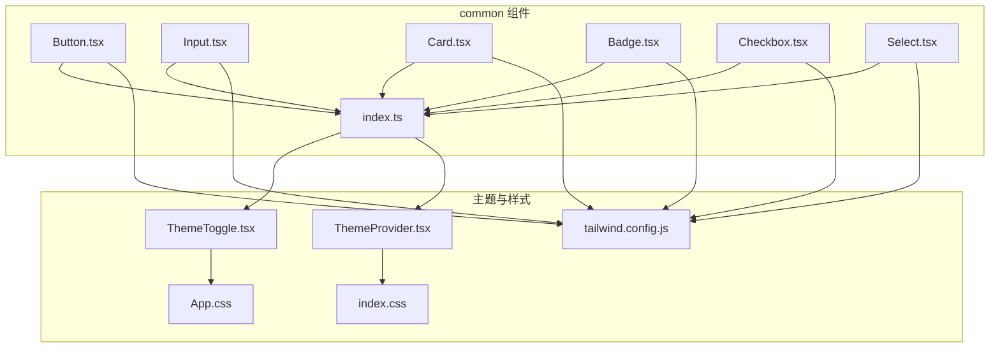
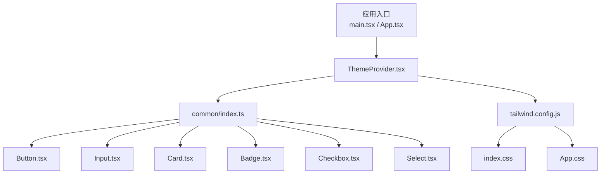
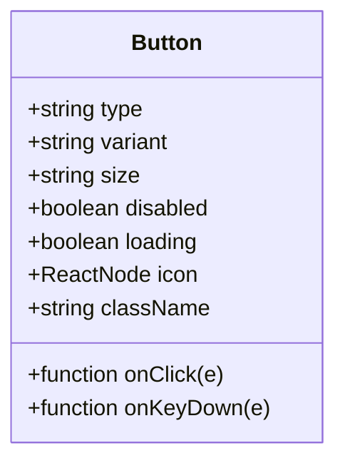
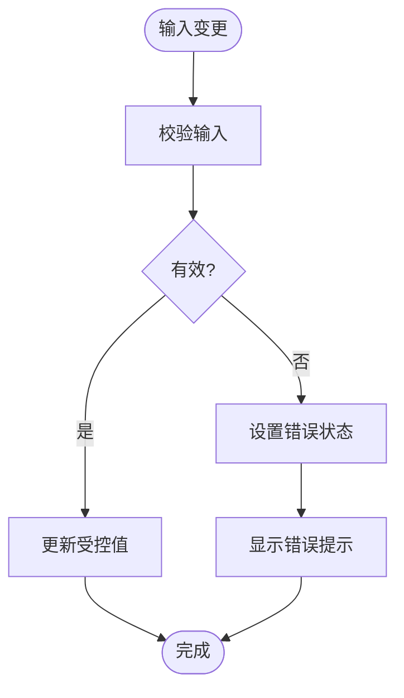
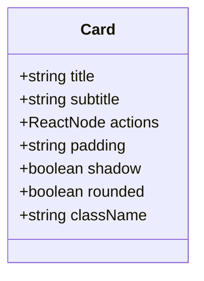
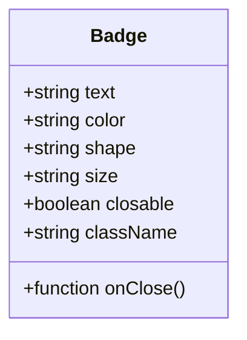
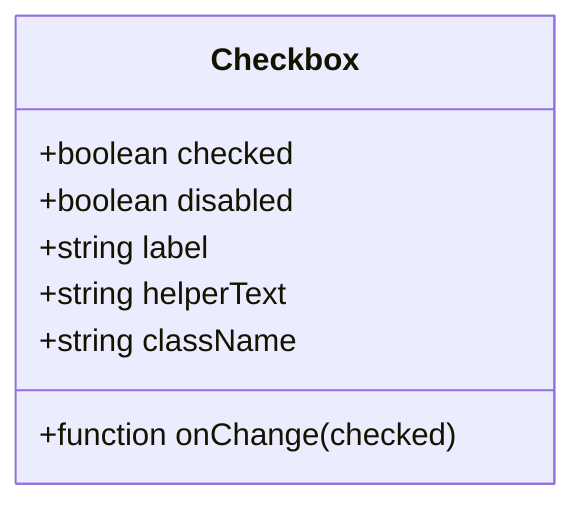
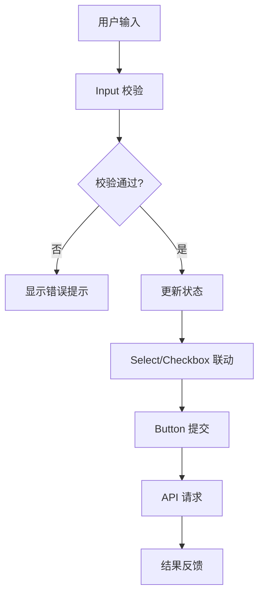
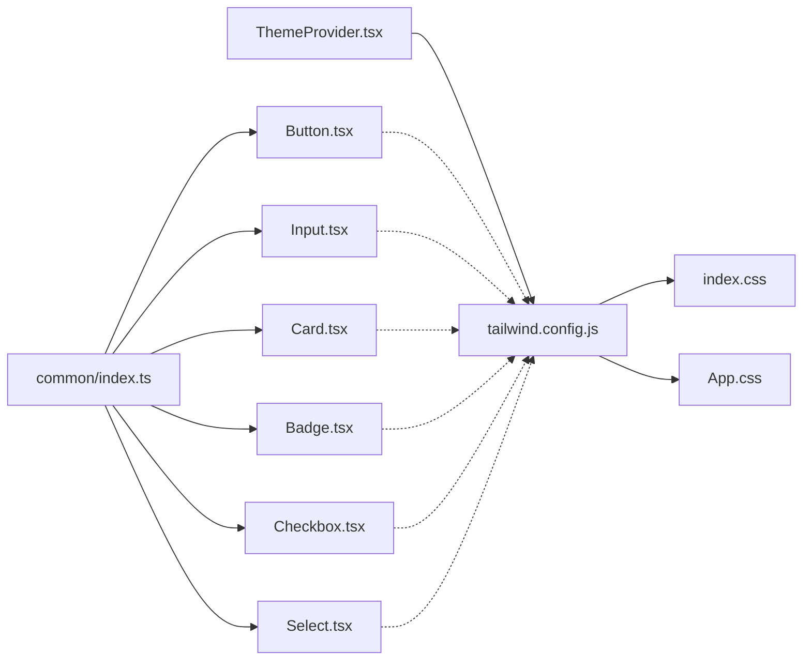

# 基础组件

<cite>
**本文引用的文件**   
- [Button.tsx](file://apps/dsa-web/src/components/common/Button.tsx)
- [Input.tsx](file://apps/dsa-web/src/components/common/Input.tsx)
- [Card.tsx](file://apps/dsa-web/src/components/common/Card.tsx)
- [Badge.tsx](file://apps/dsa-web/src/components/common/Badge.tsx)
- [Checkbox.tsx](file://apps/dsa-web/src/components/common/Checkbox.tsx)
- [Select.tsx](file://apps/dsa-web/src/components/common/Select.tsx)
- [index.ts](file://apps/dsa-web/src/components/common/index.ts)
- [ThemeToggle.tsx](file://apps/dsa-web/src/components/theme/ThemeToggle.tsx)
- [ThemeProvider.tsx](file://apps/dsa-web/src/components/theme/ThemeProvider.tsx)
- [App.css](file://apps/dsa-web/src/App.css)
- [index.css](file://apps/dsa-web/src/index.css)
- [tailwind.config.js](file://apps/dsa-web/tailwind.config.js)
</cite>

## 目录
1. [简介](#简介)
2. [项目结构](#项目结构)
3. [核心组件](#核心组件)
4. [架构总览](#架构总览)
5. [详细组件分析](#详细组件分析)
6. [依赖关系分析](#依赖关系分析)
7. [性能考虑](#性能考虑)
8. [故障排查指南](#故障排查指南)
9. [结论](#结论)
10. [附录](#附录)

## 简介
本文件面向“基础UI组件”的文档，覆盖 Button、Input、Card、Badge、Checkbox、Select 等核心组件。内容包含：
- Props 接口说明（属性、类型、默认值）
- 事件处理与受控/非受控模式
- 样式定制选项（Tailwind 类名、CSS 变量、主题集成）
- 可访问性支持（ARIA、键盘导航、屏幕阅读器友好）
- 响应式设计与布局建议
- 使用示例（不同变体、状态、配置）
- 测试策略与最佳实践

## 项目结构
基础组件位于 apps/dsa-web/src/components/common 目录，统一通过 index.ts 导出，便于上层页面和模块引用。主题相关能力由 theme 目录提供，配合 Tailwind 配置实现全局样式与暗色模式切换。



图表来源
- [Button.tsx](file://apps/dsa-web/src/components/common/Button.tsx)
- [Input.tsx](file://apps/dsa-web/src/components/common/Input.tsx)
- [Card.tsx](file://apps/dsa-web/src/components/common/Card.tsx)
- [Badge.tsx](file://apps/dsa-web/src/components/common/Badge.tsx)
- [Checkbox.tsx](file://apps/dsa-web/src/components/common/Checkbox.tsx)
- [Select.tsx](file://apps/dsa-web/src/components/common/Select.tsx)
- [index.ts](file://apps/dsa-web/src/components/common/index.ts)
- [ThemeToggle.tsx](file://apps/dsa-web/src/components/theme/ThemeToggle.tsx)
- [ThemeProvider.tsx](file://apps/dsa-web/src/components/theme/ThemeProvider.tsx)
- [App.css](file://apps/dsa-web/src/App.css)
- [index.css](file://apps/dsa-web/src/index.css)
- [tailwind.config.js](file://apps/dsa-web/tailwind.config.js)

章节来源
- [index.ts](file://apps/dsa-web/src/components/common/index.ts)
- [tailwind.config.js](file://apps/dsa-web/tailwind.config.js)

## 核心组件
本节概述各组件的职责、常用属性与行为约定，后续章节将给出更详细的接口与示例。

- Button
  - 用途：触发操作或跳转，支持多种尺寸、颜色、禁用态、加载态
  - 关键属性：类型、尺寸、颜色、是否禁用、是否加载中、图标、点击回调
  - 事件：onClick、onKeyDown（Enter/Space 触发）
  - 可访问性：role="button"、tabIndex、aria-* 语义
  - 样式：Tailwind 类名组合，支持主题色与暗色模式

- Input
  - 用途：文本输入，支持占位符、只读、禁用、错误提示
  - 关键属性：value、onChange、placeholder、disabled、readOnly、error、helperText
  - 事件：onChange、onFocus、onBlur、onKeyDown
  - 可访问性：label 关联、aria-invalid、aria-describedby
  - 样式：边框、焦点态、错误态、前缀/后缀插槽

- Card
  - 用途：信息容器，用于分组展示
  - 关键属性：标题、副标题、动作区、内边距、阴影、圆角
  - 事件：无特定交互事件，通常承载子组件
  - 可访问性：语义化标签、标题层级
  - 样式：背景、边框、阴影、间距

- Badge
  - 用途：状态标记、计数、标签
  - 关键属性：文本、颜色、形状、大小、是否可关闭
  - 事件：onClose（可关闭时）
  - 可访问性：aria-label、role="status"
  - 样式：颜色映射、圆角、内边距

- Checkbox
  - 用途：多选开关
  - 关键属性：checked、onChange、disabled、label、helperText
  - 事件：onChange、onFocus、onBlur
  - 可访问性：aria-checked、label 关联
  - 样式：选中态、禁用态、错误态

- Select
  - 用途：下拉选择，支持单选/多选、搜索、禁用
  - 关键属性：options、value、onChange、placeholder、disabled、multiple、searchable
  - 事件：onChange、onOpenChange、onSearch
  - 可访问性：aria-expanded、aria-activedescendant、键盘导航
  - 样式：下拉面板、高亮项、空状态

章节来源
- [Button.tsx](file://apps/dsa-web/src/components/common/Button.tsx)
- [Input.tsx](file://apps/dsa-web/src/components/common/Input.tsx)
- [Card.tsx](file://apps/dsa-web/src/components/common/Card.tsx)
- [Badge.tsx](file://apps/dsa-web/src/components/common/Badge.tsx)
- [Checkbox.tsx](file://apps/dsa-web/src/components/common/Checkbox.tsx)
- [Select.tsx](file://apps/dsa-web/src/components/common/Select.tsx)

## 架构总览
组件层基于 React + TypeScript，样式采用 Tailwind CSS，主题通过 ThemeProvider 注入，按钮、输入框等组件通过统一的类名策略与 CSS 变量适配明暗主题。



图表来源
- [ThemeProvider.tsx](file://apps/dsa-web/src/components/theme/ThemeProvider.tsx)
- [index.ts](file://apps/dsa-web/src/components/common/index.ts)
- [Button.tsx](file://apps/dsa-web/src/components/common/Button.tsx)
- [Input.tsx](file://apps/dsa-web/src/components/common/Input.tsx)
- [Card.tsx](file://apps/dsa-web/src/components/common/Card.tsx)
- [Badge.tsx](file://apps/dsa-web/src/components/common/Badge.tsx)
- [Checkbox.tsx](file://apps/dsa-web/src/components/common/Checkbox.tsx)
- [Select.tsx](file://apps/dsa-web/src/components/common/Select.tsx)
- [tailwind.config.js](file://apps/dsa-web/tailwind.config.js)
- [index.css](file://apps/dsa-web/src/index.css)
- [App.css](file://apps/dsa-web/src/App.css)

## 详细组件分析

### Button 组件
- 职责：提供可点击的操作入口，支持多种视觉变体与交互状态
- 关键属性
  - type: "button" | "submit" | "reset"
  - variant: "primary" | "secondary" | "outline" | "ghost" | "danger"
  - size: "sm" | "md" | "lg"
  - disabled: boolean
  - loading: boolean
  - icon: ReactNode（可选前置/后置图标）
  - onClick: (e) => void
  - onKeyDown: (e) => void
  - className: string（自定义类名）
- 事件处理
  - 点击：阻止默认行为（如表单提交），调用 onClick
  - 键盘：Enter/Space 触发点击，确保无障碍体验
- 样式定制
  - 通过 Tailwind 类名组合控制颜色、尺寸、阴影、圆角
  - 支持禁用态与加载态（旋转图标）
- 可访问性
  - role="button"（当为 div/span 时）
  - tabIndex=0（可聚焦）
  - aria-disabled、aria-busy（loading）
- 响应式
  - 在小屏上自动调整内边距与字号
- 使用示例
  - 主按钮、次按钮、危险按钮、禁用、加载中、带图标、全宽按钮



图表来源
- [Button.tsx](file://apps/dsa-web/src/components/common/Button.tsx)

章节来源
- [Button.tsx](file://apps/dsa-web/src/components/common/Button.tsx)

### Input 组件
- 职责：文本输入控件，支持校验提示与辅助文本
- 关键属性
  - value: string
  - onChange: (e) => void
  - placeholder: string
  - disabled: boolean
  - readOnly: boolean
  - error: string
  - helperText: string
  - prefix/suffix: ReactNode
  - className: string
- 事件处理
  - onChange：更新受控值
  - onFocus/onBlur：焦点管理
  - onKeyDown：回车提交（可选）
- 样式定制
  - 边框颜色、焦点环、错误红色、辅助文本灰色
  - 前缀/后缀插槽（图标、按钮）
- 可访问性
  - label 关联 htmlFor/id
  - aria-invalid（错误）、aria-describedby（辅助文本）
- 响应式
  - 宽度自适应，移动端增大触控区域
- 使用示例
  - 普通输入、只读、禁用、错误提示、带前缀/后缀、受控与非受控



图表来源
- [Input.tsx](file://apps/dsa-web/src/components/common/Input.tsx)

章节来源
- [Input.tsx](file://apps/dsa-web/src/components/common/Input.tsx)

### Card 组件
- 职责：信息容器，用于组织内容与动作
- 关键属性
  - title: string
  - subtitle: string
  - actions: ReactNode（操作区）
  - padding: "none" | "sm" | "md" | "lg"
  - shadow: boolean
  - rounded: boolean
  - className: string
- 事件处理
  - 无特定交互事件，通常承载子组件
- 样式定制
  - 背景、边框、阴影、圆角、内边距
- 可访问性
  - 语义化标题层级（h2/h3）
- 响应式
  - 卡片在不同屏幕下自适应宽度与间距
- 使用示例
  - 基础卡片、带标题与副标题、含操作按钮、无边框风格



图表来源
- [Card.tsx](file://apps/dsa-web/src/components/common/Card.tsx)

章节来源
- [Card.tsx](file://apps/dsa-web/src/components/common/Card.tsx)

### Badge 组件
- 职责：状态标记、计数、标签
- 关键属性
  - text: string
  - color: "default" | "success" | "warning" | "danger" | "info"
  - shape: "pill" | "rounded" | "square"
  - size: "sm" | "md" | "lg"
  - closable: boolean
  - onClose: () => void
  - className: string
- 事件处理
  - onClose：关闭时触发
- 样式定制
  - 颜色映射、圆角、内边距
- 可访问性
  - aria-label、role="status"
- 使用示例
  - 成功、警告、危险、可关闭、不同尺寸



图表来源
- [Badge.tsx](file://apps/dsa-web/src/components/common/Badge.tsx)

章节来源
- [Badge.tsx](file://apps/dsa-web/src/components/common/Badge.tsx)

### Checkbox 组件
- 职责：多选开关
- 关键属性
  - checked: boolean
  - onChange: (checked) => void
  - disabled: boolean
  - label: string
  - helperText: string
  - className: string
- 事件处理
  - onChange：切换状态
  - onFocus/onBlur：焦点管理
- 样式定制
  - 选中态、禁用态、错误态
- 可访问性
  - aria-checked、label 关联
- 使用示例
  - 基本用法、禁用、带辅助文本、错误状态



图表来源
- [Checkbox.tsx](file://apps/dsa-web/src/components/common/Checkbox.tsx)

章节来源
- [Checkbox.tsx](file://apps/dsa-web/src/components/common/Checkbox.tsx)

### Select 组件
- 职责：下拉选择，支持单选/多选、搜索、禁用
- 关键属性
  - options: Array<{label, value}>
  - value: string | string[]
  - onChange: (value) => void
  - placeholder: string
  - disabled: boolean
  - multiple: boolean
  - searchable: boolean
  - onSearch: (query) => void
  - className: string
- 事件处理
  - onChange：选择变化
  - onOpenChange：打开/关闭
  - onSearch：搜索过滤
- 样式定制
  - 下拉面板、高亮项、空状态
- 可访问性
  - aria-expanded、aria-activedescendant、键盘导航（上下键、回车、Esc）
- 使用示例
  - 单选、多选、搜索、禁用、空状态

```mermaid
sequenceDiagram
participant U as "用户"
participant Sel as "Select.tsx"
participant Opt as "选项列表"
participant CB as "回调 onChange"
U->>Sel : "点击下拉"
Sel-->>U : "展开面板"
U->>Sel : "选择某项"
Sel->>Opt : "匹配选项"
Sel-->>CB : "触发 onChange(value)"
Sel-->>U : "收起面板"
```

图表来源
- [Select.tsx](file://apps/dsa-web/src/components/common/Select.tsx)

章节来源
- [Select.tsx](file://apps/dsa-web/src/components/common/Select.tsx)

### 概念总览
以下流程图展示了通用组件在表单中的协作方式：



[此图为概念流程，不直接对应具体源码文件]

## 依赖关系分析
组件之间低耦合，主要通过 props 传递数据与事件；主题通过 ThemeProvider 注入，样式通过 Tailwind 配置统一管理。



图表来源
- [ThemeProvider.tsx](file://apps/dsa-web/src/components/theme/ThemeProvider.tsx)
- [tailwind.config.js](file://apps/dsa-web/tailwind.config.js)
- [index.css](file://apps/dsa-web/src/index.css)
- [App.css](file://apps/dsa-web/src/App.css)
- [index.ts](file://apps/dsa-web/src/components/common/index.ts)
- [Button.tsx](file://apps/dsa-web/src/components/common/Button.tsx)
- [Input.tsx](file://apps/dsa-web/src/components/common/Input.tsx)
- [Card.tsx](file://apps/dsa-web/src/components/common/Card.tsx)
- [Badge.tsx](file://apps/dsa-web/src/components/common/Badge.tsx)
- [Checkbox.tsx](file://apps/dsa-web/src/components/common/Checkbox.tsx)
- [Select.tsx](file://apps/dsa-web/src/components/common/Select.tsx)

章节来源
- [index.ts](file://apps/dsa-web/src/components/common/index.ts)
- [tailwind.config.js](file://apps/dsa-web/tailwind.config.js)

## 性能考虑
- 避免不必要的重渲染：对复杂组件使用 memo/useCallback/useMemo
- 大列表 Select：虚拟化滚动或分页加载
- Input 防抖：长文本输入时使用 debounce
- 主题切换：最小化 DOM 操作，利用 CSS 变量
- 图标与图片：懒加载与缓存

[本节为通用指导，不直接分析具体文件]

## 故障排查指南
- 样式未生效
  - 检查 Tailwind 配置是否正确引入
  - 确认 className 未被覆盖
- 事件未触发
  - 检查 disabled/loading 状态
  - 确认 onClick/onKeyDown 绑定正确
- 可访问性问题
  - 验证 aria-* 属性与键盘导航
  - 使用浏览器开发者工具进行无障碍审计
- 主题不一致
  - 确认 ThemeProvider 包裹根节点
  - 检查 CSS 变量与 Tailwind 主题映射

章节来源
- [ThemeToggle.tsx](file://apps/dsa-web/src/components/theme/ThemeToggle.tsx)
- [ThemeProvider.tsx](file://apps/dsa-web/src/components/theme/ThemeProvider.tsx)
- [tailwind.config.js](file://apps/dsa-web/tailwind.config.js)

## 结论
基础组件以 React + TypeScript 构建，结合 Tailwind 与主题提供者，形成一致、可访问、可定制的 UI 体系。通过明确的 Props 接口、事件模型与样式策略，可在不同业务场景中快速复用与扩展。

[本节为总结，不直接分析具体文件]

## 附录
- 使用示例清单（按组件分类）
  - Button：主/次/危险、禁用、加载中、带图标、全宽
  - Input：普通/只读/禁用、错误提示、前缀/后缀、受控/非受控
  - Card：基础/带标题/含操作/无边框
  - Badge：颜色/形状/尺寸/可关闭
  - Checkbox：基本/禁用/辅助文本/错误
  - Select：单选/多选/搜索/禁用/空状态
- 测试策略
  - 单元测试：Props 边界、事件触发、状态切换
  - 可访问性测试：键盘导航、屏幕阅读器
  - 快照测试：渲染输出一致性
  - E2E 测试：用户交互流程
- 最佳实践
  - 受控组件优先，保持单一数据源
  - 合理拆分子组件，提升复用性
  - 遵循 WAI-ARIA 规范，保证无障碍
  - 使用 Tailwind 原子类，减少重复样式

[本节为补充信息，不直接分析具体文件]