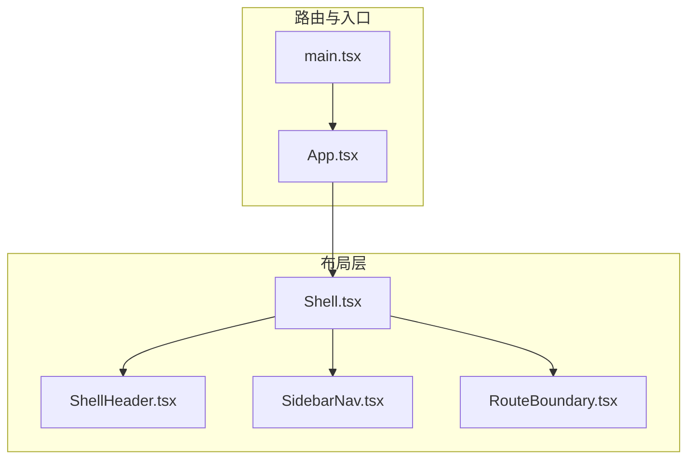
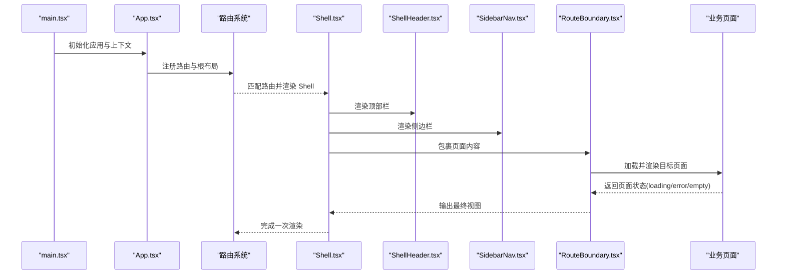
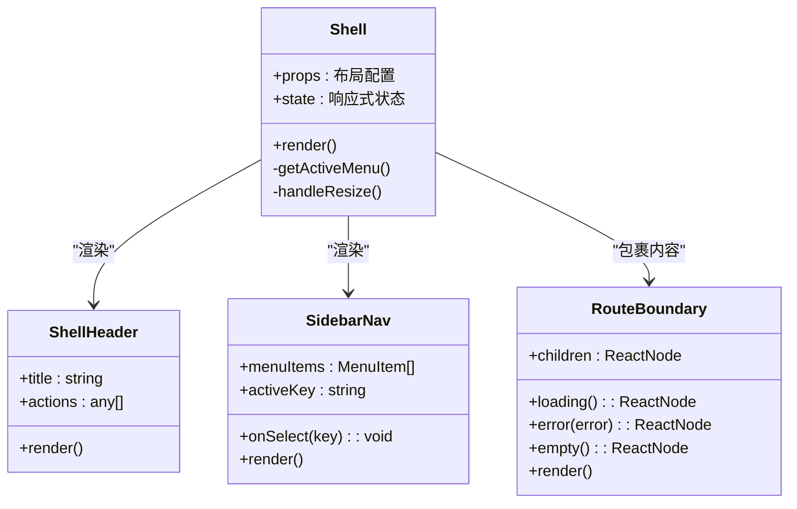
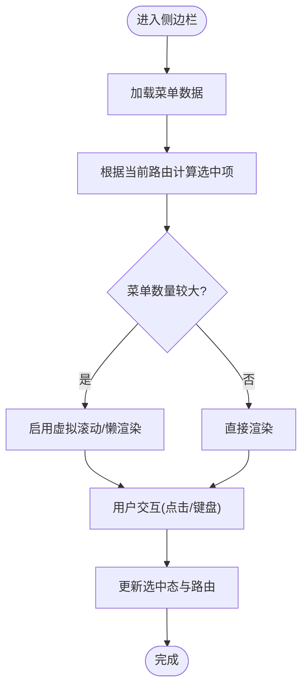
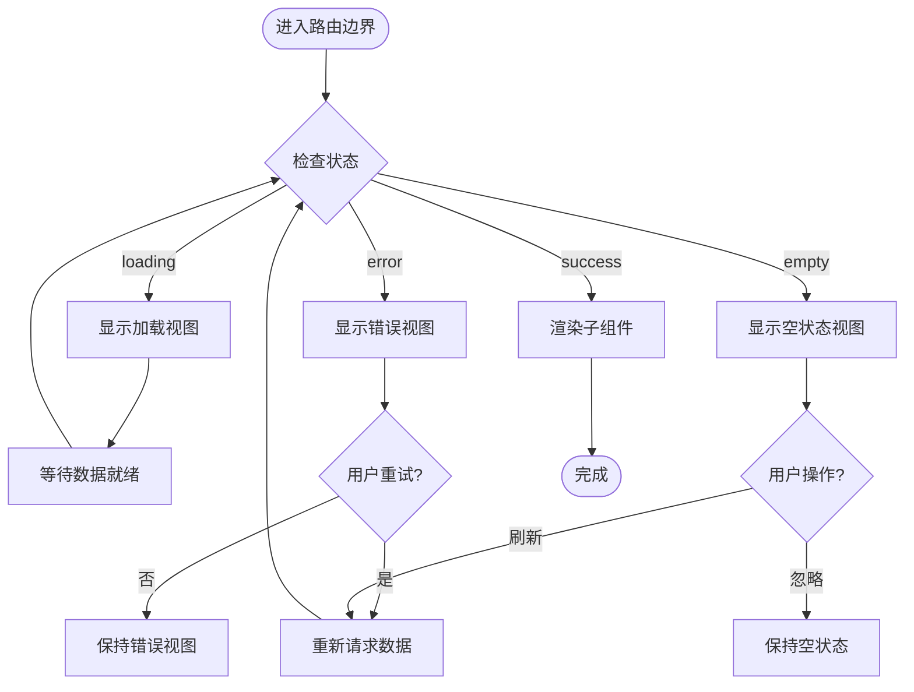
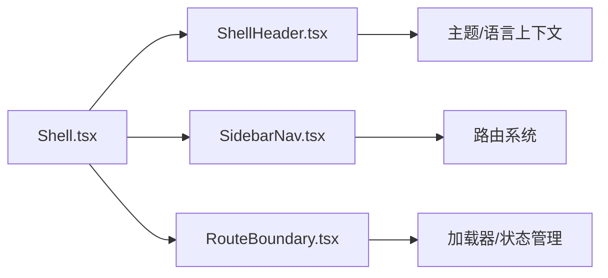

# 布局组件

<cite>
**本文引用的文件**   
- [Shell.tsx](file://apps/dsa-web/src/components/layout/Shell.tsx)
- [SidebarNav.tsx](file://apps/dsa-web/src/components/layout/SidebarNav.tsx)
- [RouteBoundary.tsx](file://apps/dsa-web/src/components/layout/RouteBoundary.tsx)
- [ShellHeader.tsx](file://apps/dsa-web/src/components/layout/ShellHeader.tsx)
- [App.tsx](file://apps/dsa-web/src/App.tsx)
- [main.tsx](file://apps/dsa-web/src/main.tsx)
</cite>

## 目录
1. [简介](#简介)
2. [项目结构](#项目结构)
3. [核心组件](#核心组件)
4. [架构总览](#架构总览)
5. [详细组件分析](#详细组件分析)
6. [依赖关系分析](#依赖关系分析)
7. [性能考虑](#性能考虑)
8. [故障排查指南](#故障排查指南)
9. [结论](#结论)
10. [附录：使用示例与最佳实践](#附录使用示例与最佳实践)

## 简介
本文件聚焦于 Web 前端应用中的布局体系，围绕 Shell 页面框架、SidebarNav 侧边栏导航、RouteBoundary 路由边界等关键布局组件进行系统化说明。内容涵盖页面结构组织、导航模式实现、路由管理策略、响应式适配与移动端支持、性能优化方法，以及组合模式与扩展方式，帮助读者快速掌握并高效复用布局能力。

## 项目结构
布局相关代码位于 apps/dsa-web/src/components/layout 目录下，包含以下核心文件：
- Shell.tsx：应用级外壳容器，负责整体布局骨架与全局状态注入
- SidebarNav.tsx：侧边栏导航，提供菜单项渲染、选中态与交互
- RouteBoundary.tsx：路由边界，封装加载、错误与空状态处理
- ShellHeader.tsx：顶部栏，承载标题、操作按钮与用户信息
- App.tsx：应用入口，注册路由与根布局
- main.tsx：应用启动与上下文初始化

图表来源
- [Shell.tsx](file://apps/dsa-web/src/components/layout/Shell.tsx)
- [SidebarNav.tsx](file://apps/dsa-web/src/components/layout/SidebarNav.tsx)
- [RouteBoundary.tsx](file://apps/dsa-web/src/components/layout/RouteBoundary.tsx)
- [ShellHeader.tsx](file://apps/dsa-web/src/components/layout/ShellHeader.tsx)
- [App.tsx](file://apps/dsa-web/src/App.tsx)
- [main.tsx](file://apps/dsa-web/src/main.tsx)

章节来源
- [Shell.tsx](file://apps/dsa-web/src/components/layout/Shell.tsx)
- [SidebarNav.tsx](file://apps/dsa-web/src/components/layout/SidebarNav.tsx)
- [RouteBoundary.tsx](file://apps/dsa-web/src/components/layout/RouteBoundary.tsx)
- [ShellHeader.tsx](file://apps/dsa-web/src/components/layout/ShellHeader.tsx)
- [App.tsx](file://apps/dsa-web/src/App.tsx)
- [main.tsx](file://apps/dsa-web/src/main.tsx)

## 核心组件
- Shell（页面外壳）
  - 职责：定义应用整体布局结构，集成头部、侧边栏与主内容区；提供响应式行为与主题/语言等上下文注入点。
  - 关键点：通过 props 或上下文暴露可配置项（如是否显示侧边栏、头部样式），在移动端自动切换为抽屉式或隐藏式导航。
- SidebarNav（侧边栏导航）
  - 职责：渲染菜单项、处理选中态、折叠/展开逻辑，支持多级菜单与图标/文本展示。
  - 关键点：根据当前路由高亮对应菜单项；在小屏设备下以抽屉形式呈现，避免遮挡主内容。
- RouteBoundary（路由边界）
  - 职责：统一处理路由级别的加载、错误与空状态；保证页面切换时的用户体验一致性。
  - 关键点：封装 loading/error/empty 三种状态视图，支持自定义渲染与重试机制。
- ShellHeader（顶部栏）
  - 职责：展示页面标题、全局操作按钮、用户信息与国际化切换等。
  - 关键点：与 Shell 协同控制布局宽度与间距，适配不同屏幕尺寸。

章节来源
- [Shell.tsx](file://apps/dsa-web/src/components/layout/Shell.tsx)
- [SidebarNav.tsx](file://apps/dsa-web/src/components/layout/SidebarNav.tsx)
- [RouteBoundary.tsx](file://apps/dsa-web/src/components/layout/RouteBoundary.tsx)
- [ShellHeader.tsx](file://apps/dsa-web/src/components/layout/ShellHeader.tsx)

## 架构总览
下图展示了从应用启动到页面渲染的布局装配流程，以及各组件之间的协作关系。

图表来源
- [main.tsx](file://apps/dsa-web/src/main.tsx)
- [App.tsx](file://apps/dsa-web/src/App.tsx)
- [Shell.tsx](file://apps/dsa-web/src/components/layout/Shell.tsx)
- [ShellHeader.tsx](file://apps/dsa-web/src/components/layout/ShellHeader.tsx)
- [SidebarNav.tsx](file://apps/dsa-web/src/components/layout/SidebarNav.tsx)
- [RouteBoundary.tsx](file://apps/dsa-web/src/components/layout/RouteBoundary.tsx)

## 详细组件分析

### Shell 页面框架
- 设计要点
  - 作为应用外壳，统一管理头部、侧边栏与内容区的布局比例与间距。
  - 提供响应式断点判断，决定侧边栏的显示模式（固定/抽屉）。
  - 将主题、语言、用户信息等上下文注入子树，确保全局一致性。
- 数据流
  - 接收路由参数与页面元信息，驱动头部标题与面包屑。
  - 根据当前路由计算侧边栏选中项，保持导航与路由同步。
- 扩展点
  - 通过 props 或上下文开关控制头部/侧边栏显隐。
  - 支持插槽或 children 注入自定义内容区域。

图表来源
- [Shell.tsx](file://apps/dsa-web/src/components/layout/Shell.tsx)
- [ShellHeader.tsx](file://apps/dsa-web/src/components/layout/ShellHeader.tsx)
- [SidebarNav.tsx](file://apps/dsa-web/src/components/layout/SidebarNav.tsx)
- [RouteBoundary.tsx](file://apps/dsa-web/src/components/layout/RouteBoundary.tsx)

章节来源
- [Shell.tsx](file://apps/dsa-web/src/components/layout/Shell.tsx)

### SidebarNav 侧边栏导航
- 设计要点
  - 菜单数据结构化，支持分组、图标、描述与权限控制。
  - 选中态基于当前路由 key 计算，支持精确匹配与前缀匹配。
  - 小屏模式下切换为抽屉式导航，避免遮挡主内容。
- 交互流程
  - 点击菜单项触发路由跳转，更新选中态。
  - 支持键盘导航与无障碍属性，提升可访问性。
- 性能优化
  - 对菜单列表进行懒渲染或虚拟滚动（当菜单项较多时）。
  - 使用 memo 或 useMemo 缓存计算结果，减少重渲染。

图表来源
- [SidebarNav.tsx](file://apps/dsa-web/src/components/layout/SidebarNav.tsx)

章节来源
- [SidebarNav.tsx](file://apps/dsa-web/src/components/layout/SidebarNav.tsx)

### RouteBoundary 路由边界
- 设计要点
  - 统一封装路由级别的状态视图：加载中、错误、空数据。
  - 支持自定义渲染函数与重试机制，便于业务定制。
  - 与 Suspense/ErrorBoundary 配合，提升健壮性。
- 处理流程
  - 根据数据加载状态与异常信息选择对应视图。
  - 提供重试按钮与错误日志上报接口。
- 扩展点
  - 允许传入不同的 loading/error/empty 组件替换默认实现。
  - 支持埋点统计与监控指标上报。

图表来源
- [RouteBoundary.tsx](file://apps/dsa-web/src/components/layout/RouteBoundary.tsx)

章节来源
- [RouteBoundary.tsx](file://apps/dsa-web/src/components/layout/RouteBoundary.tsx)

### ShellHeader 顶部栏
- 设计要点
  - 展示页面标题、操作按钮、用户信息与国际化切换。
  - 与 Shell 协同控制布局宽度与间距，适配不同屏幕尺寸。
- 交互流程
  - 点击操作按钮触发回调（如打开设置、退出登录）。
  - 支持下拉菜单与快捷键。
- 扩展点
  - 允许插入自定义右侧区域（如通知、搜索框）。

章节来源
- [ShellHeader.tsx](file://apps/dsa-web/src/components/layout/ShellHeader.tsx)

## 依赖关系分析
- 组件耦合度
  - Shell 作为顶层容器，依赖 ShellHeader、SidebarNav、RouteBoundary，形成松耦合的组合关系。
  - SidebarNav 依赖路由状态，但不直接持有路由实例，降低耦合。
  - RouteBoundary 仅关注状态视图，不关心业务逻辑，具备良好内聚性。
- 外部依赖
  - 路由系统（如 React Router）用于导航与匹配。
  - 上下文（主题、语言、用户信息）由上层提供者注入。
- 潜在循环依赖
  - 通过 props 与上下文解耦，避免组件间直接相互引用。

图表来源
- [Shell.tsx](file://apps/dsa-web/src/components/layout/Shell.tsx)
- [SidebarNav.tsx](file://apps/dsa-web/src/components/layout/SidebarNav.tsx)
- [RouteBoundary.tsx](file://apps/dsa-web/src/components/layout/RouteBoundary.tsx)
- [ShellHeader.tsx](file://apps/dsa-web/src/components/layout/ShellHeader.tsx)

章节来源
- [Shell.tsx](file://apps/dsa-web/src/components/layout/Shell.tsx)
- [SidebarNav.tsx](file://apps/dsa-web/src/components/layout/SidebarNav.tsx)
- [RouteBoundary.tsx](file://apps/dsa-web/src/components/layout/RouteBoundary.tsx)
- [ShellHeader.tsx](file://apps/dsa-web/src/components/layout/ShellHeader.tsx)

## 性能考虑
- 渲染优化
  - 使用 React.memo、useMemo、useCallback 减少不必要的重渲染。
  - 对长列表（如菜单项）采用虚拟滚动或分页加载。
- 资源加载
  - 路由级懒加载与代码分割，按需加载页面组件。
  - 图片与图标资源延迟加载与缓存。
- 交互体验
  - 骨架屏与占位符提升感知性能。
  - 防抖/节流处理高频事件（如窗口大小变化）。
- 内存管理
  - 及时清理定时器与事件监听器，避免内存泄漏。
  - 大对象与复杂计算结果缓存与失效策略。

## 故障排查指南
- 常见问题
  - 侧边栏未高亮：检查路由 key 与菜单项映射是否正确。
  - 移动端导航遮挡：确认断点判断与抽屉开关逻辑。
  - 路由边界一直显示错误：查看网络请求与异常捕获逻辑。
- 调试建议
  - 使用浏览器开发者工具检查组件树与状态。
  - 添加日志与埋点，定位问题发生阶段。
  - 编写单元测试覆盖边界条件与异常路径。

章节来源
- [RouteBoundary.tsx](file://apps/dsa-web/src/components/layout/RouteBoundary.tsx)
- [SidebarNav.tsx](file://apps/dsa-web/src/components/layout/SidebarNav.tsx)

## 结论
本布局体系以 Shell 为核心，结合 SidebarNav 与 RouteBoundary 实现了清晰、可扩展且高性能的页面框架。通过响应式设计与组合模式，能够灵活适配多端场景，并为业务页面提供一致的加载、错误与空状态体验。建议在后续迭代中持续优化性能与可访问性，完善文档与示例，提升团队开发效率。

## 附录：使用示例与最佳实践
- 构建复杂页面结构
  - 在 Shell 中嵌套多个 RouteBoundary，分别管理不同模块的数据加载与错误处理。
  - 使用 SidebarNav 的多级菜单组织功能入口，结合权限控制动态渲染。
- 响应式布局适配
  - 利用断点判断切换侧边栏显示模式，确保移动端体验流畅。
  - 头部栏在小屏设备上简化操作按钮，突出核心功能。
- 性能优化策略
  - 对路由组件进行懒加载，减少初始包体积。
  - 使用虚拟滚动优化长列表渲染，提升交互流畅度。
- 组合模式与扩展方法
  - 通过 props 与上下文注入自定义头部与侧边栏，实现主题与品牌定制。
  - 扩展 RouteBoundary 的 loading/error/empty 视图，满足业务特定需求。

章节来源
- [App.tsx](file://apps/dsa-web/src/App.tsx)
- [main.tsx](file://apps/dsa-web/src/main.tsx)