# 设置组件

<cite>
**本文引用的文件**   
- [apps/dsa-web/src/components/settings/SettingsPanelErrorBoundary.tsx](file://apps/dsa-web/src/components/settings/SettingsPanelErrorBoundary.tsx)
- [apps/dsa-web/src/components/settings/SettingsSectionCard.tsx](file://apps/dsa-web/src/components/settings/SettingsSectionCard.tsx)
- [apps/dsa-web/src/components/settings/SettingsField.tsx](file://apps/dsa-web/src/components/settings/SettingsField.tsx)
- [apps/dsa-web/src/components/settings/SettingsCategoryNav.tsx](file://apps/dsa-web/src/components/settings/SettingsCategoryNav.tsx)
- [apps/dsa-web/src/components/settings/AuthSettingsCard.tsx](file://apps/dsa-web/src/components/settings/AuthSettingsCard.tsx)
- [apps/dsa-web/src/components/settings/ChangePasswordCard.tsx](file://apps/dsa-web/src/components/settings/ChangePasswordCard.tsx)
- [apps/dsa-web/src/components/settings/IntelligentImport.tsx](file://apps/dsa-web/src/components/settings/IntelligentImport.tsx)
- [apps/dsa-web/src/components/settings/LLMChannelEditor.tsx](file://apps/dsa-web/src/components/settings/LLMChannelEditor.tsx)
- [apps/dsa-web/src/components/settings/NotificationTestPanel.tsx](file://apps/dsa-web/src/components/settings/NotificationTestPanel.tsx)
- [apps/dsa-web/src/components/settings/SettingsHelpButton.tsx](file://apps/dsa-web/src/components/settings/SettingsHelpButton.tsx)
- [apps/dsa-web/src/components/settings/SettingsLoading.tsx](file://apps/dsa-web/src/components/settings/SettingsLoading.tsx)
- [apps/dsa-web/src/components/settings/index.ts](file://apps/dsa-web/src/components/settings/index.ts)
- [apps/dsa-web/src/components/settings/llmProviderTemplates.ts](file://apps/dsa-web/src/components/settings/llmProviderTemplates.ts)
- [apps/dsa-web/src/pages/SettingsPage.tsx](file://apps/dsa-web/src/pages/SettingsPage.tsx)
- [apps/dsa-web/src/hooks/useSystemConfig.ts](file://apps/dsa-web/src/hooks/useSystemConfig.ts)
- [apps/dsa-web/src/api/systemConfig.ts](file://apps/dsa-web/src/api/systemConfig.ts)
- [api/v1/endpoints/system_config.py](file://api/v1/endpoints/system_config.py)
- [api/v1/schemas/system_config.py](file://api/v1/schemas/system_config.py)
- [src/services/system_config_service.py](file://src/services/system_config_service.py)
- [src/core/config_manager.py](file://src/core/config_manager.py)
- [src/core/config_registry.py](file://src/core/config_registry.py)
- [apps/dsa-web/src/types/systemConfig.ts](file://apps/dsa-web/src/types/systemConfig.ts)
- [apps/dsa-web/src/utils/systemConfigI18n.ts](file://apps/dsa-web/src/utils/systemConfigI18n.ts)
- [apps/dsa-web/src/components/theme/ThemeProvider.tsx](file://apps/dsa-web/src/components/theme/ThemeProvider.tsx)
- [apps/dsa-web/src/components/theme/ThemeToggle.tsx](file://apps/dsa-web/src/components/theme/ThemeToggle.tsx)
- [apps/dsa-web/src/contexts/UiLanguageContext.tsx](file://apps/dsa-web/src/contexts/UiLanguageContext.tsx)
- [apps/dsa-web/src/i18n/uiText.ts](file://apps/dsa-web/src/i18n/uiText.ts)
- [apps/dsa-web/src/locales/settingsHelp.ts](file://apps/dsa-web/src/locales/settingsHelp.ts)
</cite>

## 目录
1. [简介](#简介)
2. [项目结构](#项目结构)
3. [核心组件](#核心组件)
4. [架构总览](#架构总览)
5. [详细组件分析](#详细组件分析)
6. [依赖关系分析](#依赖关系分析)
7. [性能考虑](#性能考虑)
8. [故障排查指南](#故障排查指南)
9. [结论](#结论)
10. [附录](#附录)

## 简介
本文件聚焦“设置与主题”相关的前端组件、API 与服务层实现，系统性说明用户偏好设置、系统配置管理、主题切换器与国际化支持。文档涵盖：
- 设置面板的模块化构建（分类导航、字段渲染、帮助信息、错误边界）
- 主题切换与全局主题上下文
- 配置数据的存储、校验、同步机制（前端 Hook + API + 后端服务 + 配置注册表）
- 多语言 UI 文本与设置帮助文案的本地化方案
- 可配置的 Web 应用界面构建示例与最佳实践

## 项目结构
设置与主题相关代码主要分布在以下位置：
- 前端设置组件：apps/dsa-web/src/components/settings/*
- 设置页面入口：apps/dsa-web/src/pages/SettingsPage.tsx
- 系统配置 Hook 与 API：apps/dsa-web/src/hooks/useSystemConfig.ts, apps/dsa-web/src/api/systemConfig.ts
- 类型定义与 i18n：apps/dsa-web/src/types/systemConfig.ts, apps/dsa-web/src/utils/systemConfigI18n.ts
- 主题与语言上下文：apps/dsa-web/src/components/theme/*, apps/dsa-web/src/contexts/UiLanguageContext.tsx, apps/dsa-web/src/i18n/uiText.ts
- 后端配置接口与服务：api/v1/endpoints/system_config.py, api/v1/schemas/system_config.py, src/services/system_config_service.py, src/core/config_manager.py, src/core/config_registry.py

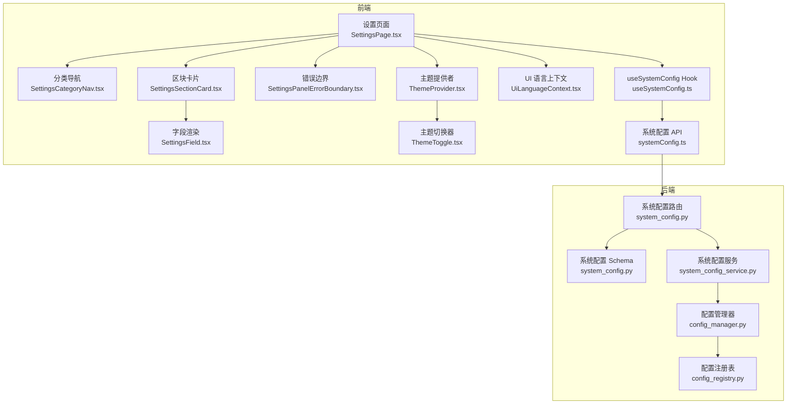

**图表来源** 
- [apps/dsa-web/src/pages/SettingsPage.tsx](file://apps/dsa-web/src/pages/SettingsPage.tsx)
- [apps/dsa-web/src/components/settings/SettingsCategoryNav.tsx](file://apps/dsa-web/src/components/settings/SettingsCategoryNav.tsx)
- [apps/dsa-web/src/components/settings/SettingsField.tsx](file://apps/dsa-web/src/components/settings/SettingsField.tsx)
- [apps/dsa-web/src/components/settings/SettingsSectionCard.tsx](file://apps/dsa-web/src/components/settings/SettingsSectionCard.tsx)
- [apps/dsa-web/src/components/settings/SettingsPanelErrorBoundary.tsx](file://apps/dsa-web/src/components/settings/SettingsPanelErrorBoundary.tsx)
- [apps/dsa-web/src/components/theme/ThemeProvider.tsx](file://apps/dsa-web/src/components/theme/ThemeProvider.tsx)
- [apps/dsa-web/src/components/theme/ThemeToggle.tsx](file://apps/dsa-web/src/components/theme/ThemeToggle.tsx)
- [apps/dsa-web/src/contexts/UiLanguageContext.tsx](file://apps/dsa-web/src/contexts/UiLanguageContext.tsx)
- [apps/dsa-web/src/hooks/useSystemConfig.ts](file://apps/dsa-web/src/hooks/useSystemConfig.ts)
- [apps/dsa-web/src/api/systemConfig.ts](file://apps/dsa-web/src/api/systemConfig.ts)
- [api/v1/endpoints/system_config.py](file://api/v1/endpoints/system_config.py)
- [api/v1/schemas/system_config.py](file://api/v1/schemas/system_config.py)
- [src/services/system_config_service.py](file://src/services/system_config_service.py)
- [src/core/config_manager.py](file://src/core/config_manager.py)
- [src/core/config_registry.py](file://src/core/config_registry.py)

**章节来源**
- [apps/dsa-web/src/pages/SettingsPage.tsx](file://apps/dsa-web/src/pages/SettingsPage.tsx)
- [apps/dsa-web/src/components/settings/index.ts](file://apps/dsa-web/src/components/settings/index.ts)

## 核心组件
- 设置页面容器：负责加载分类、渲染各区块、处理保存与错误展示
- 分类导航：按模块组织设置项，支持快速跳转与高亮
- 字段渲染器：统一输入控件封装，支持校验、提示、禁用态
- 区块卡片：将一组相关字段组织为可折叠或独立的设置块
- 错误边界：捕获设置面板渲染异常，提供降级视图与重试
- 帮助按钮：根据当前字段显示对应帮助文案（i18n）
- 主题提供者与切换器：全局主题状态管理与一键切换
- 系统配置 Hook：封装获取、更新、缓存与同步逻辑
- 系统配置 API：前后端交互契约与错误处理
- 后端路由与 Schema：请求参数校验与响应结构约束
- 配置服务与注册表：集中式配置读取、合并、持久化与扩展点

**章节来源**
- [apps/dsa-web/src/components/settings/SettingsPanelErrorBoundary.tsx](file://apps/dsa-web/src/components/settings/SettingsPanelErrorBoundary.tsx)
- [apps/dsa-web/src/components/settings/SettingsSectionCard.tsx](file://apps/dsa-web/src/components/settings/SettingsSectionCard.tsx)
- [apps/dsa-web/src/components/settings/SettingsField.tsx](file://apps/dsa-web/src/components/settings/SettingsField.tsx)
- [apps/dsa-web/src/components/settings/SettingsCategoryNav.tsx](file://apps/dsa-web/src/components/settings/SettingsCategoryNav.tsx)
- [apps/dsa-web/src/components/settings/SettingsHelpButton.tsx](file://apps/dsa-web/src/components/settings/SettingsHelpButton.tsx)
- [apps/dsa-web/src/components/settings/SettingsLoading.tsx](file://apps/dsa-web/src/components/settings/SettingsLoading.tsx)
- [apps/dsa-web/src/components/theme/ThemeProvider.tsx](file://apps/dsa-web/src/components/theme/ThemeProvider.tsx)
- [apps/dsa-web/src/components/theme/ThemeToggle.tsx](file://apps/dsa-web/src/components/theme/ThemeToggle.tsx)
- [apps/dsa-web/src/hooks/useSystemConfig.ts](file://apps/dsa-web/src/hooks/useSystemConfig.ts)
- [apps/dsa-web/src/api/systemConfig.ts](file://apps/dsa-web/src/api/systemConfig.ts)

## 架构总览
设置与主题的端到端流程如下：
- 用户在设置页面操作字段，触发 Hook 调用 API
- API 向后端发送请求，后端通过路由接收并校验 Schema
- 配置服务从配置管理器读取/写入，必要时结合注册表进行扩展
- 前端 Hook 缓存结果，驱动 UI 刷新；主题与语言由上下文统一管理

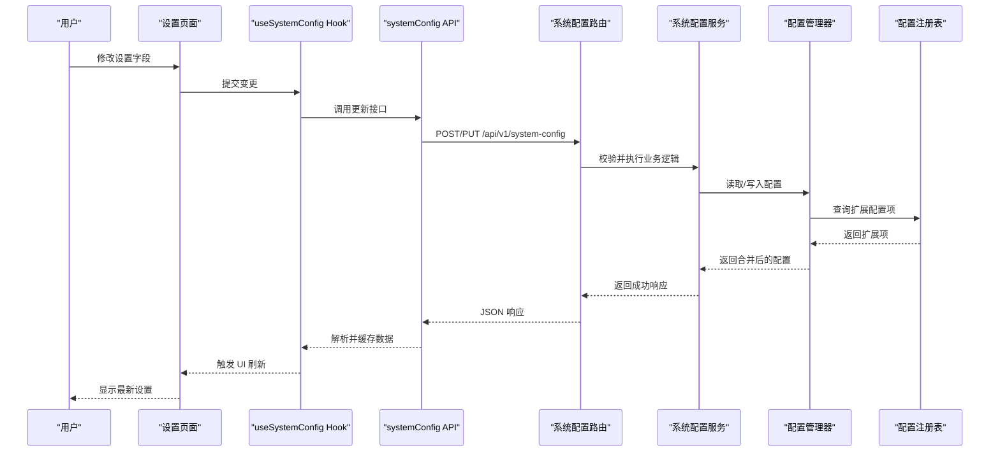

**图表来源** 
- [apps/dsa-web/src/hooks/useSystemConfig.ts](file://apps/dsa-web/src/hooks/useSystemConfig.ts)
- [apps/dsa-web/src/api/systemConfig.ts](file://apps/dsa-web/src/api/systemConfig.ts)
- [api/v1/endpoints/system_config.py](file://api/v1/endpoints/system_config.py)
- [api/v1/schemas/system_config.py](file://api/v1/schemas/system_config.py)
- [src/services/system_config_service.py](file://src/services/system_config_service.py)
- [src/core/config_manager.py](file://src/core/config_manager.py)
- [src/core/config_registry.py](file://src/core/config_registry.py)

## 详细组件分析

### 设置页面与分类导航
- 设置页面负责聚合各设置区块，处理加载状态、错误边界与保存反馈
- 分类导航维护当前选中分类，提供锚点跳转与键盘可达性

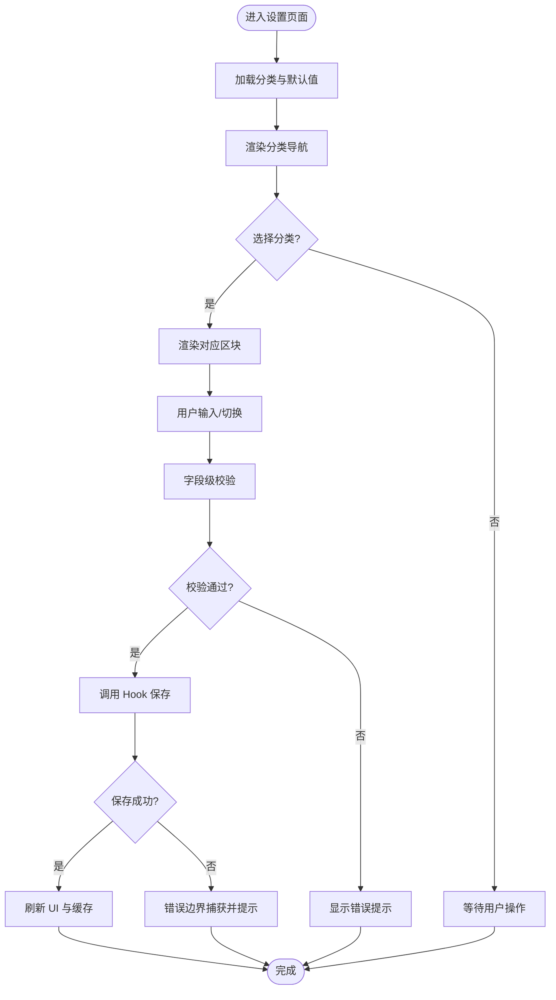

**图表来源** 
- [apps/dsa-web/src/pages/SettingsPage.tsx](file://apps/dsa-web/src/pages/SettingsPage.tsx)
- [apps/dsa-web/src/components/settings/SettingsCategoryNav.tsx](file://apps/dsa-web/src/components/settings/SettingsCategoryNav.tsx)
- [apps/dsa-web/src/components/settings/SettingsSectionCard.tsx](file://apps/dsa-web/src/components/settings/SettingsSectionCard.tsx)
- [apps/dsa-web/src/components/settings/SettingsField.tsx](file://apps/dsa-web/src/components/settings/SettingsField.tsx)
- [apps/dsa-web/src/components/settings/SettingsPanelErrorBoundary.tsx](file://apps/dsa-web/src/components/settings/SettingsPanelErrorBoundary.tsx)

**章节来源**
- [apps/dsa-web/src/pages/SettingsPage.tsx](file://apps/dsa-web/src/pages/SettingsPage.tsx)
- [apps/dsa-web/src/components/settings/SettingsCategoryNav.tsx](file://apps/dsa-web/src/components/settings/SettingsCategoryNav.tsx)

### 字段渲染与区块卡片
- 字段渲染器统一封装输入控件，支持占位符、禁用、只读、必填、帮助文案
- 区块卡片用于分组展示，支持标题、描述、操作区与分隔线

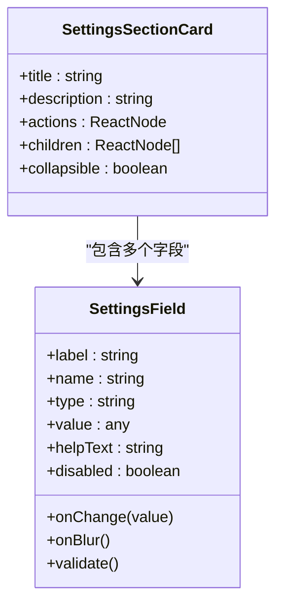

**图表来源** 
- [apps/dsa-web/src/components/settings/SettingsField.tsx](file://apps/dsa-web/src/components/settings/SettingsField.tsx)
- [apps/dsa-web/src/components/settings/SettingsSectionCard.tsx](file://apps/dsa-web/src/components/settings/SettingsSectionCard.tsx)

**章节来源**
- [apps/dsa-web/src/components/settings/SettingsField.tsx](file://apps/dsa-web/src/components/settings/SettingsField.tsx)
- [apps/dsa-web/src/components/settings/SettingsSectionCard.tsx](file://apps/dsa-web/src/components/settings/SettingsSectionCard.tsx)

### 认证与密码修改卡片
- 认证设置卡片用于管理登录凭据与连接信息
- 密码修改卡片提供旧密码验证与新密码一致性校验

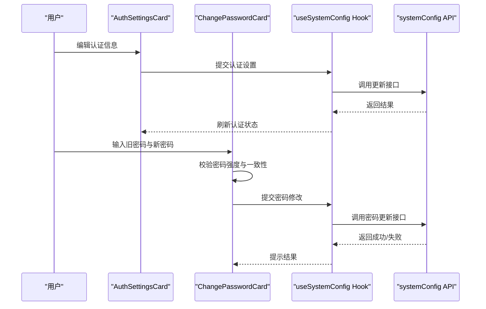

**图表来源** 
- [apps/dsa-web/src/components/settings/AuthSettingsCard.tsx](file://apps/dsa-web/src/components/settings/AuthSettingsCard.tsx)
- [apps/dsa-web/src/components/settings/ChangePasswordCard.tsx](file://apps/dsa-web/src/components/settings/ChangePasswordCard.tsx)
- [apps/dsa-web/src/hooks/useSystemConfig.ts](file://apps/dsa-web/src/hooks/useSystemConfig.ts)
- [apps/dsa-web/src/api/systemConfig.ts](file://apps/dsa-web/src/api/systemConfig.ts)

**章节来源**
- [apps/dsa-web/src/components/settings/AuthSettingsCard.tsx](file://apps/dsa-web/src/components/settings/AuthSettingsCard.tsx)
- [apps/dsa-web/src/components/settings/ChangePasswordCard.tsx](file://apps/dsa-web/src/components/settings/ChangePasswordCard.tsx)

### LLM 渠道编辑器与模板
- LLM 渠道编辑器用于配置不同大模型提供商的连接参数与行为选项
- 模板文件提供常用厂商的预设结构，减少重复配置

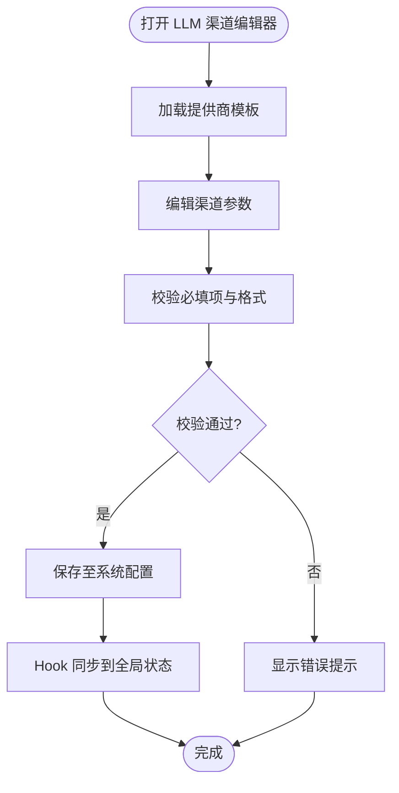

**图表来源** 
- [apps/dsa-web/src/components/settings/LLMChannelEditor.tsx](file://apps/dsa-web/src/components/settings/LLMChannelEditor.tsx)
- [apps/dsa-web/src/components/settings/llmProviderTemplates.ts](file://apps/dsa-web/src/components/settings/llmProviderTemplates.ts)
- [apps/dsa-web/src/hooks/useSystemConfig.ts](file://apps/dsa-web/src/hooks/useSystemConfig.ts)

**章节来源**
- [apps/dsa-web/src/components/settings/LLMChannelEditor.tsx](file://apps/dsa-web/src/components/settings/LLMChannelEditor.tsx)
- [apps/dsa-web/src/components/settings/llmProviderTemplates.ts](file://apps/dsa-web/src/components/settings/llmProviderTemplates.ts)

### 通知测试面板
- 提供对通知渠道的即时测试能力，便于验证配置有效性
- 支持选择目标渠道、构造测试消息、展示测试结果

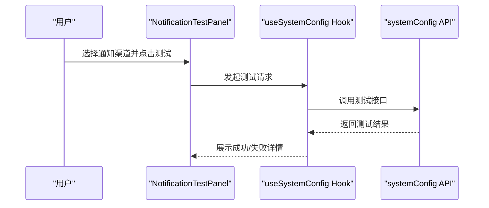

**图表来源** 
- [apps/dsa-web/src/components/settings/NotificationTestPanel.tsx](file://apps/dsa-web/src/components/settings/NotificationTestPanel.tsx)
- [apps/dsa-web/src/hooks/useSystemConfig.ts](file://apps/dsa-web/src/hooks/useSystemConfig.ts)
- [apps/dsa-web/src/api/systemConfig.ts](file://apps/dsa-web/src/api/systemConfig.ts)

**章节来源**
- [apps/dsa-web/src/components/settings/NotificationTestPanel.tsx](file://apps/dsa-web/src/components/settings/NotificationTestPanel.tsx)

### 智能导入
- 智能导入用于批量导入外部配置或数据，简化初始设置流程
- 支持文件格式校验、字段映射与预览确认

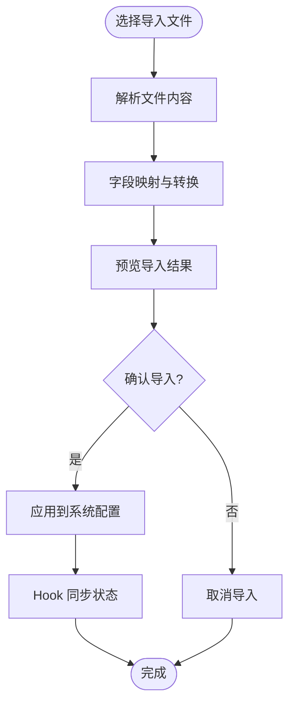

**图表来源** 
- [apps/dsa-web/src/components/settings/IntelligentImport.tsx](file://apps/dsa-web/src/components/settings/IntelligentImport.tsx)
- [apps/dsa-web/src/hooks/useSystemConfig.ts](file://apps/dsa-web/src/hooks/useSystemConfig.ts)

**章节来源**
- [apps/dsa-web/src/components/settings/IntelligentImport.tsx](file://apps/dsa-web/src/components/settings/IntelligentImport.tsx)

### 帮助按钮与本地化
- 帮助按钮根据当前字段动态显示帮助文案
- 文案来源于本地化资源，支持多语言切换

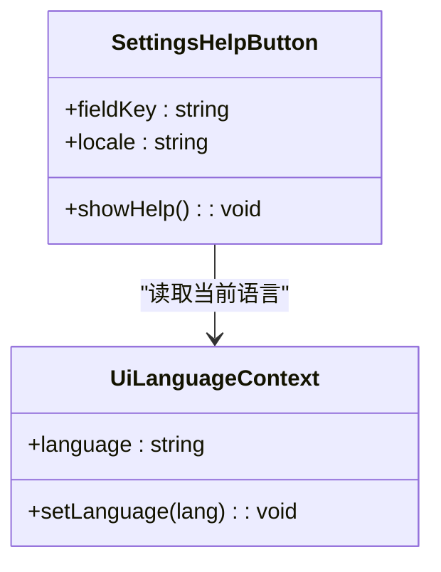

**图表来源** 
- [apps/dsa-web/src/components/settings/SettingsHelpButton.tsx](file://apps/dsa-web/src/components/settings/SettingsHelpButton.tsx)
- [apps/dsa-web/src/contexts/UiLanguageContext.tsx](file://apps/dsa-web/src/contexts/UiLanguageContext.tsx)
- [apps/dsa-web/src/i18n/uiText.ts](file://apps/dsa-web/src/i18n/uiText.ts)
- [apps/dsa-web/src/locales/settingsHelp.ts](file://apps/dsa-web/src/locales/settingsHelp.ts)

**章节来源**
- [apps/dsa-web/src/components/settings/SettingsHelpButton.tsx](file://apps/dsa-web/src/components/settings/SettingsHelpButton.tsx)
- [apps/dsa-web/src/contexts/UiLanguageContext.tsx](file://apps/dsa-web/src/contexts/UiLanguageContext.tsx)
- [apps/dsa-web/src/i18n/uiText.ts](file://apps/dsa-web/src/i18n/uiText.ts)
- [apps/dsa-web/src/locales/settingsHelp.ts](file://apps/dsa-web/src/locales/settingsHelp.ts)

### 主题提供者与切换器
- 主题提供者维护全局主题状态（如明/暗），并通过 Context 分发
- 切换器提供便捷入口，支持快捷键与持久化

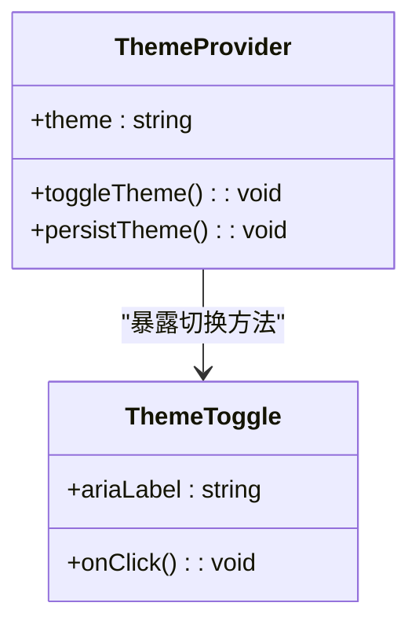

**图表来源** 
- [apps/dsa-web/src/components/theme/ThemeProvider.tsx](file://apps/dsa-web/src/components/theme/ThemeProvider.tsx)
- [apps/dsa-web/src/components/theme/ThemeToggle.tsx](file://apps/dsa-web/src/components/theme/ThemeToggle.tsx)

**章节来源**
- [apps/dsa-web/src/components/theme/ThemeProvider.tsx](file://apps/dsa-web/src/components/theme/ThemeProvider.tsx)
- [apps/dsa-web/src/components/theme/ThemeToggle.tsx](file://apps/dsa-web/src/components/theme/ThemeToggle.tsx)

### 系统配置 Hook 与 API
- Hook 封装了获取、更新、缓存与错误处理逻辑，确保 UI 与后端一致
- API 层定义请求方法与错误码映射，便于统一处理

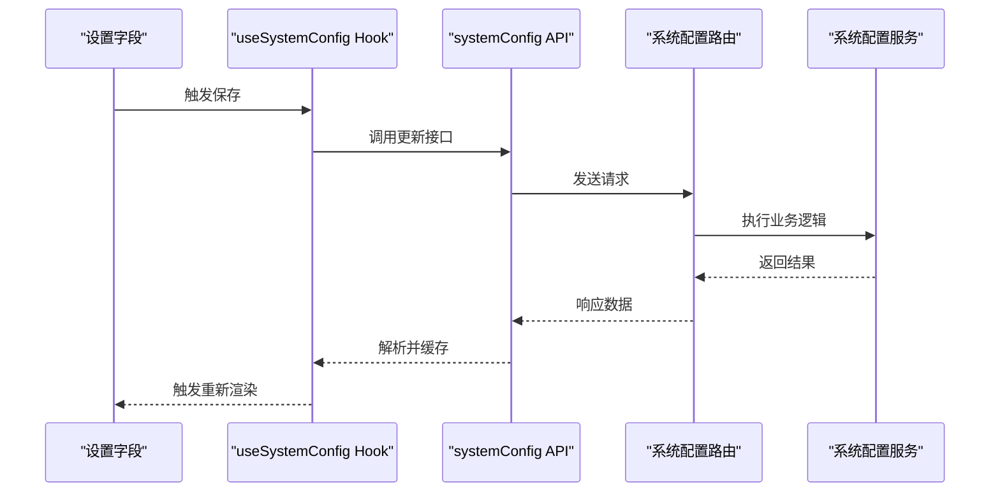

**图表来源** 
- [apps/dsa-web/src/hooks/useSystemConfig.ts](file://apps/dsa-web/src/hooks/useSystemConfig.ts)
- [apps/dsa-web/src/api/systemConfig.ts](file://apps/dsa-web/src/api/systemConfig.ts)
- [api/v1/endpoints/system_config.py](file://api/v1/endpoints/system_config.py)
- [src/services/system_config_service.py](file://src/services/system_config_service.py)

**章节来源**
- [apps/dsa-web/src/hooks/useSystemConfig.ts](file://apps/dsa-web/src/hooks/useSystemConfig.ts)
- [apps/dsa-web/src/api/systemConfig.ts](file://apps/dsa-web/src/api/systemConfig.ts)

### 后端配置路由与 Schema
- 路由负责接收请求、鉴权与转发到服务层
- Schema 定义请求与响应的字段约束，确保数据一致性

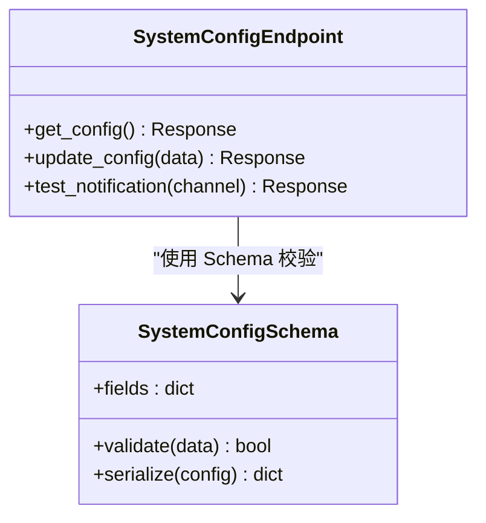

**图表来源** 
- [api/v1/schemas/system_config.py](file://api/v1/schemas/system_config.py)
- [api/v1/endpoints/system_config.py](file://api/v1/endpoints/system_config.py)

**章节来源**
- [api/v1/schemas/system_config.py](file://api/v1/schemas/system_config.py)
- [api/v1/endpoints/system_config.py](file://api/v1/endpoints/system_config.py)

### 配置服务与管理器
- 配置服务协调业务逻辑，调用配置管理器读写配置
- 配置管理器提供统一的配置访问接口，支持合并、默认值与扩展点

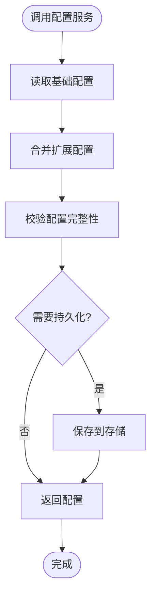

**图表来源** 
- [src/services/system_config_service.py](file://src/services/system_config_service.py)
- [src/core/config_manager.py](file://src/core/config_manager.py)
- [src/core/config_registry.py](file://src/core/config_registry.py)

**章节来源**
- [src/services/system_config_service.py](file://src/services/system_config_service.py)
- [src/core/config_manager.py](file://src/core/config_manager.py)
- [src/core/config_registry.py](file://src/core/config_registry.py)

### 类型定义与 i18n
- 类型定义统一前端数据结构，避免运行时错误
- i18n 工具提供字段标签与帮助文案的多语言支持

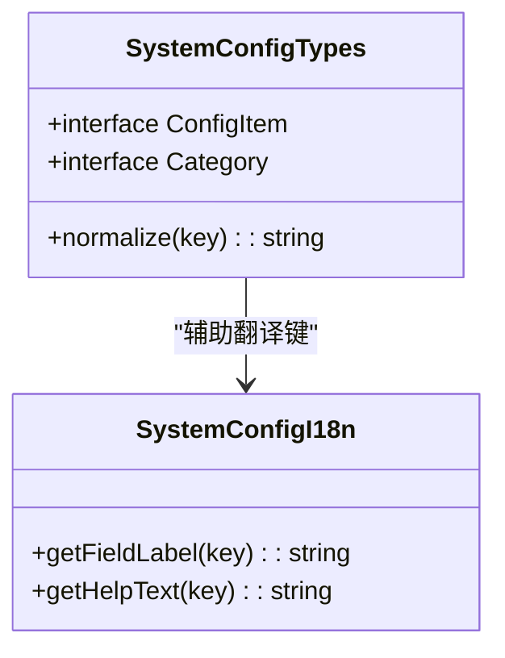

**图表来源** 
- [apps/dsa-web/src/types/systemConfig.ts](file://apps/dsa-web/src/types/systemConfig.ts)
- [apps/dsa-web/src/utils/systemConfigI18n.ts](file://apps/dsa-web/src/utils/systemConfigI18n.ts)

**章节来源**
- [apps/dsa-web/src/types/systemConfig.ts](file://apps/dsa-web/src/types/systemConfig.ts)
- [apps/dsa-web/src/utils/systemConfigI18n.ts](file://apps/dsa-web/src/utils/systemConfigI18n.ts)

## 依赖关系分析
- 前端组件依赖 Hook 与 API，Hook 依赖类型定义与 i18n 工具
- 后端路由依赖 Schema 与服务层，服务层依赖配置管理器与注册表
- 主题与语言上下文被设置页面广泛消费，保证一致的视觉与文案体验

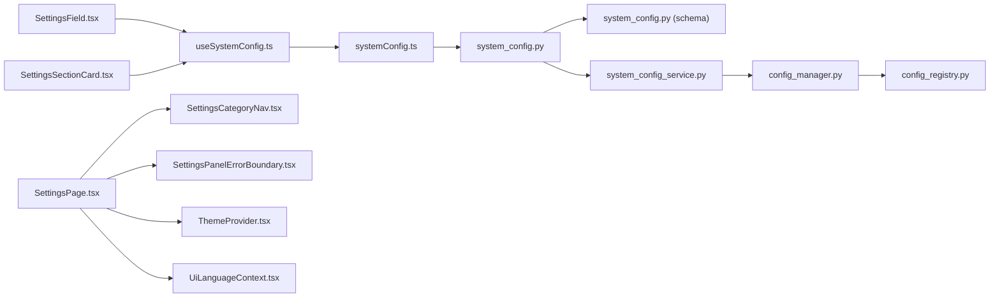

**图表来源** 
- [apps/dsa-web/src/components/settings/SettingsField.tsx](file://apps/dsa-web/src/components/settings/SettingsField.tsx)
- [apps/dsa-web/src/components/settings/SettingsSectionCard.tsx](file://apps/dsa-web/src/components/settings/SettingsSectionCard.tsx)
- [apps/dsa-web/src/pages/SettingsPage.tsx](file://apps/dsa-web/src/pages/SettingsPage.tsx)
- [apps/dsa-web/src/components/settings/SettingsCategoryNav.tsx](file://apps/dsa-web/src/components/settings/SettingsCategoryNav.tsx)
- [apps/dsa-web/src/components/settings/SettingsPanelErrorBoundary.tsx](file://apps/dsa-web/src/components/settings/SettingsPanelErrorBoundary.tsx)
- [apps/dsa-web/src/components/theme/ThemeProvider.tsx](file://apps/dsa-web/src/components/theme/ThemeProvider.tsx)
- [apps/dsa-web/src/contexts/UiLanguageContext.tsx](file://apps/dsa-web/src/contexts/UiLanguageContext.tsx)
- [apps/dsa-web/src/hooks/useSystemConfig.ts](file://apps/dsa-web/src/hooks/useSystemConfig.ts)
- [apps/dsa-web/src/api/systemConfig.ts](file://apps/dsa-web/src/api/systemConfig.ts)
- [api/v1/endpoints/system_config.py](file://api/v1/endpoints/system_config.py)
- [api/v1/schemas/system_config.py](file://api/v1/schemas/system_config.py)
- [src/services/system_config_service.py](file://src/services/system_config_service.py)
- [src/core/config_manager.py](file://src/core/config_manager.py)
- [src/core/config_registry.py](file://src/core/config_registry.py)

**章节来源**
- [apps/dsa-web/src/components/settings/index.ts](file://apps/dsa-web/src/components/settings/index.ts)

## 性能考虑
- 前端缓存：Hook 层缓存配置数据，减少重复请求
- 懒加载：分类与区块按需渲染，降低首屏压力
- 防抖与节流：字段变更时延迟保存，避免频繁网络请求
- 错误边界：快速失败与局部降级，提升整体稳定性
- 后端校验：Schema 校验前置，减少无效计算与 IO

[本节为通用指导，不直接分析具体文件]

## 故障排查指南
- 设置面板渲染异常：检查错误边界捕获信息与控制台日志
- 字段校验失败：核对必填项、格式与依赖关系
- 保存失败：查看 API 响应与错误码，定位后端服务问题
- 主题切换无效：确认主题上下文是否正确注入与持久化
- 语言切换无效：检查语言上下文与本地化资源是否加载完整

**章节来源**
- [apps/dsa-web/src/components/settings/SettingsPanelErrorBoundary.tsx](file://apps/dsa-web/src/components/settings/SettingsPanelErrorBoundary.tsx)
- [apps/dsa-web/src/api/systemConfig.ts](file://apps/dsa-web/src/api/systemConfig.ts)
- [apps/dsa-web/src/components/theme/ThemeProvider.tsx](file://apps/dsa-web/src/components/theme/ThemeProvider.tsx)
- [apps/dsa-web/src/contexts/UiLanguageContext.tsx](file://apps/dsa-web/src/contexts/UiLanguageContext.tsx)

## 结论
本设置与主题体系以模块化组件为核心，配合 Hook、API、Schema 与服务层形成完整的配置管理闭环。通过错误边界、缓存与 i18n 支持，实现了稳定、可扩展且多语言友好的设置界面。主题与语言上下文确保了全局一致的视觉与文案体验，适合构建可配置的 Web 应用。

[本节为总结性内容，不直接分析具体文件]

## 附录
- 可配置的 Web 应用构建示例：在设置页面中组合分类导航、区块卡片与字段渲染器，使用 Hook 统一处理数据流，借助错误边界保障稳定性
- 最佳实践：
  - 字段级校验与即时反馈
  - 保存前预校验与二次确认
  - 主题与语言的持久化与回退策略
  - 后端 Schema 严格约束与友好错误信息

[本节为补充说明，不直接分析具体文件]