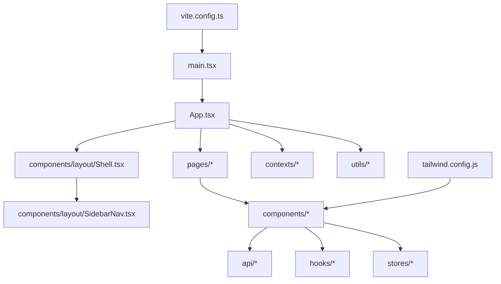
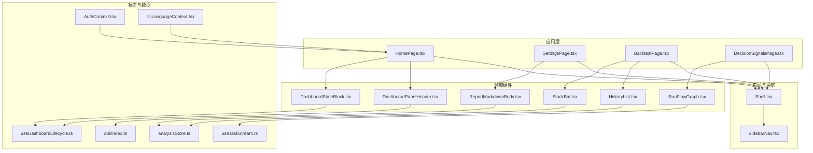
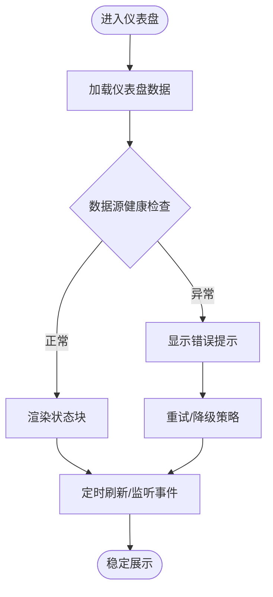
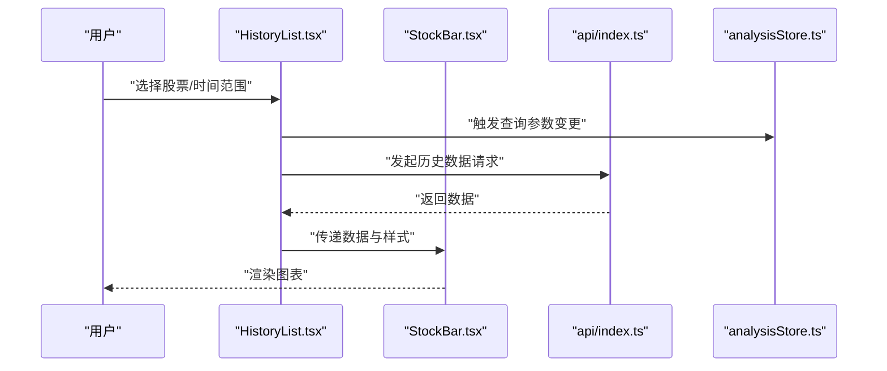
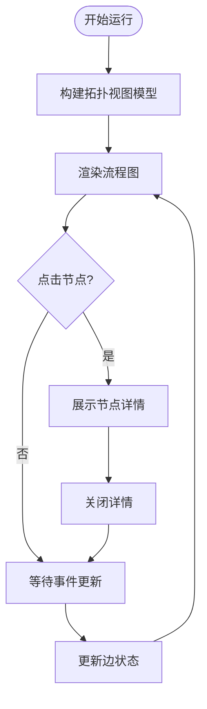
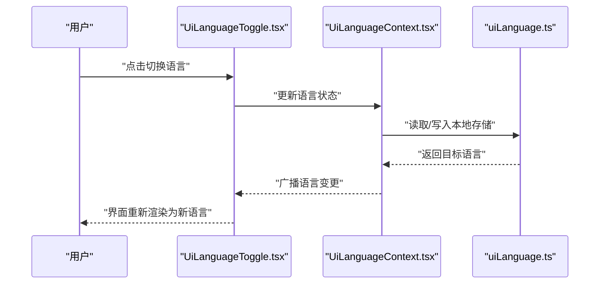
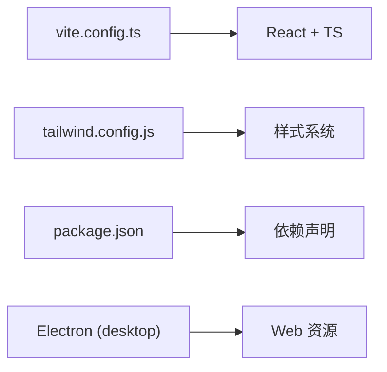
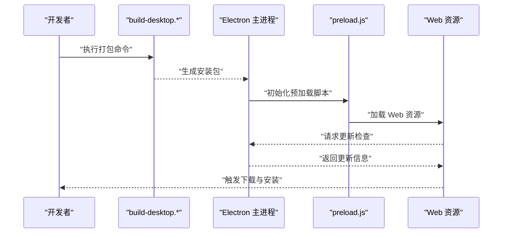

# Web前端界面

<cite>
**本文引用的文件**   
- [apps/dsa-web/src/main.tsx](file://apps/dsa-web/src/main.tsx)
- [apps/dsa-web/src/App.tsx](file://apps/dsa-web/src/App.tsx)
- [apps/dsa-web/vite.config.ts](file://apps/dsa-web/vite.config.ts)
- [apps/dsa-web/package.json](file://apps/dsa-web/package.json)
- [apps/dsa-web/tailwind.config.js](file://apps/dsa-web/tailwind.config.js)
- [apps/dsa-web/tsconfig.app.json](file://apps/dsa-web/tsconfig.app.json)
- [apps/dsa-web/src/components/common/index.ts](file://apps/dsa-web/src/components/common/index.ts)
- [apps/dsa-web/src/components/layout/Shell.tsx](file://apps/dsa-web/src/components/layout/Shell.tsx)
- [apps/dsa-web/src/components/layout/SidebarNav.tsx](file://apps/dsa-web/src/components/layout/SidebarNav.tsx)
- [apps/dsa-web/src/components/dashboard/DashboardPanelHeader.tsx](file://apps/dsa-web/src/components/dashboard/DashboardPanelHeader.tsx)
- [apps/dsa-web/src/components/dashboard/DashboardStateBlock.tsx](file://apps/dsa-web/src/components/dashboard/DashboardStateBlock.tsx)
- [apps/dsa-web/src/components/history/HistoryList.tsx](file://apps/dsa-web/src/components/history/HistoryList.tsx)
- [apps/dsa-web/src/components/history/StockBar.tsx](file://apps/dsa-web/src/components/history/StockBar.tsx)
- [apps/dsa-web/src/components/report/ReportMarkdownBody.tsx](file://apps/dsa-web/src/components/report/ReportMarkdownBody.tsx)
- [apps/dsa-web/src/components/run-flow/RunFlowGraph.tsx](file://apps/dsa-web/src/components/run-flow/RunFlowGraph.tsx)
- [apps/dsa-web/src/components/theme/ThemeProvider.tsx](file://apps/dsa-web/src/components/theme/ThemeProvider.tsx)
- [apps/dsa-web/src/components/i18n/UiLanguageToggle.tsx](file://apps/dsa-web/src/components/i18n/UiLanguageToggle.tsx)
- [apps/dsa-web/src/contexts/AuthContext.tsx](file://apps/dsa-web/src/contexts/AuthContext.tsx)
- [apps/dsa-web/src/contexts/UiLanguageContext.tsx](file://apps/dsa-web/src/contexts/UiLanguageContext.tsx)
- [apps/dsa-web/src/hooks/useDashboardLifecycle.ts](file://apps/dsa-web/src/hooks/useDashboardLifecycle.ts)
- [apps/dsa-web/src/hooks/useTaskStream.ts](file://apps/dsa-web/src/hooks/useTaskStream.ts)
- [apps/dsa-web/src/stores/analysisStore.ts](file://apps/dsa-web/src/stores/analysisStore.ts)
- [apps/dsa-web/src/api/index.ts](file://apps/dsa-web/src/api/index.ts)
- [apps/dsa-web/src/pages/HomePage.tsx](file://apps/dsa-web/src/pages/HomePage.tsx)
- [apps/dsa-web/src/pages/SettingsPage.tsx](file://apps/dsa-web/src/pages/SettingsPage.tsx)
- [apps/dsa-web/src/utils/uiLanguage.ts](file://apps/dsa-web/src/utils/uiLanguage.ts)
- [apps/dsa-web/src/utils/format.ts](file://apps/dsa-web/src/utils/format.ts)
- [apps/dsa-web/src/utils/constants.ts](file://apps/dsa-web/src/utils/constants.ts)
- [apps/dsa-desktop/main.js](file://apps/dsa-desktop/main.js)
- [apps/dsa-desktop/preload.js](file://apps/dsa-desktop/preload.js)
- [apps/dsa-desktop/package.json](file://apps/dsa-desktop/package.json)
- [scripts/build-desktop-macos.sh](file://scripts/build-desktop-macos.sh)
- [scripts/build-desktop.ps1](file://scripts/build-desktop.ps1)
</cite>

## 目录
1. [简介](#简介)
2. [项目结构](#项目结构)
3. [核心组件](#核心组件)
4. [架构总览](#架构总览)
5. [详细组件分析](#详细组件分析)
6. [依赖关系分析](#依赖关系分析)
7. [性能考量](#性能考量)
8. [故障排查指南](#故障排查指南)
9. [结论](#结论)
10. [附录](#附录)

## 简介
本文件面向基于 React 与 TypeScript 构建的 Web 前端界面，系统化说明整体架构、组件库设计、状态管理、用户交互流程、仪表盘与图表展示、实时数据更新、响应式布局、桌面应用打包与跨平台支持、自动更新机制、主题定制、国际化与无障碍访问，以及开发环境与测试指南。文档以仓库中的 dsa-web（Web）与 dsa-desktop（Electron 桌面）为范围，结合 hooks、stores、API 层与页面组件进行分层解析，帮助开发者快速理解并高效扩展。

## 项目结构
Web 端位于 apps/dsa-web，采用 Vite + React + TypeScript + TailwindCSS 的现代前端工程化方案；桌面端位于 apps/dsa-desktop，使用 Electron 将 Web 资源打包为跨平台可执行文件。关键目录职责如下：
- src/main.tsx：应用入口，挂载根组件与全局上下文
- src/App.tsx：路由与页面组织、全局样式与错误边界
- src/components：按功能域划分的组件集合（common、layout、dashboard、history、report、run-flow、settings、tasks、theme、i18n）
- src/contexts：全局上下文（认证、语言等）
- src/hooks：业务与数据流相关的自定义 Hook
- src/stores：轻量状态存储（如 analysisStore、stockPoolStore）
- src/api：HTTP API 封装与类型定义
- src/pages：页面级组件（首页、设置、回测、决策信号等）
- src/utils：工具函数（格式化、常量、语言切换等）
- vite.config.ts：构建配置（代理、插件、优化）
- tailwind.config.js：主题与样式系统
- package.json：脚本与依赖声明

图示来源
- [apps/dsa-web/src/main.tsx](file://apps/dsa-web/src/main.tsx)
- [apps/dsa-web/src/App.tsx](file://apps/dsa-web/src/App.tsx)
- [apps/dsa-web/src/components/layout/Shell.tsx](file://apps/dsa-web/src/components/layout/Shell.tsx)
- [apps/dsa-web/src/components/layout/SidebarNav.tsx](file://apps/dsa-web/src/components/layout/SidebarNav.tsx)
- [apps/dsa-web/vite.config.ts](file://apps/dsa-web/vite.config.ts)
- [apps/dsa-web/tailwind.config.js](file://apps/dsa-web/tailwind.config.js)

章节来源
- [apps/dsa-web/src/main.tsx](file://apps/dsa-web/src/main.tsx)
- [apps/dsa-web/src/App.tsx](file://apps/dsa-web/src/App.tsx)
- [apps/dsa-web/vite.config.ts](file://apps/dsa-web/vite.config.ts)
- [apps/dsa-web/package.json](file://apps/dsa-web/package.json)
- [apps/dsa-web/tailwind.config.js](file://apps/dsa-web/tailwind.config.js)

## 核心组件
- 通用组件库（components/common）：按钮、输入框、卡片、抽屉、分页、统计卡、加载态、空状态、确认对话框、滚动区域、工具栏、提示、分数仪表等，提供一致的设计系统与可复用能力
- 布局组件（components/layout）：Shell 作为应用外壳，SidebarNav 负责侧边导航，RouteBoundary 处理路由边界与错误
- 仪表盘（components/dashboard）：面板头部与状态块，用于聚合关键指标与运行状态
- 历史与图表（components/history）：历史列表、股票条形图、趋势抽屉，支撑行情回顾与可视化
- 报告与 Markdown（components/report）：报告详情、概览、策略、新闻、诊断、Markdown 渲染与面板
- 运行流（components/run-flow）：流程图、节点详情、摘要条、拓扑视图模型，用于任务执行过程可视化
- 设置（components/settings）：认证、密码修改、智能导入、LLM 渠道编辑、通知测试、分类导航、字段控件、帮助按钮、加载与错误边界
- 主题（components/theme）：主题提供者与切换开关，支持明暗主题与 Token 体系
- 国际化（components/i18n）：UI 语言切换器，配合 UiLanguageContext 实现多语言

章节来源
- [apps/dsa-web/src/components/common/index.ts](file://apps/dsa-web/src/components/common/index.ts)
- [apps/dsa-web/src/components/layout/Shell.tsx](file://apps/dsa-web/src/components/layout/Shell.tsx)
- [apps/dsa-web/src/components/layout/SidebarNav.tsx](file://apps/dsa-web/src/components/layout/SidebarNav.tsx)
- [apps/dsa-web/src/components/dashboard/DashboardPanelHeader.tsx](file://apps/dsa-web/src/components/dashboard/DashboardPanelHeader.tsx)
- [apps/dsa-web/src/components/dashboard/DashboardStateBlock.tsx](file://apps/dsa-web/src/components/dashboard/DashboardStateBlock.tsx)
- [apps/dsa-web/src/components/history/HistoryList.tsx](file://apps/dsa-web/src/components/history/HistoryList.tsx)
- [apps/dsa-web/src/components/history/StockBar.tsx](file://apps/dsa-web/src/components/history/StockBar.tsx)
- [apps/dsa-web/src/components/report/ReportMarkdownBody.tsx](file://apps/dsa-web/src/components/report/ReportMarkdownBody.tsx)
- [apps/dsa-web/src/components/run-flow/RunFlowGraph.tsx](file://apps/dsa-web/src/components/run-flow/RunFlowGraph.tsx)
- [apps/dsa-web/src/components/theme/ThemeProvider.tsx](file://apps/dsa-web/src/components/theme/ThemeProvider.tsx)
- [apps/dsa-web/src/components/i18n/UiLanguageToggle.tsx](file://apps/dsa-web/src/components/i18n/UiLanguageToggle.tsx)

## 架构总览
前端采用“上下文 + Hooks + Store”的状态管理模式：
- 上下文（AuthContext、UiLanguageContext）提供全局认证与语言状态
- 自定义 Hook（useDashboardLifecycle、useTaskStream、useAutocomplete、useSystemConfig 等）封装数据获取、事件订阅与生命周期管理
- 轻量 Store（analysisStore、stockPoolStore）通过发布订阅或状态容器模式管理模块级状态
- API 层统一封装请求、错误处理与重试策略
- 页面组件组合布局与业务组件，完成用户交互与数据呈现

图示来源
- [apps/dsa-web/src/pages/HomePage.tsx](file://apps/dsa-web/src/pages/HomePage.tsx)
- [apps/dsa-web/src/pages/SettingsPage.tsx](file://apps/dsa-web/src/pages/SettingsPage.tsx)
- [apps/dsa-web/src/components/layout/Shell.tsx](file://apps/dsa-web/src/components/layout/Shell.tsx)
- [apps/dsa-web/src/components/layout/SidebarNav.tsx](file://apps/dsa-web/src/components/layout/SidebarNav.tsx)
- [apps/dsa-web/src/components/dashboard/DashboardPanelHeader.tsx](file://apps/dsa-web/src/components/dashboard/DashboardPanelHeader.tsx)
- [apps/dsa-web/src/components/dashboard/DashboardStateBlock.tsx](file://apps/dsa-web/src/components/dashboard/DashboardStateBlock.tsx)
- [apps/dsa-web/src/components/history/HistoryList.tsx](file://apps/dsa-web/src/components/history/HistoryList.tsx)
- [apps/dsa-web/src/components/history/StockBar.tsx](file://apps/dsa-web/src/components/history/StockBar.tsx)
- [apps/dsa-web/src/components/report/ReportMarkdownBody.tsx](file://apps/dsa-web/src/components/report/ReportMarkdownBody.tsx)
- [apps/dsa-web/src/components/run-flow/RunFlowGraph.tsx](file://apps/dsa-web/src/components/run-flow/RunFlowGraph.tsx)
- [apps/dsa-web/src/contexts/AuthContext.tsx](file://apps/dsa-web/src/contexts/AuthContext.tsx)
- [apps/dsa-web/src/contexts/UiLanguageContext.tsx](file://apps/dsa-web/src/contexts/UiLanguageContext.tsx)
- [apps/dsa-web/src/hooks/useDashboardLifecycle.ts](file://apps/dsa-web/src/hooks/useDashboardLifecycle.ts)
- [apps/dsa-web/src/hooks/useTaskStream.ts](file://apps/dsa-web/src/hooks/useTaskStream.ts)
- [apps/dsa-web/src/stores/analysisStore.ts](file://apps/dsa-web/src/stores/analysisStore.ts)
- [apps/dsa-web/src/api/index.ts](file://apps/dsa-web/src/api/index.ts)

## 详细组件分析

### 仪表盘与状态块
- DashboardPanelHeader：承载仪表盘标题、操作按钮与筛选条件，支持键盘可达性与屏幕阅读器标签
- DashboardStateBlock：展示关键运行状态（如任务队列、数据源健康度），内部通过 useDashboardLifecycle 管理生命周期与刷新策略

图示来源
- [apps/dsa-web/src/components/dashboard/DashboardPanelHeader.tsx](file://apps/dsa-web/src/components/dashboard/DashboardPanelHeader.tsx)
- [apps/dsa-web/src/components/dashboard/DashboardStateBlock.tsx](file://apps/dsa-web/src/components/dashboard/DashboardStateBlock.tsx)
- [apps/dsa-web/src/hooks/useDashboardLifecycle.ts](file://apps/dsa-web/src/hooks/useDashboardLifecycle.ts)

章节来源
- [apps/dsa-web/src/components/dashboard/DashboardPanelHeader.tsx](file://apps/dsa-web/src/components/dashboard/DashboardPanelHeader.tsx)
- [apps/dsa-web/src/components/dashboard/DashboardStateBlock.tsx](file://apps/dsa-web/src/components/dashboard/DashboardStateBlock.tsx)
- [apps/dsa-web/src/hooks/useDashboardLifecycle.ts](file://apps/dsa-web/src/hooks/useDashboardLifecycle.ts)

### 历史与图表展示
- HistoryList：列表渲染与分页、搜索、排序，结合 StockBar 展示趋势缩略图
- StockBar：轻量折线/柱状图，适合移动端与大数据量场景的性能友好展示

图示来源
- [apps/dsa-web/src/components/history/HistoryList.tsx](file://apps/dsa-web/src/components/history/HistoryList.tsx)
- [apps/dsa-web/src/components/history/StockBar.tsx](file://apps/dsa-web/src/components/history/StockBar.tsx)
- [apps/dsa-web/src/api/index.ts](file://apps/dsa-web/src/api/index.ts)
- [apps/dsa-web/src/stores/analysisStore.ts](file://apps/dsa-web/src/stores/analysisStore.ts)

章节来源
- [apps/dsa-web/src/components/history/HistoryList.tsx](file://apps/dsa-web/src/components/history/HistoryList.tsx)
- [apps/dsa-web/src/components/history/StockBar.tsx](file://apps/dsa-web/src/components/history/StockBar.tsx)
- [apps/dsa-web/src/stores/analysisStore.ts](file://apps/dsa-web/src/stores/analysisStore.ts)

### 报告与 Markdown 渲染
- ReportMarkdownBody：安全渲染 Markdown，支持代码高亮、表格、链接与图片，适配不同语言文本
- 报告相关组件（Overview、Strategy、News、Diagnostics）组合成完整分析报告视图

```mermaid
classDiagram
class ReportMarkdownBody {
+render(content : string) void
+handleLinkClick(url : string) void
+sanitize(html : string) string
}
class ReportOverview {
+display(summary : object) void
}
class ReportStrategy {
+display(strategy : object) void
}
class ReportNews {
+display(news : array) void
}
ReportMarkdownBody <.. ReportOverview : "引用"
ReportMarkdownBody <.. ReportStrategy : "引用"
ReportMarkdownBody <.. ReportNews : "引用"
```

图示来源
- [apps/dsa-web/src/components/report/ReportMarkdownBody.tsx](file://apps/dsa-web/src/components/report/ReportMarkdownBody.tsx)

章节来源
- [apps/dsa-web/src/components/report/ReportMarkdownBody.tsx](file://apps/dsa-web/src/components/report/ReportMarkdownBody.tsx)

### 运行流可视化
- RunFlowGraph：基于拓扑视图模型渲染任务执行图，支持节点详情展开与摘要条展示
- topologyViewModel：维护节点与边的状态，便于交互与动画

图示来源
- [apps/dsa-web/src/components/run-flow/RunFlowGraph.tsx](file://apps/dsa-web/src/components/run-flow/RunFlowGraph.tsx)

章节来源
- [apps/dsa-web/src/components/run-flow/RunFlowGraph.tsx](file://apps/dsa-web/src/components/run-flow/RunFlowGraph.tsx)

### 主题与国际化
- ThemeProvider：提供主题上下文，支持明暗主题切换与 Token 驱动样式
- UiLanguageToggle：切换 UI 语言，结合 UiLanguageContext 与 utils/uiLanguage 实现持久化与动态更新

图示来源
- [apps/dsa-web/src/components/i18n/UiLanguageToggle.tsx](file://apps/dsa-web/src/components/i18n/UiLanguageToggle.tsx)
- [apps/dsa-web/src/contexts/UiLanguageContext.tsx](file://apps/dsa-web/src/contexts/UiLanguageContext.tsx)
- [apps/dsa-web/src/utils/uiLanguage.ts](file://apps/dsa-web/src/utils/uiLanguage.ts)
- [apps/dsa-web/src/components/theme/ThemeProvider.tsx](file://apps/dsa-web/src/components/theme/ThemeProvider.tsx)

章节来源
- [apps/dsa-web/src/components/i18n/UiLanguageToggle.tsx](file://apps/dsa-web/src/components/i18n/UiLanguageToggle.tsx)
- [apps/dsa-web/src/contexts/UiLanguageContext.tsx](file://apps/dsa-web/src/contexts/UiLanguageContext.tsx)
- [apps/dsa-web/src/utils/uiLanguage.ts](file://apps/dsa-web/src/utils/uiLanguage.ts)
- [apps/dsa-web/src/components/theme/ThemeProvider.tsx](file://apps/dsa-web/src/components/theme/ThemeProvider.tsx)

### 认证与权限
- AuthContext：集中管理登录状态、令牌与鉴权逻辑，为受保护页面提供守卫
- 页面级路由根据认证状态决定重定向与访问控制

章节来源
- [apps/dsa-web/src/contexts/AuthContext.tsx](file://apps/dsa-web/src/contexts/AuthContext.tsx)

## 依赖关系分析
- 构建与样式：Vite 负责开发与构建，TailwindCSS 提供原子化样式与主题扩展
- 运行时依赖：React、TypeScript、路由与状态管理库（由 package.json 声明）
- 桌面端依赖：Electron 主进程与预加载脚本，桥接 Web 资源与系统能力

图示来源
- [apps/dsa-web/vite.config.ts](file://apps/dsa-web/vite.config.ts)
- [apps/dsa-web/tailwind.config.js](file://apps/dsa-web/tailwind.config.js)
- [apps/dsa-web/package.json](file://apps/dsa-web/package.json)
- [apps/dsa-desktop/package.json](file://apps/dsa-desktop/package.json)

章节来源
- [apps/dsa-web/package.json](file://apps/dsa-web/package.json)
- [apps/dsa-web/vite.config.ts](file://apps/dsa-web/vite.config.ts)
- [apps/dsa-web/tailwind.config.js](file://apps/dsa-web/tailwind.config.js)
- [apps/dsa-desktop/package.json](file://apps/dsa-desktop/package.json)

## 性能考量
- 组件粒度与懒加载：页面与重型组件按需加载，减少首屏体积
- 数据拉取与缓存：API 层增加缓存与去抖/节流，避免重复请求
- 图表渲染优化：历史图表使用轻量绘制与增量更新，避免全量重绘
- 内存与事件：及时清理定时器与事件监听，防止泄漏
- 构建优化：Vite 生产构建启用代码分割、Tree Shaking 与资源压缩

[本节为通用指导，不直接分析具体文件]

## 故障排查指南
- 网络与 API：检查代理配置与跨域设置，查看错误处理与重试逻辑
- 状态同步：确认 Context/Hook/Store 的一致性，避免竞态条件
- 主题与语言：验证本地存储读写与默认值回退
- 桌面端问题：检查 preload 权限与主进程日志，确认静态资源路径

章节来源
- [apps/dsa-web/src/api/index.ts](file://apps/dsa-web/src/api/index.ts)
- [apps/dsa-web/src/contexts/AuthContext.tsx](file://apps/dsa-web/src/contexts/AuthContext.tsx)
- [apps/dsa-web/src/contexts/UiLanguageContext.tsx](file://apps/dsa-web/src/contexts/UiLanguageContext.tsx)
- [apps/dsa-web/src/utils/uiLanguage.ts](file://apps/dsa-web/src/utils/uiLanguage.ts)

## 结论
该 Web 前端界面以清晰的组件分层、稳定的状态管理与良好的用户体验为目标，结合主题与国际化能力，满足金融数据分析场景下的复杂交互需求。通过 Vite 与 Tailwind 的工程化实践，保证了开发与构建效率；通过 Electron 桌面端打包，实现了跨平台分发与本地集成。建议持续完善错误监控、性能度量与自动化测试，进一步提升稳定性与可维护性。

[本节为总结性内容，不直接分析具体文件]

## 附录

### 桌面应用打包与自动更新
- 打包脚本：macOS 与 Windows 分别提供构建脚本，生成平台特定安装包
- 主进程与预加载：main.js 管理窗口与菜单，preload.js 暴露安全 API 给渲染进程
- 自动更新：通过 Electron Updater 检测新版本并静默安装，确保用户始终获得最新功能与安全修复

图示来源
- [scripts/build-desktop-macos.sh](file://scripts/build-desktop-macos.sh)
- [scripts/build-desktop.ps1](file://scripts/build-desktop.ps1)
- [apps/dsa-desktop/main.js](file://apps/dsa-desktop/main.js)
- [apps/dsa-desktop/preload.js](file://apps/dsa-desktop/preload.js)
- [apps/dsa-desktop/package.json](file://apps/dsa-desktop/package.json)

章节来源
- [apps/dsa-desktop/main.js](file://apps/dsa-desktop/main.js)
- [apps/dsa-desktop/preload.js](file://apps/dsa-desktop/preload.js)
- [apps/dsa-desktop/package.json](file://apps/dsa-desktop/package.json)
- [scripts/build-desktop-macos.sh](file://scripts/build-desktop-macos.sh)
- [scripts/build-desktop.ps1](file://scripts/build-desktop.ps1)

### 前端开发环境搭建
- 安装依赖：使用包管理器安装依赖（参考 package.json）
- 启动开发服务器：运行 Vite 开发服务，支持热重载与调试
- 构建产物：生产构建输出静态资源，部署至 CDN 或后端静态服务

章节来源
- [apps/dsa-web/package.json](file://apps/dsa-web/package.json)
- [apps/dsa-web/vite.config.ts](file://apps/dsa-web/vite.config.ts)

### 组件开发与测试指南
- 组件规范：遵循单一职责与可组合原则，提供清晰的 props 与事件接口
- 单元测试：使用 Vitest 对组件与工具函数进行测试，覆盖边界与异常路径
- 端到端测试：使用 Playwright 进行冒烟与回归测试，保障关键流程稳定

章节来源
- [apps/dsa-web/package.json](file://apps/dsa-web/package.json)
- [apps/dsa-web/vitest.config.ts](file://apps/dsa-web/vitest.config.ts)
- [apps/dsa-web/playwright.config.ts](file://apps/dsa-web/playwright.config.ts)

### 无障碍访问实现要点
- 语义化标签与 ARIA 属性：确保屏幕阅读器正确朗读
- 键盘可达性：所有交互可通过 Tab 与 Enter/Space 操作
- 对比度与焦点可见性：遵循 WCAG 标准，提升可读性与可用性

[本节为通用指导，不直接分析具体文件]