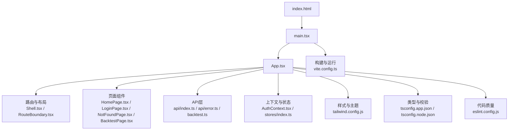
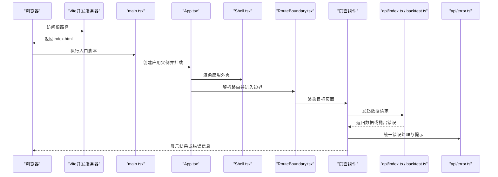
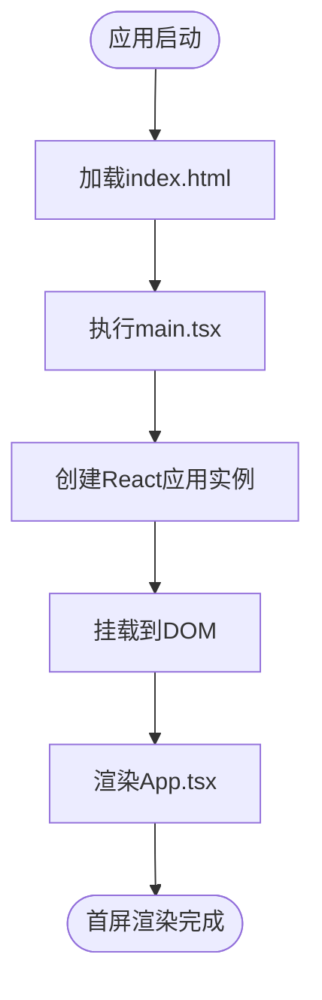
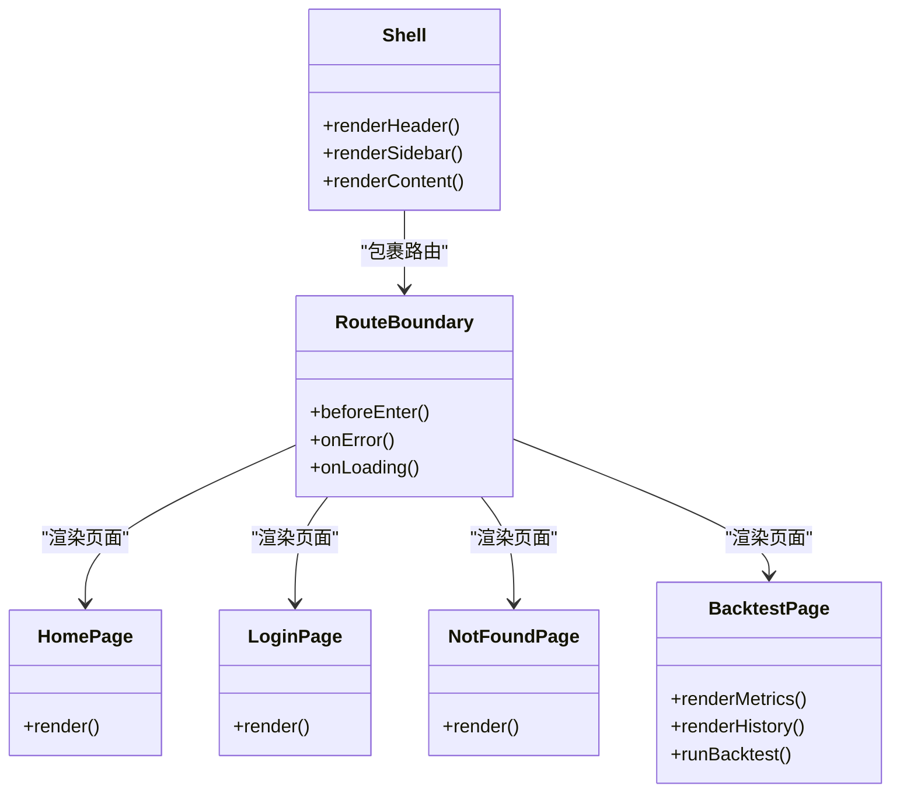
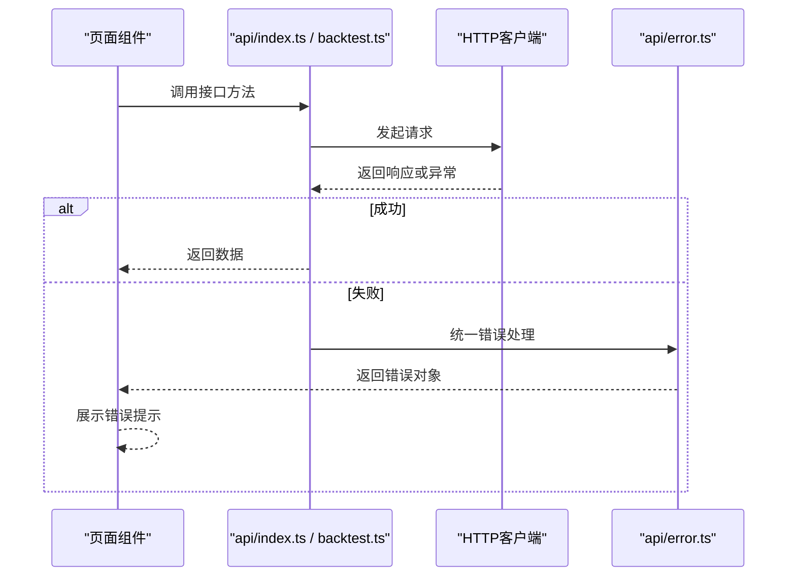
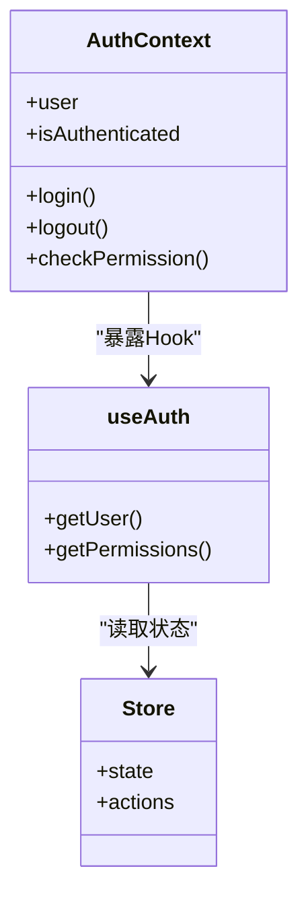
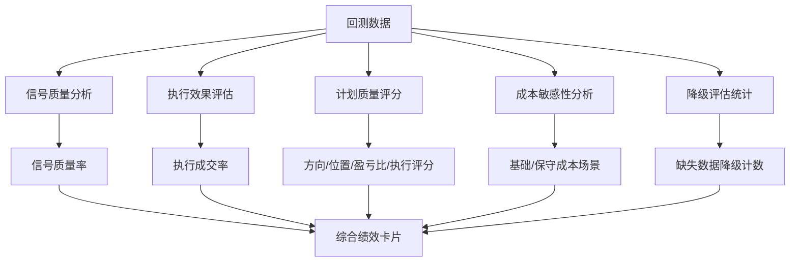
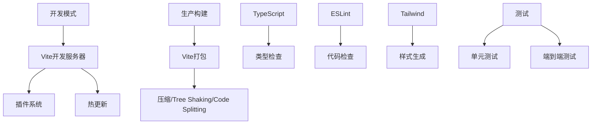
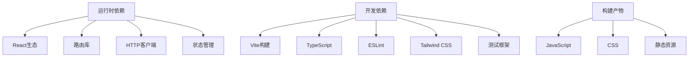

# Web应用架构

<cite>
**本文引用的文件**   
- [package.json](file://apps/dsa-web/package.json)
- [vite.config.ts](file://apps/dsa-web/vite.config.ts)
- [tsconfig.app.json](file://apps/dsa-web/tsconfig.app.json)
- [tsconfig.node.json](file://apps/dsa-web/tsconfig.node.json)
- [eslint.config.js](file://apps/dsa-web/eslint.config.js)
- [index.html](file://apps/dsa-web/index.html)
- [main.tsx](file://apps/dsa-web/src/main.tsx)
- [App.tsx](file://apps/dsa-web/src/App.tsx)
- [api/index.ts](file://apps/dsa-web/src/api/index.ts)
- [api/error.ts](file://apps/dsa-web/src/api/error.ts)
- [components/layout/Shell.tsx](file://apps/dsa-web/src/components/layout/Shell.tsx)
- [components/layout/RouteBoundary.tsx](file://apps/dsa-web/src/components/layout/RouteBoundary.tsx)
- [pages/HomePage.tsx](file://apps/dsa-web/src/pages/HomePage.tsx)
- [pages/LoginPage.tsx](file://apps/dsa-web/src/pages/LoginPage.tsx)
- [pages/NotFoundPage.tsx](file://apps/dsa-web/src/pages/NotFoundPage.tsx)
- [pages/BacktestPage.tsx](file://apps/dsa-web/src/pages/BacktestPage.tsx)
- [contexts/AuthContext.tsx](file://apps/dsa-web/src/contexts/AuthContext.tsx)
- [hooks/useAuth.ts](file://apps/dsa-web/src/hooks/useAuth.ts)
- [stores/index.ts](file://apps/dsa-web/src/stores/index.ts)
- [tailwind.config.js](file://apps/dsa-web/tailwind.config.js)
- [vitest.config.ts](file://apps/dsa-web/vitest.config.ts)
- [playwright.config.ts](file://apps/dsa-web/playwright.config.ts)
- [types/backtest.ts](file://apps/dsa-web/src/types/backtest.ts)
- [api/backtest.ts](file://apps/dsa-web/src/api/backtest.ts)
- [i18n/uiText.ts](file://apps/dsa-web/src/i18n/uiText.ts)
</cite>

## 更新摘要
**变更内容**   
- 更新了回测页面组件的详细功能说明，包括新增的指标显示系统
- 增强了BTC回测功能的文档描述，涵盖信号质量率、执行成交率等关键指标
- 添加了计划质量评分系统的详细说明（方向/位置/盈亏比/执行）
- 新增了成本敏感性分析和降级评估计数的文档
- 完善了损失指标标签系统的中文翻译支持

## 目录
1. [简介](#简介)
2. [项目结构](#项目结构)
3. [核心组件](#核心组件)
4. [架构总览](#架构总览)
5. [详细组件分析](#详细组件分析)
6. [依赖分析](#依赖分析)
7. [性能考虑](#性能考虑)
8. [故障排查指南](#故障排查指南)
9. [结论](#结论)
10. [附录](#附录)

## 简介
本文件面向基于React与TypeScript的前端工程，系统化梳理Web应用的初始化流程、路由配置、模块组织与依赖管理；详细说明Vite构建配置、开发环境与生产环境优化策略；解释TypeScript配置、代码规范与ESLint规则；并给出前端工程化最佳实践、性能优化策略与错误处理机制。同时提供开发环境搭建指南与常见问题解决方案，帮助团队快速上手与维护。

## 项目结构
前端位于 apps/dsa-web 子包，采用Vite + React + TypeScript技术栈，结合Tailwind CSS进行样式管理，使用Vitest进行单元测试，Playwright进行端到端测试。整体目录按功能域划分：
- src/api：API请求封装与接口定义
- src/components：可复用UI组件（通用、布局、业务模块）
- src/contexts：全局上下文（如认证、国际化）
- src/hooks：自定义Hook（状态、数据流、副作用）
- src/pages：页面级组件与路由入口
- src/stores：状态管理（轻量Store）
- src/types：类型定义
- src/utils：工具函数与常量
- public：静态资源
- 根配置文件：Vite、TS、ESLint、Tailwind、测试等

图表来源
- [index.html:1-50](file://apps/dsa-web/index.html#L1-L50)
- [main.tsx:1-80](file://apps/dsa-web/src/main.tsx#L1-L80)
- [App.tsx:1-120](file://apps/dsa-web/src/App.tsx#L1-L120)
- [vite.config.ts:1-120](file://apps/dsa-web/vite.config.ts#L1-L120)
- [tsconfig.app.json:1-60](file://apps/dsa-web/tsconfig.app.json#L1-L60)
- [tsconfig.node.json:1-40](file://apps/dsa-web/tsconfig.node.json#L1-L40)
- [eslint.config.js:1-80](file://apps/dsa-web/eslint.config.js#L1-L80)
- [tailwind.config.js:1-60](file://apps/dsa-web/tailwind.config.js#L1-L60)

章节来源
- [package.json:1-120](file://apps/dsa-web/package.json#L1-L120)
- [index.html:1-50](file://apps/dsa-web/index.html#L1-L50)
- [main.tsx:1-80](file://apps/dsa-web/src/main.tsx#L1-L80)
- [App.tsx:1-120](file://apps/dsa-web/src/App.tsx#L1-L120)

## 核心组件
- 应用入口与初始化
  - index.html作为HTML模板，挂载根节点
  - main.tsx负责创建React应用实例、注入全局上下文与样式
  - App.tsx组合路由、布局与全局状态，完成首屏渲染
- 路由与布局
  - Shell.tsx提供应用外壳（头部、侧边栏、内容区）
  - RouteBoundary.tsx提供路由边界能力（加载、错误、权限拦截）
  - 页面组件按功能域拆分（首页、登录、未找到、回测等）
- API层与错误处理
  - api/index.ts统一导出接口方法，集中管理请求参数与响应类型
  - api/error.ts封装错误分类、提示与重试策略
  - backtest.ts专门处理BTC回测相关的API调用
- 状态管理与上下文
  - AuthContext.tsx管理用户认证状态与生命周期
  - stores/index.ts聚合轻量状态（可选Zustand/Redux等）
- 构建与工程化
  - vite.config.ts配置开发服务器、插件、代理、打包优化
  - tsconfig.* 配置类型检查、路径别名、编译选项
  - eslint.config.js统一代码风格与规则
  - tailwind.config.js定制主题与插件

章节来源
- [main.tsx:1-80](file://apps/dsa-web/src/main.tsx#L1-L80)
- [App.tsx:1-120](file://apps/dsa-web/src/App.tsx#L1-L120)
- [components/layout/Shell.tsx:1-120](file://apps/dsa-web/src/components/layout/Shell.tsx#L1-L120)
- [components/layout/RouteBoundary.tsx:1-100](file://apps/dsa-web/src/components/layout/RouteBoundary.tsx#L1-L100)
- [api/index.ts:1-120](file://apps/dsa-web/src/api/index.ts#L1-L120)
- [api/error.ts:1-80](file://apps/dsa-web/src/api/error.ts#L1-L80)
- [api/backtest.ts:1-262](file://apps/dsa-web/src/api/backtest.ts#L1-L262)
- [contexts/AuthContext.tsx:1-120](file://apps/dsa-web/src/contexts/AuthContext.tsx#L1-L120)
- [stores/index.ts:1-60](file://apps/dsa-web/src/stores/index.ts#L1-L60)

## 架构总览
前端采用"页面-组件-状态-API"的分层架构，配合Vite的模块化与按需加载，实现高内聚低耦合。关键交互如下：
- 启动阶段：index.html -> main.tsx -> App.tsx -> 路由与布局 -> 页面渲染
- 数据流：页面组件通过Hooks或Store获取数据，调用api层发起HTTP请求，统一错误处理与提示
- 认证流程：AuthContext维护登录态，受保护路由在RouteBoundary中校验
- 构建阶段：Vite根据环境变量切换开发与生产配置，启用压缩、缓存、Tree Shaking等优化

图表来源
- [index.html:1-50](file://apps/dsa-web/index.html#L1-L50)
- [main.tsx:1-80](file://apps/dsa-web/src/main.tsx#L1-L80)
- [App.tsx:1-120](file://apps/dsa-web/src/App.tsx#L1-L120)
- [components/layout/Shell.tsx:1-120](file://apps/dsa-web/src/components/layout/Shell.tsx#L1-L120)
- [components/layout/RouteBoundary.tsx:1-100](file://apps/dsa-web/src/components/layout/RouteBoundary.tsx#L1-L100)
- [api/index.ts:1-120](file://apps/dsa-web/src/api/index.ts#L1-L120)
- [api/backtest.ts:1-262](file://apps/dsa-web/src/api/backtest.ts#L1-L262)
- [api/error.ts:1-80](file://apps/dsa-web/src/api/error.ts#L1-L80)

## 详细组件分析

### 应用初始化与入口
- index.html提供挂载点与基础元信息
- main.tsx初始化React应用、注入全局样式与上下文
- App.tsx组合路由、布局与全局状态，决定首屏渲染内容

图表来源
- [index.html:1-50](file://apps/dsa-web/index.html#L1-L50)
- [main.tsx:1-80](file://apps/dsa-web/src/main.tsx#L1-L80)
- [App.tsx:1-120](file://apps/dsa-web/src/App.tsx#L1-L120)

章节来源
- [index.html:1-50](file://apps/dsa-web/index.html#L1-L50)
- [main.tsx:1-80](file://apps/dsa-web/src/main.tsx#L1-L80)
- [App.tsx:1-120](file://apps/dsa-web/src/App.tsx#L1-L120)

### 路由与布局
- Shell.tsx定义应用外壳（头部导航、侧边栏、主内容区）
- RouteBoundary.tsx提供路由级别的加载、错误与权限控制
- 页面组件按功能域拆分，便于独立开发与测试

图表来源
- [components/layout/Shell.tsx:1-120](file://apps/dsa-web/src/components/layout/Shell.tsx#L1-L120)
- [components/layout/RouteBoundary.tsx:1-100](file://apps/dsa-web/src/components/layout/RouteBoundary.tsx#L1-L100)
- [pages/HomePage.tsx:1-120](file://apps/dsa-web/src/pages/HomePage.tsx#L1-L120)
- [pages/LoginPage.tsx:1-120](file://apps/dsa-web/src/pages/LoginPage.tsx#L1-L120)
- [pages/NotFoundPage.tsx:1-80](file://apps/dsa-web/src/pages/NotFoundPage.tsx#L1-L80)
- [pages/BacktestPage.tsx:1-991](file://apps/dsa-web/src/pages/BacktestPage.tsx#L1-L991)

章节来源
- [components/layout/Shell.tsx:1-120](file://apps/dsa-web/src/components/layout/Shell.tsx#L1-L120)
- [components/layout/RouteBoundary.tsx:1-100](file://apps/dsa-web/src/components/layout/RouteBoundary.tsx#L1-L100)
- [pages/HomePage.tsx:1-120](file://apps/dsa-web/src/pages/HomePage.tsx#L1-L120)
- [pages/LoginPage.tsx:1-120](file://apps/dsa-web/src/pages/LoginPage.tsx#L1-L120)
- [pages/NotFoundPage.tsx:1-80](file://apps/dsa-web/src/pages/NotFoundPage.tsx#L1-L80)

### API层与错误处理
- api/index.ts统一导出接口方法，集中管理请求参数、响应类型与拦截器
- api/error.ts封装错误分类、提示与重试策略，确保一致的异常体验
- backtest.ts专门处理BTC回测相关的复杂API调用，包括异步任务管理和批量操作

图表来源
- [api/index.ts:1-120](file://apps/dsa-web/src/api/index.ts#L1-L120)
- [api/backtest.ts:1-262](file://apps/dsa-web/src/api/backtest.ts#L1-L262)
- [api/error.ts:1-80](file://apps/dsa-web/src/api/error.ts#L1-L80)

章节来源
- [api/index.ts:1-120](file://apps/dsa-web/src/api/index.ts#L1-L120)
- [api/backtest.ts:1-262](file://apps/dsa-web/src/api/backtest.ts#L1-L262)
- [api/error.ts:1-80](file://apps/dsa-web/src/api/error.ts#L1-L80)

### 认证上下文与状态管理
- AuthContext.tsx管理用户认证状态、登录/登出逻辑与权限判断
- useAuth.ts提供便捷Hook用于组件内访问认证状态
- stores/index.ts聚合轻量状态，支持跨组件共享数据

图表来源
- [contexts/AuthContext.tsx:1-120](file://apps/dsa-web/src/contexts/AuthContext.tsx#L1-L120)
- [hooks/useAuth.ts:1-80](file://apps/dsa-web/src/hooks/useAuth.ts#L1-L80)
- [stores/index.ts:1-60](file://apps/dsa-web/src/stores/index.ts#L1-L60)

章节来源
- [contexts/AuthContext.tsx:1-120](file://apps/dsa-web/src/contexts/AuthContext.tsx#L1-L120)
- [hooks/useAuth.ts:1-80](file://apps/dsa-web/src/hooks/useAuth.ts#L1-L80)
- [stores/index.ts:1-60](file://apps/dsa-web/src/stores/index.ts#L1-L60)

### 回测页面组件增强功能

**更新** BacktestPage组件经过大幅增强，提供了全面的BTC回测分析和可视化功能。

#### 核心指标显示系统
- **信号质量率**：衡量交易信号的整体质量，过滤低质量信号
- **执行成交率**：反映委托订单的实际成交比例
- **触价代理胜率**：基于价格触发条件的策略表现
- **原始方向命中率**：包含MFE/MAE的方向预测准确性

#### 计划质量评分系统
- **方向评分**：评估做多/做空方向的准确性
- **位置评分**：评价入场点位的选择质量
- **盈亏比评分**：衡量风险回报比的合理性
- **执行评分**：评估实际执行效果

#### 成本敏感性分析
- **基础成本场景**：手续费5bps + 滑点2bps
- **保守成本场景**：手续费15bps + 滑点10bps
- **净收益对比**：不同成本假设下的收益影响

#### 降级评估计数
- **缺失数据降级**：记录因数据不完整而降低评估质量的次数
- **数据层统计**：按数据类型统计缺失情况
- **样本可信度**：基于样本数量的置信度评估

#### 损失指标标签系统
实现了完整的中文翻译支持，包括：
- **价格行为**：价格在上方/下方/附近
- **EMA/VWAP**：多头排列/空头排列/方向混合
- **成交量**：低量/正常量能/放量
- **波动状态**：波动收缩/波动升高/极端波动
- **订单流**：买卖均衡/主动买方占优/主动卖方占优
- **多周期方向**：同向做多/同向做空/逆势做多/逆势做空
- **行情事件**：向上突破/向下跌破/区间震荡等

图表来源
- [pages/BacktestPage.tsx:172-274](file://apps/dsa-web/src/pages/BacktestPage.tsx#L172-L274)
- [types/backtest.ts:251-293](file://apps/dsa-web/src/types/backtest.ts#L251-L293)

章节来源
- [pages/BacktestPage.tsx:1-991](file://apps/dsa-web/src/pages/BacktestPage.tsx#L1-L991)
- [types/backtest.ts:1-324](file://apps/dsa-web/src/types/backtest.ts#L1-L324)
- [api/backtest.ts:1-262](file://apps/dsa-web/src/api/backtest.ts#L1-L262)

### 构建配置与工程化
- vite.config.ts：开发服务器、插件、代理、打包优化、环境变量
- tsconfig.app.json / tsconfig.node.json：类型检查、路径别名、编译选项
- eslint.config.js：代码风格、规则、自动化修复
- tailwind.config.js：主题、插件、响应式断点
- vitest.config.ts / playwright.config.ts：单元测试与端到端测试配置

图表来源
- [vite.config.ts:1-120](file://apps/dsa-web/vite.config.ts#L1-L120)
- [tsconfig.app.json:1-60](file://apps/dsa-web/tsconfig.app.json#L1-L60)
- [tsconfig.node.json:1-40](file://apps/dsa-web/tsconfig.node.json#L1-L40)
- [eslint.config.js:1-80](file://apps/dsa-web/eslint.config.js#L1-L80)
- [tailwind.config.js:1-60](file://apps/dsa-web/tailwind.config.js#L1-L60)
- [vitest.config.ts:1-60](file://apps/dsa-web/vitest.config.ts#L1-L60)
- [playwright.config.ts:1-80](file://apps/dsa-web/playwright.config.ts#L1-L80)

章节来源
- [vite.config.ts:1-120](file://apps/dsa-web/vite.config.ts#L1-L120)
- [tsconfig.app.json:1-60](file://apps/dsa-web/tsconfig.app.json#L1-L60)
- [tsconfig.node.json:1-40](file://apps/dsa-web/tsconfig.node.json#L1-L40)
- [eslint.config.js:1-80](file://apps/dsa-web/eslint.config.js#L1-L80)
- [tailwind.config.js:1-60](file://apps/dsa-web/tailwind.config.js#L1-L60)
- [vitest.config.ts:1-60](file://apps/dsa-web/vitest.config.ts#L1-L60)
- [playwright.config.ts:1-80](file://apps/dsa-web/playwright.config.ts#L1-L80)

## 依赖分析
前端依赖关系清晰分层：
- 运行时依赖：React、React Router、Axios/Fetch封装、状态管理等
- 开发依赖：Vite、TypeScript、ESLint、Tailwind、测试框架等
- 构建产物：静态资源、JS/CSS、Source Map等

图表来源
- [package.json:1-120](file://apps/dsa-web/package.json#L1-L120)

章节来源
- [package.json:1-120](file://apps/dsa-web/package.json#L1-L120)

## 性能考虑
- 构建优化
  - 启用Tree Shaking移除未使用代码
  - 代码分割（路由级、组件级）减少首屏体积
  - 资源压缩（JS/CSS/图片）与缓存策略
- 运行时优化
  - 懒加载与预加载策略
  - 虚拟列表与分页优化大数据渲染
  - 防抖/节流减少频繁计算与请求
- 网络优化
  - 接口合并与缓存
  - 错误重试与降级策略
  - CDN加速静态资源

[本节为通用指导，不直接分析具体文件]

## 故障排查指南
- 常见构建问题
  - TypeScript类型错误：检查tsconfig配置与类型定义
  - Vite插件冲突：禁用可疑插件定位问题
  - 路径别名失效：确认tsconfig与IDE配置一致
- 运行时问题
  - 路由跳转失败：检查路由配置与权限守卫
  - API请求失败：查看网络面板与错误处理逻辑
  - 状态不同步：检查上下文与Store更新逻辑
- 调试技巧
  - 使用浏览器开发者工具断点调试
  - 开启Source Map定位源码位置
  - 使用日志与监控上报错误

章节来源
- [api/error.ts:1-80](file://apps/dsa-web/src/api/error.ts#L1-L80)
- [components/layout/RouteBoundary.tsx:1-100](file://apps/dsa-web/src/components/layout/RouteBoundary.tsx#L1-L100)
- [contexts/AuthContext.tsx:1-120](file://apps/dsa-web/src/contexts/AuthContext.tsx#L1-L120)

## 结论
本Web应用采用现代化的前端工程化方案，以Vite为核心构建工具，结合React、TypeScript与Tailwind CSS，实现了高内聚低耦合的模块化架构。通过统一的API层、错误处理机制与状态管理，保障了代码质量与用户体验。特别是BacktestPage组件的大幅增强，提供了全面的BTC回测分析功能，包括信号质量率、执行成交率、计划质量评分、成本敏感性分析等关键指标，以及完善的中文本地化支持。在生产环境中，通过构建优化与运行时策略，有效提升了性能与稳定性。建议团队遵循本文档的最佳实践，持续优化代码结构与性能表现。

[本节为总结性内容，不直接分析具体文件]

## 附录
- 开发环境搭建
  - 安装Node.js与包管理器
  - 克隆仓库并安装依赖
  - 配置环境变量与代理
  - 启动开发服务器
- 常见命令
  - 开发：npm run dev
  - 构建：npm run build
  - 预览：npm run preview
  - 测试：npm run test
  - 代码检查：npm run lint
- 部署建议
  - 静态资源托管（CDN）
  - 反向代理配置
  - 环境变量隔离
  - 监控与日志收集

[本节为补充信息，不直接分析具体文件]