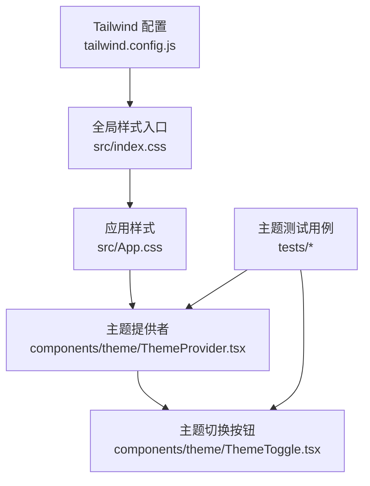
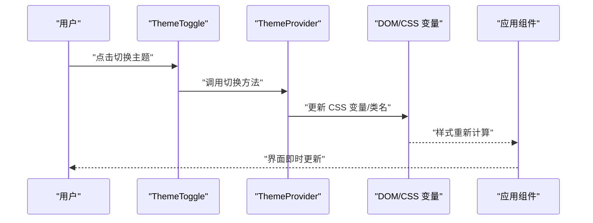
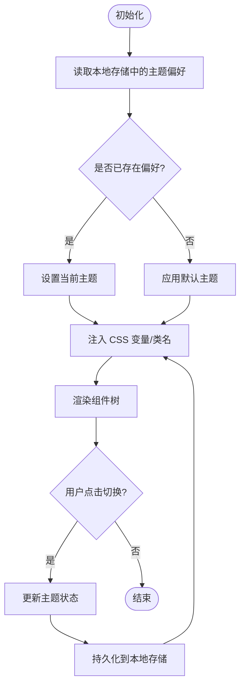
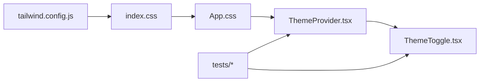

# 主题配置

<cite>
**本文引用的文件**   
- [apps/dsa-web/tailwind.config.js](file://apps/dsa-web/tailwind.config.js)
- [apps/dsa-web/src/index.css](file://apps/dsa-web/src/index.css)
- [apps/dsa-web/src/App.css](file://apps/dsa-web/src/App.css)
- [apps/dsa-web/src/components/theme/ThemeProvider.tsx](file://apps/dsa-web/src/components/theme/ThemeProvider.tsx)
- [apps/dsa-web/src/components/theme/ThemeToggle.tsx](file://apps/dsa-web/src/components/theme/ThemeToggle.tsx)
- [apps/dsa-web/tests/login-theme-tokens.test.ts](file://apps/dsa-web/tests/login-theme-tokens.test.ts)
- [apps/dsa-web/tests/index.theme-bootstrap.test.ts](file://apps/dsa-web/tests/index.theme-bootstrap.test.ts)
</cite>

## 目录
1. [简介](#简介)
2. [项目结构](#项目结构)
3. [核心组件](#核心组件)
4. [架构总览](#架构总览)
5. [详细组件分析](#详细组件分析)
6. [依赖关系分析](#依赖关系分析)
7. [性能考虑](#性能考虑)
8. [故障排查指南](#故障排查指南)
9. [结论](#结论)
10. [附录](#附录)

## 简介
本文件面向基于 Tailwind CSS 的主题系统与样式管理，覆盖深色模式切换、动态主题定制与 CSS 变量使用；系统化说明颜色系统、字体规范与间距标准；解释响应式设计与断点配置、移动端适配策略；并给出样式隔离、组件样式覆盖与第三方库样式集成的实践建议。同时提供主题开发指南、样式调试工具与性能优化建议，帮助开发者高效构建可维护、可扩展的前端主题体系。

## 项目结构
本项目的前端位于 apps/dsa-web，主题相关的关键位置如下：
- Tailwind 配置入口：tailwind.config.js
- 全局样式入口：src/index.css（引入 Tailwind 基础层）
- 应用级样式：src/App.css（可选的根级样式）
- 主题上下文与切换：src/components/theme/ThemeProvider.tsx、ThemeToggle.tsx
- 主题测试用例：tests/*.test.ts（用于校验主题初始化与令牌注入）

图表来源
- [apps/dsa-web/tailwind.config.js](file://apps/dsa-web/tailwind.config.js)
- [apps/dsa-web/src/index.css](file://apps/dsa-web/src/index.css)
- [apps/dsa-web/src/App.css](file://apps/dsa-web/src/App.css)
- [apps/dsa-web/src/components/theme/ThemeProvider.tsx](file://apps/dsa-web/src/components/theme/ThemeProvider.tsx)
- [apps/dsa-web/src/components/theme/ThemeToggle.tsx](file://apps/dsa-web/src/components/theme/ThemeToggle.tsx)
- [apps/dsa-web/tests/login-theme-tokens.test.ts](file://apps/dsa-web/tests/login-theme-tokens.test.ts)
- [apps/dsa-web/tests/index.theme-bootstrap.test.ts](file://apps/dsa-web/tests/index.theme-bootstrap.test.ts)

章节来源
- [apps/dsa-web/tailwind.config.js](file://apps/dsa-web/tailwind.config.js)
- [apps/dsa-web/src/index.css](file://apps/dsa-web/src/index.css)
- [apps/dsa-web/src/App.css](file://apps/dsa-web/src/App.css)
- [apps/dsa-web/src/components/theme/ThemeProvider.tsx](file://apps/dsa-web/src/components/theme/ThemeProvider.tsx)
- [apps/dsa-web/src/components/theme/ThemeToggle.tsx](file://apps/dsa-web/src/components/theme/ThemeToggle.tsx)
- [apps/dsa-web/tests/login-theme-tokens.test.ts](file://apps/dsa-web/tests/login-theme-tokens.test.ts)
- [apps/dsa-web/tests/index.theme-bootstrap.test.ts](file://apps/dsa-web/tests/index.theme-bootstrap.test.ts)

## 核心组件
- Tailwind 配置（tailwind.config.js）
  - 定义主题色板、字体族、间距、断点等设计令牌
  - 通过扩展机制为深色模式提供独立配色与样式映射
  - 支持插件化能力，便于集成第三方样式或自定义生成器
- 全局样式（index.css）
  - 引入 Tailwind 的基础层（base、components、utilities）
  - 声明 CSS 变量（如 --color-*、--font-*、--spacing-*），供运行时主题切换使用
- 应用样式（App.css）
  - 根级布局与全局过渡效果（例如主题切换时的平滑过渡）
- 主题提供者（ThemeProvider.tsx）
  - 管理当前主题状态（浅色/深色）
  - 将主题令牌注入到 DOM/CSS 变量中，驱动 UI 实时刷新
- 主题切换（ThemeToggle.tsx）
  - 暴露用户交互入口，触发主题状态更新与持久化存储（如 localStorage）
- 测试用例（tests/*）
  - 验证主题初始化流程、CSS 变量注入与令牌可用性

章节来源
- [apps/dsa-web/tailwind.config.js](file://apps/dsa-web/tailwind.config.js)
- [apps/dsa-web/src/index.css](file://apps/dsa-web/src/index.css)
- [apps/dsa-web/src/App.css](file://apps/dsa-web/src/App.css)
- [apps/dsa-web/src/components/theme/ThemeProvider.tsx](file://apps/dsa-web/src/components/theme/ThemeProvider.tsx)
- [apps/dsa-web/src/components/theme/ThemeToggle.tsx](file://apps/dsa-web/src/components/theme/ThemeToggle.tsx)
- [apps/dsa-web/tests/login-theme-tokens.test.ts](file://apps/dsa-web/tests/login-theme-tokens.test.ts)
- [apps/dsa-web/tests/index.theme-bootstrap.test.ts](file://apps/dsa-web/tests/index.theme-bootstrap.test.ts)

## 架构总览
下图展示了主题系统在运行时的数据流与控制流：从 Tailwind 配置与设计令牌出发，经由全局样式与 CSS 变量，由主题提供者统一注入，最终在组件树中生效。

图表来源
- [apps/dsa-web/src/components/theme/ThemeToggle.tsx](file://apps/dsa-web/src/components/theme/ThemeToggle.tsx)
- [apps/dsa-web/src/components/theme/ThemeProvider.tsx](file://apps/dsa-web/src/components/theme/ThemeProvider.tsx)
- [apps/dsa-web/src/index.css](file://apps/dsa-web/src/index.css)

## 详细组件分析

### Tailwind 配置与主题令牌
- 颜色系统
  - 通过扩展主题色板，定义语义化颜色（如 primary、secondary、surface、text、border 等）
  - 为深色模式提供独立的调色映射，确保对比度与可读性
- 字体规范
  - 定义字体族集合（无衬线、等宽、中文友好字体等）
  - 提供字号层级与行高规范，保证排版一致性
- 间距标准
  - 基于 4px 网格的间距尺度，统一 padding/margin/gap
- 响应式与断点
  - 配置 sm/md/lg/xl/2xl 等断点，结合 Tailwind 的响应式前缀实现多端适配
- 插件与扩展
  - 按需启用插件（如 forms、typography、container-queries 等），增强表单与排版能力

章节来源
- [apps/dsa-web/tailwind.config.js](file://apps/dsa-web/tailwind.config.js)

### 全局样式与 CSS 变量
- 基础层导入
  - 在 index.css 中引入 Tailwind 的基础层，确保 reset、base 样式生效
- CSS 变量声明
  - 在 :root 与 [data-theme="dark"] 下分别声明变量，实现运行时主题切换
  - 变量命名遵循语义化约定（如 --color-primary、--font-sans、--space-md）
- 过渡与动画
  - 在 App.css 中定义主题切换的过渡效果，提升用户体验

章节来源
- [apps/dsa-web/src/index.css](file://apps/dsa-web/src/index.css)
- [apps/dsa-web/src/App.css](file://apps/dsa-web/src/App.css)

### 主题提供者与切换逻辑
- 状态管理
  - 使用 React Context 或类似机制维护主题状态（light/dark）
- 变量注入
  - 根据当前主题动态设置 CSS 变量或根节点类名，驱动样式更新
- 持久化
  - 将主题偏好保存到 localStorage，确保页面刷新后保持一致
- 切换入口
  - ThemeToggle 提供按钮或图标，触发切换流程

图表来源
- [apps/dsa-web/src/components/theme/ThemeProvider.tsx](file://apps/dsa-web/src/components/theme/ThemeProvider.tsx)
- [apps/dsa-web/src/components/theme/ThemeToggle.tsx](file://apps/dsa-web/src/components/theme/ThemeToggle.tsx)

章节来源
- [apps/dsa-web/src/components/theme/ThemeProvider.tsx](file://apps/dsa-web/src/components/theme/ThemeProvider.tsx)
- [apps/dsa-web/src/components/theme/ThemeToggle.tsx](file://apps/dsa-web/src/components/theme/ThemeToggle.tsx)

### 响应式设计、断点与移动端适配
- 断点策略
  - 使用 Tailwind 内置断点（sm/md/lg/xl/2xl）组织布局与组件行为
- 移动端优先
  - 以移动端为基础样式，逐步增强至平板与桌面端
- 容器查询与弹性布局
  - 结合 container-queries 与 flex/grid 实现更灵活的自适应布局
- 触控与可访问性
  - 增大触控区域、优化对比度与焦点样式，提升移动端体验

章节来源
- [apps/dsa-web/tailwind.config.js](file://apps/dsa-web/tailwind.config.js)

### 样式隔离、组件样式覆盖与第三方库集成
- 样式隔离
  - 使用 CSS Modules 或 scoped 样式避免全局污染
  - 通过命名空间或 BEM 风格类名提高可维护性
- 组件样式覆盖
  - 在组件内部定义默认样式，并通过 props 或 className 允许外部覆盖
- 第三方库集成
  - 使用 Tailwind 插件（如 @tailwindcss/forms、@tailwindcss/typography）统一风格
  - 对第三方组件使用 wrapper 或样式桥接，确保与主题一致

章节来源
- [apps/dsa-web/tailwind.config.js](file://apps/dsa-web/tailwind.config.js)
- [apps/dsa-web/src/index.css](file://apps/dsa-web/src/index.css)

### 颜色系统、字体规范与间距标准
- 颜色系统
  - 语义化颜色（primary/secondary/surface/text/border）
  - 深色模式下的对比度校验与无障碍优化
- 字体规范
  - 字体族、字号层级、行高与字重组合
  - 中英文混排优化（如 Noto Sans SC、Inter、Fira Code）
- 间距标准
  - 基于 4px 网格的 scale（xs/sm/md/lg/xl/2xl）
  - 统一的内边距与外边距规则，保持视觉节奏

章节来源
- [apps/dsa-web/tailwind.config.js](file://apps/dsa-web/tailwind.config.js)

### 主题开发指南与调试工具
- 开发指南
  - 新增颜色/字体/间距时，先在 tailwind.config.js 中扩展，再在 index.css 中声明对应 CSS 变量
  - 在 ThemeProvider 中统一管理变量注入与切换逻辑
- 调试工具
  - 浏览器开发者工具检查 CSS 变量值与 computed styles
  - 使用 Vitest 测试用例验证主题初始化与令牌注入（login-theme-tokens.test.ts、index.theme-bootstrap.test.ts）
- 性能优化
  - 减少不必要的重绘与回流，利用 will-change 与 transform 优化动画
  - 按需加载样式与组件，降低首屏体积

章节来源
- [apps/dsa-web/tests/login-theme-tokens.test.ts](file://apps/dsa-web/tests/login-theme-tokens.test.ts)
- [apps/dsa-web/tests/index.theme-bootstrap.test.ts](file://apps/dsa-web/tests/index.theme-bootstrap.test.ts)

## 依赖关系分析
主题系统的依赖关系如下：
- Tailwind 配置驱动设计令牌
- 全局样式引入 Tailwind 基础层并声明 CSS 变量
- 主题提供者管理状态与变量注入
- 切换按钮触发状态更新
- 测试用例保障主题初始化与令牌可用

图表来源
- [apps/dsa-web/tailwind.config.js](file://apps/dsa-web/tailwind.config.js)
- [apps/dsa-web/src/index.css](file://apps/dsa-web/src/index.css)
- [apps/dsa-web/src/App.css](file://apps/dsa-web/src/App.css)
- [apps/dsa-web/src/components/theme/ThemeProvider.tsx](file://apps/dsa-web/src/components/theme/ThemeProvider.tsx)
- [apps/dsa-web/src/components/theme/ThemeToggle.tsx](file://apps/dsa-web/src/components/theme/ThemeToggle.tsx)
- [apps/dsa-web/tests/login-theme-tokens.test.ts](file://apps/dsa-web/tests/login-theme-tokens.test.ts)
- [apps/dsa-web/tests/index.theme-bootstrap.test.ts](file://apps/dsa-web/tests/index.theme-bootstrap.test.ts)

章节来源
- [apps/dsa-web/tailwind.config.js](file://apps/dsa-web/tailwind.config.js)
- [apps/dsa-web/src/index.css](file://apps/dsa-web/src/index.css)
- [apps/dsa-web/src/App.css](file://apps/dsa-web/src/App.css)
- [apps/dsa-web/src/components/theme/ThemeProvider.tsx](file://apps/dsa-web/src/components/theme/ThemeProvider.tsx)
- [apps/dsa-web/src/components/theme/ThemeToggle.tsx](file://apps/dsa-web/src/components/theme/ThemeToggle.tsx)
- [apps/dsa-web/tests/login-theme-tokens.test.ts](file://apps/dsa-web/tests/login-theme-tokens.test.ts)
- [apps/dsa-web/tests/index.theme-bootstrap.test.ts](file://apps/dsa-web/tests/index.theme-bootstrap.test.ts)

## 性能考虑
- 样式体积控制
  - 仅引入必要的 Tailwind 插件与功能，避免全量生成
- 运行时开销
  - 尽量减少频繁的主题切换导致的重绘，必要时使用 CSS 动画替代 JS 动画
- 缓存与预取
  - 将主题变量与常用样式预加载，缩短首次渲染时间
- 可访问性与对比度
  - 确保深色模式下文本与背景对比度符合 WCAG 标准

[本节为通用指导，不直接分析具体文件]

## 故障排查指南
- 主题未生效
  - 检查 index.css 是否正确引入 Tailwind 基础层
  - 确认 ThemeProvider 已在应用根节点包裹
- CSS 变量缺失
  - 在浏览器开发者工具中检查 :root 与 [data-theme="dark"] 下的变量是否存在
- 切换无效
  - 验证 ThemeToggle 是否正确调用切换方法并持久化状态
- 样式冲突
  - 使用浏览器“元素”面板定位冲突样式，必要时增加选择器优先级或使用命名空间

章节来源
- [apps/dsa-web/src/index.css](file://apps/dsa-web/src/index.css)
- [apps/dsa-web/src/components/theme/ThemeProvider.tsx](file://apps/dsa-web/src/components/theme/ThemeProvider.tsx)
- [apps/dsa-web/src/components/theme/ThemeToggle.tsx](file://apps/dsa-web/src/components/theme/ThemeToggle.tsx)

## 结论
通过 Tailwind 配置、全局样式与主题提供者的协同工作，本项目实现了稳定、可扩展的主题系统。深色模式切换、动态主题定制与 CSS 变量的使用，使界面具备高度可定制性与良好的用户体验。配合响应式设计与样式隔离策略，开发者可以高效地构建跨设备一致的界面。测试用例保障了主题初始化与令牌注入的正确性，为长期维护提供了可靠性。

[本节为总结性内容，不直接分析具体文件]

## 附录
- 最佳实践清单
  - 使用语义化颜色与命名空间，避免样式污染
  - 基于 4px 网格统一间距，提升视觉一致性
  - 在深色模式下进行对比度与可访问性校验
  - 通过测试用例覆盖主题初始化与切换路径
- 参考资源
  - Tailwind 官方文档（主题扩展、插件、响应式）
  - CSS 变量与 prefers-color-scheme 的使用指南
  - 可访问性标准（WCAG）与深色模式设计建议

[本节为补充信息，不直接分析具体文件]