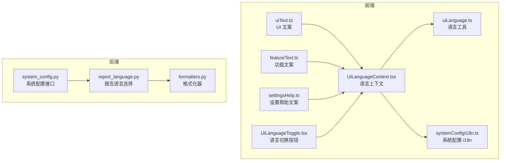
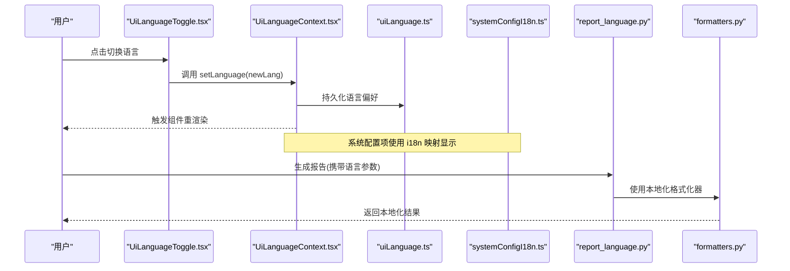
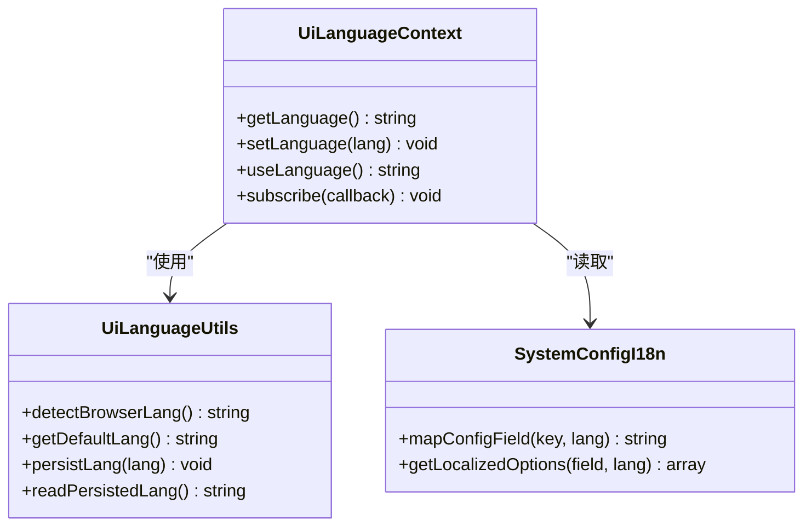
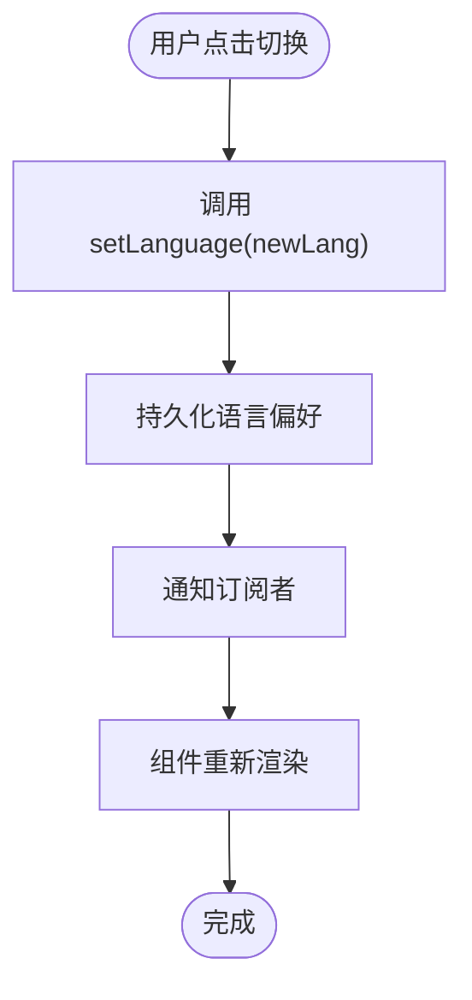
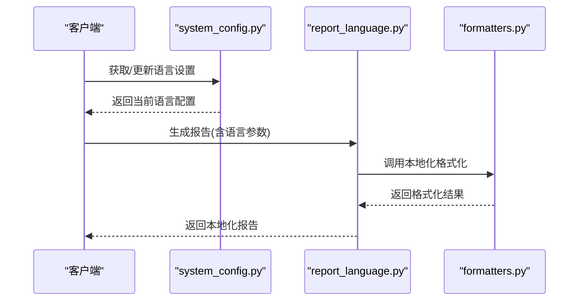
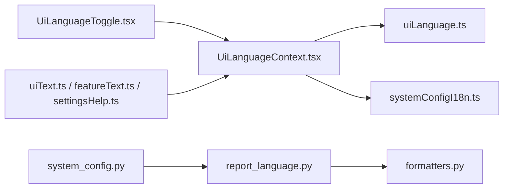

# 国际化

<cite>
**本文引用的文件**   
- [apps/dsa-web/src/i18n/uiText.ts](file://apps/dsa-web/src/i18n/uiText.ts)
- [apps/dsa-web/src/locales/featureText.ts](file://apps/dsa-web/src/locales/featureText.ts)
- [apps/dsa-web/src/locales/settingsHelp.ts](file://apps/dsa-web/src/locales/settingsHelp.ts)
- [apps/dsa-web/src/components/i18n/UiLanguageToggle.tsx](file://apps/dsa-web/src/components/i18n/UiLanguageToggle.tsx)
- [apps/dsa-web/src/contexts/UiLanguageContext.tsx](file://apps/dsa-web/src/contexts/UiLanguageContext.tsx)
- [apps/dsa-web/src/utils/uiLanguage.ts](file://apps/dsa-web/src/utils/uiLanguage.ts)
- [apps/dsa-web/src/utils/systemConfigI18n.ts](file://apps/dsa-web/src/utils/systemConfigI18n.ts)
- [src/report_language.py](file://src/report_language.py)
- [src/formatters.py](file://src/formatters.py)
- [api/v1/endpoints/system_config.py](file://api/v1/endpoints/system_config.py)
- [tests/system_config_i18n.test.ts](file://apps/dsa-web/tests/system_config_i18n.test.ts)
- [tests/ui_governance.test.ts](file://apps/dsa-web/tests/ui_governance.test.ts)
</cite>

## 目录
1. [简介](#简介)
2. [项目结构](#项目结构)
3. [核心组件](#核心组件)
4. [架构总览](#架构总览)
5. [详细组件分析](#详细组件分析)
6. [依赖关系分析](#依赖关系分析)
7. [性能考虑](#性能考虑)
8. [故障排查指南](#故障排查指南)
9. [结论](#结论)
10. [附录](#附录)

## 简介
本文件面向“多语言支持”的设计与实现，覆盖前端界面国际化（i18n）与后端报告语言选择、文本翻译、格式化规则（日期时间、数字）、复数处理、RTL 语言支持、动态切换流程、翻译工作流、质量检查与更新机制，以及最佳实践、性能优化和调试方法。文档基于仓库中的实际代码结构与模块进行说明，确保读者既能快速上手，也能深入理解实现细节。

## 项目结构
本项目的前端 i18n 集中在 Web 应用目录中，包含：
- 文案资源：uiText.ts、featureText.ts、settingsHelp.ts
- 上下文与工具：UiLanguageContext.tsx、uiLanguage.ts、systemConfigI18n.ts
- UI 组件：UiLanguageToggle.tsx
- 测试用例：system_config_i18n.test.ts、ui_governance.test.ts

后端涉及报告语言与格式化的关键文件：
- report_language.py：报告语言选择与策略
- formatters.py：通用格式化能力（日期、数字等）
- system_config.py：系统配置接口，可能暴露语言相关设置

**图表来源** 
- [apps/dsa-web/src/i18n/uiText.ts](file://apps/dsa-web/src/i18n/uiText.ts)
- [apps/dsa-web/src/locales/featureText.ts](file://apps/dsa-web/src/locales/featureText.ts)
- [apps/dsa-web/src/locales/settingsHelp.ts](file://apps/dsa-web/src/locales/settingsHelp.ts)
- [apps/dsa-web/src/contexts/UiLanguageContext.tsx](file://apps/dsa-web/src/contexts/UiLanguageContext.tsx)
- [apps/dsa-web/src/utils/uiLanguage.ts](file://apps/dsa-web/src/utils/uiLanguage.ts)
- [apps/dsa-web/src/utils/systemConfigI18n.ts](file://apps/dsa-web/src/utils/systemConfigI18n.ts)
- [apps/dsa-web/src/components/i18n/UiLanguageToggle.tsx](file://apps/dsa-web/src/components/i18n/UiLanguageToggle.tsx)
- [src/report_language.py](file://src/report_language.py)
- [src/formatters.py](file://src/formatters.py)
- [api/v1/endpoints/system_config.py](file://api/v1/endpoints/system_config.py)

**章节来源**
- [apps/dsa-web/src/i18n/uiText.ts](file://apps/dsa-web/src/i18n/uiText.ts)
- [apps/dsa-web/src/locales/featureText.ts](file://apps/dsa-web/src/locales/featureText.ts)
- [apps/dsa-web/src/locales/settingsHelp.ts](file://apps/dsa-web/src/locales/settingsHelp.ts)
- [apps/dsa-web/src/contexts/UiLanguageContext.tsx](file://apps/dsa-web/src/contexts/UiLanguageContext.tsx)
- [apps/dsa-web/src/utils/uiLanguage.ts](file://apps/dsa-web/src/utils/uiLanguage.ts)
- [apps/dsa-web/src/utils/systemConfigI18n.ts](file://apps/dsa-web/src/utils/systemConfigI18n.ts)
- [apps/dsa-web/src/components/i18n/UiLanguageToggle.tsx](file://apps/dsa-web/src/components/i18n/UiLanguageToggle.tsx)
- [src/report_language.py](file://src/report_language.py)
- [src/formatters.py](file://src/formatters.py)
- [api/v1/endpoints/system_config.py](file://api/v1/endpoints/system_config.py)

## 核心组件
- 文案资源层
  - uiText.ts：集中管理界面文案键值对，便于统一引用与维护
  - featureText.ts：按功能域组织文案，提高可维护性
  - settingsHelp.ts：设置页帮助文案，提升用户引导体验
- 上下文与工具层
  - UiLanguageContext.tsx：提供全局语言状态与切换方法，驱动组件响应式更新
  - uiLanguage.ts：语言检测、默认语言、持久化存储等工具函数
  - systemConfigI18n.ts：将系统配置项映射为多语言展示文本
- UI 交互层
  - UiLanguageToggle.tsx：语言切换按钮，触发上下文更新并持久化偏好
- 后端服务层
  - report_language.py：根据请求或配置选择报告语言，影响输出内容
  - formatters.py：日期、时间、数字等本地化格式化
  - system_config.py：系统配置 API，可能暴露语言相关设置项

**章节来源**
- [apps/dsa-web/src/i18n/uiText.ts](file://apps/dsa-web/src/i18n/uiText.ts)
- [apps/dsa-web/src/locales/featureText.ts](file://apps/dsa-web/src/locales/featureText.ts)
- [apps/dsa-web/src/locales/settingsHelp.ts](file://apps/dsa-web/src/locales/settingsHelp.ts)
- [apps/dsa-web/src/contexts/UiLanguageContext.tsx](file://apps/dsa-web/src/contexts/UiLanguageContext.tsx)
- [apps/dsa-web/src/utils/uiLanguage.ts](file://apps/dsa-web/src/utils/uiLanguage.ts)
- [apps/dsa-web/src/utils/systemConfigI18n.ts](file://apps/dsa-web/src/utils/systemConfigI18n.ts)
- [apps/dsa-web/src/components/i18n/UiLanguageToggle.tsx](file://apps/dsa-web/src/components/i18n/UiLanguageToggle.tsx)
- [src/report_language.py](file://src/report_language.py)
- [src/formatters.py](file://src/formatters.py)
- [api/v1/endpoints/system_config.py](file://api/v1/endpoints/system_config.py)

## 架构总览
前端通过上下文统一管理语言状态，组件订阅变化并渲染对应文案；后端根据配置或请求参数选择报告语言并使用格式化器输出本地化内容。

**图表来源** 
- [apps/dsa-web/src/components/i18n/UiLanguageToggle.tsx](file://apps/dsa-web/src/components/i18n/UiLanguageToggle.tsx)
- [apps/dsa-web/src/contexts/UiLanguageContext.tsx](file://apps/dsa-web/src/contexts/UiLanguageContext.tsx)
- [apps/dsa-web/src/utils/uiLanguage.ts](file://apps/dsa-web/src/utils/uiLanguage.ts)
- [apps/dsa-web/src/utils/systemConfigI18n.ts](file://apps/dsa-web/src/utils/systemConfigI18n.ts)
- [src/report_language.py](file://src/report_language.py)
- [src/formatters.py](file://src/formatters.py)

## 详细组件分析

### 前端文案与上下文
- 文案组织
  - uiText.ts：定义键名与多语言字符串的映射，建议按页面或功能域拆分
  - featureText.ts：功能级文案集合，便于按需加载与测试
  - settingsHelp.ts：设置页帮助文案，提升可访问性与易用性
- 上下文管理
  - UiLanguageContext.tsx：提供 getLanguage()、setLanguage()、useLanguage() 等能力，驱动 UI 响应式更新
  - uiLanguage.ts：封装语言检测（浏览器语言）、默认语言回退、localStorage 持久化
  - systemConfigI18n.ts：将系统配置字段转换为多语言描述，保证设置页一致性

**图表来源** 
- [apps/dsa-web/src/contexts/UiLanguageContext.tsx](file://apps/dsa-web/src/contexts/UiLanguageContext.tsx)
- [apps/dsa-web/src/utils/uiLanguage.ts](file://apps/dsa-web/src/utils/uiLanguage.ts)
- [apps/dsa-web/src/utils/systemConfigI18n.ts](file://apps/dsa-web/src/utils/systemConfigI18n.ts)

**章节来源**
- [apps/dsa-web/src/i18n/uiText.ts](file://apps/dsa-web/src/i18n/uiText.ts)
- [apps/dsa-web/src/locales/featureText.ts](file://apps/dsa-web/src/locales/featureText.ts)
- [apps/dsa-web/src/locales/settingsHelp.ts](file://apps/dsa-web/src/locales/settingsHelp.ts)
- [apps/dsa-web/src/contexts/UiLanguageContext.tsx](file://apps/dsa-web/src/contexts/UiLanguageContext.tsx)
- [apps/dsa-web/src/utils/uiLanguage.ts](file://apps/dsa-web/src/utils/uiLanguage.ts)
- [apps/dsa-web/src/utils/systemConfigI18n.ts](file://apps/dsa-web/src/utils/systemConfigI18n.ts)

### 语言切换交互流程
- 用户操作：点击语言切换按钮
- 状态更新：上下文更新语言并持久化
- 组件响应：订阅者重新渲染，文案即时切换
- 配置联动：系统配置项使用 i18n 映射，保持界面一致性

**图表来源** 
- [apps/dsa-web/src/components/i18n/UiLanguageToggle.tsx](file://apps/dsa-web/src/components/i18n/UiLanguageToggle.tsx)
- [apps/dsa-web/src/contexts/UiLanguageContext.tsx](file://apps/dsa-web/src/contexts/UiLanguageContext.tsx)
- [apps/dsa-web/src/utils/uiLanguage.ts](file://apps/dsa-web/src/utils/uiLanguage.ts)

**章节来源**
- [apps/dsa-web/src/components/i18n/UiLanguageToggle.tsx](file://apps/dsa-web/src/components/i18n/UiLanguageToggle.tsx)
- [apps/dsa-web/src/contexts/UiLanguageContext.tsx](file://apps/dsa-web/src/contexts/UiLanguageContext.tsx)
- [apps/dsa-web/src/utils/uiLanguage.ts](file://apps/dsa-web/src/utils/uiLanguage.ts)

### 后端报告语言与格式化
- 报告语言选择
  - report_language.py：根据请求参数或系统配置决定报告语言，影响文案与术语
- 格式化器
  - formatters.py：提供日期、时间、数字的本地化格式化，确保跨地区一致显示

**图表来源** 
- [api/v1/endpoints/system_config.py](file://api/v1/endpoints/system_config.py)
- [src/report_language.py](file://src/report_language.py)
- [src/formatters.py](file://src/formatters.py)

**章节来源**
- [src/report_language.py](file://src/report_language.py)
- [src/formatters.py](file://src/formatters.py)
- [api/v1/endpoints/system_config.py](file://api/v1/endpoints/system_config.py)

### 文本翻译、格式化规则与复数处理
- 文本翻译
  - 前端：通过 uiText.ts、featureText.ts、settingsHelp.ts 集中管理键值对，组件按 key 取值
  - 后端：report_language.py 控制输出语言，配合 formatters.py 进行本地化
- 格式化规则
  - 日期时间：使用 formatters.py 提供的本地化格式化，遵循区域习惯
  - 数字：千分位、小数点、货币符号等由格式化器处理
- 复数处理
  - 前端：建议在文案键中使用条件分支或复数规则库（如 i18next-plural），按数量选择不同文案
  - 后端：在报告生成时根据数量选择合适文案，避免硬编码

[本节为概念性说明，不直接分析具体文件]

### RTL 语言支持
- 布局方向：根据语言代码判断是否启用 RTL（右到左）布局
- 样式适配：CSS 类或 Tailwind 指令切换 direction 属性
- 组件适配：图标、对齐、滚动条等需针对 RTL 调整

[本节为概念性说明，不直接分析具体文件]

### 日期时间与数字格式化
- 日期时间：使用 formatters.py 的本地化方法，确保时区与区域正确
- 数字：统一使用格式化器，避免分散实现导致不一致

**章节来源**
- [src/formatters.py](file://src/formatters.py)

## 依赖关系分析
- 前端依赖
  - UiLanguageToggle.tsx 依赖 UiLanguageContext.tsx
  - UiLanguageContext.tsx 依赖 uiLanguage.ts 与 systemConfigI18n.ts
  - 文案资源被各组件按需引用
- 后端依赖
  - system_config.py 暴露语言设置接口
  - report_language.py 依赖 formatters.py 进行本地化

**图表来源** 
- [apps/dsa-web/src/components/i18n/UiLanguageToggle.tsx](file://apps/dsa-web/src/components/i18n/UiLanguageToggle.tsx)
- [apps/dsa-web/src/contexts/UiLanguageContext.tsx](file://apps/dsa-web/src/contexts/UiLanguageContext.tsx)
- [apps/dsa-web/src/utils/uiLanguage.ts](file://apps/dsa-web/src/utils/uiLanguage.ts)
- [apps/dsa-web/src/utils/systemConfigI18n.ts](file://apps/dsa-web/src/utils/systemConfigI18n.ts)
- [apps/dsa-web/src/i18n/uiText.ts](file://apps/dsa-web/src/i18n/uiText.ts)
- [apps/dsa-web/src/locales/featureText.ts](file://apps/dsa-web/src/locales/featureText.ts)
- [apps/dsa-web/src/locales/settingsHelp.ts](file://apps/dsa-web/src/locales/settingsHelp.ts)
- [api/v1/endpoints/system_config.py](file://api/v1/endpoints/system_config.py)
- [src/report_language.py](file://src/report_language.py)
- [src/formatters.py](file://src/formatters.py)

**章节来源**
- [apps/dsa-web/src/components/i18n/UiLanguageToggle.tsx](file://apps/dsa-web/src/components/i18n/UiLanguageToggle.tsx)
- [apps/dsa-web/src/contexts/UiLanguageContext.tsx](file://apps/dsa-web/src/contexts/UiLanguageContext.tsx)
- [apps/dsa-web/src/utils/uiLanguage.ts](file://apps/dsa-web/src/utils/uiLanguage.ts)
- [apps/dsa-web/src/utils/systemConfigI18n.ts](file://apps/dsa-web/src/utils/systemConfigI18n.ts)
- [apps/dsa-web/src/i18n/uiText.ts](file://apps/dsa-web/src/i18n/uiText.ts)
- [apps/dsa-web/src/locales/featureText.ts](file://apps/dsa-web/src/locales/featureText.ts)
- [apps/dsa-web/src/locales/settingsHelp.ts](file://apps/dsa-web/src/locales/settingsHelp.ts)
- [api/v1/endpoints/system_config.py](file://api/v1/endpoints/system_config.py)
- [src/report_language.py](file://src/report_language.py)
- [src/formatters.py](file://src/formatters.py)

## 性能考虑
- 文案懒加载：按路由或功能域拆分文案文件，减少初始包体积
- 缓存语言偏好：使用 localStorage 持久化，避免重复检测与计算
- 避免频繁重渲染：在上下文中合并状态更新，减少不必要的组件刷新
- 后端格式化缓存：对常用格式化结果进行缓存，降低 CPU 开销
- 资源压缩：生产环境启用 gzip/brotli，减小传输体积

[本节为通用指导，不直接分析具体文件]

## 故障排查指南
- 常见问题
  - 语言未生效：检查上下文是否正确订阅与更新，确认持久化逻辑
  - 文案缺失：核对 key 是否存在于文案文件中，确保组件引用路径正确
  - 格式化错误：确认区域设置与时区配置，检查格式化器输入类型
- 调试方法
  - 前端：在控制台打印当前语言与 key 映射，验证切换流程
  - 后端：记录报告语言选择与格式化参数，定位问题链路
- 测试用例参考
  - system_config_i18n.test.ts：验证系统配置 i18n 行为
  - ui_governance.test.ts：验证 UI 治理与语言切换稳定性

**章节来源**
- [tests/system_config_i18n.test.ts](file://apps/dsa-web/tests/system_config_i18n.test.ts)
- [tests/ui_governance.test.ts](file://apps/dsa-web/tests/ui_governance.test.ts)

## 结论
本项目的国际化方案以前端上下文为核心，结合文案资源与工具函数，实现了动态语言切换与本地化格式化；后端通过报告语言选择与格式化器，确保输出内容的区域一致性。建议继续完善复数处理、RTL 支持与文案质量检查流程，以提升用户体验与维护效率。

[本节为总结性内容，不直接分析具体文件]

## 附录
- 翻译工作流程建议
  - 新增文案：先在英文源文件添加 key，再补充目标语言翻译
  - 审核流程：引入翻译评审，确保术语一致性与可读性
  - 自动化：使用脚本扫描缺失 key 与未使用 key，定期清理
- 质量检查与更新机制
  - 静态检查：校验 key 一致性、拼写与占位符
  - 回归测试：覆盖语言切换与格式化场景
  - 版本同步：随功能迭代更新文案，保持向后兼容

[本节为概念性说明，不直接分析具体文件]