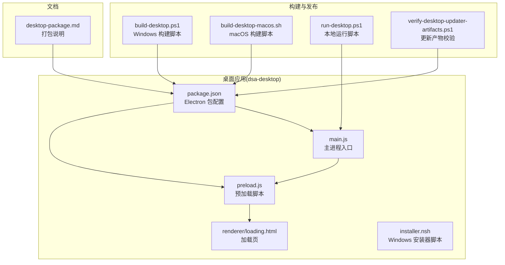
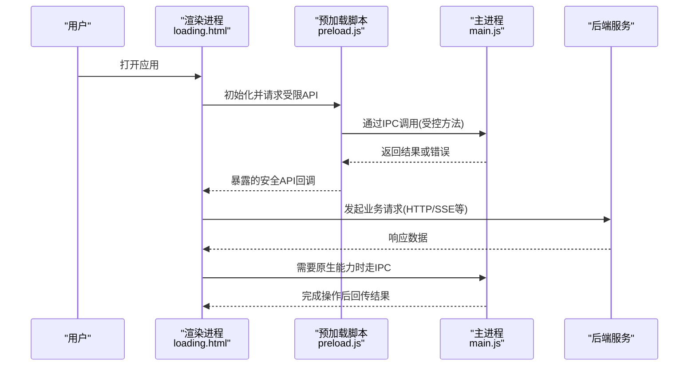
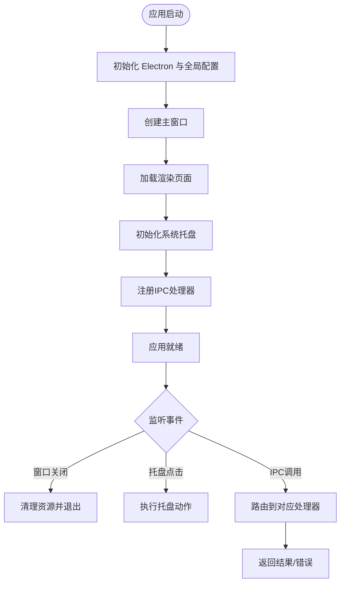
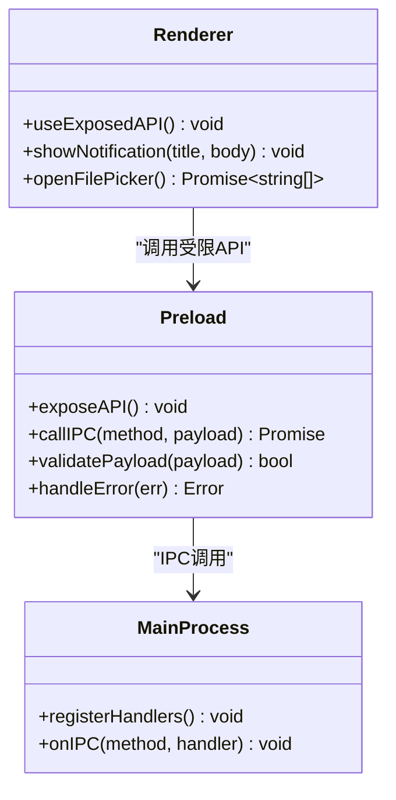
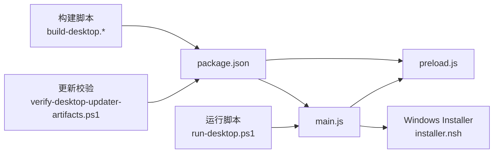

# 桌面应用

<cite>
**本文引用的文件**   
- [apps/dsa-desktop/main.js](file://apps/dsa-desktop/main.js)
- [apps/dsa-desktop/preload.js](file://apps/dsa-desktop/preload.js)
- [apps/dsa-desktop/package.json](file://apps/dsa-desktop/package.json)
- [apps/dsa-desktop/installer.nsh](file://apps/dsa-desktop/installer.nsh)
- [scripts/build-desktop.ps1](file://scripts/build-desktop.ps1)
- [scripts/build-desktop-macos.sh](file://scripts/build-desktop-macos.sh)
- [scripts/run-desktop.ps1](file://scripts/run-desktop.ps1)
- [scripts/verify-desktop-updater-artifacts.ps1](file://scripts/verify-desktop-updater-artifacts.ps1)
- [docs/desktop-package.md](file://docs/desktop-package.md)
</cite>

## 目录
1. [简介](#简介)
2. [项目结构](#项目结构)
3. [核心组件](#核心组件)
4. [架构总览](#架构总览)
5. [详细组件分析](#详细组件分析)
6. [依赖关系分析](#依赖关系分析)
7. [性能考虑](#性能考虑)
8. [故障排查指南](#故障排查指南)
9. [结论](#结论)
10. [附录](#附录)

## 简介
本仓库包含一个基于 Electron 的跨平台桌面应用（dsa-desktop），用于承载 Web 前端与后端服务，提供本地化、离线友好的使用体验。文档聚焦以下目标：
- 主进程与渲染进程的通信机制、安全配置与权限管理
- 窗口管理与系统托盘集成
- 原生功能调用与 IPC 安全边界
- 打包、签名与自动更新机制
- 跨平台兼容性处理、性能优化与资源管理
- 开发环境搭建、调试技巧与发布流程

## 项目结构
Electron 桌面端位于 apps/dsa-desktop，包含主进程入口、预加载脚本、打包配置与安装器脚本；构建与发布脚本位于 scripts；相关文档位于 docs。

图表来源
- [apps/dsa-desktop/main.js](file://apps/dsa-desktop/main.js)
- [apps/dsa-desktop/preload.js](file://apps/dsa-desktop/preload.js)
- [apps/dsa-desktop/package.json](file://apps/dsa-desktop/package.json)
- [apps/dsa-desktop/installer.nsh](file://apps/dsa-desktop/installer.nsh)
- [scripts/build-desktop.ps1](file://scripts/build-desktop.ps1)
- [scripts/build-desktop-macos.sh](file://scripts/build-desktop-macos.sh)
- [scripts/run-desktop.ps1](file://scripts/run-desktop.ps1)
- [scripts/verify-desktop-updater-artifacts.ps1](file://scripts/verify-desktop-updater-artifacts.ps1)
- [docs/desktop-package.md](file://docs/desktop-package.md)

章节来源
- [apps/dsa-desktop/package.json](file://apps/dsa-desktop/package.json)
- [apps/dsa-desktop/main.js](file://apps/dsa-desktop/main.js)
- [apps/dsa-desktop/preload.js](file://apps/dsa-desktop/preload.js)
- [apps/dsa-desktop/installer.nsh](file://apps/dsa-desktop/installer.nsh)
- [scripts/build-desktop.ps1](file://scripts/build-desktop.ps1)
- [scripts/build-desktop-macos.sh](file://scripts/build-desktop-macos.sh)
- [scripts/run-desktop.ps1](file://scripts/run-desktop.ps1)
- [scripts/verify-desktop-updater-artifacts.ps1](file://scripts/verify-desktop-updater-artifacts.ps1)
- [docs/desktop-package.md](file://docs/desktop-package.md)

## 核心组件
- 主进程（main.js）
  - 负责创建 BrowserWindow、注册菜单、系统托盘、生命周期事件、IPC 通道与权限控制
  - 管理应用启动顺序、加载渲染页面、处理窗口状态与持久化
- 预加载脚本（preload.js）
  - 通过 contextBridge 暴露最小 API 给渲染进程，实现受控 IPC
  - 隔离 Node.js 能力，限制渲染进程直接访问敏感模块
- 包配置（package.json）
  - 定义 Electron 版本、入口、打包参数、平台特定配置与更新相关字段
- 安装器脚本（installer.nsh）
  - Windows 安装包定制逻辑（如安装选项、快捷方式、卸载行为等）
- 构建与发布脚本
  - build-desktop.ps1 / build-desktop-macos.sh：跨平台打包
  - run-desktop.ps1：本地快速运行
  - verify-desktop-updater-artifacts.ps1：校验自动更新产物完整性

章节来源
- [apps/dsa-desktop/main.js](file://apps/dsa-desktop/main.js)
- [apps/dsa-desktop/preload.js](file://apps/dsa-desktop/preload.js)
- [apps/dsa-desktop/package.json](file://apps/dsa-desktop/package.json)
- [apps/dsa-desktop/installer.nsh](file://apps/dsa-desktop/installer.nsh)
- [scripts/build-desktop.ps1](file://scripts/build-desktop.ps1)
- [scripts/build-desktop-macos.sh](file://scripts/build-desktop-macos.sh)
- [scripts/run-desktop.ps1](file://scripts/run-desktop.ps1)
- [scripts/verify-desktop-updater-artifacts.ps1](file://scripts/verify-desktop-updater-artifacts.ps1)

## 架构总览
下图展示主进程、预加载脚本与渲染进程之间的交互，以及对外部服务（Web UI/后端）的调用路径。

图表来源
- [apps/dsa-desktop/main.js](file://apps/dsa-desktop/main.js)
- [apps/dsa-desktop/preload.js](file://apps/dsa-desktop/preload.js)
- [apps/dsa-desktop/renderer/loading.html](file://apps/dsa-desktop/renderer/loading.html)

章节来源
- [apps/dsa-desktop/main.js](file://apps/dsa-desktop/main.js)
- [apps/dsa-desktop/preload.js](file://apps/dsa-desktop/preload.js)
- [apps/dsa-desktop/renderer/loading.html](file://apps/dsa-desktop/renderer/loading.html)

## 详细组件分析

### 主进程（main.js）
职责与要点
- 应用生命周期：启动、就绪、关闭、退出前清理
- 窗口管理：创建 BrowserWindow、设置尺寸与位置、监听显示/隐藏/关闭事件
- 系统托盘：创建托盘图标、上下文菜单、点击行为
- IPC 通道：注册安全的方法映射，仅暴露必要能力
- 权限与安全：禁用不必要的 Node 集成、启用沙箱、限制远程模块访问
- 资源加载：优先加载本地静态资源，必要时回退到在线资源

图表来源
- [apps/dsa-desktop/main.js](file://apps/dsa-desktop/main.js)

章节来源
- [apps/dsa-desktop/main.js](file://apps/dsa-desktop/main.js)

### 预加载脚本（preload.js）
职责与要点
- 通过 contextBridge.exposeInMainWorld 暴露最小 API 集合
- 所有 IPC 调用均经过白名单校验，避免任意 Node 模块访问
- 对返回值进行类型与范围校验，防止注入攻击
- 为渲染进程提供统一的错误处理与重试策略

图表来源
- [apps/dsa-desktop/preload.js](file://apps/dsa-desktop/preload.js)

章节来源
- [apps/dsa-desktop/preload.js](file://apps/dsa-desktop/preload.js)

### 包配置（package.json）
职责与要点
- 指定 Electron 版本、主进程入口、打包目标平台
- 配置打包产物名称、图标、版本号与更新源
- 定义开发/生产环境变量与脚本命令
- 可选地声明自动更新所需字段（如 updater 相关）

章节来源
- [apps/dsa-desktop/package.json](file://apps/dsa-desktop/package.json)

### 安装器脚本（installer.nsh）
职责与要点
- 自定义 Windows 安装流程（向导、安装选项、快捷方式、注册表项）
- 支持静默安装、卸载清理、升级覆盖
- 与打包工具链集成，生成可分发的安装包

章节来源
- [apps/dsa-desktop/installer.nsh](file://apps/dsa-desktop/installer.nsh)

### 构建与发布脚本
- build-desktop.ps1（Windows）
  - 安装依赖、构建前端资源、调用 Electron 打包工具生成安装包/可执行文件
  - 输出产物命名规则、签名与代码签名证书配置
- build-desktop-macos.sh（macOS）
  - 构建前端、打包为 dmg/pkg、设置应用签名与公证
- run-desktop.ps1
  - 本地开发快速启动，支持热重载与调试端口
- verify-desktop-updater-artifacts.ps1
  - 校验自动更新产物哈希、签名与元数据一致性

章节来源
- [scripts/build-desktop.ps1](file://scripts/build-desktop.ps1)
- [scripts/build-desktop-macos.sh](file://scripts/build-desktop-macos.sh)
- [scripts/run-desktop.ps1](file://scripts/run-desktop.ps1)
- [scripts/verify-desktop-updater-artifacts.ps1](file://scripts/verify-desktop-updater-artifacts.ps1)

## 依赖关系分析
Electron 桌面端依赖关系如下：
- main.js 依赖 preload.js 暴露的受限 API
- package.json 驱动构建与打包流程
- installer.nsh 被 Windows 打包工具链引用
- 构建脚本依赖 Node.js 环境与 Electron 打包工具

图表来源
- [apps/dsa-desktop/package.json](file://apps/dsa-desktop/package.json)
- [apps/dsa-desktop/main.js](file://apps/dsa-desktop/main.js)
- [apps/dsa-desktop/preload.js](file://apps/dsa-desktop/preload.js)
- [apps/dsa-desktop/installer.nsh](file://apps/dsa-desktop/installer.nsh)
- [scripts/build-desktop.ps1](file://scripts/build-desktop.ps1)
- [scripts/build-desktop-macos.sh](file://scripts/build-desktop-macos.sh)
- [scripts/run-desktop.ps1](file://scripts/run-desktop.ps1)
- [scripts/verify-desktop-updater-artifacts.ps1](file://scripts/verify-desktop-updater-artifacts.ps1)

章节来源
- [apps/dsa-desktop/package.json](file://apps/dsa-desktop/package.json)
- [apps/dsa-desktop/main.js](file://apps/dsa-desktop/main.js)
- [apps/dsa-desktop/preload.js](file://apps/dsa-desktop/preload.js)
- [apps/dsa-desktop/installer.nsh](file://apps/dsa-desktop/installer.nsh)
- [scripts/build-desktop.ps1](file://scripts/build-desktop.ps1)
- [scripts/build-desktop-macos.sh](file://scripts/build-desktop-macos.sh)
- [scripts/run-desktop.ps1](file://scripts/run-desktop.ps1)
- [scripts/verify-desktop-updater-artifacts.ps1](file://scripts/verify-desktop-updater-artifacts.ps1)

## 性能考虑
- 渲染进程
  - 使用懒加载与虚拟列表减少首屏压力
  - 避免在主线程执行重计算，必要时使用 Worker
- 主进程
  - 合理拆分 IPC 处理器，避免阻塞事件循环
  - 缓存频繁读取的配置与静态资源
- 网络与 I/O
  - 合并请求、启用压缩与缓存策略
  - 对大文件下载采用流式处理
- 内存管理
  - 及时释放图片与大数据对象引用
  - 监控内存峰值，设置合理的堆大小

[本节为通用指导，不直接分析具体文件]

## 故障排查指南
常见问题与定位步骤
- 启动失败
  - 检查 Node/Electron 版本兼容性与依赖安装
  - 查看控制台日志与崩溃转储
- IPC 调用异常
  - 确认 preload 暴露的方法名与参数结构一致
  - 检查主进程处理器是否注册成功
- 窗口无法显示
  - 验证加载路径与静态资源可用性
  - 检查浏览器模式与沙箱配置
- 自动更新失败
  - 校验更新服务器可达性与签名有效性
  - 核对产物哈希与元数据一致性

章节来源
- [apps/dsa-desktop/main.js](file://apps/dsa-desktop/main.js)
- [apps/dsa-desktop/preload.js](file://apps/dsa-desktop/preload.js)
- [scripts/verify-desktop-updater-artifacts.ps1](file://scripts/verify-desktop-updater-artifacts.ps1)

## 结论
本桌面应用通过 Electron 将 Web 前端与系统能力结合，借助主进程与预加载脚本的安全边界实现可控的原生能力调用。配合完善的构建与发布脚本，可在多平台上稳定打包与分发。建议在生产环境中严格遵循最小权限原则、启用代码签名与自动更新校验，持续优化渲染性能与内存占用，确保用户体验与安全性。

[本节为总结性内容，不直接分析具体文件]

## 附录

### 开发环境搭建
- 安装 Node.js 与 npm/yarn
- 进入 dsa-desktop 目录安装依赖
- 使用运行脚本启动本地开发环境
- 按需修改主进程与预加载脚本，观察控制台日志

章节来源
- [scripts/run-desktop.ps1](file://scripts/run-desktop.ps1)
- [apps/dsa-desktop/package.json](file://apps/dsa-desktop/package.json)

### 调试技巧
- 启用开发者工具：在开发模式下自动开启
- 断点调试：在 main.js 与 preload.js 中设置断点
- 日志输出：统一日志格式，区分信息级别
- 网络抓包：拦截 HTTP/SSE 请求，验证接口契约

章节来源
- [apps/dsa-desktop/main.js](file://apps/dsa-desktop/main.js)
- [apps/dsa-desktop/preload.js](file://apps/dsa-desktop/preload.js)

### 打包与签名
- Windows：使用 PowerShell 脚本构建并生成安装包，配置代码签名证书
- macOS：使用 Shell 脚本构建并生成 dmg/pkg，完成应用签名与公证
- 产物校验：校验更新包签名与哈希，确保完整性

章节来源
- [scripts/build-desktop.ps1](file://scripts/build-desktop.ps1)
- [scripts/build-desktop-macos.sh](file://scripts/build-desktop-macos.sh)
- [scripts/verify-desktop-updater-artifacts.ps1](file://scripts/verify-desktop-updater-artifacts.ps1)
- [docs/desktop-package.md](file://docs/desktop-package.md)

### 自动更新机制
- 更新源配置：在包配置中声明更新服务器地址与版本信息
- 增量更新：优先采用差分更新以减少带宽消耗
- 安全校验：校验签名与哈希，失败则回滚并提示用户

章节来源
- [apps/dsa-desktop/package.json](file://apps/dsa-desktop/package.json)
- [scripts/verify-desktop-updater-artifacts.ps1](file://scripts/verify-desktop-updater-artifacts.ps1)
- [docs/desktop-package.md](file://docs/desktop-package.md)

### 跨平台兼容性处理
- 路径分隔符与编码差异：统一使用相对路径与 UTF-8
- 系统托盘与快捷键：按平台适配图标与组合键
- 权限与沙箱：根据平台特性调整安全策略

章节来源
- [apps/dsa-desktop/main.js](file://apps/dsa-desktop/main.js)
- [apps/dsa-desktop/installer.nsh](file://apps/dsa-desktop/installer.nsh)