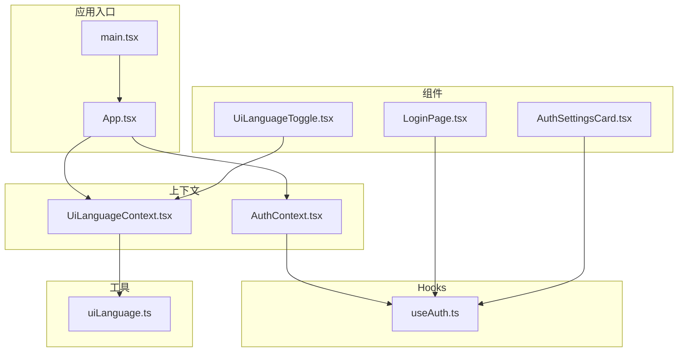
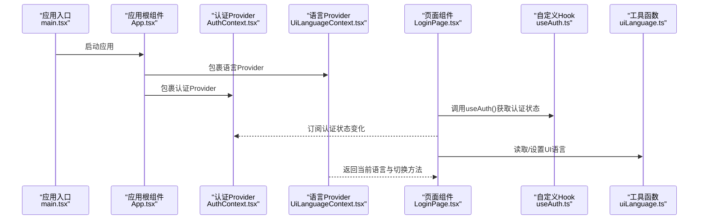
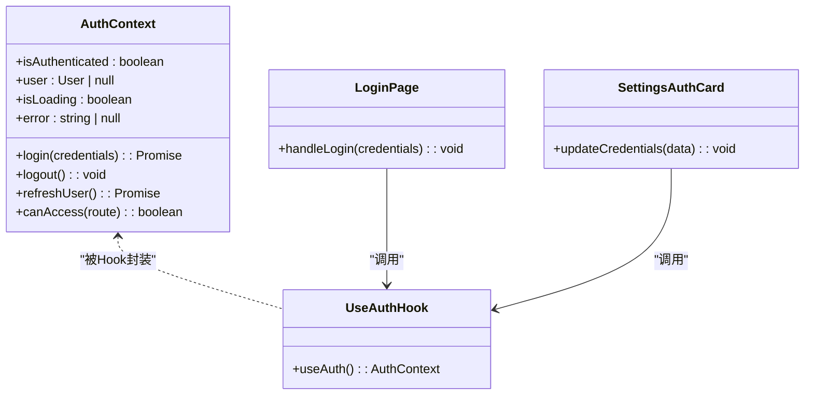
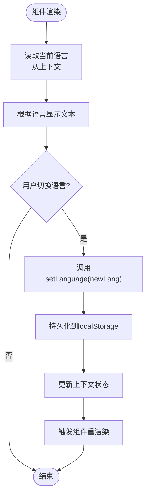
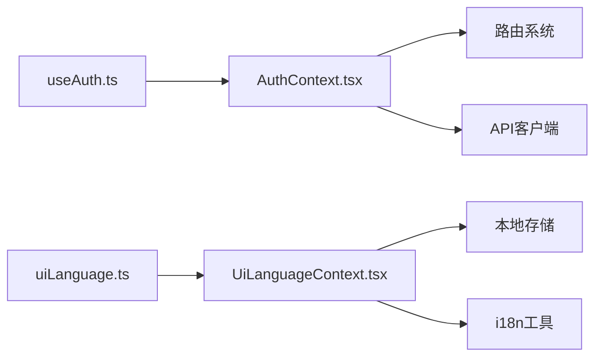

# React Context

<cite>
**本文引用的文件**   
- [AuthContext.tsx](file://apps/dsa-web/src/contexts/AuthContext.tsx)
- [UiLanguageContext.tsx](file://apps/dsa-web/src/contexts/UiLanguageContext.tsx)
- [useAuth.ts](file://apps/dsa-web/src/hooks/useAuth.ts)
- [uiLanguage.ts](file://apps/dsa-web/src/utils/uiLanguage.ts)
- [App.tsx](file://apps/dsa-web/src/App.tsx)
- [main.tsx](file://apps/dsa-web/src/main.tsx)
- [AuthSettingsCard.tsx](file://apps/dsa-web/src/components/settings/AuthSettingsCard.tsx)
- [UiLanguageToggle.tsx](file://apps/dsa-web/src/components/i18n/UiLanguageToggle.tsx)
- [LoginPage.tsx](file://apps/dsa-web/src/pages/LoginPage.tsx)
- [AuthContext.test.tsx](file://apps/dsa-web/src/contexts/__tests__/AuthContext.test.tsx)
- [UiLanguageContext.test.tsx](file://apps/dsa-web/src/contexts/__tests__/UiLanguageContext.test.tsx)
</cite>

## 目录
1. [简介](#简介)
2. [项目结构](#项目结构)
3. [核心组件](#核心组件)
4. [架构总览](#架构总览)
5. [详细组件分析](#详细组件分析)
6. [依赖关系分析](#依赖关系分析)
7. [性能考量](#性能考量)
8. [故障排查指南](#故障排查指南)
9. [结论](#结论)
10. [附录](#附录)

## 简介
本文件面向使用 React Context 进行全局状态管理的开发者，聚焦于本项目中的两个关键上下文：
- AuthContext：用户认证上下文，负责登录态、用户信息、鉴权守卫与相关副作用（如路由跳转）。
- UiLanguageContext：界面语言上下文，负责应用级 UI 语言的读写与切换。

文档将阐述 Context 的设计原则、Provider 配置、Consumer 使用模式、与 Zustand 的结合策略、状态同步机制与重渲染优化方法，并给出测试方法与迁移指南，覆盖多语言支持与用户认证等典型场景。

## 项目结构
在 dsa-web 前端应用中，Context 定义位于 src/contexts，Hook 封装位于 src/hooks，工具函数位于 src/utils，页面与组件通过 Hook 消费上下文。入口文件 main.tsx 或 App.tsx 中会挂载 Provider，确保全局可用。

图表来源
- [main.tsx](file://apps/dsa-web/src/main.tsx)
- [App.tsx](file://apps/dsa-web/src/App.tsx)
- [AuthContext.tsx](file://apps/dsa-web/src/contexts/AuthContext.tsx)
- [UiLanguageContext.tsx](file://apps/dsa-web/src/contexts/UiLanguageContext.tsx)
- [useAuth.ts](file://apps/dsa-web/src/hooks/useAuth.ts)
- [uiLanguage.ts](file://apps/dsa-web/src/utils/uiLanguage.ts)
- [LoginPage.tsx](file://apps/dsa-web/src/pages/LoginPage.tsx)
- [AuthSettingsCard.tsx](file://apps/dsa-web/src/components/settings/AuthSettingsCard.tsx)
- [UiLanguageToggle.tsx](file://apps/dsa-web/src/components/i18n/UiLanguageToggle.tsx)

章节来源
- [main.tsx](file://apps/dsa-web/src/main.tsx)
- [App.tsx](file://apps/dsa-web/src/App.tsx)

## 核心组件
- AuthContext：提供认证状态（是否已登录、用户信息）、登录/登出动作、错误处理与路由保护逻辑。通常由根组件包裹 Provider，并通过 useAuth Hook 暴露给子树。
- UiLanguageContext：提供当前 UI 语言、设置语言的方法，并与持久化存储（如 localStorage）集成，保证刷新后语言偏好不丢失。

设计原则
- 单一职责：每个 Context 只管理一类全局状态。
- 最小暴露：仅导出必要的值与方法，避免过度耦合。
- 可测试性：提供测试用的初始状态与模拟数据。
- 可扩展性：预留扩展点（如新增认证字段、新增语言包）。

章节来源
- [AuthContext.tsx](file://apps/dsa-web/src/contexts/AuthContext.tsx)
- [UiLanguageContext.tsx](file://apps/dsa-web/src/contexts/UiLanguageContext.tsx)

## 架构总览
下图展示了认证与语言上下文的装配与消费流程，包括 Provider 的挂载位置、Hook 的使用方式以及组件如何响应状态变化。

图表来源
- [main.tsx](file://apps/dsa-web/src/main.tsx)
- [App.tsx](file://apps/dsa-web/src/App.tsx)
- [AuthContext.tsx](file://apps/dsa-web/src/contexts/AuthContext.tsx)
- [UiLanguageContext.tsx](file://apps/dsa-web/src/contexts/UiLanguageContext.tsx)
- [useAuth.ts](file://apps/dsa-web/src/hooks/useAuth.ts)
- [uiLanguage.ts](file://apps/dsa-web/src/utils/uiLanguage.ts)
- [LoginPage.tsx](file://apps/dsa-web/src/pages/LoginPage.tsx)

## 详细组件分析

### 认证上下文（AuthContext）
职责
- 维护认证状态：是否已登录、用户基本信息、加载状态、错误信息。
- 提供动作：登录、登出、刷新用户信息。
- 提供守卫：根据认证状态控制路由访问。
- 与后端 API 交互：发起认证请求、处理响应与错误。

实现要点
- 使用 useState/useReducer 管理状态，结合 useEffect 处理副作用（如初始化检查、监听 token 变化）。
- 通过 useMemo/useCallback 稳定回调引用，减少不必要的重渲染。
- 在 Provider 中集中处理错误与边界情况（网络异常、无效 token）。
- 与路由系统集成，未登录时重定向到登录页。

图表来源
- [AuthContext.tsx](file://apps/dsa-web/src/contexts/AuthContext.tsx)
- [useAuth.ts](file://apps/dsa-web/src/hooks/useAuth.ts)
- [LoginPage.tsx](file://apps/dsa-web/src/pages/LoginPage.tsx)
- [AuthSettingsCard.tsx](file://apps/dsa-web/src/components/settings/AuthSettingsCard.tsx)

章节来源
- [AuthContext.tsx](file://apps/dsa-web/src/contexts/AuthContext.tsx)
- [useAuth.ts](file://apps/dsa-web/src/hooks/useAuth.ts)
- [LoginPage.tsx](file://apps/dsa-web/src/pages/LoginPage.tsx)
- [AuthSettingsCard.tsx](file://apps/dsa-web/src/components/settings/AuthSettingsCard.tsx)

### 界面语言上下文（UiLanguageContext）
职责
- 维护当前 UI 语言（如 zh-CN、en-US）。
- 提供设置语言的方法，并持久化到本地存储。
- 为组件提供语言切换能力，影响文本显示与布局。

实现要点
- 使用 useState 管理语言状态，结合 useEffect 初始化时从本地存储恢复。
- 提供 setLanguage 方法，更新状态并写入持久化存储。
- 与 i18n 工具函数协作，确保语言键值映射正确。

图表来源
- [UiLanguageContext.tsx](file://apps/dsa-web/src/contexts/UiLanguageContext.tsx)
- [uiLanguage.ts](file://apps/dsa-web/src/utils/uiLanguage.ts)
- [UiLanguageToggle.tsx](file://apps/dsa-web/src/components/i18n/UiLanguageToggle.tsx)

章节来源
- [UiLanguageContext.tsx](file://apps/dsa-web/src/contexts/UiLanguageContext.tsx)
- [uiLanguage.ts](file://apps/dsa-web/src/utils/uiLanguage.ts)
- [UiLanguageToggle.tsx](file://apps/dsa-web/src/components/i18n/UiLanguageToggle.tsx)

### 与 Zustand 的结合使用
当应用规模扩大，Context 可能不再适合管理复杂状态。推荐策略：
- 将“跨组件但非全局”的状态（如表单、列表筛选）放入 Zustand store。
- 将“真正全局且频繁变更”的状态（如认证、主题、语言）保留在 Context。
- 在 Context 中订阅 Zustand store 的变化，或通过 Hook 组合两者。

优势
- 减少 Context 的负载，避免不必要的重渲染。
- 利用 Zustand 的细粒度订阅与中间件生态。

注意
- 避免在 Context 中直接操作 Zustand store 的复杂逻辑，保持职责清晰。
- 使用 memoization 与选择性订阅，防止连锁更新。

[本节为概念性说明，不直接分析具体文件]

## 依赖关系分析
Context 之间的依赖关系应保持松散，避免循环依赖。认证上下文可能与路由系统、API 客户端交互；语言上下文与本地存储、i18n 工具交互。

图表来源
- [AuthContext.tsx](file://apps/dsa-web/src/contexts/AuthContext.tsx)
- [UiLanguageContext.tsx](file://apps/dsa-web/src/contexts/UiLanguageContext.tsx)
- [useAuth.ts](file://apps/dsa-web/src/hooks/useAuth.ts)
- [uiLanguage.ts](file://apps/dsa-web/src/utils/uiLanguage.ts)

章节来源
- [AuthContext.tsx](file://apps/dsa-web/src/contexts/AuthContext.tsx)
- [UiLanguageContext.tsx](file://apps/dsa-web/src/contexts/UiLanguageContext.tsx)
- [useAuth.ts](file://apps/dsa-web/src/hooks/useAuth.ts)
- [uiLanguage.ts](file://apps/dsa-web/src/utils/uiLanguage.ts)

## 性能考量
- 拆分 Context：将认证与语言分离，避免一个状态变化导致整个子树重渲染。
- 使用 useMemo/useCallback：稳定对象与函数引用，减少子组件不必要的更新。
- 选择性订阅：在组件中仅订阅所需字段，而非整个上下文对象。
- 延迟加载：对非关键路径的 Provider 进行懒加载。
- 与 Zustand 结合：将高频更新的状态移出 Context，降低重渲染频率。

[本节为通用指导，不直接分析具体文件]

## 故障排查指南
常见问题与解决思路
- 认证状态不同步：检查 Provider 是否正确包裹根组件，确认 useAuth 是否在正确的子树中使用。
- 语言切换无效：确认 setLanguage 是否被调用，本地存储是否可写，i18n 工具是否正确映射。
- 重渲染过多：检查是否有新的对象或函数引用被创建，考虑使用 memoization。
- 测试失败：确保测试环境中正确初始化 Provider，模拟必要的外部依赖（如 API、存储）。

章节来源
- [AuthContext.test.tsx](file://apps/dsa-web/src/contexts/__tests__/AuthContext.test.tsx)
- [UiLanguageContext.test.tsx](file://apps/dsa-web/src/contexts/__tests__/UiLanguageContext.test.tsx)

## 结论
React Context 在本项目中用于管理认证与界面语言两类全局状态，通过 Provider 与 Hook 的组合实现了清晰的职责划分与良好的可测试性。结合 Zustand 可以进一步优化性能与可维护性。遵循本文档的设计原则与最佳实践，可以有效提升应用的稳定性与开发效率。

[本节为总结性内容，不直接分析具体文件]

## 附录
- 多语言支持：通过 UiLanguageContext 统一管理语言，配合 i18n 工具实现动态切换。
- 用户认证：通过 AuthContext 管理登录态，结合路由守卫实现权限控制。
- 测试方法：使用测试框架模拟 Provider 与外部依赖，验证状态变化与副作用。
- 迁移指南：逐步将复杂状态迁移至 Zustand，保留 Context 用于真正全局的状态。

[本节为补充信息，不直接分析具体文件]