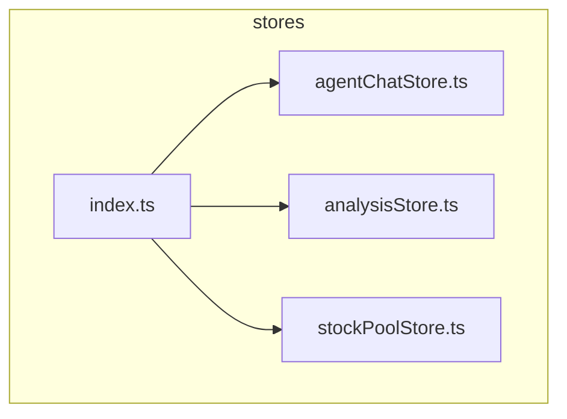
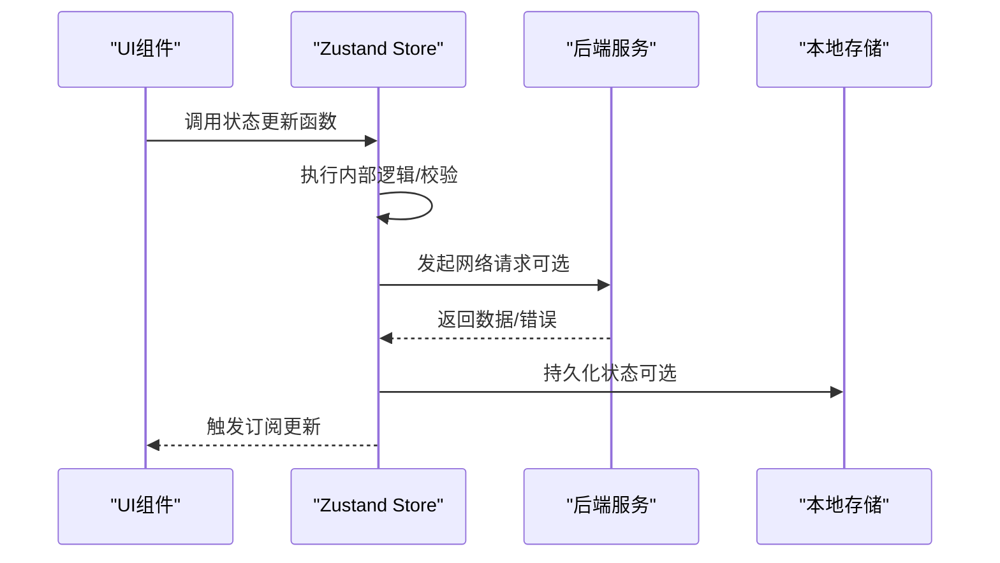
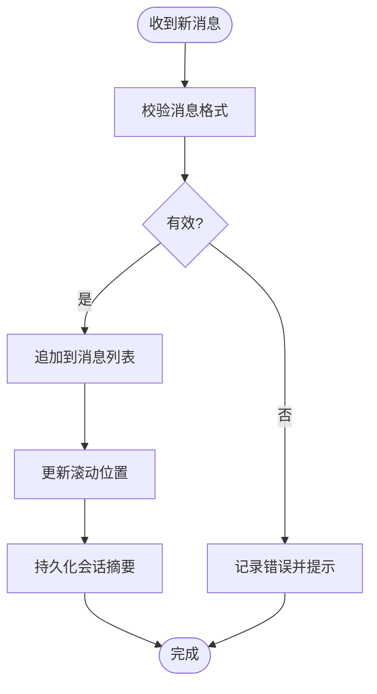
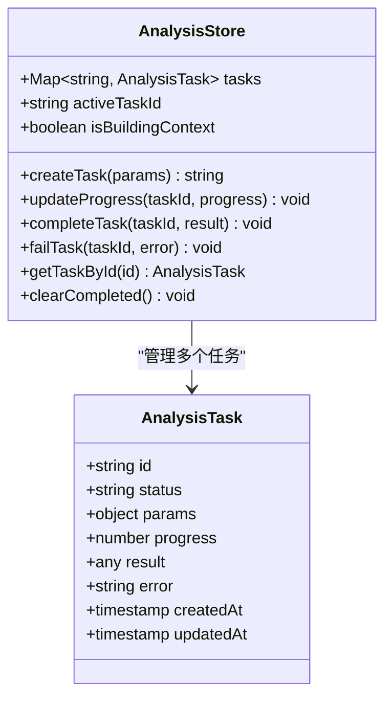
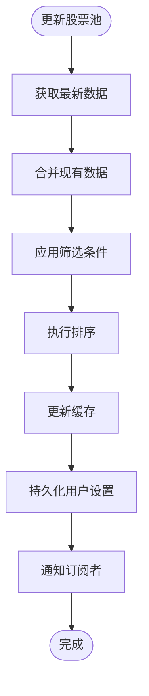
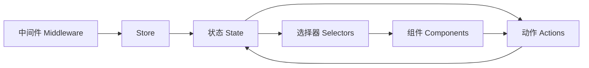
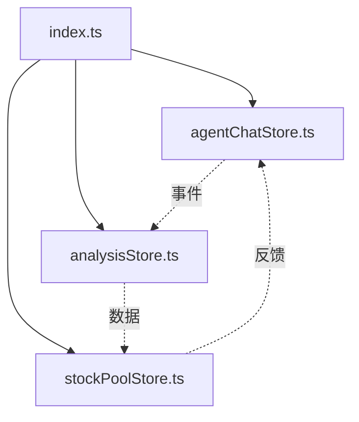

# Zustand状态存储

<cite>
**本文档引用的文件**   
- [agentChatStore.ts](file://apps/dsa-web/src/stores/agentChatStore.ts)
- [analysisStore.ts](file://apps/dsa-web/src/stores/analysisStore.ts)
- [stockPoolStore.ts](file://apps/dsa-web/src/stores/stockPoolStore.ts)
- [index.ts](file://apps/dsa-web/src/stores/index.ts)
- [agentChatStore.test.ts](file://apps/dsa-web/src/stores/__tests__/agentChatStore.test.ts)
- [stockPoolStore.test.ts](file://apps/dsa-web/src/stores/__tests__/stockPoolStore.test.ts)
</cite>

## 目录
1. [简介](#简介)
2. [项目结构](#项目结构)
3. [核心组件](#核心组件)
4. [架构总览](#架构总览)
5. [详细组件分析](#详细组件分析)
6. [依赖关系分析](#依赖关系分析)
7. [性能考虑](#性能考虑)
8. [故障排查指南](#故障排查指南)
9. [结论](#结论)
10. [附录](#附录)

## 简介
本文件面向前端应用中的全局状态管理，聚焦于基于Zustand的状态存储实现。文档围绕以下目标展开：
- 解释全局状态管理模式与职责划分
- 详细说明 agentChatStore、analysisStore、stockPoolStore 等核心状态存储的实现要点
- 梳理状态结构设计、数据持久化策略、状态更新模式与性能优化技巧
- 阐述状态订阅机制、中间件使用与调试方法
- 提供状态测试策略与最佳实践
- 给出复杂业务场景下的状态管理解决方案

## 项目结构
在前端应用中，Zustand状态存储位于 apps/dsa-web/src/stores 目录下，采用“按功能域拆分”的组织方式：
- agentChatStore.ts：负责聊天对话、消息流、上下文等与Agent交互相关的状态
- analysisStore.ts：负责分析任务、结果、历史、上下文等与分析流程相关的状态
- stockPoolStore.ts：负责股票池、筛选条件、缓存等与标的管理相关的状态
- index.ts：统一导出各store，便于在应用其他模块中按需引入

图表来源
- [index.ts](file://apps/dsa-web/src/stores/index.ts)
- [agentChatStore.ts](file://apps/dsa-web/src/stores/agentChatStore.ts)
- [analysisStore.ts](file://apps/dsa-web/src/stores/analysisStore.ts)
- [stockPoolStore.ts](file://apps/dsa-web/src/stores/stockPoolStore.ts)

章节来源
- [index.ts](file://apps/dsa-web/src/stores/index.ts)

## 核心组件
本节对三个核心状态存储进行概览性说明，涵盖其职责边界、典型状态字段、常用操作与副作用处理。

- agentChatStore（聊天对话）
  - 职责：维护会话消息列表、当前选中会话、输入状态、加载态、错误信息等
  - 典型操作：发送消息、追加响应、清空会话、切换会话、标记已读/未读
  - 副作用：与后端SSE或HTTP接口集成，处理流式响应与错误重试
  - 持久化：可选将最近会话摘要或关键配置持久化到本地存储

- analysisStore（分析任务）
  - 职责：管理分析任务队列、任务进度、结果缓存、上下文构建状态
  - 典型操作：创建任务、查询进度、获取结果、清理缓存、批量操作
  - 副作用：调用分析服务API，处理并发与超时，合并增量结果
  - 持久化：将任务元数据与结果摘要持久化，支持离线查看

- stockPoolStore（股票池）
  - 职责：维护股票列表、筛选条件、排序规则、分页与缓存
  - 典型操作：添加/移除股票、更新筛选器、刷新数据、导出导入
  - 副作用：拉取行情与基本面数据，去重与校验，失败回退
  - 持久化：将用户自定义筛选与收藏列表持久化

章节来源
- [agentChatStore.ts](file://apps/dsa-web/src/stores/agentChatStore.ts)
- [analysisStore.ts](file://apps/dsa-web/src/stores/analysisStore.ts)
- [stockPoolStore.ts](file://apps/dsa-web/src/stores/stockPoolStore.ts)

## 架构总览
Zustand状态存储在应用中作为单一数据源，被UI组件通过hooks订阅。整体数据流遵循“单向数据流”原则：
- UI触发action（状态更新函数）
- store内部执行逻辑（可能包含异步请求、计算派生状态）
- 状态变更通知订阅者（组件重新渲染）
- 可选的持久化中间件将状态同步到本地存储

图表来源
- [agentChatStore.ts](file://apps/dsa-web/src/stores/agentChatStore.ts)
- [analysisStore.ts](file://apps/dsa-web/src/stores/analysisStore.ts)
- [stockPoolStore.ts](file://apps/dsa-web/src/stores/stockPoolStore.ts)

## 详细组件分析

### agentChatStore 分析
- 状态设计
  - 消息集合：按时间顺序维护消息数组，包含角色、内容、时间戳、状态等
  - 会话上下文：当前会话ID、标题、最后更新时间、是否活跃
  - 交互状态：输入文本、发送中标志、错误信息、滚动位置
- 更新模式
  - 原子更新：每次变更仅修改必要字段，避免全量替换
  - 不可变更新：使用函数式更新确保引用稳定，减少重渲染
  - 批处理：批量追加消息时合并更新，降低渲染次数
- 副作用处理
  - 流式响应：逐步追加片段，保持滚动到底部
  - 错误重试：指数退避与最大重试次数控制
  - 取消请求：组件卸载时中止未完成请求
- 持久化策略
  - 选择性持久化：仅持久化会话元数据与关键消息摘要
  - 版本兼容：持久化数据结构升级时的迁移逻辑
- 性能优化
  - 选择器订阅：组件仅订阅所需字段，避免无关更新
  - 虚拟滚动：长消息列表使用虚拟滚动提升性能
  - 防抖节流：输入框与搜索框使用防抖减少频繁更新

图表来源
- [agentChatStore.ts](file://apps/dsa-web/src/stores/agentChatStore.ts)

章节来源
- [agentChatStore.ts](file://apps/dsa-web/src/stores/agentChatStore.ts)

### analysisStore 分析
- 状态设计
  - 任务队列：待处理、进行中、已完成、失败的任务集合
  - 任务详情：每个任务的参数、进度、结果、错误信息
  - 上下文状态：分析上下文构建进度、缓存键、依赖项
- 更新模式
  - 状态机驱动：任务状态转换遵循明确的状态机
  - 增量更新：仅更新变化的字段，保持历史快照
  - 并发控制：限制同时进行的任务数量，避免资源竞争
- 副作用处理
  - 进度上报：实时接收进度事件并更新UI
  - 结果合并：多源结果合并与冲突解决
  - 异常恢复：失败任务自动重试或降级处理
- 持久化策略
  - 任务快照：定期保存任务状态与部分结果
  - 缓存策略：LRU缓存热门分析结果
  - 数据一致性：持久化前验证数据完整性
- 性能优化
  - 懒加载：按需加载任务详情与大图
  - 内存管理：及时释放已完成任务的大对象
  - 计算缓存：派生状态使用memoization缓存

图表来源
- [analysisStore.ts](file://apps/dsa-web/src/stores/analysisStore.ts)

章节来源
- [analysisStore.ts](file://apps/dsa-web/src/stores/analysisStore.ts)

### stockPoolStore 分析
- 状态设计
  - 股票列表：股票代码、名称、基本信息、市场分类
  - 筛选条件：行业、市值、涨跌幅、技术指标等
  - 排序与分页：排序字段、页码、每页数量
  - 缓存状态：上次更新时间、缓存命中率、错误计数
- 更新模式
  - 过滤链：链式过滤与组合条件
  - 增量同步：只更新变化的股票信息
  - 冲突解决：同名股票的去重与优先级规则
- 副作用处理
  - 数据源切换：主从数据源自动切换
  - 网络重试：失败请求的指数退避
  - 数据校验：入库前数据格式校验
- 持久化策略
  - 用户偏好：筛选条件与排序规则持久化
  - 收藏列表：用户自选股票持久化
  - 缓存策略：热点数据长期缓存
- 性能优化
  - 索引优化：为常用筛选字段建立索引
  - 分页加载：大数据集的分页与懒加载
  - 内存池：重用对象实例减少GC压力

图表来源
- [stockPoolStore.ts](file://apps/dsa-web/src/stores/stockPoolStore.ts)

章节来源
- [stockPoolStore.ts](file://apps/dsa-web/src/stores/stockPoolStore.ts)

### 概念总览
Zustand状态管理的核心概念包括：
- 状态（State）：应用的单一数据源
- 动作（Actions）：改变状态的函数
- 选择器（Selectors）：派生状态的计算函数
- 订阅（Subscribe）：监听状态变化的回调
- 中间件（Middleware）：扩展store功能的插件

[此图为概念图，不直接映射具体源码文件]

## 依赖关系分析
各store之间的依赖关系相对独立，主要通过index.ts进行统一导出。store之间应避免直接耦合，通过事件总线或共享服务进行通信。

图表来源
- [index.ts](file://apps/dsa-web/src/stores/index.ts)
- [agentChatStore.ts](file://apps/dsa-web/src/stores/agentChatStore.ts)
- [analysisStore.ts](file://apps/dsa-web/src/stores/analysisStore.ts)
- [stockPoolStore.ts](file://apps/dsa-web/src/stores/stockPoolStore.ts)

章节来源
- [index.ts](file://apps/dsa-web/src/stores/index.ts)

## 性能考虑
- 选择器优化
  - 使用useSelector精确订阅所需字段
  - 避免在render中创建新的选择器函数
  - 合理使用浅比较和深比较策略
- 内存管理
  - 及时清理大对象和定时器
  - 使用WeakMap存储临时引用
  - 实现合理的垃圾回收策略
- 渲染优化
  - React.memo包裹纯组件
  - 虚拟列表处理大数据集
  - 延迟加载非关键数据
- 网络优化
  - 请求去重与缓存
  - 增量更新而非全量替换
  - 错误重试与降级策略

## 故障排查指南
- 常见问题
  - 状态不同步：检查store更新是否正确，避免直接修改状态
  - 内存泄漏：确认事件监听器和定时器的清理
  - 性能问题：分析重渲染原因，优化选择器使用
  - 数据不一致：检查异步操作的竞态条件
- 调试技巧
  - 使用Redux DevTools进行状态监控
  - 添加日志记录关键状态变更
  - 编写单元测试验证状态逻辑
  - 使用浏览器开发者工具分析性能
- 错误处理
  - 统一的错误捕获与上报
  - 友好的错误提示与恢复机制
  - 详细的错误日志与堆栈信息

章节来源
- [agentChatStore.test.ts](file://apps/dsa-web/src/stores/__tests__/agentChatStore.test.ts)
- [stockPoolStore.test.ts](file://apps/dsa-web/src/stores/__tests__/stockPoolStore.test.ts)

## 结论
Zustand状态管理为AI股票分析应用提供了简洁高效的全局状态解决方案。通过合理的设计模式和优化策略，可以实现高性能、可维护的状态管理架构。建议在实际开发中遵循本文档的最佳实践，确保代码质量和用户体验。

## 附录
- 相关文档链接
- 示例代码路径
- 第三方库版本信息
- 贡献指南